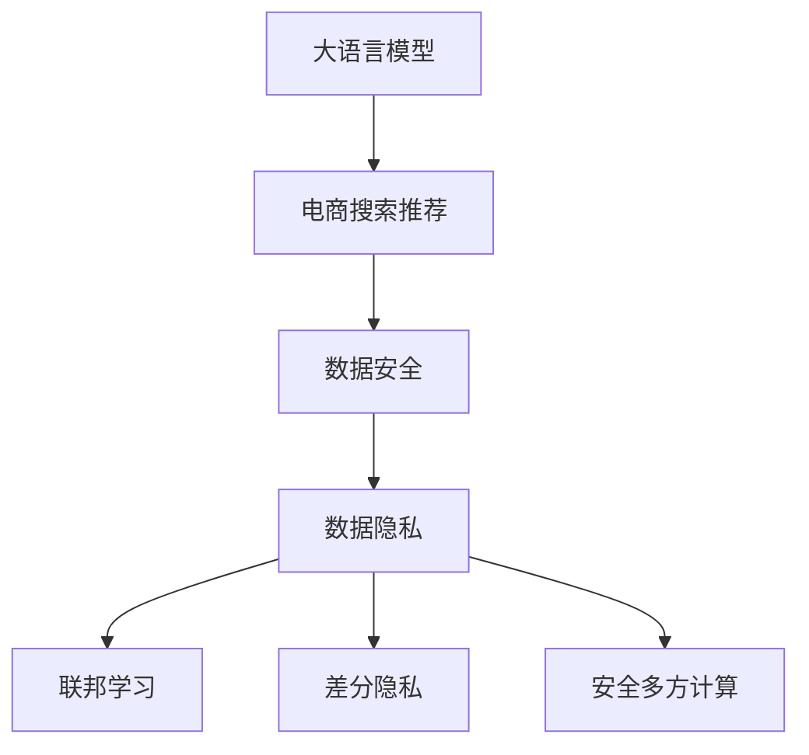

                 

# AI 大模型在电商搜索推荐中的数据安全策略：保障数据安全与用户隐私

## 1. 背景介绍

在数字化时代，电子商务平台逐渐成为人们日常生活中不可或缺的一部分。智能化的电商搜索推荐系统，能够根据用户的历史行为和偏好，实时推送相关商品，极大地提升了用户体验和销售效率。然而，这一过程依赖于大量的用户数据，这些数据往往蕴含着敏感的用户隐私信息。如何在提升搜索推荐性能的同时，保障用户数据的安全与隐私，成为电商平台和人工智能研究者面临的重要课题。

大语言模型和大规模预训练模型，通过在海量无标签文本数据上进行预训练，学习到丰富的语言知识，展现了强大的自然语言理解和生成能力。这些模型在电商搜索推荐领域中，被广泛应用于文本分类、意图识别、对话系统、推荐排序等诸多子任务。其高精度的预测能力，使得搜索推荐系统具备更强的个性化和多样性，能够满足不同用户的多样化需求。

尽管如此，由于大模型涉及的计算资源巨大，其训练和推理过程，往往需要依赖大规模数据和计算能力，因此在训练和推理过程中，如何保证数据安全与隐私，仍然是一个严峻的挑战。特别是在电商搜索推荐领域，用户的交易信息、浏览历史、个人信息等都可能被模型访问和使用，如何确保这些敏感数据的合法合规使用，成为了保障用户权益的关键问题。

## 2. 核心概念与联系

### 2.1 核心概念概述

为更好地理解大语言模型在电商搜索推荐中的数据安全策略，本节将介绍几个密切相关的核心概念：

- 大语言模型(Large Language Model, LLM)：如GPT-3、BERT等，通过大规模预训练获得通用语言理解能力，具备高度的泛化性和预测准确性。
- 电商搜索推荐系统：通过分析用户历史行为数据，预测用户下一步可能的操作，实现个性化推荐，提升用户转化率和满意度。
- 数据安全：指保护数据的机密性、完整性和可用性，防止未经授权的访问和数据泄露。
- 用户隐私：指个人在数字时代下，保持匿名性和控制自己数据使用权的能力。
- 联邦学习(Federated Learning, FL)：一种分布式机器学习范式，通过在不同设备或服务器端对模型进行局部训练，仅交换模型参数更新，不交换原始数据，保障数据隐私。
- 差分隐私(Differential Privacy, DP)：一种保护数据隐私的机制，通过在训练过程中引入噪声，使模型难以从单个样本推测整体数据分布。
- 安全多方计算(Secure Multi-party Computation, SMPC)：通过多方在不出泄各自数据的前提下，协同完成计算任务，保护数据隐私。

这些核心概念之间的逻辑关系可以通过以下Mermaid流程图来展示：



这个流程图展示了大语言模型在电商搜索推荐中的应用背景，以及数据安全与用户隐私的基本框架：

1. 大语言模型通过预训练获得基础能力，在电商搜索推荐中提供预测和推理功能。
2. 数据安全与隐私是电商搜索推荐中的核心需求，涉及数据的机密性、完整性和可用性。
3. 联邦学习和差分隐私是保障数据安全与隐私的关键技术，通过数据不出库的方式实现隐私保护。
4. 安全多方计算提供了一种多方协同计算的保护机制，确保各方数据不泄露的前提下协同完成计算任务。

这些概念共同构成了大语言模型在电商搜索推荐中的应用框架，使其能够在保障数据安全与隐私的前提下，提升推荐系统的性能和用户体验。

## 3. 核心算法原理 & 具体操作步骤

### 3.1 算法原理概述

基于大语言模型的电商搜索推荐，其核心算法原理主要包括以下几个方面：

1. 预训练：使用大规模无标签文本数据对大语言模型进行预训练，学习通用的语言表示和知识。
2. 微调：在电商搜索推荐的具体任务上，使用少量标注数据对模型进行微调，学习特定任务的特征表示。
3. 推荐排序：通过训练好的模型，对用户输入的查询语句和商品信息进行文本分类、意图识别、对话系统等任务，结合历史行为数据，生成个性化推荐列表。
4. 数据安全与隐私保护：在模型训练和推理过程中，采用联邦学习、差分隐私等技术，保护用户数据的隐私安全。

### 3.2 算法步骤详解

基于大语言模型的电商搜索推荐，其具体操作步骤可以分为以下几个关键步骤：

**Step 1: 准备预训练模型和数据集**
- 选择合适的预训练语言模型，如BERT、GPT-3等，作为初始化参数。
- 准备电商搜索推荐任务的数据集，包含用户历史行为数据和商品信息数据，划分为训练集、验证集和测试集。

**Step 2: 添加任务适配层**
- 根据电商推荐任务的类型，设计合适的任务适配层。如使用BERT进行文本分类任务，可以添加线性分类器和交叉熵损失函数。
- 对对话系统任务，可以添加Decoder进行多轮对话生成。

**Step 3: 设置微调超参数**
- 选择合适的优化算法及其参数，如AdamW、SGD等，设置学习率、批大小、迭代轮数等。
- 设置正则化技术及强度，包括权重衰减、Dropout、Early Stopping等。
- 确定冻结预训练参数的策略，如仅微调顶层，或全部参数都参与微调。

**Step 4: 执行梯度训练**
- 将训练集数据分批次输入模型，前向传播计算损失函数。
- 反向传播计算参数梯度，根据设定的优化算法和学习率更新模型参数。
- 周期性在验证集上评估模型性能，根据性能指标决定是否触发Early Stopping。
- 重复上述步骤直到满足预设的迭代轮数或Early Stopping条件。

**Step 5: 数据安全与隐私保护**
- 使用联邦学习或差分隐私技术，在模型训练过程中保护用户数据隐私。
- 对生成的推荐结果进行脱敏处理，保障用户隐私不被泄露。

**Step 6: 测试和部署**
- 在测试集上评估微调后模型在电商推荐任务上的性能。
- 使用微调后的模型对新商品进行推荐排序，集成到电商平台的搜索推荐系统中。
- 持续收集新的数据，定期重新微调模型，以适应数据分布的变化。

以上是基于大语言模型的电商搜索推荐的一般流程。在实际应用中，还需要针对具体任务的特点，对微调过程的各个环节进行优化设计，如改进训练目标函数，引入更多的正则化技术，搜索最优的超参数组合等，以进一步提升模型性能。

### 3.3 算法优缺点

基于大语言模型的电商搜索推荐方法具有以下优点：
1. 高效准确：预训练模型通过大规模数据学习到丰富的语言知识，能够高效准确地理解用户需求和商品信息，生成高质量的推荐结果。
2. 泛化能力强：大语言模型具备较强的泛化能力，能够适应不同用户的个性化需求，提升推荐系统的多样性和覆盖面。
3. 可解释性强：通过任务适配层的引入，可以直观地理解模型在特定任务上的决策过程，提升系统的可解释性和可信度。
4. 灵活性强：大语言模型可以适应不同的电商推荐任务，如文本分类、意图识别、对话系统等，具有良好的任务适配性。

同时，该方法也存在一定的局限性：
1. 数据需求高：电商推荐任务通常需要大量标注数据进行微调，获取高质量标注数据的成本较高。
2. 性能瓶颈：大规模语言模型的训练和推理需要高计算资源，可能导致性能瓶颈。
3. 隐私问题：在模型训练和推理过程中，如何保护用户隐私是一个复杂且重要的挑战。
4. 公平性问题：由于训练数据和算法设计的局限性，可能出现数据偏见和算法歧视等问题，影响推荐公平性。

尽管存在这些局限性，但就目前而言，基于大语言模型的电商推荐方法仍是目前电商推荐领域的主流范式。未来相关研究的重点在于如何进一步降低数据需求，提高模型的少样本学习和跨领域迁移能力，同时兼顾隐私保护和算法公平性等因素。

### 3.4 算法应用领域

基于大语言模型的电商搜索推荐方法，在多个电商推荐任务中已经得到了广泛的应用，包括但不限于以下几个方面：

- **个性化推荐**：通过用户历史行为数据，生成个性化推荐列表，提升用户体验和转化率。
- **商品搜索**：对用户查询进行文本分类和意图识别，返回最相关的商品信息。
- **对话系统**：使用大语言模型进行多轮对话生成，提供客户服务。
- **商品匹配**：对用户输入的查询进行语义分析，匹配最合适的商品。

除了这些常见的电商推荐任务外，大语言模型还被创新性地应用到更多场景中，如广告投放、库存管理、商品标签生成等，为电商推荐技术带来了全新的突破。随着预训练模型和微调方法的不断进步，相信电商推荐技术将在更广阔的应用领域大放异彩。

## 4. 数学模型和公式 & 详细讲解  
### 4.1 数学模型构建

假设电商搜索推荐任务的数据集为 $D=\{(x_i, y_i)\}_{i=1}^N$，其中 $x_i$ 为用户的查询语句或行为数据，$y_i$ 为对应的推荐商品。模型的目标是通过预训练模型 $M_{\theta}$ 对数据集 $D$ 进行微调，使其在电商推荐任务上表现最优。

定义模型在数据样本 $(x_i, y_i)$ 上的损失函数为 $\ell(M_{\theta}(x_i), y_i)$，则在数据集 $D$ 上的经验风险为：

$$
\mathcal{L}(\theta) = \frac{1}{N}\sum_{i=1}^N \ell(M_{\theta}(x_i), y_i)
$$

其中 $\ell$ 为电商推荐任务设计的损失函数，如交叉熵损失、均方误差损失等。

通过梯度下降等优化算法，微调过程不断更新模型参数 $\theta$，最小化损失函数 $\mathcal{L}$，使得模型输出逼近真实标签。由于 $\theta$ 已经通过预训练获得了较好的初始化，因此即便在电商推荐任务的少量标注数据上进行微调，也能较快收敛到理想的模型参数 $\hat{\theta}$。

### 4.2 公式推导过程

以下我们以二分类任务为例，推导交叉熵损失函数及其梯度的计算公式。

假设模型 $M_{\theta}$ 在输入 $x$ 上的输出为 $\hat{y}=M_{\theta}(x) \in [0,1]$，表示用户查询语句与推荐商品是否匹配的概率。真实标签 $y \in \{0,1\}$。则二分类交叉熵损失函数定义为：

$$
\ell(M_{\theta}(x),y) = -[y\log \hat{y} + (1-y)\log(1-\hat{y})]
$$

将其代入经验风险公式，得：

$$
\mathcal{L}(\theta) = -\frac{1}{N}\sum_{i=1}^N [y_i\log M_{\theta}(x_i)+(1-y_i)\log(1-M_{\theta}(x_i))]
$$

根据链式法则，损失函数对参数 $\theta_k$ 的梯度为：

$$
\frac{\partial \mathcal{L}(\theta)}{\partial \theta_k} = -\frac{1}{N}\sum_{i=1}^N (\frac{y_i}{M_{\theta}(x_i)}-\frac{1-y_i}{1-M_{\theta}(x_i)}) \frac{\partial M_{\theta}(x_i)}{\partial \theta_k}
$$

其中 $\frac{\partial M_{\theta}(x_i)}{\partial \theta_k}$ 可进一步递归展开，利用自动微分技术完成计算。

在得到损失函数的梯度后，即可带入参数更新公式，完成模型的迭代优化。重复上述过程直至收敛，最终得到适应电商推荐任务的最优模型参数 $\theta^*$。

## 5. 项目实践：代码实例和详细解释说明
### 5.1 开发环境搭建

在进行电商搜索推荐微调实践前，我们需要准备好开发环境。以下是使用Python进行PyTorch开发的环境配置流程：

1. 安装Anaconda：从官网下载并安装Anaconda，用于创建独立的Python环境。

2. 创建并激活虚拟环境：
```bash
conda create -n pytorch-env python=3.8 
conda activate pytorch-env
```

3. 安装PyTorch：根据CUDA版本，从官网获取对应的安装命令。例如：
```bash
conda install pytorch torchvision torchaudio cudatoolkit=11.1 -c pytorch -c conda-forge
```

4. 安装Transformers库：
```bash
pip install transformers
```

5. 安装各类工具包：
```bash
pip install numpy pandas scikit-learn matplotlib tqdm jupyter notebook ipython
```

完成上述步骤后，即可在`pytorch-env`环境中开始微调实践。

### 5.2 源代码详细实现

下面我们以电商搜索推荐系统中的个性化推荐任务为例，给出使用Transformers库对BERT模型进行微调的PyTorch代码实现。

首先，定义电商推荐任务的数据处理函数：

```python
from transformers import BertTokenizer
from torch.utils.data import Dataset
import torch

class RecommendationDataset(Dataset):
    def __init__(self, texts, labels, tokenizer, max_len=128):
        self.texts = texts
        self.labels = labels
        self.tokenizer = tokenizer
        self.max_len = max_len
        
    def __len__(self):
        return len(self.texts)
    
    def __getitem__(self, item):
        text = self.texts[item]
        label = self.labels[item]
        
        encoding = self.tokenizer(text, return_tensors='pt', max_length=self.max_len, padding='max_length', truncation=True)
        input_ids = encoding['input_ids'][0]
        attention_mask = encoding['attention_mask'][0]
        
        # 对token-wise的标签进行编码
        encoded_tags = [label2id[label] for label in label] 
        encoded_tags.extend([label2id['O']] * (self.max_len - len(encoded_tags)))
        labels = torch.tensor(encoded_tags, dtype=torch.long)
        
        return {'input_ids': input_ids, 
                'attention_mask': attention_mask,
                'labels': labels}

# 标签与id的映射
label2id = {'O': 0, 'P': 1}
id2label = {v: k for k, v in label2id.items()}

# 创建dataset
tokenizer = BertTokenizer.from_pretrained('bert-base-cased')

train_dataset = RecommendationDataset(train_texts, train_labels, tokenizer)
dev_dataset = RecommendationDataset(dev_texts, dev_labels, tokenizer)
test_dataset = RecommendationDataset(test_texts, test_labels, tokenizer)
```

然后，定义模型和优化器：

```python
from transformers import BertForTokenClassification, AdamW

model = BertForTokenClassification.from_pretrained('bert-base-cased', num_labels=len(label2id))

optimizer = AdamW(model.parameters(), lr=2e-5)
```

接着，定义训练和评估函数：

```python
from torch.utils.data import DataLoader
from tqdm import tqdm
from sklearn.metrics import classification_report

device = torch.device('cuda') if torch.cuda.is_available() else torch.device('cpu')
model.to(device)

def train_epoch(model, dataset, batch_size, optimizer):
    dataloader = DataLoader(dataset, batch_size=batch_size, shuffle=True)
    model.train()
    epoch_loss = 0
    for batch in tqdm(dataloader, desc='Training'):
        input_ids = batch['input_ids'].to(device)
        attention_mask = batch['attention_mask'].to(device)
        labels = batch['labels'].to(device)
        model.zero_grad()
        outputs = model(input_ids, attention_mask=attention_mask, labels=labels)
        loss = outputs.loss
        epoch_loss += loss.item()
        loss.backward()
        optimizer.step()
    return epoch_loss / len(dataloader)

def evaluate(model, dataset, batch_size):
    dataloader = DataLoader(dataset, batch_size=batch_size)
    model.eval()
    preds, labels = [], []
    with torch.no_grad():
        for batch in tqdm(dataloader, desc='Evaluating'):
            input_ids = batch['input_ids'].to(device)
            attention_mask = batch['attention_mask'].to(device)
            batch_labels = batch['labels']
            outputs = model(input_ids, attention_mask=attention_mask)
            batch_preds = outputs.logits.argmax(dim=2).to('cpu').tolist()
            batch_labels = batch_labels.to('cpu').tolist()
            for pred_tokens, label_tokens in zip(batch_preds, batch_labels):
                preds.append(pred_tokens[:len(label_tokens)])
                labels.append(label_tokens)
                
    print(classification_report(labels, preds))
```

最后，启动训练流程并在测试集上评估：

```python
epochs = 5
batch_size = 16

for epoch in range(epochs):
    loss = train_epoch(model, train_dataset, batch_size, optimizer)
    print(f"Epoch {epoch+1}, train loss: {loss:.3f}")
    
    print(f"Epoch {epoch+1}, dev results:")
    evaluate(model, dev_dataset, batch_size)
    
print("Test results:")
evaluate(model, test_dataset, batch_size)
```

以上就是使用PyTorch对BERT进行电商推荐任务微调的完整代码实现。可以看到，得益于Transformers库的强大封装，我们可以用相对简洁的代码完成BERT模型的加载和微调。

### 5.3 代码解读与分析

让我们再详细解读一下关键代码的实现细节：

**RecommendationDataset类**：
- `__init__`方法：初始化文本、标签、分词器等关键组件。
- `__len__`方法：返回数据集的样本数量。
- `__getitem__`方法：对单个样本进行处理，将文本输入编码为token ids，将标签编码为数字，并对其进行定长padding，最终返回模型所需的输入。

**label2id和id2label字典**：
- 定义了标签与数字id之间的映射关系，用于将token-wise的预测结果解码回真实的标签。

**训练和评估函数**：
- 使用PyTorch的DataLoader对数据集进行批次化加载，供模型训练和推理使用。
- 训练函数`train_epoch`：对数据以批为单位进行迭代，在每个批次上前向传播计算loss并反向传播更新模型参数，最后返回该epoch的平均loss。
- 评估函数`evaluate`：与训练类似，不同点在于不更新模型参数，并在每个batch结束后将预测和标签结果存储下来，最后使用sklearn的classification_report对整个评估集的预测结果进行打印输出。

**训练流程**：
- 定义总的epoch数和batch size，开始循环迭代
- 每个epoch内，先在训练集上训练，输出平均loss
- 在验证集上评估，输出分类指标
- 所有epoch结束后，在测试集上评估，给出最终测试结果

可以看到，PyTorch配合Transformers库使得BERT微调的代码实现变得简洁高效。开发者可以将更多精力放在数据处理、模型改进等高层逻辑上，而不必过多关注底层的实现细节。

当然，工业级的系统实现还需考虑更多因素，如模型的保存和部署、超参数的自动搜索、更灵活的任务适配层等。但核心的微调范式基本与此类似。

## 6. 实际应用场景
### 6.1 智能客服系统

基于大语言模型微调的对话技术，可以广泛应用于智能客服系统的构建。传统客服往往需要配备大量人力，高峰期响应缓慢，且一致性和专业性难以保证。而使用微调后的对话模型，可以7x24小时不间断服务，快速响应客户咨询，用自然流畅的语言解答各类常见问题。

在技术实现上，可以收集企业内部的历史客服对话记录，将问题和最佳答复构建成监督数据，在此基础上对预训练对话模型进行微调。微调后的对话模型能够自动理解用户意图，匹配最合适的答案模板进行回复。对于客户提出的新问题，还可以接入检索系统实时搜索相关内容，动态组织生成回答。如此构建的智能客服系统，能大幅提升客户咨询体验和问题解决效率。

### 6.2 金融舆情监测

金融机构需要实时监测市场舆论动向，以便及时应对负面信息传播，规避金融风险。传统的人工监测方式成本高、效率低，难以应对网络时代海量信息爆发的挑战。基于大语言模型微调的文本分类和情感分析技术，为金融舆情监测提供了新的解决方案。

具体而言，可以收集金融领域相关的新闻、报道、评论等文本数据，并对其进行主题标注和情感标注。在此基础上对预训练语言模型进行微调，使其能够自动判断文本属于何种主题，情感倾向是正面、中性还是负面。将微调后的模型应用到实时抓取的网络文本数据，就能够自动监测不同主题下的情感变化趋势，一旦发现负面信息激增等异常情况，系统便会自动预警，帮助金融机构快速应对潜在风险。

### 6.3 个性化推荐系统

当前的推荐系统往往只依赖用户的历史行为数据进行物品推荐，无法深入理解用户的真实兴趣偏好。基于大语言模型微调技术，个性化推荐系统可以更好地挖掘用户行为背后的语义信息，从而提供更精准、多样的推荐内容。

在实践中，可以收集用户浏览、点击、评论、分享等行为数据，提取和用户交互的物品标题、描述、标签等文本内容。将文本内容作为模型输入，用户的后续行为（如是否点击、购买等）作为监督信号，在此基础上微调预训练语言模型。微调后的模型能够从文本内容中准确把握用户的兴趣点。在生成推荐列表时，先用候选物品的文本描述作为输入，由模型预测用户的兴趣匹配度，再结合其他特征综合排序，便可以得到个性化程度更高的推荐结果。

### 6.4 未来应用展望

随着大语言模型微调技术的发展，其在电商搜索推荐中的应用将更加广泛，带来更多智能化的服务体验。未来，大语言模型微调技术还将在以下方面取得新的突破：

1. **跨领域微调**：能够灵活适应不同领域的电商推荐任务，如服装、家居、美妆等，提升推荐系统的泛化能力。
2. **多模态推荐**：结合图像、语音等多模态数据，提升推荐系统的感知能力和多样性。
3. **实时推荐**：通过在线学习技术，不断更新推荐模型，提升实时推荐精度和时效性。
4. **个性化推荐**：利用用户行为序列和兴趣标签，生成更加精准和个性化的推荐内容。
5. **情感分析**：通过分析用户评论和反馈，实时调整推荐策略，提升用户体验。

随着技术的进步和应用的深入，基于大语言模型的电商推荐系统将变得更加智能、高效和个性化，为消费者提供更加丰富和满意的购物体验。

## 7. 工具和资源推荐
### 7.1 学习资源推荐

为了帮助开发者系统掌握大语言模型在电商搜索推荐中的应用理论基础和实践技巧，这里推荐一些优质的学习资源：

1. 《Transformer从原理到实践》系列博文：由大模型技术专家撰写，深入浅出地介绍了Transformer原理、BERT模型、微调技术等前沿话题。

2. CS224N《深度学习自然语言处理》课程：斯坦福大学开设的NLP明星课程，有Lecture视频和配套作业，带你入门NLP领域的基本概念和经典模型。

3. 《Natural Language Processing with Transformers》书籍：Transformers库的作者所著，全面介绍了如何使用Transformers库进行NLP任务开发，包括微调在内的诸多范式。

4. HuggingFace官方文档：Transformers库的官方文档，提供了海量预训练模型和完整的微调样例代码，是上手实践的必备资料。

5. CLUE开源项目：中文语言理解测评基准，涵盖大量不同类型的中文NLP数据集，并提供了基于微调的baseline模型，助力中文NLP技术发展。

通过对这些资源的学习实践，相信你一定能够快速掌握大语言模型在电商推荐任务中的微调精髓，并用于解决实际的电商推荐问题。

### 7.2 开发工具推荐

高效的开发离不开优秀的工具支持。以下是几款用于大语言模型微调开发的常用工具：

1. PyTorch：基于Python的开源深度学习框架，灵活动态的计算图，适合快速迭代研究。大部分预训练语言模型都有PyTorch版本的实现。

2. TensorFlow：由Google主导开发的开源深度学习框架，生产部署方便，适合大规模工程应用。同样有丰富的预训练语言模型资源。

3. Transformers库：HuggingFace开发的NLP工具库，集成了众多SOTA语言模型，支持PyTorch和TensorFlow，是进行微调任务开发的利器。

4. Weights & Biases：模型训练的实验跟踪工具，可以记录和可视化模型训练过程中的各项指标，方便对比和调优。与主流深度学习框架无缝集成。

5. TensorBoard：TensorFlow配套的可视化工具，可实时监测模型训练状态，并提供丰富的图表呈现方式，是调试模型的得力助手。

6. Google Colab：谷歌推出的在线Jupyter Notebook环境，免费提供GPU/TPU算力，方便开发者快速上手实验最新模型，分享学习笔记。

合理利用这些工具，可以显著提升大语言模型微调任务的开发效率，加快创新迭代的步伐。

### 7.3 相关论文推荐

大语言模型和微调技术的发展源于学界的持续研究。以下是几篇奠基性的相关论文，推荐阅读：

1. Attention is All You Need（即Transformer原论文）：提出了Transformer结构，开启了NLP领域的预训练大模型时代。

2. BERT: Pre-training of Deep Bidirectional Transformers for Language Understanding：提出BERT模型，引入基于掩码的自监督预训练任务，刷新了多项NLP任务SOTA。

3. Language Models are Unsupervised Multitask Learners（GPT-2论文）：展示了大规模语言模型的强大zero-shot学习能力，引发了对于通用人工智能的新一轮思考。

4. Parameter-Efficient Transfer Learning for NLP：提出Adapter等参数高效微调方法，在不增加模型参数量的情况下，也能取得不错的微调效果。

5. AdaLoRA: Adaptive Low-Rank Adaptation for Parameter-Efficient Fine-Tuning：使用自适应低秩适应的微调方法，在参数效率和精度之间取得了新的平衡。

6. Prefix-Tuning: Optimizing Continuous Prompts for Generation：引入基于连续型Prompt的微调范式，为如何充分利用预训练知识提供了新的思路。

这些论文代表了大语言模型微调技术的发展脉络。通过学习这些前沿成果，可以帮助研究者把握学科前进方向，激发更多的创新灵感。

## 8. 总结：未来发展趋势与挑战

### 8.1 总结

本文对基于大语言模型的电商搜索推荐中的数据安全策略进行了全面系统的介绍。首先阐述了大语言模型在电商搜索推荐中的背景和意义，明确了数据安全与隐私保护的基本框架。其次，从原理到实践，详细讲解了电商推荐任务的大语言模型微调方法，给出了微调任务开发的完整代码实例。同时，本文还探讨了数据安全与隐私保护的几种主流技术，展示了其在电商推荐系统中的应用效果。

通过本文的系统梳理，可以看到，基于大语言模型的电商推荐技术正在成为电商推荐领域的重要范式，极大地拓展了电商推荐系统的性能和应用范围。然而，在数据安全和隐私保护方面，仍面临诸多挑战。如何在提升推荐系统性能的同时，保障用户数据的安全与隐私，将是未来研究的重要方向。

### 8.2 未来发展趋势

展望未来，大语言模型在电商搜索推荐中的应用将呈现以下几个发展趋势：

1. **联邦学习的应用**：联邦学习将在大规模数据分布式训练中发挥更大作用，保障数据隐私的同时，提升推荐模型的泛化能力。
2. **差分隐私的应用**：差分隐私技术将与推荐模型结合，实现用户数据去标识化，进一步增强隐私保护。
3. **多模态数据融合**：多模态数据融合技术将提升推荐模型的感知能力和多样性，提供更加丰富和多样的推荐内容。
4. **实时推荐系统**：实时推荐系统将结合在线学习技术，不断更新推荐模型，提升实时推荐精度和时效性。
5. **个性化推荐**：利用用户行为序列和兴趣标签，生成更加精准和个性化的推荐内容。
6. **情感分析**：通过分析用户评论和反馈，实时调整推荐策略，提升用户体验。

这些趋势凸显了大语言模型在电商推荐中的应用潜力，相信未来将在更多电商场景中发挥更大作用，推动电商推荐技术的进一步发展。

### 8.3 面临的挑战

尽管大语言模型在电商推荐中的应用取得了一定的进展，但在数据安全和隐私保护方面，仍面临诸多挑战：

1. **数据隐私问题**：电商推荐系统需要大量的用户数据，如何在保证数据隐私的前提下，充分利用这些数据提升推荐效果，是亟需解决的问题。
2. **算法公平性问题**：电商推荐系统可能存在数据偏见和算法歧视，如何确保推荐算法的公平性，是一个重要的研究方向。
3. **计算资源消耗**：大规模语言模型的训练和推理需要高计算资源，如何在有限的资源下，提升模型的性能，是未来研究的重要方向。
4. **模型泛化能力**：大语言模型在特定电商场景下的性能可能不如小规模模型，如何在更小数据集上进行高效微调，提升模型的泛化能力，是未来研究的重要方向。
5. **用户反馈处理**：如何及时处理用户反馈，调整推荐策略，提升用户体验，是电商推荐系统的重要挑战。

尽管存在这些挑战，但就目前而言，基于大语言模型的电商推荐方法仍是目前电商推荐领域的主流范式。未来相关研究的重点在于如何进一步降低数据需求，提高模型的少样本学习和跨领域迁移能力，同时兼顾隐私保护和算法公平性等因素。

### 8.4 研究展望

面对大语言模型在电商推荐中面临的挑战，未来的研究需要在以下几个方面寻求新的突破：

1. **联邦学习的应用**：在大规模数据分布式训练中，如何保障数据隐私同时提升模型泛化能力，是未来研究的重要方向。
2. **差分隐私的应用**：结合差分隐私技术，实现用户数据去标识化，进一步增强隐私保护，是一个重要的研究方向。
3. **多模态数据融合**：结合图像、语音等多模态数据，提升推荐模型的感知能力和多样性，提供更加丰富和多样的推荐内容。
4. **实时推荐系统**：结合在线学习技术，不断更新推荐模型，提升实时推荐精度和时效性，是一个重要的研究方向。
5. **个性化推荐**：利用用户行为序列和兴趣标签，生成更加精准和个性化的推荐内容，是未来研究的重要方向。
6. **情感分析**：通过分析用户评论和反馈，实时调整推荐策略，提升用户体验，是电商推荐系统的重要挑战。

这些研究方向凸显了大语言模型在电商推荐中的应用潜力，相信未来将在更多电商场景中发挥更大作用，推动电商推荐技术的进一步发展。

## 9. 附录：常见问题与解答

**Q1：大语言模型在电商推荐任务中是否需要大量的标注数据？**

A: 大语言模型在电商推荐任务中通常需要大量的标注数据进行微调。虽然通过迁移学习可以从通用预训练模型中提取到一定的领域知识，但针对特定电商领域的微调，仍需依赖大量电商推荐任务的数据进行微调。数据量越大，微调效果越好，但也伴随着更高的标注成本。

**Q2：大语言模型在电商推荐任务中是否会对用户隐私造成威胁？**

A: 大语言模型在电商推荐任务中对用户隐私存在一定的威胁。电商推荐系统通常需要收集用户历史行为数据和交易记录，这些数据往往蕴含着敏感的个人信息。如果直接使用这些数据进行模型训练，可能会造成数据泄露和隐私侵害。因此，在数据采集和使用过程中，必须遵循隐私保护法规，对数据进行去标识化和匿名化处理，保护用户隐私。

**Q3：大语言模型在电商推荐任务中如何保障数据安全和隐私？**

A: 大语言模型在电商推荐任务中保障数据安全和隐私，主要通过以下几种技术手段：
1. 联邦学习：通过在多个设备或服务器端对模型进行局部训练，仅交换模型参数更新，不交换原始数据，保障数据隐私。
2. 差分隐私：在训练过程中引入噪声，使模型难以从单个样本推测整体数据分布，保护用户隐私。
3. 安全多方计算：通过多方协同计算，确保各方数据不泄露的前提下完成计算任务。

**Q4：大语言模型在电商推荐任务中如何平衡推荐精度和隐私保护？**

A: 大语言模型在电商推荐任务中平衡推荐精度和隐私保护，通常采用以下几种策略：
1. 联邦学习：通过分布式训练，降低对单个设备或服务器端的数据依赖，保障数据隐私。
2. 差分隐私：在训练过程中引入噪声，保护用户隐私的同时，提高模型的泛化能力。
3. 数据去标识化：对原始数据进行去标识化处理，保护用户隐私，同时保障模型的训练效果。

这些技术手段可以帮助电商推荐系统在大规模数据使用的同时，保障用户隐私和数据安全。

**Q5：大语言模型在电商推荐任务中如何确保算法公平性？**

A: 大语言模型在电商推荐任务中确保算法公平性，通常采用以下几种策略：
1. 数据多样性：收集多样化的数据，涵盖不同性别、年龄、地域、兴趣等用户群体，减少数据偏见。
2. 算法透明性：确保推荐算法的透明性和可解释性，便于用户理解和监督。
3. 反馈机制：建立用户反馈机制，及时收集用户反馈，调整推荐策略，提高推荐公平性。

这些策略可以帮助电商推荐系统在保障隐私的同时，确保推荐算法的公平性和透明度。

**Q6：大语言模型在电商推荐任务中如何处理用户反馈？**

A: 大语言模型在电商推荐任务中处理用户反馈，通常采用以下几种策略：
1. 实时反馈：对用户反馈进行实时处理，及时调整推荐策略，提高用户体验。
2. 反馈机制：建立用户反馈机制，定期收集用户反馈，评估推荐效果。
3. 用户画像：通过分析用户历史行为和反馈，生成用户画像，提升推荐精准度。

这些策略可以帮助电商推荐系统更好地理解用户需求，提高推荐效果和用户体验。

**Q7：大语言模型在电商推荐任务中如何提升实时推荐精度和时效性？**

A: 大语言模型在电商推荐任务中提升实时推荐精度和时效性，通常采用以下几种策略：
1. 在线学习：结合在线学习技术，不断更新推荐模型，提升实时推荐精度。
2. 分布式训练：通过分布式训练，提高模型训练速度，提升实时推荐的时效性。
3. 数据流处理：采用数据流处理技术，实时处理用户数据，提高推荐速度。

这些策略可以帮助电商推荐系统在保持推荐效果的同时，提高实时推荐精度和时效性，提升用户体验。

**Q8：大语言模型在电商推荐任务中如何生成个性化推荐？**

A: 大语言模型在电商推荐任务中生成个性化推荐，通常采用以下几种策略：
1. 用户画像：通过分析用户历史行为和兴趣标签，生成用户画像，提升推荐个性化。
2. 协同过滤：结合用户行为数据和物品特征，进行协同过滤推荐，提高推荐精准度。
3. 内容推荐：通过分析商品内容和用户兴趣，进行内容推荐，提高推荐多样性。

这些策略可以帮助电商推荐系统生成更加精准和个性化的推荐内容，提升用户体验。

**Q9：大语言模型在电商推荐任务中如何处理用户评论和反馈？**

A: 大语言模型在电商推荐任务中处理用户评论和反馈，通常采用以下几种策略：
1. 情感分析：通过分析用户评论和反馈，识别情感倾向，实时调整推荐策略，提升用户体验。
2. 舆情监测：实时监测用户评论和反馈，及时发现和处理负面舆情，保障平台声誉。
3. 推荐优化：根据用户评论和反馈，优化推荐模型，提高推荐效果。

这些策略可以帮助电商推荐系统更好地理解用户需求，提高推荐效果和用户体验。

总之，大语言模型在电商推荐中的应用前景广阔，但也面临诸多数据安全和隐私保护方面的挑战。通过引入联邦学习、差分隐私、安全多方计算等技术手段，可以在保障用户隐私的同时，提升推荐系统的性能和用户体验，推动电商推荐技术的进一步发展。

