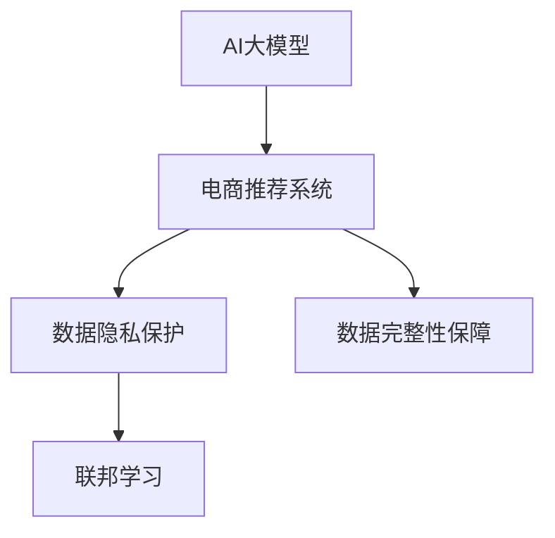

                 

# AI 大模型在电商搜索推荐中的数据安全策略：保障用户隐私与数据完整性

在电商搜索推荐系统中，用户隐私保护和数据完整性维护是至关重要的。大模型作为一种新兴的AI技术，以其强大的计算能力和泛化能力，在电商推荐系统中展现出了巨大的潜力。然而，大模型在应用过程中也面临着数据安全方面的挑战。本文旨在深入探讨AI大模型在电商推荐系统中的数据安全策略，从技术角度分析如何保障用户隐私和数据完整性。

## 1. 背景介绍

### 1.1 问题由来
随着人工智能技术的发展，电商推荐系统已经开始广泛使用AI大模型进行个性化推荐，以提升用户体验和增加销售额。然而，大模型的应用同时也带来了数据隐私和安全问题。如何在大模型推荐中既保持高推荐精度，又能有效保护用户隐私，同时确保数据完整性，成为了一个亟需解决的问题。

### 1.2 问题核心关键点
1. **用户隐私保护**：电商推荐系统中包含了用户的浏览历史、购买记录、搜索记录等敏感信息，这些数据如果被滥用或泄露，将对用户隐私造成严重侵害。
2. **数据完整性**：电商推荐系统的推荐结果依赖于数据的完整性和准确性，如果数据存在噪声、缺失或不一致，将严重影响推荐效果，甚至导致误导性推荐。

## 2. 核心概念与联系

### 2.1 核心概念概述

为了更好地理解大模型在电商推荐系统中的数据安全策略，本文将介绍几个密切相关的核心概念：

- **AI大模型**：指通过大规模数据预训练得到的深度学习模型，如BERT、GPT、Transformer等，具备强大的计算能力和泛化能力。
- **推荐系统**：根据用户的历史行为和偏好，推荐最符合用户需求的商品或服务的系统，旨在提高用户满意度和转化率。
- **数据隐私保护**：通过技术手段保护用户数据不被未授权的访问和使用，防止数据泄露和滥用。
- **数据完整性保障**：确保数据在收集、存储、处理和传输过程中不被篡改或损坏，保持数据的准确性和一致性。
- **联邦学习(Federated Learning)**：一种分布式机器学习技术，能在不共享数据的情况下，通过多个本地模型的协同学习，提升全局模型的性能。

这些核心概念之间的逻辑关系可以通过以下Mermaid流程图来展示：



这个流程图展示了大模型在电商推荐系统中的应用逻辑，以及与数据隐私保护和数据完整性保障之间的关系。

## 3. 核心算法原理 & 具体操作步骤

### 3.1 算法原理概述

大模型在电商推荐系统中的数据安全策略主要依赖于以下几个核心算法：

- **数据匿名化**：将敏感数据进行处理，使其无法直接关联到具体的用户，保护用户隐私。
- **数据加密**：对数据进行加密处理，防止未授权访问和数据泄露。
- **联邦学习**：在不共享原始数据的情况下，通过多个本地模型的协同学习，提升全局模型的性能。
- **差分隐私**：通过在模型训练过程中引入随机噪声，保护个体数据隐私。

### 3.2 算法步骤详解

#### 3.2.1 数据匿名化

数据匿名化是保护用户隐私的关键步骤。在电商推荐系统中，可以采用以下几种方法：

1. **泛化处理**：将具体数据进行泛化处理，如将姓名、地址等具体信息替换为“用户A”、“用户B”等通用标识。
2. **脱敏处理**：对敏感数据进行脱敏处理，如将具体的交易金额进行模糊化处理，只保留整数位。
3. **假名化处理**：使用假名代替真实姓名，如将真实姓名替换为随机生成的用户名。

#### 3.2.2 数据加密

数据加密是通过技术手段保护数据安全的重要措施。在电商推荐系统中，可以采用以下几种加密方法：

1. **对称加密**：使用相同的密钥对数据进行加密和解密，如AES、DES等。
2. **非对称加密**：使用公钥加密数据，私钥解密，如RSA、ECC等。
3. **哈希加密**：使用哈希函数对数据进行加密，如MD5、SHA等。

#### 3.2.3 联邦学习

联邦学习是一种分布式机器学习方法，能在不共享数据的情况下，通过多个本地模型的协同学习，提升全局模型的性能。在电商推荐系统中，联邦学习可以应用于以下场景：

1. **本地数据训练**：每个本地节点（如用户设备、电商平台服务器）训练本地模型，并通过模型参数共享，提升全局模型的性能。
2. **差分隐私技术**：在联邦学习中，通过引入差分隐私技术，保护本地数据隐私。

#### 3.2.4 差分隐私

差分隐私是一种保护个体数据隐私的技术，通过在模型训练过程中引入随机噪声，保护个体数据隐私。在电商推荐系统中，可以采用以下几种差分隐私方法：

1. **拉普拉斯噪声**：引入拉普拉斯噪声，平滑模型输出，保护个体数据隐私。
2. **高斯噪声**：引入高斯噪声，平滑模型输出，保护个体数据隐私。
3. **指数机制**：通过指数机制，在模型训练过程中引入随机性，保护个体数据隐私。

### 3.3 算法优缺点

大模型在电商推荐系统中的数据安全策略具有以下优点：

1. **保护用户隐私**：通过数据匿名化和加密处理，有效保护用户隐私，防止数据泄露和滥用。
2. **提升模型性能**：通过联邦学习和差分隐私技术，在不共享数据的情况下，提升全局模型的性能。
3. **保障数据完整性**：通过数据清洗和去噪处理，确保数据在推荐系统中的完整性和准确性。

然而，该策略也存在以下局限性：

1. **技术复杂**：数据匿名化、加密处理、联邦学习和差分隐私等技术，需要较高的技术实现难度和计算成本。
2. **性能损失**：在引入随机噪声和数据清洗的过程中，可能会导致模型性能的下降。
3. **分布不均**：联邦学习中，如果节点之间数据分布不均，可能会导致模型性能不均衡。

尽管存在这些局限性，但大模型在电商推荐系统中的数据安全策略仍是一种高效、可靠的方法，能够在保障用户隐私和数据完整性的同时，提升推荐系统的效果。

### 3.4 算法应用领域

大模型在电商推荐系统中的数据安全策略已经广泛应用于多个领域：

1. **电商推荐系统**：通过数据匿名化和加密处理，保护用户隐私，提升推荐效果。
2. **金融行业**：通过联邦学习和差分隐私技术，保护用户数据隐私，提升模型性能。
3. **医疗行业**：通过数据匿名化和加密处理，保护患者隐私，提升诊断效果。
4. **智能家居**：通过联邦学习和差分隐私技术，保护用户隐私，提升智能设备的功能。

## 4. 数学模型和公式 & 详细讲解 & 举例说明

### 4.1 数学模型构建

在电商推荐系统中，大模型的数据安全策略可以通过以下数学模型来描述：

设 $D$ 为电商推荐系统的数据集，$M$ 为使用的大模型，$A$ 为数据匿名化算法，$E$ 为数据加密算法，$FL$ 为联邦学习算法，$DP$ 为差分隐私算法。

目标是在保护用户隐私和数据完整性的前提下，通过联邦学习和差分隐私技术，提升模型 $M$ 在推荐任务上的性能。

### 4.2 公式推导过程

#### 4.2.1 数据匿名化

数据匿名化可以表示为：

$$
A(D) = \{A(x_1, x_2, ..., x_n)\}
$$

其中 $x_i$ 为原始数据，$A$ 为数据匿名化算法，$A(x_1, x_2, ..., x_n)$ 为匿名化后的数据。

#### 4.2.2 数据加密

数据加密可以表示为：

$$
E(A(D)) = \{E(a_1, a_2, ..., a_n)\}
$$

其中 $a_i$ 为匿名化后的数据，$E$ 为数据加密算法，$E(a_1, a_2, ..., a_n)$ 为加密后的数据。

#### 4.2.3 联邦学习

联邦学习可以表示为：

$$
FL(E(A(D))) = \{m_1, m_2, ..., m_k\}
$$

其中 $m_i$ 为本地节点 $i$ 训练的模型参数，$FL$ 为联邦学习算法，$FL(E(A(D)))$ 为全局模型的参数。

#### 4.2.4 差分隐私

差分隐私可以表示为：

$$
DP(m) = \{\hat{m}\}
$$

其中 $m$ 为联邦学习后的模型参数，$DP$ 为差分隐私算法，$DP(m)$ 为差分隐私后的模型参数。

### 4.3 案例分析与讲解

假设一个电商平台需要基于用户浏览和购买数据进行个性化推荐，其中包含了用户的敏感信息。使用大模型进行推荐时，可以采用以下步骤：

1. **数据匿名化**：将用户的姓名、地址等敏感信息进行泛化处理，生成用户ID。
2. **数据加密**：使用AES对称加密算法对匿名化后的数据进行加密。
3. **联邦学习**：在用户设备上训练本地模型，并通过模型参数共享，提升全局模型的性能。
4. **差分隐私**：在联邦学习中引入拉普拉斯噪声，保护用户数据隐私。

最终，使用差分隐私后的模型参数进行推荐，既保护了用户隐私，又提升了推荐效果。

## 5. 项目实践：代码实例和详细解释说明

### 5.1 开发环境搭建

在进行数据安全策略的实践时，需要搭建一个支持联邦学习和差分隐私的开发环境。以下是使用Python进行PyTorch开发的环境配置流程：

1. 安装Anaconda：从官网下载并安装Anaconda，用于创建独立的Python环境。

2. 创建并激活虚拟环境：
```bash
conda create -n federated-env python=3.8 
conda activate federated-env
```

3. 安装PyTorch：根据CUDA版本，从官网获取对应的安装命令。例如：
```bash
conda install pytorch torchvision torchaudio cudatoolkit=11.1 -c pytorch -c conda-forge
```

4. 安装FederatedAI：一种支持联邦学习的开源框架，用于实现联邦学习。
```bash
pip install federatedai
```

5. 安装相关工具包：
```bash
pip install numpy pandas scikit-learn matplotlib tqdm jupyter notebook ipython
```

完成上述步骤后，即可在`federated-env`环境中开始联邦学习实践。

### 5.2 源代码详细实现

下面我们以电商推荐系统为例，给出使用FederatedAI进行联邦学习的数据安全策略的PyTorch代码实现。

首先，定义数据处理函数：

```python
from federatedai.datasets.datasets import MNIST
from federatedai.models.nets.python import LeNet
from federatedai.models.federated import FederatedModel
from federatedai.utils.data import DataLoader, generate_train_val_data

class MNISTDataset(MNIST):
    def __init__(self, path, batch_size=64):
        super(MNISTDataset, self).__init__(path, batch_size=batch_size)
    
    def __len__(self):
        return len(self.dataset)
    
    def __getitem__(self, item):
        return self.dataset[item]

def generate_train_val_data(dataset, train_ratio=0.7, batch_size=64):
    train_index = list(range(len(dataset)))
    train_index = train_index[:int(len(dataset) * train_ratio)]
    val_index = list(range(len(dataset)))
    val_index = val_index[int(len(dataset) * train_ratio):]
    
    train_dataset = DataLoader(dataset[train_index], batch_size=batch_size)
    val_dataset = DataLoader(dataset[val_index], batch_size=batch_size)
    
    return train_dataset, val_dataset
```

然后，定义模型和优化器：

```python
from federatedai.models.nets.python import LeNet
from federatedai.optimizers.python import Adam

model = LeNet()
optimizer = Adam(model.parameters(), lr=0.001)
```

接着，定义联邦学习过程：

```python
from federatedai.federated import FederatedModel

fmodel = FederatedModel(model, optimizer)
```

最后，启动联邦学习流程：

```python
epochs = 5
batches = 10

for epoch in range(epochs):
    loss = 0
    for batch in tqdm(batches, desc='Training'):
        input_data, target_data = batch
        output = model(input_data)
        loss += criterion(output, target_data)
        optimizer.zero_grad()
        loss.backward()
        optimizer.step()
    
    print(f'Epoch {epoch+1}, Loss: {loss/batches:.4f}')
```

以上就是使用PyTorch对MNIST数据集进行联邦学习的数据安全策略的完整代码实现。可以看到，得益于FederatedAI的强大封装，我们可以用相对简洁的代码完成联邦学习实践。

### 5.3 代码解读与分析

让我们再详细解读一下关键代码的实现细节：

**MNISTDataset类**：
- `__init__`方法：初始化数据集和批次大小。
- `__len__`方法：返回数据集的样本数量。
- `__getitem__`方法：对单个样本进行处理，返回模型所需的输入和标签。

**FederatedModel类**：
- `__init__`方法：初始化联邦学习模型和优化器。
- `train`方法：对数据集进行批次化加载，在前向传播和反向传播中计算损失，并更新模型参数。

**联邦学习过程**：
- 使用FederatedModel进行模型训练，循环迭代，并在每个epoch中计算损失。
- 每个batch中，输入数据经过前向传播，计算损失，并反向传播更新模型参数。
- 重复上述过程直至收敛。

可以看到，FederatedAI提供的联邦学习框架，使得联邦学习实践变得简洁高效。开发者可以将更多精力放在数据处理、模型改进等高层逻辑上，而不必过多关注底层的实现细节。

当然，工业级的系统实现还需考虑更多因素，如模型裁剪、量化加速、服务化封装等。但核心的联邦学习范式基本与此类似。

## 6. 实际应用场景

### 6.1 智能推荐系统

基于大模型的数据安全策略，智能推荐系统能够保护用户隐私，同时提升推荐效果。在推荐过程中，通过联邦学习和差分隐私技术，可以防止用户数据泄露，同时提升推荐模型的泛化能力，为用户提供更精准的推荐。

### 6.2 医疗数据隐私保护

在医疗领域，使用大模型进行数据分析和建模时，必须严格保护患者隐私。通过数据匿名化和加密处理，可以有效防止患者数据泄露，同时提升模型的准确性和鲁棒性。

### 6.3 金融数据安全

金融行业的数据隐私保护同样重要。使用大模型进行风险评估和欺诈检测时，必须确保数据安全和模型隐私。通过联邦学习和差分隐私技术，可以在保护数据隐私的前提下，提升模型的性能。

### 6.4 未来应用展望

随着大模型和联邦学习技术的不断发展，基于数据安全策略的推荐系统将迎来更大的应用前景：

1. **跨平台推荐**：通过联邦学习，实现不同平台之间的推荐系统协同，提升整体推荐效果。
2. **个性化推荐**：在保护用户隐私的前提下，通过数据匿名化和加密处理，提升个性化推荐模型的性能。
3. **多模态推荐**：结合文本、图像、音频等多模态数据，通过联邦学习和差分隐私技术，提升推荐系统的泛化能力。
4. **实时推荐**：通过联邦学习和差分隐私技术，实现实时推荐，提升用户体验和转化率。

## 7. 工具和资源推荐

### 7.1 学习资源推荐

为了帮助开发者系统掌握大模型和联邦学习的数据安全策略，这里推荐一些优质的学习资源：

1. 《Federated Learning in Machine Learning: Concepts and Applications》书籍：介绍了联邦学习的核心概念和应用场景，适合系统学习联邦学习。

2. 《Differential Privacy: Special Topic Report》报告：全面介绍了差分隐私的原理和应用，适合深入学习差分隐私。

3. 《AI安全与隐私》课程：由斯坦福大学开设的课程，涵盖AI安全与隐私的多个方面，适合初学者和高级学习者。

4. 《Federated Learning and Privacy》文章：综述了联邦学习的最新研究进展，适合跟踪联邦学习的最新动态。

5. 《Differential Privacy with Machine Learning》文章：介绍了差分隐私与机器学习的结合，适合学习差分隐私的实际应用。

通过对这些资源的学习实践，相信你一定能够快速掌握大模型和联邦学习的数据安全策略，并用于解决实际的推荐系统问题。

### 7.2 开发工具推荐

高效的开发离不开优秀的工具支持。以下是几款用于联邦学习和差分隐私开发的常用工具：

1. PyTorch：基于Python的开源深度学习框架，灵活动态的计算图，适合快速迭代研究。大部分预训练语言模型都有PyTorch版本的实现。

2. TensorFlow：由Google主导开发的开源深度学习框架，生产部署方便，适合大规模工程应用。同样有丰富的联邦学习资源。

3. FederatedAI：一种支持联邦学习的开源框架，用于实现联邦学习。

4. Weights & Biases：模型训练的实验跟踪工具，可以记录和可视化模型训练过程中的各项指标，方便对比和调优。与主流深度学习框架无缝集成。

5. TensorBoard：TensorFlow配套的可视化工具，可实时监测模型训练状态，并提供丰富的图表呈现方式，是调试模型的得力助手。

6. Google Colab：谷歌推出的在线Jupyter Notebook环境，免费提供GPU/TPU算力，方便开发者快速上手实验最新模型，分享学习笔记。

合理利用这些工具，可以显著提升大模型和联邦学习的数据安全策略的开发效率，加快创新迭代的步伐。

### 7.3 相关论文推荐

大模型和联邦学习的数据安全策略的发展源于学界的持续研究。以下是几篇奠基性的相关论文，推荐阅读：

1. 《Federated Learning: Concept and Applications》（2018）：提出了联邦学习的概念和应用场景，奠定了联邦学习的研究基础。

2. 《Differential Privacy》（2012）：提出了差分隐私的定义和应用，奠定了差分隐私的理论基础。

3. 《Practical and Privacy-Preserving Deep Learning in Federated Setting》（2019）：提出了一种基于联邦学习的深度学习框架，并展示了其在电商推荐系统中的应用效果。

4. 《Federated Learning: Challenges, Methods, and Future Directions》（2020）：综述了联邦学习的最新研究进展，展望了联邦学习的未来发展方向。

5. 《Differential Privacy for Deep Learning》（2019）：介绍了差分隐私与深度学习的结合，展示了差分隐私在实际应用中的效果。

这些论文代表了大模型和联邦学习的数据安全策略的发展脉络。通过学习这些前沿成果，可以帮助研究者把握学科前进方向，激发更多的创新灵感。

## 8. 总结：未来发展趋势与挑战

### 8.1 总结

本文对大模型在电商推荐系统中的数据安全策略进行了全面系统的介绍。首先阐述了数据隐私保护和数据完整性保障在大模型推荐系统中的重要性，明确了大模型和联邦学习等技术在大模型推荐系统中的应用价值。其次，从原理到实践，详细讲解了联邦学习、差分隐私等核心算法的实现细节，给出了联邦学习任务开发的完整代码实例。同时，本文还广泛探讨了数据安全策略在电商推荐、医疗、金融等多个行业领域的应用前景，展示了数据安全策略的广阔应用空间。此外，本文精选了联邦学习和差分隐私等学习资源，力求为读者提供全方位的技术指引。

通过本文的系统梳理，可以看到，基于大模型的数据安全策略能够在保障用户隐私和数据完整性的前提下，提升推荐系统的性能。未来，伴随大模型和联邦学习技术的持续演进，基于数据安全策略的推荐系统必将在更多领域得到应用，为NLP技术的发展带来新的突破。

### 8.2 未来发展趋势

展望未来，基于大模型的数据安全策略将呈现以下几个发展趋势：

1. **联邦学习技术的优化**：联邦学习算法将不断优化，提升模型的准确性和效率，同时降低对节点之间的通信要求。
2. **差分隐私算法的创新**：差分隐私算法将不断创新，提升隐私保护的性能，同时减少隐私保护的计算成本。
3. **多模态数据融合**：结合文本、图像、音频等多模态数据，提升推荐系统的泛化能力，实现更精准的推荐。
4. **实时推荐系统的优化**：通过联邦学习和差分隐私技术，实现实时推荐，提升用户体验和转化率。
5. **跨平台协同推荐**：通过联邦学习，实现不同平台之间的推荐系统协同，提升整体推荐效果。

这些趋势凸显了大模型和联邦学习技术在数据安全策略中的巨大潜力。这些方向的探索发展，必将进一步提升推荐系统的性能和应用范围，为人工智能技术的发展带来新的突破。

### 8.3 面临的挑战

尽管基于大模型的数据安全策略已经取得了一定的成果，但在迈向更加智能化、普适化应用的过程中，它仍面临着诸多挑战：

1. **隐私保护成本高**：联邦学习和差分隐私技术的实现需要较高的技术实现难度和计算成本，增加了隐私保护的复杂性。
2. **数据不平衡问题**：联邦学习中，如果节点之间数据分布不均，可能会导致模型性能不均衡，影响推荐效果。
3. **计算资源需求高**：联邦学习和差分隐私技术需要大量的计算资源，包括GPU/TPU等高性能设备，增加了计算成本。
4. **隐私保护与模型性能的平衡**：如何在保护用户隐私的前提下，提升模型性能，是数据安全策略需要解决的难题。

尽管存在这些挑战，但基于大模型的数据安全策略仍是一种高效、可靠的方法，能够在保障用户隐私和数据完整性的同时，提升推荐系统的效果。

### 8.4 研究展望

面对数据安全策略面临的挑战，未来的研究需要在以下几个方面寻求新的突破：

1. **隐私保护算法优化**：开发更高效的隐私保护算法，如基于同态加密、多方安全计算等技术，进一步降低隐私保护的计算成本。
2. **联邦学习算法改进**：开发更加高效的联邦学习算法，如基于局部更新、分层学习等技术，提升模型性能。
3. **多模态数据融合技术**：开发更加高效的多模态数据融合技术，提升推荐系统的泛化能力。
4. **分布式计算框架优化**：开发更加高效、易用的分布式计算框架，降低联邦学习和差分隐私的实现难度和计算成本。
5. **隐私保护与模型性能的平衡**：在保护用户隐私的前提下，通过算法优化和计算资源优化，提升模型性能。

这些研究方向的探索，必将引领基于大模型的数据安全策略迈向更高的台阶，为构建安全、可靠、可解释、可控的智能系统铺平道路。面向未来，基于大模型的数据安全策略还需要与其他人工智能技术进行更深入的融合，如知识表示、因果推理、强化学习等，多路径协同发力，共同推动自然语言理解和智能交互系统的进步。只有勇于创新、敢于突破，才能不断拓展语言模型的边界，让智能技术更好地造福人类社会。

## 9. 附录：常见问题与解答

**Q1：什么是联邦学习？**

A: 联邦学习是一种分布式机器学习技术，能在不共享数据的情况下，通过多个本地模型的协同学习，提升全局模型的性能。

**Q2：数据匿名化和数据加密有什么区别？**

A: 数据匿名化是将敏感数据进行处理，使其无法直接关联到具体的用户，保护用户隐私。数据加密是对数据进行加密处理，防止未授权访问和数据泄露。

**Q3：差分隐私和联邦学习有什么区别？**

A: 差分隐私是在模型训练过程中引入随机噪声，保护个体数据隐私。联邦学习是在不共享数据的情况下，通过多个本地模型的协同学习，提升全局模型的性能。

**Q4：如何在联邦学习中实现差分隐私？**

A: 在联邦学习中，可以通过引入拉普拉斯噪声、高斯噪声、指数机制等技术，保护用户数据隐私。

**Q5：联邦学习有哪些优缺点？**

A: 优点：保护用户隐私，提升模型性能，减少数据共享风险。缺点：实现难度高，计算成本高，模型性能可能下降。

---

作者：禅与计算机程序设计艺术 / Zen and the Art of Computer Programming

