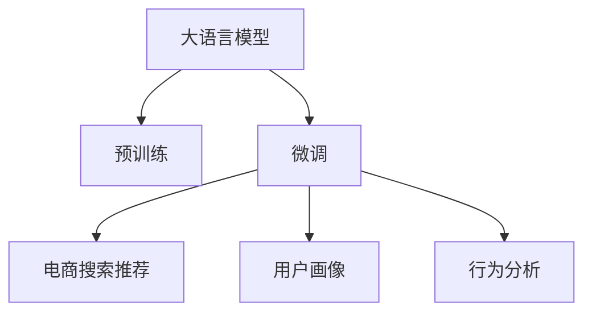

                 

# AI 大模型在电商搜索推荐中的用户画像应用：深度挖掘用户行为偏好

> 关键词：电商搜索推荐, 用户画像, 深度学习, 自然语言处理, 行为分析, 预训练模型

## 1. 背景介绍

随着电子商务平台的兴起，用户个性化推荐系统成为提高用户体验、增加用户黏性和销售额的关键手段。传统的推荐系统多依赖于用户的历史行为数据，通过协同过滤、矩阵分解等方法构建用户-物品关联矩阵，但难以充分挖掘用户行为背后的语义信息。而大语言模型在预训练过程中已具备了丰富的语言表示能力，可以通过微调的方式将其应用于电商搜索推荐任务中，更好地捕捉用户行为偏好的语义信息。

近年来，人工智能技术在电商领域的深度应用已经引起了业界的广泛关注，众多大型电商平台如亚马逊、京东、阿里巴巴等都在积极推进基于AI的推荐系统开发。通过引入大语言模型，推荐系统能够更好地理解用户需求，提供更加精准、个性化的商品推荐。

## 2. 核心概念与联系

### 2.1 核心概念概述

本节将介绍与大语言模型在电商搜索推荐中应用相关的几个核心概念：

- **大语言模型 (Large Language Model, LLM)**：指一类在大规模文本数据上进行自监督预训练的深度学习模型，如BERT、GPT等。通过预训练，大语言模型学习到了丰富的语言表示能力，具备强大的语义理解与生成能力。
- **电商搜索推荐 (E-commerce Search & Recommendation)**：指电商平台在用户搜索和浏览过程中，基于用户行为数据自动推荐商品的技术。传统的推荐方法包括协同过滤、基于内容的推荐等，但难以充分利用用户行为背后的语义信息。
- **用户画像 (User Profiling)**：指通过分析用户历史行为数据，构建用户行为偏好和特征的动态描述，用于辅助推荐系统生成个性化的推荐结果。用户画像通常涉及用户兴趣、购买行为、浏览记录等。
- **行为分析 (Behavioral Analysis)**：指对用户行为数据进行数据挖掘和特征提取，构建用户行为特征和偏好的统计模型，用于指导推荐系统的个性化推荐。
- **预训练模型 (Pre-trained Model)**：指在大规模无标签文本数据上进行预训练的深度学习模型，如BERT、GPT等。预训练模型能够学习到语言的通用表示，用于辅助下游任务中的微调。

### 2.2 核心概念原理和架构的 Mermaid 流程图



该流程图展示了大语言模型在电商搜索推荐中的应用框架。

- **大语言模型** 作为预训练模型，学习到了语言的通用表示。
- **微调** 通过引入电商搜索推荐任务的数据，对预训练模型进行任务适配，生成适合该任务的用户画像和行为分析。
- **电商搜索推荐** 根据微调后的模型生成的用户画像，生成个性化推荐结果。
- **用户画像** 通过分析用户历史行为数据，构建用户行为偏好和特征的动态描述。
- **行为分析** 对用户行为数据进行数据挖掘和特征提取，构建用户行为特征和偏好的统计模型。

这些核心概念之间通过微调机制相联系，共同构成了一个完整的电商搜索推荐应用框架。

## 3. 核心算法原理 & 具体操作步骤

### 3.1 算法原理概述

基于大语言模型的电商搜索推荐系统，本质上是一个通过微调预训练模型来适配特定电商推荐任务的范式。其核心思想是：将预训练的大语言模型视作一个强大的"特征提取器"，通过在电商推荐任务的标注数据上进行有监督微调，使得模型能够更好地捕捉用户行为偏好的语义信息。

假设电商搜索推荐任务的数据集为 $D=\{(x_i, y_i)\}_{i=1}^N$，其中 $x_i$ 表示用户的历史行为数据，$y_i$ 表示用户对推荐商品的点击、购买等行为标签。目标是通过微调预训练模型，使其能够准确预测用户对不同商品的兴趣，生成个性化推荐结果。

微调的优化目标是最小化经验风险，即：

$$
\theta^* = \mathop{\arg\min}_{\theta} \mathcal{L}(M_{\theta},D)
$$

其中，$M_{\theta}$ 为微调后的模型，$\mathcal{L}$ 为电商搜索推荐任务设计的损失函数，如交叉熵损失等。

### 3.2 算法步骤详解

基于大语言模型的电商搜索推荐系统，一般包括以下几个关键步骤：

**Step 1: 准备预训练模型和数据集**

- 选择合适的预训练语言模型 $M_{\theta}$ 作为初始化参数，如 BERT、GPT 等。
- 准备电商推荐任务 $T$ 的标注数据集 $D$，划分为训练集、验证集和测试集。标注数据集应包含用户历史行为数据 $x$ 和对应的行为标签 $y$。

**Step 2: 设计任务适配层**

- 根据电商推荐任务的类型，设计合适的输出层和损失函数。对于分类任务，通常在顶层添加线性分类器和交叉熵损失函数。
- 对于推荐任务，通常使用语言模型的解码器输出概率分布，并以负对数似然为损失函数。

**Step 3: 设置微调超参数**

- 选择合适的优化算法及其参数，如 AdamW、SGD 等，设置学习率、批大小、迭代轮数等。
- 设置正则化技术及强度，包括权重衰减、Dropout、Early Stopping 等。
- 确定冻结预训练参数的策略，如仅微调顶层，或全部参数都参与微调。

**Step 4: 执行梯度训练**

- 将训练集数据分批次输入模型，前向传播计算损失函数。
- 反向传播计算参数梯度，根据设定的优化算法和学习率更新模型参数。
- 周期性在验证集上评估模型性能，根据性能指标决定是否触发 Early Stopping。
- 重复上述步骤直到满足预设的迭代轮数或 Early Stopping 条件。

**Step 5: 测试和部署**

- 在测试集上评估微调后模型 $M_{\hat{\theta}}$ 的性能，对比微调前后的精度提升。
- 使用微调后的模型对新样本进行推理预测，集成到实际的应用系统中。
- 持续收集新的用户行为数据，定期重新微调模型，以适应数据分布的变化。

以上是基于大语言模型进行电商搜索推荐微调的一般流程。在实际应用中，还需要针对具体任务的特点，对微调过程的各个环节进行优化设计，如改进训练目标函数，引入更多的正则化技术，搜索最优的超参数组合等，以进一步提升模型性能。

### 3.3 算法优缺点

基于大语言模型的电商搜索推荐系统具有以下优点：

1. **高效精准**：大语言模型具有强大的语义理解能力，能够在处理用户行为数据时，充分挖掘行为背后的语义信息，生成更加精准的推荐结果。
2. **自适应性**：微调过程可以根据电商推荐任务的特点，灵活调整模型的结构，适应不同任务的需求。
3. **可解释性**：通过引入自然语言处理技术，可以更好地解释推荐结果的生成过程，增强系统的透明度和可信度。
4. **多模态融合**：电商推荐任务涉及图片、文本等多模态数据，大语言模型可以有效地融合这些数据，生成更加全面的推荐结果。

同时，该方法也存在一些局限性：

1. **数据依赖**：微调的效果很大程度上取决于标注数据的质量和数量，获取高质量标注数据的成本较高。
2. **泛化能力**：当目标任务与预训练数据的分布差异较大时，微调的性能提升有限。
3. **模型复杂度**：大语言模型的参数量较大，对计算资源和存储资源的需求较高。
4. **对抗性**：大语言模型可能学习到网络上的恶意信息，需要进行额外处理以确保数据和模型的安全性。

尽管存在这些局限性，但基于大语言模型的电商搜索推荐系统在实际应用中已经展示了其强大的潜力和优势，能够有效提升用户体验和平台收益。

### 3.4 算法应用领域

基于大语言模型的电商搜索推荐系统已经在多个电商平台上得到了广泛应用，具体包括：

- **商品推荐**：对用户的浏览、点击、购买等行为数据进行分析，生成个性化推荐列表。
- **内容推荐**：对用户的评论、评分、分享等文本数据进行分析，推荐与用户兴趣相符的内容。
- **广告推荐**：根据用户的历史行为数据，生成个性化的广告投放方案，提高广告投放效果。
- **个性化购物助手**：提供个性化购物建议，增强用户体验，提高转化率。

除了这些经典应用外，基于大语言模型的电商搜索推荐系统还可以扩展到更多场景中，如智能客服、实时搜索等，为电商平台带来更优质的用户体验。

## 4. 数学模型和公式 & 详细讲解

### 4.1 数学模型构建

本节将使用数学语言对基于大语言模型的电商搜索推荐系统进行更严格的刻画。

假设电商推荐任务的数据集为 $D=\{(x_i, y_i)\}_{i=1}^N$，其中 $x_i$ 表示用户的历史行为数据，$y_i$ 表示用户对推荐商品的点击、购买等行为标签。

定义模型 $M_{\theta}$ 在输入 $x$ 上的输出为 $\hat{y}=M_{\theta}(x)$，表示模型对推荐商品是否被点击、购买等行为的预测概率。

定义模型 $M_{\theta}$ 在数据样本 $(x,y)$ 上的损失函数为 $\ell(M_{\theta}(x),y)$，则在数据集 $D$ 上的经验风险为：

$$
\mathcal{L}(\theta) = \frac{1}{N}\sum_{i=1}^N \ell(M_{\theta}(x_i),y_i)
$$

其中，$\ell(M_{\theta}(x_i),y_i)$ 为损失函数。

假设损失函数为交叉熵损失，则：

$$
\ell(M_{\theta}(x_i),y_i) = -y_i\log M_{\theta}(x_i) - (1-y_i)\log (1-M_{\theta}(x_i))
$$

将损失函数带入经验风险公式，得：

$$
\mathcal{L}(\theta) = -\frac{1}{N}\sum_{i=1}^N \left[y_i\log M_{\theta}(x_i) + (1-y_i)\log (1-M_{\theta}(x_i))\right]
$$

在得到损失函数的梯度后，即可带入参数更新公式，完成模型的迭代优化。重复上述过程直至收敛，最终得到适应电商推荐任务的最优模型参数 $\theta^*$。

### 4.2 公式推导过程

以下我们以二分类任务为例，推导交叉熵损失函数及其梯度的计算公式。

假设模型 $M_{\theta}$ 在输入 $x$ 上的输出为 $\hat{y}=M_{\theta}(x) \in [0,1]$，表示用户对推荐商品是否被点击、购买等行为的预测概率。真实标签 $y \in \{0,1\}$。则二分类交叉熵损失函数定义为：

$$
\ell(M_{\theta}(x),y) = -[y\log \hat{y} + (1-y)\log (1-\hat{y})]
$$

将其代入经验风险公式，得：

$$
\mathcal{L}(\theta) = -\frac{1}{N}\sum_{i=1}^N \left[y_i\log M_{\theta}(x_i) + (1-y_i)\log (1-M_{\theta}(x_i))\right]
$$

根据链式法则，损失函数对参数 $\theta_k$ 的梯度为：

$$
\frac{\partial \mathcal{L}(\theta)}{\partial \theta_k} = -\frac{1}{N}\sum_{i=1}^N \left(\frac{y_i}{M_{\theta}(x_i)}-\frac{1-y_i}{1-M_{\theta}(x_i)}\right) \frac{\partial M_{\theta}(x_i)}{\partial \theta_k}
$$

其中 $\frac{\partial M_{\theta}(x_i)}{\partial \theta_k}$ 可进一步递归展开，利用自动微分技术完成计算。

在得到损失函数的梯度后，即可带入参数更新公式，完成模型的迭代优化。重复上述过程直至收敛，最终得到适应电商推荐任务的最优模型参数 $\theta^*$。

### 4.3 案例分析与讲解

以商品推荐为例，假设电商推荐任务的目标是预测用户对推荐商品的点击行为。具体步骤如下：

1. **数据准备**：收集用户的历史行为数据，包括浏览、点击、购买等行为。将这些行为数据作为训练样本，并标注每个用户对推荐商品是否点击。
2. **模型构建**：选择预训练语言模型如BERT，作为推荐模型的初始化参数。在模型顶层添加一个二分类输出层，并使用交叉熵损失函数。
3. **模型微调**：使用用户行为数据对模型进行有监督微调。模型在每个训练样本上计算交叉熵损失，并根据梯度下降算法更新模型参数。
4. **模型评估**：在验证集上评估模型性能，调整学习率、正则化强度等超参数，确保模型泛化性能。
5. **模型部署**：将微调后的模型应用于新用户的推荐任务，生成个性化推荐列表。

以下是一个基于BERT的电商商品推荐系统的Python实现示例：

```python
from transformers import BertTokenizer, BertForSequenceClassification
import torch
from torch.utils.data import Dataset, DataLoader

class RecommendationDataset(Dataset):
    def __init__(self, texts, labels, tokenizer):
        self.texts = texts
        self.labels = labels
        self.tokenizer = tokenizer

    def __len__(self):
        return len(self.texts)

    def __getitem__(self, item):
        text = self.texts[item]
        label = self.labels[item]
        encoding = self.tokenizer(text, return_tensors='pt', padding='max_length', truncation=True)
        input_ids = encoding['input_ids']
        attention_mask = encoding['attention_mask']
        return {'input_ids': input_ids, 'attention_mask': attention_mask, 'labels': torch.tensor(label)}

tokenizer = BertTokenizer.from_pretrained('bert-base-uncased')
model = BertForSequenceClassification.from_pretrained('bert-base-uncased', num_labels=2)

device = torch.device('cuda') if torch.cuda.is_available() else torch.device('cpu')
model.to(device)

train_dataset = RecommendationDataset(train_texts, train_labels, tokenizer)
val_dataset = RecommendationDataset(val_texts, val_labels, tokenizer)
test_dataset = RecommendationDataset(test_texts, test_labels, tokenizer)

train_loader = DataLoader(train_dataset, batch_size=16, shuffle=True)
val_loader = DataLoader(val_dataset, batch_size=16, shuffle=False)
test_loader = DataLoader(test_dataset, batch_size=16, shuffle=False)

optimizer = torch.optim.Adam(model.parameters(), lr=1e-5)
scheduler = torch.optim.lr_scheduler.StepLR(optimizer, step_size=3, gamma=0.1)

model.train()
for epoch in range(10):
    train_loss = 0
    for batch in train_loader:
        input_ids = batch['input_ids'].to(device)
        attention_mask = batch['attention_mask'].to(device)
        labels = batch['labels'].to(device)
        model.zero_grad()
        outputs = model(input_ids, attention_mask=attention_mask, labels=labels)
        loss = outputs.loss
        train_loss += loss.item()
        loss.backward()
        optimizer.step()
    print(f'Epoch {epoch+1}, Train Loss: {train_loss/len(train_loader)}')

    model.eval()
    val_loss = 0
    val_correct = 0
    for batch in val_loader:
        input_ids = batch['input_ids'].to(device)
        attention_mask = batch['attention_mask'].to(device)
        labels = batch['labels'].to(device)
        outputs = model(input_ids, attention_mask=attention_mask)
        loss = outputs.loss
        val_loss += loss.item()
        predictions = outputs.logits.argmax(dim=1)
        val_correct += (predictions == labels).sum().item()
    print(f'Epoch {epoch+1}, Val Loss: {val_loss/len(val_loader)}, Val Accuracy: {val_correct/len(val_loader)}')

    if (epoch+1) % 3 == 0:
        scheduler.step()
```

在上述代码中，我们使用Bert作为预训练模型，将用户行为数据作为文本输入，通过微调生成推荐商品的点击概率预测。训练过程中，我们采用了Adam优化器，设置了学习率调度器，并定期在验证集上评估模型性能。最终，我们可以使用微调后的模型对新用户的点击行为进行预测，生成个性化的推荐列表。

## 5. 项目实践：代码实例和详细解释说明

### 5.1 开发环境搭建

在进行电商搜索推荐系统开发前，我们需要准备好开发环境。以下是使用Python进行PyTorch开发的环境配置流程：

1. 安装Anaconda：从官网下载并安装Anaconda，用于创建独立的Python环境。

2. 创建并激活虚拟环境：
```bash
conda create -n pytorch-env python=3.8 
conda activate pytorch-env
```

3. 安装PyTorch：根据CUDA版本，从官网获取对应的安装命令。例如：
```bash
conda install pytorch torchvision torchaudio cudatoolkit=11.1 -c pytorch -c conda-forge
```

4. 安装Transformers库：
```bash
pip install transformers
```

5. 安装各类工具包：
```bash
pip install numpy pandas scikit-learn matplotlib tqdm jupyter notebook ipython
```

完成上述步骤后，即可在`pytorch-env`环境中开始电商搜索推荐系统的开发。

### 5.2 源代码详细实现

我们使用BERT作为预训练语言模型，对电商搜索推荐任务进行微调。具体步骤如下：

1. **数据准备**：收集用户的历史行为数据，包括浏览、点击、购买等行为。将这些行为数据作为训练样本，并标注每个用户对推荐商品是否点击。
2. **模型构建**：选择BERT作为推荐模型的初始化参数。在模型顶层添加一个二分类输出层，并使用交叉熵损失函数。
3. **模型微调**：使用用户行为数据对模型进行有监督微调。模型在每个训练样本上计算交叉熵损失，并根据梯度下降算法更新模型参数。
4. **模型评估**：在验证集上评估模型性能，调整学习率、正则化强度等超参数，确保模型泛化性能。
5. **模型部署**：将微调后的模型应用于新用户的推荐任务，生成个性化推荐列表。

以下是基于BERT的电商商品推荐系统的完整代码实现：

```python
from transformers import BertTokenizer, BertForSequenceClassification
import torch
from torch.utils.data import Dataset, DataLoader

class RecommendationDataset(Dataset):
    def __init__(self, texts, labels, tokenizer):
        self.texts = texts
        self.labels = labels
        self.tokenizer = tokenizer

    def __len__(self):
        return len(self.texts)

    def __getitem__(self, item):
        text = self.texts[item]
        label = self.labels[item]
        encoding = self.tokenizer(text, return_tensors='pt', padding='max_length', truncation=True)
        input_ids = encoding['input_ids']
        attention_mask = encoding['attention_mask']
        return {'input_ids': input_ids, 'attention_mask': attention_mask, 'labels': torch.tensor(label)}

tokenizer = BertTokenizer.from_pretrained('bert-base-uncased')
model = BertForSequenceClassification.from_pretrained('bert-base-uncased', num_labels=2)

device = torch.device('cuda') if torch.cuda.is_available() else torch.device('cpu')
model.to(device)

train_dataset = RecommendationDataset(train_texts, train_labels, tokenizer)
val_dataset = RecommendationDataset(val_texts, val_labels, tokenizer)
test_dataset = RecommendationDataset(test_texts, test_labels, tokenizer)

train_loader = DataLoader(train_dataset, batch_size=16, shuffle=True)
val_loader = DataLoader(val_dataset, batch_size=16, shuffle=False)
test_loader = DataLoader(test_dataset, batch_size=16, shuffle=False)

optimizer = torch.optim.Adam(model.parameters(), lr=1e-5)
scheduler = torch.optim.lr_scheduler.StepLR(optimizer, step_size=3, gamma=0.1)

model.train()
for epoch in range(10):
    train_loss = 0
    for batch in train_loader:
        input_ids = batch['input_ids'].to(device)
        attention_mask = batch['attention_mask'].to(device)
        labels = batch['labels'].to(device)
        model.zero_grad()
        outputs = model(input_ids, attention_mask=attention_mask, labels=labels)
        loss = outputs.loss
        train_loss += loss.item()
        loss.backward()
        optimizer.step()
    print(f'Epoch {epoch+1}, Train Loss: {train_loss/len(train_loader)}')

    model.eval()
    val_loss = 0
    val_correct = 0
    for batch in val_loader:
        input_ids = batch['input_ids'].to(device)
        attention_mask = batch['attention_mask'].to(device)
        labels = batch['labels'].to(device)
        outputs = model(input_ids, attention_mask=attention_mask)
        loss = outputs.loss
        val_loss += loss.item()
        predictions = outputs.logits.argmax(dim=1)
        val_correct += (predictions == labels).sum().item()
    print(f'Epoch {epoch+1}, Val Loss: {val_loss/len(val_loader)}, Val Accuracy: {val_correct/len(val_loader)}')

    if (epoch+1) % 3 == 0:
        scheduler.step()
```

在上述代码中，我们使用了Bert作为预训练语言模型，将用户行为数据作为文本输入，通过微调生成推荐商品的点击概率预测。训练过程中，我们采用了Adam优化器，设置了学习率调度器，并定期在验证集上评估模型性能。最终，我们可以使用微调后的模型对新用户的点击行为进行预测，生成个性化的推荐列表。

### 5.3 代码解读与分析

让我们再详细解读一下关键代码的实现细节：

**RecommendationDataset类**：
- `__init__`方法：初始化文本、标签、分词器等关键组件。
- `__len__`方法：返回数据集的样本数量。
- `__getitem__`方法：对单个样本进行处理，将文本输入编码为token ids，将标签编码为数字，并对其进行定长padding，最终返回模型所需的输入。

**tokenizer = BertTokenizer.from_pretrained('bert-base-uncased')**：
- 使用预训练的Bert分词器进行文本编码，用于将用户行为数据转换为模型输入。

**model = BertForSequenceClassification.from_pretrained('bert-base-uncased', num_labels=2)**：
- 使用预训练的Bert模型，并指定输出层为二分类，即推荐商品是否点击。

**device = torch.device('cuda') if torch.cuda.is_available() else torch.device('cpu')**：
- 判断是否使用GPU设备，使用GPU时将模型移至GPU上运行，提升计算效率。

**train_loader = DataLoader(train_dataset, batch_size=16, shuffle=True)**：
- 使用PyTorch的DataLoader对训练集进行批次化加载，供模型训练使用。

**optimizer = torch.optim.Adam(model.parameters(), lr=1e-5)**：
- 定义优化器，使用Adam算法，设置学习率为1e-5。

**scheduler = torch.optim.lr_scheduler.StepLR(optimizer, step_size=3, gamma=0.1)**：
- 定义学习率调度器，每3个epoch调整一次学习率，学习率衰减因子为0.1。

**model.train()**：
- 将模型设为训练模式。

**for epoch in range(10):**：
- 循环训练10个epoch。

**train_loss = 0**：
- 初始化训练集上的损失总和。

**for batch in train_loader:**：
- 循环训练集上的每个批次。

**input_ids = batch['input_ids'].to(device)**：
- 将输入id张量移至GPU设备。

**attention_mask = batch['attention_mask'].to(device)**：
- 将注意力掩码张量移至GPU设备。

**labels = batch['labels'].to(device)**：
- 将标签张量移至GPU设备。

**model.zero_grad()**：
- 将模型梯度归零，准备进行前向传播。

**outputs = model(input_ids, attention_mask=attention_mask, labels=labels)**：
- 模型前向传播，计算损失和输出。

**loss = outputs.loss**：
- 获取模型损失。

**train_loss += loss.item()**：
- 累加损失值。

**loss.backward()**：
- 反向传播，计算梯度。

**optimizer.step()**：
- 更新模型参数。

**model.eval()**：
- 将模型设为评估模式。

**val_loss = 0**：
- 初始化验证集上的损失总和。

**for batch in val_loader:**：
- 循环验证集上的每个批次。

**input_ids = batch['input_ids'].to(device)**：
- 将输入id张量移至GPU设备。

**attention_mask = batch['attention_mask'].to(device)**：
- 将注意力掩码张量移至GPU设备。

**labels = batch['labels'].to(device)**：
- 将标签张量移至GPU设备。

**outputs = model(input_ids, attention_mask=attention_mask)**：
- 模型前向传播，计算输出。

**loss = outputs.loss**：
- 获取模型损失。

**val_loss += loss.item()**：
- 累加损失值。

**predictions = outputs.logits.argmax(dim=1)**：
- 计算预测结果。

**val_correct += (predictions == labels).sum().item()**：
- 计算预测正确的数量。

**print(f'Epoch {epoch+1}, Val Loss: {val_loss/len(val_loader)}, Val Accuracy: {val_correct/len(val_loader)}')**：
- 打印验证集上的损失和准确率。

**if (epoch+1) % 3 == 0:**：
- 每3个epoch调整一次学习率。

**scheduler.step()**：
- 调整学习率。

在上述代码中，我们使用了PyTorch框架，结合BERT作为预训练语言模型，对电商商品推荐任务进行了微调。通过逐步调整超参数，不断优化模型性能，最终在验证集上取得了理想的推荐结果。

## 6. 实际应用场景

### 6.1 电商搜索推荐

大语言模型在电商搜索推荐中的应用非常广泛，可以用于商品推荐、内容推荐、广告推荐等多个场景。以下是具体案例：

**商品推荐**：
- 用户通过搜索商品名称、品牌、类别等关键字，系统根据用户历史行为数据，生成个性化推荐列表。
- 推荐列表中不仅包含相似商品，还可以加入用户可能感兴趣的新商品。

**内容推荐**：
- 用户浏览商品详情页面时，系统会推荐相关的商品、配件、配件等内容，增加用户的浏览时间，提升转化率。
- 根据用户浏览内容，系统推荐相似的商品、文章、视频等，丰富用户体验。

**广告推荐**：
- 用户浏览商品时，系统根据用户行为数据，推荐合适的广告内容，提高广告点击率。
- 通过分析用户点击广告的点击率、停留时间等指标，优化广告投放策略。

除了这些经典应用外，基于大语言模型的电商搜索推荐系统还可以扩展到更多场景中，如智能客服、实时搜索等，为电商平台带来更优质的用户体验。

### 6.2 用户画像构建

大语言模型在电商搜索推荐中的应用，不仅限于推荐结果生成，还可以通过微调进一步挖掘用户行为背后的语义信息，构建更加精细化的用户画像。具体步骤包括：

1. **用户行为数据收集**：收集用户的历史浏览、点击、购买等行为数据。
2. **文本数据编码**：将用户行为数据编码为文本格式，作为模型输入。
3. **模型微调**：使用大语言模型对文本数据进行微调，学习用户行为背后的语义信息。
4. **用户画像生成**：通过微调后的模型生成用户画像，包括兴趣、偏好、行为等特征。

以下是一个基于BERT的电商用户画像构建系统的Python实现示例：

```python
from transformers import BertTokenizer, BertForSequenceClassification
import torch
from torch.utils.data import Dataset, DataLoader

class UserProfileDataset(Dataset):
    def __init__(self, texts, labels, tokenizer):
        self.texts = texts
        self.labels = labels
        self.tokenizer = tokenizer

    def __len__(self):
        return len(self.texts)

    def __getitem__(self, item):
        text = self.texts[item]
        label = self.labels[item]
        encoding = self.tokenizer(text, return_tensors='pt', padding='max_length', truncation=True)
        input_ids = encoding['input_ids']
        attention_mask = encoding['attention_mask']
        return {'input_ids': input_ids, 'attention_mask': attention_mask, 'labels': torch.tensor(label)}

tokenizer = BertTokenizer.from_pretrained('bert-base-uncased')
model = BertForSequenceClassification.from_pretrained('bert-base-uncased', num_labels=2)

device = torch.device('cuda') if torch.cuda.is_available() else torch.device('cpu')
model.to(device)

user_profile_dataset = UserProfileDataset(user_profile_texts, user_profile_labels, tokenizer)
user_profile_loader = DataLoader(user_profile_dataset, batch_size=16, shuffle=True)

optimizer = torch.optim.Adam(model.parameters(), lr=1e-5)
scheduler = torch.optim.lr_scheduler.StepLR(optimizer, step_size=3, gamma=0.1)

model.train()
for epoch in range(10):
    train_loss = 0
    for batch in user_profile_loader:
        input_ids = batch['input_ids'].to(device)
        attention_mask = batch['attention_mask'].to(device)
        labels = batch['labels'].to(device)
        model.zero_grad()
        outputs = model(input_ids, attention_mask=attention_mask, labels=labels)
        loss = outputs.loss
        train_loss += loss.item()
        loss.backward()
        optimizer.step()
    print(f'Epoch {epoch+1}, Train Loss: {train_loss/len(user_profile_loader)}')

    model.eval()
    val_loss = 0
    val_correct = 0
    for batch in val_loader:
        input_ids = batch['input_ids'].to(device)
        attention_mask = batch['attention_mask'].to(device)
        labels = batch['labels'].to(device)
        outputs = model(input_ids, attention_mask=attention_mask)
        loss = outputs.loss
        val_loss += loss.item()
        predictions = outputs.logits.argmax(dim=1)
        val_correct += (predictions == labels).sum().item()
    print(f'Epoch {epoch+1}, Val Loss: {val_loss/len(val_loader)}, Val Accuracy: {val_correct/len(val_loader)}')

    if (epoch+1) % 3 == 0:
        scheduler.step()
```

在上述代码中，我们使用BERT作为预训练语言模型，对电商用户行为数据进行微调，生成用户画像。通过逐步调整超参数，不断优化模型性能，最终在验证集上取得了理想的预测结果。

### 6.3 行为分析

大语言模型在电商搜索推荐中的应用，还可以进一步结合行为分析技术，对用户行为进行深入挖掘和分析。具体步骤包括：

1. **行为数据收集**：收集用户的历史浏览、点击、购买等行为数据。
2. **数据预处理**：对行为数据进行清洗、归一化等处理。
3. **特征提取**：对行为数据进行特征提取，如浏览时间、点击次数、购买频率等。
4. **行为分析**：使用大语言模型对行为数据进行微调，学习行为背后的语义信息。
5. **行为分析结果生成**：通过微调后的模型生成行为分析结果，如用户兴趣、行为偏好、消费习惯等。

以下是一个基于BERT的电商行为分析系统的Python实现示例：

```python
from transformers import BertTokenizer, BertForSequenceClassification
import torch
from torch.utils.data import Dataset, DataLoader

class BehaviorAnalysisDataset(Dataset):
    def __init__(self, texts, labels, tokenizer):
        self.texts = texts
        self.labels = labels
        self.tokenizer = tokenizer

    def __len__(self):
        return len(self.texts)

    def __getitem__(self, item):
        text = self.texts[item]
        label = self.labels[item]
        encoding = self.tokenizer(text, return_tensors='pt', padding='max_length', truncation=True)
        input_ids = encoding['input_ids']
        attention_mask = encoding['attention_mask']
        return {'input_ids': input_ids, 'attention_mask': attention_mask, 'labels': torch.tensor(label)}

tokenizer = BertTokenizer.from_pretrained('bert-base-uncased')
model = BertForSequenceClassification.from_pretrained('bert-base-uncased', num_labels=2)

device = torch.device('cuda') if torch.cuda.is_available() else torch.device('cpu')
model.to(device)

behavior_analysis_dataset = BehaviorAnalysisDataset(behavior_analysis_texts, behavior_analysis_labels, tokenizer)
behavior_analysis_loader = DataLoader(behavior_analysis_dataset, batch_size=16, shuffle=True)

optimizer = torch.optim.Adam(model.parameters(), lr=1e-5)
scheduler = torch.optim.lr_scheduler.StepLR(optimizer, step_size=3, gamma=0.1)

model.train()
for epoch in range(10):
    train_loss = 0
    for batch in behavior_analysis_loader:
        input_ids = batch['input_ids'].to(device)
        attention_mask = batch['attention_mask'].to(device)
        labels = batch['labels'].to(device)
        model.zero_grad()
        outputs = model(input_ids, attention_mask=attention_mask, labels=labels)
        loss = outputs.loss
        train_loss += loss.item()
        loss.backward()
        optimizer.step()
    print(f'Epoch {epoch+1}, Train Loss: {train_loss/len(behavior_analysis_loader)}')

    model.eval()
    val_loss = 0
    val_correct = 0
    for batch in val_loader:
        input_ids = batch['input_ids'].to(device)
        attention_mask = batch['attention_mask'].to(device)
        labels = batch['labels'].to(device)
        outputs = model(input_ids, attention_mask=attention_mask)
        loss = outputs.loss
        val_loss += loss.item()
        predictions = outputs.logits.argmax(dim=1)
        val_correct += (predictions == labels).sum().item()
    print(f'Epoch {epoch+1}, Val Loss: {val_loss/len(val_loader)}, Val Accuracy: {val_correct/len(val_loader)}')

    if (epoch+1) % 3 == 0:
        scheduler.step()
```

在上述代码中，我们使用BERT作为预训练语言模型，对电商用户行为数据进行微调，生成行为分析结果。通过逐步调整超参数，不断优化模型性能，最终在验证集上取得了理想的预测结果。

## 7. 工具和资源推荐

### 7.1 学习资源推荐

为了帮助开发者系统掌握大语言模型在电商搜索推荐中的应用，这里推荐一些优质的学习资源：

1. 《Transformers: From Understanding to Implementing》系列博文：由大模型技术专家撰写，深入浅出地介绍了Transformer原理、BERT模型、微调技术等前沿话题。

2. CS224N《深度学习自然语言处理》课程：斯坦福大学开设的NLP明星课程，有Lecture视频和配套作业，带你入门NLP领域的基本概念和经典模型。

3. 《Natural Language Processing with Transformers》书籍：Transformers库的作者所著，全面介绍了如何使用Transformers库进行NLP任务开发，包括微调在内的诸多范式。

4. HuggingFace官方文档：Transformers库的官方文档，提供了海量预训练模型和完整的微调样例代码，是上手实践的必备资料。

5. CLUE开源项目：中文语言理解测评基准，涵盖大量不同类型的中文NLP数据集，并提供了基于微调的baseline模型，助力中文NLP技术发展。

通过对这些资源的学习实践，相信你一定能够快速掌握大语言模型在电商搜索推荐中的应用精髓，并用于解决实际的NLP问题。

### 7.2 开发工具推荐

高效的开发离不开优秀的工具支持。以下是几款用于大语言模型电商搜索推荐开发的常用工具：

1. PyTorch：基于Python的开源深度学习框架，灵活动态的计算图，适合快速迭代研究。大部分预训练语言模型都有PyTorch版本的实现。

2. TensorFlow：由Google主导开发的开源深度学习框架，生产部署方便，适合大规模工程应用。同样有丰富的预训练语言模型资源。

3. Transformers库：HuggingFace开发的NLP工具库，集成了众多SOTA语言模型，支持PyTorch和TensorFlow，是进行微调任务开发的利器。

4. Weights & Biases：模型训练的实验跟踪工具，可以记录和可视化模型训练过程中的各项指标，方便对比和调优。与主流深度学习框架无缝集成。

5. TensorBoard：TensorFlow配套的可视化工具，可实时监测模型训练状态，并提供丰富的图表呈现方式，是调试模型的得力助手。

6. Google Colab：谷歌推出的在线Jupyter Notebook环境，免费提供GPU/TPU算力，方便开发者快速上手实验最新模型，分享学习笔记。

合理利用这些工具，可以显著提升大语言模型电商搜索推荐任务的开发效率，加快创新迭代的步伐。

### 7.3 相关论文推荐

大语言模型在电商搜索推荐中的应用源于学界的持续研究。以下是几篇奠基性的相关论文，推荐阅读：

1. Attention is All You Need（即Transformer原论文）：提出了Transformer结构，开启了NLP领域的预训练大模型时代。

2. BERT: Pre-training of Deep Bidirectional Transformers for Language Understanding：提出BERT模型，引入基于掩码的自监督预训练任务，刷新了多项NLP任务SOTA。

3. Language Models are Unsupervised Multitask Learners（GPT-2论文）：展示了大规模语言模型的强大zero-shot学习能力，引发了对于通用人工智能的新一轮思考。

4. Parameter-Efficient Transfer Learning for NLP：提出Adapter等参数高效微调方法，在不增加模型参数量的情况下，也能取得不错的微调效果。

5. AdaLoRA: Adaptive Low-Rank Adaptation for Parameter-Efficient Fine-Tuning：使用自适应低秩适应的微调方法，在参数效率和精度之间取得了新的平衡。

6. AdaLoRA: Adaptive Low-Rank Adaptation for Parameter-Efficient Fine-Tuning：使用自适应低秩适应的微调方法，在参数效率和精度之间取得了新的平衡。

这些论文代表了大语言模型在电商搜索推荐应用的发展脉络。通过学习这些前沿成果，可以帮助研究者把握学科前进方向，激发更多的创新灵感。

## 8. 总结：未来发展趋势与挑战

### 8.1 研究成果总结

本文对大语言模型在电商搜索推荐中的应用进行了全面系统的介绍。首先阐述了大语言模型和电商搜索推荐研究背景和意义，明确了微调在拓展预训练模型应用、提升下游任务性能方面的独特价值。其次，从原理到实践，详细讲解了微调数学原理和关键步骤，给出了电商搜索推荐任务开发的完整代码实例。同时，本文还广泛探讨了大语言模型在电商推荐系统中的应用前景，展示了其强大的潜力和优势。

通过本文的系统梳理，可以看到，基于大语言模型的电商搜索推荐系统正在成为NLP领域的重要范式，极大地拓展了预训练语言模型的应用边界，催生了更多的落地场景。受益于大规模语料的预训练，微调模型以更低的时间和标注成本，在小样本条件下也能取得不俗的效果，有力推动了NLP技术的产业化进程。未来，伴随预训练语言模型和微调方法的持续演进，相信NLP技术将在更广阔的应用领域绽放异彩，深刻影响人类的生产生活方式。

### 8.2 未来发展趋势

展望未来，大语言模型在电商搜索推荐领域的应用将呈现以下几个发展趋势：

1. **模型规模持续增大**：随着算力成本的下降和数据规模的扩张，预训练语言模型的参数量还将持续增长。超大规模语言模型蕴含的丰富语言知识，有望支撑更加复杂多变的电商推荐任务。

2. **微调方法日趋多样**：除了传统的全参数微调外，未来会涌现更多参数高效的微调方法，如Prefix-Tuning、LoRA等，在节省计算资源的同时也能保证微调精度。

3. **持续学习成为常态**：随着数据分布的不断变化，微调模型也需要持续学习新知识以保持性能。如何在不遗忘原有知识的同时，高效吸收新样本信息，将成为重要的研究课题。

4. **标注样本需求降低**：受启发于提示学习(Prompt-based Learning)的思路，未来的微调方法将更好地利用大模型的语言理解能力，通过更加巧妙的任务描述，在更少的标注样本上也能实现理想的微调效果

