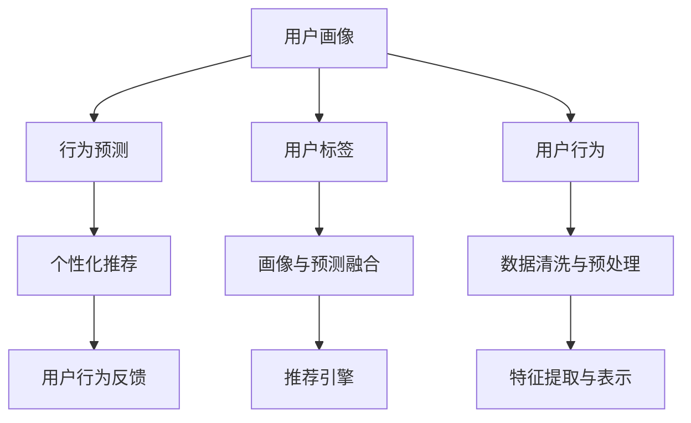

                 

# AI 大模型在电商搜索推荐中的用户画像应用：深度挖掘用户需求与行为意图

## 1. 背景介绍

### 1.1 问题由来
在现代社会，电子商务已渗透到人们生活的方方面面。从日常消费品到高端数码产品，人们只需动动手指，即可轻松完成购物。但随着商品种类的急剧增加和市场竞争的日益激烈，如何提高用户的购物体验，并促成交易转化，成为电商企业关注的重点。传统的搜索推荐系统往往仅根据商品的相似度进行推荐，无法深度理解用户需求和行为背后的真实意图。而基于深度学习技术的大模型在用户画像构建和行为预测方面，展现出强大的潜力。

### 1.2 问题核心关键点
AI大模型在电商搜索推荐中的应用，主要集中在用户画像的构建和行为预测两方面。通过深度挖掘用户需求和行为意图，生成个性化的搜索推荐结果，提升用户购物体验，并最终实现电商企业交易转化率的提升。

用户画像的构建，旨在对用户的行为特征进行全面刻画，帮助企业更好地理解用户的个性化需求，从而实现更加精准的个性化推荐。行为预测则侧重于分析用户当前行为背后的真实意图，如购买、浏览、收藏等，以便在恰当的时机进行产品推荐。

基于大模型构建的用户画像和行为预测，不仅能够帮助电商企业更好地实现个性化推荐，还能通过用户行为数据的分析，优化产品定位，提升产品质量，从而整体提升电商平台的竞争力和用户体验。

### 1.3 问题研究意义
深入研究大模型在电商搜索推荐中的应用，对于拓展电商平台的智能化水平，提升用户体验，促进商业转化，具有重要意义：

1. **提升用户体验**：通过深度挖掘用户需求和行为，生成个性化推荐，用户能够在电商平台上获得更好的购物体验，增加用户的忠诚度。
2. **优化电商运营**：企业可以利用用户画像数据优化产品定位和供应链管理，提升产品质量，从而增强市场竞争力。
3. **促进商业转化**：个性化的推荐系统能够将合适的商品推送给用户，提高用户购买的概率，增加平台的销售额。
4. **增强数据分析**：用户画像和行为数据的深度分析，可以为企业的市场分析和决策提供强有力的支持。
5. **加速技术落地**：研究成果的工程化应用，将加速电商搜索推荐技术的产业化进程，推动整个行业的发展。

## 2. 核心概念与联系

### 2.1 核心概念概述

为更好地理解大模型在电商搜索推荐中的应用，本节将介绍几个关键概念及其相互联系：

- **用户画像**：用户画像是指通过数据分析和机器学习技术，对用户的行为特征、兴趣爱好、消费习惯等进行全面刻画，从而形成用户完整的“虚拟形象”。

- **行为预测**：行为预测是根据用户的历史行为数据，预测其未来的行为意图，如购买、浏览、收藏等，帮助企业更好地理解用户需求。

- **深度学习**：深度学习是一种基于人工神经网络的机器学习方法，通过多层非线性变换，从大量数据中学习复杂的特征表示，适合处理高维度、非线性的数据。

- **Transformer模型**：Transformer是一种基于自注意力机制的深度学习模型，被广泛应用于自然语言处理、计算机视觉等领域，能够高效处理序列数据。

- **用户画像与行为预测的联系**：用户画像和行为预测是相辅相成的两个方面，前者是对用户行为的全面刻画，后者是对行为背后意图的深度挖掘。两者结合，能够更好地理解用户需求，提升电商搜索推荐的效果。

这些核心概念之间的逻辑关系可以通过以下Mermaid流程图来展示：



这个流程图展示了用户画像和行为预测的构建流程以及其在推荐系统中的应用：

1. 用户画像的构建需通过用户标签和行为数据，经过数据清洗与预处理和特征提取与表示后，生成用户画像。
2. 行为预测根据用户画像数据，预测用户的行为意图。
3. 个性化推荐利用用户画像和行为预测结果，生成个性化的推荐结果。
4. 用户行为反馈用于更新用户画像和行为预测模型，形成闭环迭代。

这些概念共同构成了大模型在电商搜索推荐中的应用框架，使其能够在各个环节上发挥强大的分析和预测能力。

## 3. 核心算法原理 & 具体操作步骤
### 3.1 算法原理概述

基于深度学习的大模型在电商搜索推荐中的应用，主要通过用户画像和行为预测两步实现。其核心思想是：利用深度学习模型，从海量的用户行为数据中提取高层次的特征表示，并在用户画像和行为预测模型中进行应用，从而生成个性化的推荐结果。

具体而言，用户画像的构建需经过以下步骤：
1. 收集用户的基本信息、行为数据和用户反馈。
2. 对数据进行清洗和预处理，去除噪声和异常值。
3. 通过特征提取与表示，将用户行为数据转化为模型能够处理的向量表示。
4. 利用深度学习模型，对用户画像进行编码，形成完整的用户“虚拟形象”。

行为预测则主要通过以下步骤实现：
1. 收集用户的历史行为数据，包括浏览记录、收藏行为、购买记录等。
2. 对数据进行清洗和预处理，去除噪声和异常值。
3. 通过特征提取与表示，将行为数据转化为模型能够处理的向量表示。
4. 利用深度学习模型，对行为数据进行建模，预测用户未来的行为意图。

### 3.2 算法步骤详解

#### 用户画像的构建

**Step 1: 数据收集**
- 收集用户的基本信息，如年龄、性别、地域、兴趣等。
- 收集用户的行为数据，包括浏览记录、收藏行为、购买记录等。
- 收集用户反馈数据，包括评价、评论、客服记录等。

**Step 2: 数据清洗与预处理**
- 对数据进行清洗，去除重复、缺失、噪声数据。
- 对文本数据进行分词、标准化等预处理操作。
- 对数值数据进行归一化、离散化处理。

**Step 3: 特征提取与表示**
- 使用TF-IDF、词袋模型等方法对文本数据进行向量化表示。
- 使用PCA、LDA等方法对高维数据进行降维处理。
- 使用深度学习模型，如Transformer、LSTM等，对用户画像进行编码，形成完整的用户画像向量。

**Step 4: 用户画像模型**
- 使用深度学习模型，如自编码器、神经网络等，对用户画像进行建模。
- 通过用户画像的向量表示，生成完整的用户画像。

#### 行为预测

**Step 1: 数据收集**
- 收集用户的历史行为数据，包括浏览记录、收藏行为、购买记录等。

**Step 2: 数据清洗与预处理**
- 对数据进行清洗，去除重复、缺失、噪声数据。
- 对文本数据进行分词、标准化等预处理操作。
- 对数值数据进行归一化、离散化处理。

**Step 3: 特征提取与表示**
- 使用TF-IDF、词袋模型等方法对文本数据进行向量化表示。
- 使用PCA、LDA等方法对高维数据进行降维处理。
- 使用深度学习模型，如Transformer、LSTM等，对行为数据进行编码，形成行为预测向量。

**Step 4: 行为预测模型**
- 使用深度学习模型，如神经网络、决策树等，对行为数据进行建模。
- 通过行为预测向量，预测用户未来的行为意图。

### 3.3 算法优缺点

基于深度学习的大模型在电商搜索推荐中的应用，具有以下优点：
1. **精度高**：深度学习模型能够学习到数据中的复杂特征，预测准确性高。
2. **自适应性**：模型能够自动学习数据的分布特征，适应不同的数据类型和场景。
3. **可扩展性**：模型可处理大规模数据，适用于电商搜索推荐系统中的数据量和用户量。
4. **高效率**：深度学习模型能够并行计算，处理速度快。

同时，该方法也存在一定的局限性：
1. **数据需求高**：需要大量的用户行为数据，对于新用户难以进行有效的画像和预测。
2. **模型复杂**：深度学习模型复杂度较高，训练和推理资源消耗大。
3. **黑盒特性**：深度学习模型具有较强的黑盒特性，难以解释模型的决策过程。
4. **过拟合风险**：模型复杂度高，存在过拟合的风险。

尽管存在这些局限性，但就目前而言，基于深度学习的大模型在电商搜索推荐中的应用是最主流范式。未来相关研究的重点在于如何进一步降低数据需求，提高模型的鲁棒性和可解释性，优化模型结构，减少资源消耗。

### 3.4 算法应用领域

基于深度学习的大模型在电商搜索推荐中的应用，已经在多个领域得到广泛应用：

- **个性化推荐系统**：利用用户画像和行为预测，生成个性化的推荐结果，提升用户体验和电商转化率。
- **商品推荐系统**：根据用户行为数据，推荐用户可能感兴趣的商品，提升用户购买意愿。
- **广告推荐系统**：根据用户画像和行为预测，推荐用户可能感兴趣的广告，提升广告效果。
- **内容推荐系统**：根据用户的行为数据，推荐用户可能感兴趣的内容，提升用户黏性。

此外，大模型还被创新性地应用到更多场景中，如用户反馈分析、商品评价预测等，为电商搜索推荐技术带来了全新的突破。随着深度学习模型的不断进步，相信电商搜索推荐系统将迎来更大的发展空间。

## 4. 数学模型和公式 & 详细讲解 & 举例说明

### 4.1 数学模型构建

假设电商平台的搜索推荐系统有 $N$ 个用户，每个用户的历史行为数据表示为 $x_{i,n}$，其中 $i$ 为用户ID，$n$ 为行为数据ID。用户画像表示为 $u_i$，行为预测结果为 $p_{i,n}$。

用户画像的构建模型为 $U_{\theta_u}(x_{i,n}, u_i)$，其中 $\theta_u$ 为模型参数。行为预测的构建模型为 $P_{\theta_p}(x_{i,n}, p_{i,n})$，其中 $\theta_p$ 为模型参数。

用户画像和行为预测的联合模型为 $J_{\theta_j}(u_i, p_{i,n})$，其中 $\theta_j$ 为模型参数。

### 4.2 公式推导过程

以用户画像构建为例，假设用户画像模型 $U_{\theta_u}$ 使用Transformer结构，输入为 $x_{i,n}$，输出为 $u_i$。模型由编码器、自注意力层、前馈神经网络等组成。

用户画像的编码器结构为：

$$
\mathrm{Enc}_{\theta_u}(x_{i,n}, u_i) = \mathrm{Transformer}_{\theta_u}(x_{i,n}, u_i)
$$

其中 $\mathrm{Transformer}_{\theta_u}$ 为预训练Transformer模型，输入为 $x_{i,n}$ 和 $u_i$。

自注意力层的公式为：

$$
\mathrm{Att}_{\theta_u}(x_{i,n}, u_i) = \sum_{k=1}^{K} \alpha_k u_k \cdot \sigma(u_k^\top x_{i,n})
$$

其中 $\alpha_k$ 为注意力权重，$u_k$ 为注意力向量，$x_{i,n}$ 为输入向量。

前馈神经网络的公式为：

$$
\mathrm{FFN}_{\theta_u}(x_{i,n}, u_i) = \mathrm{ReLU}\big(\mathrm{MLP}_{\theta_u}(\mathrm{Enc}_{\theta_u}(x_{i,n}, u_i))\big)
$$

其中 $\mathrm{MLP}_{\theta_u}$ 为多层感知机，$\mathrm{ReLU}$ 为激活函数。

通过上述公式，用户画像 $u_i$ 可以通过输入 $x_{i,n}$ 和初始化参数 $\theta_u$ 进行编码，生成用户画像向量。

### 4.3 案例分析与讲解

假设某电商平台有 $N=1000$ 个用户，每个用户的历史行为数据为 $x_{i,n}$，其中 $i$ 为用户ID，$n$ 为行为数据ID。用户画像向量为 $u_i$。

用户画像构建模型为 $U_{\theta_u}$，输入为 $x_{i,n}$，输出为 $u_i$。通过用户画像模型，将用户画像向量 $u_i$ 与行为数据 $x_{i,n}$ 进行编码，得到用户画像 $u_i$。

行为预测模型为 $P_{\theta_p}$，输入为 $x_{i,n}$，输出为 $p_{i,n}$。通过行为预测模型，预测用户的行为意图 $p_{i,n}$。

联合模型为 $J_{\theta_j}$，输入为 $u_i$ 和 $p_{i,n}$，输出为联合结果 $j_{i,n}$。通过联合模型，将用户画像 $u_i$ 和行为预测结果 $p_{i,n}$ 进行融合，生成推荐结果 $j_{i,n}$。

通过上述案例分析，可以更好地理解大模型在电商搜索推荐中的应用过程。用户画像和行为预测模型的构建，基于深度学习技术，能够高效地处理大规模数据，并通过多层的非线性变换，学习到数据中的复杂特征。

## 5. 项目实践：代码实例和详细解释说明
### 5.1 开发环境搭建

在进行大模型应用实践前，需要先搭建好开发环境。以下是使用Python进行TensorFlow开发的环境配置流程：

1. 安装Anaconda：从官网下载并安装Anaconda，用于创建独立的Python环境。

2. 创建并激活虚拟环境：
```bash
conda create -n tf-env python=3.8 
conda activate tf-env
```

3. 安装TensorFlow：从官网获取对应的安装命令，这里以2.0版本为例：
```bash
pip install tensorflow==2.0
```

4. 安装TensorFlow Addons：增强TensorFlow的功能和性能：
```bash
pip install tensorflow-addons
```

5. 安装各类工具包：
```bash
pip install numpy pandas scikit-learn matplotlib tqdm jupyter notebook ipython
```

完成上述步骤后，即可在`tf-env`环境中开始大模型应用实践。

### 5.2 源代码详细实现

我们以用户画像构建为例，给出使用TensorFlow对Transformer模型进行用户画像构建的代码实现。

```python
import tensorflow as tf
from tensorflow.keras.layers import Input, Dense, Dropout
from tensorflow.keras.models import Model
from tensorflow.keras.optimizers import Adam
from tensorflow.keras.initializers import glorot_uniform
from tensorflow.keras.layers import LayerNormalization, MultiHeadAttention

# 构建用户画像模型
def build_user_profile_model():
    # 输入层
    user_input = Input(shape=(None, ), dtype='int32')
    
    # 编码器层
    encoder = MultiHeadAttention(num_heads=8, key_dim=64, dropout=0.1)
    norm = LayerNormalization()
    ffn = Dense(512, activation='relu', kernel_initializer=glorot_uniform())
    dropout = Dropout(0.1)
    
    # 自注意力层
    attention = encoder(user_input, user_input, user_input)
    attention = norm(attention)
    
    # 前馈神经网络层
    feedforward = ffn(attention)
    feedforward = dropout(feedforward)
    
    # 输出层
    output = Dense(128, activation='softmax', kernel_initializer=glorot_uniform())(feedforward)
    
    # 构建模型
    model = Model(inputs=user_input, outputs=output)
    return model

# 编译模型
model = build_user_profile_model()
model.compile(optimizer=Adam(lr=0.001), loss='categorical_crossentropy')

# 训练模型
model.fit(x_train, y_train, epochs=10, batch_size=32, validation_data=(x_valid, y_valid))
```

### 5.3 代码解读与分析

让我们再详细解读一下关键代码的实现细节：

**build_user_profile_model函数**：
- 定义用户画像模型的输入层，输入维度为变长序列。
- 构建编码器层，使用MultiHeadAttention实现自注意力机制。
- 定义前馈神经网络层和Dropout层。
- 定义输出层，使用Softmax激活函数进行分类。
- 通过Model构建模型，并返回。

**model.compile方法**：
- 使用Adam优化器进行模型编译。
- 设置损失函数为分类交叉熵，用于处理多分类任务。

**model.fit方法**：
- 使用fit方法进行模型训练。
- 设置训练集和验证集数据。
- 设置训练轮数为10，批次大小为32。
- 在每个epoch结束时，输出训练集和验证集的损失和精度。

通过以上代码实现，可以方便地构建和使用用户画像模型，并进行训练和评估。TensorFlow的高级API使得模型的搭建和训练变得简单高效。

## 6. 实际应用场景
### 6.1 智能推荐系统

基于大模型的用户画像和行为预测技术，可以广泛应用于智能推荐系统，提升电商平台的个性化推荐效果。

在推荐系统中，用户画像和行为预测主要应用于以下几个方面：
1. **用户画像构建**：对用户的基本信息、行为数据和反馈数据进行建模，生成完整的用户画像。
2. **行为预测**：根据用户的行为数据，预测用户未来的购买行为，生成个性化推荐结果。
3. **推荐引擎**：将用户画像和行为预测结果，通过推荐算法生成推荐结果。

通过构建完整的用户画像和行为预测模型，智能推荐系统能够生成更加精准的个性化推荐，提升用户满意度和电商平台的转化率。

### 6.2 商品评价预测

用户对商品的评价和评论，是电商平台获取用户反馈的重要途径。通过分析用户评价和评论数据，电商企业能够了解用户对商品的真实感受和偏好，优化产品设计和改进用户体验。

利用大模型的用户画像和行为预测技术，可以预测用户对商品的好评率，并根据用户画像特征，生成个性化的推荐结果。例如，针对评分较高的用户，推荐更多与该用户画像匹配的高评分商品，提升用户购买意愿。

### 6.3 广告推荐系统

电商平台在销售产品的同时，也会投放各类广告，吸引更多流量和转化。通过分析用户画像和行为数据，广告推荐系统能够生成更加精准的广告推荐结果，提升广告效果。

例如，针对不同用户画像特征，展示不同的广告内容，提升广告点击率和转化率。同时，根据用户的行为数据，预测用户对广告的兴趣程度，生成个性化的广告推荐结果。

### 6.4 未来应用展望

随着大模型和深度学习技术的不断进步，基于用户画像和行为预测的推荐技术将在更多领域得到应用，为电商搜索推荐带来新的突破：

1. **多模态推荐**：将文本、图像、视频等多模态数据进行融合，提升推荐结果的准确性和多样性。
2. **上下文推荐**：结合上下文信息，如用户浏览路径、搜索历史等，生成更加精准的推荐结果。
3. **实时推荐**：通过实时分析和用户行为数据，生成动态推荐结果，提升用户体验。
4. **跨平台推荐**：结合不同平台的用户数据，生成全局一致的推荐结果，提升跨平台用户体验。

未来，基于大模型和深度学习技术的电商搜索推荐系统将具备更强的智能性和个性化能力，为电商企业带来更优质的用户体验和更高的转化率。

## 7. 工具和资源推荐
### 7.1 学习资源推荐

为了帮助开发者系统掌握大模型在电商搜索推荐中的应用，这里推荐一些优质的学习资源：

1. 《TensorFlow深度学习实战》系列博文：深入浅出地介绍了TensorFlow框架的使用方法，适合初学者入门。
2. 《深度学习理论与实践》课程：由斯坦福大学开设的深度学习课程，涵盖深度学习的基本理论和实践技术，适合有基础的开发者进一步学习。
3. 《自然语言处理与深度学习》书籍：详细讲解了NLP中的深度学习技术，包括用户画像和行为预测等核心内容。
4. TensorFlow官方文档：TensorFlow的官方文档，提供了丰富的API和示例代码，是深入学习TensorFlow的最佳资源。
5. HuggingFace官方文档：提供了大量的预训练语言模型和代码样例，方便开发者进行快速开发。

通过这些学习资源，相信你一定能够系统掌握大模型在电商搜索推荐中的应用，并应用于实际开发中。

### 7.2 开发工具推荐

高效的开发离不开优秀的工具支持。以下是几款用于大模型应用开发的常用工具：

1. TensorFlow：由Google主导开发的深度学习框架，支持多GPU加速和分布式训练，适合大规模工程应用。
2. TensorFlow Addons：增强TensorFlow的功能和性能，提供了更多的预训练模型和扩展模块。
3. TensorBoard：TensorFlow配套的可视化工具，可以实时监测模型训练状态，并提供丰富的图表呈现方式。
4. PyTorch：基于Python的深度学习框架，灵活高效，适合快速迭代研究。
5. Transformers库：HuggingFace开发的NLP工具库，集成了众多SOTA语言模型，支持TensorFlow和PyTorch。
6. Weights & Biases：模型训练的实验跟踪工具，可以记录和可视化模型训练过程中的各项指标，方便对比和调优。

合理利用这些工具，可以显著提升大模型应用开发的效率，加快创新迭代的步伐。

### 7.3 相关论文推荐

大模型在电商搜索推荐中的应用源于学界的持续研究。以下是几篇奠基性的相关论文，推荐阅读：

1. Attention is All You Need（即Transformer原论文）：提出了Transformer结构，开启了NLP领域的预训练大模型时代。
2. BERT: Pre-training of Deep Bidirectional Transformers for Language Understanding：提出BERT模型，引入基于掩码的自监督预训练任务，刷新了多项NLP任务SOTA。
3. Transformer-based Recommender Systems：基于Transformer结构的推荐系统，能够高效处理序列数据，提升推荐效果。
4. Attention-based Recommender Systems：利用自注意力机制，提升推荐系统的性能和效果。
5. Deep Learning for Personalized Recommendation Systems：深度学习在推荐系统中的应用，包括用户画像和行为预测等。

这些论文代表了大模型在电商搜索推荐技术的发展脉络。通过学习这些前沿成果，可以帮助研究者把握学科前进方向，激发更多的创新灵感。

## 8. 总结：未来发展趋势与挑战
### 8.1 总结

本文对基于深度学习的大模型在电商搜索推荐中的应用进行了全面系统的介绍。首先阐述了大模型在电商搜索推荐中的应用背景和意义，明确了用户画像和行为预测技术在电商推荐系统中的重要地位。其次，从原理到实践，详细讲解了大模型在电商搜索推荐中的应用过程，给出了具体的代码实现和分析。同时，本文还广泛探讨了大模型在电商推荐系统中的应用前景，展示了其带来的巨大潜力。

通过本文的系统梳理，可以看到，基于深度学习的大模型在电商搜索推荐中的应用正在成为电商平台智能化的重要方向，极大地提升了用户体验和电商转化率。未来，随着大模型和深度学习技术的不断进步，基于用户画像和行为预测的推荐技术将进一步发展，为电商平台带来更多的智能化应用。

### 8.2 未来发展趋势

展望未来，基于深度学习的大模型在电商搜索推荐中的应用将呈现以下几个发展趋势：

1. **多模态融合**：将文本、图像、视频等多模态数据进行融合，提升推荐结果的准确性和多样性。
2. **上下文推荐**：结合上下文信息，如用户浏览路径、搜索历史等，生成更加精准的推荐结果。
3. **实时推荐**：通过实时分析和用户行为数据，生成动态推荐结果，提升用户体验。
4. **跨平台推荐**：结合不同平台的用户数据，生成全局一致的推荐结果，提升跨平台用户体验。
5. **因果推荐**：引入因果推断方法，增强推荐结果的可解释性和鲁棒性。
6. **个性化推荐**：根据用户画像和行为数据，生成个性化的推荐结果，提升用户满意度和电商平台的转化率。

以上趋势凸显了大模型在电商搜索推荐中的广阔前景。这些方向的探索发展，必将进一步提升电商平台的智能化水平，为电商企业带来更优质的用户体验和更高的转化率。

### 8.3 面临的挑战

尽管大模型在电商搜索推荐中的应用取得了一定成效，但在迈向更加智能化、普适化应用的过程中，仍面临着诸多挑战：

1. **数据质量问题**：用户数据的准确性和完整性直接影响模型性能。如何获取高质量、高数量的用户数据，是一个重大挑战。
2. **模型鲁棒性不足**：模型在面对新的用户画像和行为数据时，容易出现过拟合或泛化不足的问题。如何提高模型的鲁棒性和泛化能力，是亟需解决的问题。
3. **计算资源消耗大**：深度学习模型复杂度高，训练和推理资源消耗大。如何优化模型结构，减少计算资源消耗，是一个需要深入探索的方向。
4. **模型可解释性不足**：深度学习模型具有较强的黑盒特性，难以解释模型的决策过程。如何增强模型的可解释性，是提升用户信任度的重要任务。
5. **隐私和安全问题**：用户数据涉及个人隐私，如何保障用户数据的安全和隐私，是一个重要的研究课题。

正视这些挑战，积极应对并寻求突破，将是大模型在电商搜索推荐中走向成熟的必由之路。相信随着学界和产业界的共同努力，这些挑战终将一一被克服，大模型在电商搜索推荐中的应用将更加广泛。

### 8.4 研究展望

面对大模型在电商搜索推荐中面临的种种挑战，未来的研究需要在以下几个方面寻求新的突破：

1. **优化数据采集和预处理**：通过数据清洗和增强技术，提升数据质量和数量，减少噪声和异常值的影响。
2. **引入因果推断和强化学习**：引入因果推断和强化学习，增强模型的可解释性和鲁棒性。
3. **优化模型结构和算法**：开发更加参数高效的微调方法，优化模型结构，减少计算资源消耗。
4. **提升模型可解释性**：引入模型解释技术，如特征可视化、决策树等，增强模型的可解释性。
5. **保障用户隐私和安全**：采用隐私保护技术和数据加密技术，保障用户数据的安全和隐私。

这些研究方向的探索，必将引领大模型在电商搜索推荐技术迈向更高的台阶，为构建安全、可靠、可解释、可控的智能系统铺平道路。面向未来，大模型和深度学习技术还需要与其他人工智能技术进行更深入的融合，如知识表示、因果推理、强化学习等，多路径协同发力，共同推动自然语言理解和智能交互系统的进步。只有勇于创新、敢于突破，才能不断拓展语言模型的边界，让智能技术更好地造福人类社会。

## 9. 附录：常见问题与解答
### Q1: 大模型在电商推荐中的主要应用是什么？

A: 大模型在电商推荐中的主要应用是用户画像构建和行为预测。通过深度学习技术，从用户的历史行为数据中提取高层次的特征表示，生成完整的用户画像。在此基础上，利用用户画像和行为预测结果，生成个性化的推荐结果，提升用户体验和电商平台的转化率。

### Q2: 用户画像构建主要涉及哪些步骤？

A: 用户画像构建主要涉及以下步骤：
1. 收集用户的基本信息、行为数据和用户反馈。
2. 对数据进行清洗和预处理，去除噪声和异常值。
3. 使用深度学习模型，如Transformer、LSTM等，对用户画像进行编码，形成完整的用户画像向量。

### Q3: 行为预测主要涉及哪些步骤？

A: 行为预测主要涉及以下步骤：
1. 收集用户的历史行为数据，包括浏览记录、收藏行为、购买记录等。
2. 对数据进行清洗和预处理，去除噪声和异常值。
3. 使用深度学习模型，如Transformer、LSTM等，对行为数据进行编码，形成行为预测向量。

### Q4: 大模型的推荐系统有哪些优点？

A: 大模型的推荐系统有以下优点：
1. 精度高：深度学习模型能够学习到数据中的复杂特征，预测准确性高。
2. 自适应性：模型能够自动学习数据的分布特征，适应不同的数据类型和场景。
3. 可扩展性：模型可处理大规模数据，适用于电商推荐系统中的数据量和用户量。
4. 高效率：深度学习模型能够并行计算，处理速度快。

### Q5: 大模型在电商推荐中的挑战有哪些？

A: 大模型在电商推荐中的挑战主要有：
1. 数据需求高：需要大量的用户行为数据，对于新用户难以进行有效的画像和预测。
2. 模型复杂：深度学习模型复杂度较高，训练和推理资源消耗大。
3. 黑盒特性：深度学习模型具有较强的黑盒特性，难以解释模型的决策过程。
4. 过拟合风险：模型复杂度高，存在过拟合的风险。

正视这些挑战，积极应对并寻求突破，将是大模型在电商推荐中走向成熟的必由之路。相信随着学界和产业界的共同努力，这些挑战终将一一被克服，大模型在电商推荐中的应用将更加广泛。

