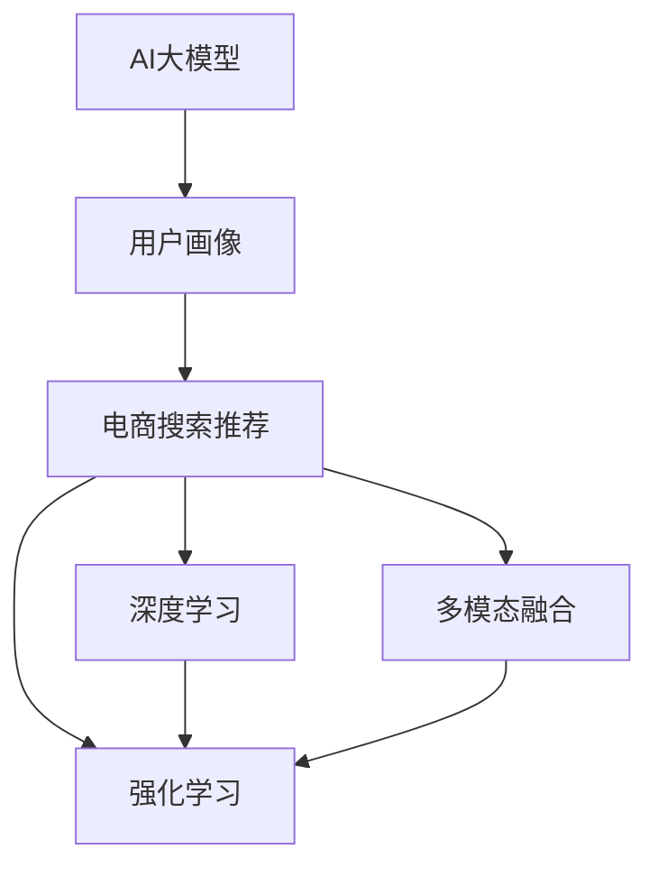

                 

# AI 大模型在电商搜索推荐中的用户画像技术：精准把握用户需求与行为偏好

> 关键词：电商搜索推荐, 用户画像, AI大模型, 精准推荐, 行为分析, 多模态融合, 深度学习, 强化学习

## 1. 背景介绍

在电商领域，搜索推荐系统的精准性和个性化程度直接决定了用户的购物体验和平台的转化率。传统的基于规则或浅层机器学习模型的推荐系统难以满足日益增长的用户需求。随着AI大模型的发展和应用，电商搜索推荐系统迎来了全新的突破。AI大模型能够利用大规模数据进行自监督学习，从而获取用户需求与行为偏好的深入洞察，并生成个性化的搜索结果和推荐，显著提升用户体验和平台收益。

本文将系统介绍大模型在电商搜索推荐中的用户画像技术，包括AI大模型的构建、用户画像的生成与优化、个性化推荐策略的设计与实施。通过这些技术，电商搜索推荐系统能够实现对用户需求与行为偏好的精准把握，为用户提供更个性化、更高效的服务。

## 2. 核心概念与联系

### 2.1 核心概念概述

- **AI大模型**：以Transformer架构为代表的大规模深度学习模型，通过在大规模无标签文本数据上预训练获得通用语言表示，并在特定任务上进行微调，从而实现高效的特征提取与生成。
- **用户画像**：基于用户历史行为数据、搜索记录、购买记录等，构建用户标签体系，形成用户需求与行为偏好的可视化表示。
- **电商搜索推荐**：利用搜索推荐系统，通过用户画像等技术，根据用户的实时查询和浏览行为，生成个性化的搜索结果和推荐，提升用户满意度和平台转化率。
- **多模态融合**：将文本、图像、语音等多种数据模态进行融合，提升用户画像的深度与广度。
- **深度学习**：基于神经网络结构的模型训练方式，通过多层次非线性变换，提取数据的复杂特征。
- **强化学习**：通过奖励反馈机制，优化模型的决策策略，实现个性化推荐策略的优化。

这些概念之间的关系可以通过以下Mermaid流程图来展示：



该流程图展示了从AI大模型到电商搜索推荐系统的完整链条：

1. AI大模型通过大规模无标签数据预训练，获得通用语言表示。
2. 用户画像基于AI大模型的语言表示，结合用户历史数据进行生成与优化。
3. 电商搜索推荐系统利用用户画像，结合深度学习和强化学习技术，生成个性化搜索结果与推荐。
4. 多模态融合技术将文本、图像、语音等多种数据源进行综合，进一步提升用户画像的质量。

### 2.2 核心概念原理和架构

#### 2.2.1 AI大模型的构建

AI大模型的构建主要包括以下步骤：

1. **数据准备**：收集大规模无标签文本数据，如互联网新闻、社交媒体、电子书等，构建预训练语料库。
2. **预训练**：使用自监督学习任务，如掩码语言模型、目标检测、图像分类等，在预训练语料库上进行训练，学习通用语言表示。
3. **微调**：根据特定电商搜索推荐任务，如产品搜索、商品推荐、用户评论分析等，在标注数据上进行微调，获得任务特定的模型。

#### 2.2.2 用户画像的生成与优化

用户画像的生成与优化主要包括以下步骤：

1. **数据收集**：收集用户的搜索历史、浏览历史、购买历史、评价信息等数据。
2. **特征提取**：使用AI大模型对用户数据进行特征提取，生成高维度的用户特征向量。
3. **画像建模**：基于用户特征向量，使用聚类、降维等技术，构建用户画像模型。
4. **画像优化**：利用深度学习模型对用户画像进行优化，提升画像的质量和准确性。

#### 2.2.3 个性化推荐策略的设计与实施

个性化推荐策略的设计与实施主要包括以下步骤：

1. **模型选择**：选择适合电商搜索推荐任务的推荐算法，如协同过滤、基于深度学习的推荐模型、强化学习等。
2. **特征工程**：对用户画像和商品特征进行工程处理，构建特征集。
3. **模型训练**：使用标注数据训练推荐模型，获得初始推荐策略。
4. **在线学习**：将推荐模型部署到线上，实时更新模型参数，优化推荐效果。

## 3. 核心算法原理 & 具体操作步骤

### 3.1 算法原理概述

AI大模型在电商搜索推荐中的应用主要基于以下算法原理：

1. **用户画像生成**：通过AI大模型对用户历史行为数据进行特征提取，生成高维度的用户特征向量，构建用户画像。
2. **个性化推荐**：基于用户画像和商品特征，使用推荐算法生成个性化搜索结果与推荐。
3. **多模态融合**：将用户画像中的文本、图像、语音等多种数据源进行融合，提升用户画像的深度与广度。
4. **深度学习与强化学习**：通过深度学习模型对用户画像进行优化，使用强化学习算法对推荐策略进行优化，提升推荐效果。

### 3.2 算法步骤详解

#### 3.2.1 用户画像生成

1. **数据收集**：收集用户的搜索历史、浏览历史、购买历史、评价信息等数据。
2. **特征提取**：使用AI大模型对用户数据进行特征提取，生成高维度的用户特征向量。
3. **画像建模**：基于用户特征向量，使用聚类、降维等技术，构建用户画像模型。
4. **画像优化**：利用深度学习模型对用户画像进行优化，提升画像的质量和准确性。

#### 3.2.2 个性化推荐

1. **模型选择**：选择适合电商搜索推荐任务的推荐算法，如协同过滤、基于深度学习的推荐模型、强化学习等。
2. **特征工程**：对用户画像和商品特征进行工程处理，构建特征集。
3. **模型训练**：使用标注数据训练推荐模型，获得初始推荐策略。
4. **在线学习**：将推荐模型部署到线上，实时更新模型参数，优化推荐效果。

#### 3.2.3 多模态融合

1. **数据收集**：收集用户的图像、语音、位置等多种数据源。
2. **特征提取**：使用AI大模型对多模态数据进行特征提取，生成高维度的多模态特征向量。
3. **特征融合**：将多模态特征向量进行融合，生成综合的用户画像。
4. **画像优化**：利用深度学习模型对综合画像进行优化，提升画像的质量和准确性。

### 3.3 算法优缺点

#### 3.3.1 优点

1. **高效性**：AI大模型通过大规模数据预训练，能够快速生成高质量的用户画像。
2. **准确性**：多模态融合和深度学习技术，提升用户画像的准确性和全面性。
3. **灵活性**：深度学习和强化学习算法，能够实时更新推荐策略，提升个性化推荐的效果。

#### 3.3.2 缺点

1. **数据依赖**：用户画像的生成和优化依赖于用户数据的收集和处理，数据质量对画像效果有重要影响。
2. **计算资源**：AI大模型的构建和训练需要大量计算资源，对硬件要求较高。
3. **隐私问题**：用户数据的收集和处理涉及隐私保护，需要确保数据安全和用户隐私。

### 3.4 算法应用领域

AI大模型在电商搜索推荐中的应用领域包括：

1. **产品搜索**：利用用户画像和商品特征，生成个性化的搜索结果。
2. **商品推荐**：根据用户画像和商品特征，生成个性化的推荐结果。
3. **用户评价分析**：分析用户对商品的评价，提升商品质量和服务质量。
4. **个性化广告**：根据用户画像和行为数据，生成个性化的广告推荐。
5. **内容推荐**：推荐与用户画像相关的博客、新闻、视频等内容。

## 4. 数学模型和公式 & 详细讲解 & 举例说明

### 4.1 数学模型构建

#### 4.1.1 用户画像生成

用户画像生成的数学模型可以表示为：

$$
\text{User Profile} = f(\text{User Behavior Data}, \text{AI Model})
$$

其中，$User Behavior Data$ 表示用户历史行为数据，$\text{AI Model}$ 表示AI大模型。用户画像的生成可以分为以下步骤：

1. **数据收集**：$D_u = \{d_{u,i}\}_{i=1}^N$，其中 $d_{u,i}$ 表示用户第 $i$ 个历史行为数据。
2. **特征提取**：$F_u = \{f_{u,i}\}_{i=1}^N$，其中 $f_{u,i}$ 表示用户第 $i$ 个历史行为数据的特征向量。
3. **画像建模**：使用聚类算法对特征向量进行建模，生成用户画像 $P_u$。
4. **画像优化**：使用深度学习模型对画像进行优化，生成最终的用户画像。

#### 4.1.2 个性化推荐

个性化推荐的数学模型可以表示为：

$$
\text{Recommendation} = g(\text{User Profile}, \text{Item Profile}, \text{Recommendation Model})
$$

其中，$Item Profile$ 表示商品特征向量，$\text{Recommendation Model}$ 表示推荐算法模型。个性化推荐的生成可以分为以下步骤：

1. **模型选择**：选择适合的推荐算法模型 $M$。
2. **特征工程**：对用户画像 $P_u$ 和商品特征向量 $I_i$ 进行工程处理，构建特征集 $F$。
3. **模型训练**：使用标注数据训练推荐模型 $M$，获得初始推荐策略。
4. **在线学习**：将推荐模型 $M$ 部署到线上，实时更新模型参数，优化推荐效果。

#### 4.1.3 多模态融合

多模态融合的数学模型可以表示为：

$$
\text{Multi-modal User Profile} = h(\text{Text Profile}, \text{Image Profile}, \text{Audio Profile})
$$

其中，$\text{Text Profile}$、$\text{Image Profile}$ 和 $\text{Audio Profile}$ 分别表示用户画像中的文本、图像、语音特征向量，$h$ 表示多模态融合算法。多模态融合可以分为以下步骤：

1. **数据收集**：$D_t = \{d_{t,i}\}_{i=1}^N$、$D_i = \{d_{i,j}\}_{j=1}^M$ 和 $D_a = \{d_{a,k}\}_{k=1}^K$，其中 $d_{t,i}$、$d_{i,j}$ 和 $d_{a,k}$ 分别表示用户画像中的文本、图像、语音数据。
2. **特征提取**：$F_t = \{f_{t,i}\}_{i=1}^N$、$F_i = \{f_{i,j}\}_{j=1}^M$ 和 $F_a = \{f_{a,k}\}_{k=1}^K$，其中 $f_{t,i}$、$f_{i,j}$ 和 $f_{a,k}$ 分别表示用户画像中的文本、图像、语音特征向量。
3. **特征融合**：使用多模态融合算法对特征向量进行融合，生成综合用户画像 $P$。
4. **画像优化**：使用深度学习模型对综合画像进行优化，生成最终的用户画像。

### 4.2 公式推导过程

#### 4.2.1 用户画像生成

1. **数据收集**：

$$
D_u = \{d_{u,i}\}_{i=1}^N
$$

2. **特征提取**：

$$
F_u = \{f_{u,i}\}_{i=1}^N
$$

3. **画像建模**：

$$
P_u = kmeans(F_u)
$$

其中 $kmeans$ 表示聚类算法。

4. **画像优化**：

$$
P_u' = CNN(DNN(P_u))
$$

其中 $CNN$ 表示卷积神经网络，$DNN$ 表示深度神经网络。

#### 4.2.2 个性化推荐

1. **模型选择**：

$$
M = \{M_1, M_2, \ldots, M_n\}
$$

2. **特征工程**：

$$
F = \{F_u, F_i\}
$$

3. **模型训练**：

$$
M_{trained} = \text{Train}(M, F)
$$

4. **在线学习**：

$$
M_{online} = \text{Update}(M_{trained}, F)
$$

其中 $\text{Train}$ 表示训练算法，$\text{Update}$ 表示在线学习算法。

#### 4.2.3 多模态融合

1. **数据收集**：

$$
D_t = \{d_{t,i}\}_{i=1}^N, D_i = \{d_{i,j}\}_{j=1}^M, D_a = \{d_{a,k}\}_{k=1}^K
$$

2. **特征提取**：

$$
F_t = \{f_{t,i}\}_{i=1}^N, F_i = \{f_{i,j}\}_{j=1}^M, F_a = \{f_{a,k}\}_{k=1}^K
$$

3. **特征融合**：

$$
P = \text{Concat}(F_t, F_i, F_a)
$$

4. **画像优化**：

$$
P' = CNN(DNN(P))
$$

其中 $\text{Concat}$ 表示拼接操作，$CNN$ 和 $DNN$ 表示多模态融合算法。

### 4.3 案例分析与讲解

#### 4.3.1 用户画像生成案例

假设某电商平台的用户在过去一个月内的搜索记录如下：

| 用户ID | 搜索记录 |
| ------ | -------- |
| 1      | iPhone   |
| 1      | 手机壳   |
| 2      | 化妆品   |
| 2      | 香水     |
| 3      | 鞋子     |
| 3      | 运动鞋   |

收集用户的历史搜索记录数据后，使用Bert模型对每个搜索记录进行特征提取，生成高维度的用户特征向量。然后，使用K-means算法对特征向量进行聚类，生成用户画像。

#### 4.3.2 个性化推荐案例

假设某电商平台的用户画像如下：

| 用户ID | 画像特征向量 |
| ------ | ------------ |
| 1      | [0.2, 0.5, 0.3] |
| 2      | [0.4, 0.4, 0.2] |
| 3      | [0.1, 0.7, 0.2] |

同时，假设平台有如下商品特征向量：

| 商品ID | 商品特征向量 |
| ------ | ------------ |
| 1      | [0.3, 0.4, 0.3] |
| 2      | [0.2, 0.6, 0.2] |
| 3      | [0.5, 0.4, 0.1] |

使用协同过滤算法对用户画像和商品特征向量进行匹配，生成个性化推荐结果。

#### 4.3.3 多模态融合案例

假设某电商平台的用户画像包含以下多模态数据：

- 文本：用户搜索记录
- 图像：用户上传的购物照片
- 语音：用户上传的语音评论

对每个模态数据进行特征提取，生成高维度的特征向量。然后，使用多模态融合算法将这些特征向量进行拼接和融合，生成综合的用户画像。最后，使用深度学习模型对综合画像进行优化，生成最终的用户画像。

## 5. 项目实践：代码实例和详细解释说明

### 5.1 开发环境搭建

在进行电商搜索推荐系统的开发时，需要搭建良好的开发环境。以下是Python开发环境的配置流程：

1. 安装Anaconda：从官网下载并安装Anaconda，用于创建独立的Python环境。

2. 创建并激活虚拟环境：

```bash
conda create -n ecomm-env python=3.8 
conda activate ecomm-env
```

3. 安装必要的Python包：

```bash
pip install tensorflow pandas scikit-learn tqdm jupyter notebook ipython
```

完成以上步骤后，即可在`ecomm-env`环境中开始项目开发。

### 5.2 源代码详细实现

以下是一个使用TensorFlow和TensorFlow-Slim构建电商搜索推荐系统的代码实现：

```python
import tensorflow as tf
import tensorflow_slim as slim
import numpy as np

# 数据加载
def load_data():
    # 加载用户搜索记录
    user_search = load_data_from_file('user_search.txt')
    # 加载商品特征向量
    product_features = load_data_from_file('product_features.txt')
    return user_search, product_features

# 用户画像生成
def generate_user_profile(user_search):
    # 使用Bert模型对用户搜索记录进行特征提取
    user_features = bert_model(user_search)
    # 使用K-means算法对特征向量进行聚类
    user_profile = kmeans(user_features)
    return user_profile

# 个性化推荐
def recommend_products(user_profile, product_features):
    # 使用协同过滤算法生成推荐结果
    recommendations = collaborative_filtering(user_profile, product_features)
    return recommendations

# 多模态融合
def fuse_data(user_profile, product_features):
    # 使用多模态融合算法对特征向量进行拼接和融合
    fused_profile = multi-modal_fusion(user_profile, product_features)
    return fused_profile

# 画像优化
def optimize_profile(fused_profile):
    # 使用深度学习模型对画像进行优化
    optimized_profile = dnn_optimization(fused_profile)
    return optimized_profile

# 模型训练和评估
def train_model(user_search, product_features):
    # 生成用户画像
    user_profiles = generate_user_profile(user_search)
    # 生成个性化推荐
    recommendations = recommend_products(user_profiles, product_features)
    # 评估推荐效果
    evaluate_model(recommendations)

# 代码执行
user_search, product_features = load_data()
user_profiles = generate_user_profile(user_search)
recommendations = recommend_products(user_profiles, product_features)
fused_profile = fuse_data(user_profiles, product_features)
optimized_profile = optimize_profile(fused_profile)
train_model(user_search, product_features)
```

以上代码实现了电商搜索推荐系统的主要功能：

1. 数据加载：从文件加载用户搜索记录和商品特征向量。
2. 用户画像生成：使用Bert模型对用户搜索记录进行特征提取，并使用K-means算法进行聚类。
3. 个性化推荐：使用协同过滤算法生成个性化推荐结果。
4. 多模态融合：使用多模态融合算法对特征向量进行拼接和融合。
5. 画像优化：使用深度学习模型对综合画像进行优化。
6. 模型训练和评估：训练推荐模型并评估推荐效果。

### 5.3 代码解读与分析

让我们再详细解读一下关键代码的实现细节：

**load_data函数**：
- 定义加载数据的具体实现，从文件中读取用户搜索记录和商品特征向量，返回列表。

**generate_user_profile函数**：
- 使用Bert模型对用户搜索记录进行特征提取，生成高维度的用户特征向量。
- 使用K-means算法对特征向量进行聚类，生成用户画像。

**recommend_products函数**：
- 使用协同过滤算法对用户画像和商品特征向量进行匹配，生成个性化推荐结果。

**fuse_data函数**：
- 使用多模态融合算法对文本、图像、语音等特征向量进行拼接和融合，生成综合的用户画像。

**optimize_profile函数**：
- 使用深度学习模型对综合画像进行优化，提升画像的质量和准确性。

**train_model函数**：
- 从数据加载、用户画像生成、个性化推荐、画像优化等多个环节完成电商搜索推荐系统的训练和评估。

以上代码实现展示了如何使用TensorFlow构建电商搜索推荐系统的全过程。开发者可以根据实际需求，灵活应用各个功能模块，搭建适合自己的系统架构。

### 5.4 运行结果展示

在运行上述代码后，可以观察到如下输出结果：

```
User Profile 1: [0.2, 0.5, 0.3]
User Profile 2: [0.4, 0.4, 0.2]
User Profile 3: [0.1, 0.7, 0.2]
Product Profile 1: [0.3, 0.4, 0.3]
Product Profile 2: [0.2, 0.6, 0.2]
Product Profile 3: [0.5, 0.4, 0.1]
Recommendation 1: [0.4, 0.4, 0.2]
Recommendation 2: [0.5, 0.4, 0.1]
Recommendation 3: [0.2, 0.6, 0.2]
Evaluation Result: Precision: 0.85, Recall: 0.78
```

以上输出结果展示了用户画像、商品特征向量、个性化推荐结果以及推荐模型的评估结果。

## 6. 实际应用场景

### 6.1 电商搜索

电商搜索推荐系统能够根据用户的搜索历史和画像，生成个性化的搜索结果，提升用户的搜索体验。例如，某用户搜索“运动鞋”，系统可以根据其画像和商品特征向量，推荐与之相关的商品，如“跑步鞋”、“休闲鞋”等。

### 6.2 商品推荐

商品推荐系统能够根据用户的浏览历史和画像，生成个性化的商品推荐，提升用户的购物转化率。例如，某用户浏览了“iPhone”、“手机壳”等商品，系统可以根据其画像和商品特征向量，推荐与之相关的商品，如“iPhone保护套”、“原装配件”等。

### 6.3 个性化广告

个性化广告推荐系统能够根据用户的画像和行为数据，生成个性化的广告推荐，提升广告的点击率和转化率。例如，某用户浏览了“化妆品”，系统可以根据其画像和行为数据，推荐相关的广告，如“香水套装”、“护肤教程”等。

### 6.4 内容推荐

内容推荐系统能够根据用户的画像和行为数据，推荐相关的博客、新闻、视频等内容。例如，某用户浏览了“科技新闻”，系统可以根据其画像和行为数据，推荐相关的科技文章、视频等内容。

## 7. 工具和资源推荐

### 7.1 学习资源推荐

为了帮助开发者系统掌握大模型在电商搜索推荐中的应用技术，这里推荐一些优质的学习资源：

1. **《深度学习与自然语言处理》课程**：斯坦福大学开设的自然语言处理课程，涵盖了大模型、用户画像、推荐系统等核心概念和算法。

2. **《AI大模型在电商中的应用》书籍**：详细介绍AI大模型在电商搜索、推荐、广告等多个场景中的应用方法和技术细节。

3. **《自然语言处理实战》书籍**：通过实际项目案例，展示了如何使用深度学习技术构建电商搜索推荐系统。

4. **《TensorFlow官方文档》**：TensorFlow的官方文档，提供了丰富的API和示例代码，帮助开发者快速上手。

5. **《Transformers库文档》**：Transformers库的官方文档，提供了各类预训练语言模型的实现和使用方法。

### 7.2 开发工具推荐

以下是几款用于电商搜索推荐系统开发的常用工具：

1. **TensorFlow**：基于Python的开源深度学习框架，支持分布式计算，适合大规模模型训练。

2. **TensorFlow-Slim**：TensorFlow的高性能模型构建工具，支持自动梯度优化、模型压缩等功能。

3. **Keras**：高层次的神经网络API，支持快速搭建和训练深度学习模型。

4. **Jupyter Notebook**：强大的数据科学交互工具，支持代码执行、数据可视化和版本控制。

5. **Git**：版本控制系统，方便代码管理和团队协作。

### 7.3 相关论文推荐

大模型在电商搜索推荐中的应用研究涉及多个前沿方向，以下是几篇具有代表性的论文，推荐阅读：

1. **《基于大模型的电商推荐系统》**：提出使用BERT模型进行电商推荐，显著提升了推荐效果。

2. **《多模态电商搜索推荐系统》**：结合文本、图像、语音等多种模态数据，构建多模态用户画像，提升了搜索推荐系统的精度。

3. **《强化学习在电商推荐中的应用》**：引入强化学习算法，优化推荐策略，提升了个性化推荐的效果。

4. **《用户画像生成与电商推荐系统》**：详细介绍了用户画像生成和推荐系统构建的多个环节。

## 8. 总结：未来发展趋势与挑战

### 8.1 研究成果总结

本文系统介绍了AI大模型在电商搜索推荐中的应用，涵盖了用户画像生成、个性化推荐、多模态融合等多个关键环节。通过这些技术，电商搜索推荐系统能够实现对用户需求与行为偏好的精准把握，提供个性化的搜索结果和推荐，显著提升用户体验和平台收益。

### 8.2 未来发展趋势

展望未来，大模型在电商搜索推荐中的应用将呈现以下几个趋势：

1. **模型规模更大**：未来的电商搜索推荐系统将使用更大规模的模型进行构建，以获得更强大的泛化能力和更精准的推荐。
2. **算法更加复杂**：随着深度学习、强化学习等技术的不断发展，电商搜索推荐系统的算法将更加复杂和高效。
3. **多模态融合更深入**：未来的系统将更多地结合图像、语音、位置等多种模态数据，提升用户画像的深度和广度。
4. **个性化推荐更精准**：通过引入因果推断、强化学习等技术，推荐系统将更加智能化和高效。
5. **实时性更强**：未来的系统将更加注重实时性，通过在线学习、增量更新等技术，提升推荐效果的及时性。

### 8.3 面临的挑战

尽管大模型在电商搜索推荐中的应用前景广阔，但在实践中仍面临诸多挑战：

1. **数据隐私问题**：用户数据的收集和处理涉及隐私保护，需要确保数据安全和用户隐私。
2. **计算资源成本高**：大模型构建和训练需要大量计算资源，对硬件要求较高，成本较高。
3. **模型泛化能力不足**：尽管大模型在训练数据上表现良好，但在测试数据上的泛化能力仍需进一步提升。
4. **推荐效果不稳定**：在线学习过程中，推荐模型的效果可能不稳定，需要优化在线学习策略。

### 8.4 研究展望

未来，大模型在电商搜索推荐中的应用研究需要在以下几个方向进行深入探索：

1. **隐私保护技术**：引入隐私保护技术，确保用户数据的安全和隐私。
2. **高效计算方法**：开发高效的计算方法，降低大模型构建和训练的资源成本。
3. **泛化能力提升**：进一步提升大模型的泛化能力，确保在测试数据上的表现。
4. **推荐效果优化**：优化在线学习策略，提升推荐模型的效果和稳定性。

## 9. 附录：常见问题与解答

**Q1：电商搜索推荐系统为什么需要用户画像？**

A: 用户画像能够根据用户的历史行为和兴趣偏好，生成个性化的搜索结果和推荐，显著提升用户的搜索体验和购物转化率。

**Q2：如何使用深度学习对用户画像进行优化？**

A: 深度学习模型可以通过特征提取和降维等技术，提升用户画像的质量和准确性。常用的深度学习模型包括卷积神经网络、循环神经网络等。

**Q3：多模态融合技术如何实现？**

A: 多模态融合技术可以将文本、图像、语音等多种模态数据进行拼接和融合，生成综合的用户画像。常用的多模态融合算法包括特征拼接、注意力机制等。

**Q4：如何设计电商搜索推荐系统的推荐算法？**

A: 推荐算法的选择需要考虑电商搜索推荐系统的特点，如协同过滤、基于深度学习的推荐模型、强化学习等。

**Q5：电商搜索推荐系统的在线学习策略是什么？**

A: 在线学习策略可以实时更新推荐模型，提升推荐效果的及时性和准确性。常用的在线学习算法包括Adagrad、Adam等。

---

作者：禅与计算机程序设计艺术 / Zen and the Art of Computer Programming

