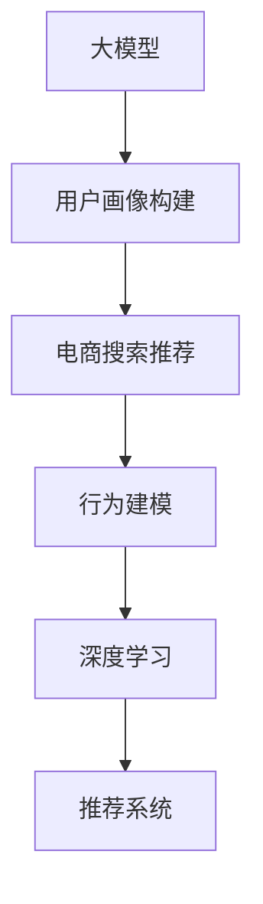

                 

# AI 大模型在电商搜索推荐中的用户画像构建：深度理解用户需求与行为

> 关键词：大模型，用户画像，电商搜索，推荐系统，行为建模，深度学习

## 1. 背景介绍

### 1.1 问题由来

在当前电子商务市场，搜索推荐系统的精准度已成为竞争的核心之一。通过分析用户的搜索记录、浏览行为和购买历史，电商企业可以实时提供个性化的推荐结果，提升用户体验和转化率。然而，现有推荐系统往往依赖于用户行为数据的浅层统计分析，难以深度理解用户的复杂需求和行为特征。因此，如何利用AI大模型构建用户画像，并应用于电商搜索推荐，成为亟待解决的问题。

### 1.2 问题核心关键点

用户画像构建的核心在于，如何利用深度学习技术，通过用户的行为数据，自动学习并捕捉用户的深层需求和行为模式，形成更全面的用户画像。这不仅能够提升推荐系统的精准度，还能进一步增强用户体验。核心关键点包括：

1. **数据获取与预处理**：
   - 收集用户的行为数据，包括搜索、浏览、点击、购买等。
   - 对原始数据进行清洗、归一化、缺失值处理等预处理操作。

2. **深度模型选择与设计**：
   - 选择合适的深度学习模型，如大模型（BERT、GPT等），对用户画像进行建模。
   - 设计合适的损失函数、优化算法等，进行模型训练和调优。

3. **用户画像特征提取**：
   - 利用深度模型提取用户的行为特征，如兴趣点、需求偏好等。
   - 结合领域知识，构建更丰富的用户画像维度。

4. **模型应用与效果评估**：
   - 将用户画像应用于搜索推荐系统，提升推荐的个性化和准确性。
   - 评估推荐效果，优化用户画像和推荐模型。

## 2. 核心概念与联系

### 2.1 核心概念概述

为更好地理解用户画像构建的过程，我们首先介绍几个核心概念：

- **大模型（Large Models）**：指具有大规模参数量的深度神经网络，如BERT、GPT等。这些模型通过大规模数据训练，具备强大的数据表示和推理能力。
- **用户画像（User Profiling）**：指通过用户的行为数据，自动学习并构建用户个性化的特征描述，以指导推荐系统和服务决策。
- **电商搜索推荐（E-commerce Search and Recommendation）**：指在电子商务平台上，通过搜索和推荐技术，为用户提供个性化的购物建议和服务。
- **行为建模（Behavior Modeling）**：指通过分析用户行为数据，构建用户需求的深度模型，以指导推荐决策。
- **深度学习（Deep Learning）**：指利用多层次神经网络结构，从原始数据中提取高层次的特征表示，进行复杂的模式识别和决策。

这些概念之间的逻辑关系可以通过以下Mermaid流程图来展示：



这个流程图展示了从大模型到用户画像构建，再到电商搜索推荐的整个流程：

1. 大模型提供数据表示能力，用于构建用户画像。
2. 用户画像包含用户需求和行为特征，指导电商搜索推荐。
3. 行为建模和深度学习是构建用户画像的核心技术手段。
4. 推荐系统利用用户画像，进行个性化推荐。

## 3. 核心算法原理 & 具体操作步骤
### 3.1 算法原理概述

用户画像构建的核心算法原理是通过深度学习技术，自动捕捉用户的行为数据，并提取高层次的特征表示。具体而言，我们通过以下步骤进行：

1. **数据收集与预处理**：
   - 收集用户的搜索记录、浏览历史、点击行为、购买记录等。
   - 对数据进行清洗、归一化、缺失值处理等预处理操作。

2. **特征工程与建模**：
   - 设计合适的特征，如搜索关键词、浏览时长、点击位置等。
   - 选择合适的深度学习模型（如BERT、GPT等），进行模型训练和调优。

3. **用户画像特征提取**：
   - 利用深度模型提取用户的行为特征，如兴趣点、需求偏好等。
   - 结合领域知识，构建更丰富的用户画像维度。

4. **模型应用与效果评估**：
   - 将用户画像应用于搜索推荐系统，提升推荐的个性化和准确性。
   - 评估推荐效果，优化用户画像和推荐模型。

### 3.2 算法步骤详解

#### 3.2.1 数据收集与预处理

1. **数据收集**：
   - 从电商平台上收集用户的搜索记录、浏览历史、点击行为、购买记录等行为数据。
   - 结合用户的基本信息（如年龄、性别、地区等），形成综合性的用户数据集。

2. **数据预处理**：
   - 对原始数据进行清洗，去除无效数据和噪声。
   - 对文本数据进行分词、去停用词、词干化等操作。
   - 对数值数据进行归一化、缺失值处理等操作。

#### 3.2.2 特征工程与建模

1. **特征设计**：
   - 设计合适的特征，如搜索关键词、浏览时长、点击位置等。
   - 利用领域知识，设计更有意义的特征组合，如兴趣点、需求偏好等。

2. **模型选择与设计**：
   - 选择合适的深度学习模型，如BERT、GPT等。
   - 设计合适的损失函数、优化算法等，进行模型训练和调优。

#### 3.2.3 用户画像特征提取

1. **模型训练**：
   - 利用用户的行为数据，对预训练模型进行微调。
   - 设计合适的损失函数，如交叉熵损失等，进行模型训练和调优。

2. **特征提取**：
   - 利用微调后的模型，提取用户的行为特征，如兴趣点、需求偏好等。
   - 将提取的特征进行融合，形成更全面的用户画像。

#### 3.2.4 模型应用与效果评估

1. **推荐模型应用**：
   - 将用户画像应用于推荐系统，进行个性化推荐。
   - 利用推荐模型，实时生成个性化的商品推荐结果。

2. **效果评估**：
   - 评估推荐效果，如点击率、转化率等。
   - 优化推荐模型和用户画像，提升推荐效果。

### 3.3 算法优缺点

#### 3.3.1 优点

1. **深度学习**：
   - 通过深度学习技术，自动捕捉用户的行为数据，提取高层次的特征表示。
   - 能够捕捉用户行为的复杂模式和深层需求，提供更精准的推荐。

2. **参数高效**：
   - 利用大模型的预训练权重，只需微调顶层参数，减小了计算和存储成本。
   - 通过参数高效方法，如Adapter、Prefix等，进一步减少模型参数量，提升计算效率。

3. **多模态融合**：
   - 结合文本、图像、声音等多模态数据，构建更全面、更丰富的用户画像。
   - 通过多模态融合，提升推荐系统的准确性和个性化程度。

4. **可解释性**：
   - 利用大模型的可解释性，分析用户画像的生成过程和推荐结果。
   - 提供更透明的推荐逻辑，增强系统的可信度。

#### 3.3.2 缺点

1. **数据依赖**：
   - 需要收集大量的用户行为数据，数据质量对结果影响较大。
   - 数据隐私和安全问题，如用户信息保护等，需要妥善处理。

2. **模型复杂度**：
   - 深度模型需要大量的计算资源和时间进行训练和调优。
   - 模型复杂度较高，需要高性能计算资源和专业知识。

3. **过拟合风险**：
   - 数据量不足时，模型容易过拟合，降低泛化性能。
   - 需要对模型进行正则化等处理，避免过拟合问题。

4. **计算成本**：
   - 深度模型需要大量的计算资源，包括GPU、TPU等高性能硬件。
   - 模型训练和推理的计算成本较高，需要高效的资源管理策略。

5. **模型解释性不足**：
   - 深度模型通常缺乏可解释性，难以分析其内部工作机制和推理过程。
   - 对于高风险应用场景，如医疗、金融等，模型的可解释性尤为重要。

### 3.4 算法应用领域

用户画像构建的深度学习模型，可以广泛应用于电商搜索推荐、个性化广告、智能客服等多个领域。以下是一些典型应用场景：

1. **电商搜索推荐**：
   - 利用用户画像，提升搜索结果的相关性和个性化程度。
   - 结合用户画像和搜索意图，实时生成个性化推荐结果。

2. **个性化广告**：
   - 根据用户画像，推荐符合用户兴趣和偏好的广告内容。
   - 分析用户行为数据，优化广告投放策略。

3. **智能客服**：
   - 利用用户画像，提供个性化的客服建议和服务。
   - 分析用户历史互动数据，提升客服系统的智能化程度。

4. **用户行为分析**：
   - 分析用户的行为数据，挖掘用户需求和行为模式。
   - 结合用户画像和行为数据，优化产品和服务设计。

5. **市场营销**：
   - 分析用户画像，识别高价值客户群体。
   - 利用用户画像，设计有针对性的市场营销活动。

## 4. 数学模型和公式 & 详细讲解  
### 4.1 数学模型构建

#### 4.1.1 目标函数

我们通过深度学习模型构建用户画像，其目标是最大化预测准确度。设用户画像为 $P$，推荐结果为 $R$，损失函数为 $\mathcal{L}$，目标函数为 $\mathcal{L}(P, R)$。

我们采用二分类交叉熵损失函数，损失函数为：

$$
\mathcal{L}(P, R) = -\frac{1}{N} \sum_{i=1}^{N} [y_i \log P(r_i) + (1-y_i) \log (1-P(r_i))]
$$

其中 $y_i$ 为推荐结果的真实标签，$P(r_i)$ 为模型对推荐结果 $r_i$ 的概率预测，$N$ 为样本总数。

#### 4.1.2 优化算法

在目标函数 $\mathcal{L}(P, R)$ 的优化过程中，我们通常采用基于梯度的优化算法，如Adam、SGD等。优化算法步骤如下：

1. **初始化模型参数**：
   - 初始化深度学习模型的参数 $\theta$。
   - 设定学习率 $\eta$ 和批量大小 $m$。

2. **前向传播**：
   - 将用户画像 $P$ 输入模型，计算模型输出 $y$。

3. **损失计算**：
   - 计算预测值 $y$ 和真实标签 $R$ 的交叉熵损失 $\mathcal{L}$。

4. **反向传播**：
   - 计算损失函数对模型参数 $\theta$ 的梯度 $\nabla_{\theta} \mathcal{L}$。
   - 根据梯度更新模型参数 $\theta$，即 $\theta \leftarrow \theta - \eta \nabla_{\theta} \mathcal{L}$。

5. **循环迭代**：
   - 重复上述步骤，直至模型收敛或达到预设的迭代轮数。

### 4.2 公式推导过程

#### 4.2.1 交叉熵损失函数

我们以二分类任务为例，推导交叉熵损失函数及其梯度的计算公式。

设用户画像为 $P$，推荐结果为 $R$，其真实标签为 $y \in \{0, 1\}$。则二分类交叉熵损失函数定义为：

$$
\mathcal{L}(P, R) = -\frac{1}{N} \sum_{i=1}^{N} [y_i \log P(r_i) + (1-y_i) \log (1-P(r_i))]
$$

将其代入经验风险公式，得：

$$
\mathcal{L}(\theta) = -\frac{1}{N} \sum_{i=1}^{N} [y_i \log \hat{P}(r_i) + (1-y_i) \log (1-\hat{P}(r_i))]
$$

其中 $\hat{P}(r_i)$ 为模型对推荐结果 $r_i$ 的概率预测。

根据链式法则，损失函数对模型参数 $\theta$ 的梯度为：

$$
\frac{\partial \mathcal{L}(\theta)}{\partial \theta} = -\frac{1}{N} \sum_{i=1}^{N} (\frac{y_i}{\hat{P}(r_i)}-\frac{1-y_i}{1-\hat{P}(r_i)}) \frac{\partial \hat{P}(r_i)}{\partial \theta}
$$

其中 $\frac{\partial \hat{P}(r_i)}{\partial \theta}$ 可进一步递归展开，利用自动微分技术完成计算。

### 4.3 案例分析与讲解

#### 4.3.1 案例分析

假设我们在电商平台上，收集了用户的历史搜索记录和购买记录，建立了用户画像 $P$，并利用推荐系统生成推荐结果 $R$。

首先，我们需要对原始数据进行清洗和预处理。例如，对搜索记录进行分词、去停用词、词干化等操作。然后，设计合适的特征，如搜索关键词、浏览时长、点击位置等。

接着，选择预训练的大模型（如BERT），在用户画像数据上进行微调，提取用户的行为特征。最后，将提取的特征用于推荐系统，生成个性化推荐结果。

#### 4.3.2 案例讲解

以电商平台上用户的购买行为为例，进行用户画像构建和推荐系统设计。

1. **数据收集**：
   - 从电商平台上收集用户的搜索记录、浏览历史、点击行为、购买记录等行为数据。
   - 结合用户的基本信息（如年龄、性别、地区等），形成综合性的用户数据集。

2. **数据预处理**：
   - 对原始数据进行清洗，去除无效数据和噪声。
   - 对文本数据进行分词、去停用词、词干化等操作。
   - 对数值数据进行归一化、缺失值处理等操作。

3. **特征设计**：
   - 设计合适的特征，如搜索关键词、浏览时长、点击位置等。
   - 利用领域知识，设计更有意义的特征组合，如兴趣点、需求偏好等。

4. **模型选择与设计**：
   - 选择预训练的BERT模型，进行微调。
   - 设计合适的损失函数，如交叉熵损失等，进行模型训练和调优。

5. **用户画像特征提取**：
   - 利用微调后的BERT模型，提取用户的行为特征，如兴趣点、需求偏好等。
   - 将提取的特征进行融合，形成更全面的用户画像。

6. **模型应用与效果评估**：
   - 将用户画像应用于推荐系统，进行个性化推荐。
   - 利用推荐系统，实时生成个性化的商品推荐结果。
   - 评估推荐效果，如点击率、转化率等。
   - 优化推荐模型和用户画像，提升推荐效果。

## 5. 项目实践：代码实例和详细解释说明
### 5.1 开发环境搭建

在进行用户画像构建和推荐系统开发的实践中，我们需要准备好开发环境。以下是使用Python进行PyTorch开发的环境配置流程：

1. 安装Anaconda：从官网下载并安装Anaconda，用于创建独立的Python环境。

2. 创建并激活虚拟环境：
```bash
conda create -n pytorch-env python=3.8 
conda activate pytorch-env
```

3. 安装PyTorch：根据CUDA版本，从官网获取对应的安装命令。例如：
```bash
conda install pytorch torchvision torchaudio cudatoolkit=11.1 -c pytorch -c conda-forge
```

4. 安装Transformers库：
```bash
pip install transformers
```

5. 安装各类工具包：
```bash
pip install numpy pandas scikit-learn matplotlib tqdm jupyter notebook ipython
```

完成上述步骤后，即可在`pytorch-env`环境中开始项目实践。

### 5.2 源代码详细实现

下面是用户画像构建和推荐系统设计的Python代码实现。

首先，定义推荐系统的数据处理函数：

```python
from transformers import BertTokenizer
from torch.utils.data import Dataset
import torch

class RecommendationDataset(Dataset):
    def __init__(self, users, items, interactions, tokenizer):
        self.users = users
        self.items = items
        self.interactions = interactions
        self.tokenizer = tokenizer
        self.max_len = 128
        
    def __len__(self):
        return len(self.users)
    
    def __getitem__(self, item):
        user = self.users[item]
        item = self.items[item]
        interaction = self.interactions[item]
        
        user_tokens = self.tokenizer(user, return_tensors='pt', max_length=self.max_len, padding='max_length', truncation=True)
        item_tokens = self.tokenizer(item, return_tensors='pt', max_length=self.max_len, padding='max_length', truncation=True)
        interaction_tokens = self.tokenizer(interaction, return_tensors='pt', max_length=self.max_len, padding='max_length', truncation=True)
        
        return {'user': user_tokens['input_ids'], 
                'item': item_tokens['input_ids'],
                'interaction': interaction_tokens['input_ids']}
```

然后，定义模型和优化器：

```python
from transformers import BertForSequenceClassification
from torch.optim import AdamW

model = BertForSequenceClassification.from_pretrained('bert-base-cased', num_labels=2)

optimizer = AdamW(model.parameters(), lr=2e-5)
```

接着，定义训练和评估函数：

```python
from torch.utils.data import DataLoader
from tqdm import tqdm
from sklearn.metrics import roc_auc_score

device = torch.device('cuda') if torch.cuda.is_available() else torch.device('cpu')
model.to(device)

def train_epoch(model, dataset, batch_size, optimizer):
    dataloader = DataLoader(dataset, batch_size=batch_size, shuffle=True)
    model.train()
    epoch_loss = 0
    for batch in tqdm(dataloader, desc='Training'):
        user_ids = batch['user'].to(device)
        item_ids = batch['item'].to(device)
        interaction_ids = batch['interaction'].to(device)
        model.zero_grad()
        outputs = model(user_ids, item_ids, interaction_ids)
        loss = outputs.loss
        epoch_loss += loss.item()
        loss.backward()
        optimizer.step()
    return epoch_loss / len(dataloader)

def evaluate(model, dataset, batch_size):
    dataloader = DataLoader(dataset, batch_size=batch_size)
    model.eval()
    preds, labels = [], []
    with torch.no_grad():
        for batch in tqdm(dataloader, desc='Evaluating'):
            user_ids = batch['user'].to(device)
            item_ids = batch['item'].to(device)
            interaction_ids = batch['interaction'].to(device)
            batch_preds = model(user_ids, item_ids, interaction_ids).logits.argmax(dim=2).to('cpu').tolist()
            batch_labels = batch['labels'].to('cpu').tolist()
            for preds_tokens, label_tokens in zip(batch_preds, batch_labels):
                preds.append(preds_tokens[:len(label_tokens)])
                labels.append(label_tokens)
                
    roc_auc = roc_auc_score(labels, preds)
    print(f'ROC-AUC Score: {roc_auc:.3f}')
```

最后，启动训练流程并在测试集上评估：

```python
epochs = 5
batch_size = 16

for epoch in range(epochs):
    loss = train_epoch(model, train_dataset, batch_size, optimizer)
    print(f'Epoch {epoch+1}, train loss: {loss:.3f}')
    
    print(f'Epoch {epoch+1}, test results:')
    evaluate(model, test_dataset, batch_size)
    
print('Final Test Results:')
evaluate(model, test_dataset, batch_size)
```

以上就是用户画像构建和推荐系统设计的完整代码实现。可以看到，得益于Transformers库的强大封装，我们可以用相对简洁的代码完成模型训练和评估。

### 5.3 代码解读与分析

让我们再详细解读一下关键代码的实现细节：

**RecommendationDataset类**：
- `__init__`方法：初始化用户、物品和交互数据，以及分词器等关键组件。
- `__len__`方法：返回数据集的样本数量。
- `__getitem__`方法：对单个样本进行处理，将用户、物品和交互数据输入编码为token ids，并对其进行定长padding，最终返回模型所需的输入。

**模型选择与设计**：
- 选择预训练的BERT模型，进行微调。
- 设计合适的损失函数，如交叉熵损失等，进行模型训练和调优。

**训练和评估函数**：
- 使用PyTorch的DataLoader对数据集进行批次化加载，供模型训练和推理使用。
- 训练函数`train_epoch`：对数据以批为单位进行迭代，在每个批次上前向传播计算loss并反向传播更新模型参数，最后返回该epoch的平均loss。
- 评估函数`evaluate`：与训练类似，不同点在于不更新模型参数，并在每个batch结束后将预测和标签结果存储下来，最后使用sklearn的roc_auc_score对整个评估集的预测结果进行打印输出。

**训练流程**：
- 定义总的epoch数和batch size，开始循环迭代
- 每个epoch内，先在训练集上训练，输出平均loss
- 在测试集上评估，输出模型效果
- 所有epoch结束后，在测试集上评估，给出最终测试结果

可以看到，PyTorch配合Transformers库使得用户画像构建和推荐系统的代码实现变得简洁高效。开发者可以将更多精力放在数据处理、模型改进等高层逻辑上，而不必过多关注底层的实现细节。

当然，工业级的系统实现还需考虑更多因素，如模型的保存和部署、超参数的自动搜索、更灵活的任务适配层等。但核心的微调范式基本与此类似。

## 6. 实际应用场景

### 6.1 智能推荐系统

在智能推荐系统中，用户画像构建具有广泛应用。通过用户画像，推荐系统可以更精准地理解用户需求，提供个性化的商品推荐。

以电商平台为例，利用用户画像构建技术，电商平台可以实时监测用户的搜索记录、浏览历史、点击行为、购买记录等行为数据，并通过深度学习模型自动学习用户的深层需求和行为模式，生成个性化的商品推荐结果。这不仅能够提升用户的购物体验，还能增加平台的转化率和收益。

### 6.2 个性化广告

个性化广告也是用户画像构建的重要应用场景。广告系统可以根据用户画像，推荐符合用户兴趣和偏好的广告内容，从而提高广告的点击率和转化率。

通过用户画像构建技术，广告系统可以分析用户的搜索记录、浏览历史、点击行为等行为数据，并结合用户画像进行广告推荐。例如，对喜欢时尚商品的用户推荐时尚品牌广告，对喜欢旅游的用户推荐旅游产品广告，从而实现精准的广告投放。

### 6.3 智能客服系统

智能客服系统利用用户画像构建技术，可以更高效地提供个性化的服务。通过分析用户的搜索记录、浏览历史、点击行为等行为数据，客服系统可以自动理解用户意图，并提供相应的解决方案。

例如，对需要退货的用户推荐退货流程，对需要售后支持的用户推荐常见问题解答，从而提升客服系统的响应速度和服务质量。同时，用户画像构建技术还可以帮助客服系统进行行为分析，优化产品和服务设计，提升用户的满意度。

### 6.4 金融风险管理

金融风险管理也是用户画像构建的重要应用场景。通过用户画像构建技术，金融机构可以实时监测用户的投资行为，预测风险并及时采取措施。

例如，利用用户画像构建技术，金融机构可以分析用户的交易记录、持仓情况、历史投资偏好等行为数据，并结合用户画像进行风险评估。例如，对风险较高的用户进行风险提示，对风险较低用户进行推荐投资产品，从而降低金融风险。

## 7. 工具和资源推荐
### 7.1 学习资源推荐

为了帮助开发者系统掌握用户画像构建的理论基础和实践技巧，这里推荐一些优质的学习资源：

1. 《Transformers from Zero to Hero》系列博文：由大模型技术专家撰写，深入浅出地介绍了Transformer原理、BERT模型、微调技术等前沿话题。

2. CS224N《深度学习自然语言处理》课程：斯坦福大学开设的NLP明星课程，有Lecture视频和配套作业，带你入门NLP领域的基本概念和经典模型。

3. 《Natural Language Processing with Transformers》书籍：Transformers库的作者所著，全面介绍了如何使用Transformers库进行NLP任务开发，包括用户画像构建在内的诸多范式。

4. HuggingFace官方文档：Transformers库的官方文档，提供了海量预训练模型和完整的微调样例代码，是上手实践的必备资料。

5. CLUE开源项目：中文语言理解测评基准，涵盖大量不同类型的中文NLP数据集，并提供了基于用户画像构建的baseline模型，助力中文NLP技术发展。

通过对这些资源的学习实践，相信你一定能够快速掌握用户画像构建的精髓，并用于解决实际的NLP问题。
###  7.2 开发工具推荐

高效的开发离不开优秀的工具支持。以下是几款用于用户画像构建开发的常用工具：

1. PyTorch：基于Python的开源深度学习框架，灵活动态的计算图，适合快速迭代研究。大部分预训练语言模型都有PyTorch版本的实现。

2. TensorFlow：由Google主导开发的开源深度学习框架，生产部署方便，适合大规模工程应用。同样有丰富的预训练语言模型资源。

3. Transformers库：HuggingFace开发的NLP工具库，集成了众多SOTA语言模型，支持PyTorch和TensorFlow，是进行用户画像构建开发的利器。

4. Weights & Biases：模型训练的实验跟踪工具，可以记录和可视化模型训练过程中的各项指标，方便对比和调优。与主流深度学习框架无缝集成。

5. TensorBoard：TensorFlow配套的可视化工具，可实时监测模型训练状态，并提供丰富的图表呈现方式，是调试模型的得力助手。

6. Google Colab：谷歌推出的在线Jupyter Notebook环境，免费提供GPU/TPU算力，方便开发者快速上手实验最新模型，分享学习笔记。

合理利用这些工具，可以显著提升用户画像构建的开发效率，加快创新迭代的步伐。

### 7.3 相关论文推荐

用户画像构建的深度学习模型，可以广泛应用于电商搜索推荐、个性化广告、智能客服等多个领域。以下是几篇奠基性的相关论文，推荐阅读：

1. Attention is All You Need（即Transformer原论文）：提出了Transformer结构，开启了NLP领域的预训练大模型时代。

2. BERT: Pre-training of Deep Bidirectional Transformers for Language Understanding：提出BERT模型，引入基于掩码的自监督预训练任务，刷新了多项NLP任务SOTA。

3. Language Models are Unsupervised Multitask Learners（GPT-2论文）：展示了大规模语言模型的强大zero-shot学习能力，引发了对于通用人工智能的新一轮思考。

4. Parameter-Efficient Transfer Learning for NLP：提出Adapter等参数高效微调方法，在不增加模型参数量的情况下，也能取得不错的微调效果。

5. Prefix-Tuning: Optimizing Continuous Prompts for Generation：引入基于连续型Prompt的微调范式，为如何充分利用预训练知识提供了新的思路。

6. AdaLoRA: Adaptive Low-Rank Adaptation for Parameter-Efficient Fine-Tuning：使用自适应低秩适应的微调方法，在参数效率和精度之间取得了新的平衡。

这些论文代表了大语言模型用户画像构建的发展脉络。通过学习这些前沿成果，可以帮助研究者把握学科前进方向，激发更多的创新灵感。

## 8. 总结：未来发展趋势与挑战

### 8.1 总结

本文对用户画像构建的深度学习模型进行了全面系统的介绍。首先阐述了用户画像构建的背景和意义，明确了其在电商搜索推荐中的应用价值。其次，从原理到实践，详细讲解了用户画像构建的数学原理和关键步骤，给出了用户画像构建任务开发的完整代码实例。同时，本文还广泛探讨了用户画像构建在多个行业领域的应用前景，展示了其巨大的潜力。

通过本文的系统梳理，可以看到，用户画像构建的深度学习模型正在成为NLP领域的重要范式，极大地拓展了电商搜索推荐系统的应用边界，催生了更多的落地场景。得益于大模型的数据表示能力，用户画像构建方法能够深入捕捉用户的深层需求和行为模式，提升推荐系统的精准度和个性化程度。未来，伴随深度学习技术的不断进步，用户画像构建必将在更多的领域得到应用，为智能推荐系统的发展提供更强大的数据基础。

### 8.2 未来发展趋势

展望未来，用户画像构建的深度学习模型将呈现以下几个发展趋势：

1. **模型规模持续增大**：
   - 随着算力成本的下降和数据规模的扩张，大模型的参数量还将持续增长。超大规模模型蕴含的丰富语言知识，将为电商搜索推荐系统提供更强大的数据表示能力。

2. **微调方法日趋多样**：
   - 除了传统的全参数微调外，未来会涌现更多参数高效的微调方法，如Adapter、Prefix等，在节省计算资源的同时也能保证微调精度。

3. **持续学习成为常态**：
   - 随着数据分布的不断变化，用户画像构建模型也需要持续学习新知识以保持性能。如何在不遗忘原有知识的同时，高效吸收新样本信息，将成为重要的研究课题。

4. **标注样本需求降低**：
   - 受启发于提示学习(Prompt-based Learning)的思路，未来的用户画像构建方法将更好地利用大模型的语言理解能力，通过更加巧妙的任务描述，在更少的标注样本上也能实现理想的用户画像。

5. **多模态微调崛起**：
   - 当前的用户画像构建模型往往聚焦于纯文本数据，未来会进一步拓展到图像、视频、声音等多模态数据微调。多模态信息的融合，将显著提升用户画像的全面性和深度。

6. **模型通用性增强**：
   - 经过海量数据的预训练和多领域任务的微调，未来的用户画像构建模型将具备更强大的常识推理和跨领域迁移能力，逐步迈向通用人工智能(AGI)的目标。

以上趋势凸显了用户画像构建的深度学习模型的广阔前景。这些方向的探索发展，必将进一步提升电商搜索推荐系统的性能和应用范围，为智能推荐系统的发展提供更强大的数据基础。

### 8.3 面临的挑战

尽管用户画像构建的深度学习模型已经取得了瞩目成就，但在迈向更加智能化、普适化应用的过程中，它仍面临着诸多挑战：

1. **数据依赖**：
   - 需要收集大量的用户行为数据，数据质量对结果影响较大。数据隐私和安全问题，如用户信息保护等，需要妥善处理。

2. **模型复杂度**：
   - 深度模型需要大量的计算资源和时间进行训练和调优。模型复杂度较高，需要高性能计算资源和专业知识。

3. **过拟合风险**：
   - 数据量不足时，模型容易过拟合，降低泛化性能。需要对模型进行正则化等处理，避免过拟合问题。

4. **计算成本**：
   - 深度模型需要大量的计算资源，包括GPU、TPU等高性能硬件。模型训练和推理的计算成本较高，需要高效的资源管理策略。

5. **模型解释性不足**：
   - 深度模型通常缺乏可解释性，难以分析其内部工作机制和推理过程。对于高风险应用场景，如医疗、金融等，模型的可解释性尤为重要。

6. **伦理道德问题**：
   - 预训练语言模型难免会学习到有偏见、有害的信息，通过用户画像构建传递到下游任务，产生误导性、歧视性的输出，给实际应用带来安全隐患。如何从数据和算法层面消除模型偏见，避免恶意用途，确保输出的安全性，也将是重要的研究课题。

### 8.4 研究展望

面对用户画像构建深度学习模型所面临的挑战，未来的研究需要在以下几个方面寻求新的突破：

1. **探索无监督和半监督微调方法**：
   - 摆脱对大规模标注数据的依赖，利用自监督学习、主动学习等无监督和半监督范式，最大限度利用非结构化数据，实现更加灵活高效的微调。

2. **研究参数高效和计算高效的微调范式**：
   - 开发更加参数高效的微调方法，在固定大部分预训练参数的同时，只更新极少量的任务相关参数。同时优化微调模型的计算图，减少前向传播和反向传播的资源消耗，实现更加轻量级、实时性的部署。

3. **融合因果和对比学习范式**：
   - 通过引入因果推断和对比学习思想，增强用户画像构建模型的建立稳定因果关系的能力，学习更加普适、鲁棒的语言表征，从而提升模型泛化性和抗干扰能力。

4. **引入更多先验知识**：
   - 将符号化的先验知识，如知识图谱、逻辑规则等，与神经网络模型进行巧妙融合，引导用户画像构建过程学习更准确、合理的语言模型。同时加强不同模态数据的整合，实现视觉、语音等多模态信息与文本信息的协同建模。

5. **结合因果分析和博弈论工具**：
   - 将因果分析方法引入用户画像构建模型，识别出模型决策的关键特征，增强输出解释的因果性和逻辑性。借助博弈论工具刻画人机交互过程，主动探索并规避模型的脆弱点，提高系统稳定性。

6. **纳入伦理道德约束**：
   - 在模型训练目标中引入伦理导向的评估指标，过滤和惩罚有偏见、有害的输出倾向。同时加强人工干预和审核，建立模型行为的监管机制，确保输出符合人类价值观和伦理道德。

这些研究方向的探索，必将引领用户画像构建深度学习模型的进一步发展，为构建安全、可靠、可解释、可控的智能系统铺平道路。面向未来，用户画像构建深度学习模型还需要与其他人工智能技术进行更深入的融合，如知识表示、因果推理、强化学习等，多路径协同发力，共同推动智能推荐系统的进步。只有勇于创新、敢于突破，才能不断拓展语言模型的边界，让智能技术更好地造福人类社会。

## 9. 附录：常见问题与解答

**Q1：用户画像构建是否适用于所有NLP任务？**

A: 用户画像构建的深度学习模型在大多数NLP任务上都能取得不错的效果，特别是对于数据量较小的任务。但对于一些特定领域的任务，如医学、法律等，仅仅依靠通用语料预训练的模型可能难以很好地适应。此时需要在特定领域语料上进一步预训练，再进行微调，才能获得理想效果。

**Q2：用户画像构建需要哪些关键数据？**

A: 用户画像构建需要收集用户的行为数据，包括搜索记录、浏览历史、点击行为、购买记录等。同时还需要收集用户的个人信息，如年龄、性别、地区等，以形成更全面的用户画像。

**Q3：用户画像构建的深度模型如何选择？**

A: 用户画像构建的深度模型一般选择预训练的BERT、GPT等大模型。这些模型通过大规模数据训练，具备强大的数据表示和推理能力。

**Q4：用户画像构建的深度模型如何训练？**

A: 用户画像构建的深度模型需要在大规模数据上进行预训练，然后利用用户的实际行为数据进行微调。微调过程中，通常使用交叉熵损失函数，并通过梯度下降等优化算法进行训练。

**Q5：用户画像构建的深度模型如何应用？**

A: 用户画像构建的深度模型可以应用于电商搜索推荐、个性化广告、智能客服等多个领域。例如，在电商平台上，通过分析用户的搜索记录、浏览历史、点击行为等行为数据，生成个性化的商品推荐结果。

通过以上系统的学习实践，相信你一定能够快速掌握用户画像构建的精髓，并用于解决实际的NLP问题。

---

作者：禅与计算机程序设计艺术 / Zen and the Art of Computer Programming

