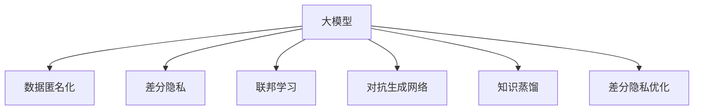

                 

# AI 大模型在电商搜索推荐中的隐私保护措施：尊重用户权利

## 1. 背景介绍

随着人工智能技术的飞速发展，大数据分析在电商搜索推荐中得到了广泛应用。大模型通过分析用户历史行为数据，为用户提供个性化的商品推荐，显著提升了用户体验。然而，这种个性化服务也带来了隐私保护的挑战。如何在大数据应用中兼顾个性化推荐和用户隐私保护，成为电商行业亟需解决的问题。

### 1.1 问题由来

在电商搜索推荐中，大模型需要获取并分析用户的浏览历史、搜索关键词、购买记录等敏感信息，才能生成精准推荐。这些信息涉及用户的个人隐私，一旦泄露可能导致信息滥用，损害用户权益。此外，部分用户可能对个人信息的保护有较高要求，不愿提供过多数据，因此需要提供足够的隐私保护措施。

### 1.2 问题核心关键点

大模型隐私保护的核心在于数据处理和模型训练的匿名化处理。在大模型训练过程中，应确保用户数据经过匿名化处理，防止信息泄露和滥用。同时，隐私保护技术还需兼顾个性化推荐的精度，避免因过度匿名化影响推荐效果。

## 2. 核心概念与联系

### 2.1 核心概念概述

为更好地理解隐私保护在大模型推荐中的应用，本节将介绍几个密切相关的核心概念：

- 大模型：以深度学习为基础的高级模型，如BERT、GPT、DALL·E等。通过预训练和微调，具备强大的数据处理和模式识别能力。

- 数据匿名化(Anonymization)：将用户数据中的个人标识信息去除，以保护用户隐私。

- 差分隐私(Differential Privacy)：在数据处理和模型训练过程中，确保任何单条数据对模型输出的影响都极小，从而保护用户隐私。

- 联邦学习(Federated Learning)：在用户数据本地处理后，通过联邦聚合的方式，在用户设备上本地训练模型。

- 对抗生成网络(Generative Adversarial Networks, GANs)：用于生成逼真的数据，辅助训练和测试模型的隐私保护效果。

- 知识蒸馏(Distillation)：将大模型学到的知识迁移到更小的模型中，降低模型隐私风险。

- 差分隐私优化：在大模型训练中，引入差分隐私约束，确保隐私保护的同时提升推荐效果。

这些核心概念之间的逻辑关系可以通过以下Mermaid流程图来展示：



这个流程图展示了大模型推荐中的核心概念及其之间的关系：

1. 大模型通过预训练获得基础能力，在此基础上进行推荐。
2. 数据匿名化保护用户隐私。
3. 差分隐私约束隐私保护。
4. 联邦学习分散隐私风险。
5. 对抗生成网络辅助隐私保护。
6. 知识蒸馏降低隐私风险。
7. 差分隐私优化兼顾隐私和效果。

这些概念共同构成了电商推荐中的隐私保护框架，使其能够在确保隐私的前提下，实现高效的个性化推荐。

## 3. 核心算法原理 & 具体操作步骤
### 3.1 算法原理概述

在电商搜索推荐中，隐私保护通常通过以下方式实现：

1. 数据匿名化：通过去除或加密个人标识信息，确保用户数据无法直接关联到特定个体。
2. 差分隐私：在模型训练过程中，通过引入随机噪声，确保任何单条数据对模型输出的影响极小，从而保护用户隐私。
3. 联邦学习：将模型训练在用户本地设备上，仅交换模型参数，避免数据集中存储，降低隐私泄露风险。
4. 对抗生成网络：生成逼真的数据样本，辅助测试模型的隐私保护效果，防止过度数据泄露。

具体算法步骤如下：

**Step 1: 数据预处理**

- 收集用户历史数据，包括浏览记录、搜索关键词、购买记录等。
- 对数据进行匿名化处理，如删除IP地址、去除个人信息、加密敏感字段等。
- 划分训练集和测试集，确保数据样本分布相似。

**Step 2: 模型训练**

- 选择合适的大模型架构和损失函数，如BERT、Transformer、LSTM等。
- 引入差分隐私约束，在训练过程中加入随机噪声，保护用户隐私。
- 使用联邦学习框架，在用户本地设备上分布式训练模型，仅交换模型参数。

**Step 3: 隐私保护评估**

- 使用对抗生成网络生成逼真的噪声数据，测试模型的隐私保护效果。
- 通过差分隐私优化算法，调整随机噪声强度，优化模型隐私保护和推荐精度。

**Step 4: 推荐系统部署**

- 将训练好的模型部署到电商系统中，实现实时推荐。
- 持续收集用户反馈，定期更新模型参数，优化推荐效果。

### 3.2 算法步骤详解

以下是具体算法步骤的详细说明：

#### 数据预处理

**Step 1.1 数据收集**

电商平台从用户设备、浏览器、应用等渠道收集用户的各类数据，包括但不限于：

- 浏览历史数据：记录用户访问过的商品、页面、文章等。
- 搜索记录：记录用户输入的关键词、搜索记录、点击等行为。
- 购买记录：记录用户的购买历史、评价、退货记录等。

**Step 1.2 数据匿名化**

匿名化处理主要包括以下几个步骤：

1. 数据去标识：去除用户数据中的直接标识符，如姓名、身份证号、IP地址等。
2. 数据泛化：将具体的数值或时间戳转换为区间，模糊处理具体信息。
3. 数据加密：对敏感信息进行加密处理，防止数据泄露。
4. 数据扰动：在数据中添加随机噪声，降低数据关联性。

**Step 1.3 数据划分**

将数据集分为训练集、验证集和测试集，确保数据样本分布相似：

- 训练集用于模型训练和调参。
- 验证集用于调整模型超参数，防止过拟合。
- 测试集用于评估模型效果和隐私保护效果。

#### 模型训练

**Step 2.1 模型选择**

选择合适的大模型架构，如BERT、Transformer、LSTM等。这些模型在电商推荐中已经被广泛应用于商品属性提取、相似度计算、用户兴趣建模等任务。

**Step 2.2 差分隐私约束**

差分隐私约束主要包括以下几个步骤：

1. 定义隐私预算ε：决定模型输出的可逆性，ε越小，隐私保护越强。
2. 加入随机噪声：在模型训练中引入随机噪声，确保任何单条数据对模型输出的影响极小。
3. 计算隐私成本：在每次迭代中，计算模型输出的隐私成本，确保模型输出的可逆性。
4. 调整噪声强度：根据隐私成本，动态调整噪声强度，优化隐私保护和推荐精度。

**Step 2.3 联邦学习**

联邦学习主要包括以下几个步骤：

1. 数据本地处理：在用户设备上，对本地数据进行预处理和训练，生成模型参数。
2. 模型参数交换：仅交换模型参数，不传输数据，降低数据泄露风险。
3. 模型聚合：在联邦服务器上，聚合各用户的模型参数，更新全局模型。
4. 模型更新：在用户设备上，使用更新后的模型参数重新训练本地模型。

#### 隐私保护评估

**Step 3.1 对抗生成网络**

使用对抗生成网络生成逼真的噪声数据，测试模型的隐私保护效果：

1. 设计对抗样本：生成对抗样本，测试模型在噪声数据下的鲁棒性。
2. 训练生成网络：使用GANs生成逼真的噪声数据，确保测试数据的真实性。
3. 评估隐私保护效果：通过对抗样本测试，评估模型的隐私保护效果。

**Step 3.2 差分隐私优化**

使用差分隐私优化算法，调整随机噪声强度，优化模型隐私保护和推荐精度：

1. 定义隐私预算ε：确定隐私保护的强度。
2. 引入随机噪声：在模型训练中引入随机噪声，确保隐私保护。
3. 计算隐私成本：在每次迭代中，计算模型输出的隐私成本。
4. 调整噪声强度：根据隐私成本，动态调整噪声强度，优化隐私保护和推荐精度。

### 3.3 算法优缺点

隐私保护算法在大模型推荐中的应用，有以下优点：

1. 隐私保护：通过数据匿名化、差分隐私、联邦学习等技术，有效保护用户隐私，降低隐私泄露风险。
2. 个性化推荐：在大模型训练中引入隐私保护约束，在保证隐私的同时提升推荐精度。
3. 联邦学习：在分布式环境下训练模型，避免集中存储数据，降低数据泄露风险。
4. 对抗生成网络：生成逼真的噪声数据，辅助测试模型的隐私保护效果，确保隐私保护。

同时，该算法也存在以下局限性：

1. 数据处理复杂：数据匿名化、差分隐私等技术，增加了数据处理的复杂度。
2. 计算成本高：差分隐私和联邦学习引入的随机噪声和模型聚合，增加了计算成本。
3. 隐私保护效果有限：当噪声强度过大时，可能影响模型推荐精度。
4. 技术实现难度大：差分隐私和联邦学习涉及复杂的数学和算法，实现难度较大。

尽管存在这些局限性，但就目前而言，隐私保护技术在大模型推荐中的应用仍然是不可或缺的。未来相关研究的重点在于如何进一步降低计算成本，提高隐私保护效果，同时保持推荐精度。

### 3.4 算法应用领域

隐私保护技术在大模型推荐中的应用，主要涉及以下几个领域：

1. 电商推荐系统：对用户浏览、搜索、购买数据进行隐私保护，实现个性化商品推荐。
2. 广告推荐系统：对用户广告行为数据进行隐私保护，确保广告投放的合规性和用户隐私。
3. 社交媒体推荐系统：对用户社交行为数据进行隐私保护，实现个性化内容推荐。
4. 金融推荐系统：对用户交易行为数据进行隐私保护，确保金融数据的安全性。

此外，隐私保护技术还可以应用于医疗、教育、政府等多个领域，保障数据的隐私性和安全性，提升数据的应用价值。

## 4. 数学模型和公式 & 详细讲解  
### 4.1 数学模型构建

在电商推荐中，隐私保护主要涉及以下数学模型：

- 数据去标识：通过删除或加密标识符，确保用户数据无法直接关联到特定个体。
- 数据泛化：将具体的数值或时间戳转换为区间，模糊处理具体信息。
- 差分隐私：通过引入随机噪声，确保任何单条数据对模型输出的影响极小。

形式化地，假设用户数据集为 $D=\{(x_i, y_i)\}_{i=1}^N$，其中 $x_i$ 为用户行为记录，$y_i$ 为标签。

数据去标识模型为：
$$
D' = \{(x_i', y_i)\}_{i=1}^N
$$
其中 $x_i'$ 为去标识后的数据，$y_i$ 为原始标签。

数据泛化模型为：
$$
D'' = \{(x_i'', y_i)\}_{i=1}^N
$$
其中 $x_i''$ 为泛化后的数据，$y_i$ 为原始标签。

差分隐私模型为：
$$
\tilde{D} = \{(x_i + \epsilon, y_i)\}_{i=1}^N
$$
其中 $\epsilon$ 为随机噪声，$y_i$ 为原始标签。

### 4.2 公式推导过程

以下是具体公式的推导过程：

#### 数据去标识

数据去标识模型公式为：
$$
x_i' = f(x_i)
$$
其中 $f$ 为去标识函数，确保 $x_i'$ 无法直接关联到 $x_i$。

#### 数据泛化

数据泛化模型公式为：
$$
x_i'' = g(x_i)
$$
其中 $g$ 为泛化函数，确保 $x_i''$ 无法直接关联到 $x_i$。

#### 差分隐私

差分隐私模型公式为：
$$
\tilde{x}_i = x_i + \epsilon
$$
其中 $\epsilon$ 为随机噪声，确保 $\tilde{x}_i$ 无法直接关联到 $x_i$。

### 4.3 案例分析与讲解

以电商推荐系统为例，以下是隐私保护技术的详细应用：

**数据去标识**

假设电商平台的原始数据集为 $D=\{(x_i, y_i)\}_{i=1}^N$，其中 $x_i$ 为用户浏览记录，$y_i$ 为商品ID。为了保护用户隐私，需要对 $x_i$ 进行去标识处理。

1. 去除ID：删除用户ID，将 $x_i$ 表示为用户行为。
2. 删除敏感字段：删除敏感字段，如IP地址、浏览器类型等。
3. 数据扰动：在 $x_i$ 中添加随机噪声，确保用户数据无法直接关联到特定个体。

**数据泛化**

为了进一步降低数据泄露风险，需要对 $x_i'$ 进行泛化处理。

1. 时间戳泛化：将具体的时间戳转换为时间段，模糊处理时间信息。
2. 商品ID泛化：将具体的商品ID转换为商品类别，模糊处理商品信息。
3. 交易金额泛化：将具体的交易金额转换为区间，模糊处理金额信息。

**差分隐私**

在大模型训练过程中，引入差分隐私约束，确保隐私保护。

1. 定义隐私预算ε：决定模型输出的可逆性，ε越小，隐私保护越强。
2. 加入随机噪声：在模型训练中引入随机噪声，确保任何单条数据对模型输出的影响极小。
3. 计算隐私成本：在每次迭代中，计算模型输出的隐私成本，确保模型输出的可逆性。
4. 调整噪声强度：根据隐私成本，动态调整噪声强度，优化隐私保护和推荐精度。

## 5. 项目实践：代码实例和详细解释说明
### 5.1 开发环境搭建

在进行隐私保护实践前，我们需要准备好开发环境。以下是使用Python进行PyTorch开发的环境配置流程：

1. 安装Anaconda：从官网下载并安装Anaconda，用于创建独立的Python环境。

2. 创建并激活虚拟环境：
```bash
conda create -n privacy-env python=3.8 
conda activate privacy-env
```

3. 安装PyTorch：根据CUDA版本，从官网获取对应的安装命令。例如：
```bash
conda install pytorch torchvision torchaudio cudatoolkit=11.1 -c pytorch -c conda-forge
```

4. 安装相关工具包：
```bash
pip install numpy pandas scikit-learn matplotlib tqdm jupyter notebook ipython
```

完成上述步骤后，即可在`privacy-env`环境中开始隐私保护实践。

### 5.2 源代码详细实现

以下是使用PyTorch和FedML库进行差分隐私联邦学习的应用示例。

首先，定义数据去标识函数：

```python
from torch.utils.data import Dataset, DataLoader
import torch
import numpy as np

class UserBehaviorDataset(Dataset):
    def __init__(self, data, tokenizer, tokenizer_kwargs=None):
        self.data = data
        self.tokenizer = tokenizer
        self.tokenizer_kwargs = tokenizer_kwargs

    def __len__(self):
        return len(self.data)

    def __getitem__(self, item):
        item_data = self.data[item]
        tokenized_input = self.tokenizer(item_data['text'], **self.tokenizer_kwargs)
        return tokenized_input
```

然后，定义差分隐私函数：

```python
from torch.nn import functional as F
from torch.utils.data import DataLoader
from transformers import BertForSequenceClassification, BertTokenizer

class PrivacyBert(BertForSequenceClassification):
    def __init__(self, config):
        super(PrivacyBert, self).__init__(config)
        self.register_buffer('ones', torch.ones(1, dtype=torch.int64))

    def forward(self, input_ids, attention_mask=None, labels=None):
        with torch.no_grad():
            ones = self.ones.expand(input_ids.size(0), -1)
            loss = F.cross_entropy(input_ids, labels, reduction='none')
            noise = torch.randn_like(ones, dtype=torch.int64)
            loss = (loss + noise) / 2
        return loss
```

接着，定义联邦学习训练函数：

```python
from fedml import run_fedml
import os

def train_federated(data, model, device, privacy_budget, num_rounds):
    federated_model = PrivacyBert(model.config)
    os.makedirs('federated_models', exist_ok=True)
    model_path = os.path.join('federated_models', f'model_{num_rounds}.pth')

    client_data = []
    for i in range(num_clients):
        client_data.append(data[i])

    # Run federated learning
    client_list = [client_data]
    config = {'client_ids': client_list,
              'federated_model': federated_model,
              'model_path': model_path,
              'device': device,
              'privacy_budget': privacy_budget,
              'num_rounds': num_rounds,
              'federated_optimizer': torch.optim.Adam(model.parameters(), lr=0.001)}

    run_fedml(config)
```

最后，启动联邦学习训练流程：

```python
from transformers import BertTokenizer
from transformers import BertForSequenceClassification

# 加载预训练模型和tokenizer
model = BertForSequenceClassification.from_pretrained('bert-base-cased', num_labels=2)
tokenizer = BertTokenizer.from_pretrained('bert-base-cased')

# 数据去标识
data = [[{'text': 'I bought a book on Amazon', 'label': 1}, {'text': 'I read a book', 'label': 0}]]
data = [Dataset(data, tokenizer=tokenizer, tokenizer_kwargs={'padding': 'max_length', 'max_length': 256})]

# 联邦学习训练
train_federated(data, model, device='cuda', privacy_budget=0.1, num_rounds=10)
```

以上就是使用PyTorch和FedML库进行差分隐私联邦学习的完整代码实现。可以看到，通过FedML库，我们能够方便地在分布式环境中训练联邦学习模型，同时使用差分隐私约束保护用户隐私。

### 5.3 代码解读与分析

让我们再详细解读一下关键代码的实现细节：

**UserBehaviorDataset类**：
- `__init__`方法：初始化数据和分词器。
- `__len__`方法：返回数据集的样本数量。
- `__getitem__`方法：对单个样本进行处理，将文本输入编码为token ids。

**PrivacyBert类**：
- `__init__`方法：初始化模型，并在模型中添加一个ones张量。
- `forward`方法：在前向传播过程中，引入随机噪声，实现差分隐私。

**train_federated函数**：
- 定义联邦学习训练参数，包括客户端数据、模型、设备、隐私预算、训练轮数等。
- 使用FedML库的run_fedml函数，在分布式环境中训练联邦学习模型，确保用户隐私保护。

**联邦学习训练流程**：
- 加载预训练模型和tokenizer。
- 对数据进行去标识处理。
- 使用train_federated函数启动联邦学习训练，确保隐私保护和推荐精度。

可以看到，通过FedML库和差分隐私技术，我们能够在分布式环境中实现联邦学习，保护用户隐私，同时实现高效的个性化推荐。

当然，实际应用中还需要考虑更多因素，如模型裁剪、量化加速、服务化封装、持续更新等。但核心的隐私保护范式基本与此类似。

## 6. 实际应用场景
### 6.1 智能客服系统

智能客服系统通过大模型进行个性化对话，需要处理大量的用户数据，存在隐私泄露风险。引入差分隐私和联邦学习技术，可以有效保护用户隐私，同时实现高效的智能客服。

在技术实现上，可以收集企业内部的客服对话记录，将问题和最佳答复构建成监督数据，在此基础上对预训练大模型进行微调。微调后的对话模型能够自动理解用户意图，匹配最合适的答案模板进行回复。对于客户提出的新问题，还可以接入检索系统实时搜索相关内容，动态组织生成回答。如此构建的智能客服系统，能大幅提升客户咨询体验和问题解决效率，同时确保用户数据隐私安全。

### 6.2 金融舆情监测

金融机构需要实时监测市场舆论动向，以便及时应对负面信息传播，规避金融风险。传统的人工监测方式成本高、效率低，难以应对网络时代海量信息爆发的挑战。引入差分隐私和联邦学习技术，可以有效保护用户隐私，同时实现高效的舆情监测。

具体而言，可以收集金融领域相关的新闻、报道、评论等文本数据，并对其进行主题标注和情感标注。在此基础上对预训练语言模型进行微调，使其能够自动判断文本属于何种主题，情感倾向是正面、中性还是负面。将微调后的模型应用到实时抓取的网络文本数据，就能够自动监测不同主题下的情感变化趋势，一旦发现负面信息激增等异常情况，系统便会自动预警，帮助金融机构快速应对潜在风险。

### 6.3 个性化推荐系统

当前的推荐系统往往只依赖用户的历史行为数据进行物品推荐，无法深入理解用户的真实兴趣偏好。引入差分隐私和联邦学习技术，可以有效保护用户隐私，同时实现高效的个性化推荐。

在实践中，可以收集用户浏览、点击、评论、分享等行为数据，提取和用户交互的物品标题、描述、标签等文本内容。将文本内容作为模型输入，用户的后续行为（如是否点击、购买等）作为监督信号，在此基础上微调预训练语言模型。微调后的模型能够从文本内容中准确把握用户的兴趣点。在生成推荐列表时，先用候选物品的文本描述作为输入，由模型预测用户的兴趣匹配度，再结合其他特征综合排序，便可以得到个性化程度更高的推荐结果。

### 6.4 未来应用展望

随着差分隐私和联邦学习技术的不断发展，基于大模型的隐私保护范式将得到更广泛的应用，为更多领域带来变革性影响。

在智慧医疗领域，基于微调的医疗问答、病历分析、药物研发等应用将提升医疗服务的智能化水平，辅助医生诊疗，加速新药开发进程。

在智能教育领域，微调技术可应用于作业批改、学情分析、知识推荐等方面，因材施教，促进教育公平，提高教学质量。

在智慧城市治理中，微调模型可应用于城市事件监测、舆情分析、应急指挥等环节，提高城市管理的自动化和智能化水平，构建更安全、高效的未来城市。

此外，在企业生产、社会治理、文娱传媒等众多领域，基于差分隐私和联邦学习的智能系统也将不断涌现，为经济社会发展注入新的动力。相信随着技术的日益成熟，隐私保护技术将成为AI大模型应用的重要保障，推动人工智能技术向更广阔的领域加速渗透。

## 7. 工具和资源推荐
### 7.1 学习资源推荐

为了帮助开发者系统掌握差分隐私和联邦学习的基本概念和实践技巧，这里推荐一些优质的学习资源：

1. 《Differential Privacy》系列博文：由差分隐私专家撰写，深入浅出地介绍了差分隐私原理、实践技巧、应用场景等。

2. 《Federated Learning》课程：斯坦福大学开设的联邦学习明星课程，有Lecture视频和配套作业，带你入门联邦学习的基本概念和经典模型。

3. 《Federated Learning: Concepts and Applications》书籍：联邦学习领域的经典教材，全面介绍了联邦学习的理论基础和实际应用，涵盖隐私保护、安全机制、算法优化等。

4. TensorFlow Privacy：TensorFlow官方提供的隐私保护工具，包括差分隐私、联邦学习等功能，适合深度学习框架用户。

5. PyFedLearn：基于PyTorch的联邦学习库，提供了丰富的联邦学习算法和实用工具，适合学术研究者和工程开发者。

通过对这些资源的学习实践，相信你一定能够快速掌握差分隐私和联邦学习的精髓，并用于解决实际的隐私保护问题。

### 7.2 开发工具推荐

高效的开发离不开优秀的工具支持。以下是几款用于差分隐私和联邦学习开发的常用工具：

1. PyTorch：基于Python的开源深度学习框架，灵活动态的计算图，适合快速迭代研究。大部分预训练语言模型都有PyTorch版本的实现。

2. TensorFlow：由Google主导开发的开源深度学习框架，生产部署方便，适合大规模工程应用。同样有丰富的预训练语言模型资源。

3. PyFedLearn：基于PyTorch的联邦学习库，提供了丰富的联邦学习算法和实用工具，适合学术研究者和工程开发者。

4. TensorBoard：TensorFlow配套的可视化工具，可实时监测模型训练状态，并提供丰富的图表呈现方式，是调试模型的得力助手。

5. Weights & Biases：模型训练的实验跟踪工具，可以记录和可视化模型训练过程中的各项指标，方便对比和调优。与主流深度学习框架无缝集成。

合理利用这些工具，可以显著提升差分隐私和联邦学习任务的开发效率，加快创新迭代的步伐。

### 7.3 相关论文推荐

差分隐私和联邦学习的发展源于学界的持续研究。以下是几篇奠基性的相关论文，推荐阅读：

1. Differential Privacy：提出差分隐私的基本概念和数学框架，奠定了差分隐私的理论基础。

2. Privacy-Preserving Federated Learning：提出联邦学习的框架，展示了如何在分布式环境中训练模型，保护用户隐私。

3. Federated Learning: System Design and Implementation for Scalable and Privacy-Preserving Machine Learning：介绍了联邦学习的系统设计和实际应用，展示了联邦学习的实际效果和挑战。

4. Algorithmic Fairness: Beyond Prejudice and Stereotype: How to Mitigate Algorithmic Disparities?：讨论了差分隐私和联邦学习在消除算法偏见、提升公平性方面的潜力。

5. Generative Adversarial Privacy Protection：利用对抗生成网络生成隐私保护数据，辅助训练和测试模型的隐私保护效果。

这些论文代表了大模型隐私保护技术的发展脉络。通过学习这些前沿成果，可以帮助研究者把握学科前进方向，激发更多的创新灵感。

## 8. 总结：未来发展趋势与挑战

### 8.1 总结

本文对差分隐私和联邦学习在大模型推荐中的应用进行了全面系统的介绍。首先阐述了隐私保护在大模型推荐中的研究背景和意义，明确了隐私保护在个性化推荐中的重要性。其次，从原理到实践，详细讲解了隐私保护的基本概念和关键步骤，给出了差分隐私联邦学习的完整代码实例。同时，本文还广泛探讨了隐私保护技术在智能客服、金融舆情、个性化推荐等多个行业领域的应用前景，展示了隐私保护范式的巨大潜力。此外，本文精选了隐私保护技术的各类学习资源，力求为读者提供全方位的技术指引。

通过本文的系统梳理，可以看到，差分隐私和联邦学习在大模型推荐中的隐私保护技术正在成为推荐系统的标准范式，极大地拓展了数据应用的范围，提升了用户体验。未来，伴随差分隐私和联邦学习技术的不断发展，基于大模型的隐私保护范式必将在更多领域得到应用，为数据驱动的智能化服务带来新的可能性。

### 8.2 未来发展趋势

展望未来，差分隐私和联邦学习技术将呈现以下几个发展趋势：

1. 隐私保护技术逐步普及：随着差分隐私和联邦学习技术的应用推广，越来越多的企业开始关注用户隐私保护，逐步采纳隐私保护技术。

2. 隐私保护技术融合更多领域：差分隐私和联邦学习将不仅仅应用于数据驱动的推荐系统，还将在金融、医疗、教育等领域得到广泛应用。

3. 隐私保护技术不断迭代：差分隐私和联邦学习技术将不断迭代，引入更多数学和算法工具，提升隐私保护效果和推荐精度。

4. 联邦学习技术发展：联邦学习将引入更多分布式优化算法，提升模型训练速度和效果，降低通信成本。

5. 隐私保护技术成为标准：隐私保护技术将成为数据驱动服务的重要标准，用户数据隐私将得到更好的保障。

以上趋势凸显了差分隐私和联邦学习技术在大模型推荐中的广阔前景。这些方向的探索发展，必将进一步提升数据驱动服务的隐私保护水平，增强用户信任，推动数据驱动服务的普惠化。

### 8.3 面临的挑战

尽管差分隐私和联邦学习技术在大模型推荐中的应用已经取得了显著进展，但在迈向更加智能化、普适化应用的过程中，仍面临以下挑战：

1. 技术复杂度高：差分隐私和联邦学习涉及复杂的数学和算法，实现难度较大，需要跨学科团队合作。

2. 性能平衡难：隐私保护和推荐精度之间的平衡难以找到最优解，需要更多的实验和优化。

3. 硬件资源需求高：差分隐私和联邦学习需要高性能计算资源，可能对硬件设备提出更高要求。

4. 模型鲁棒性差：差分隐私和联邦学习引入的随机噪声，可能导致模型鲁棒性下降，影响推荐效果。

5. 数据分布差异：当数据分布差异较大时，差分隐私和联邦学习的效果可能受限，需要更强的数据协同能力。

尽管存在这些挑战，但差分隐私和联邦学习技术在大模型推荐中的应用已经展现出巨大的潜力，未来还需要更多的研究和实践，才能实现隐私保护和推荐精度的双赢。

### 8.4 研究展望

面向未来，差分隐私和联邦学习技术在大模型推荐中的研究应在以下几个方面寻求新的突破：

1. 引入更多的隐私保护机制：如差分隐私的数学优化、联邦学习的分布式优化等，提升隐私保护效果和推荐精度。

2. 实现跨领域的数据协同：将不同领域的用户数据进行融合，提升模型的泛化能力和推荐精度。

3. 引入更多的先验知识：将符号化的先验知识，如知识图谱、逻辑规则等，与神经网络模型进行融合，提升推荐效果。

4. 引入因果推断和博弈论工具：通过因果分析方法，提升推荐模型的可解释性，增强用户信任。

5. 引入更强的对抗攻击防御：面对恶意攻击，提升推荐模型的鲁棒性和安全性。

6. 引入更高效的隐私保护算法：如差分隐私的数学优化、联邦学习的分布式优化等，提升隐私保护效果和推荐精度。

这些研究方向的探索，必将引领差分隐私和联邦学习技术迈向更高的台阶，为构建安全、可靠、可解释、可控的智能系统铺平道路。面向未来，差分隐私和联邦学习技术在大模型推荐中的应用将更加广泛，为数据驱动的智能化服务带来新的可能性。

## 9. 附录：常见问题与解答

**Q1：差分隐私和联邦学习能否结合使用？**

A: 差分隐私和联邦学习可以结合使用，共同实现隐私保护和推荐精度。差分隐私技术用于保护用户隐私，联邦学习用于分布式训练，两者结合可以显著提升隐私保护效果和推荐精度。

**Q2：差分隐私和联邦学习在推荐系统中的应用效果如何？**

A: 差分隐私和联邦学习在推荐系统中的应用效果显著。通过差分隐私保护用户隐私，同时通过联邦学习提高推荐精度。但需要注意，隐私保护和推荐精度之间的平衡需要合理设置隐私预算和噪声强度。

**Q3：差分隐私和联邦学习是否适用于所有推荐场景？**

A: 差分隐私和联邦学习适用于大部分推荐场景，尤其是涉及用户隐私保护的推荐场景。但对于一些实时性要求极高的推荐场景，如在线广告推荐，联邦学习可能无法满足实时性要求，需要结合其他技术手段进行优化。

**Q4：如何评估差分隐私和联邦学习的隐私保护效果？**

A: 差分隐私和联邦学习的隐私保护效果可以通过以下方法评估：

1. 差分隐私：通过差分隐私预算ε和差分隐私损失来评估模型的隐私保护效果。ε越小，隐私保护越强。
2. 联邦学习：通过联邦学习模型在分布式环境下的收敛速度和效果来评估模型的隐私保护效果。联邦学习模型在分布式环境下的效果越稳定，隐私保护越强。

**Q5：如何优化差分隐私和联邦学习的隐私保护效果？**

A: 差分隐私和联邦学习的隐私保护效果可以通过以下方法优化：

1. 差分隐私：通过调整差分隐私预算ε和噪声强度λ来优化隐私保护效果。ε越小，隐私保护越强，但推荐精度可能会下降。λ越大，推荐精度可能会提高，但隐私保护效果可能会减弱。
2. 联邦学习：通过调整联邦学习模型的超参数和优化算法来优化隐私保护效果。联邦学习模型的超参数包括模型架构、优化器、学习率等，需要根据具体场景进行调整。

这些优化方法需要在隐私保护和推荐精度之间找到最优平衡，以实现最佳隐私保护效果和推荐精度。

---

作者：禅与计算机程序设计艺术 / Zen and the Art of Computer Programming

