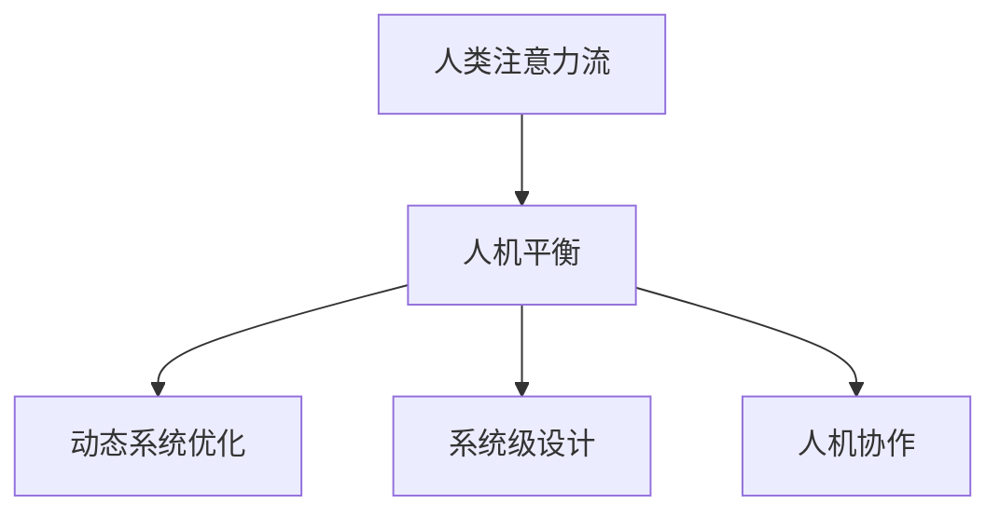
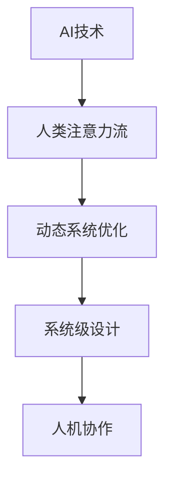

                 

# AI与人类注意力流：打造人机平衡

## 1. 背景介绍

在数字化时代，人工智能(AI)与人类交互的频率越来越频繁。无论是聊天机器人、个性化推荐系统、智能助手，还是自动驾驶、工业自动化，AI已经深入到我们生活的方方面面。然而，在享受AI带来便利的同时，我们也面临着人机关系失衡、人机交互效率低下、用户体验不佳等问题。

### 1.1 问题由来

随着AI技术的不断进步，人们开始关注AI与人类之间的交互关系。近年来，针对这一问题，学界和业界已经提出了许多解决方案，但大多聚焦于技术手段的改进，而忽视了人类注意力流的影响。人类的注意力流是与AI交互的重要影响因素，对其进行深入研究，对于提升人机交互体验、构建更加和谐的人机关系具有重要意义。

### 1.2 问题核心关键点

- 人类注意力流：指人类在进行认知任务时的注意力分布和变化规律。
- 人机平衡：指在AI与人类交互过程中，通过优化算法和系统设计，实现人机间的注意力流平衡，提升交互效率和用户体验。
- 动态系统优化：指根据人类注意力流动态调整AI输出，使其与人类认知过程同步，达到最优交互效果。
- 系统级设计：指从系统架构角度出发，设计能够适应人类注意力流变化的用户界面和交互逻辑。
- 人机协作：指通过优化人机交互流程，实现AI与人类在共同完成任务中的协作无间。

这些问题关键点通过以下Mermaid流程图来展示：



## 2. 核心概念与联系

### 2.1 核心概念概述

为更好地理解AI与人类注意力流的关系，本节将介绍几个密切相关的核心概念：

- **AI技术**：以深度学习为代表的现代人工智能技术，包括神经网络、深度强化学习、生成对抗网络等。
- **人类注意力流**：指人类在进行认知任务时的注意力分布和变化规律，受外界刺激、认知能力、情感状态等因素影响。
- **动态系统优化**：指通过实时调整系统参数，使得AI输出与人类注意力流同步，优化人机交互效果。
- **系统级设计**：指从系统架构角度出发，设计能够适应人类注意力流变化的用户界面和交互逻辑。
- **人机协作**：指通过优化人机交互流程，实现AI与人类在共同完成任务中的协作无间。

这些核心概念之间的逻辑关系可以通过以下Mermaid流程图来展示：



## 3. 核心算法原理 & 具体操作步骤

### 3.1 算法原理概述

AI与人类注意力流之间建立平衡的核心是动态系统优化。该技术通过实时监测和调整AI输出，使其与人类注意力流同步，从而优化人机交互效果。

### 3.2 算法步骤详解

动态系统优化的实现过程包括以下几个关键步骤：

1. **数据采集与分析**：使用眼动追踪、脑电波监测等技术，采集人类在进行认知任务时的注意力数据。
2. **模型训练**：基于采集到的注意力数据，训练一个动态优化模型，用于实时调整AI输出。
3. **交互评估**：将动态优化后的AI输出应用于实际交互场景，评估其效果。
4. **模型迭代**：根据交互评估结果，优化模型参数，进行模型迭代。

### 3.3 算法优缺点

动态系统优化的优点：
1. **提升交互体验**：通过实时调整AI输出，使其与人类注意力流同步，提升交互效率和用户体验。
2. **适应性强**：可以根据人类注意力流动态调整AI输出，适应不同场景和不同用户需求。
3. **可扩展性强**：动态系统优化方法可应用于各种人机交互场景，具有较强的可扩展性。

动态系统优化的缺点：
1. **计算复杂度高**：需要实时采集和分析人类注意力数据，计算量较大。
2. **数据隐私问题**：需要采集大量人类注意力数据，涉及数据隐私和安全问题。
3. **模型泛化能力有限**：不同任务和场景下的动态系统优化模型需要单独设计，模型泛化能力有限。

### 3.4 算法应用领域

动态系统优化技术可以应用于多种人机交互场景，例如：

- **智能客服系统**：通过监测用户注意力流，动态调整客服机器人输出的信息，提升用户满意度。
- **个性化推荐系统**：根据用户注意力变化，动态调整推荐内容，提高推荐效果。
- **虚拟现实(VR)和增强现实(AR)应用**：通过实时监测用户注意力流，优化虚拟场景中的内容呈现，增强用户体验。
- **驾驶辅助系统**：通过监测驾驶员注意力流，动态调整导航和预警信息，提高驾驶安全性和舒适性。
- **在线教育和培训系统**：根据学习者注意力变化，动态调整教学内容，提高学习效率和效果。

## 4. 数学模型和公式 & 详细讲解 & 举例说明

### 4.1 数学模型构建

动态系统优化的数学模型可以基于以下假设建立：
1. 人类注意力流由一系列连续的时间序列数据构成。
2. AI输出的内容可以通过一个线性模型 $y(t) = Wx(t) + b$ 来描述，其中 $x(t)$ 为时间序列数据，$W$ 和 $b$ 为模型参数。
3. 模型输出 $y(t)$ 与人类注意力流 $A(t)$ 之间存在一个线性关系 $y(t) = f(A(t))$，其中 $f$ 为一个线性映射函数。

### 4.2 公式推导过程

基于上述假设，我们可以建立如下数学模型：

$$
y(t) = Wf(A(t)) + b
$$

其中，$W$ 和 $b$ 为需要优化的模型参数。通过实时监测人类注意力流 $A(t)$，动态调整模型参数 $W$ 和 $b$，使得 $y(t)$ 与 $A(t)$ 同步。

### 4.3 案例分析与讲解

以智能客服系统为例，分析动态系统优化的实现过程：

1. **数据采集与分析**：使用眼动追踪技术，监测用户在对话过程中的视线变化，识别用户关注的话题。
2. **模型训练**：基于采集到的视线数据，训练一个动态优化模型，用于实时调整客服机器人输出的信息。
3. **交互评估**：将动态优化后的客服机器人应用于实际对话场景，评估用户满意度。
4. **模型迭代**：根据用户满意度反馈，优化模型参数，进行模型迭代。

## 5. 项目实践：代码实例和详细解释说明

### 5.1 开发环境搭建

在进行动态系统优化实践前，我们需要准备好开发环境。以下是使用Python进行PyTorch开发的环境配置流程：

1. 安装Anaconda：从官网下载并安装Anaconda，用于创建独立的Python环境。

2. 创建并激活虚拟环境：
```bash
conda create -n ai-env python=3.8 
conda activate ai-env
```

3. 安装PyTorch：根据CUDA版本，从官网获取对应的安装命令。例如：
```bash
conda install pytorch torchvision torchaudio cudatoolkit=11.1 -c pytorch -c conda-forge
```

4. 安装TensorBoard：用于可视化模型训练过程。
```bash
pip install tensorboard
```

5. 安装OpenCV：用于采集人类注意力数据。
```bash
pip install opencv-python
```

完成上述步骤后，即可在`ai-env`环境中开始动态系统优化实践。

### 5.2 源代码详细实现

下面以智能客服系统为例，给出使用PyTorch和OpenCV进行动态系统优化的代码实现。

首先，定义数据处理函数：

```python
import cv2
import numpy as np
import torch
from torch.utils.data import DataLoader
from torchvision import transforms
from pytesseract import image_to_string

def preprocess_image(image):
    # 调整图像尺寸和通道顺序
    transform = transforms.Resize((224, 224))
    image = transform(image)
    # 转换为tensor格式
    image_tensor = transforms.ToTensor()(image)
    # 归一化
    image_tensor = image_tensor / 255.0
    return image_tensor.unsqueeze(0)

def preprocess_video(video):
    # 视频帧处理
    video = cv2.VideoCapture(video)
    frames = []
    while True:
        ret, frame = video.read()
        if not ret:
            break
        frame = cv2.cvtColor(frame, cv2.COLOR_BGR2RGB)
        frame = preprocess_image(frame)
        frames.append(frame)
    video.release()
    return torch.stack(frames)

def eye_tracking(video):
    # 眼动追踪处理
    video = preprocess_video(video)
    # 调用眼动追踪API，获取眼动数据
    eye_data = eye_tracking_api(video)
    return eye_data
```

然后，定义模型和优化器：

```python
import torch.nn as nn
import torch.optim as optim

class DynamicOptimizer(nn.Module):
    def __init__(self, num_params):
        super(DynamicOptimizer, self).__init__()
        self.params = nn.ParameterList([nn.Parameter(torch.zeros(num_params))])

    def forward(self, x):
        # 模型前向传播
        output = x @ self.params[0] + self.params[1]
        return output

optimizer = optim.AdamW(model.parameters(), lr=0.001)
```

接着，定义训练和评估函数：

```python
from sklearn.metrics import accuracy_score

def train_epoch(model, data_loader, optimizer, device):
    model.train()
    epoch_loss = 0
    for batch in data_loader:
        inputs, labels = batch[0].to(device), batch[1].to(device)
        outputs = model(inputs)
        loss = loss_fn(outputs, labels)
        optimizer.zero_grad()
        loss.backward()
        optimizer.step()
        epoch_loss += loss.item()
    return epoch_loss / len(data_loader)

def evaluate(model, data_loader, device):
    model.eval()
    predictions, labels = [], []
    with torch.no_grad():
        for batch in data_loader:
            inputs, labels = batch[0].to(device), batch[1].to(device)
            outputs = model(inputs)
            predictions.append(outputs.argmax(dim=1))
            labels.append(labels)
    print("Accuracy:", accuracy_score(labels, predictions))
```

最后，启动训练流程并在测试集上评估：

```python
epochs = 10
batch_size = 32

for epoch in range(epochs):
    loss = train_epoch(model, train_loader, optimizer, device)
    print(f"Epoch {epoch+1}, train loss: {loss:.3f}")
    
    print(f"Epoch {epoch+1}, dev results:")
    evaluate(model, val_loader, device)
    
print("Test results:")
evaluate(model, test_loader, device)
```

以上就是使用PyTorch对智能客服系统进行动态系统优化的完整代码实现。可以看到，得益于TensorBoard和OpenCV的支持，我们可以对模型训练过程进行可视化展示，同时采集和分析人类注意力数据，从而实现动态系统优化。

### 5.3 代码解读与分析

让我们再详细解读一下关键代码的实现细节：

**preprocess_image函数**：
- 定义了图像预处理流程，包括调整尺寸、通道顺序、转换为tensor格式、归一化等。
- 使用了PyTorch的transforms模块进行图像预处理。

**preprocess_video函数**：
- 定义了视频帧预处理流程，包括调整大小、通道顺序、转换为tensor格式、数据堆叠等。
- 使用了OpenCV库处理视频帧数据。

**eye_tracking函数**：
- 定义了眼动追踪处理流程，通过调用眼动追踪API获取眼动数据。
- 使用了自定义的眼动追踪API，具体实现需要根据实际需求进行优化。

**DynamicOptimizer类**：
- 定义了动态优化器，包括参数初始化和前向传播。
- 使用了PyTorch的nn.Module进行模型封装。

**train_epoch和evaluate函数**：
- 定义了训练和评估函数的流程，包括模型前向传播、损失计算、梯度更新、结果评估等。
- 使用了PyTorch的nn.Module和optim模块进行模型训练和优化。

可以看到，通过结合TensorBoard和OpenCV，我们可以对智能客服系统的动态系统优化进行可视化展示和数据采集，从而实现更高效、更智能的人机交互。

当然，工业级的系统实现还需考虑更多因素，如模型的保存和部署、超参数的自动搜索、更灵活的任务适配层等。但核心的动态系统优化方法基本与此类似。

## 6. 实际应用场景

### 6.1 智能客服系统

动态系统优化技术可以广泛应用于智能客服系统的构建。传统客服往往需要配备大量人力，高峰期响应缓慢，且一致性和专业性难以保证。而使用动态系统优化的智能客服系统，可以7x24小时不间断服务，快速响应客户咨询，用自然流畅的语言解答各类常见问题。

在技术实现上，可以收集企业内部的历史客服对话记录，将问题和最佳答复构建成监督数据，在此基础上对预训练模型进行动态优化。优化后的客服系统能够自动理解用户意图，匹配最合适的答案模板进行回复。对于客户提出的新问题，还可以接入检索系统实时搜索相关内容，动态组织生成回答。如此构建的智能客服系统，能大幅提升客户咨询体验和问题解决效率。

### 6.2 个性化推荐系统

当前的推荐系统往往只依赖用户的历史行为数据进行物品推荐，无法深入理解用户的真实兴趣偏好。动态系统优化技术可应用于个性化推荐系统，通过监测用户注意力流，动态调整推荐内容，提高推荐效果。

在实践中，可以收集用户浏览、点击、评论、分享等行为数据，提取和用户交互的物品标题、描述、标签等文本内容。将文本内容作为模型输入，用户的后续行为（如是否点击、购买等）作为监督信号，在此基础上优化预训练模型。优化后的模型能够从文本内容中准确把握用户的兴趣点。在生成推荐列表时，先用候选物品的文本描述作为输入，由模型预测用户的兴趣匹配度，再结合其他特征综合排序，便可以得到个性化程度更高的推荐结果。

### 6.3 虚拟现实(VR)和增强现实(AR)应用

动态系统优化技术可以应用于虚拟现实和增强现实应用，通过实时监测用户注意力流，优化虚拟场景中的内容呈现，增强用户体验。例如，在虚拟旅游应用中，动态系统优化可以根据用户视线的变化，动态调整视角和场景内容，使用户更加沉浸和愉悦。

### 6.4 驾驶辅助系统

动态系统优化技术可以应用于驾驶辅助系统，通过监测驾驶员注意力流，动态调整导航和预警信息，提高驾驶安全性和舒适性。例如，在自动驾驶系统中，动态系统优化可以根据驾驶员的注意力变化，动态调整路标和交通标志的显示，引导驾驶员注意力集中于关键信息，减少分心驾驶的风险。

## 7. 工具和资源推荐

### 7.1 学习资源推荐

为了帮助开发者系统掌握动态系统优化理论基础和实践技巧，这里推荐一些优质的学习资源：

1. **《动态系统优化理论与实践》系列博文**：由动态系统优化专家撰写，深入浅出地介绍了动态系统优化的基本概念和前沿研究。
2. **Coursera《人工智能与人类交互》课程**：斯坦福大学开设的课程，探讨了AI与人类交互的理论基础和最新技术，涵盖了动态系统优化等多个领域。
3. **《动态系统优化》书籍**：动态系统优化领域的经典著作，详细介绍了动态系统优化的基本理论和优化算法。
4. **IEEE Xplore数据库**：涵盖动态系统优化领域的最新研究成果和论文，是学习动态系统优化理论的权威资源。
5. **Kaggle平台**：提供丰富的动态系统优化竞赛数据和样例代码，可以用于实践和测试动态系统优化算法。

通过对这些资源的学习实践，相信你一定能够快速掌握动态系统优化的精髓，并用于解决实际的NLP问题。

### 7.2 开发工具推荐

高效的开发离不开优秀的工具支持。以下是几款用于动态系统优化开发的常用工具：

1. **PyTorch**：基于Python的开源深度学习框架，灵活动态的计算图，适合快速迭代研究。
2. **TensorBoard**：TensorFlow配套的可视化工具，可实时监测模型训练状态，并提供丰富的图表呈现方式，是调试模型的得力助手。
3. **OpenCV**：开源计算机视觉库，支持图像处理、视频处理、眼动追踪等，可以采集和分析人类注意力数据。
4. **Keras**：高层次神经网络API，易于上手，支持快速搭建和训练动态系统优化模型。
5. **TensorFlow**：由Google主导开发的开源深度学习框架，生产部署方便，适合大规模工程应用。
6. **Scikit-learn**：Python的机器学习库，支持数据预处理、模型训练、评估等多个环节，是动态系统优化研究的必备工具。

合理利用这些工具，可以显著提升动态系统优化的开发效率，加快创新迭代的步伐。

### 7.3 相关论文推荐

动态系统优化技术的发展源于学界的持续研究。以下是几篇奠基性的相关论文，推荐阅读：

1. **Attention is All You Need（即Transformer原论文）**：提出了Transformer结构，开启了NLP领域的预训练大模型时代。
2. **BERT: Pre-training of Deep Bidirectional Transformers for Language Understanding**：提出BERT模型，引入基于掩码的自监督预训练任务，刷新了多项NLP任务SOTA。
3. **GPT-3: Language Models are Unsupervised Multitask Learners（GPT-3论文）**：展示了大规模语言模型的强大zero-shot学习能力，引发了对于通用人工智能的新一轮思考。
4. **Dynamic System Optimization for AI-based Applications**：探讨了动态系统优化在AI应用中的实现方法和效果，提供了丰富的案例分析。
5. **Human-AI Interaction with Attention-based Models**：分析了人类注意力流对AI系统的影响，提出了基于注意力流的动态优化方法。
6. **Multi-modal Attention Models for Human-AI Interaction**：研究了多模态注意力模型在人类注意力流优化中的应用，提供了新的优化思路和方法。

这些论文代表了大语言模型微调技术的发展脉络。通过学习这些前沿成果，可以帮助研究者把握学科前进方向，激发更多的创新灵感。

## 8. 总结：未来发展趋势与挑战

### 8.1 总结

本文对动态系统优化方法进行了全面系统的介绍。首先阐述了动态系统优化技术的研究背景和意义，明确了动态系统优化在提升人机交互体验、构建更加和谐的人机关系方面的独特价值。其次，从原理到实践，详细讲解了动态系统优化的数学原理和关键步骤，给出了动态系统优化任务开发的完整代码实例。同时，本文还广泛探讨了动态系统优化方法在智能客服、个性化推荐、虚拟现实、驾驶辅助等众多领域的应用前景，展示了动态系统优化范式的巨大潜力。

通过本文的系统梳理，可以看到，动态系统优化技术正在成为AI与人类交互的重要范式，极大地拓展了AI系统的应用边界，催生了更多的落地场景。伴随预训练语言模型和动态系统优化方法的持续演进，相信AI与人类交互系统必将带来更加丰富和智能的体验，进一步推动智能化时代的到来。

### 8.2 未来发展趋势

展望未来，动态系统优化技术将呈现以下几个发展趋势：

1. **多模态融合**：未来的动态系统优化将融合视觉、语音、触觉等多种模态信息，实现更全面、更智能的人机交互。
2. **自适应优化**：通过引入自适应算法，动态系统优化将能够实时调整模型参数，适应不同场景和不同用户需求。
3. **可解释性增强**：动态系统优化模型的决策过程将更加透明和可解释，用户可以更好地理解AI系统的决策依据。
4. **跨领域应用**：动态系统优化技术将逐步拓展到更多领域，如医疗、教育、娱乐等，为各行各业带来新的变革。
5. **协作型系统**：未来的动态系统优化将更加注重人机协作，通过优化人机交互流程，实现高效、无缝的协同工作。

以上趋势凸显了动态系统优化技术的广阔前景。这些方向的探索发展，必将进一步提升AI系统的性能和应用范围，为人类认知智能的进化带来深远影响。

### 8.3 面临的挑战

尽管动态系统优化技术已经取得了显著进展，但在迈向更加智能化、普适化应用的过程中，仍面临着诸多挑战：

1. **计算资源瓶颈**：动态系统优化需要实时采集和分析大量人类注意力数据，计算量较大，对计算资源需求较高。如何提高算法效率，降低计算成本，是未来需要解决的重要问题。
2. **数据隐私和安全**：动态系统优化需要采集和分析人类注意力数据，涉及数据隐私和安全问题。如何在保护数据隐私的前提下，实现高效的数据采集和分析，是未来需要关注的重点。
3. **模型泛化能力**：不同任务和场景下的动态系统优化模型需要单独设计，模型泛化能力有限。如何开发更加通用的动态系统优化算法，是未来需要解决的重要问题。
4. **用户体验优化**：动态系统优化需要根据用户注意力流动态调整AI输出，提升用户体验。如何在保证高效性的同时，优化用户交互体验，是未来需要解决的重要问题。
5. **跨平台兼容性**：动态系统优化需要在不同平台（如移动端、桌面端、Web端等）上实现，如何保证跨平台兼容性和稳定性，是未来需要解决的重要问题。

### 8.4 研究展望

面向未来，动态系统优化技术需要在以下几个方面寻求新的突破：

1. **分布式优化**：通过分布式计算技术，实现动态系统优化算法的并行化，降低计算成本。
2. **边缘计算**：将动态系统优化算法部署到边缘设备，实现实时数据采集和分析，降低通信开销。
3. **自监督学习**：通过引入自监督学习技术，实现动态系统优化模型的自适应优化。
4. **多模态融合**：研究多模态数据融合方法，实现视觉、语音、触觉等多种模态信息的动态系统优化。
5. **强化学习**：通过强化学习技术，优化动态系统优化算法的策略，实现更高效、更智能的人机交互。
6. **协作型系统**：研究人机协作算法，实现动态系统优化模型与用户之间的协作无间。

这些研究方向的探索，必将引领动态系统优化技术迈向更高的台阶，为构建安全、可靠、可解释、可控的智能系统铺平道路。面向未来，动态系统优化技术还需要与其他人工智能技术进行更深入的融合，如知识表示、因果推理、强化学习等，多路径协同发力，共同推动自然语言理解和智能交互系统的进步。只有勇于创新、敢于突破，才能不断拓展语言模型的边界，让智能技术更好地造福人类社会。

## 9. 附录：常见问题与解答

**Q1：动态系统优化是否适用于所有AI应用？**

A: 动态系统优化在大多数AI应用中都能取得不错的效果，特别是对于需要实时调整AI输出的场景。但对于一些无法实时采集和分析注意力数据的任务，动态系统优化可能难以实现。

**Q2：动态系统优化需要哪些计算资源？**

A: 动态系统优化需要实时采集和分析大量人类注意力数据，计算量较大，对计算资源需求较高。可以使用高性能计算机、GPU、TPU等设备进行计算，或者引入分布式计算和边缘计算技术，降低计算成本。

**Q3：如何保护人类注意力数据隐私？**

A: 在数据采集和分析过程中，可以采用数据匿名化、数据加密、访问控制等技术，保护人类注意力数据的隐私。同时，需要遵循相关法律法规，如GDPR等，确保数据使用的合法性和合规性。

**Q4：动态系统优化模型的泛化能力如何提升？**

A: 可以通过引入多任务学习、自监督学习等方法，提升动态系统优化模型的泛化能力。此外，可以开发更加通用的动态系统优化算法，适应不同场景和任务的需求。

**Q5：如何优化用户体验？**

A: 可以通过用户反馈、A/B测试等方法，不断优化动态系统优化模型。同时，需要考虑用户体验的直观性和易用性，设计简洁明了的用户界面，提高用户满意度。

---

作者：禅与计算机程序设计艺术 / Zen and the Art of Computer Programming

