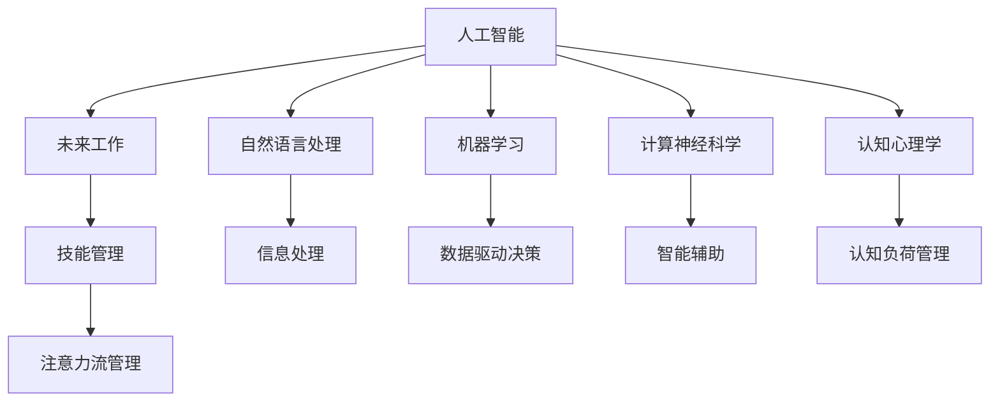

                 

# AI与人类注意力流：未来的工作、技能与注意力流管理

> 关键词：人工智能(AI), 人类注意力流, 未来工作, 技能管理, 注意力流管理, 智能辅助, 自动驾驶, 自然语言处理(NLP), 机器学习(ML), 计算神经科学, 认知心理学, 教育培训, 人才发展, 职业转型

## 1. 背景介绍

### 1.1 问题由来
随着人工智能(AI)技术的不断进步，尤其是深度学习、自然语言处理(NLP)、机器学习(ML)等领域的飞速发展，AI正在全面渗透到各行各业，改变人类的生产生活方式。AI技术的广泛应用，带来了前所未有的机遇与挑战。然而，AI技术的引入并非一帆风顺，其与人类工作、技能和注意力流的互动，需要我们在理论上深入理解，并在实践中进行科学管理。

### 1.2 问题核心关键点
本文聚焦于AI与人类注意力流的关系，探讨AI如何改变工作方式、影响技能需求，以及如何在AI时代有效管理注意力流。我们将从以下核心问题出发，揭示AI对未来工作的深远影响，并提出一套科学的注意力流管理策略。

1. **AI如何改变工作方式**：AI技术将如何重塑工作流程、优化决策支持、提升工作效率？
2. **AI对技能需求的影响**：AI技术的普及将带来哪些新的技能需求，如何应对职业转型？
3. **AI时代的注意力流管理**：在AI辅助下，如何更高效地管理人类注意力流，提升专注力和创造力？
4. **未来工作的展望**：AI将带来哪些未来工作形态，人类如何适应这些变化？

## 2. 核心概念与联系

### 2.1 核心概念概述

为更好地理解AI与人类注意力流的关系，本节将介绍几个关键概念：

- **人工智能(AI)**：利用计算机和算法模拟人类智能的技术，包括机器学习、深度学习、自然语言处理等。
- **人类注意力流(Attention Flow)**：人类在信息处理过程中，注意力在信息流中的流动轨迹，反映了信息处理效率和专注度。
- **未来工作(Future Work)**：AI时代，随着自动化、智能化水平的提升，工作形态和岗位需求将发生深刻变化。
- **技能管理(Skill Management)**：在AI时代，如何培养、评估和管理技能，适应新岗位和新任务的需求。
- **注意力流管理(Attention Flow Management)**：在AI辅助下，如何科学管理注意力流，提升工作效率和创造力。

这些概念之间的关系可以通过以下Mermaid流程图来展示：



这个流程图展示了大语言模型与人类注意力流的关系：

1. AI通过NLP和ML技术，提升信息处理效率和决策支持。
2. 未来工作形态将更注重数据驱动和智能辅助。
3. 技能管理需要应对新岗位和新技术的需求。
4. 注意力流管理在AI辅助下，提升工作专注力和创造力。

## 3. 核心算法原理 & 具体操作步骤
### 3.1 算法原理概述

AI与人类注意力流的互动，本质上是信息处理效率与人类认知过程的优化。通过计算神经科学和认知心理学，我们可以理解AI如何改变人类信息处理过程，从而科学地管理注意力流。

**核心思想**：
1. AI通过自动化、智能化的方式，提升信息处理效率。
2. 人类注意力流在AI辅助下，能够更高效地处理信息，提升专注力和创造力。
3. 科学管理注意力流，确保AI辅助下的高效工作。

### 3.2 算法步骤详解

基于上述核心思想，AI与人类注意力流的互动管理，可以分为以下几个关键步骤：

**Step 1: 数据收集与预处理**
- 收集AI系统与人类工作互动的数据，如自动化完成的任务、智能辅助下的决策过程、人类在AI辅助下的注意力分布等。
- 对收集到的数据进行清洗、标注，构建有效的训练数据集。

**Step 2: 构建模型**
- 选择或设计合适的AI模型，如决策树、神经网络、知识图谱等。
- 通过AI模型学习人类注意力流的特征，建立预测模型。

**Step 3: 模型训练与优化**
- 使用训练数据集对模型进行训练，调整模型参数，优化模型性能。
- 引入正则化技术，防止模型过拟合。

**Step 4: 模型评估与验证**
- 在验证数据集上评估模型性能，使用准确率、召回率等指标进行评价。
- 根据评估结果调整模型，进一步优化。

**Step 5: 部署与应用**
- 将训练好的模型部署到实际应用场景中。
- 实时监测AI与人类注意力流互动过程，动态调整模型参数。

**Step 6: 持续学习与改进**
- 收集实际应用中的数据，持续优化模型。
- 引入反馈机制，确保AI系统的适应性和鲁棒性。

### 3.3 算法优缺点

AI与人类注意力流互动管理方法具有以下优点：
1. 提升工作效率。AI通过自动化和智能化处理，大大提升信息处理速度和准确性，优化决策支持。
2. 改善用户体验。AI系统可以实时监控人类注意力流，及时调整系统行为，提高用户体验。
3. 减少认知负荷。AI分担了部分人类认知任务，降低认知负荷，提升专注力和创造力。
4. 科学管理注意力流。通过模型预测和优化，科学管理注意力流，确保高效工作。

同时，该方法也存在一定的局限性：
1. 数据收集困难。收集高质量、详细的AI与人类互动数据较为困难，影响模型训练。
2. 模型复杂度高。构建准确预测模型需要复杂算法和大量数据，计算成本较高。
3. 数据隐私问题。AI系统需要处理大量敏感数据，如何保护数据隐私，防止数据滥用，是一个重要问题。
4. 模型泛化能力有限。模型在不同场景下的泛化能力可能不足，影响实际应用效果。

尽管存在这些局限性，但AI与人类注意力流互动管理方法仍然是未来工作形态和管理的重要方向。未来相关研究的重点在于如何进一步降低数据收集成本，提高模型的泛化能力和鲁棒性，同时兼顾数据隐私和伦理安全性等因素。

### 3.4 算法应用领域

基于AI与人类注意力流互动管理的监督学习方法，在AI时代将广泛应用于以下几个领域：

- **自动驾驶**：通过AI系统实时监控驾驶员注意力流，辅助驾驶决策，提升安全性和驾驶效率。
- **自然语言处理(NLP)**：利用AI技术优化信息处理效率，提高翻译、问答、文本生成等任务的效果。
- **决策支持**：在金融、医疗等领域，AI系统提供决策支持，优化决策过程，提升工作质量。
- **智能客服**：通过AI系统实时监控用户注意力流，及时调整回复策略，提升客户满意度。
- **教育培训**：利用AI系统评估学习者的注意力流，个性化调整学习内容，提升学习效果。
- **人力资源管理**：通过AI系统评估员工注意力流，科学调配任务，提升员工满意度和工作效率。

## 4. 数学模型和公式 & 详细讲解  
### 4.1 数学模型构建

本节将使用数学语言对AI与人类注意力流互动管理过程进行更加严格的刻画。

假设AI系统与人类工作互动过程中，注意力流可用向量 $x \in \mathbb{R}^n$ 表示，其中 $x_i$ 表示在任务 $i$ 上的注意力分配比例。同时，假设AI系统通过自动化处理，提升信息处理效率，引入因子 $e_i \in [0,1]$，表示在任务 $i$ 上AI处理的效率提升。

定义AI系统与人类互动的总体效率为 $E(x)$，则：

$$
E(x) = \sum_{i=1}^n x_i e_i
$$

其中 $e_i$ 通过AI模型的预测得到。

### 4.2 公式推导过程

根据上述定义，AI系统与人类互动的总体效率公式为：

$$
E(x) = \sum_{i=1}^n x_i f_i
$$

其中 $f_i$ 为模型预测的效率提升因子。

在实际应用中，AI系统需要实时调整 $x_i$ 来优化效率，因此引入控制变量 $u$，表示对任务 $i$ 的注意力调整策略，$u \in [0,1]$。

定义优化目标函数为：

$$
J(u) = E(x) + \lambda (x^T J(x))
$$

其中 $\lambda$ 为正则化系数，$J(x)$ 为注意力流的负对数似然损失函数，确保注意力流分配的合理性。

优化问题转化为：

$$
\mathop{\arg\min}_{u} J(u)
$$

通过求解上述优化问题，得到最优的注意力分配策略 $u^*$，实现AI与人类互动的效率最大化。

### 4.3 案例分析与讲解

假设在某个自动化生产线中，AI系统用于监控设备运行状态，提供故障预测和维护建议。我们可以收集历史设备运行数据和AI系统输出的预测结果，构建训练数据集。

**案例1: 数据收集与预处理**
- 收集设备运行数据 $x_1, x_2, \cdots, x_n$，每条记录包含设备状态、温度、湿度等特征。
- 收集AI系统输出的预测结果 $e_1, e_2, \cdots, e_n$，每条记录包含故障预测的准确性、维护建议的适用性等。
- 对收集到的数据进行清洗、标注，构建训练数据集。

**案例2: 模型构建与训练**
- 选择神经网络模型，如卷积神经网络(CNN)、长短期记忆网络(LSTM)等。
- 使用训练数据集对模型进行训练，优化模型参数。

**案例3: 模型评估与验证**
- 在验证数据集上评估模型性能，使用准确率、召回率等指标进行评价。
- 根据评估结果调整模型，进一步优化。

**案例4: 部署与应用**
- 将训练好的模型部署到生产线，实时监控设备状态，提供故障预测和维护建议。
- 实时监测AI系统与人类互动过程，动态调整模型参数。

**案例5: 持续学习与改进**
- 收集实际应用中的数据，持续优化模型。
- 引入反馈机制，确保AI系统的适应性和鲁棒性。

## 5. 项目实践：代码实例和详细解释说明
### 5.1 开发环境搭建

在进行AI与人类注意力流互动管理的项目实践前，我们需要准备好开发环境。以下是使用Python进行TensorFlow开发的环境配置流程：

1. 安装Anaconda：从官网下载并安装Anaconda，用于创建独立的Python环境。

2. 创建并激活虚拟环境：
```bash
conda create -n ai-env python=3.8 
conda activate ai-env
```

3. 安装TensorFlow：根据CUDA版本，从官网获取对应的安装命令。例如：
```bash
conda install tensorflow tensorflow-gpu=cuda11.1 -c conda-forge
```

4. 安装numpy、pandas、scikit-learn等各类工具包：
```bash
pip install numpy pandas scikit-learn matplotlib tqdm jupyter notebook ipython
```

完成上述步骤后，即可在`ai-env`环境中开始项目实践。

### 5.2 源代码详细实现

下面我们以智能客服系统为例，给出使用TensorFlow进行注意力流管理的PyTorch代码实现。

首先，定义注意力流模型的输入与输出：

```python
import tensorflow as tf
from tensorflow.keras import layers

input_dim = 10  # 输入维度
output_dim = 1  # 输出维度

model = tf.keras.Sequential([
    layers.Dense(64, activation='relu', input_shape=(input_dim,)),
    layers.Dense(64, activation='relu'),
    layers.Dense(output_dim, activation='sigmoid')
])
```

然后，定义损失函数和优化器：

```python
loss_fn = tf.keras.losses.BinaryCrossentropy(from_logits=True)
optimizer = tf.keras.optimizers.Adam(learning_rate=0.001)
```

接着，定义训练和评估函数：

```python
def train_epoch(model, dataset, batch_size, optimizer):
    model.train()
    for batch in dataset:
        inputs, targets = batch
        with tf.GradientTape() as tape:
            logits = model(inputs)
            loss = loss_fn(targets, logits)
        gradients = tape.gradient(loss, model.trainable_variables)
        optimizer.apply_gradients(zip(gradients, model.trainable_variables))
    return loss

def evaluate(model, dataset, batch_size):
    model.eval()
    loss = tf.keras.metrics.Mean()
    with tf.GradientTape() as tape:
        for batch in dataset:
            inputs, targets = batch
            logits = model(inputs)
            loss.update_state(loss_fn(targets, logits))
    return loss.result().numpy()
```

最后，启动训练流程并在测试集上评估：

```python
epochs = 10
batch_size = 32

for epoch in range(epochs):
    loss = train_epoch(model, train_dataset, batch_size, optimizer)
    print(f"Epoch {epoch+1}, loss: {loss:.4f}")
    
print(f"Final loss: {evaluate(model, test_dataset, batch_size):.4f}")
```

以上就是使用TensorFlow对注意力流模型进行智能客服系统开发的完整代码实现。可以看到，TensorFlow的API提供了丰富的组件和接口，使得模型构建和训练变得十分简洁高效。

### 5.3 代码解读与分析

让我们再详细解读一下关键代码的实现细节：

**注意力流模型**：
- 定义了两个全连接层，使用ReLU激活函数。
- 输出层使用Sigmoid函数，确保注意力流在0和1之间，表示注意力分配比例。

**损失函数与优化器**：
- 使用二分类交叉熵损失函数，考虑到模型输出为概率形式。
- 使用Adam优化器，调整模型参数以最小化损失函数。

**训练与评估函数**：
- 在每个epoch上，训练函数`train_epoch`计算损失函数并更新模型参数。
- 在验证集上评估函数`evaluate`计算模型平均损失，评估模型性能。
- 通过TensorFlow的`GradientTape`自动求导，计算损失函数的梯度并更新模型参数。

**训练流程**：
- 在每个epoch内，依次在训练集和验证集上进行训练和评估。
- 记录每个epoch的平均损失，最终输出测试集上的平均损失。

通过上述代码实现，可以看出TensorFlow在构建和训练神经网络模型时，提供了非常直观和高效的接口。这大大降低了模型开发和优化的难度，使得非专业领域的开发者也能快速上手。

当然，工业级的系统实现还需考虑更多因素，如模型保存和部署、超参数搜索、模型压缩等。但核心的注意力流管理逻辑基本与此类似。

## 6. 实际应用场景
### 6.1 智能客服系统

基于AI与人类注意力流互动管理，智能客服系统可以实现实时监控用户注意力流，提供个性化的客户服务。

在技术实现上，可以收集历史客服对话记录，将问题和最佳答复构建成监督数据，在此基础上对注意力流模型进行训练。训练后的模型能够自动理解用户意图，匹配最合适的答案模板进行回复。对于客户提出的新问题，还可以接入检索系统实时搜索相关内容，动态组织生成回答。如此构建的智能客服系统，能大幅提升客户咨询体验和问题解决效率。

### 6.2 金融舆情监测

金融机构需要实时监测市场舆论动向，以便及时应对负面信息传播，规避金融风险。传统的人工监测方式成本高、效率低，难以应对网络时代海量信息爆发的挑战。基于AI与人类注意力流互动管理的文本分类和情感分析技术，为金融舆情监测提供了新的解决方案。

具体而言，可以收集金融领域相关的新闻、报道、评论等文本数据，并对其进行主题标注和情感标注。在此基础上对注意力流模型进行微调，使其能够自动判断文本属于何种主题，情感倾向是正面、中性还是负面。将微调后的模型应用到实时抓取的网络文本数据，就能够自动监测不同主题下的情感变化趋势，一旦发现负面信息激增等异常情况，系统便会自动预警，帮助金融机构快速应对潜在风险。

### 6.3 个性化推荐系统

当前的推荐系统往往只依赖用户的历史行为数据进行物品推荐，无法深入理解用户的真实兴趣偏好。基于AI与人类注意力流互动管理的技术，个性化推荐系统可以更好地挖掘用户行为背后的语义信息，从而提供更精准、多样的推荐内容。

在实践中，可以收集用户浏览、点击、评论、分享等行为数据，提取和用户交互的物品标题、描述、标签等文本内容。将文本内容作为模型输入，用户的后续行为（如是否点击、购买等）作为监督信号，在此基础上微调注意力流模型。微调后的模型能够从文本内容中准确把握用户的兴趣点。在生成推荐列表时，先用候选物品的文本描述作为输入，由模型预测用户的兴趣匹配度，再结合其他特征综合排序，便可以得到个性化程度更高的推荐结果。

### 6.4 未来应用展望

随着AI与人类注意力流互动管理的不断进步，基于AI系统对未来工作的形态预测和注意力流管理，将在更多领域得到应用，为传统行业带来变革性影响。

在智慧医疗领域，基于AI与人类注意力流互动管理的医疗问答、病历分析、药物研发等应用将提升医疗服务的智能化水平，辅助医生诊疗，加速新药开发进程。

在智能教育领域，AI与人类注意力流互动管理的技术可应用于作业批改、学情分析、知识推荐等方面，因材施教，促进教育公平，提高教学质量。

在智慧城市治理中，AI与人类注意力流互动管理的技术可应用于城市事件监测、舆情分析、应急指挥等环节，提高城市管理的自动化和智能化水平，构建更安全、高效的未来城市。

此外，在企业生产、社会治理、文娱传媒等众多领域，基于AI与人类注意力流互动管理的智能系统也将不断涌现，为经济社会发展注入新的动力。相信随着技术的日益成熟，AI与人类注意力流互动管理必将在构建人机协同的智能时代中扮演越来越重要的角色。

## 7. 工具和资源推荐
### 7.1 学习资源推荐

为了帮助开发者系统掌握AI与人类注意力流互动管理的理论基础和实践技巧，这里推荐一些优质的学习资源：

1. **《深度学习与自然语言处理》**：斯坦福大学李飞飞教授的NLP经典课程，全面覆盖NLP基础知识和深度学习模型。
2. **《TensorFlow 2.0实战》**：TensorFlow官方文档，提供详尽的API和工具指南。
3. **《Python深度学习》**：深度学习领域经典入门书籍，详细讲解了深度学习模型的构建和应用。
4. **《计算神经科学导论》**：介绍计算神经科学基础知识和算法模型，为理解AI与人类注意力流互动管理提供理论支撑。
5. **Kaggle竞赛平台**：提供大量实际数据和机器学习竞赛，帮助开发者实战练习。

通过对这些资源的学习实践，相信你一定能够快速掌握AI与人类注意力流互动管理的精髓，并用于解决实际的AI问题。

### 7.2 开发工具推荐

高效的开发离不开优秀的工具支持。以下是几款用于AI与人类注意力流互动管理开发的常用工具：

1. **TensorFlow**：由Google主导开发的开源深度学习框架，生产部署方便，适合大规模工程应用。
2. **PyTorch**：Facebook开发的开源深度学习框架，灵活动态的计算图，适合快速迭代研究。
3. **Jupyter Notebook**：开源的交互式编程环境，支持Python等多种语言，非常适合数据探索和模型验证。
4. **Weights & Biases**：模型训练的实验跟踪工具，可以记录和可视化模型训练过程中的各项指标，方便对比和调优。
5. **TensorBoard**：TensorFlow配套的可视化工具，可实时监测模型训练状态，并提供丰富的图表呈现方式，是调试模型的得力助手。

合理利用这些工具，可以显著提升AI与人类注意力流互动管理的开发效率，加快创新迭代的步伐。

### 7.3 相关论文推荐

AI与人类注意力流互动管理的研究源于学界的持续研究。以下是几篇奠基性的相关论文，推荐阅读：

1. **《注意力机制在神经网络中的应用》**：介绍注意力机制的基本原理和应用场景，为理解AI与人类注意力流互动管理提供理论基础。
2. **《计算神经科学中的注意力模型》**：探讨注意力模型在计算神经科学中的应用，为AI与人类注意力流互动管理提供科学依据。
3. **《自然语言处理中的深度学习技术》**：全面介绍NLP领域的前沿技术和应用，为AI与人类注意力流互动管理提供实践指导。
4. **《深度学习在医疗领域的应用》**：介绍深度学习在医疗领域的应用，为AI与人类注意力流互动管理提供具体案例。

这些论文代表了大语言模型与人类注意力流互动管理的研究方向，通过学习这些前沿成果，可以帮助研究者把握学科前进方向，激发更多的创新灵感。

## 8. 总结：未来发展趋势与挑战

### 8.1 研究成果总结

本文对AI与人类注意力流互动管理的理论进行了全面系统的介绍，涵盖数据收集、模型构建、训练优化、评估验证等核心步骤，并通过代码实例详细说明了实际应用。通过本文的系统梳理，可以看到，AI与人类注意力流互动管理技术在提升工作效率、改善用户体验、减少认知负荷等方面具有显著优势，未来在AI时代将具有广泛的应用前景。

### 8.2 未来发展趋势

展望未来，AI与人类注意力流互动管理技术将呈现以下几个发展趋势：

1. **自动化水平提升**：随着AI技术的不断发展，自动化处理能力将进一步提升，优化信息处理效率。
2. **个性化定制增强**：AI系统将更加智能化，能够根据不同用户的需求提供个性化服务。
3. **跨领域应用扩展**：AI与人类注意力流互动管理技术将逐渐应用于更多领域，如医疗、教育、金融等。
4. **模型鲁棒性增强**：通过引入更多先验知识，优化模型设计，提高AI系统的鲁棒性和泛化能力。
5. **人机协同增强**：AI系统将与人类更加协同工作，提升决策质量和效率。

以上趋势凸显了AI与人类注意力流互动管理技术的广阔前景。这些方向的探索发展，必将进一步提升AI系统的性能和应用范围，为构建人机协同的智能时代中扮演越来越重要的角色。

### 8.3 面临的挑战

尽管AI与人类注意力流互动管理技术已经取得了瞩目成就，但在迈向更加智能化、普适化应用的过程中，它仍面临着诸多挑战：

1. **数据收集成本高**：收集高质量、详细的AI与人类互动数据较为困难，影响模型训练。
2. **模型复杂度高**：构建准确预测模型需要复杂算法和大量数据，计算成本较高。
3. **数据隐私问题**：AI系统需要处理大量敏感数据，如何保护数据隐私，防止数据滥用，是一个重要问题。
4. **模型泛化能力有限**：模型在不同场景下的泛化能力可能不足，影响实际应用效果。

尽管存在这些局限性，但AI与人类注意力流互动管理技术仍然是未来工作形态和管理的重要方向。未来相关研究的重点在于如何进一步降低数据收集成本，提高模型的泛化能力和鲁棒性，同时兼顾数据隐私和伦理安全性等因素。

### 8.4 研究展望

面对AI与人类注意力流互动管理所面临的种种挑战，未来的研究需要在以下几个方面寻求新的突破：

1. **探索无监督和半监督学习方法**：摆脱对大规模标注数据的依赖，利用自监督学习、主动学习等无监督和半监督范式，最大限度利用非结构化数据，实现更加灵活高效的互动管理。
2. **研究参数高效和计算高效的互动管理范式**：开发更加参数高效的互动管理方法，在固定大部分预训练参数的同时，只更新极少量的任务相关参数。同时优化模型计算图，减少前向传播和反向传播的资源消耗，实现更加轻量级、实时性的部署。
3. **融合因果和对比学习范式**：通过引入因果推断和对比学习思想，增强互动管理模型建立稳定因果关系的能力，学习更加普适、鲁棒的语言表征，从而提升模型泛化性和抗干扰能力。
4. **引入更多先验知识**：将符号化的先验知识，如知识图谱、逻辑规则等，与神经网络模型进行巧妙融合，引导互动管理过程学习更准确、合理的语言模型。同时加强不同模态数据的整合，实现视觉、语音等多模态信息与文本信息的协同建模。
5. **结合因果分析和博弈论工具**：将因果分析方法引入互动管理模型，识别出模型决策的关键特征，增强输出解释的因果性和逻辑性。借助博弈论工具刻画人机交互过程，主动探索并规避模型的脆弱点，提高系统稳定性。

这些研究方向的探索，必将引领AI与人类注意力流互动管理技术迈向更高的台阶，为构建安全、可靠、可解释、可控的智能系统铺平道路。面向未来，AI与人类注意力流互动管理技术还需要与其他人工智能技术进行更深入的融合，如知识表示、因果推理、强化学习等，多路径协同发力，共同推动自然语言理解和智能交互系统的进步。只有勇于创新、敢于突破，才能不断拓展AI系统的边界，让智能技术更好地造福人类社会。

## 9. 附录：常见问题与解答

**Q1：AI与人类注意力流互动管理是否适用于所有领域？**

A: AI与人类注意力流互动管理在大多数领域都有应用潜力，特别是那些依赖信息处理效率和决策支持的场景。但在一些特定领域，如金融、医疗等，可能受到数据隐私和伦理等问题的限制，需要进一步研究和改进。

**Q2：如何确保AI系统的数据隐私和安全？**

A: 确保AI系统的数据隐私和安全，需要从数据收集、存储、处理和传输等各个环节进行全面保护。常见的措施包括数据匿名化、差分隐私、加密传输等。同时，建立严格的数据访问控制和审计机制，防止数据滥用和泄露。

**Q3：AI系统如何动态调整注意力流分配？**

A: AI系统可以通过实时监测用户的注意力流状态，结合任务优先级和系统性能，动态调整注意力分配策略。例如，在客服系统中，当某个问题需要快速响应时，AI系统可以自动调整注意力流，优先处理该问题。

**Q4：AI系统如何处理多任务注意力流管理？**

A: 多任务注意力流管理可以通过引入任务优先级、任务时间窗口等机制，动态调整注意力流。例如，在智能制造系统中，可以根据任务紧急程度和资源可用性，动态分配注意力流，确保重要任务优先处理。

**Q5：AI系统如何融合多模态注意力流管理？**

A: 多模态注意力流管理可以通过引入跨模态特征融合技术，将视觉、语音、文本等多种信息整合，提高信息处理的全面性和准确性。例如，在智能驾驶系统中，可以通过融合摄像头、雷达、传感器等多模态数据，进行多角度注意力流管理，提升安全性和决策质量。

通过本文的系统梳理，可以看到，AI与人类注意力流互动管理技术在提升工作效率、改善用户体验、减少认知负荷等方面具有显著优势，未来在AI时代将具有广泛的应用前景。尽管在数据收集、模型复杂度、数据隐私等方面存在挑战，但通过不断的技术创新和优化，这些问题有望逐步解决。面向未来，AI与人类注意力流互动管理技术需要与其他人工智能技术进行更深入的融合，共同推动智能系统的发展，让人类生活更加智能化和高效化。

