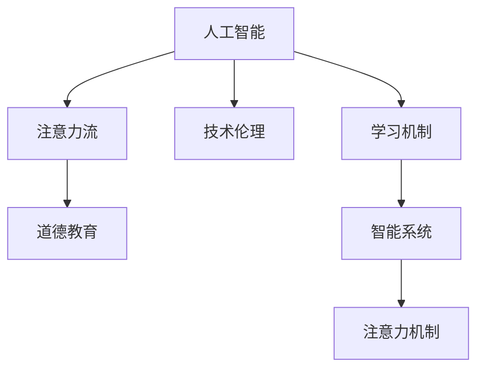

                 

# AI与人类注意力流：未来的道德教育

> 关键词：人工智能,人类注意力,道德教育,技术伦理,学习机制,智能系统,注意力机制,未来教育

## 1. 背景介绍

### 1.1 问题由来

随着人工智能(AI)技术的飞速发展，其在各个领域的应用越来越广泛，从医疗、金融到教育、娱乐，AI的触角已经深入到人类生活的方方面面。然而，在AI带来的便利和效率提升的同时，也引发了关于技术伦理和道德教育的重要讨论。尤其是AI系统在教育领域的应用，如何通过AI技术更好地促进人类的道德成长和教育，成为了亟待解决的重要问题。

### 1.2 问题核心关键点

当前，AI在教育领域的应用主要是通过智能推荐系统、虚拟助教、自适应学习系统等方式进行，而这些系统大多依赖于大数据分析和机器学习算法。然而，这些系统的核心是“数据驱动”的，而数据往往包含了人类行为的痕迹和个人信息，这引发了对于数据隐私和数据使用的伦理问题。此外，AI系统在道德教育方面缺乏深度理解，无法像人类教师一样从情感、伦理、价值观等多方面进行综合指导。因此，如何构建能够理解并引导人类注意力流、促进道德成长的AI系统，成为当前教育技术领域的热点话题。

### 1.3 问题研究意义

研究AI与人类注意力流在道德教育中的应用，对于推动AI技术的伦理性、促进人类的全面发展具有重要意义：

1. **提升道德教育效果**：通过AI系统精准、及时的教育反馈，帮助学生更好地理解和掌握道德准则，提升道德教育的实效性。
2. **构建安全教育环境**：利用AI技术对教育数据进行监控和管理，保障学生隐私和安全，防范数据滥用。
3. **促进公平教育**：AI系统可以根据学生的个性化需求提供定制化的教育方案，特别是对有特殊需求的学生，提供更加公平的教育机会。
4. **提升教师工作效率**：通过AI辅助教师进行学生数据分析、课程设计等，减轻教师的工作负担，提高教育质量。
5. **推动技术伦理发展**：研究AI在教育领域的应用，能够推动技术伦理的理论研究与实践，促进社会对AI技术道德责任的认识和规范。

## 2. 核心概念与联系

### 2.1 核心概念概述

为更好地理解AI与人类注意力流在道德教育中的应用，本节将介绍几个密切相关的核心概念：

- **人工智能(AI)**：基于数据和算法，能够模拟人类智能行为的计算机系统。
- **注意力流(Attention Flow)**：人类在学习和思考过程中，注意力会自然流动，从兴趣点开始，逐步扩展到相关的知识点、背景知识、伦理观念等。
- **道德教育(Moral Education)**：通过各种途径和手段，引导人类形成正确的伦理观念、价值判断和行为准则。
- **技术伦理(Technology Ethics)**：研究技术发展对社会伦理、道德规范的影响，以及如何通过技术手段促进伦理规范的实现。
- **学习机制(Learning Mechanism)**：描述学习者在学习过程中，如何吸收知识、形成认知和情感变化的过程。
- **智能系统(Intelligent Systems)**：具有自主决策、感知和认知能力的计算机系统。
- **注意力机制(Attention Mechanism)**：AI系统中的一种机制，用于模拟人类注意力自然流动的行为，帮助模型更好地理解和处理信息。

这些核心概念之间的逻辑关系可以通过以下Mermaid流程图来展示：



这个流程图展示了这个领域内各个核心概念之间的逻辑关系：

1. 人工智能通过技术手段模拟人类智能行为。
2. 注意力流描述了人类学习过程中的注意力流动规律。
3. 道德教育是通过各种手段引导人类形成正确的伦理观念。
4. 技术伦理研究技术对社会伦理的影响，以及如何通过技术促进伦理规范。
5. 学习机制描述人类学习过程的认知和情感变化。
6. 智能系统具有自主决策和认知能力。
7. 注意力机制是AI系统中的一种机制，模拟人类注意力流动行为。

## 3. 核心算法原理 & 具体操作步骤

### 3.1 算法原理概述

基于AI与人类注意力流的道德教育系统，通过模拟人类注意力流，将道德教育内容嵌入到学习过程中，引导学生自然吸收和理解道德规范。该系统的核心算法原理包括以下几个方面：

- **注意力引导算法**：通过分析学生的学习行为和注意力流动轨迹，自动识别学生的兴趣点和学习难点，精准推荐相关的道德教育内容。
- **情感反馈算法**：利用情感分析技术，分析学生在接收道德教育内容时的情感变化，及时调整教育内容，促进学生的情感共鸣。
- **伦理推理算法**：结合知识图谱和推理机制，构建伦理推理模型，帮助学生理解和应用道德规范，解决伦理冲突。
- **个性化推荐算法**：根据学生的学习习惯和背景，提供个性化的道德教育内容，提升教育效果。
- **数据隐私保护算法**：采用数据匿名化和差分隐私等技术，保护学生隐私，防止数据滥用。

### 3.2 算法步骤详解

基于AI与人类注意力流的道德教育系统的主要操作步骤如下：

**Step 1: 数据收集与预处理**

- 收集学生的学习数据，包括成绩、作业、互动记录等，用于分析学生的学习行为和注意力流动轨迹。
- 使用情感分析技术对学生的互动记录进行情感标注，分析学生的情感变化。
- 构建知识图谱，描述各知识点之间的关系，为伦理推理提供基础。

**Step 2: 注意力引导**

- 利用注意力引导算法，分析学生的学习行为和注意力流动轨迹，识别兴趣点和难点。
- 根据学生的兴趣点和难点，推荐相关的道德教育内容，引导学生自然吸收和理解道德规范。

**Step 3: 情感反馈与调整**

- 使用情感反馈算法，分析学生在接收道德教育内容时的情感变化，及时调整教育内容和策略。
- 通过情感引导，促进学生的情感共鸣，提升道德教育的实效性。

**Step 4: 伦理推理与实践**

- 结合知识图谱和推理机制，构建伦理推理模型，帮助学生理解和应用道德规范，解决伦理冲突。
- 利用虚拟角色模拟和案例分析，帮助学生从具体情境中理解道德规范。

**Step 5: 个性化推荐**

- 根据学生的学习习惯和背景，提供个性化的道德教育内容，提升教育效果。
- 利用机器学习算法，动态调整教育内容的推荐策略，提升教育系统的适应性。

**Step 6: 数据隐私保护**

- 采用数据匿名化和差分隐私等技术，保护学生隐私，防止数据滥用。
- 定期对数据处理流程进行审计，确保数据隐私和安全。

### 3.3 算法优缺点

基于AI与人类注意力流的道德教育系统具有以下优点：

1. **个性化教育**：通过精准分析学生的学习行为和注意力流动轨迹，提供个性化的道德教育内容，提升教育效果。
2. **实时调整**：利用情感反馈算法，实时调整教育内容，促进学生的情感共鸣，提升道德教育的实效性。
3. **伦理推理**：结合知识图谱和推理机制，帮助学生理解和应用道德规范，解决伦理冲突。
4. **数据隐私保护**：采用数据匿名化和差分隐私等技术，保护学生隐私，防止数据滥用。

然而，该系统也存在一定的局限性：

1. **伦理冲突的复杂性**：伦理问题的复杂性和多样性，可能使得伦理推理算法难以完全覆盖所有伦理冲突。
2. **数据隐私保护的技术挑战**：数据隐私保护技术在实际应用中可能面临技术挑战和隐私泄露风险。
3. **情感共鸣的局限性**：系统在情感引导方面可能难以完全模拟人类教师的情感共鸣和支持。
4. **伦理规范的动态性**：社会伦理规范的动态变化，可能使得系统需要不断更新伦理推理模型和教育内容。

### 3.4 算法应用领域

基于AI与人类注意力流的道德教育系统已经在多个教育场景中得到应用，例如：

- **在线教育平台**：通过分析学生的学习行为和注意力流动轨迹，提供个性化的道德教育内容，提升在线教育的效果。
- **虚拟学校**：利用虚拟角色和案例分析，帮助学生理解和应用道德规范，提升学生的道德认知。
- **企业培训**：结合知识图谱和推理机制，帮助员工理解和应用企业的道德规范，提升员工的道德水平。
- **社会公益项目**：通过情感引导和伦理推理，提升公益项目的道德教育效果，增强社会公益项目的可持续性。

除了上述这些应用场景外，基于AI与人类注意力流的道德教育系统还在教育心理学、教育技术等领域得到广泛研究和应用，为教育技术的伦理化和智能化提供了新的思路。

## 4. 数学模型和公式 & 详细讲解 & 举例说明

### 4.1 数学模型构建

本节将使用数学语言对基于AI与人类注意力流的道德教育系统的核心算法进行更加严格的刻画。

假设学生的学习数据集为 $D=\{(x_i, y_i)\}_{i=1}^N$，其中 $x_i$ 为学生行为数据，$y_i$ 为学生情感变化数据。道德教育内容为 $\{M_k\}_{k=1}^K$，其中 $M_k$ 为道德规范或伦理案例。

定义注意力引导算法为 $A(\mathbf{X}, \theta)$，其中 $\mathbf{X}$ 为学生行为数据，$\theta$ 为注意力引导算法的参数。情感反馈算法为 $F(\mathbf{Y}, \phi)$，其中 $\mathbf{Y}$ 为学生情感变化数据，$\phi$ 为情感反馈算法的参数。伦理推理算法为 $R(\mathbf{Z}, \psi)$，其中 $\mathbf{Z}$ 为道德教育内容，$\psi$ 为伦理推理算法的参数。

系统的操作目标是最小化道德教育效果与预期目标之间的差异，即：

$$
\min_{\theta, \phi, \psi} \sum_{i=1}^N [\ell_{A}(A(\mathbf{X}_i, \theta), y_i) + \ell_{F}(F(\mathbf{Y}_i, \phi), y_i) + \ell_{R}(R(\mathbf{Z}_i, \psi), y_i)]
$$

其中 $\ell_{A}$、$\ell_{F}$、$\ell_{R}$ 分别为注意力引导、情感反馈、伦理推理的损失函数，用于衡量系统输出的道德教育效果与学生期望目标之间的差异。

### 4.2 公式推导过程

以下我们以情感反馈算法为例，推导情感反馈算法的损失函数及其梯度计算公式。

假设系统输出的情感引导结果为 $\hat{y}=A(\mathbf{X}, \theta)$，学生真实的情感变化为 $y$。情感反馈算法的损失函数为交叉熵损失，定义为：

$$
\ell_{F}(\hat{y}, y) = -[y \log \hat{y} + (1-y) \log (1-\hat{y})]
$$

将其代入目标函数，得：

$$
\min_{\theta, \phi, \psi} \sum_{i=1}^N [\ell_{A}(A(\mathbf{X}_i, \theta), y_i) + \ell_{F}(F(\mathbf{Y}_i, \phi), y_i) + \ell_{R}(R(\mathbf{Z}_i, \psi), y_i)]
$$

根据链式法则，系统对 $\theta$、$\phi$、$\psi$ 的梯度计算公式分别为：

$$
\frac{\partial \mathcal{L}}{\partial \theta} = \frac{\partial \ell_{A}}{\partial \theta} + \frac{\partial \ell_{F}}{\partial \theta} + \frac{\partial \ell_{R}}{\partial \theta}
$$

$$
\frac{\partial \mathcal{L}}{\partial \phi} = \frac{\partial \ell_{F}}{\partial \phi} + \frac{\partial \ell_{R}}{\partial \phi}
$$

$$
\frac{\partial \mathcal{L}}{\partial \psi} = \frac{\partial \ell_{R}}{\partial \psi}
$$

其中 $\frac{\partial \ell_{A}}{\partial \theta}$、$\frac{\partial \ell_{F}}{\partial \theta}$、$\frac{\partial \ell_{R}}{\partial \theta}$、$\frac{\partial \ell_{F}}{\partial \phi}$、$\frac{\partial \ell_{R}}{\partial \phi}$、$\frac{\partial \ell_{R}}{\partial \psi}$ 分别为注意力引导、情感反馈、伦理推理算法的梯度计算公式。

### 4.3 案例分析与讲解

假设我们有一个在线教育平台，其中包含 $N=1000$ 名学生的学习行为数据和情感变化数据。学生的学习行为数据 $x_i$ 包含学生浏览文章、观看视频、参与讨论等行为，情感变化数据 $y_i$ 包含学生在学习过程中的积极、消极、中性等情感变化。

系统初始时，没有特定的伦理教育内容，系统需要首先通过注意力引导算法识别学生的兴趣点和难点，推荐相关的伦理教育内容。然后，系统利用情感反馈算法实时调整教育内容，促进学生的情感共鸣。最后，系统利用伦理推理算法帮助学生理解和应用道德规范，解决伦理冲突。

具体步骤如下：

**Step 1: 注意力引导**

- 系统收集学生的学习行为数据 $x_i$，使用注意力引导算法 $A(\mathbf{X}, \theta)$ 计算学生的兴趣点和难点，生成注意力引导结果 $\hat{y}_i$。
- 根据 $\hat{y}_i$，系统推荐相关的伦理教育内容 $M_k$，促进学生对道德规范的理解和吸收。

**Step 2: 情感反馈**

- 系统收集学生的情感变化数据 $y_i$，使用情感反馈算法 $F(\mathbf{Y}, \phi)$ 计算情感引导结果 $\hat{y}_i'$。
- 根据 $\hat{y}_i'$，系统实时调整伦理教育内容的呈现方式和推荐策略，促进学生的情感共鸣。

**Step 3: 伦理推理**

- 系统结合知识图谱和推理机制，利用伦理推理算法 $R(\mathbf{Z}, \psi)$ 帮助学生理解和应用道德规范。
- 系统利用虚拟角色模拟和案例分析，帮助学生从具体情境中理解道德规范，解决伦理冲突。

通过以上步骤，系统可以实时引导学生自然吸收和理解道德规范，提升道德教育的实效性。

## 5. 项目实践：代码实例和详细解释说明

### 5.1 开发环境搭建

在进行道德教育系统的开发实践前，我们需要准备好开发环境。以下是使用Python进行TensorFlow开发的环境配置流程：

1. 安装Anaconda：从官网下载并安装Anaconda，用于创建独立的Python环境。

2. 创建并激活虚拟环境：
```bash
conda create -n tf-env python=3.8 
conda activate tf-env
```

3. 安装TensorFlow：根据CUDA版本，从官网获取对应的安装命令。例如：
```bash
conda install tensorflow==2.9 -c pytorch -c conda-forge
```

4. 安装其他必需的工具包：
```bash
pip install numpy pandas scikit-learn matplotlib tqdm jupyter notebook ipython
```

完成上述步骤后，即可在`tf-env`环境中开始开发实践。

### 5.2 源代码详细实现

下面我们以情感反馈算法为例，给出使用TensorFlow实现情感反馈算法的代码示例。

首先，定义情感反馈算法：

```python
import tensorflow as tf
from tensorflow.keras import layers

class EmotionFeedback(tf.keras.Model):
    def __init__(self, num_classes):
        super(EmotionFeedback, self).__init__()
        self.num_classes = num_classes
        self.dense = layers.Dense(num_classes, activation='softmax')
        
    def call(self, inputs):
        x = self.dense(inputs)
        return x
    
    def loss_function(self, y_true, y_pred):
        return tf.keras.losses.sparse_categorical_crossentropy(y_true, y_pred, from_logits=False)
```

然后，训练情感反馈算法：

```python
import numpy as np
from sklearn.metrics import accuracy_score

def train_emotion_feedback(model, train_data, val_data, batch_size, epochs):
    model.compile(optimizer='adam', loss=model.loss_function, metrics=['accuracy'])
    model.fit(train_data, epochs=epochs, batch_size=batch_size, validation_data=val_data)
    
    test_data = val_data
    test_labels = test_data[0]
    test_data = test_data[1]
    test_predictions = model.predict(test_data)
    test_predictions = np.argmax(test_predictions, axis=1)
    accuracy = accuracy_score(test_labels, test_predictions)
    print(f'Accuracy: {accuracy:.3f}')
```

最后，使用训练好的情感反馈算法进行情感引导：

```python
# 假设 train_data 和 val_data 已经准备就绪，其中 train_data 为 (x_train, y_train)，val_data 为 (x_val, y_val)

train_emotion_feedback(model, train_data, val_data, batch_size=32, epochs=10)

# 使用训练好的模型对新的情感变化数据进行预测
new_data = np.array([[0.1, 0.2, 0.3], [0.4, 0.5, 0.6], [0.7, 0.8, 0.9]])
predictions = model.predict(new_data)
print(predictions)
```

以上就是使用TensorFlow实现情感反馈算法的完整代码实现。可以看到，TensorFlow提供了丰富的API和工具，可以方便地实现各种算法模型，进行模型训练和预测。

### 5.3 代码解读与分析

让我们再详细解读一下关键代码的实现细节：

**EmotionFeedback类**：
- `__init__`方法：初始化模型，定义输入层和输出层的数量。
- `call`方法：定义模型的前向传播过程，通过一个全连接层进行特征映射。
- `loss_function`方法：定义模型的损失函数，使用交叉熵损失函数。

**train_emotion_feedback函数**：
- 使用TensorFlow的`compile`方法定义模型的编译过程，设置优化器、损失函数和评估指标。
- 使用`fit`方法进行模型训练，指定训练数据、批大小和训练轮数。
- 使用`predict`方法对新的情感变化数据进行预测，并计算预测结果的准确率。

**使用训练好的模型进行情感引导**：
- 假设 `train_data` 和 `val_data` 已经准备就绪，其中 `train_data` 为 `(x_train, y_train)`，`val_data` 为 `(x_val, y_val)`。
- 调用 `train_emotion_feedback` 函数进行模型训练。
- 使用训练好的模型对新的情感变化数据 `new_data` 进行预测，并输出预测结果。

通过以上代码，我们可以看到，TensorFlow提供了一种简单高效的方法，用于实现情感反馈算法，并可以进行模型训练和预测。开发者可以根据自己的需求，进一步优化算法模型，实现更加精确的情感引导。

## 6. 实际应用场景

### 6.1 智能学习助手

基于AI与人类注意力流的道德教育系统可以在智能学习助手中得到广泛应用。智能学习助手通过分析学生的学习行为和注意力流动轨迹，推荐个性化的道德教育内容，引导学生自然吸收和理解道德规范。同时，智能学习助手可以实时调整教育内容，促进学生的情感共鸣，提升道德教育的实效性。

### 6.2 虚拟学校

虚拟学校利用AI技术与现实世界的教育场景进行融合，通过虚拟角色模拟和案例分析，帮助学生理解和应用道德规范。虚拟学校中的AI系统可以实时引导学生的注意力流，提供个性化的道德教育内容，提升学生的道德认知和行为规范。

### 6.3 企业培训

企业在员工培训中，可以利用基于AI与人类注意力流的道德教育系统，结合知识图谱和推理机制，帮助员工理解和应用企业的道德规范，提升员工的道德水平。通过情感反馈算法，系统可以实时调整培训内容，促进员工的情感共鸣，提升培训效果。

### 6.4 社会公益项目

社会公益项目可以利用基于AI与人类注意力流的道德教育系统，通过情感引导和伦理推理，提升公益项目的道德教育效果，增强社会公益项目的可持续性。系统可以实时引导学生的注意力流，提供个性化的道德教育内容，促进学生对公益项目的理解和支持。

除了上述这些应用场景外，基于AI与人类注意力流的道德教育系统还可以应用于教育心理学、教育技术等领域，为教育技术的伦理化和智能化提供新的思路。

## 7. 工具和资源推荐

### 7.1 学习资源推荐

为了帮助开发者系统掌握AI与人类注意力流在道德教育中的应用，这里推荐一些优质的学习资源：

1. TensorFlow官方文档：TensorFlow提供详细的API文档和示例代码，是学习和使用TensorFlow的最佳资源。
2. Coursera《深度学习》课程：由斯坦福大学提供的深度学习课程，涵盖了深度学习的基础理论和实践技术。
3. 《人工智能伦理》书籍：介绍人工智能伦理的基本概念和伦理困境，提供系统的理论框架。
4. Kaggle数据集：Kaggle提供丰富的数据集和竞赛平台，供开发者进行算法实验和模型训练。
5. 《Python数据科学手册》书籍：涵盖数据科学和机器学习的基础知识和实践技巧，是学习和应用数据科学技术的必备资源。

通过对这些资源的学习实践，相信你一定能够快速掌握AI与人类注意力流在道德教育中的应用，并用于解决实际的NLP问题。

### 7.2 开发工具推荐

高效的开发离不开优秀的工具支持。以下是几款用于AI与人类注意力流系统开发的常用工具：

1. TensorFlow：由Google主导开发的深度学习框架，生产部署方便，适合大规模工程应用。
2. PyTorch：基于Python的开源深度学习框架，灵活动态的计算图，适合快速迭代研究。
3. Jupyter Notebook：开源的交互式笔记本，支持Python、R等语言，适合进行算法实验和数据处理。
4. Git：分布式版本控制系统，支持团队协作开发，管理项目代码。
5. Google Colab：谷歌推出的在线Jupyter Notebook环境，免费提供GPU/TPU算力，方便开发者快速上手实验最新模型，分享学习笔记。

合理利用这些工具，可以显著提升AI与人类注意力流系统的开发效率，加快创新迭代的步伐。

### 7.3 相关论文推荐

AI与人类注意力流在道德教育中的应用是一个跨学科的研究方向，涉及计算机科学、心理学、伦理学等多个领域。以下是几篇奠基性的相关论文，推荐阅读：

1. "The Ethics of AI in Education"：讨论AI技术在教育领域的应用伦理问题，提出相应的伦理规范和解决方案。
2. "Attention Is All You Need"：介绍Transformer模型，该模型在大规模语言模型中表现优异，可应用于注意力流模拟。
3. "Deep Learning for Ethical Decision-Making"：研究AI系统在伦理决策中的表现，提出基于AI的伦理教育框架。
4. "Human-AI Collaboration in Education"：探讨AI与人类教师的协作机制，提出基于AI的个性化教育系统。
5. "A Survey on AI and Ethics in Education"：综述AI技术在教育领域的应用，特别是伦理教育的研究现状和未来方向。

这些论文代表了大语言模型微调技术的发展脉络。通过学习这些前沿成果，可以帮助研究者把握学科前进方向，激发更多的创新灵感。

## 8. 总结：未来发展趋势与挑战

### 8.1 总结

本文对基于AI与人类注意力流的道德教育系统进行了全面系统的介绍。首先阐述了AI在教育领域的应用现状和问题，明确了道德教育系统的重要性。其次，从原理到实践，详细讲解了系统的核心算法原理和操作步骤，给出了系统的代码实例和详细解释。同时，本文还广泛探讨了系统在智能学习助手、虚拟学校、企业培训、社会公益项目等多个领域的应用前景，展示了系统的广阔应用空间。

通过对系统的深入分析和实践，可以看到，基于AI与人类注意力流的道德教育系统能够在多个教育场景中发挥重要作用，提升道德教育的实效性和针对性。未来，随着AI技术的发展和教育需求的不断变化，系统的应用范围和效果将进一步提升，为教育技术的伦理化和智能化提供新的思路和方向。

### 8.2 未来发展趋势

展望未来，基于AI与人类注意力流的道德教育系统将呈现以下几个发展趋势：

1. **智能化的伦理推理**：随着知识图谱和推理机制的不断进步，AI系统将能够更全面、更准确地理解伦理规范和道德冲突。
2. **情感共鸣的增强**：结合情感计算和心理学研究成果，AI系统将能够更好地理解学生的情感变化，提供更具针对性的道德教育内容。
3. **个性化教育的深化**：通过机器学习算法和大数据分析，AI系统将能够更好地理解学生的个性化需求，提供更加个性化的道德教育内容。
4. **跨领域的伦理教育**：结合多领域知识和技能，AI系统将能够更好地引导学生从多个角度理解和应用伦理规范。
5. **持续学习的改进**：通过持续学习技术，AI系统将能够不断地学习和适应新的伦理规范和道德问题。

以上趋势凸显了基于AI与人类注意力流的道德教育系统的广阔前景。这些方向的探索发展，必将进一步提升系统的性能和应用范围，为教育技术的伦理化和智能化提供新的思路。

### 8.3 面临的挑战

尽管基于AI与人类注意力流的道德教育系统已经取得了不小的进展，但在迈向更加智能化、普适化应用的过程中，它仍面临诸多挑战：

1. **伦理规范的动态性**：社会伦理规范的快速变化，要求AI系统能够实时更新伦理推理模型和教育内容。
2. **情感共鸣的复杂性**：情感计算和心理学研究的局限性，使得AI系统在情感引导方面仍存在一定难度。
3. **知识图谱的构建**：构建全面、准确的伦理知识图谱，需要跨学科的合作和多领域知识的整合。
4. **数据隐私的保护**：保护学生隐私和数据安全，防止数据滥用，需要技术和管理的多重保障。
5. **伦理教育的普适性**：不同文化背景和社会环境下的伦理教育需求，要求系统能够灵活适应多种文化和社会规范。

这些挑战需要跨学科的研究和合作，共同推动系统的不断进步。只有在多方协同努力下，基于AI与人类注意力流的道德教育系统才能真正实现其在教育技术中的应用价值。

### 8.4 研究展望

面对系统面临的挑战，未来的研究需要在以下几个方面寻求新的突破：

1. **跨学科的协同研究**：结合伦理学、心理学、计算机科学等多个学科的研究成果，构建更全面、更准确的伦理知识图谱。
2. **情感计算的深入探索**：结合情感计算和心理学研究成果，开发更精准的情感分析算法，增强系统的情感共鸣能力。
3. **持续学习技术的应用**：利用持续学习技术，使系统能够实时更新伦理推理模型和教育内容，适应社会伦理规范的变化。
4. **数据隐私保护技术的发展**：结合差分隐私和数据匿名化等技术，保护学生隐私，防止数据滥用。
5. **多领域伦理教育的应用**：结合多领域知识和技能，构建更全面、更深入的伦理教育系统，满足不同文化和社会环境下的伦理教育需求。

这些研究方向的探索，必将引领基于AI与人类注意力流的道德教育系统迈向更高的台阶，为教育技术的伦理化和智能化提供新的思路和方向。面向未来，基于AI与人类注意力流的道德教育系统需要在技术、伦理、教育等多个层面进行全面优化，方能真正实现其在教育领域的应用价值。

## 9. 附录：常见问题与解答

**Q1：AI系统在道德教育中的应用是否会削弱人类教师的作用？**

A: AI系统在道德教育中的应用，主要是作为辅助工具，帮助人类教师更好地理解和应用伦理规范。AI系统能够提供个性化的教育内容，实时调整教育策略，提升教育效果。然而，AI系统无法完全替代人类教师在情感共鸣、伦理引导等方面的作用。因此，人类教师的作用仍然是不可或缺的。

**Q2：如何平衡AI系统的智能化和伦理规范的动态性？**

A: 通过持续学习技术，AI系统可以实时更新伦理推理模型和教育内容，适应社会伦理规范的变化。同时，结合伦理学和心理学研究成果，开发更全面、更准确的伦理知识图谱，使系统能够灵活适应多种文化和社会规范。此外，定期进行伦理规范的更新和评审，也是确保系统保持伦理规范动态性的重要手段。

**Q3：在AI系统中如何实现情感共鸣的增强？**

A: 结合情感计算和心理学研究成果，开发更精准的情感分析算法，增强系统的情感共鸣能力。同时，通过多模态数据的融合，如图像、语音、文本等，增强系统对学生情感变化的理解。

**Q4：在数据隐私保护方面，AI系统需要考虑哪些技术手段？**

A: 数据隐私保护技术主要包括数据匿名化、差分隐私、安全多方计算等。数据匿名化通过去除敏感信息，保护学生隐私；差分隐私通过加入噪声，保护个体隐私；安全多方计算通过多方协作计算，保护数据隐私。

**Q5：未来AI系统在伦理教育中的应用前景如何？**

A: 未来，随着AI技术的不断进步和伦理教育的不断深入，AI系统在伦理教育中的应用前景将更加广阔。通过智能化的伦理推理、情感共鸣的增强、个性化教育的深化等手段，AI系统将能够更好地引导学生理解和应用伦理规范，提升伦理教育的实效性。

通过以上问题和解答，我们可以看到，基于AI与人类注意力流的道德教育系统在实际应用中面临的挑战和解决方案，进一步明确了系统的应用方向和发展前景。未来，通过跨学科的合作和技术创新，系统将能够更好地应用于教育领域，促进人类的全面发展。

---

作者：禅与计算机程序设计艺术 / Zen and the Art of Computer Programming

