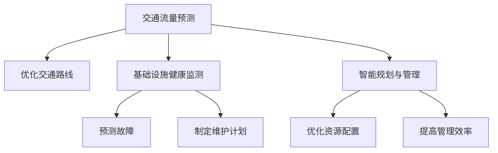

                 

# AI与人类计算：打造可持续发展的城市交通与基础设施建设与规划建设与管理建设规划

## 1. 背景介绍

### 1.1 问题由来
城市交通与基础设施建设是现代城市规划管理的重要组成部分。随着城市人口的不断增长和经济的快速发展，城市交通拥堵、基础设施老化、建设与规划管理不当等问题日益突出，严重制约了城市运行效率和居民生活质量。

解决这些问题，需要融合人工智能技术，结合人类专家的经验知识，构建可持续发展的城市交通与基础设施系统。通过AI与人类计算的协同，不仅能提升城市管理效率，还能提升居民的生活满意度。

### 1.2 问题核心关键点
城市交通与基础设施建设与管理中，AI与人类计算的主要作用包括以下几个方面：

1. **交通流量预测与优化**：基于实时交通数据，AI模型能够预测交通流量，优化交通路线，减少拥堵。
2. **基础设施健康监测与维护**：AI可以实时监测基础设施状态，预测故障，制定维护计划。
3. **智能规划与管理**：AI辅助进行城市规划与建设管理，优化资源配置，提高管理效率。

## 2. 核心概念与联系

### 2.1 核心概念概述

为更好地理解AI与人类计算在城市交通与基础设施建设中的应用，本节将介绍几个密切相关的核心概念：

- **AI与人类计算**：结合人工智能技术与人类专家的经验知识，实现高效、准确、可解释的决策过程。
- **交通流量预测**：基于历史和实时数据，预测未来交通流量，指导交通优化策略。
- **基础设施健康监测**：通过传感器等设备实时监测基础设施状态，预测潜在故障，提高维护效率。
- **智能规划与管理**：结合AI与人类专家的知识，优化城市规划和管理流程，提升资源配置效率。

这些核心概念之间的逻辑关系可以通过以下Mermaid流程图来展示：



这个流程图展示了AI与人类计算在城市交通与基础设施建设中的主要应用场景，每个环节相互协作，共同构建智能化的城市管理系统。

## 3. 核心算法原理 & 具体操作步骤

### 3.1 算法原理概述

AI与人类计算在城市交通与基础设施建设中的原理，主要包括以下几个方面：

- **数据驱动**：通过收集大量的交通和基础设施数据，利用AI模型进行分析和预测。
- **模型融合**：结合AI模型的预测结果和人类专家的经验知识，进行综合决策。
- **实时反馈**：在实际运行中，不断收集数据和反馈，更新模型和决策方案。

### 3.2 算法步骤详解

AI与人类计算在城市交通与基础设施建设中的应用，主要包括以下几个关键步骤：

**Step 1: 数据收集与处理**
- 收集城市交通数据，如车辆流量、速度、位置等。
- 收集基础设施数据，如桥梁、道路、水管等的健康状态监测数据。
- 收集历史和实时环境数据，如天气、温度、交通信号灯状态等。

**Step 2: 模型训练与优化**
- 使用历史和实时数据训练交通流量预测模型。
- 使用传感器数据训练基础设施健康监测模型。
- 使用专家知识进行模型融合和优化。

**Step 3: 决策与执行**
- 基于AI模型和人类专家的决策，优化交通流量和路线。
- 基于AI模型和专家知识，制定基础设施维护计划。
- 结合AI模型和专家知识，优化城市规划与管理流程。

**Step 4: 反馈与改进**
- 在实际运行中，收集数据反馈，更新模型和决策方案。
- 定期评估模型性能，进行改进和优化。

### 3.3 算法优缺点

AI与人类计算在城市交通与基础设施建设中的应用，具有以下优点：

1. **高效性**：通过AI模型快速分析大量数据，节省人力和时间成本。
2. **准确性**：AI模型能够实时监测和预测，提高决策的准确性。
3. **可解释性**：结合人类专家的知识，提高决策的可解释性。
4. **灵活性**：能够根据实际情况灵活调整模型和策略。

同时，也存在一些缺点：

1. **数据质量问题**：数据收集和处理的准确性直接影响模型性能。
2. **模型依赖**：过度依赖AI模型可能导致忽视人类专家的经验知识。
3. **资源消耗**：AI模型训练和运行需要大量的计算资源。
4. **技术门槛**：需要跨学科专业知识，实施难度较大。

### 3.4 算法应用领域

AI与人类计算在城市交通与基础设施建设中的应用领域广泛，包括：

- **交通流量预测与优化**：应用于城市交通规划、信号灯优化、车辆调度等。
- **基础设施健康监测与维护**：应用于桥梁、道路、水管等的健康监测和维护计划制定。
- **智能规划与管理**：应用于城市规划、环保管理、公共资源分配等。

## 4. 数学模型和公式 & 详细讲解 & 举例说明

### 4.1 数学模型构建

在本节中，我们将使用数学语言对AI与人类计算在城市交通与基础设施建设中的应用进行更加严格的刻画。

设城市交通流量数据为 $D_t = (x_{it}, y_{it})_{i=1}^N$，其中 $x_{it}$ 表示第 $i$ 个时间点的交通流量，$y_{it}$ 表示第 $i$ 个时间点的交通状态（如拥堵、畅通等）。

交通流量预测模型的目标是根据历史交通数据 $D_h$，预测未来时间点的交通流量 $D_f = (x_{it}, y_{it})_{i=T+1}^N$，其中 $T$ 为历史数据的时间范围，$N$ 为预测的时间点。

### 4.2 公式推导过程

假设我们使用神经网络模型 $M_{\theta}$ 进行交通流量预测，其中 $\theta$ 为模型参数。模型的输入为 $x$，输出为 $y$，预测公式为 $y = M_{\theta}(x)$。

交通流量预测的目标是最小化预测误差 $e = y_{it} - M_{\theta}(x_{it})$，因此定义损失函数 $\mathcal{L}(\theta)$ 如下：

$$
\mathcal{L}(\theta) = \frac{1}{N}\sum_{i=1}^N \ell(y_{it}, M_{\theta}(x_{it}))
$$

其中 $\ell$ 为损失函数，如均方误差（MSE）、交叉熵损失（Cross-Entropy Loss）等。

使用梯度下降算法进行模型训练，最小化损失函数，更新参数 $\theta$，即：

$$
\theta \leftarrow \theta - \eta \nabla_{\theta}\mathcal{L}(\theta)
$$

其中 $\eta$ 为学习率，$\nabla_{\theta}\mathcal{L}(\theta)$ 为损失函数对参数 $\theta$ 的梯度。

### 4.3 案例分析与讲解

假设我们收集了城市交通流量数据 $D_h$，使用时间序列模型进行训练。模型为单层RNN，结构如下：

$$
y_{it} = M_{\theta}(x_{it}) = \sum_{t'=t-k}^{t-1} w_{t'}x_{it'}
$$

其中 $w_{t'}$ 为权重参数，$k$ 为时间窗口大小。模型的损失函数为MSE，即：

$$
\mathcal{L}(\theta) = \frac{1}{N}\sum_{i=1}^N (y_{it} - \sum_{t'=t-k}^{t-1} w_{t'}x_{it'})
$$

通过梯度下降算法，最小化损失函数，更新权重参数 $w_{t'}$ 和偏差参数 $b$。

## 5. 项目实践：代码实例和详细解释说明

### 5.1 开发环境搭建

在进行城市交通与基础设施建设中的AI与人类计算实践前，我们需要准备好开发环境。以下是使用Python进行TensorFlow开发的环境配置流程：

1. 安装Anaconda：从官网下载并安装Anaconda，用于创建独立的Python环境。

2. 创建并激活虚拟环境：
```bash
conda create -n ai_tech python=3.8 
conda activate ai_tech
```

3. 安装TensorFlow：根据CUDA版本，从官网获取对应的安装命令。例如：
```bash
conda install tensorflow -c tf -c conda-forge
```

4. 安装其他库：
```bash
pip install pandas numpy scikit-learn matplotlib tqdm jupyter notebook ipython
```

完成上述步骤后，即可在`ai_tech`环境中开始AI与人类计算的实践。

### 5.2 源代码详细实现

这里我们以城市交通流量预测为例，给出使用TensorFlow进行神经网络模型训练的PyTorch代码实现。

首先，定义训练数据集和测试数据集：

```python
import tensorflow as tf
import numpy as np
from tensorflow.keras.datasets import boston_housing

# 加载波士顿房价数据
(x_train, y_train), (x_test, y_test) = boston_housing.load_data()

# 标准化数据
x_train = (x_train - np.mean(x_train)) / np.std(x_train)
x_test = (x_test - np.mean(x_train)) / np.std(x_train)

# 定义模型参数
learning_rate = 0.001
epochs = 100
batch_size = 32

# 定义模型
model = tf.keras.models.Sequential([
    tf.keras.layers.Dense(64, activation='relu'),
    tf.keras.layers.Dense(1)
])

# 编译模型
model.compile(optimizer=tf.keras.optimizers.Adam(learning_rate), loss='mse')

# 训练模型
history = model.fit(x_train, y_train, epochs=epochs, batch_size=batch_size, validation_split=0.2)
```

然后，进行模型评估：

```python
# 评估模型
loss = model.evaluate(x_test, y_test)
print(f'Test loss: {loss:.4f}')
```

最后，进行预测：

```python
# 预测新数据
new_data = np.array([[1, 2, 3, 4, 5, 6, 7, 8, 9, 10]])
prediction = model.predict(new_data)
print(f'Prediction: {prediction}')
```

以上就是使用TensorFlow进行城市交通流量预测的完整代码实现。可以看到，得益于TensorFlow的强大封装，我们可以用相对简洁的代码完成神经网络模型的训练和评估。

### 5.3 代码解读与分析

让我们再详细解读一下关键代码的实现细节：

**数据加载与处理**：
- 使用TensorFlow的内置函数加载波士顿房价数据集，并进行标准化处理。

**模型定义与编译**：
- 定义一个包含两个全连接层的神经网络模型，使用ReLU激活函数。
- 编译模型，选择Adam优化器和均方误差损失函数。

**模型训练与评估**：
- 使用训练数据集进行模型训练，设置学习率、批大小和迭代轮数。
- 在验证集上进行模型评估，输出测试损失。

**模型预测**：
- 使用模型对新的输入数据进行预测，输出预测结果。

可以看到，TensorFlow提供了强大的深度学习模型训练框架，使得AI与人类计算的应用开发变得高效便捷。开发者可以将更多精力放在模型优化和算法创新上，而不必过多关注底层的实现细节。

当然，工业级的系统实现还需考虑更多因素，如模型的保存和部署、超参数的自动搜索、更灵活的任务适配层等。但核心的AI与人类计算方法基本与此类似。

## 6. 实际应用场景

### 6.1 智能交通管理

基于AI与人类计算的智能交通管理系统，能够实时监控城市交通状态，自动优化交通信号灯，减少交通拥堵。

在技术实现上，可以部署多个摄像头和传感器，实时采集交通数据。通过神经网络模型，实时预测交通流量，自动调整信号灯时长和路口通行规则，从而优化交通流量。

### 6.2 基础设施健康监测

AI与人类计算在基础设施健康监测中，能够实时监测桥梁、道路、水管等的状态，预测潜在故障，制定维护计划。

具体而言，可以部署各类传感器，实时监测基础设施的关键参数，如应力、温度、水位等。通过时间序列模型，分析数据变化趋势，预测潜在故障。同时，结合专家知识，制定维护计划，及时进行维修和更换。

### 6.3 智能规划与管理

AI与人类计算在城市规划与管理中，能够优化资源配置，提高管理效率。

在实践中，可以结合AI模型和专家知识，进行城市规划和资源分配。例如，使用神经网络模型预测各类资源需求，结合专家经验，制定合理的规划方案，优化资源分配。

### 6.4 未来应用展望

随着AI与人类计算技术的不断发展，未来将在更多领域得到应用，为城市管理带来变革性影响。

在智慧医疗领域，基于AI与人类计算的医疗监测与管理，能够实时监测患者健康状况，提供个性化的医疗服务。

在智能教育领域，AI与人类计算可应用于在线教育、智能答疑、个性化推荐等方面，因材施教，提高教育质量。

在智慧城市治理中，AI与人类计算能够应用于城市事件监测、舆情分析、应急指挥等环节，提高城市管理的自动化和智能化水平，构建更安全、高效的未来城市。

## 7. 工具和资源推荐

### 7.1 学习资源推荐

为了帮助开发者系统掌握AI与人类计算的理论基础和实践技巧，这里推荐一些优质的学习资源：

1. **《深度学习》系列书籍**：全面介绍了深度学习的基本概念和核心算法，适合入门和进阶学习。

2. **Coursera《深度学习专项课程》**：斯坦福大学和DeepLearning.ai提供的深度学习课程，涵盖神经网络、卷积神经网络、循环神经网络等内容，是深度学习学习的必备资源。

3. **Kaggle**：数据科学竞赛平台，通过实际比赛项目，帮助你掌握AI与人类计算的具体应用。

4. **TensorFlow官方文档**：TensorFlow的官方文档，提供了详尽的模型训练和优化教程，是AI与人类计算实践的重要参考。

5. **ArXiv**：顶级学术期刊，可以获取最新的AI与人类计算研究论文，了解领域最新进展。

通过对这些资源的学习实践，相信你一定能够快速掌握AI与人类计算的精髓，并用于解决实际的AI与人类计算问题。

### 7.2 开发工具推荐

高效的开发离不开优秀的工具支持。以下是几款用于AI与人类计算开发的常用工具：

1. **TensorFlow**：基于Python的开源深度学习框架，灵活动态的计算图，适合快速迭代研究。
2. **PyTorch**：基于Python的开源深度学习框架，灵活便捷，支持动态图和静态图两种模式。
3. **Keras**：高层次深度学习API，简单易用，适合快速原型设计和模型验证。
4. **Jupyter Notebook**：交互式笔记本环境，方便开发者进行模型训练和调试。
5. **Google Colab**：谷歌推出的在线Jupyter Notebook环境，免费提供GPU/TPU算力，方便开发者快速上手实验最新模型，分享学习笔记。

合理利用这些工具，可以显著提升AI与人类计算的应用开发效率，加快创新迭代的步伐。

### 7.3 相关论文推荐

AI与人类计算的发展源于学界的持续研究。以下是几篇奠基性的相关论文，推荐阅读：

1. **《深度学习》**：Goodfellow等人所著，全面介绍了深度学习的基本概念和核心算法。
2. **《神经网络与深度学习》**：Michael Nielsen所著，介绍了神经网络和深度学习的基本原理和应用。
3. **《TensorFlow实战》**：机器之心团队所著，介绍了TensorFlow的实践方法和最佳实践。
4. **《Keras实战》**：Vincent Vanhoucke等人所著，介绍了Keras的实践方法和最佳实践。

这些论文代表了大语言模型微调技术的发展脉络。通过学习这些前沿成果，可以帮助研究者把握学科前进方向，激发更多的创新灵感。

## 8. 总结：未来发展趋势与挑战

### 8.1 总结

本文对AI与人类计算在城市交通与基础设施建设中的应用进行了全面系统的介绍。首先阐述了AI与人类计算的研究背景和意义，明确了AI与人类计算在城市交通与基础设施建设中的独特价值。其次，从原理到实践，详细讲解了AI与人类计算的数学原理和关键步骤，给出了AI与人类计算任务开发的完整代码实例。同时，本文还广泛探讨了AI与人类计算方法在智能交通、基础设施健康监测、智能规划与管理等多个行业领域的应用前景，展示了AI与人类计算范式的巨大潜力。此外，本文精选了AI与人类计算技术的各类学习资源，力求为读者提供全方位的技术指引。

通过本文的系统梳理，可以看到，AI与人类计算技术正在成为城市交通与基础设施建设的重要范式，极大地拓展了AI与人类计算的应用边界，催生了更多的落地场景。受益于大规模数据和算力的推动，AI与人类计算必将带来城市交通与基础设施建设管理的高效化、智能化、自动化，提升城市运行效率和居民生活质量。

### 8.2 未来发展趋势

展望未来，AI与人类计算在城市交通与基础设施建设中的应用将呈现以下几个发展趋势：

1. **高效性提升**：随着深度学习模型的不断优化，AI与人类计算的预测和决策速度将显著提升。

2. **可解释性增强**：结合人类专家的知识，进一步提升AI与人类计算模型的可解释性，便于理解和管理。

3. **实时性增强**：通过边缘计算和联邦学习等技术，将数据处理和模型训练转移到前端设备，提升实时性。

4. **跨模态融合**：结合图像、语音、文本等多种模态数据，提升AI与人类计算的决策能力。

5. **协同优化**：将AI与人类计算与传统规划管理方法结合，提升综合决策能力。

以上趋势凸显了AI与人类计算技术在城市交通与基础设施建设中的广阔前景。这些方向的探索发展，必将进一步提升城市交通与基础设施管理的智能化水平，为城市运行带来更多便利。

### 8.3 面临的挑战

尽管AI与人类计算技术已经取得了瞩目成就，但在迈向更加智能化、普适化应用的过程中，它仍面临着诸多挑战：

1. **数据质量问题**：数据收集和处理的准确性直接影响模型性能。如何获取高质量的数据，是关键难题。

2. **模型依赖**：过度依赖AI模型可能导致忽视人类专家的经验知识。如何结合专家知识，进行模型优化，是重要研究方向。

3. **资源消耗**：AI与人类计算需要大量的计算资源和存储空间，如何优化资源使用，是关键问题。

4. **技术门槛**：需要跨学科专业知识，实施难度较大。如何降低技术门槛，推广应用，是重要挑战。

5. **安全与隐私**：AI与人类计算涉及大量敏感数据，如何保障数据安全和用户隐私，是重要课题。

6. **伦理与合规**：AI与人类计算的应用可能引发伦理和合规问题，如何构建公平、透明的模型，是重要研究方向。

正视AI与人类计算面临的这些挑战，积极应对并寻求突破，将是大语言模型微调走向成熟的必由之路。相信随着学界和产业界的共同努力，这些挑战终将一一被克服，AI与人类计算必将在构建可持续发展的城市交通与基础设施建设中扮演越来越重要的角色。

### 8.4 研究展望

面对AI与人类计算所面临的种种挑战，未来的研究需要在以下几个方面寻求新的突破：

1. **多模态融合**：结合图像、语音、文本等多种模态数据，提升AI与人类计算的决策能力。

2. **协同优化**：将AI与人类计算与传统规划管理方法结合，提升综合决策能力。

3. **实时性增强**：通过边缘计算和联邦学习等技术，将数据处理和模型训练转移到前端设备，提升实时性。

4. **可解释性增强**：结合人类专家的知识，进一步提升AI与人类计算模型的可解释性，便于理解和管理。

5. **跨学科融合**：将AI与人类计算与工程、管理、社会学科结合，提升综合决策能力。

6. **伦理与合规**：构建公平、透明的AI与人类计算模型，保障数据安全和用户隐私。

这些研究方向的探索，必将引领AI与人类计算技术迈向更高的台阶，为构建可持续发展的城市交通与基础设施建设带来更多创新。面向未来，AI与人类计算技术还需要与其他人工智能技术进行更深入的融合，如知识表示、因果推理、强化学习等，多路径协同发力，共同推动城市交通与基础设施建设的进步。只有勇于创新、敢于突破，才能不断拓展AI与人类计算的边界，让智能技术更好地造福人类社会。

## 9. 附录：常见问题与解答

**Q1：AI与人类计算在城市交通与基础设施建设中的应用有哪些？**

A: AI与人类计算在城市交通与基础设施建设中的应用广泛，包括：

1. **交通流量预测与优化**：应用于城市交通规划、信号灯优化、车辆调度等。
2. **基础设施健康监测与维护**：应用于桥梁、道路、水管等的健康监测和维护计划制定。
3. **智能规划与管理**：应用于城市规划、环保管理、公共资源分配等。

**Q2：如何进行AI与人类计算在城市交通与基础设施建设中的数据收集与处理？**

A: AI与人类计算在城市交通与基础设施建设中的数据收集与处理主要包括以下几个步骤：

1. **数据采集**：使用传感器、摄像头等设备采集交通流量、基础设施状态等数据。
2. **数据清洗**：去除数据中的异常值、缺失值等，确保数据质量。
3. **数据标注**：对数据进行标注，如标注交通流量、基础设施状态等。
4. **数据预处理**：对数据进行标准化、归一化等预处理操作。

**Q3：如何进行AI与人类计算在城市交通与基础设施建设中的模型训练与优化？**

A: AI与人类计算在城市交通与基础设施建设中的模型训练与优化主要包括以下几个步骤：

1. **模型选择**：根据任务需求选择合适的深度学习模型，如神经网络、时间序列模型等。
2. **模型训练**：使用历史数据训练模型，最小化预测误差。
3. **模型评估**：使用验证集评估模型性能，选择最优模型。
4. **模型优化**：使用正则化、dropout等技术优化模型，防止过拟合。

**Q4：如何进行AI与人类计算在城市交通与基础设施建设中的决策与执行？**

A: AI与人类计算在城市交通与基础设施建设中的决策与执行主要包括以下几个步骤：

1. **实时监测**：实时监测交通流量、基础设施状态等数据。
2. **模型预测**：使用训练好的模型预测未来交通流量、基础设施状态等。
3. **决策制定**：根据模型预测结果和专家经验，制定交通信号灯时长、路线优化等决策。
4. **执行优化**：执行决策，优化交通流量、基础设施状态等。

**Q5：如何进行AI与人类计算在城市交通与基础设施建设中的反馈与改进？**

A: AI与人类计算在城市交通与基础设施建设中的反馈与改进主要包括以下几个步骤：

1. **数据收集**：收集实际运行中的数据反馈。
2. **模型更新**：根据反馈数据更新模型，提升模型性能。
3. **决策调整**：根据模型更新结果调整决策方案。
4. **持续改进**：不断收集数据和反馈，持续改进模型和决策方案。

**Q6：如何进行AI与人类计算在城市交通与基础设施建设中的项目实践？**

A: AI与人类计算在城市交通与基础设施建设中的项目实践主要包括以下几个步骤：

1. **环境搭建**：配置开发环境，安装必要的库和工具。
2. **数据处理**：进行数据收集、清洗、标注和预处理。
3. **模型训练**：使用历史数据训练模型，最小化预测误差。
4. **模型评估**：使用验证集评估模型性能，选择最优模型。
5. **决策执行**：根据模型预测结果和专家经验，制定决策，执行优化。
6. **持续改进**：收集数据反馈，持续改进模型和决策方案。

通过对这些问题的解答，相信你能够更好地理解AI与人类计算在城市交通与基础设施建设中的应用，掌握其实践技巧，提高项目开发效率。

---

作者：禅与计算机程序设计艺术 / Zen and the Art of Computer Programming

