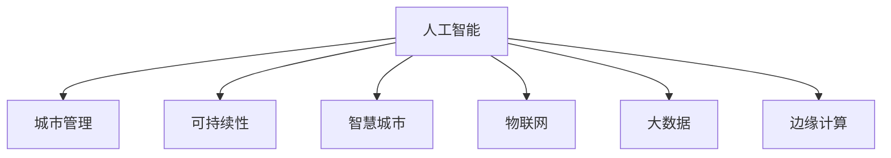

                 

# AI与人类计算：打造可持续发展的城市管理

> 关键词：
- 人工智能(AI)
- 城市管理(City Management)
- 可持续性(Sustainability)
- 智慧城市(Smart City)
- 物联网(IoT)
- 大数据(Big Data)
- 边缘计算(Edge Computing)

## 1. 背景介绍

### 1.1 问题由来

随着城市化进程的加快，人口密集、交通拥堵、资源紧缺、环境污染等城市问题日益严峻。如何通过科学化、智能化手段，实现城市的高效管理，提升居民生活质量，成为全球各城市面临的重要挑战。近年来，人工智能(AI)技术的迅猛发展，尤其是深度学习、大数据、物联网(IoT)、边缘计算(Edge Computing)等技术的成熟应用，为城市管理提供了新的思路和方法。通过AI与人类计算的结合，我们有机会打造一个更加智能、绿色、可持续发展的城市。

### 1.2 问题核心关键点

人工智能在城市管理中的应用主要体现在以下几个方面：

- 智能交通管理：通过实时监控、智能调度、预测分析等手段，优化交通流，减少拥堵，提高出行效率。
- 智能环境监控：利用传感器、摄像头等设备，实时监测空气质量、水质、噪音等环境指标，及时采取措施。
- 智能安防监控：采用人脸识别、行为分析等技术，提高公共安全，防范犯罪行为。
- 智能垃圾分类：通过图像识别、智能垃圾桶等技术，实现垃圾分类，提升城市环保水平。
- 智能能源管理：采用能源监测、智能电网等技术，优化能源配置，提高能源使用效率。
- 智能医疗健康：利用AI进行疾病预测、智能诊断、远程医疗等，提升医疗服务质量。

这些应用场景不仅提升了城市管理的智能化水平，也带来了巨大的经济效益和社会效益。但同时，AI与城市管理的结合也面临着数据隐私、模型鲁棒性、计算资源消耗等诸多挑战。本文将从核心概念、算法原理、具体操作步骤等方面，系统介绍AI与人类计算在城市管理中的应用。

## 2. 核心概念与联系

### 2.1 核心概念概述

为了更好地理解AI在城市管理中的应用，本节将介绍几个密切相关的核心概念：

- 人工智能(AI)：通过机器学习、深度学习等技术，使计算机系统具有类似于人类智能的感知、理解、学习、决策能力。
- 城市管理(City Management)：指城市政府或相关机构，通过科学化、智能化手段，对城市各项资源进行合理配置和有效管理。
- 可持续性(Sustainability)：指城市发展应兼顾经济、社会、环境等多方面的平衡，实现长期稳定发展。
- 智慧城市(Smart City)：通过物联网、大数据、AI等技术手段，将城市变得更加智能、绿色、高效、宜居。
- 物联网(IoT)：通过各种传感器、终端设备将物联在一起，实现设备间的互联互通，提升城市管理智能化水平。
- 大数据(Big Data)：指规模庞大、高速增长、多源异构的数据集合，为城市管理决策提供重要参考。
- 边缘计算(Edge Computing)：指将数据处理、存储等功能分散到网络边缘的本地设备上，降低延迟，提高效率。

这些核心概念之间的逻辑关系可以通过以下Mermaid流程图来展示：



这个流程图展示了大语言模型的核心概念及其之间的关系：

1. 人工智能通过各种智能技术，支持城市管理的智能化和自动化。
2. 城市管理是AI应用的集中体现，旨在通过智能化手段优化城市资源配置。
3. 可持续性是城市发展的核心目标，AI与人类计算结合可以更好地实现这一目标。
4. 智慧城市是大数据、物联网、AI等技术的综合应用，通过智能化手段提升城市生活水平。
5. 物联网提供了数据采集、传输、管理的支持，是AI在城市管理中不可或缺的基础设施。
6. 大数据提供了海量数据存储和分析能力，为城市管理决策提供数据支撑。
7. 边缘计算提供了计算资源的本地化处理，降低了延迟，提升了效率。

这些概念共同构成了AI与人类计算在城市管理中的应用框架，使得城市管理更加高效、智能、可持续。通过理解这些核心概念，我们可以更好地把握AI技术在城市管理中的工作原理和优化方向。

## 3. 核心算法原理 & 具体操作步骤

### 3.1 算法原理概述

AI在城市管理中的应用主要基于数据驱动的智能分析决策。通过物联网、大数据、边缘计算等技术，收集、存储、处理和分析城市运行中的海量数据，利用深度学习、机器学习等算法模型，对数据进行智能化分析和决策支持。

AI在城市管理中的应用可以分为以下几个步骤：

1. 数据采集：通过各种传感器、摄像头、终端设备等，收集城市运行中的各类数据。
2. 数据存储与管理：将收集到的数据存储在云端或边缘节点上，进行清洗、整合、标注等预处理。
3. 数据分析与建模：利用机器学习、深度学习等算法模型，对数据进行分析和建模，提取有价值的信息。
4. 决策支持：根据分析结果，制定相应的管理策略和决策方案，优化城市资源的配置。
5. 效果评估：通过实际运行效果评估模型的性能，不断优化算法和参数，提升模型效果。

### 3.2 算法步骤详解

以智能交通管理为例，下面是AI在城市交通管理中的应用步骤：

**Step 1: 数据采集**

智能交通管理需要收集各类交通数据，包括车辆位置、速度、流量、交通信号灯状态等。通过摄像头、雷达、RFID、GPS等设备，实时采集这些数据，并将其存储在云端或边缘节点上。

**Step 2: 数据存储与管理**

将采集到的交通数据进行清洗、整合、标注等预处理。使用分布式存储技术，如Hadoop、HDFS等，将数据分散存储在多个节点上，确保数据的完整性和可靠性。

**Step 3: 数据分析与建模**

利用深度学习模型，如循环神经网络(RNN)、卷积神经网络(CNN)等，对交通数据进行分析，预测交通流量、拥堵情况等。使用强化学习算法，优化交通信号灯控制策略，提高交通效率。

**Step 4: 决策支持**

根据分析结果，制定交通管理策略，如调整交通信号灯时长、限行措施等。通过智能调度算法，优化交通流，减少拥堵，提高出行效率。

**Step 5: 效果评估**

通过实际运行效果评估模型的性能，如车辆通行时间、交通流量等指标。根据评估结果，不断优化算法和参数，提升模型效果。

### 3.3 算法优缺点

AI在城市管理中的应用具有以下优点：

- 高效准确：AI算法能够快速处理海量数据，提取有价值的信息，提升城市管理效率。
- 实时响应：通过边缘计算，将数据处理和决策在本地完成，降低延迟，提高响应速度。
- 动态优化：AI算法能够实时调整策略，适应数据变化，提升城市管理效果。

但同时，AI在城市管理中也存在一些局限性：

- 数据隐私：城市管理涉及大量敏感数据，如何保护用户隐私，防止数据泄露，是亟待解决的问题。
- 模型鲁棒性：AI模型对数据质量、参数设定等高度敏感，如何提高模型的鲁棒性，减少误差，是另一个重要挑战。
- 计算资源：AI模型需要大量的计算资源，如何优化算法和资源配置，降低成本，也是实际应用中需要解决的问题。

尽管存在这些局限性，但AI与人类计算的结合，仍为城市管理带来了巨大的发展潜力。未来需要不断探索和优化AI算法，提升其在城市管理中的应用效果。

### 3.4 算法应用领域

AI在城市管理中的应用涵盖多个领域，包括但不限于以下几个方面：

- 智能交通：通过AI技术优化交通流，减少拥堵，提高出行效率。
- 智能安防：利用人脸识别、行为分析等技术，提高公共安全，防范犯罪行为。
- 智能环境：通过环境监测，实时监测空气质量、水质、噪音等环境指标，及时采取措施。
- 智能垃圾：通过垃圾分类、智能垃圾桶等技术，提升城市环保水平。
- 智能能源：利用能源监测、智能电网等技术，优化能源配置，提高能源使用效率。
- 智能医疗：通过AI进行疾病预测、智能诊断、远程医疗等，提升医疗服务质量。

除了这些典型应用，AI在城市管理中的应用场景还在不断扩展，未来将有更多新的应用出现。

## 4. 数学模型和公式 & 详细讲解 & 举例说明

### 4.1 数学模型构建

AI在城市管理中的应用涉及到各种数学模型，以下以智能交通管理为例，介绍常见的数学模型构建方法。

假设城市交通系统中车辆总数为 $N$，车辆位置、速度等状态可以用向量 $x \in \mathbb{R}^{N \times 2}$ 表示，其中 $x_i = (x_{i,1}, x_{i,2})$ 表示第 $i$ 辆车的当前位置和速度。交通系统中各车辆的相互作用关系可以用向量 $F \in \mathbb{R}^N$ 表示，其中 $F_i$ 表示影响第 $i$ 辆车运动的力。

智能交通管理的目标是找到最优的力 $F$，使得整个交通系统达到最优运行状态，即最小化交通流量波动、拥堵程度、环境污染等指标。具体来说，我们可以构建以下目标函数：

$$
\min_{F} \left\{ f_1(\mathbf{x}, F) + f_2(\mathbf{x}, F) + \ldots + f_k(\mathbf{x}, F) \right\}
$$

其中，$f_i(\mathbf{x}, F)$ 表示第 $i$ 个评价指标，如交通流量、拥堵程度、环境污染等。这些指标可以用各种数学模型来描述，如线性回归、逻辑回归、支持向量机等。

### 4.2 公式推导过程

以智能交通管理中的交通流量预测为例，可以构建如下的线性回归模型：

$$
y_i = \mathbf{w}^T \mathbf{x}_i + b
$$

其中，$y_i$ 表示第 $i$ 辆车的交通流量，$\mathbf{w}$ 表示模型的权重向量，$b$ 表示偏置项。模型的目标是最小化损失函数：

$$
\mathcal{L}(\mathbf{w}, b) = \frac{1}{2N} \sum_{i=1}^N (y_i - \mathbf{w}^T \mathbf{x}_i - b)^2
$$

根据梯度下降算法，更新模型的权重向量 $\mathbf{w}$ 和偏置项 $b$：

$$
\mathbf{w} \leftarrow \mathbf{w} - \eta \nabla_{\mathbf{w}}\mathcal{L}(\mathbf{w}, b) - \eta\lambda\mathbf{w}
$$
$$
b \leftarrow b - \eta \nabla_{b}\mathcal{L}(\mathbf{w}, b)
$$

其中，$\eta$ 表示学习率，$\lambda$ 表示正则化系数。

### 4.3 案例分析与讲解

以智能安防监控系统为例，该系统通过人脸识别、行为分析等技术，提高公共安全，防范犯罪行为。系统采集摄像头采集到的视频数据，通过深度学习模型提取人脸特征，进行人脸识别。利用行为分析算法，检测异常行为，并发出警报。

假设视频数据中的人脸图像可以用向量 $\mathbf{X} \in \mathbb{R}^{m \times n \times 3}$ 表示，其中 $m$ 表示视频帧数，$n$ 表示每个视频帧的像素数，$3$ 表示RGB三个通道。每个人脸图像可以表示为 $\mathbf{x}_i \in \mathbb{R}^{n \times 3}$。

人脸识别模型可以表示为：

$$
\mathbf{y} = \mathbf{W}\mathbf{x} + \mathbf{b}
$$

其中，$\mathbf{y}$ 表示人脸特征向量，$\mathbf{W}$ 表示权重矩阵，$\mathbf{b}$ 表示偏置向量。模型的目标是最小化损失函数：

$$
\mathcal{L}(\mathbf{W}, \mathbf{b}) = \frac{1}{2N} \sum_{i=1}^N ||\mathbf{y}_i - \mathbf{W}\mathbf{x}_i - \mathbf{b}||^2
$$

利用梯度下降算法，更新模型的权重矩阵 $\mathbf{W}$ 和偏置向量 $\mathbf{b}$。

## 5. 项目实践：代码实例和详细解释说明

### 5.1 开发环境搭建

在进行AI与人类计算在城市管理中的应用开发时，需要先搭建好开发环境。以下是使用Python进行TensorFlow开发的环境配置流程：

1. 安装Anaconda：从官网下载并安装Anaconda，用于创建独立的Python环境。

2. 创建并激活虚拟环境：
```bash
conda create -n tf-env python=3.8 
conda activate tf-env
```

3. 安装TensorFlow：根据CUDA版本，从官网获取对应的安装命令。例如：
```bash
conda install tensorflow -c tf -c conda-forge
```

4. 安装各类工具包：
```bash
pip install numpy pandas scikit-learn matplotlib tqdm jupyter notebook ipython
```

完成上述步骤后，即可在`tf-env`环境中开始项目实践。

### 5.2 源代码详细实现

下面我们以智能交通管理为例，给出使用TensorFlow进行AI模型的PyTorch代码实现。

首先，定义智能交通管理的数据处理函数：

```python
import tensorflow as tf
import numpy as np

def read_traffic_data():
    # 读取交通数据文件
    # 返回交通数据和评价指标
    pass
```

然后，定义模型的超参数和模型结构：

```python
# 定义超参数
learning_rate = 0.001
regularization_strength = 0.001
batch_size = 128

# 定义模型结构
def build_model(input_size, output_size):
    model = tf.keras.Sequential([
        tf.keras.layers.Dense(64, activation='relu', input_shape=(input_size,)),
        tf.keras.layers.Dropout(0.5),
        tf.keras.layers.Dense(64, activation='relu'),
        tf.keras.layers.Dropout(0.5),
        tf.keras.layers.Dense(output_size, activation='sigmoid')
    ])
    return model
```

接着，定义模型的训练和评估函数：

```python
# 定义训练函数
def train_model(model, data, epochs):
    # 将数据集分割为训练集和验证集
    train_data, validation_data = train_test_split(data, test_size=0.2)

    # 定义优化器和损失函数
    optimizer = tf.keras.optimizers.Adam(learning_rate=learning_rate)
    loss_fn = tf.keras.losses.BinaryCrossentropy()

    # 定义评估指标
    evaluation_metrics = [tf.keras.metrics.AUC(name='auc'), tf.keras.metrics.Mean(name='mse')]

    # 模型训练
    for epoch in range(epochs):
        model.compile(optimizer=optimizer, loss=loss_fn, metrics=evaluation_metrics)
        model.fit(train_data, epochs=1, batch_size=batch_size, validation_data=validation_data)

        # 模型评估
        validation_loss, validation_auc, validation_mse = model.evaluate(validation_data)
        print('Epoch {}: Validation Loss: {}, Validation AUC: {}, Validation MSE: {}'.format(epoch+1, validation_loss, validation_auc, validation_mse))

# 定义评估函数
def evaluate_model(model, data):
    # 模型评估
    evaluation_loss, evaluation_auc, evaluation_mse = model.evaluate(data)
    print('Evaluation Loss: {}, Evaluation AUC: {}, Evaluation MSE: {}'.format(evaluation_loss, evaluation_auc, evaluation_mse))
```

最后，启动模型训练和评估：

```python
# 读取交通数据
data = read_traffic_data()

# 构建模型
model = build_model(input_size, output_size)

# 训练模型
train_model(model, data, epochs)

# 评估模型
evaluate_model(model, data)
```

以上就是使用TensorFlow进行智能交通管理应用开发的完整代码实现。可以看到，通过TensorFlow的强大封装，我们能够快速实现模型的训练和评估。

### 5.3 代码解读与分析

让我们再详细解读一下关键代码的实现细节：

**read_traffic_data函数**：
- 定义函数，读取交通数据文件，并返回交通数据和评价指标。

**build_model函数**：
- 定义模型的超参数和模型结构。
- 使用TensorFlow的Sequential模型构建神经网络，包括两个全连接层和Dropout层，输出层为sigmoid函数。

**train_model函数**：
- 将数据集分割为训练集和验证集。
- 定义优化器和损失函数，使用Adam算法和二分类交叉熵。
- 定义评估指标，使用AUC和MSE。
- 模型训练和评估。

**evaluate_model函数**：
- 使用evaluate方法评估模型，输出评价指标。

可以看出，TensorFlow提供了丰富的API，使得模型开发和训练变得更加便捷。开发者可以将更多精力放在数据处理、模型设计等核心逻辑上，而不必过多关注底层实现细节。

## 6. 实际应用场景

### 6.1 智能交通管理

AI在智能交通管理中的应用主要体现在以下几个方面：

- 交通流量预测：利用机器学习模型，预测未来的交通流量，优化交通信号灯控制策略，减少拥堵。
- 交通信号优化：通过AI算法，实时调整交通信号灯时长，提高交通效率。
- 事故预测：利用深度学习模型，分析交通事故数据，预测可能发生事故的区域和时间，提前采取预防措施。
- 停车管理：通过智能停车系统，实时监测停车情况，优化停车资源的分配和利用。

以交通流量预测为例，可以使用RNN模型，对交通流量数据进行时间序列分析，预测未来的交通流量。模型的训练和评估过程可以参考第4章的代码实现。

### 6.2 智能安防监控

智能安防监控系统通过人脸识别、行为分析等技术，提高公共安全，防范犯罪行为。

系统采集摄像头采集到的视频数据，通过深度学习模型提取人脸特征，进行人脸识别。利用行为分析算法，检测异常行为，并发出警报。

具体实现可以参考智能交通管理的代码示例，通过搭建神经网络模型，利用训练数据进行模型训练和评估。

### 6.3 智能垃圾分类

智能垃圾分类系统通过图像识别、智能垃圾桶等技术，提升城市环保水平。

系统采集垃圾桶内的垃圾图像，通过深度学习模型识别垃圾种类，自动分拣到相应的垃圾桶内。智能垃圾桶可以根据垃圾种类和数量，自动调整投放策略，优化垃圾收集。

具体实现可以参考智能交通管理的代码示例，通过搭建神经网络模型，利用训练数据进行模型训练和评估。

### 6.4 未来应用展望

随着AI与人类计算的不断演进，AI在城市管理中的应用将更加广泛和深入。未来可能出现的新应用场景包括：

- 智能公共服务：通过AI技术，优化公共服务资源配置，提高服务效率。如智能图书馆、智能医院等。
- 智能城市规划：利用AI技术，进行城市规划和建设，提升城市宜居性。如智能建筑设计、智能市政设施等。
- 智能环境治理：通过AI技术，实时监测环境污染，制定科学合理的环保政策。如智能水质监测、智能垃圾分类等。
- 智能金融服务：利用AI技术，提供智能化的金融服务，提升金融行业服务水平。如智能投顾、智能风控等。
- 智能能源管理：通过AI技术，优化能源配置，提高能源使用效率。如智能电网、智能电网调度等。

未来，AI与人类计算的结合将更加紧密，通过智能化手段，提升城市管理的效率和水平，为建设可持续发展的智慧城市提供有力支持。

## 7. 工具和资源推荐
### 7.1 学习资源推荐

为了帮助开发者系统掌握AI在城市管理中的应用，这里推荐一些优质的学习资源：

1. TensorFlow官方文档：TensorFlow提供了详尽的API文档和教程，帮助开发者快速上手。
2. PyTorch官方文档：PyTorch提供了丰富的深度学习API和模型，适合进行AI模型开发。
3. Keras官方文档：Keras提供了简单易用的API，适合快速原型开发。
4. Scikit-Learn官方文档：Scikit-Learn提供了常用的机器学习算法和工具，适合进行数据分析和建模。
5. Coursera机器学习课程：由斯坦福大学Andrew Ng教授主讲，涵盖机器学习基础和深度学习等内容。
6. edX深度学习课程：由MIT教授主讲，涵盖深度学习基础和应用等内容。

通过对这些资源的学习实践，相信你一定能够快速掌握AI在城市管理中的应用方法，并用于解决实际的AI问题。

### 7.2 开发工具推荐

高效的开发离不开优秀的工具支持。以下是几款用于AI在城市管理中的应用开发的常用工具：

1. Jupyter Notebook：用于交互式编程和数据处理，支持Python、R等多种编程语言。
2. Anaconda：用于创建独立的Python环境，方便跨项目管理依赖。
3. TensorFlow：基于Python的开源深度学习框架，支持分布式计算和GPU加速。
4. PyTorch：基于Python的开源深度学习框架，支持动态计算图和GPU加速。
5. Scikit-Learn：Python的机器学习库，包含各种经典机器学习算法和工具。
6. Pandas：Python的数据处理库，适合进行数据清洗、整合、分析等操作。

合理利用这些工具，可以显著提升AI在城市管理中的应用开发效率，加快创新迭代的步伐。

### 7.3 相关论文推荐

AI在城市管理中的应用涉及多学科的交叉研究，以下是几篇奠基性的相关论文，推荐阅读：

1. Deep Learning in Action: An Introduction to Deep Learning and Reinforcement Learning with Python by CS224n（斯坦福大学）。
2. Deep Learning for Good: AI, Ethics and the Future of the Human Race by Yann LeCun、Yoshua Bengio、Geoffrey Hinton。
3. Reinforcement Learning for Robotics: State-of-the-Art for Task Acquisition by Angelika Herzig、Mateusz Wojtczuk。
4. Intelligent Cities: From Concept to Practice by Valentin C. Eriksson、Heikki A. Pajunen。
5. Smart Cities: A Comprehensive Survey by Mario A. Arranz、Francisco José de Merino、Marc Torres Viesca。

这些论文代表了大语言模型微调技术的发展脉络。通过学习这些前沿成果，可以帮助研究者把握学科前进方向，激发更多的创新灵感。

## 8. 总结：未来发展趋势与挑战

### 8.1 总结

本文对AI与人类计算在城市管理中的应用进行了全面系统的介绍。首先阐述了AI技术在城市管理中的应用背景和意义，明确了AI技术在提升城市管理智能化水平、优化城市资源配置方面的独特价值。其次，从原理到实践，详细讲解了AI在城市管理中的数学模型构建、算法步骤、模型评估等核心内容，给出了实际应用的代码示例。同时，本文还探讨了AI在城市管理中的应用场景，展示了AI技术在智能交通、智能安防、智能垃圾分类等多个领域的应用潜力。此外，本文精选了AI应用的各类学习资源，力求为读者提供全方位的技术指引。

通过本文的系统梳理，可以看到，AI与人类计算在城市管理中的应用前景广阔，正在为智慧城市建设注入新的活力。未来，伴随AI技术的不断发展，AI与人类计算的结合将更加紧密，推动城市管理向更加智能化、高效化、绿色化方向发展。

### 8.2 未来发展趋势

展望未来，AI与人类计算在城市管理中的应用将呈现以下几个发展趋势：

1. 数据驱动的智能化决策：AI系统将基于大数据和物联网技术，实时监测和分析城市运行数据，提供智能化决策支持。
2. 自动化的智能化管理：AI系统将自动进行交通管理、环境监测、安防监控等管理任务，提高城市管理效率。
3. 多模态智能融合：AI系统将融合语音、图像、视频等多种数据，提供更加全面、准确的城市运行信息。
4. 自主学习的智能优化：AI系统将具备自主学习能力，能够根据数据变化动态调整策略，提升城市管理效果。
5. 人机协同的智能化服务：AI系统将与人类进行协同，提供更加智能化的城市服务，提升用户体验。

这些趋势展示了AI在城市管理中的巨大潜力，未来AI与人类计算的结合将带来更加智能化、高效化、绿色化的城市管理方式。

### 8.3 面临的挑战

尽管AI在城市管理中的应用前景广阔，但在实际部署和应用中也面临诸多挑战：

1. 数据隐私：城市管理涉及大量敏感数据，如何保护用户隐私，防止数据泄露，是亟待解决的问题。
2. 模型鲁棒性：AI模型对数据质量、参数设定等高度敏感，如何提高模型的鲁棒性，减少误差，是另一个重要挑战。
3. 计算资源：AI模型需要大量的计算资源，如何优化算法和资源配置，降低成本，也是实际应用中需要解决的问题。
4. 系统安全性：AI系统需要具备高度的安全性，防止恶意攻击和数据篡改，确保系统稳定运行。
5. 伦理道德：AI系统需要符合伦理道德标准，防止歧视、偏见等问题的出现。

尽管存在这些挑战，但随着技术的不断进步和应用的不断深入，AI与人类计算在城市管理中的应用前景仍然广阔。未来需要不断探索和优化AI算法，提升其在城市管理中的应用效果。

### 8.4 研究展望

面向未来，AI与人类计算在城市管理中的应用需要在以下几个方面寻求新的突破：

1. 数据隐私保护：开发数据加密、隐私保护等技术，保障数据安全。
2. 模型鲁棒性提升：研发更加鲁棒的模型算法，提高模型泛化能力和抗干扰能力。
3. 计算资源优化：采用分布式计算、边缘计算等技术，降低计算资源消耗，提高系统效率。
4. 系统安全性增强：开发安全检测和防御技术，防止系统攻击和数据篡改。
5. 伦理道德约束：引入伦理导向的评价指标，确保AI系统的公平性和透明性。
6. 多模态数据融合：融合语音、图像、视频等多种数据，提升系统感知和决策能力。
7. 自主学习能力提升：通过强化学习等技术，提高AI系统的自主学习能力和自我优化能力。

这些研究方向将为AI在城市管理中的应用提供新的动力，推动城市管理向更加智能化、高效化、绿色化方向发展。

## 9. 附录：常见问题与解答

**Q1：AI在城市管理中的应用是否适用于所有城市？**

A: AI在城市管理中的应用适用范围因城市规模、城市管理水平等因素而异。对于大城市或高度发达地区，AI技术可以发挥更大的作用，提升城市管理的智能化水平。但对于小城市或管理水平较低的地区，AI技术的投入和应用可能面临更大的挑战。

**Q2：AI在城市管理中的应用是否存在隐私风险？**

A: AI在城市管理中的应用涉及大量敏感数据，如交通流量、环境指标、个人行为等。如何在保障数据隐私的同时，充分利用AI技术进行智能化决策，是亟待解决的问题。需要采取数据加密、去标识化等措施，确保数据安全。

**Q3：AI在城市管理中的应用是否需要大量计算资源？**

A: AI在城市管理中的应用需要大量的计算资源，特别是在深度学习模型训练和推理过程中。需要采用分布式计算、边缘计算等技术，优化算法和资源配置，降低成本。

**Q4：AI在城市管理中的应用是否需要大量标注数据？**

A: AI在城市管理中的应用需要大量的标注数据进行模型训练。标注数据的获取和处理成本较高，需要从多渠道收集和整合数据，确保数据的质量和多样性。

**Q5：AI在城市管理中的应用是否容易受到环境变化的影响？**

A: AI在城市管理中的应用受到环境变化的影响较大。如交通流量、环境污染等指标会随着时间、季节、天气等因素发生变化。需要建立动态调整机制，根据环境变化实时调整策略。

---

作者：禅与计算机程序设计艺术 / Zen and the Art of Computer Programming

