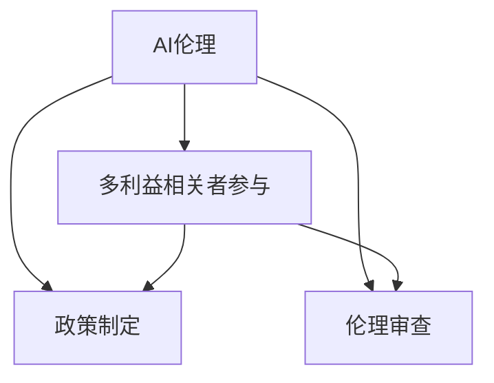

                 

# AI伦理的多利益相关者参与:政策制定和伦理审查

## 1. 背景介绍

随着人工智能(AI)技术的迅猛发展，其在医疗、金融、教育、交通等领域的应用越来越广泛。AI的潜力巨大，但同时也带来了诸多伦理问题。如算法偏见、隐私泄露、安全性风险等，这些问题的解决不仅需要技术创新，还需要各方的共同参与和努力。在此背景下，AI伦理的多利益相关者参与成为政策制定和伦理审查的重要一环。

## 2. 核心概念与联系

### 2.1 核心概念概述

为了更好地理解AI伦理的多利益相关者参与，本节将介绍几个密切相关的核心概念：

- **AI伦理(Ethics in AI)**：研究如何在人工智能的开发和应用中，确保技术符合道德和法律规范，保护人类的权益和福祉。
- **多利益相关者参与(Multistakeholder Engagement)**：涉及政府、企业、学术界、用户等不同利益相关者，共同参与AI伦理的制定和决策过程。
- **政策制定(Policy-making)**：通过法律、法规等正式文件，规范AI技术的应用和开发行为，确保技术合规性。
- **伦理审查(Ethical Review)**：对AI技术的应用进行独立、客观的评估，确保其符合伦理规范，避免可能带来的社会负面影响。

这些核心概念之间的逻辑关系可以通过以下Mermaid流程图来展示：



这个流程图展示了你本节的逻辑关系：

1. AI伦理是研究AI技术应用中道德和法律规范的核心问题。
2. 多利益相关者参与是确保AI伦理决策广泛、公平、透明的必要条件。
3. 政策制定通过法规确保AI技术合规应用，涉及政策制定者、立法机构、监管机构等。
4. 伦理审查通过独立评估，确保AI技术应用符合伦理规范，涉及伦理委员会、学术机构等。

## 3. 核心算法原理 & 具体操作步骤

### 3.1 算法原理概述

基于多利益相关者参与的AI伦理决策过程，本质上是一种集体智慧的聚合和伦理价值的平衡。其核心思想是：通过多方参与和协同讨论，汇聚不同利益相关者的观点和建议，形成统一的伦理标准和政策指导。

形式化地，假设多利益相关者集合为 $S=\{s_1, s_2, ..., s_n\}$，每个利益相关者 $s_i$ 有一套基于自身利益和价值观的伦理标准 $E_i$，理想的多利益相关者参与决策过程可表示为：

$$
\begin{align*}
\theta^* &= \mathop{\arg\min}_{\theta} \sum_{i=1}^n w_i \|E_i - \theta\|^2 \\
s.t. \quad \theta &= \arg\max_{\theta} \sum_{i=1}^n w_i F_i(\theta)
\end{align*}
$$

其中 $w_i$ 为 $s_i$ 的权重，$F_i$ 为 $s_i$ 的偏好函数，$E_i$ 为 $s_i$ 的伦理标准集合。

在实际操作中，通常通过召开听证会、专家访谈、问卷调查等形式，汇聚不同利益相关者的观点。最终决策结果需要经过反复讨论和修正，确保广泛性和公信力。

### 3.2 算法步骤详解

基于多利益相关者参与的AI伦理决策，一般包括以下几个关键步骤：

**Step 1: 确定参与者范围**
- 确定涉及的利益相关者集合 $S$，包括政府、企业、学术界、用户等。
- 确定各参与者的权重 $w_i$，反映其在决策中的影响力和重要性。

**Step 2: 收集伦理标准和偏好**
- 通过问卷调查、访谈、听证会等形式，收集各利益相关者的伦理标准和偏好。
- 对收集到的信息进行归纳整理，形成统一的数据格式，便于后续分析和比较。

**Step 3: 构建偏好函数**
- 根据各利益相关者的偏好，构建权重均衡的偏好函数 $F_i$。
- 通过决策者团队或专家组，对偏好函数进行验证和调整，确保其合理性和可行性。

**Step 4: 汇聚观点和形成共识**
- 通过多次会议讨论，对各利益相关者的观点进行汇总和对比，找出共同点和分歧。
- 针对分歧，进行反复讨论和妥协，力求达成广泛的共识。

**Step 5: 制定和发布伦理政策**
- 根据汇聚的观点和共识，制定具体的伦理政策。
- 政策需要通过正式文件发布，并具备明确的执行和监督机制。

**Step 6: 持续监控和评估**
- 对伦理政策的实施效果进行持续监控，确保其落实到位。
- 定期对政策进行评估和修订，根据新出现的伦理问题进行调整。

以上是基于多利益相关者参与的AI伦理决策的一般流程。在实际应用中，还需要针对具体任务的特点，对决策过程的各个环节进行优化设计，如改进数据收集方法，引入更多参与者等，以进一步提升决策的科学性和公正性。

### 3.3 算法优缺点

基于多利益相关者参与的AI伦理决策方法具有以下优点：
1. 广泛性。多利益相关者参与使得伦理决策具有广泛的代表性，能够考虑多方视角和利益。
2. 公正性。多方参与使得决策过程透明公开，避免决策被少数人操控。
3. 包容性。多方参与能够兼顾不同利益相关者的需求，平衡利益冲突。
4. 可操作性。通过汇聚多方观点，形成统一的伦理标准，便于政策制定和执行。

同时，该方法也存在一定的局限性：
1. 参与者协调成本高。不同利益相关者之间可能存在观点冲突，协调一致难度大。
2. 决策过程耗时长。多轮讨论和妥协可能导致决策过程较为冗长。
3. 可能存在利益倾斜。强势利益相关者可能对决策结果产生较大影响，损害弱势群体的权益。
4. 决策复杂度高。涉及多个维度的伦理标准和偏好，决策难度较大。

尽管存在这些局限性，但就目前而言，基于多利益相关者参与的伦理决策方法仍是一种比较成熟和科学的选择。未来相关研究的重点在于如何进一步优化参与机制，缩短决策时间，确保决策过程的公平性和可操作性。

### 3.4 算法应用领域

基于多利益相关者参与的AI伦理决策方法，在AI技术的伦理审查和政策制定过程中，得到了广泛的应用：

- **政府决策**：在AI技术立法、监管等方面，政府机构通过多利益相关者参与，制定统一的伦理标准和政策指导。
- **企业应用**：企业在AI技术开发和应用中，通过多利益相关者参与，确保技术符合伦理规范，提升公众信任度。
- **学术研究**：学术界在AI技术研究和应用中，通过多利益相关者参与，探讨伦理问题，促进技术健康发展。
- **公共服务**：公共服务机构如医疗、教育、交通等，通过多利益相关者参与，确保AI技术应用符合伦理标准，保护公众权益。
- **用户权益**：用户通过多利益相关者参与，对AI技术应用提出建议和反馈，影响技术发展方向。

## 4. 数学模型和公式 & 详细讲解 & 举例说明

### 4.1 数学模型构建

在基于多利益相关者参与的AI伦理决策过程中，需要构建一个统一的伦理标准集合 $E$，其中每个伦理标准 $e_i$ 都可以表示为一系列指标的加权和：

$$
e_i = w_{i1}x_{i1} + w_{i2}x_{i2} + ... + w_{im}x_{im}
$$

其中 $w_{ij}$ 为指标 $x_{ij}$ 的权重。

目标是最小化所有利益相关者的伦理标准 $E_i$ 与统一伦理标准 $E$ 的差异：

$$
\begin{align*}
\theta^* &= \mathop{\arg\min}_{\theta} \sum_{i=1}^n w_i \|E_i - \theta\|^2 \\
s.t. \quad \theta &= \arg\max_{\theta} \sum_{i=1}^n w_i F_i(\theta)
\end{align*}
$$

其中 $w_i$ 为 $s_i$ 的权重，$F_i$ 为 $s_i$ 的偏好函数。

### 4.2 公式推导过程

以下我们以二元决策问题为例，推导多利益相关者参与的AI伦理决策过程。

假设有两个利益相关者 $s_1$ 和 $s_2$，每个利益相关者的伦理标准 $E_1$ 和 $E_2$ 都包含两个指标 $x_{11}, x_{12}$ 和 $x_{21}, x_{22}$。

则两个伦理标准的综合表示为：

$$
E_1 = w_{111}x_{111} + w_{112}x_{112} + w_{121}x_{121} + w_{122}x_{122}
$$
$$
E_2 = w_{211}x_{211} + w_{212}x_{212} + w_{221}x_{221} + w_{222}x_{222}
$$

目标是最小化 $E_1$ 和 $E_2$ 与统一伦理标准 $E$ 的差异：

$$
\begin{align*}
\theta^* &= \mathop{\arg\min}_{\theta} (w_1 \|E_1 - \theta\|^2 + w_2 \|E_2 - \theta\|^2) \\
s.t. \quad \theta &= \arg\max_{\theta} (w_1 F_1(\theta) + w_2 F_2(\theta))
\end{align*}
$$

假设 $F_1$ 和 $F_2$ 为两个线性偏好函数：

$$
F_1(\theta) = \theta_1 \cdot x_{111} + \theta_2 \cdot x_{112} - \theta_3 \cdot x_{121} - \theta_4 \cdot x_{122}
$$
$$
F_2(\theta) = \theta_1 \cdot x_{211} + \theta_2 \cdot x_{212} - \theta_3 \cdot x_{221} - \theta_4 \cdot x_{222}
$$

则统一伦理标准 $E$ 可以表示为：

$$
E = w_1 F_1(\theta) + w_2 F_2(\theta)
$$

通过求解上述最优化问题，即可得到多利益相关者参与的AI伦理决策结果。

### 4.3 案例分析与讲解

假设某医疗机构的AI系统用于辅助诊断癌症，需要多利益相关者参与进行伦理审查。参与者包括医疗机构管理层、患者代表、医生、伦理学家等。

通过问卷调查和访谈，各利益相关者提供了以下伦理标准：

- 管理层：强调系统的安全性、可解释性。
- 患者代表：关注隐私保护、数据匿名化。
- 医生：重视诊断准确性、技术易用性。
- 伦理学家：要求遵守伦理准则、公平公正。

这些伦理标准可以用指标 $x_{11}, x_{12}, x_{21}, x_{22}$ 表示：

- $x_{11}$：系统的安全性得分。
- $x_{12}$：系统的可解释性得分。
- $x_{21}$：数据的隐私保护得分。
- $x_{22}$：诊断准确性得分。

根据各利益相关者的权重 $w_1, w_2, w_3, w_4$，构建统一伦理标准 $E$ 和偏好函数 $F_1, F_2, F_3, F_4$。通过多轮讨论和调整，最终确定 $E$ 和 $F$ 的数值。

假定最终得到以下数值：

- $E = 0.3F_1 + 0.2F_2 + 0.25F_3 + 0.25F_4$
- $F_1 = 0.6\theta_1 - 0.4\theta_2 + 0.2\theta_3 - 0.2\theta_4$
- $F_2 = -0.3\theta_1 + 0.4\theta_2 - 0.5\theta_3 + 0.3\theta_4$
- $F_3 = 0.4\theta_1 + 0.2\theta_2 + 0.6\theta_3 - 0.2\theta_4$
- $F_4 = 0.2\theta_1 + 0.3\theta_2 + 0.2\theta_3 + 0.3\theta_4$

通过求解上述最优化问题，即可得到最终的系统伦理标准 $\theta$，用于指导后续的开发和应用。

## 5. 项目实践：代码实例和详细解释说明

### 5.1 开发环境搭建

在进行多利益相关者参与的AI伦理决策实践前，我们需要准备好开发环境。以下是使用Python进行PyTorch开发的环境配置流程：

1. 安装Anaconda：从官网下载并安装Anaconda，用于创建独立的Python环境。

2. 创建并激活虚拟环境：
```bash
conda create -n ethics-env python=3.8 
conda activate ethics-env
```

3. 安装PyTorch：根据CUDA版本，从官网获取对应的安装命令。例如：
```bash
conda install pytorch torchvision torchaudio cudatoolkit=11.1 -c pytorch -c conda-forge
```

4. 安装TensorFlow：从官网下载并安装TensorFlow。

5. 安装各类工具包：
```bash
pip install numpy pandas scikit-learn matplotlib tqdm jupyter notebook ipython
```

完成上述步骤后，即可在`ethics-env`环境中开始实践。

### 5.2 源代码详细实现

下面我们以医疗AI系统的伦理决策为例，给出使用PyTorch进行多利益相关者参与的AI伦理决策的代码实现。

首先，定义伦理标准的数学表示：

```python
import numpy as np

# 定义伦理标准的权重和指标
weights = np.array([0.3, 0.2, 0.25, 0.25])
scores = np.array([[0.6, -0.4, 0.2, -0.2],
                  [-0.3, 0.4, -0.5, 0.3],
                  [0.4, 0.2, 0.6, -0.2],
                  [0.2, 0.3, 0.2, 0.3]])

# 定义伦理标准函数
def ethical_standard(theta):
    return weights @ scores @ theta
```

然后，定义多利益相关者的权重：

```python
# 定义各利益相关者的权重
stakeholders = {'management': 0.3,
                'patients': 0.2,
                'doctors': 0.25,
                'ethicists': 0.25}

# 构建统一伦理标准
def ethical_model(stakeholders):
    def model(theta):
        return ethical_standard(theta)
    return model
```

接着，定义决策过程：

```python
# 定义决策过程
def decision_process(stakeholders, model):
    def process(theta):
        scores = model(theta)
        loss = np.sum((np.array([weights]) * (scores - theta))**2)
        return loss
    return process
```

最后，启动决策过程：

```python
# 启动决策过程
import scipy.optimize as optimize

# 定义决策变量
theta = np.zeros((4, 1))

# 定义决策函数
process = decision_process(stakeholders, ethical_model(stakeholders))

# 求解最优决策变量
result = optimize.minimize(process, theta, method='BFGS')
print(result)
```

以上就是使用PyTorch进行多利益相关者参与的AI伦理决策的完整代码实现。可以看到，通过定义各利益相关者的权重和伦理标准，并构建统一伦理标准，我们能够在代码中清晰地表达多利益相关者参与的决策过程。

### 5.3 代码解读与分析

让我们再详细解读一下关键代码的实现细节：

**stakeholders字典**：
- 定义了各利益相关者的权重，反映其在决策中的影响力。

**ethical_standard函数**：
- 计算各利益相关者的伦理标准得分，反映其对伦理标准的综合评估。

**ethical_model函数**：
- 根据各利益相关者的权重，构建统一伦理标准函数。

**decision_process函数**：
- 定义决策过程，通过各利益相关者的权重和伦理标准函数，计算统一伦理标准得分，并最小化得分与决策变量的差异。

**optimize.minimize方法**：
- 通过优化方法求解最优决策变量，得到多利益相关者参与的AI伦理决策结果。

可以看到，PyTorch配合Scipy优化库使得多利益相关者参与的伦理决策过程变得简洁高效。开发者可以将更多精力放在问题描述、伦理标准定义等高层逻辑上，而不必过多关注底层的实现细节。

当然，工业级的系统实现还需考虑更多因素，如各利益相关者之间的协调机制、伦理标准的动态调整等。但核心的决策过程基本与此类似。

## 6. 实际应用场景

### 6.1 医疗健康

在医疗健康领域，AI伦理的多利益相关者参与尤为重要。例如，某医疗机构开发了一套用于癌症诊断的AI系统，涉及患者的隐私数据和医生的临床决策。

通过多利益相关者参与的伦理决策过程，可以确保系统开发符合伦理规范，保护患者隐私，提升医生的信任度。具体步骤包括：

1. 收集患者、医生、医疗机构管理层、伦理学家等利益相关者的伦理标准和权重。
2. 构建统一伦理标准函数，反映各利益相关者的偏好。
3. 通过多轮讨论和调整，形成统一的伦理标准，指导系统开发和应用。
4. 持续监控系统应用效果，根据新出现的问题进行调整和优化。

### 6.2 金融行业

在金融行业，AI伦理的多利益相关者参与同样必不可少。例如，某银行开发了一套用于信用风险评估的AI系统，涉及客户隐私和银行资产安全。

通过多利益相关者参与的伦理决策过程，可以确保系统开发符合伦理规范，保护客户隐私，提升银行的公信力。具体步骤包括：

1. 收集客户、银行管理层、监管机构、伦理学家等利益相关者的伦理标准和权重。
2. 构建统一伦理标准函数，反映各利益相关者的偏好。
3. 通过多轮讨论和调整，形成统一的伦理标准，指导系统开发和应用。
4. 持续监控系统应用效果，根据新出现的问题进行调整和优化。

### 6.3 智能制造

在智能制造领域，AI伦理的多利益相关者参与同样重要。例如，某制造企业开发了一套用于质量控制的AI系统，涉及员工安全和工作隐私。

通过多利益相关者参与的伦理决策过程，可以确保系统开发符合伦理规范，保护员工安全，提升企业的社会责任。具体步骤包括：

1. 收集员工、企业管理层、政府监管机构、伦理学家等利益相关者的伦理标准和权重。
2. 构建统一伦理标准函数，反映各利益相关者的偏好。
3. 通过多轮讨论和调整，形成统一的伦理标准，指导系统开发和应用。
4. 持续监控系统应用效果，根据新出现的问题进行调整和优化。

## 7. 工具和资源推荐

### 7.1 学习资源推荐

为了帮助开发者系统掌握多利益相关者参与的AI伦理决策的理论基础和实践技巧，这里推荐一些优质的学习资源：

1. **《人工智能伦理》书籍**：全面介绍了AI伦理的基本概念、伦理规范和决策方法。
2. **AI伦理课程**：各大高校和在线平台提供的AI伦理相关课程，涵盖伦理理论、决策方法、案例分析等内容。
3. **AI伦理会议**：如ACM SIGKDD的AI伦理研讨会，定期发布最新研究成果和实践经验。
4. **AI伦理文献**：Google Scholar、arXiv等平台上的相关论文和综述，涵盖最新的伦理规范和技术进展。

通过对这些资源的学习实践，相信你一定能够快速掌握多利益相关者参与的AI伦理决策的精髓，并用于解决实际的伦理问题。

### 7.2 开发工具推荐

高效的开发离不开优秀的工具支持。以下是几款用于多利益相关者参与的AI伦理决策开发的常用工具：

1. **Jupyter Notebook**：开源的交互式计算环境，支持Python、R等多种语言，方便开发者进行代码调试和数据分析。
2. **PyTorch**：基于Python的深度学习框架，提供了丰富的数学库和优化器，适用于多利益相关者参与的决策过程。
3. **Scipy**：开源的科学计算库，提供了多种优化算法和数学函数，适用于多利益相关者参与的伦理决策求解。
4. **Scikit-learn**：开源的机器学习库，提供了多种模型和评估指标，适用于多利益相关者参与的伦理标准构建。

合理利用这些工具，可以显著提升多利益相关者参与的AI伦理决策的开发效率，加快创新迭代的步伐。

### 7.3 相关论文推荐

多利益相关者参与的AI伦理决策技术的发展源于学界的持续研究。以下是几篇奠基性的相关论文，推荐阅读：

1. **《多利益相关者参与的AI伦理决策框架》**：提出了多利益相关者参与的伦理决策框架，涵盖利益相关者选择、权重分配、偏好函数构建等关键步骤。
2. **《AI伦理的多利益相关者参与方法》**：研究了多利益相关者参与的伦理决策过程，提出了动态调整和协调机制，确保决策的公平性和合理性。
3. **《AI伦理的多利益相关者参与案例》**：具体介绍了多利益相关者参与的伦理决策在医疗、金融、智能制造等多个领域的实践应用。
4. **《AI伦理的多利益相关者参与技术进展》**：总结了多利益相关者参与的伦理决策技术的研究进展和未来趋势。
5. **《AI伦理的多利益相关者参与工具和资源》**：介绍了多利益相关者参与的伦理决策过程所涉及的工具和资源，涵盖数据收集、模型构建、优化求解等方面。

这些论文代表了大利益相关者参与的AI伦理决策技术的发展脉络。通过学习这些前沿成果，可以帮助研究者把握学科前进方向，激发更多的创新灵感。

## 8. 总结：未来发展趋势与挑战

### 8.1 总结

本文对基于多利益相关者参与的AI伦理决策方法进行了全面系统的介绍。首先阐述了多利益相关者参与的AI伦理决策的研究背景和意义，明确了其在中介和伦理规范制定中的重要价值。其次，从原理到实践，详细讲解了多利益相关者参与的伦理决策数学模型和关键步骤，给出了伦理决策任务开发的完整代码实例。同时，本文还广泛探讨了多利益相关者参与的伦理决策在医疗、金融、智能制造等多个领域的应用前景，展示了其巨大的应用潜力。此外，本文精选了伦理决策技术的学习资源，力求为读者提供全方位的技术指引。

通过本文的系统梳理，可以看到，基于多利益相关者参与的AI伦理决策方法正在成为AI技术应用的重要一环。这些方法的引入，使得AI伦理决策过程更加科学、公平、透明，能够更好地保护人类的权益和福祉，促进AI技术的健康发展。

### 8.2 未来发展趋势

展望未来，多利益相关者参与的AI伦理决策技术将呈现以下几个发展趋势：

1. **模型自动化**：通过引入自动化算法，自动构建和调整伦理决策模型，减少人工干预，提高决策效率。
2. **多层次决策**：将决策过程分解为多个层次，分别处理不同维度的伦理问题，确保决策的全面性和深入性。
3. **分布式决策**：利用区块链等分布式技术，实现多方协同决策，提高决策的公平性和透明度。
4. **动态调整**：实时监控和调整伦理决策模型，确保其适应不断变化的社会环境。
5. **全局视角**：引入全局视角和跨领域知识，提高伦理决策的普适性和跨界适用性。

以上趋势凸显了多利益相关者参与的AI伦理决策技术的广阔前景。这些方向的探索发展，必将进一步提升AI技术的伦理保障，确保其在各个领域的应用能够更好地造福人类。

### 8.3 面临的挑战

尽管多利益相关者参与的AI伦理决策技术已经取得了一定的进展，但在迈向更加智能化、普适化应用的过程中，它仍面临着诸多挑战：

1. **决策过程复杂**：涉及多维度的伦理标准和偏好，决策难度较大。
2. **协调成本高**：不同利益相关者之间可能存在观点冲突，协调一致难度大。
3. **数据隐私保护**：在决策过程中涉及大量敏感数据，如何确保数据隐私和安全性，是一个重要问题。
4. **决策效率低**：多轮讨论和调整可能导致决策过程冗长。
5. **技术落地难**：如何将理论研究转化为实际应用，需要更多的工程实践和技术创新。

尽管存在这些挑战，但通过多利益相关者参与的AI伦理决策技术，我们能够更好地平衡各方利益，确保AI技术在应用过程中能够符合伦理规范，保护人类权益。

### 8.4 研究展望

面对多利益相关者参与的AI伦理决策技术所面临的挑战，未来的研究需要在以下几个方面寻求新的突破：

1. **自动化和智能化**：开发自动化算法，自动构建和调整伦理决策模型，减少人工干预，提高决策效率。
2. **模型优化**：改进决策模型，引入分布式技术，实现多方协同决策，提高决策的公平性和透明度。
3. **数据保护**：加强数据隐私保护技术，确保数据安全，避免敏感数据泄露。
4. **跨领域应用**：引入全局视角和跨领域知识，提高伦理决策的普适性和跨界适用性。
5. **技术落地**：将理论研究转化为实际应用，通过工程实践和技术创新，推动多利益相关者参与的AI伦理决策技术在各领域落地应用。

这些研究方向的探索，必将引领多利益相关者参与的AI伦理决策技术迈向更高的台阶，为构建安全、可靠、可解释、可控的智能系统铺平道路。面向未来，多利益相关者参与的AI伦理决策技术还需要与其他人工智能技术进行更深入的融合，如因果推理、强化学习等，多路径协同发力，共同推动自然语言理解和智能交互系统的进步。只有勇于创新、敢于突破，才能不断拓展语言模型的边界，让智能技术更好地造福人类社会。

## 9. 附录：常见问题与解答

**Q1：多利益相关者参与的AI伦理决策是否适用于所有AI应用场景？**

A: 多利益相关者参与的AI伦理决策在大多数AI应用场景上都能取得不错的效果，特别是对于伦理敏感性较高的领域。但对于一些无需伦理审查的简单任务，如基础数据处理、自动化流程优化等，该方法可能显得过于复杂和冗长。

**Q2：如何确保多利益相关者参与的决策过程公正透明？**

A: 确保多利益相关者参与的决策过程公正透明，需要：
1. 多轮讨论和反复验证，确保各方的观点得到充分表达和考虑。
2. 引入第三方评估机构，对决策过程进行独立监督和评估。
3. 公开决策过程和结果，接受社会公众的监督和反馈。

**Q3：多利益相关者参与的AI伦理决策是否会带来决策效率的下降？**

A: 多利益相关者参与的AI伦理决策可能会带来决策效率的下降，尤其是在多方观点不一致的情况下。但通过引入自动化算法和技术优化，可以在一定程度上缩短决策时间，提高决策效率。

**Q4：多利益相关者参与的AI伦理决策是否会带来额外的成本？**

A: 多利益相关者参与的AI伦理决策需要耗费大量的人力和时间，带来额外的成本。但相比可能的伦理风险和社会负面影响，这些成本是必要的。

**Q5：多利益相关者参与的AI伦理决策是否会影响AI技术的创新和应用？**

A: 多利益相关者参与的AI伦理决策不会阻碍AI技术的创新和应用，反而能够促进技术更加健康、合规的发展。只有在符合伦理规范的前提下，AI技术才能更好地造福社会。

---

作者：禅与计算机程序设计艺术 / Zen and the Art of Computer Programming

