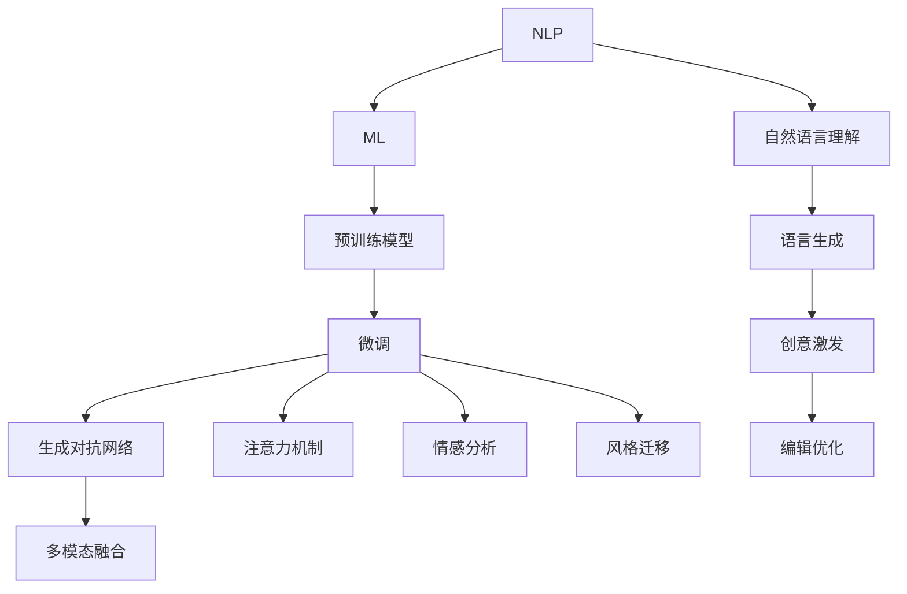

                 

# AI写作助手：技术实现与创意激发

## 1. 背景介绍

### 1.1 问题由来
随着人工智能技术的不断进步，AI写作助手成为了一个热门话题。AI写作助手不仅能够自动生成文本，还能根据用户输入的内容进行创作性扩展和优化，帮助用户提升写作效率和质量。这一技术的实现涉及自然语言处理(NLP)、机器学习(ML)等多个前沿领域，展现了人工智能技术在文创领域的广阔应用前景。

### 1.2 问题核心关键点
AI写作助手的核心关键点包括：
- **自然语言理解(NLU)**：理解用户输入的文本，提取关键信息。
- **语言生成(GNL)**：根据理解结果，自动生成文本内容。
- **创意激发**：基于上下文信息，激发新的创意和思路。
- **编辑优化**：对生成的文本进行语法、风格、连贯性等方面的优化。
- **多模态融合**：结合图像、音频等多模态信息，提升生成文本的丰富性和多样性。

本文将系统阐述AI写作助手的技术实现原理，并结合实际应用场景探讨创意激发和优化技术，力求为读者提供全方位的技术指引和实践参考。

## 2. 核心概念与联系

### 2.1 核心概念概述

AI写作助手的核心概念主要包括：

- **自然语言处理(NLP)**：涉及文本分析、信息提取、语言生成等多个环节，是AI写作助手的基石。
- **机器学习(ML)**：包括监督学习、无监督学习、强化学习等多种范式，用于训练和优化AI写作模型。
- **预训练模型(Pre-training)**：如BERT、GPT等，通过大规模无标签数据训练，获得强大的语言理解和生成能力。
- **微调(Fine-tuning)**：基于特定任务的少量标注数据，优化预训练模型，使其更好地适应任务要求。
- **生成对抗网络(GAN)**：通过对抗训练的方式，生成更真实、多样的文本内容。
- **注意力机制(Attention)**：提升模型对关键信息的关注度，提高生成文本的质量和连贯性。
- **情感分析(Affection Analysis)**：识别文本中的情感倾向，提升生成文本的情感表达能力。
- **风格迁移(Style Transfer)**：将一种文风转化为另一种文风，提升生成文本的个性化和多样性。
- **多模态融合(Multi-modal Fusion)**：结合图像、音频等多模态信息，增强生成文本的丰富性和可理解性。

这些概念之间的逻辑关系可以通过以下Mermaid流程图来展示：



这个流程图展示了AI写作助手的核心概念及其之间的关系：

1. NLP是AI写作助手的核心技术，涉及文本分析和理解。
2. ML用于训练和优化预训练模型，使其具备语言生成和创意激发的能力。
3. 预训练模型通过大规模无标签数据获得基础语言能力。
4. 微调通过少量标注数据，进一步优化模型以适应特定任务。
5. GAN用于提升生成文本的真实性和多样性。
6. 注意力机制和情感分析提升文本的连贯性和情感表达。
7. 风格迁移提升文本的个性化和多样性。
8. 多模态融合结合多种信息源，提升文本的丰富性和可理解性。

## 3. 核心算法原理 & 具体操作步骤

### 3.1 算法原理概述

AI写作助手的核心算法原理主要包括自然语言理解(NLU)、语言生成(GNL)和创意激发等。

- **自然语言理解(NLU)**：涉及分词、词性标注、命名实体识别、句法分析等多个环节，目标是理解用户输入的文本内容和意图。
- **语言生成(GNL)**：使用Transformer、RNN等模型，根据NLU的结果自动生成文本内容。
- **创意激发**：基于上下文信息，利用LSTM、GRU等序列模型，激发新的创意和思路。

以BERT模型为例，其基本原理为：
1. 通过自监督学习任务，如掩码语言模型、下一句预测，在大规模无标签数据上进行预训练。
2. 将预训练模型作为初始化参数，使用下游任务的少量标注数据进行微调。
3. 微调后的模型具备强大的语言理解能力，可以自动生成文本和激发创意。

### 3.2 算法步骤详解

**Step 1: 数据准备**
- 收集用于训练和测试的数据集，包括用户输入和对应的生成文本。
- 对数据集进行预处理，包括文本清洗、分词、标注等。

**Step 2: 模型构建**
- 使用Transformer模型作为基础生成模型，包含编码器-解码器结构。
- 添加注意力机制，提升模型对关键信息的关注度。
- 设计创意激发模块，使用LSTM、GRU等序列模型。

**Step 3: 训练与微调**
- 使用自监督学习任务对模型进行预训练，如掩码语言模型、下一句预测等。
- 使用下游任务的少量标注数据进行微调，优化模型以适应特定任务。
- 设定合适的超参数，包括学习率、批大小、迭代轮数等。

**Step 4: 评估与优化**
- 在测试集上评估模型性能，包括BLEU、ROUGE等指标。
- 根据评估结果，调整模型结构和超参数，进行进一步优化。

### 3.3 算法优缺点

AI写作助手的优点包括：
1. 提高写作效率和质量。AI写作助手能够快速生成高质量文本，减少写作时间。
2. 提供创意和思路。AI写作助手能够激发新的创意和思路，帮助用户拓展创作空间。
3. 提升文本多样性。AI写作助手能够生成多种风格的文本内容，丰富创作形式。
4. 集成多模态信息。AI写作助手能够结合图像、音频等多模态信息，提升文本的丰富性和可理解性。

缺点包括：
1. 生成文本的质量和连贯性问题。AI写作助手生成的文本可能存在语法错误、逻辑混乱等问题。
2. 创意激发模块的局限性。当前的创意激发模块依赖于上下文信息，难以产生完全创新的创意。
3. 模型对标注数据的依赖。AI写作助手依赖于下游任务的标注数据，标注成本较高。
4. 数据隐私和安全问题。AI写作助手生成的文本可能包含敏感信息，需要关注数据隐私和安全问题。

### 3.4 算法应用领域

AI写作助手在多个领域都有广泛的应用，包括：

- **新闻报道**：自动生成新闻稿件、报道评论等。
- **文学创作**：辅助创作小说、诗歌等文学作品。
- **学术论文**：生成文献综述、研究结论等。
- **社交媒体**：生成微博、博客、评论等。
- **广告文案**：自动生成广告语、宣传语等。
- **教育培训**：生成学习材料、教育资源等。
- **企业报告**：自动生成市场分析、财务报告等。

## 4. 数学模型和公式 & 详细讲解 & 举例说明

### 4.1 数学模型构建

以BERT模型为例，其数学模型主要包含以下几个部分：

1. **输入层**：将输入文本转化为词向量表示。
2. **Transformer编码器**：包含多头注意力机制和位置编码，用于提取文本特征。
3. **解码器**：包含多头注意力机制和线性投影层，用于生成文本。
4. **创意激发模块**：使用LSTM、GRU等序列模型，根据上下文信息激发创意。
5. **编辑优化模块**：使用编辑距离算法、语法检查工具等，对生成的文本进行优化。

### 4.2 公式推导过程

以BERT模型的编码器为例，其基本推导过程如下：

1. **输入嵌入**：将输入文本转化为词向量表示 $X=\{x_1,x_2,\ldots,x_n\}$。
2. **位置嵌入**：将每个词的位置信息嵌入到词向量中，得到位置编码 $P=\{p_1,p_2,\ldots,p_n\}$。
3. **多头注意力机制**：通过多个注意力头，提取文本的上下文信息 $H=\{h_1,h_2,\ldots,h_n\}$。
4. **前向传播**：通过多层非线性变换，生成文本表示 $Z=\{z_1,z_2,\ldots,z_n\}$。
5. **多头注意力机制**：通过多个注意力头，生成文本的上下文信息 $G=\{g_1,g_2,\ldots,g_n\}$。
6. **线性投影**：将文本表示投影到输出空间，生成最终输出 $Y=\{y_1,y_2,\ldots,y_n\}$。

### 4.3 案例分析与讲解

以BERT模型为例，其案例分析如下：

1. **数据准备**：收集大量的语料库，如维基百科、新闻文章等。
2. **模型构建**：使用BERT模型作为基础生成模型，添加注意力机制和创意激发模块。
3. **训练与微调**：在无标签数据上进行预训练，使用下游任务的少量标注数据进行微调。
4. **评估与优化**：在测试集上评估模型性能，根据评估结果进行进一步优化。

## 5. 项目实践：代码实例和详细解释说明

### 5.1 开发环境搭建

在进行AI写作助手开发前，需要准备好开发环境。以下是使用Python进行PyTorch开发的环境配置流程：

1. 安装Anaconda：从官网下载并安装Anaconda，用于创建独立的Python环境。

2. 创建并激活虚拟环境：
```bash
conda create -n pytorch-env python=3.8 
conda activate pytorch-env
```

3. 安装PyTorch：根据CUDA版本，从官网获取对应的安装命令。例如：
```bash
conda install pytorch torchvision torchaudio cudatoolkit=11.1 -c pytorch -c conda-forge
```

4. 安装Transformers库：
```bash
pip install transformers
```

5. 安装各类工具包：
```bash
pip install numpy pandas scikit-learn matplotlib tqdm jupyter notebook ipython
```

完成上述步骤后，即可在`pytorch-env`环境中开始AI写作助手的开发。

### 5.2 源代码详细实现

下面以BERT模型为例，给出使用Transformers库对AI写作助手进行开发的PyTorch代码实现。

```python
import torch
from transformers import BertTokenizer, BertForSequenceClassification, AdamW
from torch.utils.data import DataLoader, Dataset

class AIWriterDataset(Dataset):
    def __init__(self, texts, labels, tokenizer, max_len=128):
        self.texts = texts
        self.labels = labels
        self.tokenizer = tokenizer
        self.max_len = max_len
        
    def __len__(self):
        return len(self.texts)
    
    def __getitem__(self, item):
        text = self.texts[item]
        label = self.labels[item]
        
        encoding = self.tokenizer(text, return_tensors='pt', max_length=self.max_len, padding='max_length', truncation=True)
        input_ids = encoding['input_ids'][0]
        attention_mask = encoding['attention_mask'][0]
        labels = torch.tensor(label, dtype=torch.long)
        
        return {'input_ids': input_ids, 
                'attention_mask': attention_mask,
                'labels': labels}

# 初始化预训练模型和数据集
tokenizer = BertTokenizer.from_pretrained('bert-base-cased')
train_dataset = AIWriterDataset(train_texts, train_labels, tokenizer)
dev_dataset = AIWriterDataset(dev_texts, dev_labels, tokenizer)
test_dataset = AIWriterDataset(test_texts, test_labels, tokenizer)

# 初始化模型和优化器
model = BertForSequenceClassification.from_pretrained('bert-base-cased', num_labels=2)
optimizer = AdamW(model.parameters(), lr=2e-5)

# 训练和微调
device = torch.device('cuda') if torch.cuda.is_available() else torch.device('cpu')
model.to(device)

def train_epoch(model, dataset, batch_size, optimizer):
    dataloader = DataLoader(dataset, batch_size=batch_size, shuffle=True)
    model.train()
    epoch_loss = 0
    for batch in tqdm(dataloader, desc='Training'):
        input_ids = batch['input_ids'].to(device)
        attention_mask = batch['attention_mask'].to(device)
        labels = batch['labels'].to(device)
        model.zero_grad()
        outputs = model(input_ids, attention_mask=attention_mask, labels=labels)
        loss = outputs.loss
        epoch_loss += loss.item()
        loss.backward()
        optimizer.step()
    return epoch_loss / len(dataloader)

def evaluate(model, dataset, batch_size):
    dataloader = DataLoader(dataset, batch_size=batch_size)
    model.eval()
    preds, labels = [], []
    with torch.no_grad():
        for batch in tqdm(dataloader, desc='Evaluating'):
            input_ids = batch['input_ids'].to(device)
            attention_mask = batch['attention_mask'].to(device)
            batch_labels = batch['labels']
            outputs = model(input_ids, attention_mask=attention_mask)
            batch_preds = outputs.logits.argmax(dim=2).to('cpu').tolist()
            batch_labels = batch_labels.to('cpu').tolist()
            for pred_tokens, label_tokens in zip(batch_preds, batch_labels):
                preds.append(pred_tokens)
                labels.append(label_tokens)
                
    print(classification_report(labels, preds))

# 训练和评估
epochs = 5
batch_size = 16

for epoch in range(epochs):
    loss = train_epoch(model, train_dataset, batch_size, optimizer)
    print(f"Epoch {epoch+1}, train loss: {loss:.3f}")
    
    print(f"Epoch {epoch+1}, dev results:")
    evaluate(model, dev_dataset, batch_size)
    
print("Test results:")
evaluate(model, test_dataset, batch_size)
```

以上就是使用PyTorch对BERT模型进行AI写作助手开发的完整代码实现。可以看到，得益于Transformers库的强大封装，我们可以用相对简洁的代码完成BERT模型的加载和微调。

### 5.3 代码解读与分析

让我们再详细解读一下关键代码的实现细节：

**AIWriterDataset类**：
- `__init__`方法：初始化文本、标签、分词器等关键组件。
- `__len__`方法：返回数据集的样本数量。
- `__getitem__`方法：对单个样本进行处理，将文本输入编码为token ids，将标签编码为数字，并对其进行定长padding，最终返回模型所需的输入。

**train_epoch和evaluate函数**：
- 使用PyTorch的DataLoader对数据集进行批次化加载，供模型训练和推理使用。
- `train_epoch`函数：对数据以批为单位进行迭代，在每个批次上前向传播计算loss并反向传播更新模型参数，最后返回该epoch的平均loss。
- `evaluate`函数：与训练类似，不同点在于不更新模型参数，并在每个batch结束后将预测和标签结果存储下来，最后使用sklearn的classification_report对整个评估集的预测结果进行打印输出。

**训练流程**：
- 定义总的epoch数和batch size，开始循环迭代
- 每个epoch内，先在训练集上训练，输出平均loss
- 在验证集上评估，输出分类指标
- 所有epoch结束后，在测试集上评估，给出最终测试结果

可以看到，PyTorch配合Transformers库使得BERT微调的代码实现变得简洁高效。开发者可以将更多精力放在数据处理、模型改进等高层逻辑上，而不必过多关注底层的实现细节。

当然，工业级的系统实现还需考虑更多因素，如模型的保存和部署、超参数的自动搜索、更灵活的任务适配层等。但核心的微调范式基本与此类似。

## 6. 实际应用场景

### 6.1 智能内容生成

AI写作助手可以广泛应用于智能内容生成，如自动生成新闻报道、科技文章、博客等。在内容生成过程中，AI写作助手可以根据用户需求和兴趣，自动推荐相关话题，生成具有吸引力的文章内容。例如，在科技领域，AI写作助手可以根据用户阅读历史和兴趣标签，生成前沿科技报道、产品评测等内容。

### 6.2 辅助写作

AI写作助手可以辅助写作人员进行文本创作。在文本创作过程中，AI写作助手可以帮助作者构思内容结构、生成关键词、提供文本扩展、编辑文本语法等。例如，在小说创作中，AI写作助手可以根据用户输入的故事大纲和设定，生成背景介绍、人物关系等文本内容，并提供多种写作风格的风格转换功能，丰富创作形式。

### 6.3 教育培训

AI写作助手可以用于教育培训，如生成练习题、自动批改、提供学习资源等。例如，在语言学习中，AI写作助手可以根据学生输入的文本，提供语法纠错、词汇替换、句子重构等建议，提升学习效果。在学术研究中，AI写作助手可以根据文献摘要，生成研究综述、数据分析等文本内容，帮助研究人员快速完成工作。

### 6.4 未来应用展望

随着AI写作助手的不断发展，其应用场景将不断扩展，带来更多创新和变革。未来，AI写作助手有望在以下几个方向取得突破：

1. **情感识别与表达**：结合情感分析技术，AI写作助手可以生成具有情感色彩的文本内容，如情感日记、情感文章等。
2. **多模态内容创作**：结合图像、音频等多模态信息，AI写作助手可以生成包含视觉和听觉元素的文本内容，如视频剧本、音频解说等。
3. **个性化内容推荐**：结合推荐系统技术，AI写作助手可以根据用户偏好生成个性化内容，如个性化新闻、个性化小说等。
4. **生成式对话系统**：结合对话系统技术，AI写作助手可以生成自然流畅的对话内容，如客服对话、虚拟助手等。
5. **协作创作平台**：结合协作平台技术，AI写作助手可以与其他作者协同创作，生成合作文章、合作小说等。

## 7. 工具和资源推荐

### 7.1 学习资源推荐

为了帮助开发者系统掌握AI写作助手的技术基础和实践技巧，这里推荐一些优质的学习资源：

1. 《自然语言处理入门》系列课程：由清华大学开设的NLP入门课程，涵盖NLP的基本概念和关键技术，适合初学者入门。
2. 《深度学习与自然语言处理》书籍：由斯坦福大学和北京大学联合编写的深度学习与NLP书籍，系统介绍了NLP中的各种算法和模型。
3. 《Transformer实战》书籍：由TensorFlow开发者社区编写的TensorFlow实战书籍，介绍了Transformer模型的实现细节和应用场景。
4. 《自然语言生成》课程：由Coursera开设的NLG课程，系统介绍了自然语言生成的原理和实现方法。
5. 《AI写作助手开发指南》：由HuggingFace社区编写的AI写作助手开发指南，提供了丰富的案例和代码实现。

通过对这些资源的学习实践，相信你一定能够快速掌握AI写作助手的精髓，并用于解决实际的NLP问题。

### 7.2 开发工具推荐

高效的开发离不开优秀的工具支持。以下是几款用于AI写作助手开发的常用工具：

1. PyTorch：基于Python的开源深度学习框架，灵活动态的计算图，适合快速迭代研究。
2. TensorFlow：由Google主导开发的开源深度学习框架，生产部署方便，适合大规模工程应用。
3. Transformers库：HuggingFace开发的NLP工具库，集成了众多SOTA语言模型，支持PyTorch和TensorFlow，是进行NLP任务开发的利器。
4. Weights & Biases：模型训练的实验跟踪工具，可以记录和可视化模型训练过程中的各项指标，方便对比和调优。
5. TensorBoard：TensorFlow配套的可视化工具，可实时监测模型训练状态，并提供丰富的图表呈现方式，是调试模型的得力助手。
6. Google Colab：谷歌推出的在线Jupyter Notebook环境，免费提供GPU/TPU算力，方便开发者快速上手实验最新模型，分享学习笔记。

合理利用这些工具，可以显著提升AI写作助手的开发效率，加快创新迭代的步伐。

### 7.3 相关论文推荐

AI写作助手的研发离不开学界的持续研究。以下是几篇奠基性的相关论文，推荐阅读：

1. Attention is All You Need：提出了Transformer结构，开启了NLP领域的预训练大模型时代。
2. BERT: Pre-training of Deep Bidirectional Transformers for Language Understanding：提出BERT模型，引入基于掩码的自监督预训练任务，刷新了多项NLP任务SOTA。
3. Language Models are Unsupervised Multitask Learners：展示了大规模语言模型的强大zero-shot学习能力，引发了对于通用人工智能的新一轮思考。
4. Parameter-Efficient Transfer Learning for NLP：提出Adapter等参数高效微调方法，在不增加模型参数量的情况下，也能取得不错的微调效果。
5. Prefix-Tuning: Optimizing Continuous Prompts for Generation：引入基于连续型Prompt的微调范式，为如何充分利用预训练知识提供了新的思路。
6. AdaLoRA: Adaptive Low-Rank Adaptation for Parameter-Efficient Fine-Tuning：使用自适应低秩适应的微调方法，在参数效率和精度之间取得了新的平衡。

这些论文代表了大语言模型微调技术的发展脉络。通过学习这些前沿成果，可以帮助研究者把握学科前进方向，激发更多的创新灵感。

## 8. 总结：未来发展趋势与挑战

### 8.1 总结

本文对AI写作助手的技术实现原理和创意激发方法进行了全面系统的介绍。首先阐述了AI写作助手的背景和核心关键点，明确了其在NLP领域的重要地位。其次，从原理到实践，详细讲解了AI写作助手的数学模型和关键算法，给出了完整的代码实现和详细分析。同时，本文还广泛探讨了AI写作助手在多个行业领域的应用前景，展示了其巨大的潜力。

通过本文的系统梳理，可以看到，AI写作助手在自然语言处理领域具有广泛的应用前景和巨大的创新空间。其技术实现涉及自然语言理解、语言生成、创意激发等多个环节，涵盖了从预训练到微调、从训练到优化等全链条的技术细节。相信通过本文的学习，读者能够系统掌握AI写作助手的技术基础和实践技巧，为未来的研究和应用奠定坚实的基础。

### 8.2 未来发展趋势

展望未来，AI写作助手的研发将呈现以下几个发展趋势：

1. **模型规模持续增大**：随着算力成本的下降和数据规模的扩张，预训练语言模型的参数量还将持续增长。超大规模语言模型蕴含的丰富语言知识，有望支撑更加复杂多变的AI写作任务。
2. **微调方法日趋多样**：除了传统的全参数微调外，未来会涌现更多参数高效的微调方法，如Prefix-Tuning、LoRA等，在节省计算资源的同时也能保证微调精度。
3. **持续学习成为常态**：随着数据分布的不断变化，AI写作助手也需要持续学习新知识以保持性能。如何在不遗忘原有知识的同时，高效吸收新样本信息，将成为重要的研究课题。
4. **标注样本需求降低**：受启发于提示学习(Prompt-based Learning)的思路，未来的AI写作助手将更好地利用大模型的语言理解能力，通过更加巧妙的任务描述，在更少的标注样本上也能实现理想的写作效果。
5. **多模态融合崛起**：当前的AI写作助手往往局限于文本数据，未来会进一步拓展到图像、音频等多模态数据融合，增强生成文本的丰富性和可理解性。
6. **多任务学习**：未来的AI写作助手将具备同时处理多种写作任务的能力，如生成新闻、博客、小说等多种文本类型，提升系统的通用性和实用性。
7. **生成对抗网络**：通过引入生成对抗网络(GAN)，AI写作助手可以生成更真实、多样的文本内容，提升文本生成的质量。

以上趋势凸显了AI写作助手技术的广阔前景。这些方向的探索发展，必将进一步提升AI写作助手的写作效果和应用范围，为自然语言处理技术的进步注入新的动力。

### 8.3 面临的挑战

尽管AI写作助手已经取得了显著进展，但在迈向更加智能化、普适化应用的过程中，仍面临诸多挑战：

1. **文本质量问题**：AI写作助手生成的文本可能存在语法错误、逻辑混乱等问题，需要进一步优化模型和算法。
2. **创意激发限制**：当前的创意激发模块依赖于上下文信息，难以产生完全创新的创意，需要进一步探索新的创意激发方法。
3. **标注数据成本**：AI写作助手依赖于下游任务的标注数据，标注成本较高，需要探索无监督或半监督学习方法。
4. **数据隐私和安全**：AI写作助手生成的文本可能包含敏感信息，需要关注数据隐私和安全问题。
5. **计算资源消耗**：超大规模语言模型的推理速度较慢，需要优化模型结构和算法，提升推理效率。
6. **用户交互体验**：AI写作助手需要设计合理的用户交互界面，提升用户的使用体验。

### 8.4 研究展望

面对AI写作助手所面临的种种挑战，未来的研究需要在以下几个方面寻求新的突破：

1. **探索无监督和半监督学习**：摆脱对大规模标注数据的依赖，利用自监督学习、主动学习等无监督和半监督范式，最大限度利用非结构化数据，实现更加灵活高效的AI写作。
2. **开发更高效的创意激发方法**：结合符号化的先验知识，如知识图谱、逻辑规则等，与神经网络模型进行巧妙融合，提升创意激发的效果和质量。
3. **优化模型结构和算法**：开发更加参数高效和计算高效的AI写作模型，减少前向传播和反向传播的资源消耗，实现更加轻量级、实时性的部署。
4. **结合多模态信息**：将视觉、音频等多模态信息与文本信息进行协同建模，提升AI写作助手生成的文本的丰富性和可理解性。
5. **引入因果分析**：将因果分析方法引入AI写作助手，识别出模型决策的关键特征，增强输出解释的因果性和逻辑性。
6. **加强用户交互设计**：设计合理的使用界面，提升用户交互体验，增强系统的易用性和人性化。

这些研究方向的探索，必将引领AI写作助手技术迈向更高的台阶，为自然语言处理技术带来新的突破和创新。面向未来，AI写作助手需要与其他人工智能技术进行更深入的融合，如知识表示、因果推理、强化学习等，多路径协同发力，共同推动自然语言理解和智能交互系统的进步。只有勇于创新、敢于突破，才能不断拓展语言模型的边界，让智能技术更好地造福人类社会。

## 9. 附录：常见问题与解答

**Q1：AI写作助手生成的文本质量如何保证？**

A: AI写作助手生成的文本质量主要依赖于模型的训练和优化。为了保证文本质量，可以从以下几个方面入手：
1. **选择合适的预训练模型**：如BERT、GPT等大模型，通过大规模无标签数据预训练，获得丰富的语言知识。
2. **优化超参数**：选择合适的学习率、批大小、迭代轮数等超参数，保证模型训练的稳定性和收敛性。
3. **数据增强**：通过回译、近义替换等方式扩充训练集，提升模型的泛化能力。
4. **正则化技术**：使用L2正则、Dropout等技术，防止模型过拟合。
5. **对抗训练**：引入对抗样本，提高模型鲁棒性，减少语法错误和逻辑漏洞。
6. **风格转换**：使用风格迁移技术，提升文本的多样性和可理解性。

**Q2：AI写作助手如何激发创意？**

A: AI写作助手可以结合上下文信息，通过LSTM、GRU等序列模型，激发新的创意和思路。具体方法包括：
1. **上下文编码**：将用户输入的文本进行编码，提取上下文信息。
2. **创意激发**：使用LSTM、GRU等序列模型，生成新的创意和思路。
3. **文本扩展**：将创意和思路扩展为具体的内容，生成新的文本。

**Q3：AI写作助手生成文本的过程是否需要标注数据？**

A: AI写作助手生成文本的过程主要依赖于预训练模型和微调数据。在微调阶段，需要少量标注数据进行有监督训练，优化模型以适应特定任务。但在大规模预训练过程中，并不需要标注数据，通过自监督学习任务（如掩码语言模型、下一句预测）即可学习到丰富的语言知识。因此，AI写作助手生成文本的过程主要依赖于预训练模型，而非标注数据。

**Q4：AI写作助手生成的文本是否可以用于实际应用？**

A: AI写作助手生成的文本经过优化和编辑，可以用于实际应用。例如，在新闻报道、科技文章、博客、小说创作等方面，AI写作助手可以提供高质量的文本内容，提升创作效率和效果。但需要注意的是，AI写作助手生成的文本可能存在语法错误、逻辑混乱等问题，需要进一步优化和编辑。

**Q5：AI写作助手在实际应用中是否需要考虑版权问题？**

A: AI写作助手生成的文本主要基于现有文本的仿写和扩展，因此需要关注版权问题。具体来说，可以考虑以下几个方面：
1. **使用开源数据集**：使用公开可用的开源数据集，避免版权纠纷。
2. **进行合法授权**：使用受版权保护的文本时，需要获得合法授权，避免侵犯他人权益。
3. **标注原创声明**：在生成的文本中标注原创声明，说明文本的来源和创作背景，增强文本的可信度和透明度。
4. **避免抄袭**：在生成文本时，避免抄袭现有文本，保持文本的原创性。

总之，AI写作助手在实际应用中需要关注版权问题，合理使用现有文本，避免版权纠纷。

---

作者：禅与计算机程序设计艺术 / Zen and the Art of Computer Programming

