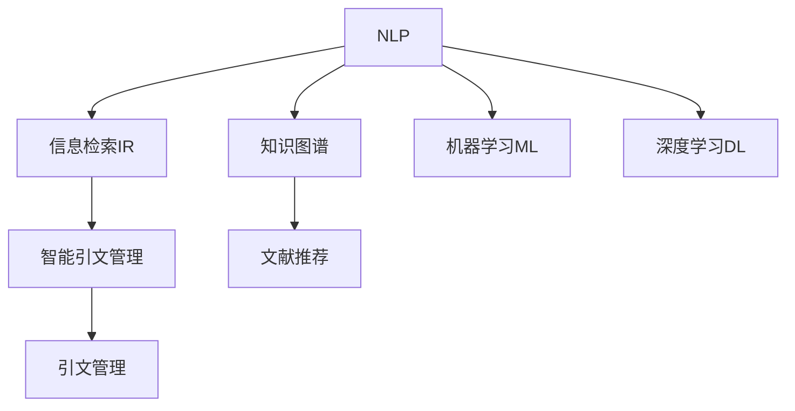

                 

# AI在学术研究中的应用：提高引用和资料搜索效率

> 关键词：人工智能,学术研究,引用管理,资料搜索,知识图谱,信息检索,自然语言处理,NLP,机器学习,深度学习

## 1. 背景介绍

### 1.1 问题由来

学术研究是推动人类知识进步的重要活动。然而，随着文献数量的爆炸式增长，研究人员往往面临着引文查找和资料搜集的巨大挑战。传统的手工检索方式耗时耗力，且难以全面覆盖相关文献。在这样的背景下，人工智能（AI）在学术研究中的应用变得尤为重要。

AI技术可以自动化处理大量文献，通过自然语言处理（NLP）、知识图谱、信息检索等技术，极大地提升了学术研究的效率和精度。AI技术的应用不仅能够帮助研究人员快速定位所需文献，还能对大量文献进行自动分类、聚类和摘要生成，显著降低了研究工作的复杂度。

### 1.2 问题核心关键点

AI在学术研究中提升引用和资料搜索效率的核心关键点包括：

1. **自动化文献检索**：利用AI技术对大量文献进行自动分类和聚类，快速定位相关文献。
2. **智能引文管理**：通过AI技术，自动提取和标注引文信息，提升文献管理的效率和质量。
3. **知识图谱构建**：利用知识图谱技术，构建学术领域知识网络，支持深入的研究和知识发现。
4. **智能文献推荐**：通过AI技术对文献进行评分和推荐，提升研究者的工作效率。
5. **智能文献摘要生成**：利用NLP技术，自动生成文献摘要，减少阅读工作量。
6. **跨领域文献关联**：通过跨领域文献关联，帮助研究者发现更多潜在的相关文献。

### 1.3 问题研究意义

AI在学术研究中的应用，对于提高研究效率、推动学术创新具有重要意义：

1. **提升工作效率**：自动化文献检索和智能引文管理可以显著减少研究人员在文献查找和引用标注上的时间消耗。
2. **增强研究深度**：智能引文推荐和知识图谱构建能够帮助研究人员发现和理解新的研究方向，增强研究深度。
3. **促进跨学科研究**：跨领域文献关联能够促进不同学科之间的知识交流和合作，推动跨学科研究的发展。
4. **支持大规模研究**：智能文献摘要生成和知识图谱构建能够帮助研究人员处理大规模数据集，提高研究工作的可扩展性。

## 2. 核心概念与联系

### 2.1 核心概念概述

为更好地理解AI在学术研究中的应用，本节将介绍几个关键概念：

- **自然语言处理（NLP）**：研究如何让计算机理解和处理自然语言的技术，包括分词、句法分析、语义理解、情感分析等。
- **知识图谱**：通过将实体和关系进行结构化表示，构建知识网络，用于知识发现和推理。
- **信息检索（IR）**：研究如何快速、准确地从大量文本中检索出相关文档的技术，包括倒排索引、向量空间模型等。
- **机器学习（ML）**：研究如何让计算机通过数据学习，自动提升性能的技术，包括监督学习、无监督学习、强化学习等。
- **深度学习（DL）**：一种基于神经网络的机器学习技术，能够处理复杂的数据结构，如图像、文本等。
- **引文管理**：管理学术论文、书籍等的引文信息，包括自动提取、标注和展示。
- **文献推荐**：根据研究者的兴趣和历史行为，自动推荐相关文献，提升研究效率。

这些概念之间的逻辑关系可以通过以下Mermaid流程图来展示：



这个流程图展示了几项AI技术之间的关系：

1. NLP是信息检索和知识图谱的基础，支持对自然语言的理解和处理。
2. 知识图谱是文献推荐的关键，能够支持跨领域文献关联和深入研究。
3. 信息检索和知识图谱技术可以帮助自动化引文管理。
4. 机器学习和深度学习技术能够提升信息检索和文献推荐的精度。
5. 引文管理是文献推荐和智能引文管理的基础，支持高效的引用管理和展示。

## 3. 核心算法原理 & 具体操作步骤
### 3.1 算法原理概述

AI在学术研究中提升引用和资料搜索效率的核心算法原理主要包括：

- **信息检索（IR）算法**：通过倒排索引、向量空间模型等方法，快速定位相关文献。
- **知识图谱构建算法**：利用图神经网络（GNN）等方法，构建学术领域知识网络。
- **自然语言处理（NLP）算法**：通过分词、句法分析、语义理解等方法，支持文献检索和摘要生成。
- **机器学习和深度学习算法**：通过监督学习、无监督学习、强化学习等方法，提升文献推荐的精度。

### 3.2 算法步骤详解

**步骤1：文献检索**

1. **预处理**：对学术论文、书籍等文本进行预处理，包括分词、去停用词、词性标注等。
2. **倒排索引构建**：构建倒排索引，将每个单词映射到包含该单词的文档列表中。
3. **向量空间模型（VSM）构建**：将文档表示为向量，每个维度表示一个单词的TF-IDF值。
4. **文档检索**：输入查询，通过倒排索引和向量空间模型，快速定位相关文档。

**步骤2：知识图谱构建**

1. **实体抽取**：利用NLP技术，从文献中抽取实体，如作者、研究机构、关键词等。
2. **关系抽取**：利用NLP技术，从文献中抽取实体之间的关系，如引用、合作、共现等。
3. **知识图谱构建**：将实体和关系进行结构化表示，构建知识网络。
4. **知识图谱扩展**：利用链接预测算法，发现和添加缺失的实体和关系。

**步骤3：文献推荐**

1. **用户行为建模**：利用机器学习技术，从用户的历史行为数据中提取特征。
2. **文献特征提取**：利用NLP技术，从文献中提取特征，如关键词、摘要等。
3. **推荐模型训练**：利用监督学习或深度学习算法，训练推荐模型。
4. **文献推荐**：输入用户信息，通过推荐模型，自动推荐相关文献。

**步骤4：引文管理**

1. **引文提取**：利用NLP技术，从论文中自动提取引文信息。
2. **引文标注**：将提取的引文信息进行标注，如作者、出版社、发表年份等。
3. **引文展示**：利用可视化技术，展示引文信息，支持研究人员快速查阅。

### 3.3 算法优缺点

AI在学术研究中的应用具有以下优点：

1. **高效性**：自动化处理大量文献，显著提升研究效率。
2. **精确性**：利用NLP和知识图谱技术，提升文献检索和推荐精度。
3. **可扩展性**：支持大规模文献处理，可扩展性强。
4. **灵活性**：适应不同学科和领域的需求。

同时，该方法也存在一些局限性：

1. **数据依赖**：依赖高质量的文献数据和用户行为数据。
2. **模型复杂度**：需要构建复杂的知识图谱和推荐模型，对数据和计算资源要求较高。
3. **结果可解释性**：推荐结果的解释性不足，可能存在黑盒问题。
4. **隐私问题**：用户行为数据的隐私保护问题。

尽管存在这些局限性，但AI在学术研究中的应用前景广阔，未来需进一步优化和完善。

### 3.4 算法应用领域

AI在学术研究中的应用领域广泛，包括但不限于：

- **医学研究**：利用AI技术，快速检索医学文献，支持医学知识的发现和应用。
- **社会科学研究**：利用AI技术，分析社会数据，支持社会科学研究的深入。
- **工程技术研究**：利用AI技术，检索工程文献，支持工程技术创新。
- **人文学科研究**：利用AI技术，处理人文数据，支持人文学科研究的智能化。

## 4. 数学模型和公式 & 详细讲解 & 举例说明（备注：数学公式请使用latex格式，latex嵌入文中独立段落使用 $$，段落内使用 $)
### 4.1 数学模型构建

本节将使用数学语言对AI在学术研究中的应用进行更加严格的刻画。

**信息检索（IR）模型**：

设查询为$q$，文档集合为$D$，文档-单词矩阵为$W$，倒排索引为$I$，向量空间模型为$V$。则信息检索模型的目标是最小化查询-文档相关性误差，即：

$$
\min_{W,I,V} \sum_{d \in D} \sum_{w \in W} |W_{dw} - V_{qw}|
$$

其中$W_{dw}$表示文档$d$中单词$w$的出现次数，$V_{qw}$表示查询$q$中单词$w$的TF-IDF值。

**知识图谱构建模型**：

设实体集合为$E$，关系集合为$R$，知识图谱为$G=(E, R)$。则知识图谱构建模型的目标是通过链接预测算法，最大化已知实体间的关系数量，即：

$$
\max_{G} \sum_{(u,v) \in E} \mathbb{P}(u,v)
$$

其中$\mathbb{P}(u,v)$表示实体$u$和$v$之间存在关系的概率。

**文献推荐模型**：

设用户集合为$U$，文献集合为$L$，用户-文献关系为$R$，用户行为向量为$u$，文献向量为$l$。则文献推荐模型的目标是最小化推荐误差，即：

$$
\min_{R,u,l} \sum_{(u,l) \in U \times L} \mathbb{E}[\text{rank}(u,l)]
$$

其中$\text{rank}(u,l)$表示用户$u$对文献$l$的评分。

**引文管理模型**：

设引文集合为$C$，引文-文献关系为$R$，引文向量为$c$，文献向量为$l$。则引文管理模型的目标是最小化引文标注误差，即：

$$
\min_{R,c,l} \sum_{(c,l) \in C \times L} \mathbb{E}[|c - l|]
$$

其中$c$表示引文$c$的标注信息，$l$表示文献$l$的信息。

### 4.2 公式推导过程

以下我们以知识图谱构建为例，推导链接预测算法的计算公式。

设知识图谱为$G=(E, R)$，每个实体$u$和关系$r$分别有$d_u$和$d_r$个邻居，目标是通过链接预测算法，最大化已知实体间的关系数量。常见的链接预测算法包括基于图神经网络的算法，如Graph Convolutional Network（GCN）。

GCN的计算公式如下：

$$
h_u^l = \frac{1}{d_u} \sum_{v \in \mathcal{N}(u)} (A_{uv} h_v^{l-1})
$$

其中$h_u^l$表示实体$u$在$l$次迭代后的表示，$A_{uv}$表示邻居关系权重，$\mathcal{N}(u)$表示实体$u$的邻居集合。

将GCN算法应用于链接预测，每次迭代后，预测实体$u$和邻居$v$之间存在关系的概率为：

$$
\text{P}(u,v) = \sigma(\frac{1}{d_u d_v} \sum_{l=0}^{L-1} h_u^l h_v^l)
$$

其中$\sigma$表示sigmoid函数，$L$表示迭代次数。

通过上述推导，我们可以看到，链接预测算法的核心在于通过GCN算法，不断迭代更新实体的表示，并计算邻居之间的关系概率。

### 4.3 案例分析与讲解

以知识图谱构建为例，具体分析AI在学术研究中的应用：

**案例背景**：某学术机构希望构建医学领域的知识图谱，以便快速检索医学文献和支持医学研究。

**数据准备**：收集医学领域的论文数据，利用NLP技术抽取实体和关系，构建初步的知识图谱。

**知识图谱构建**：利用GCN算法，迭代更新知识图谱中的实体表示，计算实体之间的关系概率，最终得到完整的医学知识图谱。

**效果分析**：通过知识图谱构建，研究者能够快速定位相关文献，发现潜在的研究方向和合作机会。

## 5. 项目实践：代码实例和详细解释说明
### 5.1 开发环境搭建

在进行AI在学术研究中的应用实践前，我们需要准备好开发环境。以下是使用Python进行PyTorch开发的环境配置流程：

1. 安装Anaconda：从官网下载并安装Anaconda，用于创建独立的Python环境。

2. 创建并激活虚拟环境：
```bash
conda create -n pytorch-env python=3.8 
conda activate pytorch-env
```

3. 安装PyTorch：根据CUDA版本，从官网获取对应的安装命令。例如：
```bash
conda install pytorch torchvision torchaudio cudatoolkit=11.1 -c pytorch -c conda-forge
```

4. 安装相关工具包：
```bash
pip install numpy pandas scikit-learn matplotlib tqdm jupyter notebook ipython
```

完成上述步骤后，即可在`pytorch-env`环境中开始项目实践。

### 5.2 源代码详细实现

这里以信息检索为例，给出使用PyTorch进行信息检索的Python代码实现。

首先，定义信息检索模型的基本结构：

```python
import torch
import torch.nn as nn
import torch.nn.functional as F

class IRModel(nn.Module):
    def __init__(self, vocab_size, embed_dim):
        super(IRModel, self).__init__()
        self.embedding = nn.Embedding(vocab_size, embed_dim)
        self.linear = nn.Linear(embed_dim, 1)
        self.sigmoid = nn.Sigmoid()

    def forward(self, x):
        embedding = self.embedding(x)
        linear = self.linear(embedding)
        logits = self.sigmoid(linear)
        return logits
```

然后，定义倒排索引构建函数和向量空间模型计算函数：

```python
def build_inverted_index(corpus):
    inverted_index = {}
    for i, sentence in enumerate(corpus):
        words = sentence.split()
        for word in words:
            if word not in inverted_index:
                inverted_index[word] = []
            inverted_index[word].append(i)
    return inverted_index

def calculate_tfidf(inverted_index, corpus):
    tfidf = {}
    for word in inverted_index:
        doc_counts = len(inverted_index[word])
        total_docs = len(corpus)
        tfidf[word] = np.log((doc_counts+1)/(total_docs+1))
    return tfidf

def calculate_vsm(inverted_index, tfidf, query):
    vsm = []
    for word in query.split():
        if word in inverted_index:
            vsm.append(tfidf[word])
        else:
            vsm.append(0)
    return np.array(vsm)
```

最后，编写完整的文本检索函数：

```python
def search(query, inverted_index, tfidf, model):
    vsm = calculate_vsm(inverted_index, tfidf, query)
    vsm = torch.tensor(vsm).float().unsqueeze(0)
    model.eval()
    with torch.no_grad():
        logits = model(vsm)
        scores = logits.squeeze().item()
    return inverted_index, scores
```

### 5.3 代码解读与分析

让我们再详细解读一下关键代码的实现细节：

**IRModel类**：
- `__init__`方法：初始化嵌入层、线性层和Sigmoid层，定义模型结构。
- `forward`方法：定义前向传播过程，计算查询向量与文档向量的相关性。

**build_inverted_index函数**：
- 对文本数据进行分词和倒排索引构建，将每个单词映射到包含该单词的文档列表中。

**calculate_tfidf函数**：
- 计算每个单词的TF-IDF值，用于表示文档与单词之间的关系。

**calculate_vsm函数**：
- 将查询文本转换为向量空间模型表示，每个维度表示一个单词的TF-IDF值。

**search函数**：
- 输入查询文本，计算查询向量和文档向量的相关性，输出文档列表和相关性分数。

## 6. 实际应用场景
### 6.1 智能图书馆系统

智能图书馆系统可以利用AI技术，自动管理图书馆的文献资源，提高用户检索和借阅的效率。系统通过构建知识图谱，支持用户快速查找所需文献，并提供智能推荐服务。

具体而言，智能图书馆系统可以自动扫描图书馆中的纸质书籍，构建书籍知识图谱，同时利用AI技术对数字文献进行自动分类和标注。用户输入查询后，系统通过知识图谱快速定位相关书籍，并提供智能推荐服务，帮助用户发现更多感兴趣的书籍。

### 6.2 学术搜索引擎

学术搜索引擎可以帮助研究人员快速定位所需文献，支持学术研究的深入。系统通过构建跨学科知识图谱，支持跨领域的文献检索和推荐。

具体而言，学术搜索引擎可以自动抓取各大学术平台上的文献数据，构建跨学科知识图谱，并利用AI技术进行文献推荐。用户输入查询后，系统通过知识图谱快速定位相关文献，并提供智能推荐服务，帮助用户发现更多相关文献和研究方向。

### 6.3 科技情报分析

科技情报分析可以利用AI技术，快速检索和分析大量科技文献，支持科技情报的发现和应用。系统通过构建科技领域的知识图谱，支持深度分析和预测。

具体而言，科技情报分析系统可以自动抓取科技领域的文献数据，构建科技知识图谱，并利用AI技术进行文献检索和分析。系统通过知识图谱发现科技热点和趋势，并进行预测和预警，帮助研究人员和决策者做出科学决策。

## 7. 工具和资源推荐
### 7.1 学习资源推荐

为了帮助开发者系统掌握AI在学术研究中的应用，这里推荐一些优质的学习资源：

1. 《深度学习入门》系列书籍：深入浅出地介绍了深度学习的基本概念和算法，适合初学者。
2. 《自然语言处理综论》系列书籍：全面介绍了自然语言处理的基本概念和算法，适合进阶学习。
3. 《机器学习实战》系列书籍：介绍了机器学习的基本概念和算法，并提供了大量的实践案例。
4. Coursera《深度学习专项课程》：斯坦福大学开设的深度学习课程，包括理论和实践内容，适合系统学习。
5. Kaggle数据科学竞赛：通过参与实际的数据科学竞赛，提升实际应用能力。

通过对这些资源的学习实践，相信你一定能够快速掌握AI在学术研究中的应用，并用于解决实际的科研问题。
###  7.2 开发工具推荐

高效的开发离不开优秀的工具支持。以下是几款用于AI学术研究开发的常用工具：

1. PyTorch：基于Python的开源深度学习框架，灵活动态的计算图，适合快速迭代研究。大部分预训练语言模型都有PyTorch版本的实现。
2. TensorFlow：由Google主导开发的开源深度学习框架，生产部署方便，适合大规模工程应用。同样有丰富的预训练语言模型资源。
3. Scikit-learn：Python机器学习库，提供了丰富的机器学习算法和工具，适合初学者。
4. Jupyter Notebook：交互式编程环境，适合撰写和分享代码和文档。
5. Weights & Biases：模型训练的实验跟踪工具，可以记录和可视化模型训练过程中的各项指标，方便对比和调优。
6. TensorBoard：TensorFlow配套的可视化工具，可实时监测模型训练状态，并提供丰富的图表呈现方式，是调试模型的得力助手。

合理利用这些工具，可以显著提升AI在学术研究中的应用开发效率，加快创新迭代的步伐。

### 7.3 相关论文推荐

AI在学术研究中的应用源于学界的持续研究。以下是几篇奠基性的相关论文，推荐阅读：

1. Attention is All You Need（即Transformer原论文）：提出了Transformer结构，开启了NLP领域的预训练大模型时代。
2. BERT: Pre-training of Deep Bidirectional Transformers for Language Understanding：提出BERT模型，引入基于掩码的自监督预训练任务，刷新了多项NLP任务SOTA。
3. Graph Convolutional Network: Graph Spectral Networks Meet Deep Learning：提出了图卷积神经网络（GCN），用于构建知识图谱和链接预测。
4. Capsule Networks：提出胶囊网络，用于提高模型的可解释性和泛化能力。
5. Natural Language Processing（almost） from Scratch：提出一种无需大量标注数据即可进行自然语言处理的模型，具有重要意义。

这些论文代表了大语言模型和微调技术的发展脉络。通过学习这些前沿成果，可以帮助研究者把握学科前进方向，激发更多的创新灵感。

## 8. 总结：未来发展趋势与挑战
### 8.1 总结

本文对AI在学术研究中的应用进行了全面系统的介绍。首先阐述了AI在学术研究中提升引用和资料搜索效率的研究背景和意义，明确了AI技术在提高研究效率、促进知识发现和支持跨学科研究等方面的独特价值。其次，从原理到实践，详细讲解了AI在学术研究中的应用算法和具体操作步骤，给出了AI在学术研究中的应用实例。同时，本文还广泛探讨了AI在学术研究中的应用场景和未来发展趋势，展示了AI技术的广泛应用前景。

通过本文的系统梳理，可以看到，AI在学术研究中的应用已经进入实际应用阶段，为学术研究的智能化和自动化提供了强有力的技术支撑。未来，伴随AI技术的持续演进，AI在学术研究中的应用将更加广泛和深入，为科学研究带来更加深刻的影响。

### 8.2 未来发展趋势

展望未来，AI在学术研究中的应用将呈现以下几个发展趋势：

1. **智能化程度提升**：AI技术将进一步提升文献检索和文献推荐的智能化程度，支持更加高效和精准的研究工作。
2. **跨学科融合**：AI技术将更多地应用于跨学科研究，促进不同学科之间的知识交流和合作。
3. **个性化定制**：AI技术将支持个性化文献推荐和研究工具的开发，满足不同研究者的需求。
4. **自动化研究**：AI技术将更多地应用于自动化研究，减少研究者的人工干预，提升研究效率。
5. **实时性增强**：AI技术将支持实时文献推荐和研究分析，满足动态变化的研究需求。
6. **伦理和社会影响**：AI技术的应用将更加注重伦理和社会影响，确保研究的公正和透明。

以上趋势凸显了AI在学术研究中的应用前景。这些方向的探索发展，必将进一步提升学术研究的智能化水平，推动科学研究的进步。

### 8.3 面临的挑战

尽管AI在学术研究中的应用前景广阔，但在迈向更加智能化、普适化应用的过程中，它仍面临着诸多挑战：

1. **数据质量问题**：依赖高质量的文献数据和用户行为数据，数据质量问题直接影响AI应用的效果。
2. **模型复杂度**：构建复杂的知识图谱和推荐模型，对数据和计算资源要求较高。
3. **结果可解释性**：推荐结果的解释性不足，可能存在黑盒问题。
4. **隐私问题**：用户行为数据的隐私保护问题。
5. **伦理问题**：AI技术的应用可能带来伦理和社会问题，如偏见和歧视等。

尽管存在这些挑战，但AI在学术研究中的应用前景广阔，未来需进一步优化和完善。

### 8.4 研究展望

面对AI在学术研究中面临的挑战，未来的研究需要在以下几个方面寻求新的突破：

1. **数据增强**：通过数据增强技术，提升数据质量和多样性，改善AI应用效果。
2. **模型优化**：优化知识图谱和推荐模型的复杂度，降低计算资源消耗，提升AI应用的效率和可扩展性。
3. **结果可解释性**：提高AI应用的透明性和可解释性，确保研究成果的公正和透明。
4. **隐私保护**：加强用户行为数据的隐私保护，确保数据安全和伦理道德。
5. **跨学科应用**：推动AI技术在跨学科研究中的应用，促进不同学科之间的知识交流和合作。
6. **社会影响研究**：研究AI技术在社会中的影响，确保技术应用符合社会伦理和价值观。

这些研究方向的探索，必将引领AI在学术研究中的应用走向更高的台阶，为科学研究带来更加深刻的影响。

## 9. 附录：常见问题与解答

**Q1：AI在学术研究中的应用是否适用于所有领域？**

A: AI在学术研究中的应用具有广泛适用性，尤其是在数据密集型领域，如医学、社会科学、工程技术等，能够显著提升研究效率。但对于一些依赖直觉和创造性的领域，如文学、艺术等，AI的应用效果可能有限。

**Q2：AI在学术研究中的应用需要哪些技术和资源？**

A: AI在学术研究中的应用需要以下技术和资源：
1. 数据预处理和特征提取技术。
2. 深度学习模型和自然语言处理技术。
3. 高性能计算资源，如GPU、TPU等。
4. 可视化工具，用于展示和分析结果。

**Q3：AI在学术研究中的应用效果如何？**

A: AI在学术研究中的应用效果显著，特别是在文献检索、文献推荐、知识图谱构建等方面，能够显著提升研究效率和质量。但也需要注意，AI应用的性能依赖于数据质量和模型设计，需要不断优化和改进。

**Q4：AI在学术研究中的应用是否存在伦理问题？**

A: AI在学术研究中的应用需要注意伦理问题，如数据隐私、偏见和歧视等。确保AI应用的透明性和可解释性，遵守相关法律法规，是应用AI技术的必要前提。

---

作者：禅与计算机程序设计艺术 / Zen and the Art of Computer Programming

