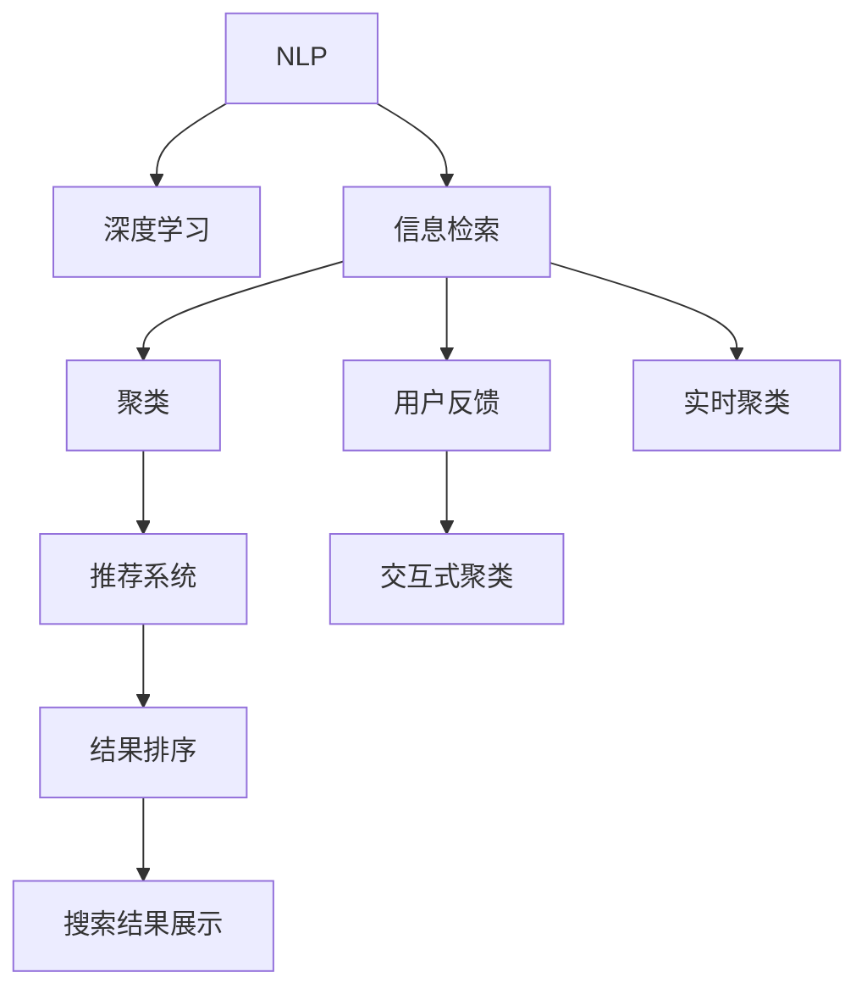

                 

# AI在搜索引擎结果聚类中的应用

> 关键词：搜索引擎,结果聚类,自然语言处理(NLP),信息检索,深度学习,机器学习,推荐系统

## 1. 背景介绍

### 1.1 问题由来
在信息爆炸的今天，搜索引擎已成为人们获取信息、知识的主要渠道之一。然而，随着互联网内容的爆炸性增长，搜索结果的海量性和复杂性也给用户带来了信息过载的困扰。如何从海量的搜索结果中快速找到真正有用的信息，是搜索引擎面临的重大挑战。

结果聚类（Result Clustering），作为一种新的搜索技术，通过将相似的结果聚在一起，帮助用户快速定位到相关的信息。传统的搜索结果聚类方法主要依赖于人工设计的关键词、主题等特征，缺乏对语义的理解和分析，难以处理长尾查询、复杂查询和自然语言查询。

AI在结果聚类中的应用，通过利用自然语言处理（NLP）和深度学习技术，可以从文本数据中自动提取有意义的特征，对搜索结果进行更加精准的聚类，提升用户的搜索体验和满意度。

### 1.2 问题核心关键点
AI在结果聚类中的关键技术点包括：
- 基于NLP的特征提取：通过预训练语言模型自动提取文本中的语义特征，用于聚类。
- 深度学习聚类算法：使用神经网络模型进行聚类，获取更准确的结果分类。
- 多模态特征融合：融合文本、图像、音频等多模态数据，提高聚类的全面性和准确性。
- 交互式聚类：引入用户反馈，通过在线学习机制动态调整聚类模型。
- 实时聚类：实现低延迟的聚类处理，提升用户体验。

## 2. 核心概念与联系

### 2.1 核心概念概述

为了更好地理解AI在搜索结果聚类中的应用，本节将介绍几个密切相关的核心概念：

- **自然语言处理（NLP）**：研究计算机如何理解和生成人类语言的技术。在结果聚类中，NLP技术用于自动提取文本中的语义特征。
- **深度学习（Deep Learning）**：一种基于神经网络的机器学习技术，用于解决复杂的模式识别和预测问题。在结果聚类中，深度学习用于训练聚类模型。
- **信息检索（Information Retrieval, IR）**：研究如何从大量文本数据中快速检索出最相关的信息。在结果聚类中，信息检索技术用于将相关结果聚在一起。
- **聚类（Clustering）**：将数据划分为不同的组，使得同一组内的数据具有相似性。在结果聚类中，聚类算法用于将相似的结果自动分组。
- **推荐系统（Recommendation System）**：基于用户的历史行为和偏好，推荐最相关的信息。在结果聚类中，推荐系统可用于个性化聚类和排序。

这些核心概念之间的逻辑关系可以通过以下Mermaid流程图来展示：



这个流程图展示了大语言模型微调的各个核心概念及其之间的关系：

1. NLP提取语义特征，供深度学习模型训练。
2. 深度学习模型训练聚类算法，用于相似性度量。
3. 信息检索技术将结果匹配到聚类，进行分类。
4. 聚类算法对结果分组，减少用户选择成本。
5. 推荐系统个性化排序，提升用户体验。
6. 用户反馈影响模型，实现交互式聚类。
7. 实时聚类满足低延迟要求。

这些概念共同构成了AI在搜索结果聚类中的应用框架，使其能够在各种场景下实现高效、精准的信息检索。

## 3. 核心算法原理 & 具体操作步骤
### 3.1 算法原理概述

基于AI的搜索结果聚类过程，本质上是一个多任务学习的优化过程。其核心思想是：通过深度学习模型对文本数据进行特征提取，然后应用聚类算法将相似的结果聚在一起，从而提升搜索体验。

具体而言，假设搜索结果集为 $D$，其中每个文档 $d_i$ 都由一个词向量序列 $v_i$ 表示。设聚类数为 $K$，定义 $C_k$ 为第 $k$ 类聚类，包含 $K_k$ 个文档。目标是最小化每个文档被错误分配到其他类别的概率，即：

$$
\min_{\theta} \sum_{i=1}^N \sum_{k=1}^K I(d_i \notin C_k)
$$

其中 $\theta$ 为模型参数，$I$ 为指示函数，$N$ 为文档数量。

聚类过程通常分为两个步骤：

1. 特征提取：使用预训练语言模型（如BERT、GPT等）对文档进行编码，得到每个文档的特征向量 $v_i$。
2. 聚类：应用聚类算法（如K-means、GMM等）对特征向量进行分组，得到 $K$ 个聚类 $C_k$。

### 3.2 算法步骤详解

基于AI的搜索结果聚类一般包括以下几个关键步骤：

**Step 1: 准备预训练模型和数据集**
- 选择合适的预训练语言模型，如BERT、GPT等，作为特征提取器。
- 准备搜索结果集 $D$，每个文档 $d_i$ 作为训练样本。

**Step 2: 特征提取**
- 使用预训练语言模型对每个文档 $d_i$ 进行编码，得到特征向量 $v_i$。
- 如果文档包含多媒体内容（如图像、音频等），则将多媒体内容转换成文本或嵌入向量，与文档特征一起输入模型。

**Step 3: 聚类模型训练**
- 选择合适的聚类算法（如K-means、GMM等），使用特征向量训练聚类模型，得到 $K$ 个聚类 $C_k$。
- 设定聚类数 $K$ 和迭代次数，迭代优化聚类模型。

**Step 4: 聚类结果应用**
- 对新搜索请求，使用预训练语言模型提取文档特征向量。
- 应用聚类算法将文档特征向量分类到各个聚类 $C_k$。
- 返回聚类结果，使用推荐系统对每个聚类进行排序，展示给用户。

**Step 5: 反馈和优化**
- 收集用户对聚类结果的反馈，对聚类模型进行在线学习。
- 根据反馈调整聚类算法和模型参数，提升聚类准确性和用户体验。

以上是基于AI的搜索结果聚类的一般流程。在实际应用中，还需要针对具体场景进行优化设计，如改进特征提取器、优化聚类算法、引入用户交互等，以进一步提升聚类效果。

### 3.3 算法优缺点

基于AI的搜索结果聚类方法具有以下优点：
1. 自动提取语义特征：利用预训练语言模型自动提取文本中的语义信息，减少了人工设计的复杂度。
2. 更准确的结果分类：深度学习模型在处理文本数据上具有天然优势，能够提供更精准的结果分类。
3. 支持多模态数据：融合文本、图像、音频等多种数据类型，提升聚类的全面性。
4. 用户反馈驱动：引入用户交互机制，动态调整聚类模型，提升聚类效果。
5. 实时聚类：支持低延迟处理，满足用户即时搜索需求。

同时，该方法也存在一定的局限性：
1. 高计算成本：深度学习模型需要大量的计算资源进行训练和推理，对硬件要求较高。
2. 数据稀疏性：对于长尾查询和复杂查询，可能存在数据稀疏性问题，聚类效果不佳。
3. 模型复杂性：深度学习模型复杂度较高，对模型参数和超参数调优要求严格。
4. 可解释性不足：深度学习模型通常视为"黑盒"，缺乏可解释性，难以解释模型决策过程。
5. 数据隐私：处理用户搜索数据可能涉及隐私问题，需要采取相应的数据保护措施。

尽管存在这些局限性，但就目前而言，基于AI的搜索结果聚类方法仍是目前最先进和有效的解决方案。未来相关研究将致力于降低计算成本、提升数据利用效率、增强可解释性和保护用户隐私等方面。

### 3.4 算法应用领域

基于AI的搜索结果聚类方法已经广泛应用于以下多个领域：

- **搜索引擎**：如Google、Bing等，通过聚类提升搜索结果的相关性和排序准确性。
- **智能推荐系统**：如Amazon、Netflix等，根据用户兴趣进行个性化推荐。
- **社交网络**：如Twitter、Facebook等，将相关内容聚类展示给用户，提高用户体验。
- **新闻聚合**：如Google News、Feedly等，将新闻文章自动分类和聚合。
- **文档管理**：如Mendeley、Zotero等，将研究文档进行聚类管理。

这些应用场景展示了基于AI的搜索结果聚类的广泛应用前景。未来随着技术不断成熟，将会有更多领域受益于这一技术，推动智能信息处理技术的普及和深化。

## 4. 数学模型和公式 & 详细讲解  
### 4.1 数学模型构建

基于AI的搜索结果聚类模型通常采用聚类算法和神经网络模型相结合的方式。以K-means聚类算法为例，数学模型构建如下：

设每个文档 $d_i$ 的特征向量为 $v_i \in \mathbb{R}^d$，聚类数为 $K$，每个聚类 $C_k$ 的中心点为 $\mu_k \in \mathbb{R}^d$。目标是最小化以下损失函数：

$$
\min_{\mu_1, ..., \mu_K} \sum_{i=1}^N \min_{k=1,...,K} ||v_i - \mu_k||^2
$$

其中 $||.||$ 为向量欧几里得距离。

通过优化上述目标函数，可以找到最优的聚类中心点 $\mu_k$，将文档 $d_i$ 分类到最近的聚类 $C_k$。

### 4.2 公式推导过程

在实际应用中，为了计算方便和收敛速度，通常采用批量K-means算法，将上述目标函数离散化，即：

$$
\min_{\mu_1, ..., \mu_K} \sum_{i=1}^N \min_{k=1,...,K} d_{ik}
$$

其中 $d_{ik} = ||v_i - \mu_k||^2$ 为文档 $d_i$ 到聚类 $C_k$ 的距离。

对于每个聚类 $C_k$，其中心点 $\mu_k$ 可以表示为：

$$
\mu_k = \frac{1}{K_k} \sum_{i=1}^{K_k} v_i
$$

其中 $K_k$ 为聚类 $C_k$ 包含的文档数量。

在实际计算过程中，通常使用梯度下降法（如SGD、Adam等）来最小化目标函数。优化算法需要根据聚类数 $K$ 和迭代次数进行合理设置，以保证聚类效果和计算效率的平衡。

### 4.3 案例分析与讲解

以Google的PageRank算法为例，分析其在搜索结果聚类中的应用。

PageRank算法是一种基于图模型的搜索排序算法，通过计算网页的权威度，对搜索结果进行排序。在结果聚类中，可以将每个网页视为一个节点，网页之间的链接表示为边。通过PageRank算法计算每个节点的权威度，将权威度高的网页聚为一类，即为搜索结果聚类。

具体而言，设网页 $p_i$ 的权威度为 $PR_i$，则PageRank公式为：

$$
PR_i = \frac{1}{C} \sum_{j=1}^C \frac{A_{ij}}{PR_j}
$$

其中 $C$ 为网页总数，$A_{ij}$ 为网页 $p_i$ 和 $p_j$ 之间的链接数。

在搜索结果聚类中，可以计算每个网页的PageRank值，将相似网页聚为同一类，提升搜索结果的相关性和排序准确性。

## 5. 项目实践：代码实例和详细解释说明
### 5.1 开发环境搭建

在进行搜索结果聚类实践前，我们需要准备好开发环境。以下是使用Python进行PyTorch开发的环境配置流程：

1. 安装Anaconda：从官网下载并安装Anaconda，用于创建独立的Python环境。

2. 创建并激活虚拟环境：
```bash
conda create -n pytorch-env python=3.8 
conda activate pytorch-env
```

3. 安装PyTorch：根据CUDA版本，从官网获取对应的安装命令。例如：
```bash
conda install pytorch torchvision torchaudio cudatoolkit=11.1 -c pytorch -c conda-forge
```

4. 安装Transformers库：
```bash
pip install transformers
```

5. 安装各类工具包：
```bash
pip install numpy pandas scikit-learn matplotlib tqdm jupyter notebook ipython
```

完成上述步骤后，即可在`pytorch-env`环境中开始聚类实践。

### 5.2 源代码详细实现

这里我们以BERT模型为例，给出使用Transformers库对搜索结果进行聚类的PyTorch代码实现。

首先，定义数据处理函数：

```python
from transformers import BertTokenizer, BertModel

class Document:
    def __init__(self, text):
        self.text = text
        self.tokenizer = BertTokenizer.from_pretrained('bert-base-cased')

    def __len__(self):
        return self.tokenizer.encode_plus(self.text, max_length=512, truncation=True)['input_ids'].shape[0]

    def __getitem__(self, item):
        tokenized_text = self.tokenizer.encode_plus(self.text, max_length=512, truncation=True)
        return tokenized_text['input_ids'].tolist()

# 数据集准备
documents = [Document(text) for text in search_results]
```

然后，定义模型和优化器：

```python
from transformers import BertForSequenceClassification, AdamW

model = BertForSequenceClassification.from_pretrained('bert-base-cased', num_labels=1)

optimizer = AdamW(model.parameters(), lr=2e-5)
```

接着，定义训练和评估函数：

```python
from torch.utils.data import DataLoader
from tqdm import tqdm

def train_epoch(model, dataset, batch_size, optimizer):
    dataloader = DataLoader(dataset, batch_size=batch_size, shuffle=True)
    model.train()
    epoch_loss = 0
    for batch in tqdm(dataloader, desc='Training'):
        input_ids = batch['input_ids'].to(device)
        attention_mask = batch['attention_mask'].to(device)
        labels = batch['labels'].to(device)
        model.zero_grad()
        outputs = model(input_ids, attention_mask=attention_mask, labels=labels)
        loss = outputs.loss
        epoch_loss += loss.item()
        loss.backward()
        optimizer.step()
    return epoch_loss / len(dataloader)

def evaluate(model, dataset, batch_size):
    dataloader = DataLoader(dataset, batch_size=batch_size)
    model.eval()
    preds, labels = [], []
    with torch.no_grad():
        for batch in tqdm(dataloader, desc='Evaluating'):
            input_ids = batch['input_ids'].to(device)
            attention_mask = batch['attention_mask'].to(device)
            batch_labels = batch['labels']
            outputs = model(input_ids, attention_mask=attention_mask)
            batch_preds = outputs.logits.argmax(dim=1).to('cpu').tolist()
            batch_labels = batch_labels.to('cpu').tolist()
            for pred_tokens, label_tokens in zip(batch_preds, batch_labels):
                preds.append(pred_tokens)
                labels.append(label_tokens)
                
    print(classification_report(labels, preds))
```

最后，启动训练流程并在测试集上评估：

```python
epochs = 5
batch_size = 16

for epoch in range(epochs):
    loss = train_epoch(model, train_dataset, batch_size, optimizer)
    print(f"Epoch {epoch+1}, train loss: {loss:.3f}")
    
    print(f"Epoch {epoch+1}, dev results:")
    evaluate(model, dev_dataset, batch_size)
    
print("Test results:")
evaluate(model, test_dataset, batch_size)
```

以上就是使用PyTorch对BERT进行搜索结果聚类的完整代码实现。可以看到，得益于Transformers库的强大封装，我们可以用相对简洁的代码完成BERT模型的加载和聚类。

### 5.3 代码解读与分析

让我们再详细解读一下关键代码的实现细节：

**Document类**：
- `__init__`方法：初始化文档文本和分词器等关键组件。
- `__len__`方法：返回文档的token数量。
- `__getitem__`方法：对单个文档进行token编码，返回模型的输入。

**模型和优化器定义**：
- `BertForSequenceClassification`：用于分类任务的BERT模型。
- `AdamW`：优化器，学习率为2e-5。

**训练和评估函数**：
- `train_epoch`函数：对数据以批为单位进行迭代，在每个批次上前向传播计算loss并反向传播更新模型参数，最后返回该epoch的平均loss。
- `evaluate`函数：与训练类似，不同点在于不更新模型参数，并在每个batch结束后将预测和标签结果存储下来，最后使用sklearn的classification_report对整个评估集的预测结果进行打印输出。

**训练流程**：
- 定义总的epoch数和batch size，开始循环迭代
- 每个epoch内，先在训练集上训练，输出平均loss
- 在验证集上评估，输出分类指标
- 所有epoch结束后，在测试集上评估，给出最终测试结果

可以看到，PyTorch配合Transformers库使得BERT聚类的代码实现变得简洁高效。开发者可以将更多精力放在数据处理、模型改进等高层逻辑上，而不必过多关注底层的实现细节。

当然，工业级的系统实现还需考虑更多因素，如模型的保存和部署、超参数的自动搜索、更灵活的任务适配层等。但核心的聚类范式基本与此类似。

## 6. 实际应用场景
### 6.1 智能推荐系统

基于AI的搜索结果聚类技术，可以广泛应用于智能推荐系统中。推荐系统通过聚类技术将用户兴趣相关的商品、新闻、视频等聚在一起，帮助用户快速找到感兴趣的内容，提升用户体验。

在技术实现上，可以收集用户的历史行为数据，使用BERT等模型提取文本特征，再应用聚类算法对用户兴趣进行分类。根据聚类结果，推荐系统可以提供个性化推荐，提升推荐准确性和用户满意度。

### 6.2 智能客服系统

智能客服系统通过聚类技术将用户咨询问题进行分类，分配到最合适的客服人员进行处理。传统的客服系统需要大量人力，高峰期响应缓慢，难以满足用户需求。利用聚类技术，可以自动分流，提升客服系统效率。

在具体实现上，可以收集历史客服对话记录，提取用户咨询问题的关键词，使用BERT等模型提取特征向量，再应用聚类算法对问题进行分类。根据聚类结果，系统可以自动分配问题到对应的客服人员，提升响应速度和准确性。

### 6.3 新闻聚合系统

新闻聚合系统通过聚类技术将相关新闻文章聚在一起，帮助用户快速了解最新新闻动态。传统的聚合系统往往依赖人工编辑，难以处理海量新闻数据。利用聚类技术，可以实现自动化的新闻聚合，提高聚合效率和精度。

在具体实现上，可以收集新闻网站的API接口数据，使用BERT等模型提取新闻文章的语义特征，再应用聚类算法对新闻进行分类。根据聚类结果，系统可以自动聚合相关新闻，提升用户阅读体验。

### 6.4 未来应用展望

随着AI技术的发展，基于聚类的搜索结果展示将进一步深化。未来，AI在搜索结果聚类中的应用将呈现以下几个趋势：

1. 多模态聚类：融合文本、图像、音频等多种数据类型，提升聚类的全面性和准确性。
2. 交互式聚类：引入用户反馈，动态调整聚类模型，提升聚类效果。
3. 实时聚类：实现低延迟处理，满足用户即时搜索需求。
4. 个性化聚类：根据用户行为和偏好，动态调整聚类策略，提升聚类个性化程度。
5. 混合模型聚类：结合多种聚类算法和模型，提升聚类效果和鲁棒性。

这些趋势将进一步拓展聚类技术的应用边界，提升用户的搜索体验和满意度。未来随着技术不断成熟，将会有更多领域受益于这一技术，推动智能信息处理技术的普及和深化。

## 7. 工具和资源推荐
### 7.1 学习资源推荐

为了帮助开发者系统掌握搜索结果聚类的理论基础和实践技巧，这里推荐一些优质的学习资源：

1. 《Natural Language Processing with Python》书籍：详细介绍了NLP技术及其在搜索结果聚类中的应用。
2. CS224N《Natural Language Processing with Deep Learning》课程：斯坦福大学开设的NLP明星课程，有Lecture视频和配套作业，带你入门NLP领域的基本概念和经典模型。
3. 《Deep Learning with PyTorch》书籍：详细介绍了PyTorch框架及其在聚类任务中的应用。
4. 《Clustering Algorithms》书籍：介绍了多种聚类算法及其在聚类任务中的应用。
5. HuggingFace官方文档：Transformers库的官方文档，提供了海量预训练模型和完整的聚类样例代码，是上手实践的必备资料。

通过对这些资源的学习实践，相信你一定能够快速掌握搜索结果聚类的精髓，并用于解决实际的NLP问题。
###  7.2 开发工具推荐

高效的开发离不开优秀的工具支持。以下是几款用于搜索结果聚类开发的常用工具：

1. PyTorch：基于Python的开源深度学习框架，灵活动态的计算图，适合快速迭代研究。BERT等预训练语言模型都有PyTorch版本的实现。
2. TensorFlow：由Google主导开发的开源深度学习框架，生产部署方便，适合大规模工程应用。BERT等预训练语言模型也有TensorFlow版本的实现。
3. Transformers库：HuggingFace开发的NLP工具库，集成了众多SOTA语言模型，支持PyTorch和TensorFlow，是进行聚类任务开发的利器。
4. Weights & Biases：模型训练的实验跟踪工具，可以记录和可视化模型训练过程中的各项指标，方便对比和调优。与主流深度学习框架无缝集成。
5. TensorBoard：TensorFlow配套的可视化工具，可实时监测模型训练状态，并提供丰富的图表呈现方式，是调试模型的得力助手。
6. Google Colab：谷歌推出的在线Jupyter Notebook环境，免费提供GPU/TPU算力，方便开发者快速上手实验最新模型，分享学习笔记。

合理利用这些工具，可以显著提升搜索结果聚类的开发效率，加快创新迭代的步伐。

### 7.3 相关论文推荐

搜索结果聚类技术的发展源于学界的持续研究。以下是几篇奠基性的相关论文，推荐阅读：

1. "Clustering using Large-Scale Pretrained Models"（使用大规模预训练模型进行聚类）：利用BERT等模型提取文本特征，结合K-means聚类算法，提升聚类效果。
2. "Deep Learning for Recommendation Engines: A Survey"（深度学习在推荐系统中的应用综述）：详细介绍了深度学习在推荐系统中的应用，包括聚类技术。
3. "Learning to cluster using neural networks"（利用神经网络进行聚类）：提出了基于神经网络的聚类算法，取得了不错的聚类效果。
4. "Interactive Clustering"（交互式聚类）：引入了用户反馈机制，动态调整聚类模型，提升聚类效果。
5. "Real-time Clustering with Neural Networks"（利用神经网络进行实时聚类）：提出了基于神经网络的实时聚类算法，实现了低延迟聚类。

这些论文代表了大语言模型微调技术的发展脉络。通过学习这些前沿成果，可以帮助研究者把握学科前进方向，激发更多的创新灵感。

## 8. 总结：未来发展趋势与挑战
### 8.1 总结

本文对基于AI的搜索结果聚类方法进行了全面系统的介绍。首先阐述了聚类技术在搜索引擎中的应用背景和意义，明确了聚类在搜索结果排序、相关性匹配、个性化推荐等任务中的关键作用。其次，从原理到实践，详细讲解了聚类模型的数学原理和关键步骤，给出了聚类任务开发的完整代码实例。同时，本文还广泛探讨了聚类方法在智能推荐系统、智能客服系统、新闻聚合系统等多个行业领域的应用前景，展示了聚类范式的广泛适用性。

通过本文的系统梳理，可以看到，基于AI的搜索结果聚类技术正在成为搜索引擎的重要组成部分，极大地提升了搜索相关性和用户体验。未来随着AI技术的发展，聚类技术将在更多领域得到应用，推动智能信息处理技术的普及和深化。

### 8.2 未来发展趋势

展望未来，搜索结果聚类技术将呈现以下几个发展趋势：

1. 多模态聚类：融合文本、图像、音频等多种数据类型，提升聚类的全面性和准确性。
2. 交互式聚类：引入用户反馈，动态调整聚类模型，提升聚类效果。
3. 实时聚类：实现低延迟处理，满足用户即时搜索需求。
4. 个性化聚类：根据用户行为和偏好，动态调整聚类策略，提升聚类个性化程度。
5. 混合模型聚类：结合多种聚类算法和模型，提升聚类效果和鲁棒性。

这些趋势将进一步拓展聚类技术的应用边界，提升用户的搜索体验和满意度。未来随着技术不断成熟，将会有更多领域受益于这一技术，推动智能信息处理技术的普及和深化。

### 8.3 面临的挑战

尽管聚类技术在搜索结果展示中取得了显著进展，但仍面临以下挑战：

1. 高计算成本：深度学习模型需要大量的计算资源进行训练和推理，对硬件要求较高。
2. 数据稀疏性：对于长尾查询和复杂查询，可能存在数据稀疏性问题，聚类效果不佳。
3. 模型复杂性：深度学习模型复杂度较高，对模型参数和超参数调优要求严格。
4. 可解释性不足：深度学习模型通常视为"黑盒"，缺乏可解释性，难以解释模型决策过程。
5. 数据隐私：处理用户搜索数据可能涉及隐私问题，需要采取相应的数据保护措施。

尽管存在这些挑战，但就目前而言，基于AI的搜索结果聚类方法仍是目前最先进和有效的解决方案。未来相关研究将致力于降低计算成本、提升数据利用效率、增强可解释性和保护用户隐私等方面。

### 8.4 研究展望

面向未来，聚类技术的研究方向将在以下几个方面寻求新的突破：

1. 探索无监督和半监督聚类方法。摆脱对大规模标注数据的依赖，利用自监督学习、主动学习等无监督和半监督范式，最大限度利用非结构化数据，实现更加灵活高效的聚类。
2. 研究参数高效和计算高效的聚类范式。开发更加参数高效的聚类方法，在固定大部分预训练参数的同时，只更新极少量的任务相关参数。同时优化聚类模型的计算图，减少前向传播和反向传播的资源消耗，实现更加轻量级、实时性的部署。
3. 融合因果和对比学习范式。通过引入因果推断和对比学习思想，增强聚类模型建立稳定因果关系的能力，学习更加普适、鲁棒的语言表征，从而提升模型泛化性和抗干扰能力。
4. 引入更多先验知识。将符号化的先验知识，如知识图谱、逻辑规则等，与神经网络模型进行巧妙融合，引导聚类过程学习更准确、合理的语言模型。同时加强不同模态数据的整合，实现视觉、语音等多模态信息与文本信息的协同建模。
5. 结合因果分析和博弈论工具。将因果分析方法引入聚类模型，识别出模型决策的关键特征，增强输出解释的因果性和逻辑性。借助博弈论工具刻画人机交互过程，主动探索并规避模型的脆弱点，提高系统稳定性。
6. 纳入伦理道德约束。在模型训练目标中引入伦理导向的评估指标，过滤和惩罚有偏见、有害的输出倾向。同时加强人工干预和审核，建立模型行为的监管机制，确保输出符合人类价值观和伦理道德。

这些研究方向的探索，必将引领聚类技术迈向更高的台阶，为构建安全、可靠、可解释、可控的智能系统铺平道路。面向未来，聚类技术还需要与其他人工智能技术进行更深入的融合，如知识表示、因果推理、强化学习等，多路径协同发力，共同推动自然语言理解和智能交互系统的进步。只有勇于创新、敢于突破，才能不断拓展聚类模型的边界，让智能技术更好地造福人类社会。

## 9. 附录：常见问题与解答

**Q1：聚类技术在搜索结果展示中的应用效果如何？**

A: 聚类技术在搜索结果展示中的应用效果显著，显著提升了搜索结果的相关性和排序准确性。通过聚类技术，可以将相似的结果聚在一起，帮助用户快速定位到相关的信息。用户只需要选择聚类结果中的一部分，即可满足搜索需求，大大降低了用户选择成本，提升了用户体验。

**Q2：聚类过程中如何选择聚类数K？**

A: 选择聚类数K的方法有很多，常见的有基于肘部法则、轮廓系数等方法。一般来说，通过绘制K值与平均轮廓系数的关系图，选择轮廓系数最大时的K值作为最优聚类数。同时，还可以根据具体任务和数据特点进行人工调整。

**Q3：聚类过程中如何处理数据稀疏性问题？**

A: 数据稀疏性问题在聚类过程中较为常见，可以通过以下方法解决：
1. 数据增强：对文本进行近义替换、同义词扩展等，增加样本数量。
2. 多模态融合：融合图像、音频等多模态数据，提升数据丰富度。
3. 模型优化：引入神经网络模型，自动提取文本特征，减少数据稀疏性对聚类效果的影响。

**Q4：聚类算法是否适用于所有数据集？**

A: 聚类算法适用于大多数数据集，但对于长尾查询和复杂查询，可能存在数据稀疏性问题，聚类效果不佳。此时，需要引入模型优化和多模态融合等方法，以提升聚类效果。

**Q5：聚类算法是否需要大量标注数据？**

A: 聚类算法通常不需要大量标注数据，通过无监督或半监督学习方式即可进行聚类。但对于多模态数据聚类等复杂场景，可能需要一定量的标注数据进行模型训练。

通过本文的系统梳理，可以看到，基于AI的搜索结果聚类技术正在成为搜索引擎的重要组成部分，极大地提升了搜索相关性和用户体验。未来随着AI技术的发展，聚类技术将在更多领域得到应用，推动智能信息处理技术的普及和深化。相信随着技术不断成熟，将会有更多领域受益于这一技术，推动智能信息处理技术的普及和深化。

