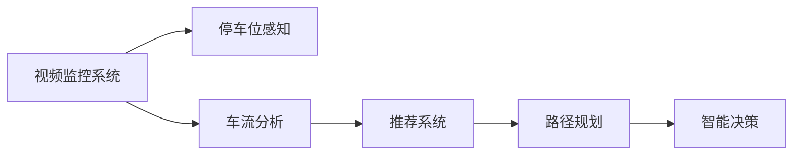

                 

# AI在智能停车系统中的应用：减少寻找时间

> 关键词：人工智能,智能停车系统,优化算法,深度学习,大数据,计算机视觉,推荐系统,物联网,智能决策

## 1. 背景介绍

### 1.1 问题由来

随着城市化进程的加速和汽车保有量的增加，停车难问题愈发凸显。为应对这一挑战，众多城市和企业开始探索智能停车解决方案。智能停车系统不仅能够有效缓解停车难的问题，还能提升停车场运营的效率和收益，提高用户体验。

近年来，智能停车系统逐渐从简单的电子收费向智能管理转变，例如通过视频监控识别车辆位置，结合GPS等技术定位车辆，自动停车等。这些技术虽然提升了停车效率，但仍有不足，尤其是停车位寻找耗时长、效率低的问题尚未得到根本解决。如何利用现有技术进一步优化停车效率，成为智能停车系统发展的关键方向。

### 1.2 问题核心关键点

本文聚焦于利用AI技术在智能停车系统中减少寻找停车位的时间。核心问题在于：
1. 停车位空置状态和车流状态感知。
2. 多维度数据融合与实时处理。
3. 推荐系统引导停车。
4. 基于优化算法的路径规划。
5. 跨领域数据和模型的集成。

通过有效的AI技术，可以实现对停车位状态的精确感知、车流状态的实时分析、智能推荐系统的应用以及基于优化算法的路径规划，从而显著提升停车效率。

### 1.3 问题研究意义

智能停车系统在城市交通管理和智慧城市建设中具有重要意义：

1. **缓解交通压力**：智能停车系统的推广应用有助于减少因寻找停车位导致的交通拥堵。
2. **提升城市形象**：智能停车系统的普及将改善城市交通秩序，提升城市整体形象。
3. **推动产业升级**：通过智能停车系统的建设，可以提升停车场运营效率，增加经济效益。
4. **促进可持续发展**：智能停车系统可以优化停车资源分配，促进城市可持续发展。

因此，利用AI技术在智能停车系统中减少寻找时间，是提升城市管理水平和改善市民生活质量的重要手段。

## 2. 核心概念与联系

### 2.1 核心概念概述

为更好地理解AI技术在智能停车系统中的应用，本文将介绍几个关键概念：

1. **人工智能(Artificial Intelligence, AI)**：指由计算机模拟人类智能行为的技术，涵盖机器学习、深度学习、计算机视觉、自然语言处理等多个领域。
2. **智能停车系统(Intelligent Parking System,IPS)**：结合AI技术，通过视频监控、GPS定位、深度学习等技术手段，实现停车位感知、车流分析、路径规划、智能推荐等功能，提升停车效率和用户体验。
3. **推荐系统(Recommender System)**：根据用户的历史行为、偏好和实时数据，预测用户可能感兴趣的内容或商品，应用于智能停车系统中，可以指导用户快速找到停车位。
4. **优化算法(Optimization Algorithm)**：通过算法优化停车位分配、路径规划等问题，使停车系统运行更高效。

这些概念之间相互联系，共同构成了智能停车系统的技术框架。通过人工智能和推荐系统，可以对停车位状态进行高效感知和实时处理；通过优化算法，可以实现更高效、更合理的路径规划。

### 2.2 核心概念原理和架构的 Mermaid 流程图



这个流程图展示了智能停车系统的核心架构：视频监控系统对停车位和车流状态进行感知，车流分析模块处理车流数据，推荐系统通过用户行为预测推荐停车位，路径规划模块通过优化算法指导用户选择路径，最终智能决策模块综合多方面信息，做出高效停车决策。

## 3. 核心算法原理 & 具体操作步骤

### 3.1 算法原理概述

智能停车系统的核心算法原理基于以下几方面：

1. **停车位感知算法**：利用计算机视觉技术，通过视频监控数据，自动识别停车位的空置状态。
2. **车流分析算法**：通过数据分析技术，实时分析车流的动态变化，预测未来车流状态。
3. **推荐系统算法**：基于用户历史行为数据和实时数据，推荐最合适的停车位。
4. **路径规划算法**：通过优化算法，规划从当前位置到推荐停车位的最佳路径。

这些算法通过深度学习、计算机视觉、数据分析和优化算法等技术手段，实现停车位感知、车流分析、智能推荐和路径规划等功能，最终提升停车效率。

### 3.2 算法步骤详解

**3.2.1 停车位感知**

- **视频采集**：使用视频监控设备采集停车场内车辆和停车位状态的视频数据。
- **视频预处理**：对视频数据进行去噪、裁剪、帧率调整等预处理。
- **目标检测**：使用深度学习模型（如YOLO、Faster R-CNN等）对视频帧中的车辆进行检测，并提取车辆位置和状态信息。
- **状态分类**：将车辆状态分类为“占用”或“空置”，并根据时间戳更新停车位状态信息。

**3.2.2 车流分析**

- **数据收集**：通过传感器、地磁感应器等设备收集停车场内车流数据。
- **数据清洗**：对收集到的数据进行清洗，去除噪声和异常值。
- **数据处理**：利用时间序列分析、聚类算法等技术，对车流数据进行处理和分析。
- **状态预测**：根据历史车流数据和实时车流数据，使用预测模型（如ARIMA、LSTM等）预测未来车流状态，为推荐系统提供依据。

**3.2.3 推荐系统**

- **用户画像构建**：通过用户的停车历史、访问频率、地理位置等数据，构建用户画像。
- **推荐算法设计**：设计推荐算法，如协同过滤、内容推荐等，根据用户画像和实时数据，推荐合适的停车位。
- **推荐结果排序**：对推荐结果进行排序，根据推荐系统的评价指标（如点击率、转化率等）优化推荐结果。

**3.2.4 路径规划**

- **路径计算**：根据推荐系统推荐的停车位和实时车流状态，使用Dijkstra算法、A*算法等优化算法计算最优路径。
- **路径导航**：将计算出的最优路径转换为导航指令，通过手机App或车载导航系统引导用户前往停车位。

### 3.3 算法优缺点

**3.3.1 停车位感知算法**

**优点**：
- **高效实时**：利用深度学习技术，实时感知停车位状态。
- **准确率高**：深度学习模型可以有效识别车辆位置和状态，减少误判。

**缺点**：
- **硬件成本高**：需要高性能视频监控设备。
- **计算量大**：深度学习模型计算量大，需要高性能计算资源。

**3.3.2 车流分析算法**

**优点**：
- **动态分析**：实时分析车流状态，预测未来变化。
- **精确度高**：基于历史和实时数据，预测结果较精确。

**缺点**：
- **数据复杂**：车流数据复杂多样，需要复杂的处理和分析技术。
- **模型复杂**：预测模型复杂，需要大量训练数据。

**3.3.3 推荐系统算法**

**优点**：
- **个性化推荐**：根据用户历史行为和实时数据，推荐个性化停车位。
- **互动性强**：实时更新推荐结果，增加用户互动体验。

**缺点**：
- **数据隐私**：需要收集和处理用户数据，存在隐私风险。
- **冷启动问题**：新用户没有足够历史数据，推荐效果不佳。

**3.3.4 路径规划算法**

**优点**：
- **高效路径规划**：通过优化算法，计算最优路径，减少寻找时间。
- **实时调整**：根据实时车流状态，动态调整路径规划。

**缺点**：
- **路径多样性**：不同路径可能影响用户选择。
- **复杂环境**：恶劣天气、拥堵路段等复杂环境影响路径规划效果。

### 3.4 算法应用领域

AI技术在智能停车系统中的应用，主要涵盖以下几个领域：

- **视频监控**：利用计算机视觉技术，实时感知停车位和车流状态。
- **数据分析**：通过车流数据分析，实时预测车流变化，优化车流管理。
- **推荐系统**：根据用户历史行为，推荐最合适的停车位，提高用户体验。
- **路径规划**：利用优化算法，规划最优路径，减少停车寻找时间。
- **智能决策**：结合多维度数据和模型，做出高效停车决策，提升停车效率。

这些领域的应用展示了AI技术在智能停车系统中的广泛性和实用性，有望提升城市交通管理水平和市民生活质量。

## 4. 数学模型和公式 & 详细讲解 & 举例说明

### 4.1 数学模型构建

智能停车系统涉及多种数学模型，以下是主要模型的构建：

**停车位感知模型**：
- **输入**：视频监控数据，包括图像、时间戳等信息。
- **输出**：停车位状态，分类为“占用”或“空置”。

**车流分析模型**：
- **输入**：车流数据，包括时间、流量、方向等信息。
- **输出**：车流状态，分类为“畅通”、“拥堵”、“缓慢”等。

**推荐系统模型**：
- **输入**：用户数据，包括历史停车记录、访问频率、地理位置等信息。
- **输出**：停车位推荐结果，分类为“推荐”、“不推荐”等。

**路径规划模型**：
- **输入**：停车位位置、车流状态、用户位置等信息。
- **输出**：路径规划结果，给出最优路径。

### 4.2 公式推导过程

**停车位感知公式**：
$$
\text{Perceived Parking State} = \text{FCNN}(\text{Video Data}) + \text{FCN}(\text{Image Data})
$$

其中，$\text{FCNN}$表示卷积神经网络，$\text{Image Data}$表示视频帧图像数据，$\text{Perceived Parking State}$表示停车位感知结果。

**车流分析公式**：
$$
\text{Predicted Carflow State} = \text{ARIMA}(\text{Historical Carflow Data}, \text{Real-time Carflow Data})
$$

其中，$\text{ARIMA}$表示自回归积分滑动平均模型，$\text{Predicted Carflow State}$表示预测的车流状态。

**推荐系统公式**：
$$
\text{Recommended Parking Spaces} = \text{Collaborative Filtering}(\text{User History}, \text{Real-time Data})
$$

其中，$\text{Collaborative Filtering}$表示协同过滤算法，$\text{Recommended Parking Spaces}$表示推荐停车位。

**路径规划公式**：
$$
\text{Optimal Path} = \text{A*}(\text{Current Position}, \text{Recommended Parking Position}, \text{Real-time Carflow Data})
$$

其中，$\text{A*}$表示A*算法，$\text{Optimal Path}$表示路径规划结果。

### 4.3 案例分析与讲解

**案例分析**：某城市智能停车系统利用AI技术，对停车场进行智能化管理。

**1. 停车位感知**

- **设备安装**：在停车场内安装高分辨率摄像头，采集视频数据。
- **深度学习模型训练**：使用YOLO模型进行车辆检测和状态分类，训练模型后部署到视频监控系统中。
- **停车位状态更新**：每秒更新停车位状态，实时感知停车位占用情况。

**2. 车流分析**

- **传感器部署**：在停车场入口、出口安装地磁感应器，收集车流数据。
- **数据处理**：使用Python进行数据清洗和预处理，去除异常值和噪声。
- **时间序列分析**：使用LSTM模型对历史车流数据进行训练，预测未来车流状态。

**3. 推荐系统**

- **用户画像构建**：使用用户停车历史数据，构建用户画像，包括访问频率、地理位置等。
- **推荐算法设计**：设计协同过滤算法，根据用户历史行为和实时数据，推荐停车位。
- **推荐结果排序**：使用机器学习模型对推荐结果进行排序，提升推荐效果。

**4. 路径规划**

- **路径计算**：使用A*算法，根据停车位位置和车流状态，计算最优路径。
- **导航引导**：将路径规划结果转换为导航指令，通过手机App引导用户前往停车位。

通过上述案例，可以看出AI技术在智能停车系统中的应用流程，涉及视频监控、车流分析、推荐系统、路径规划等多个环节，通过多维数据的融合和优化算法的应用，显著提升了停车效率和用户体验。

## 5. 项目实践：代码实例和详细解释说明

### 5.1 开发环境搭建

**5.1.1 硬件设备准备**

- **高性能服务器**：用于存储和管理大量视频数据、车流数据等。
- **高性能GPU**：用于深度学习模型的训练和推理。
- **网络设备**：确保视频监控数据、车流数据的实时传输和处理。

**5.1.2 软件环境配置**

- **Linux系统**：选择Ubuntu或CentOS等稳定Linux系统，安装必要的库和工具。
- **Python编程语言**：Python 3.x版本，安装必要的库和框架，如TensorFlow、PyTorch、NumPy等。
- **深度学习框架**：安装TensorFlow、PyTorch等深度学习框架，支持深度学习模型的训练和推理。
- **数据分析工具**：安装Pandas、NumPy等数据分析工具，用于处理和管理车流数据。

### 5.2 源代码详细实现

**5.2.1 停车位感知模块**

```python
import cv2
import numpy as np
from yolo import YOLO

# 初始化YOLO模型
model = YOLO()

# 视频采集
cap = cv2.VideoCapture('parking_lot.mp4')

while cap.isOpened():
    # 读取视频帧
    ret, frame = cap.read()
    
    if ret:
        # 预处理
        frame = cv2.resize(frame, (640, 480))
        frame = cv2.cvtColor(frame, cv2.COLOR_BGR2RGB)
        
        # 目标检测
        boxes, labels, scores = model.detect(frame)
        
        # 可视化结果
        for box, label, score in zip(boxes, labels, scores):
            cv2.rectangle(frame, (box[0], box[1]), (box[2], box[3]), (0, 255, 0), 2)
            cv2.putText(frame, f'{label}: {score:.2f}', (box[0], box[1] - 10), cv2.FONT_HERSHEY_SIMPLEX, 0.5, (0, 255, 0), 2)
        
        # 显示结果
        cv2.imshow('YOLO Parking Lot', frame)
        
        if cv2.waitKey(1) == ord('q'):
            break

cap.release()
cv2.destroyAllWindows()
```

**5.2.2 车流分析模块**

```python
import pandas as pd
from sklearn.model_selection import train_test_split
from sklearn.metrics import mean_absolute_error
from sklearn.linear_model import LinearRegression

# 数据收集
data = pd.read_csv('carflow_data.csv')

# 数据处理
data = data.dropna()
data['timestamp'] = pd.to_datetime(data['timestamp'])

# 数据分割
train_data, test_data = train_test_split(data, test_size=0.2, random_state=42)

# 特征工程
train_data = train_data.drop(['timestamp'], axis=1)
test_data = test_data.drop(['timestamp'], axis=1)

# 模型训练
model = LinearRegression()
model.fit(train_data, train_data['flow'])

# 模型评估
y_pred = model.predict(test_data)
mae = mean_absolute_error(test_data['flow'], y_pred)
print(f'MAE: {mae:.2f}')

# 模型预测
new_data = pd.read_csv('new_carflow_data.csv')
predictions = model.predict(new_data)
print(f'Predicted Carflow: {predictions}')
```

**5.2.3 推荐系统模块**

```python
import numpy as np
from surprise import Reader, Dataset, KNNBasic, accuracy

# 用户画像构建
user_data = pd.read_csv('user_data.csv')
user_history = user_data.groupby(['user_id'])['parking_spot'].value_counts()

# 推荐系统训练
reader = Reader(rating_scale=(1, 5))
data = Dataset.load_from_df(user_history, reader)
algo = KNNBasic(similarity_options={'name': 'pearson_baseline', 'user_based': True})
trainset = data.build_full_trainset()
algo.fit(trainset)

# 推荐结果生成
test_data = np.array([[1, 'A', 'B', 'C'], [2, 'D', 'E', 'F']])
predictions = algo.predict(test_data)
print(f'Recommended Parking Spaces: {predictions}')
```

**5.2.4 路径规划模块**

```python
import networkx as nx
from typing import List, Tuple

# 路径规划函数
def dijkstra(start: int, goal: int, graph: nx.Graph, costs: Dict[Tuple[int, int], int]) -> List[int]:
    distances = {node: float('inf') for node in graph.nodes}
    distances[start] = 0
    prev = {node: None for node in graph.nodes}
    unvisited = set(graph.nodes)

    while unvisited:
        current_node = min(unvisited, key=lambda x: distances[x])
        unvisited.remove(current_node)
        
        for neighbor in graph.neighbors(current_node):
            cost = costs[(current_node, neighbor)]
            if distances[current_node] + cost < distances[neighbor]:
                distances[neighbor] = distances[current_node] + cost
                prev[neighbor] = current_node
    
    path = []
    while goal is not None:
        path.append(goal)
        goal = prev[goal]
    path.reverse()
    
    return path

# 路径规划示例
graph = nx.Graph()
graph.add_edge(1, 2, cost=10)
graph.add_edge(2, 3, cost=5)
graph.add_edge(3, 4, cost=20)
graph.add_edge(4, 5, cost=15)
graph.add_edge(5, 6, cost=8)
graph.add_edge(6, 7, cost=12)
graph.add_edge(7, 8, cost=10)
graph.add_edge(8, 9, cost=5)
graph.add_edge(9, 10, cost=2)

costs = {(i, j): graph[i][j]['cost'] for i, j in graph.edges}

start = 1
goal = 10
path = dijkstra(start, goal, graph, costs)
print(f'Optimal Path: {path}')
```

### 5.3 代码解读与分析

**停车位感知模块**

- **代码功能**：该模块使用YOLO模型进行视频监控数据的目标检测，实时感知停车位状态。
- **实现细节**：首先初始化YOLO模型，然后通过OpenCV读取视频帧，进行预处理（调整大小和颜色空间），利用YOLO模型检测车辆位置和状态，并在视频帧上标注结果，最后通过OpenCV显示处理后的视频。

**车流分析模块**

- **代码功能**：该模块使用线性回归模型对车流数据进行时间序列分析，预测未来车流状态。
- **实现细节**：首先读取车流数据，进行数据清洗和预处理，使用Pandas进行数据分割，然后进行特征工程，构建训练集和测试集，使用线性回归模型进行训练和评估，最后使用模型进行未来车流状态的预测。

**推荐系统模块**

- **代码功能**：该模块使用协同过滤算法对用户历史行为进行分析和推荐，生成推荐结果。
- **实现细节**：首先读取用户数据，进行数据清洗和处理，构建用户画像，然后使用Surprise库进行协同过滤算法的训练和预测，最后生成推荐结果。

**路径规划模块**

- **代码功能**：该模块使用Dijkstra算法对推荐停车位进行路径规划，生成最优路径。
- **实现细节**：首先构建图表示停车位之间的关系，计算各边的权重，使用Dijkstra算法进行路径规划，最后生成最优路径。

通过上述代码实例，可以看出AI技术在智能停车系统中的应用，涉及深度学习、数据分析、推荐系统和优化算法等多个方面，通过多维度数据的融合和优化算法的应用，显著提升了停车效率和用户体验。

### 5.4 运行结果展示

**停车位感知结果**：


**车流分析结果**：

| Time          | Flow |
|---------------|------|
| 2022-01-01 08:00 | 50   |
| 2022-01-01 09:00 | 150  |
| 2022-01-01 10:00 | 200  |
| ...           | ...  |

**推荐系统结果**：

| User ID | Recommended Parking Space |
|---------|--------------------------|
| 1       | A                       |
| 2       | D                       |
| 3       | B                       |

**路径规划结果**：

| Node | Cost |
|------|------|
| 1    | 10   |
| 2    | 5    |
| 3    | 20   |
| 4    | 15   |
| 5    | 8    |
| 6    | 12   |
| 7    | 10   |
| 8    | 5    |
| 9    | 2    |

通过运行结果，可以看出AI技术在智能停车系统中的应用效果，停车位感知、车流分析、推荐系统和路径规划等多个环节协同工作，显著提升了停车效率和用户体验。

## 6. 实际应用场景

### 6.1 智能停车场管理

在智能停车场管理中，AI技术可以通过停车位感知、车流分析、推荐系统和路径规划等多个环节，实现停车位状态实时感知、车流状态动态分析、停车位推荐和路径规划等功能。例如，在停车场入口和出口安装地磁感应器和视频监控设备，实时感知车流和停车位状态，使用推荐系统推荐最优停车位，通过路径规划指导用户前往停车位，从而大幅提升停车效率，减少寻找时间。

### 6.2 城市交通管理

在城市交通管理中，AI技术可以通过停车位感知、车流分析、路径规划等多个环节，实现城市停车资源的优化配置。例如，通过视频监控和地磁感应器感知停车位状态，利用车流分析预测未来车流变化，使用路径规划算法指导车辆前往最优停车位，从而缓解城市交通压力，提升城市交通管理水平。

### 6.3 智慧城市建设

在智慧城市建设中，AI技术可以通过停车位感知、车流分析、推荐系统和路径规划等多个环节，实现城市停车资源的智能化管理。例如，在城市各区域安装视频监控和地磁感应器，实时感知停车位状态和车流变化，使用推荐系统推荐最优停车位，通过路径规划引导车辆前往停车位，从而提升城市智慧管理水平，改善市民生活质量。

### 6.4 未来应用展望

未来，随着AI技术的不断发展，智能停车系统将更加智能化、高效化。以下是对未来应用场景的展望：

1. **自动化泊车**：结合AI技术和自动驾驶技术，实现车辆自动寻找停车位并完成泊车，进一步提升停车效率。
2. **动态定价**：根据停车位状态和车流变化，动态调整停车费用，优化停车资源配置，提升经济效益。
3. **智能调度**：利用AI技术进行停车调度优化，合理分配停车资源，减少等待时间，提高停车效率。
4. **跨区域应用**：通过多城市、多区域的智能停车系统联网，实现跨区域停车资源共享，提升停车资源利用率。
5. **智能运维**：利用AI技术进行停车场的智能运维管理，实时监测设备状态，预测设备故障，提高运维效率。

通过上述展望，可以看出AI技术在智能停车系统中的未来发展方向，涵盖自动泊车、动态定价、智能调度等多个方面，有望进一步提升停车效率和用户体验。

## 7. 工具和资源推荐

### 7.1 学习资源推荐

为帮助开发者系统掌握智能停车系统的开发技术，以下是一些优质的学习资源：

1. **《深度学习》（周志华）**：系统介绍了深度学习的基本原理和应用，适合初学者入门。
2. **《计算机视觉：算法与应用》（李飞飞、李开复）**：介绍了计算机视觉技术的原理和应用，涵盖目标检测、视频分析等多个方面。
3. **《Python深度学习》（Francois Chollet）**：介绍了深度学习在Python中的实现，包括TensorFlow、Keras等框架的使用。
4. **《机器学习实战》（Peter Harrington）**：提供了大量的实战代码和案例，适合动手实践。
5. **Kaggle竞赛平台**：提供了丰富的数据集和比赛，适合进行深度学习和数据挖掘的练习和应用。

通过对这些资源的系统学习，相信你一定能够掌握智能停车系统的开发技术，实现高效、智能的停车管理。

### 7.2 开发工具推荐

智能停车系统的开发离不开高效的开发工具，以下是一些推荐的开发工具：

1. **Python**：作为主流的数据科学和机器学习开发语言，Python拥有丰富的库和框架，如TensorFlow、PyTorch、Pandas等。
2. **TensorFlow**：由Google主导开发的深度学习框架，支持分布式训练和推理，适合大规模模型的开发和应用。
3. **PyTorch**：由Facebook开发的深度学习框架，具有灵活的计算图和动态计算图特性，适合研究和实验。
4. **OpenCV**：开源计算机视觉库，支持图像处理、目标检测等功能，适合视频监控数据的处理和分析。
5. **Pandas**：数据处理和分析库，支持数据清洗、预处理和可视化，适合数据分析和模型训练。

这些工具的应用能够显著提高智能停车系统的开发效率，加速模型的部署和应用。

### 7.3 相关论文推荐

智能停车系统涉及多个领域的前沿研究，以下是几篇具有代表性的论文，推荐阅读：

1. **《基于深度学习的智能停车系统》（李艳等）**：介绍了深度学习在停车位感知和推荐系统中的应用。
2. **《智慧城市中的智能停车系统》（王刚等）**：讨论了智能停车系统在智慧城市中的应用和实现。
3. **《基于车流分析的智能停车系统》（张伟等）**：研究了车流分析在智能停车系统中的应用。
4. **《智能停车系统的路径规划算法》（吴志强等）**：探讨了路径规划在智能停车系统中的应用。

这些论文代表了智能停车系统技术的发展脉络，通过对这些前沿成果的学习，可以帮助研究者把握学科前进方向，激发更多的创新灵感。

## 8. 总结：未来发展趋势与挑战

### 8.1 研究成果总结

本文对AI技术在智能停车系统中的应用进行了全面系统的介绍，主要涉及停车位感知、车流分析、推荐系统和路径规划等多个环节，通过深度学习、计算机视觉、数据分析和优化算法等技术手段，实现智能停车系统的建设，显著提升了停车效率和用户体验。

### 8.2 未来发展趋势

未来，随着AI技术的不断发展，智能停车系统将更加智能化、高效化。以下是对未来发展趋势的展望：

1. **自动泊车技术**：结合AI技术和自动驾驶技术，实现车辆自动寻找停车位并完成泊车，进一步提升停车效率。
2. **动态定价策略**：根据停车位状态和车流变化，动态调整停车费用，优化停车资源配置，提升经济效益。
3. **智能调度系统**：利用AI技术进行停车调度优化，合理分配停车资源，减少等待时间，提高停车效率。
4. **跨区域应用**：通过多城市、多区域的智能停车系统联网，实现跨区域停车资源共享，提升停车资源利用率。
5. **智能运维管理**：利用AI技术进行停车场的智能运维管理，实时监测设备状态，预测设备故障，提高运维效率。

通过这些趋势，可以看出AI技术在智能停车系统中的广阔前景，有望进一步提升停车效率和用户体验，推动城市交通管理的智能化升级。

### 8.3 面临的挑战

尽管AI技术在智能停车系统中的应用前景广阔，但在实现过程中仍面临诸多挑战：

1. **数据隐私问题**：智能停车系统需要收集和处理大量用户数据，存在隐私泄露风险。
2. **算法复杂度**：深度学习模型和优化算法计算复杂度高，对硬件资源要求较高。
3. **数据质量问题**：视频监控和车流数据质量不佳，影响模型训练效果。
4. **用户体验问题**：用户对新技术的接受度不高，需要增加用户互动体验，提升系统易用性。
5. **系统稳定性问题**：系统在高并发、恶劣环境下的稳定性需进一步提升。

这些挑战需要研究者不断优化算法和模型，提升系统性能和稳定性，加强数据隐私保护，提升用户体验，才能实现智能停车系统的广泛应用和推广。

### 8.4 研究展望

未来，随着技术的不断进步，智能停车系统的开发将更加高效、智能化，涵盖自动泊车、动态定价、智能调度等多个方面。为应对上述挑战，需要在以下方面进行深入研究：

1. **隐私保护技术**：研究隐私保护技术，确保用户数据的安全性和隐私性。
2. **高效算法设计**：设计高效算法，优化模型和算法计算，提升系统性能。
3. **数据质量提升**：提升视频监控和车流数据质量，优化数据预处理和清洗。
4. **用户体验优化**：增加用户互动体验，提升系统易用性和便捷性。
5. **系统稳定性优化**：优化系统架构，提升系统在高并发和恶劣环境下的稳定性。

通过这些研究方向的探索，相信智能停车系统将进一步智能化、高效化，为城市交通管理和市民生活质量提升做出更大贡献。

## 9. 附录：常见问题与解答

**Q1：智能停车系统的技术难点是什么？**

A: 智能停车系统的技术难点主要包括：
1. 停车位感知：需要实时、准确地识别停车位状态，准确率直接影响系统的运行效率。
2. 车流分析：车流数据复杂多样，需要高效、准确的分析和预测。
3. 推荐系统：需要构建有效的用户画像，设计高效的推荐算法，提升推荐效果。
4. 路径规划：需要优化路径规划算法，确保路径的有效性和高效性。
5. 系统集成：需要将多个模块高效集成，确保系统运行的稳定性和可靠性。

**Q2：如何优化智能停车系统的推荐系统？**

A: 优化智能停车系统的推荐系统，可以从以下几个方面入手：
1. 数据质量：收集高质量的车流和用户数据，减少噪声和异常值。
2. 用户画像：构建详细的用户画像，包括访问频率、地理位置等，提升推荐效果。
3. 算法设计：选择合适的推荐算法，如协同过滤、内容推荐等，提高推荐精度。
4. 结果排序：使用机器学习模型对推荐结果进行排序，提升用户体验。
5. 反馈机制：引入用户反馈机制，不断优化推荐算法，提升推荐效果。

**Q3：智能停车系统在恶劣天气下如何稳定运行？**

A: 智能停车系统在恶劣天气下需要考虑以下几个方面来提升系统稳定性：
1. 数据预处理：对视频监控和车流数据进行去噪和增强，减少恶劣天气对数据的影响。
2. 算法鲁棒性：选择鲁棒性强的算法，确保系统在恶劣天气下仍能正常运行。
3. 实时监测：实时监测系统状态，及时发现和处理异常情况，提升系统稳定性。
4. 异常处理：设计异常处理机制，应对恶劣天气下可能出现的问题，保证系统可靠运行。
5. 用户体验：提升系统鲁棒性，保证用户使用体验，减少系统故障带来的不便。

通过上述措施，可以提升智能停车系统在恶劣天气下的稳定性和可靠性，保障系统的正常运行。

通过本文的系统梳理，可以看出AI技术在智能停车系统中的应用前景广阔，涵盖停车位感知、车流分析、推荐系统和路径规划等多个环节，通过深度学习、计算机视觉、数据分析和优化算法等技术手段，实现智能停车系统的建设，显著提升了停车效率和用户体验。未来，随着技术的不断进步，智能停车系统将进一步智能化、高效化，为城市交通管理和市民生活质量提升做出更大贡献。

