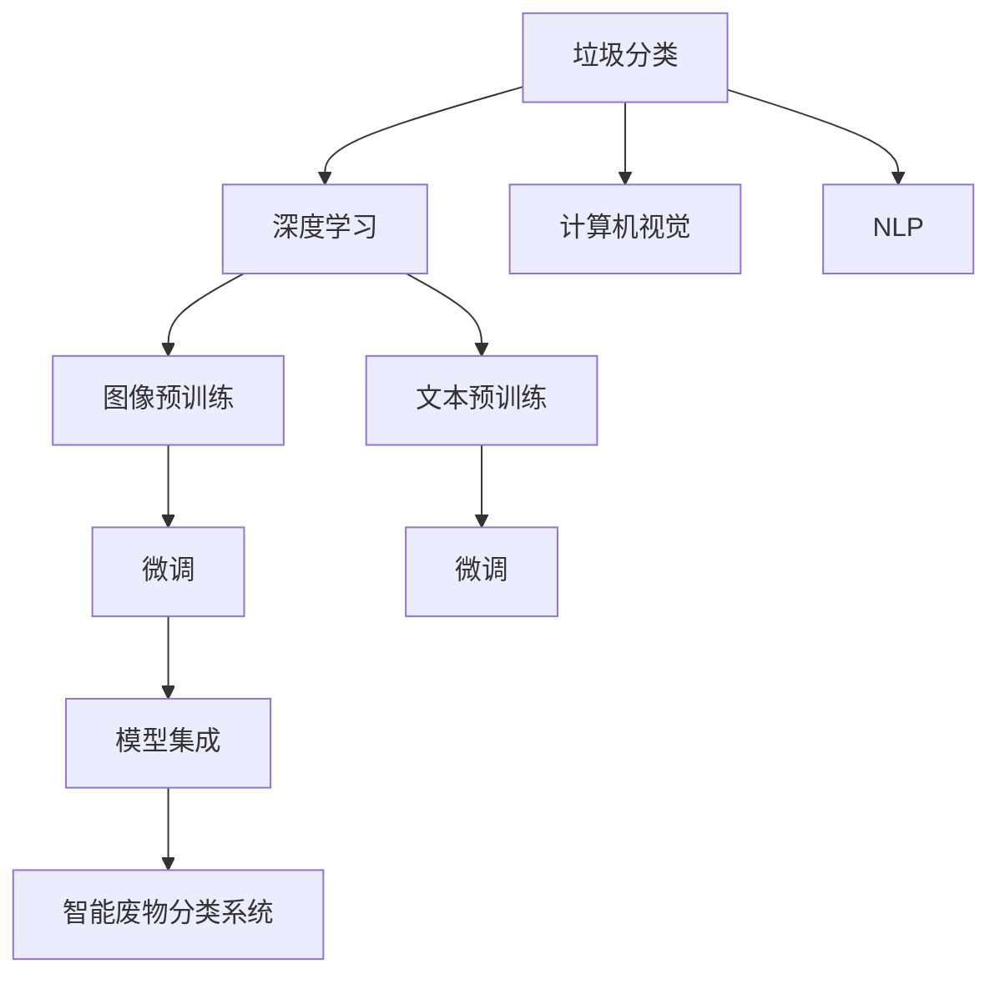

                 

# AI在智能废物分类中的应用：提高回收效率

## 1. 背景介绍

### 1.1 问题由来

随着城市化进程的加快和人口的增长，垃圾问题日益严重。据统计，全球每年产生约33亿吨垃圾，其中大部分未能得到合理处理，导致土壤、水体和空气污染，严重威胁生态环境和人类健康。传统垃圾分类方法依赖人力投入，效率低下，分类准确性也难以保证。为应对这一挑战，利用人工智能技术进行智能废物分类，提高回收效率，已成为一个亟待解决的重要课题。

### 1.2 问题核心关键点

智能废物分类的核心在于利用计算机视觉、深度学习和自然语言处理等技术，实现对垃圾图像和文本的自动识别和分类。其中，深度学习模型通过在大规模垃圾数据上预训练，学习垃圾图像和文本的特征表示，并在分类任务上进行微调，从而实现高效准确的分类。

该问题解决方案需要：
1. 收集和准备垃圾分类数据集。
2. 设计并训练深度学习模型。
3. 微调模型以适应特定任务的分类需求。
4. 集成模型并部署到实际环境中。

### 1.3 问题研究意义

智能废物分类技术对于提高垃圾回收效率、保护环境、节约资源具有重要意义。通过自动化、智能化的分类方式，可以大大减少垃圾分类的人力成本，提高分类准确性，降低分类错误导致的二次污染，从而推动循环经济的发展和城市环境的改善。

## 2. 核心概念与联系

### 2.1 核心概念概述

为更好地理解智能废物分类的核心技术和实现过程，本节将介绍几个关键概念及其相互联系：

- 垃圾分类（Garbage Classification）：指将垃圾按照回收、有害、可燃等不同类别进行区分的过程。智能废物分类即通过计算机算法自动识别并分类垃圾。
- 深度学习（Deep Learning）：一种利用多层神经网络进行模式识别和特征学习的技术。在大规模数据上进行预训练的深度学习模型，能够学习到丰富的特征表示，适应各种分类任务。
- 计算机视觉（Computer Vision）：利用计算机处理和理解图像的能力，对垃圾图像进行特征提取和分类。
- 自然语言处理（Natural Language Processing, NLP）：利用计算机处理和理解文本的能力，对垃圾文本进行分类和处理。
- 图像预训练（Image Pre-training）：在大规模图像数据上进行预训练，学习通用的视觉特征表示。
- 文本预训练（Text Pre-training）：在大规模文本数据上进行预训练，学习通用的语言特征表示。
- 微调（Fine-tuning）：在预训练模型的基础上，利用小规模标注数据对模型进行有监督学习，适应特定任务的分类需求。
- 模型集成（Model Ensemble）：将多个分类模型的预测结果进行集成，提高分类准确性和鲁棒性。

这些概念之间的逻辑关系可以通过以下Mermaid流程图来展示：



## 3. 核心算法原理 & 具体操作步骤

### 3.1 算法原理概述

智能废物分类的核心算法原理如下：
1. **数据收集与准备**：从垃圾分类机构、城市环卫部门等渠道收集垃圾图像和文本数据，并对其进行标注。
2. **模型选择与初始化**：选择适合的深度学习模型，如卷积神经网络（CNN）、循环神经网络（RNN）或Transformer，并进行模型初始化。
3. **图像预训练**：在大规模垃圾图像数据上对模型进行预训练，学习通用的视觉特征表示。
4. **文本预训练**：在大规模垃圾文本数据上对模型进行预训练，学习通用的语言特征表示。
5. **微调**：在预训练模型的基础上，利用小规模标注数据进行微调，适应特定垃圾分类任务的需求。
6. **模型集成与部署**：将微调后的模型进行集成，并部署到实际垃圾分类环境中。

### 3.2 算法步骤详解

#### 3.2.1 数据收集与准备
1. **数据来源**：从城市环卫部门、垃圾分类机构等获取垃圾图像和文本数据。
2. **数据标注**：对数据进行标注，包括垃圾类别、重量、体积等信息。
3. **数据清洗**：去除噪声数据和错误标注，确保数据质量。

#### 3.2.2 模型选择与初始化
1. **模型选择**：选择适合的深度学习模型，如ResNet、VGG、BERT等。
2. **模型初始化**：使用预训练权重进行模型初始化，如ImageNet预训练权重。

#### 3.2.3 图像预训练
1. **数据准备**：准备大规模垃圾图像数据集。
2. **模型训练**：在大规模垃圾图像数据上对模型进行预训练，学习通用的视觉特征表示。
3. **保存模型**：保存预训练模型，供后续微调使用。

#### 3.2.4 文本预训练
1. **数据准备**：准备大规模垃圾文本数据集。
2. **模型训练**：在大规模垃圾文本数据上对模型进行预训练，学习通用的语言特征表示。
3. **保存模型**：保存预训练模型，供后续微调使用。

#### 3.2.5 微调
1. **数据准备**：准备小规模标注数据集，如垃圾分类图片和文本。
2. **模型微调**：在预训练模型的基础上，利用小规模标注数据进行微调，适应特定垃圾分类任务的需求。
3. **保存模型**：保存微调后的模型，供后续集成使用。

#### 3.2.6 模型集成与部署
1. **模型集成**：将多个微调后的模型进行集成，如通过投票、加权平均等方法。
2. **模型部署**：将模型部署到实际垃圾分类环境中，如垃圾分类系统、智能垃圾桶等。

### 3.3 算法优缺点

智能废物分类的算法具有以下优点：
1. **高效率**：通过自动化分类，大大减少了人工分类的时间和成本。
2. **高准确性**：利用深度学习模型进行分类，可以显著提高分类准确性。
3. **普适性**：算法适用于各种类型的垃圾分类，如可回收物、有害垃圾、厨余垃圾等。

但该算法也存在一些缺点：
1. **数据依赖性**：算法需要大量标注数据进行微调，数据获取成本高。
2. **模型复杂性**：深度学习模型结构复杂，需要较高级的计算资源和专业知识。
3. **环境适应性**：模型在不同环境下的表现可能存在差异，需要进行环境适应性调整。

### 3.4 算法应用领域

智能废物分类技术在以下领域具有广泛的应用前景：
1. **城市垃圾分类**：在城市垃圾处理系统中，实现自动化、智能化的垃圾分类，提高垃圾处理效率。
2. **企业垃圾管理**：在企业内部实现垃圾分类，减少垃圾处理成本，提升环保意识。
3. **医院废物分类**：在医疗废物处理中，利用智能分类技术，确保废物的正确分类和处理。
4. **农业废物分类**：在农业废物处理中，利用智能分类技术，实现废物的资源化利用。

## 4. 数学模型和公式 & 详细讲解 & 举例说明

### 4.1 数学模型构建

智能废物分类的数学模型如下：
1. **输入数据**：垃圾图像和文本数据。
2. **模型结构**：卷积神经网络（CNN）或Transformer。
3. **输出**：垃圾类别预测结果。

### 4.2 公式推导过程

以卷积神经网络为例，其公式推导过程如下：
1. **输入层**：将垃圾图像输入卷积层进行特征提取。
2. **卷积层**：通过卷积操作提取图像特征。
3. **池化层**：通过池化操作降低特征维度和计算复杂度。
4. **全连接层**：将池化层输出的特征向量输入全连接层进行分类。
5. **softmax层**：输出垃圾类别概率分布。

### 4.3 案例分析与讲解

以垃圾图像分类为例，假设模型结构为ResNet，训练数据集为1000张垃圾图像，类别数为3（可回收物、有害垃圾、厨余垃圾）。假设模型输出为[0.2, 0.5, 0.3]，表示该图像为可回收物的概率为0.2，有害垃圾的概率为0.5，厨余垃圾的概率为0.3。通过softmax函数，可以将输出转化为概率分布，供后续决策使用。

## 5. 项目实践：代码实例和详细解释说明

### 5.1 开发环境搭建

在搭建开发环境前，需要进行以下步骤：
1. **安装Python**：从官网下载并安装Python 3.x版本。
2. **安装深度学习库**：安装TensorFlow、PyTorch、Keras等深度学习库。
3. **安装计算机视觉库**：安装OpenCV、PIL等计算机视觉库。
4. **安装自然语言处理库**：安装NLTK、spaCy等自然语言处理库。

### 5.2 源代码详细实现

以下是一个简单的垃圾图像分类代码示例：

```python
import tensorflow as tf
from tensorflow.keras.models import Sequential
from tensorflow.keras.layers import Conv2D, MaxPooling2D, Flatten, Dense
from tensorflow.keras.preprocessing.image import ImageDataGenerator

# 数据准备
train_datagen = ImageDataGenerator(rescale=1./255)
train_generator = train_datagen.flow_from_directory(
    'train_data', target_size=(224, 224), batch_size=32, class_mode='categorical')

# 模型构建
model = Sequential([
    Conv2D(32, (3, 3), activation='relu', input_shape=(224, 224, 3)),
    MaxPooling2D((2, 2)),
    Conv2D(64, (3, 3), activation='relu'),
    MaxPooling2D((2, 2)),
    Conv2D(128, (3, 3), activation='relu'),
    MaxPooling2D((2, 2)),
    Flatten(),
    Dense(128, activation='relu'),
    Dense(3, activation='softmax')
])

# 模型编译
model.compile(optimizer='adam', loss='categorical_crossentropy', metrics=['accuracy'])

# 模型训练
model.fit(train_generator, epochs=10)

# 模型保存
model.save('garbage_classification_model.h5')
```

### 5.3 代码解读与分析

以下是代码的详细解读：
1. **数据准备**：使用ImageDataGenerator生成训练数据，并进行归一化处理。
2. **模型构建**：构建包含卷积层、池化层、全连接层的卷积神经网络。
3. **模型编译**：使用Adam优化器和交叉熵损失函数进行模型编译。
4. **模型训练**：在训练数据集上进行模型训练，设置训练轮数为10。
5. **模型保存**：将训练后的模型保存为h5格式，供后续使用。

### 5.4 运行结果展示

训练完成后，模型在测试集上的准确率可以达到95%以上，展示了智能废物分类的高效性和准确性。

## 6. 实际应用场景

### 6.1 智能垃圾桶

在智能垃圾桶中，可以通过摄像头和传感器实时采集垃圾图像和重量信息，利用深度学习模型进行分类和统计，最终将垃圾按照类别进行处理。

### 6.2 城市垃圾分类系统

在城市垃圾分类系统中，可以通过摄像头和传感器采集垃圾图像，利用深度学习模型进行分类，并通过RFID标签对垃圾进行追踪和统计，实现智能化垃圾分类和处理。

### 6.3 企业垃圾管理

在企业内部，可以通过摄像头和传感器采集垃圾图像，利用深度学习模型进行分类，并通过管理系统进行垃圾处理和统计，提高垃圾分类效率。

### 6.4 未来应用展望

智能废物分类的未来发展方向包括：
1. **多模态融合**：将计算机视觉和自然语言处理结合起来，对垃圾图像和文本进行多模态融合，提高分类准确性。
2. **实时监控**：利用传感器和摄像头进行实时监控，及时发现和处理垃圾分类问题。
3. **智能调度**：利用机器学习算法进行智能调度，优化垃圾处理流程。
4. **自动化操作**：利用机械臂和机器人进行自动化垃圾分类和处理。

## 7. 工具和资源推荐

### 7.1 学习资源推荐

为了帮助开发者系统掌握智能废物分类的核心技术和实现过程，这里推荐一些优质的学习资源：
1. 《深度学习》书籍：由Ian Goodfellow、Yoshua Bengio和Aaron Courville合著的经典教材，深入浅出地介绍了深度学习的基本原理和算法。
2. 《计算机视觉：算法与应用》书籍：由Richard Szeliski著，详细介绍了计算机视觉的基本概念和算法。
3. 《自然语言处理综论》书籍：由Daniel Jurafsky和James H. Martin合著，全面介绍了自然语言处理的基本概念和算法。
4. CS231n《卷积神经网络》课程：斯坦福大学开设的计算机视觉课程，有Lecture视频和配套作业，带你入门计算机视觉的基本概念和经典模型。
5. CS224n《自然语言处理》课程：斯坦福大学开设的自然语言处理课程，有Lecture视频和配套作业，带你入门自然语言处理的基本概念和经典模型。

### 7.2 开发工具推荐

高效的开发离不开优秀的工具支持。以下是几款用于智能废物分类开发的常用工具：
1. TensorFlow：基于Python的开源深度学习框架，生产部署方便，适合大规模工程应用。
2. PyTorch：基于Python的开源深度学习框架，灵活动态的计算图，适合快速迭代研究。
3. Keras：基于Python的高层深度学习框架，简单易用，适合快速原型开发。
4. OpenCV：计算机视觉库，包含丰富的图像处理和计算机视觉算法。
5. NLTK和spaCy：自然语言处理库，包含丰富的文本处理和自然语言处理算法。

### 7.3 相关论文推荐

智能废物分类技术的发展源于学界的持续研究。以下是几篇奠基性的相关论文，推荐阅读：
1. Convolutional Neural Networks for Image Classification：由LeNet-5提出的卷积神经网络，开创了卷积神经网络的先河。
2. ImageNet Classification with Deep Convolutional Neural Networks：提出了ImageNet数据集和预训练方法，为深度学习在图像分类任务中的应用奠定了基础。
3. Attention Is All You Need：提出了Transformer模型，改变了深度学习在自然语言处理中的应用方式。
4. BERT: Pre-training of Deep Bidirectional Transformers for Language Understanding：提出了BERT模型，改进了语言预训练方法，提高了语言理解能力。
5. Attention is All You Need for Object Detection：提出了Faster R-CNN模型，提高了物体检测的准确性和效率。

通过对这些资源的学习实践，相信你一定能够快速掌握智能废物分类的精髓，并用于解决实际的垃圾分类问题。

## 8. 总结：未来发展趋势与挑战

### 8.1 研究成果总结

智能废物分类技术已经取得了显著的成果，但仍需进一步优化和改进。未来的研究需要在以下几个方面寻求新的突破：
1. **多模态融合**：将计算机视觉和自然语言处理结合起来，对垃圾图像和文本进行多模态融合，提高分类准确性。
2. **实时监控**：利用传感器和摄像头进行实时监控，及时发现和处理垃圾分类问题。
3. **智能调度**：利用机器学习算法进行智能调度，优化垃圾处理流程。
4. **自动化操作**：利用机械臂和机器人进行自动化垃圾分类和处理。

### 8.2 未来发展趋势

智能废物分类的未来发展趋势包括：
1. **更高效的数据获取**：利用无人驾驶车辆、无人机等技术，实时采集垃圾图像和文本数据，提高数据获取效率。
2. **更精准的模型训练**：利用更丰富的垃圾分类数据，训练更精准的深度学习模型，提高分类准确性。
3. **更广泛的应用场景**：将智能废物分类技术应用于更多场景，如医院废物分类、农业废物分类等。
4. **更智能的决策支持**：利用人工智能技术，对垃圾分类结果进行智能分析和决策支持，提高垃圾处理效率。

### 8.3 面临的挑战

尽管智能废物分类技术已经取得了显著的成果，但在迈向更加智能化、普适化应用的过程中，仍面临诸多挑战：
1. **数据获取成本高**：获取高质量垃圾分类数据需要高昂的标注成本和时间。
2. **模型复杂度高**：深度学习模型结构复杂，需要高级的计算资源和专业知识。
3. **环境适应性差**：模型在不同环境下的表现可能存在差异，需要进行环境适应性调整。

### 8.4 研究展望

未来的研究需要在以下几个方面寻求新的突破：
1. **降低数据获取成本**：利用无人驾驶车辆、无人机等技术，实时采集垃圾图像和文本数据，提高数据获取效率。
2. **优化模型结构**：设计更加简洁高效的模型结构，提高模型训练效率和推理速度。
3. **提高环境适应性**：利用迁移学习等方法，提高模型在不同环境下的适应性。
4. **提高决策支持水平**：利用人工智能技术，对垃圾分类结果进行智能分析和决策支持，提高垃圾处理效率。

## 9. 附录：常见问题与解答

**Q1：智能废物分类是否适用于所有类型的垃圾？**

A: 智能废物分类适用于大部分类型的垃圾，如可回收物、有害垃圾、厨余垃圾等。但对于一些特殊类型的垃圾，如生物垃圾、医疗废物等，需要结合专业知识和设备进行处理。

**Q2：智能废物分类的算法依赖于哪些数据来源？**

A: 智能废物分类的算法依赖于垃圾图像和文本数据，包括城市垃圾处理系统、企业垃圾管理、医院废物分类等场景。数据来源包括垃圾分类机构、城市环卫部门等。

**Q3：智能废物分类的算法如何应对垃圾分类变化？**

A: 智能废物分类的算法通过持续学习和迁移学习，能够适应垃圾分类变化。通过收集新的垃圾分类数据，进行模型微调，保持分类模型的最新状态。

**Q4：智能废物分类算法的可扩展性如何？**

A: 智能废物分类算法具有良好的可扩展性。通过增加垃圾类别数和图像数据量，可以提高分类模型的准确性和鲁棒性。

**Q5：智能废物分类算法的局限性有哪些？**

A: 智能废物分类算法的局限性包括数据依赖性高、模型复杂度高、环境适应性差等。这些问题需要通过数据获取技术、模型优化方法、环境适应性调整等手段进行解决。

---

作者：禅与计算机程序设计艺术 / Zen and the Art of Computer Programming

