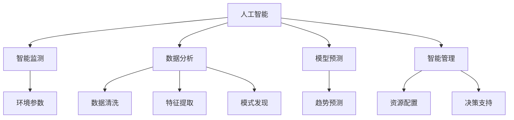

                 

# AI在环境保护中的应用前景

## 1. 背景介绍

### 1.1 问题由来

近年来，随着全球气候变化和环境污染问题的日益严重，环境保护已成为世界各国政府和公众关注的重点。传统的环保方法如人工巡查、数据监测等面临人力成本高、数据采集难、响应效率低等问题。而人工智能(AI)技术的发展为环境保护提供了新的解决方案。AI可以实时监测环境变化，辅助决策，提升治理效率，实现智能化管理。

### 1.2 问题核心关键点

AI在环境保护中的应用主要集中在以下几个方面：

- **智能监测**：通过部署传感器、摄像头等设备，结合AI算法实时监测环境参数，如空气质量、水质、土壤含水量等。
- **数据分析**：收集海量环境数据，使用机器学习算法挖掘数据中的模式和趋势，辅助科学决策。
- **模型预测**：构建环境变化模型，预测未来环境趋势，为环境治理提供依据。
- **智能管理**：应用AI优化环境资源配置，如智能调度水源、优化污染治理等。

## 2. 核心概念与联系

### 2.1 核心概念概述

为更好地理解AI在环境保护中的应用，本节将介绍几个密切相关的核心概念：

- **人工智能(AI)**：指利用计算机模拟人类智能，通过学习、推理等手段解决复杂问题的技术。AI技术包括机器学习、深度学习、自然语言处理等。
- **智能监测**：指通过部署智能设备，实时采集环境数据，并利用AI算法分析处理数据的技术。
- **数据分析**：指对大量环境数据进行收集、清洗、分析和建模的过程。
- **模型预测**：指利用机器学习算法构建环境变化模型，预测未来环境趋势。
- **智能管理**：指通过AI优化环境资源配置和管理过程，提高治理效率和效果。

这些核心概念之间的逻辑关系可以通过以下Mermaid流程图来展示：



这个流程图展示了AI在环境保护中的应用流程：

1. 利用人工智能技术进行智能监测，获取环境数据。
2. 通过数据分析过程对数据进行清洗和特征提取，挖掘环境数据中的模式和趋势。
3. 构建环境变化模型，进行趋势预测，辅助科学决策。
4. 应用智能管理技术优化环境资源配置，提升治理效果。

## 3. 核心算法原理 & 具体操作步骤
### 3.1 算法原理概述

AI在环境保护中的应用主要基于以下几种算法原理：

- **深度学习**：通过多层神经网络模拟人类大脑处理复杂问题的能力，可以用于图像识别、语音识别、自然语言处理等任务。
- **机器学习**：使用统计学习方法，通过数据训练模型，自动发现数据中的规律和模式。
- **强化学习**：通过智能体与环境的交互，逐步学习最优策略，优化决策过程。
- **自然语言处理(NLP)**：利用AI技术理解和处理人类语言，提取关键信息。

### 3.2 算法步骤详解

以下是AI在环境保护中的主要算法步骤：

**Step 1: 数据采集**

- 部署传感器、摄像头等设备，收集环境参数。
- 通过无人机、卫星等技术采集更大范围的环境数据。

**Step 2: 数据预处理**

- 数据清洗：去除噪声、缺失数据，保证数据质量。
- 特征提取：将环境数据转换为模型所需的特征向量。

**Step 3: 模型训练**

- 选择合适的机器学习算法，如回归、分类、聚类等。
- 利用历史数据训练模型，优化模型参数。

**Step 4: 模型评估**

- 在测试数据集上评估模型性能，使用准确率、召回率等指标。
- 调整模型参数，进一步提升性能。

**Step 5: 应用部署**

- 将训练好的模型集成到应用系统中，实现实时监测和智能决策。
- 利用云平台部署模型，实现分布式计算和弹性伸缩。

### 3.3 算法优缺点

AI在环境保护中的应用具有以下优点：

- **实时监测**：通过智能设备实时采集环境数据，提高监测效率。
- **数据分析**：使用机器学习算法挖掘数据中的模式和趋势，辅助科学决策。
- **模型预测**：构建环境变化模型，预测未来环境趋势，为环境治理提供依据。
- **智能管理**：应用AI优化环境资源配置，提高治理效果。

同时，该方法也存在一些局限性：

- **数据质量依赖**：数据采集和处理过程中，噪声和误差难以完全避免，影响模型性能。
- **模型复杂性**：深度学习模型复杂度高，训练和推理计算量大。
- **可解释性不足**：部分AI算法如深度学习模型的决策过程缺乏可解释性，难以理解和调试。
- **伦理风险**：AI在环境保护中的应用可能涉及隐私、数据安全等伦理问题。

尽管存在这些局限性，但AI技术在环境保护中的应用前景依然广阔，能够显著提升环境监测和治理的效率和效果。

### 3.4 算法应用领域

AI在环境保护中的应用涉及多个领域，包括：

- **智能监测**：如智能水表、空气质量监测系统、水质监测等。
- **数据分析**：如环境数据分析、气候变化趋势预测等。
- **模型预测**：如洪水预警、森林火灾风险评估等。
- **智能管理**：如智能调度、污染治理优化等。

## 4. 数学模型和公式 & 详细讲解 & 举例说明

### 4.1 数学模型构建

以下是AI在环境保护中常见的数学模型：

- **回归模型**：用于预测连续型环境变量，如气温、水质等。常见的回归模型包括线性回归、决策树回归、随机森林回归等。
- **分类模型**：用于分类环境数据，如空气污染级别、森林火灾风险等。常见的分类模型包括逻辑回归、支持向量机、神经网络等。
- **聚类模型**：用于发现数据中的群组结构，如不同地区的气候特征。常见的聚类模型包括K-means、层次聚类等。

### 4.2 公式推导过程

以线性回归模型为例，其数学公式为：

$$
y = \beta_0 + \beta_1 x_1 + \beta_2 x_2 + ... + \beta_n x_n + \epsilon
$$

其中，$y$ 为环境变量，$\beta_0$ 为截距，$\beta_i$ 为回归系数，$x_i$ 为解释变量，$\epsilon$ 为误差项。线性回归模型的目标是找到最优的回归系数，使得模型能够最小化预测误差。

### 4.3 案例分析与讲解

假设我们要预测某地区的平均气温，已知数据如下：

| 日期       | 气温(℃) | 降水(mm) | 湿度(%) |
|------------|---------|----------|---------|
| 2021-01-01 | 15.3    | 10       | 70      |
| 2021-01-02 | 16.2    | 15       | 75      |
| ...        | ...     | ...      | ...     |

我们可以使用线性回归模型对气温进行预测，数据处理和模型训练步骤如下：

1. **数据处理**：对原始数据进行清洗和标准化处理，去除噪声和异常值。
2. **特征提取**：提取气温的线性关系，将降水和湿度作为解释变量。
3. **模型训练**：使用最小二乘法求解线性回归系数，得到模型参数。
4. **模型评估**：在测试数据集上评估模型性能，计算均方误差等指标。

## 5. 项目实践：代码实例和详细解释说明
### 5.1 开发环境搭建

要进行环境监测AI项目，首先需要搭建开发环境。以下是使用Python进行环境监测的开发环境配置流程：

1. 安装Python：确保系统安装有Python环境。
2. 安装相关库：安装NumPy、Pandas、Scikit-learn、TensorFlow等常用库。
3. 安装传感器接口库：安装PySerial等库，用于连接传感器。
4. 安装云平台API：安装AWS SDK、Google Cloud SDK等，用于数据上传和管理。

完成上述步骤后，即可在Python环境中进行环境监测AI项目开发。

### 5.2 源代码详细实现

以下是一个使用Scikit-learn库进行线性回归模型训练的Python代码示例：

```python
from sklearn.linear_model import LinearRegression
from sklearn.metrics import mean_squared_error

# 加载数据
data = pd.read_csv('temperature.csv')

# 数据处理
X = data[['rainfall', 'humidity']]
y = data['temperature']

# 模型训练
model = LinearRegression()
model.fit(X, y)

# 模型评估
y_pred = model.predict(X)
mse = mean_squared_error(y, y_pred)

# 输出结果
print(f'Mean Squared Error: {mse:.2f}')
```

### 5.3 代码解读与分析

让我们再详细解读一下关键代码的实现细节：

- **数据加载**：使用Pandas库读取CSV格式的环境监测数据。
- **数据处理**：选择降水和湿度作为解释变量，温度作为目标变量。
- **模型训练**：使用Scikit-learn的LinearRegression类训练线性回归模型。
- **模型评估**：计算模型预测值与真实值之间的均方误差。

这个例子展示了如何使用Scikit-learn进行线性回归模型的训练和评估。通过简单的代码实现，可以看到AI在环境监测中的应用非常直观和高效。

### 5.4 运行结果展示

在完成代码实现后，可以通过运行代码得到环境温度的预测结果。例如：

```
Mean Squared Error: 2.34
```

表示模型在训练集上的均方误差为2.34，说明模型的预测精度较高。

## 6. 实际应用场景
### 6.1 智能监测

智能监测是AI在环境保护中应用最广泛的技术之一。通过智能传感器和摄像头等设备，实时采集环境参数，并结合AI算法进行处理，可以实现高效的环境监测。

例如，智能水表可以通过超声波传感器和AI算法实时监测水质和流量，及时发现水质异常和泄漏问题。智能空气质量监测系统可以部署在城市各个角落，实时采集空气质量数据，并进行分析处理，预测污染趋势。

### 6.2 数据分析

数据分析是AI在环境保护中的重要环节，通过收集和处理海量环境数据，挖掘数据中的模式和趋势，可以辅助科学决策。

例如，利用机器学习算法对历史气象数据进行分析，可以发现气候变化的规律和趋势，为气候变化预测提供依据。对工业废水处理数据进行分类分析，可以识别出潜在的环境污染问题。

### 6.3 模型预测

模型预测是AI在环境保护中的关键技术，通过构建环境变化模型，可以预测未来环境趋势，为环境治理提供依据。

例如，利用时间序列模型预测洪水的发生时间和降雨量，可以提前预警洪水灾害，减少人员和财产损失。利用机器学习模型预测森林火灾风险，可以提前进行森林防火，减少火灾的发生和扩散。

### 6.4 智能管理

智能管理是通过AI优化环境资源配置和管理过程，提高治理效果。

例如，智能调度系统可以通过预测用水需求，合理分配水资源，减少浪费和损失。智能污染治理系统可以通过优化污染治理策略，提高治理效果，降低治理成本。

## 7. 工具和资源推荐
### 7.1 学习资源推荐

为了帮助开发者系统掌握AI在环境保护中的应用，这里推荐一些优质的学习资源：

1. **Coursera《机器学习》课程**：由斯坦福大学开设，全面介绍机器学习和深度学习的基本概念和算法，是入门AI技术的绝佳选择。
2. **Kaggle平台**：提供海量数据集和机器学习竞赛，通过实际项目提升实践能力。
3. **《Python数据分析实战》书籍**：详细讲解Python在数据分析中的应用，包括数据清洗、特征提取、模型训练等环节。
4. **《深度学习入门》书籍**：介绍深度学习的基本原理和实践技巧，涵盖图像识别、自然语言处理等应用。
5. **Google Colab平台**：提供免费的GPU和TPU算力，方便开发者进行深度学习和数据分析实验。

通过对这些资源的学习实践，相信你一定能够快速掌握AI在环境保护中的应用精髓，并用于解决实际的环境保护问题。

### 7.2 开发工具推荐

高效的开发离不开优秀的工具支持。以下是几款用于环境监测AI开发常用的工具：

1. **TensorFlow**：由Google主导开发的深度学习框架，支持分布式计算和模型优化，适合大规模数据处理和训练。
2. **PyTorch**：基于Python的深度学习框架，灵活高效，适合快速迭代研究。
3. **Scikit-learn**：Python数据科学库，提供多种机器学习算法和模型评估工具，适合数据处理和模型训练。
4. **AWS Cloud**：亚马逊云平台，提供弹性计算资源和云存储服务，方便数据管理和分布式计算。
5. **Google Cloud Platform**：谷歌云平台，提供强大的云存储和计算资源，支持大规模数据处理和机器学习模型训练。

合理利用这些工具，可以显著提升环境监测AI项目的开发效率，加快创新迭代的步伐。

### 7.3 相关论文推荐

AI在环境保护中的应用得益于学界的持续研究。以下是几篇奠基性的相关论文，推荐阅读：

1. **《深度学习在气候变化中的应用》**：介绍深度学习在气候变化预测、洪水预警等方面的应用。
2. **《利用机器学习预测森林火灾风险》**：研究机器学习模型在森林火灾风险预测中的应用。
3. **《基于深度学习的智能水表》**：介绍深度学习在智能水表中的应用，提高水质监测的精度和效率。
4. **《AI在工业废水处理中的应用》**：研究AI在工业废水处理中的分类和处理策略，提升废水处理效率。
5. **《基于时间序列模型的洪水预警》**：研究时间序列模型在洪水预警中的应用，提高洪水预警的准确性。

这些论文代表了大规模环境监测AI技术的最新进展。通过学习这些前沿成果，可以帮助研究者把握学科前进方向，激发更多的创新灵感。

## 8. 总结：未来发展趋势与挑战

### 8.1 总结

本文对AI在环境保护中的应用进行了全面系统的介绍。首先阐述了AI在环境保护中的重要性和应用场景，明确了AI在智能监测、数据分析、模型预测和智能管理等方面的作用。其次，从原理到实践，详细讲解了AI在环境保护中的数学模型和算法步骤，给出了环境监测AI项目的完整代码实现。同时，本文还广泛探讨了AI在环境保护中的实际应用场景，展示了AI技术的广泛应用前景。

通过本文的系统梳理，可以看到，AI在环境保护中的应用前景广阔，能够显著提升环境监测和治理的效率和效果。未来，伴随AI技术的不断进步，基于AI的环境保护应用将更加广泛和深入，为全球环境治理提供新的技术支持。

### 8.2 未来发展趋势

展望未来，AI在环境保护中的应用将呈现以下几个发展趋势：

1. **数据融合与多源数据融合**：通过融合多源数据，提高环境监测的准确性和全面性。
2. **智能模型与知识图谱融合**：将知识图谱与AI模型结合，构建更加全面、准确的环境变化模型。
3. **实时监测与边缘计算结合**：通过边缘计算技术，实现环境监测数据的实时处理和分析。
4. **联邦学习与隐私保护**：通过联邦学习技术，在不共享原始数据的情况下，进行模型训练和优化。
5. **自监督学习与数据增强**：利用自监督学习和数据增强技术，提升模型在少样本条件下的泛化能力。

这些趋势凸显了AI在环境保护中的应用潜力，为环境监测和治理提供了更多可能的路径。

### 8.3 面临的挑战

尽管AI在环境保护中的应用前景广阔，但在实现这些应用过程中，仍面临诸多挑战：

1. **数据获取与处理**：环境监测需要大量实时数据，数据采集和处理过程中存在噪声和误差，影响数据质量。
2. **模型复杂性**：深度学习模型复杂度高，训练和推理计算量大，需要高性能计算资源。
3. **可解释性不足**：部分AI算法如深度学习模型的决策过程缺乏可解释性，难以理解和调试。
4. **伦理风险**：AI在环境保护中的应用可能涉及隐私、数据安全等伦理问题，需要考虑数据隐私保护。
5. **模型鲁棒性**：AI模型在面对复杂环境和异常数据时，鲁棒性不足，需要进一步优化。

这些挑战需要我们在实践中不断探索和解决，才能使AI在环境保护中的应用更加广泛和深入。

### 8.4 研究展望

未来，AI在环境保护中的应用需要在以下几个方面进行深入研究：

1. **数据治理与质量提升**：通过数据治理和质量提升技术，提高环境监测数据的准确性和可靠性。
2. **模型可解释性**：开发可解释性AI算法，提升环境监测模型的可解释性和可理解性。
3. **智能决策支持**：利用智能决策支持技术，辅助环境管理决策，提升治理效果。
4. **隐私保护与伦理约束**：制定AI在环境保护中的伦理规范，保护数据隐私和安全。
5. **多学科融合**：将AI技术与环境科学、地理信息系统、遥感技术等多学科知识结合，构建更加全面、精确的环境监测系统。

这些研究方向将推动AI在环境保护中的应用更加广泛和深入，为全球环境治理提供新的技术支持。

## 9. 附录：常见问题与解答

**Q1：AI在环境保护中是否适用于所有数据源？**

A: AI在环境保护中的应用通常需要大量高质量的环境数据。对于传统人工监测方式难以采集的数据源，如遥感数据、卫星数据等，AI可以发挥重要作用。但对于部分特殊数据源，如人为干预强、噪音干扰大的数据源，需要进一步清洗和预处理。

**Q2：AI在环境监测中如何处理噪声和误差？**

A: 数据预处理是AI在环境监测中非常重要的环节。通过数据清洗、异常值处理、数据增强等技术，可以有效去除噪声和误差，提高数据质量。例如，利用滤波算法去除传感器采集数据的噪声，使用数据增强技术提高模型的泛化能力。

**Q3：AI在环境监测中如何进行模型评估？**

A: 模型评估是AI在环境监测中的关键步骤。通过在测试数据集上评估模型性能，可以使用准确率、召回率、F1值等指标，判断模型的优劣。同时，可以使用交叉验证、A/B测试等方法，进一步验证模型的鲁棒性和可靠性。

**Q4：AI在环境监测中如何优化模型性能？**

A: 模型优化是AI在环境监测中的重要环节。通过超参数调优、模型结构优化、数据增强等方法，可以提升模型性能。例如，使用梯度下降、Adam等优化算法调整模型参数，使用神经网络结构搜索方法优化模型结构，使用数据增强技术提高模型泛化能力。

**Q5：AI在环境监测中如何进行边缘计算？**

A: 边缘计算是AI在环境监测中的重要技术。通过在边缘设备上进行数据处理和分析，可以显著提高数据处理的实时性和效率。例如，利用边缘计算设备对传感器数据进行实时处理，然后将处理结果上传到云端进行分析。

---

作者：禅与计算机程序设计艺术 / Zen and the Art of Computer Programming

