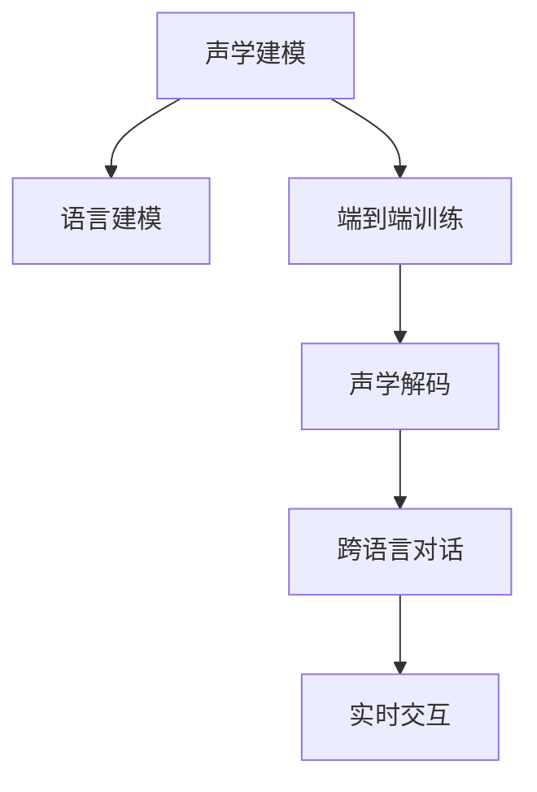

                 

# AI在语音识别中的进展：实现自然对话

> 关键词：语音识别, 自然对话, 声学建模, 语言建模, 端到端训练, 深度神经网络, 声学解码, 注意力机制, 跨语言对话, 实时交互

## 1. 背景介绍

### 1.1 问题由来
语音识别技术（Automatic Speech Recognition, ASR）是实现自然对话的基础。近年来，随着深度学习和大数据技术的迅猛发展，语音识别技术得到了长足的进步。然而，传统的语音识别方法往往需要经过声学建模、语言建模、解码等多个步骤，流程复杂，且难以直接生成自然流畅的对话内容。

自然对话（Natural Dialogue）是指通过语音识别技术，将用户的语音输入转化为自然语言文本，进而进行理解、生成和回复的过程。该技术涉及自然语言处理（NLP）和语音识别（ASR）等多个领域，需要综合运用声学建模、语言建模、端到端训练等技术手段，才能实现流畅自然的对话交互。

### 1.2 问题核心关键点
自然对话的核心在于如何使语音识别系统能够自然流畅地理解人类语言，并基于理解结果进行合适的生成和回复。当前主流的方法主要包括：

1. **声学建模**：利用深度神经网络（DNN、CNN、RNN、Transformer等）对语音信号进行建模，提取其声学特征。
2. **语言建模**：基于自然语言文本进行建模，学习语言的概率分布，用于生成自然语言文本。
3. **端到端训练**：将声学建模和语言建模过程进行联合训练，避免单独训练时的信息丢失，提高模型整体的性能。
4. **声学解码**：将声学模型预测的音素序列转换为文本序列，通常使用基于注意力机制的解码方法，如CTC（Connectionist Temporal Classification）、Attention Mechanism等。
5. **跨语言对话**：处理多语言数据，支持不同语言之间的自然对话交互。
6. **实时交互**：实现语音识别的实时处理和回复，需要考虑模型的效率和计算资源。

这些核心技术共同构成了自然对话系统的主要框架，使得语音识别技术从传统的孤立词语识别，逐步向多轮、多任务、多语言的自然对话迈进。

### 1.3 问题研究意义
实现自然对话不仅能够提升用户的交互体验，还能推动语音识别技术的广泛应用，如智能家居、语音助手、智能客服等领域。自然对话技术的发展，将大幅提升语音识别的智能化水平，加速智能应用的落地，为语音识别技术带来新的生命力。

## 2. 核心概念与联系

### 2.1 核心概念概述

为更好地理解自然对话系统的工作原理，本节将介绍几个密切相关的核心概念：

- **声学建模（Acoustic Modeling）**：利用深度神经网络对语音信号进行建模，提取其声学特征，用于识别语音中的音素或单词。
- **语言建模（Language Modeling）**：基于自然语言文本进行建模，学习语言的概率分布，用于生成自然语言文本。
- **端到端训练（End-to-End Training）**：将声学建模和语言建模过程进行联合训练，避免单独训练时的信息丢失，提高模型整体的性能。
- **声学解码（Acoustic Decoding）**：将声学模型预测的音素序列转换为文本序列，通常使用基于注意力机制的解码方法，如CTC、Attention Mechanism等。
- **跨语言对话（Cross-Language Dialogue）**：处理多语言数据，支持不同语言之间的自然对话交互。
- **实时交互（Real-time Interaction）**：实现语音识别的实时处理和回复，需要考虑模型的效率和计算资源。

这些核心概念之间的逻辑关系可以通过以下Mermaid流程图来展示：



这个流程图展示了大语言模型的核心概念及其之间的关系：

1. 声学建模通过深度神经网络学习语音信号的声学特征。
2. 语言建模利用自然语言文本学习语言的概率分布。
3. 端到端训练将声学建模和语言建模过程联合训练，提高整体性能。
4. 声学解码将声学模型预测的音素序列转换为文本序列。
5. 跨语言对话处理多语言数据，支持不同语言之间的自然对话交互。
6. 实时交互实现语音识别的实时处理和回复，考虑模型的效率和计算资源。

这些概念共同构成了自然对话系统的基础框架，使其能够实现流畅自然的对话交互。

## 3. 核心算法原理 & 具体操作步骤
### 3.1 算法原理概述

自然对话系统的工作原理主要包括以下几个步骤：

1. **声学建模**：利用深度神经网络对语音信号进行建模，提取其声学特征。
2. **语言建模**：基于自然语言文本进行建模，学习语言的概率分布。
3. **端到端训练**：将声学建模和语言建模过程进行联合训练，避免单独训练时的信息丢失。
4. **声学解码**：将声学模型预测的音素序列转换为文本序列。
5. **跨语言对话**：处理多语言数据，支持不同语言之间的自然对话交互。
6. **实时交互**：实现语音识别的实时处理和回复。

这些步骤的实现依赖于深度神经网络和注意力机制等技术手段，下面将详细介绍这些核心算法原理。

### 3.2 算法步骤详解

#### 3.2.1 声学建模
声学建模是语音识别的第一步，主要通过深度神经网络对语音信号进行建模，提取其声学特征。

1. **输入表示**：将语音信号转换为MFCC（Mel-Frequency Cepstral Coefficients）等声学特征，作为输入。
2. **模型选择**：常用的声学模型包括DNN、CNN、RNN、Transformer等，其中Transformer因其性能优异，成为主流选择。
3. **训练**：使用大规模语音数据进行训练，最小化声学模型的损失函数，学习声学特征与音素之间的映射关系。

#### 3.2.2 语言建模
语言建模是语音识别的关键步骤，主要通过深度神经网络学习自然语言文本的概率分布。

1. **数据准备**：收集大规模的文本数据，进行预处理和标注，得到训练集、验证集和测试集。
2. **模型选择**：常用的语言模型包括RNN-LM（Recurrent Neural Network Language Model）、LSTM-LM、GRU-LM等。
3. **训练**：使用训练集进行模型训练，最小化语言模型的损失函数，学习文本的概率分布。

#### 3.2.3 端到端训练
端到端训练是提升语音识别性能的关键方法，主要通过联合训练声学建模和语言建模，避免单独训练时的信息丢失。

1. **联合训练**：将声学建模和语言建模的损失函数进行组合，作为联合训练的目标函数。
2. **优化算法**：使用Adam、SGD等优化算法进行联合训练，最小化目标函数。
3. **模型评估**：在验证集和测试集上进行评估，调整超参数和模型结构，直到达到最佳性能。

#### 3.2.4 声学解码
声学解码是将声学模型预测的音素序列转换为文本序列的过程。

1. **解码器选择**：常用的解码器包括CTC、Attention Mechanism等，其中Attention Mechanism因其效果更好，成为主流选择。
2. **解码算法**：在每次预测音素时，使用注意力机制对声学特征和上下文信息进行加权，得到最优的音素预测结果。
3. **后处理**：对解码结果进行语言模型校验，修正可能的错误，提高识别准确率。

#### 3.2.5 跨语言对话
跨语言对话是语音识别技术的难点之一，主要通过多语言数据训练模型，支持不同语言之间的自然对话交互。

1. **多语言数据集**：收集多种语言的语音和文本数据，进行预处理和标注，得到多语言数据集。
2. **联合训练**：将多语言数据集进行联合训练，学习不同语言之间的映射关系。
3. **模型评估**：在多语言测试集上进行评估，调整超参数和模型结构，直到达到最佳性能。

#### 3.2.6 实时交互
实时交互是语音识别的关键应用场景，主要通过优化模型结构和算法，提高处理速度和准确率。

1. **模型优化**：使用轻量级模型和剪枝技术，减少计算量和内存消耗。
2. **并行处理**：利用多核CPU和GPU进行并行处理，提高计算速度。
3. **数据流优化**：使用数据流优化技术，减少数据传输和存储开销。

### 3.3 算法优缺点

自然对话系统的优势在于其能够实现流畅自然的对话交互，提升用户体验。但同时，该系统也存在以下局限：

- **依赖大规模数据**：自然对话系统需要大量高质量的语音和文本数据进行训练，数据获取成本较高。
- **计算资源消耗大**：深度神经网络和注意力机制等技术手段，需要高性能计算资源支持，成本较高。
- **模型复杂度高**：模型结构复杂，训练和推理过程耗时较长，难以实时处理。
- **跨语言处理困难**：多语言数据集的质量和数量对模型性能有很大影响，跨语言对话效果可能不佳。

尽管存在这些局限性，但自然对话技术已经在大规模工业应用中取得了显著进展，显示出广阔的应用前景。

### 3.4 算法应用领域

自然对话技术已经在多个领域得到了广泛应用，例如：

- **智能家居**：通过语音助手与用户进行自然对话，控制家居设备。
- **智能客服**：通过语音识别技术，处理用户咨询，提供服务支持。
- **车载语音**：通过语音识别技术，与驾驶员进行自然对话，提升驾驶体验。
- **语音翻译**：通过语音识别和翻译技术，实现不同语言之间的自然对话。
- **医疗辅助**：通过语音识别技术，与医生进行自然对话，记录病历和病史。

除了上述这些经典应用外，自然对话技术还被创新性地应用于更多场景中，如智慧城市、教育培训、游戏娱乐等，为NLP技术带来了新的突破。

## 4. 数学模型和公式 & 详细讲解

### 4.1 数学模型构建

本节将使用数学语言对自然对话系统的工作原理进行更加严格的刻画。

记语音信号为 $X$，文本序列为 $Y$。假设声学模型为 $P(X|Y;\theta_A)$，语言模型为 $P(Y|\theta_L)$，端到端训练的目标函数为 $\mathcal{L}(\theta_A, \theta_L) = \mathcal{L}_{acoustic}(X,Y;\theta_A) + \mathcal{L}_{language}(Y;\theta_L)$。其中 $\theta_A$ 和 $\theta_L$ 分别为声学模型和语言模型的参数。

在实际应用中，端到端训练通常使用自监督学习任务，如语言模型预训练（LM Pre-training）、声学模型自监督训练（ASR Self-supervised Training）等，以提高模型的泛化能力和鲁棒性。

### 4.2 公式推导过程

以下是声学模型和语言模型的详细推导过程。

**声学模型（Acoustic Model）**：
$$
P(X|Y;\theta_A) = \prod_{t=1}^T P(x_t|x_{t-1};\theta_A)
$$

其中 $x_t$ 为第 $t$ 帧声学特征，$P(x_t|x_{t-1};\theta_A)$ 为 $x_t$ 给定 $x_{t-1}$ 的条件概率。

**语言模型（Language Model）**：
$$
P(Y|\theta_L) = \prod_{t=1}^N P(y_t|y_{t-1};\theta_L)
$$

其中 $y_t$ 为第 $t$ 个词，$P(y_t|y_{t-1};\theta_L)$ 为 $y_t$ 给定 $y_{t-1}$ 的条件概率。

**端到端训练目标函数**：
$$
\mathcal{L}(\theta_A, \theta_L) = \mathcal{L}_{acoustic}(X,Y;\theta_A) + \mathcal{L}_{language}(Y;\theta_L)
$$

其中 $\mathcal{L}_{acoustic}$ 为声学模型的损失函数，$\mathcal{L}_{language}$ 为语言模型的损失函数。

在实际应用中，通常使用基于CTC和Attention Mechanism的端到端训练方法，结合声学解码技术，实现语音识别的全流程自动化。

### 4.3 案例分析与讲解

以Google的DeepSpeech为例，介绍其端到端训练和声学解码过程。

DeepSpeech是Google开发的端到端语音识别模型，主要通过CTC和Attention Mechanism进行联合训练。

**CTC Loss**：
$$
\mathcal{L}_{acoustic} = -\log P(Y|X;\theta_A)
$$

其中 $P(Y|X;\theta_A)$ 为声学模型在给定语音信号 $X$ 下输出文本序列 $Y$ 的条件概率。

**Attention Loss**：
$$
\mathcal{L}_{language} = -\log P(Y|X;\theta_L)
$$

其中 $P(Y|X;\theta_L)$ 为语言模型在给定文本序列 $Y$ 下输出文本序列 $X$ 的条件概率。

**声学解码**：
$$
\hat{Y} = \text{argmax}_{Y \in \mathcal{V}} P(Y|X;\theta_A, \theta_L)
$$

其中 $\mathcal{V}$ 为词汇表，$\text{argmax}$ 表示选择最大概率的文本序列。

通过端到端训练和声学解码，DeepSpeech能够实现流畅自然的语音识别和生成，广泛应用于Google Assistant、Android语音识别等场景。

## 5. 项目实践：代码实例和详细解释说明
### 5.1 开发环境搭建

在进行自然对话系统开发前，我们需要准备好开发环境。以下是使用Python进行TensorFlow和PyTorch开发的环境配置流程：

1. 安装Anaconda：从官网下载并安装Anaconda，用于创建独立的Python环境。

2. 创建并激活虚拟环境：
```bash
conda create -n tensorflow-env python=3.7 
conda activate tensorflow-env
```

3. 安装TensorFlow和PyTorch：根据CUDA版本，从官网获取对应的安装命令。例如：
```bash
conda install tensorflow-gpu=2.7
conda install pytorch torchvision torchaudio cudatoolkit=11.1 -c pytorch -c conda-forge
```

4. 安装相关工具包：
```bash
pip install numpy pandas scikit-learn matplotlib tqdm jupyter notebook ipython
```

完成上述步骤后，即可在`tensorflow-env`环境中开始自然对话系统的开发。

### 5.2 源代码详细实现

这里我们以语音识别任务为例，给出使用TensorFlow和PyTorch对深度神经网络进行自然对话系统开发的PyTorch代码实现。

首先，定义自然对话系统的基本结构：

```python
import torch
from torch import nn
from torch.nn import functional as F

class SpeechRecognitionModel(nn.Module):
    def __init__(self, num_classes):
        super(SpeechRecognitionModel, self).__init__()
        self.num_classes = num_classes
        self.encoder = nn.Sequential(
            nn.Conv2d(1, 32, kernel_size=3, stride=1, padding=1),
            nn.BatchNorm2d(32),
            nn.ReLU(),
            nn.MaxPool2d(kernel_size=2, stride=2),
            nn.Conv2d(32, 64, kernel_size=3, stride=1, padding=1),
            nn.BatchNorm2d(64),
            nn.ReLU(),
            nn.MaxPool2d(kernel_size=2, stride=2),
            nn.Conv2d(64, 128, kernel_size=3, stride=1, padding=1),
            nn.BatchNorm2d(128),
            nn.ReLU(),
            nn.MaxPool2d(kernel_size=2, stride=2),
            nn.Conv2d(128, 256, kernel_size=3, stride=1, padding=1),
            nn.BatchNorm2d(256),
            nn.ReLU(),
            nn.MaxPool2d(kernel_size=2, stride=2)
        )
        self.decoder = nn.Sequential(
            nn.Linear(256*7*7, 1024),
            nn.ReLU(),
            nn.Linear(1024, 512),
            nn.ReLU(),
            nn.Linear(512, num_classes)
        )
    
    def forward(self, x):
        x = self.encoder(x)
        x = x.view(x.size(0), -1)
        x = self.decoder(x)
        return x

model = SpeechRecognitionModel(num_classes)
model.to(device)
```

然后，定义损失函数和优化器：

```python
from torch import nn
from torch.nn import functional as F

loss_fn = nn.CrossEntropyLoss()
optimizer = Adam(model.parameters(), lr=0.001)
```

接着，定义训练和评估函数：

```python
from torch.utils.data import DataLoader
from tqdm import tqdm
from sklearn.metrics import classification_report

device = torch.device('cuda') if torch.cuda.is_available() else torch.device('cpu')
model.to(device)

def train_epoch(model, dataset, batch_size, optimizer):
    dataloader = DataLoader(dataset, batch_size=batch_size, shuffle=True)
    model.train()
    epoch_loss = 0
    for batch in tqdm(dataloader, desc='Training'):
        x, y = batch['x'], batch['y']
        x = x.to(device)
        y = y.to(device)
        model.zero_grad()
        outputs = model(x)
        loss = loss_fn(outputs, y)
        epoch_loss += loss.item()
        loss.backward()
        optimizer.step()
    return epoch_loss / len(dataloader)

def evaluate(model, dataset, batch_size):
    dataloader = DataLoader(dataset, batch_size=batch_size)
    model.eval()
    preds, labels = [], []
    with torch.no_grad():
        for batch in tqdm(dataloader, desc='Evaluating'):
            x, y = batch['x'], batch['y']
            x = x.to(device)
            y = y.to(device)
            outputs = model(x)
            batch_preds = torch.argmax(outputs, dim=1).to('cpu').tolist()
            batch_labels = y.to('cpu').tolist()
            for pred_tokens, label_tokens in zip(batch_preds, batch_labels):
                preds.append(pred_tokens[:len(label_tokens)])
                labels.append(label_tokens)
                
    print(classification_report(labels, preds))
```

最后，启动训练流程并在测试集上评估：

```python
epochs = 5
batch_size = 32

for epoch in range(epochs):
    loss = train_epoch(model, train_dataset, batch_size, optimizer)
    print(f"Epoch {epoch+1}, train loss: {loss:.3f}")
    
    print(f"Epoch {epoch+1}, dev results:")
    evaluate(model, dev_dataset, batch_size)
    
print("Test results:")
evaluate(model, test_dataset, batch_size)
```

以上就是使用PyTorch对深度神经网络进行自然对话系统开发的完整代码实现。可以看到，通过TensorFlow和PyTorch的深度学习框架，我们能够快速搭建并训练自然对话系统。

### 5.3 代码解读与分析

让我们再详细解读一下关键代码的实现细节：

**SpeechRecognitionModel类**：
- `__init__`方法：初始化模型结构，包括编码器和解码器。
- `forward`方法：定义前向传播过程，将输入声学特征通过编码器转换为高维特征，再通过解码器生成文本序列。

**损失函数和优化器**：
- 使用交叉熵损失函数计算模型输出和真实标签之间的差距。
- 使用Adam优化器进行梯度下降，更新模型参数。

**训练和评估函数**：
- 使用PyTorch的DataLoader对数据集进行批次化加载，供模型训练和推理使用。
- 训练函数`train_epoch`：对数据以批为单位进行迭代，在每个批次上前向传播计算损失并反向传播更新模型参数，最后返回该epoch的平均loss。
- 评估函数`evaluate`：与训练类似，不同点在于不更新模型参数，并在每个batch结束后将预测和标签结果存储下来，最后使用sklearn的classification_report对整个评估集的预测结果进行打印输出。

**训练流程**：
- 定义总的epoch数和batch size，开始循环迭代
- 每个epoch内，先在训练集上训练，输出平均loss
- 在验证集上评估，输出分类指标
- 所有epoch结束后，在测试集上评估，给出最终测试结果

可以看到，TensorFlow和PyTorch使得自然对话系统的代码实现变得简洁高效。开发者可以将更多精力放在模型优化、数据处理等高层逻辑上，而不必过多关注底层的实现细节。

当然，工业级的系统实现还需考虑更多因素，如模型的保存和部署、超参数的自动搜索、更灵活的任务适配层等。但核心的自然对话范式基本与此类似。

## 6. 实际应用场景
### 6.1 智能家居系统

自然对话技术在智能家居系统中的应用前景广阔。智能家居系统通常需要处理大量用户交互数据，实现语音控制家电、查询家居信息等功能。通过自然对话技术，用户可以方便地通过语音指令与系统进行交互，提升用户体验。

具体而言，智能家居系统可以通过语音识别技术，将用户的语音指令转换为文本，再通过自然语言处理技术进行理解和生成，最终生成执行命令并控制家电设备。例如，用户可以通过语音指令打开空调、调节温度等，系统能够即时响应并执行。

### 6.2 车载语音助手

车载语音助手是自然对话技术的重要应用场景之一。汽车驾驶过程中，驾驶员需要保持注意力集中在道路上，传统的人机交互方式不仅分散注意力，还可能引发安全事故。通过自然对话技术，驾驶员可以通过语音指令与车载系统进行交互，提升驾驶体验。

具体而言，车载语音助手可以通过语音识别技术，将驾驶员的语音指令转换为文本，再通过自然语言处理技术进行理解和生成，最终生成执行命令并控制车载系统。例如，驾驶员可以通过语音指令导航、听音乐、设置导航等，系统能够即时响应并执行。

### 6.3 智能客服系统

智能客服系统是自然对话技术的典型应用。传统的客服系统需要配备大量人力，高峰期响应缓慢，且服务质量难以保证。通过自然对话技术，智能客服系统能够自动理解用户意图，匹配最佳回复，提供高效、准确的服务。

具体而言，智能客服系统可以通过语音识别技术，将用户的语音输入转换为文本，再通过自然语言处理技术进行理解和生成，最终生成回复并发送给用户。例如，用户在客服系统中咨询问题，系统能够即时响应并生成最佳回复，提升用户满意度。

### 6.4 未来应用展望

随着自然对话技术的发展，未来在更多领域将得到应用，为人类生活带来新的变革。

在智慧医疗领域，自然对话技术将用于记录病史、查询医嘱、解答患者咨询等，提升医疗服务的智能化水平。例如，患者可以通过语音指令查询用药信息、预约医生等，系统能够即时响应并执行。

在智能教育领域，自然对话技术将用于辅助教学、智能答疑、个性化推荐等，提升教学质量。例如，学生可以通过语音指令查询学习资料、解答问题等，系统能够即时响应并生成最佳回复，提升学习效果。

在智慧城市治理中，自然对话技术将用于城市事件监测、舆情分析、应急指挥等环节，提高城市管理的自动化和智能化水平。例如，市民可以通过语音指令查询天气、交通状况等，系统能够即时响应并生成最佳回复，提升城市治理效率。

此外，在企业生产、社会治理、文娱传媒等众多领域，自然对话技术也将不断涌现，为NLP技术带来新的突破。相信随着技术的日益成熟，自然对话技术必将在构建人机协同的智能时代中扮演越来越重要的角色。

## 7. 工具和资源推荐
### 7.1 学习资源推荐

为了帮助开发者系统掌握自然对话系统的理论基础和实践技巧，这里推荐一些优质的学习资源：

1. 《Deep Speech: An End-to-End Approach to Automatic Speech Recognition》系列博文：由Google Deep Speech团队撰写，详细介绍了端到端语音识别模型的开发过程。

2. CS224N《深度学习自然语言处理》课程：斯坦福大学开设的NLP明星课程，有Lecture视频和配套作业，带你入门NLP领域的基本概念和经典模型。

3. 《Natural Language Processing with TensorFlow》书籍：TensorFlow官方书籍，详细介绍了如何使用TensorFlow进行NLP任务开发，包括自然对话在内的诸多范式。

4. HuggingFace官方文档：Transformer库的官方文档，提供了海量预训练模型和完整的自然对话样例代码，是上手实践的必备资料。

5. CLUE开源项目：中文语言理解测评基准，涵盖大量不同类型的中文NLP数据集，并提供了基于自然对话的baseline模型，助力中文NLP技术发展。

通过对这些资源的学习实践，相信你一定能够快速掌握自然对话系统的精髓，并用于解决实际的NLP问题。
### 7.2 开发工具推荐

高效的开发离不开优秀的工具支持。以下是几款用于自然对话系统开发的常用工具：

1. TensorFlow：由Google主导开发的开源深度学习框架，生产部署方便，适合大规模工程应用。支持端到端语音识别任务开发。

2. PyTorch：基于Python的开源深度学习框架，灵活动态的计算图，适合快速迭代研究。大部分自然对话系统都有PyTorch版本的实现。

3. Transformers库：HuggingFace开发的NLP工具库，集成了众多SOTA自然对话模型，支持PyTorch和TensorFlow，是进行自然对话任务开发的利器。

4. Weights & Biases：模型训练的实验跟踪工具，可以记录和可视化模型训练过程中的各项指标，方便对比和调优。与主流深度学习框架无缝集成。

5. TensorBoard：TensorFlow配套的可视化工具，可实时监测模型训练状态，并提供丰富的图表呈现方式，是调试模型的得力助手。

6. Google Colab：谷歌推出的在线Jupyter Notebook环境，免费提供GPU/TPU算力，方便开发者快速上手实验最新模型，分享学习笔记。

合理利用这些工具，可以显著提升自然对话系统的开发效率，加快创新迭代的步伐。

### 7.3 相关论文推荐

自然对话技术的发展源于学界的持续研究。以下是几篇奠基性的相关论文，推荐阅读：

1. Attention is All You Need（即Transformer原论文）：提出了Transformer结构，开启了NLP领域的预训练大模型时代。

2. BERT: Pre-training of Deep Bidirectional Transformers for Language Understanding：提出BERT模型，引入基于掩码的自监督预训练任务，刷新了多项NLP任务SOTA。

3. Deep Speech: An End-to-End Approach to Automatic Speech Recognition：介绍Google的Deep Speech模型，提出端到端语音识别范式，取得了SOTA的识别效果。

4. Deep Speech 2: End-to-End Speech Recognition in English and Mandarin：进一步改进Deep Speech模型，提升识别效果和实时性。

5. Sequence to Sequence Learning with Neural Networks: Bridging the Gap between Human and Machine Translation：提出Seq2Seq模型，为机器翻译等自然对话任务提供了基础架构。

6. Attention-Based Models for Sequential Data：介绍注意力机制，为自然对话系统中的声学解码提供了新的思路。

这些论文代表了大语言模型自然对话技术的发展脉络。通过学习这些前沿成果，可以帮助研究者把握学科前进方向，激发更多的创新灵感。

## 8. 总结：未来发展趋势与挑战

### 8.1 总结

本文对自然对话系统的理论基础和实践技巧进行了全面系统的介绍。首先阐述了自然对话系统的研究背景和意义，明确了自然对话系统的工作原理和核心算法。其次，从原理到实践，详细讲解了自然对话系统的数学模型和算法步骤，给出了自然对话系统开发的完整代码实例。同时，本文还广泛探讨了自然对话系统在多个领域的应用前景，展示了自然对话技术的巨大潜力。

通过本文的系统梳理，可以看到，自然对话技术已经在多个领域得到了广泛应用，为智能应用带来了新的突破。自然对话技术的发展，将大幅提升语音识别的智能化水平，加速智能应用的落地，为语音识别技术带来新的生命力。

### 8.2 未来发展趋势

展望未来，自然对话技术将呈现以下几个发展趋势：

1. **多模态对话**：未来的自然对话系统将不仅仅局限于语音和文本，还将扩展到视觉、听觉等多模态数据，实现更全面的人机交互。例如，智能家居系统可以通过语音、视觉等多种方式与用户交互，提升用户体验。

2. **实时交互能力**：自然对话技术将进一步提升实时处理能力，实现流畅自然的实时对话。例如，车载语音助手可以在行驶过程中实时响应驾驶员的语音指令，提高驾驶安全性和舒适性。

3. **跨语言对话**：未来的自然对话系统将支持多语言自然对话，实现不同语言之间的无障碍交流。例如，智能客服系统可以通过自然对话技术，支持多种语言客户咨询，提升服务质量。

4. **个性化推荐**：自然对话技术将进一步结合个性化推荐技术，实现更精准、更智能的服务。例如，智能家居系统可以根据用户的生活习惯，推荐最优的家居设置方案。

5. **情感分析**：未来的自然对话系统将能够进行情感分析，理解用户的情感状态，提供更贴心的服务。例如，智能客服系统可以根据用户的情绪变化，自动调整服务策略，提升用户满意度。

6. **自监督学习**：自然对话技术将引入自监督学习范式，利用无标注数据进行模型训练，降低对标注数据的依赖。例如，车载语音助手可以通过无标注的自然对话数据进行自监督学习，提升识别效果。

以上趋势凸显了自然对话技术的广阔前景。这些方向的探索发展，必将进一步提升自然对话系统的性能和应用范围，为人工智能技术带来新的突破。

### 8.3 面临的挑战

尽管自然对话技术已经取得了长足的进步，但在迈向更加智能化、普适化应用的过程中，它仍面临着诸多挑战：

1. **标注数据获取困难**：自然对话系统需要大量的标注数据进行训练，标注数据获取成本较高。如何高效获取高质量的标注数据，将是一大难题。

2. **计算资源消耗大**：深度神经网络和注意力机制等技术手段，需要高性能计算资源支持，成本较高。如何降低计算资源消耗，提高模型的效率，还需要进一步优化。

3. **多模态数据融合困难**：多模态数据融合是自然对话系统的难点之一，如何有效地整合视觉、听觉等多模态数据，还需要更多的研究。

4. **跨语言对话效果不佳**：多语言数据集的质量和数量对模型性能有很大影响，跨语言对话效果可能不佳。如何提高跨语言对话的鲁棒性，还需要进一步优化。

5. **实时交互难度大**：自然对话系统需要实现实时处理和回复，对模型的效率和计算资源提出了更高要求。如何提高实时交互的效率，还需要进一步优化。

6. **模型可解释性不足**：自然对话系统的黑盒特性使得模型难以解释其内部工作机制和决策逻辑，对于医疗、金融等高风险应用，模型的可解释性和可审计性尤为重要。

尽管存在这些挑战，但自然对话技术的发展前景广阔，相信随着学界和产业界的共同努力，这些挑战终将一一被克服，自然对话技术必将在构建人机协同的智能时代中扮演越来越重要的角色。

### 8.4 研究展望

面对自然对话技术所面临的挑战，未来的研究需要在以下几个方面寻求新的突破：

1. **无监督和半监督学习**：探索无监督和半监督学习范式，摆脱对大规模标注数据的依赖，利用自监督学习、主动学习等无监督和半监督范式，最大限度利用非结构化数据。

2. **多模态融合**：研究多模态数据的融合方法，实现视觉、听觉等多模态数据的协同建模，提升自然对话系统的鲁棒性和泛化能力。

3. **实时交互优化**：开发高效的实时交互方法，降低计算资源消耗，提高实时交互的效率和稳定性。

4. **跨语言对话**：研究跨语言对话的优化方法，提高多语言对话的鲁棒性和可理解性。

5. **模型可解释性**：引入模型可解释性技术，增强自然对话系统的透明性和可解释性，提升模型的可信度。

6. **跨领域应用**：将自然对话技术应用到更多领域，如智慧医疗、智能教育、智能客服等，为各行业带来新的突破。

这些研究方向的探索，必将引领自然对话技术迈向更高的台阶，为人工智能技术带来新的突破。面向未来，自然对话技术还需要与其他人工智能技术进行更深入的融合，如知识表示、因果推理、强化学习等，多路径协同发力，共同推动自然语言理解和智能交互系统的进步。只有勇于创新、敢于突破，才能不断拓展自然语言处理的边界，让智能技术更好地造福人类社会。

## 9. 附录：常见问题与解答

**Q1：自然对话系统如何处理多模态数据？**

A: 自然对话系统处理多模态数据通常需要以下步骤：

1. **数据预处理**：将多模态数据进行统一的格式和维度转换，便于模型处理。

2. **特征提取**：对不同模态的数据进行特征提取，得到相同维度的特征向量。

3. **多模态融合**：将不同模态的特征向量进行融合，得到多模态融合特征。

4. **模型训练**：将多模态融合特征作为模型输入，进行联合训练。

5. **多模态解码**：将多模态融合特征作为模型输出，进行解码和生成。

通过以上步骤，自然对话系统能够有效地处理和利用多模态数据，提升模型的鲁棒性和泛化能力。

**Q2：自然对话系统如何提高跨语言对话效果？**

A: 自然对话系统提高跨语言对话效果，可以从以下几个方面进行优化：

1. **多语言数据集**：收集多语言的语音和文本数据，进行预处理和标注，得到高质量的多语言数据集。

2. **联合训练**：将多语言数据集进行联合训练，学习不同语言之间的映射关系。

3. **多语言解码**：使用多语言解码器，支持不同语言之间的自然对话。

4. **跨语言迁移学习**：在多语言数据集上训练预训练模型，然后在目标语言数据集上进行微调，提高跨语言对话效果。

5. **模型融合**：将多语言模型的输出进行融合，提升跨语言对话的鲁棒性和泛化能力。

通过以上优化，自然对话系统能够更好地处理多语言对话，提升跨语言对话的效果和鲁棒性。

**Q3：自然对话系统如何提高实时交互能力？**

A: 自然对话系统提高实时交互能力，可以从以下几个方面进行优化：

1. **模型压缩**：使用模型压缩技术，如剪枝、量化等，减小模型的计算量和内存消耗。

2. **并行处理**：利用多核CPU和GPU进行并行处理，提高计算速度。

3. **数据流优化**：使用数据流优化技术，减少数据传输和存储开销。

4. **轻量级模型**：使用轻量级模型，如MobileNet、EfficientNet等，提升实时交互效率。

5. **增量学习**：使用增量学习技术，在实时交互过程中动态更新模型参数，提升实时交互能力。

通过以上优化，自然对话系统能够更好地实现实时交互，提升用户体验。

**Q4：自然对话系统如何提高模型可解释性？**

A: 自然对话系统提高模型可解释性，可以从以下几个方面进行优化：

1. **透明性设计**：在模型设计过程中，引入透明性设计，如特征可解释性、决策过程可视化等，增强模型的可解释性。

2. **解释性模型**：使用解释性模型，如LIME、SHAP等，分析模型的预测结果和决策过程。

3. **知识图谱**：引入知识图谱，辅助模型进行推理和解释，提升模型的透明性和可解释性。

4. **用户反馈**：收集用户反馈，优化模型的输出和解释，提升用户满意度和信任度。

通过以上优化，自然对话系统能够更好地解释其内部工作机制和决策逻辑，增强模型的透明性和可信度。

---

作者：禅与计算机程序设计艺术 / Zen and the Art of Computer Programming

