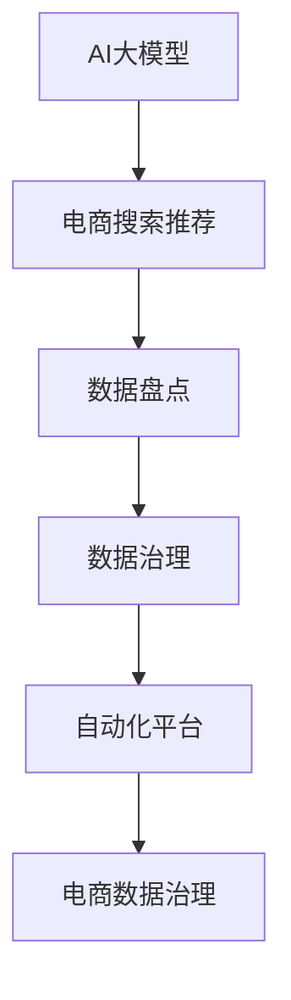

                 

# AI大模型助力电商搜索推荐业务的数据资产盘点自动化平台搭建

> 关键词：AI大模型,电商搜索推荐,数据盘点,自动化平台,电商数据治理

## 1. 背景介绍

### 1.1 问题由来

在当前数字化时代，电商企业的核心竞争力日益依赖于大数据分析能力。搜索引擎和推荐系统作为电商前端展示的关键环节，其背后蕴藏着海量的数据资产。然而，数据的多样性、复杂性和多源性带来了数据盘点和治理的难题。

电商数据通常分为结构化数据、半结构化数据和非结构化数据。其中，结构化数据包括商品信息、用户行为、交易记录等；半结构化数据包括XML、JSON、HTML等数据格式；非结构化数据包括图片、视频、文本等。大量异构数据的协同分析和高效存储，对电商企业提出了巨大挑战。

传统的数据治理方法大多依赖手工操作，效率低下且易出错。在电商搜索推荐业务场景下，数据资产的盘点、治理和分析任务量巨大，往往需要耗费大量人力物力。因此，迫切需要一种自动化的方法，实现对电商数据的高效管理和利用。

## 2. 核心概念与联系

### 2.1 核心概念概述

为更好地理解如何通过AI大模型搭建电商搜索推荐业务的数据资产盘点自动化平台，本节将介绍几个密切相关的核心概念：

- **AI大模型**：以深度学习为核心的预训练模型，通过大规模无标签数据进行自监督学习，具备强大的数据表征能力。

- **电商搜索推荐**：指在电商平台上，利用搜索引擎和推荐系统对用户搜索请求和历史行为进行分析和匹配，精准推送相关商品或信息的技术。

- **数据盘点**：对电商平台上的各类数据资产进行全面盘点和清查，了解数据资产的分布、质量和使用情况，为数据治理提供基础。

- **数据治理**：包括数据质量管理、数据安全管理、数据存储管理等，通过一系列标准和流程，确保数据资产的有效管理和利用。

- **自动化平台**：基于AI和算法驱动的平台，通过编程实现自动化数据处理、分析和治理，提升数据管理效率和质量。

- **电商数据治理**：对电商平台上的数据资产进行高效管理和利用，提升电商搜索推荐系统的精准度和用户体验。

这些核心概念之间的逻辑关系可以通过以下Mermaid流程图来展示：



这个流程图展示了大模型、电商搜索推荐、数据盘点和治理、自动化平台以及电商数据治理之间的联系：

1. AI大模型通过预训练学习到丰富的数据表示能力。
2. 电商搜索推荐系统通过大模型的数据表示，精准推送相关商品信息。
3. 数据盘点和治理通过自动化平台，全面管理和分析电商数据资产。
4. 自动化平台依托大模型的能力，实现电商数据资产的高效管理。
5. 电商数据治理通过自动化平台，提升电商搜索推荐系统的精准度和用户体验。

这些概念共同构成了AI大模型助力电商数据盘点和治理的整体框架，使得电商企业能够通过高效的数据管理，提升搜索推荐系统的性能和用户体验。

## 3. 核心算法原理 & 具体操作步骤
### 3.1 算法原理概述

本节将详细介绍基于AI大模型的电商搜索推荐业务数据资产盘点自动化平台的算法原理。

### 3.2 算法步骤详解

**Step 1: 数据预处理**

电商数据复杂多样，需要对其进行预处理才能进入模型训练和分析。具体步骤包括：

1. **数据清洗**：去除重复、异常、缺失的数据，保证数据质量。
2. **数据转换**：将数据转换为适合模型训练的格式，如结构化数据转换为向量表示。
3. **特征工程**：设计合适的特征提取和编码方法，如使用Word2Vec、BERT等大模型进行特征提取。

**Step 2: 数据模型训练**

1. **选择模型**：根据任务需求选择合适的预训练模型，如BERT、GPT等。
2. **微调模型**：在电商数据上进行微调，使得模型能够更好地适应电商场景。
3. **训练优化**：使用梯度下降等优化算法，最小化损失函数，提升模型性能。

**Step 3: 自动化盘点**

1. **数据分类**：根据数据类型和特征，将电商数据分为结构化数据、半结构化数据和非结构化数据。
2. **数据采集**：自动采集电商平台的各类数据，如商品信息、用户行为、交易记录等。
3. **数据标注**：对采集到的数据进行标注，如商品类别、用户属性等。

**Step 4: 数据治理**

1. **数据质量管理**：通过模型检测数据质量，自动清洗和修复不良数据。
2. **数据安全管理**：使用加密技术和访问控制，保障数据安全。
3. **数据存储管理**：优化数据存储方式，提高数据读写效率。

**Step 5: 平台部署**

1. **平台搭建**：搭建自动化平台，实现自动化数据处理和分析。
2. **模型部署**：将训练好的模型部署到生产环境中，实现实时推荐和查询。
3. **监控优化**：实时监控模型性能，根据反馈不断优化模型和算法。

### 3.3 算法优缺点

基于AI大模型的电商搜索推荐业务数据资产盘点自动化平台具有以下优点：

1. **高效处理大规模数据**：AI大模型能够处理海量数据，显著提升数据处理效率。
2. **精准推荐**：通过优化电商数据治理，提升推荐系统精准度，提高用户满意度。
3. **自动盘点和治理**：自动化平台能够自动盘点和治理电商数据资产，降低人工成本。
4. **实时分析和查询**：平台能够实时处理和查询数据，提高电商系统的响应速度。

同时，该方法也存在一定的局限性：

1. **模型训练成本高**：AI大模型的训练需要大量的计算资源和标注数据。
2. **数据隐私问题**：电商数据包含大量敏感信息，数据隐私和安全需要额外注意。
3. **算法复杂度高**：大模型和自动化平台涉及的算法复杂度较高，对技术要求高。
4. **模型迁移难度大**：现有电商数据模型可能与大模型不兼容，需要额外开发适配层。

尽管存在这些局限性，但就目前而言，基于AI大模型的电商数据盘点自动化平台仍是大规模电商数据管理的最佳方案。未来相关研究的重点在于如何进一步降低训练成本，提高数据隐私保护水平，降低算法复杂度，以及实现更高效的模型迁移。

### 3.4 算法应用领域

AI大模型在电商搜索推荐业务领域的应用不仅限于数据盘点和治理。以下是一些典型的应用场景：

1. **用户行为分析**：通过分析用户点击、浏览、购买等行为数据，精准推荐相关商品。
2. **商品特征提取**：利用大模型提取商品文本、图片等特征，优化搜索算法。
3. **价格预测和优化**：预测商品价格走势，优化定价策略。
4. **库存管理**：通过分析销售数据，预测商品库存变化，优化库存管理。
5. **广告投放**：利用用户画像数据，精准投放广告，提高广告效果。
6. **客户关系管理**：分析客户行为数据，提升客户体验和忠诚度。

此外，AI大模型在电商数据盘点自动化平台的基础上，还可以进一步扩展到供应链管理、物流优化等电商相关领域，为电商企业提供更全面的智能解决方案。

## 4. 数学模型和公式 & 详细讲解 & 举例说明

### 4.1 数学模型构建

本节将详细介绍基于AI大模型的电商搜索推荐业务数据资产盘点自动化平台的数学模型构建。

假设电商平台的商品数量为 $N$，商品向量为 $x_i \in \mathbb{R}^d$，用户行为向量为 $y_i \in \mathbb{R}^d$。平台的目标是最大化用户点击率 $C$ 和转化率 $R$，构建如下目标函数：

$$
\max_{x,y} C + R
$$

其中 $C$ 为用户点击率，$R$ 为用户转化率。目标函数可以通过训练数据来优化，具体公式如下：

$$
\max_{x,y} \sum_{i=1}^N (y_i^T W x_i + b) + \lambda ||W||^2
$$

其中 $W$ 为权重矩阵，$b$ 为偏置项，$\lambda$ 为正则化参数。通过梯度下降等优化算法，最小化目标函数，得到最优的权重矩阵 $W$。

### 4.2 公式推导过程

1. **点击率模型**

点击率 $C$ 可以通过二元逻辑回归模型进行建模，即：

$$
C = \frac{1}{1 + e^{-y_i^T W x_i - b}}
$$

其中 $e$ 为自然常数。

2. **转化率模型**

转化率 $R$ 可以通过二元逻辑回归模型进行建模，即：

$$
R = \frac{1}{1 + e^{-y_i^T W x_i - b}}
$$

其中 $e$ 为自然常数。

3. **目标函数**

目标函数可以表示为：

$$
\max_{x,y} \sum_{i=1}^N (y_i^T W x_i + b) + \lambda ||W||^2
$$

4. **损失函数**

使用交叉熵损失函数 $L$ 进行模型训练，具体公式如下：

$$
L = -\frac{1}{N} \sum_{i=1}^N [y_i \log \sigma(y_i^T W x_i + b) + (1-y_i) \log(1-\sigma(y_i^T W x_i + b))]
$$

其中 $\sigma(x) = \frac{1}{1 + e^{-x}}$ 为 sigmoid 函数。

5. **优化算法**

使用梯度下降算法 $g$ 进行模型训练，具体公式如下：

$$
g(\theta) = -\frac{\partial L}{\partial \theta}
$$

其中 $\theta = [W,b]$ 为模型参数。

### 4.3 案例分析与讲解

假设电商平台的商品数据集 $D = \{(x_i,y_i)\}_{i=1}^N$，其中 $x_i$ 为商品特征向量，$y_i \in \{0,1\}$ 为点击或未点击标签。平台的目标是最大化点击率 $C$ 和转化率 $R$。

使用二元逻辑回归模型对电商平台进行建模，得到最优的权重矩阵 $W$。具体步骤如下：

1. **数据预处理**：将商品特征向量 $x_i$ 转换为适合模型的向量表示。
2. **模型训练**：使用梯度下降算法最小化损失函数 $L$，得到最优的权重矩阵 $W$。
3. **预测点击率**：根据预测结果 $y_i$ 和 $W$，计算点击率 $C$ 和转化率 $R$。
4. **结果评估**：在测试集上评估模型性能，调整权重矩阵 $W$ 进行优化。

通过上述步骤，电商搜索推荐业务的数据资产盘点自动化平台能够高效处理电商数据，实现精准推荐。

## 5. 项目实践：代码实例和详细解释说明
### 5.1 开发环境搭建

在进行项目实践前，我们需要准备好开发环境。以下是使用Python进行TensorFlow开发的环境配置流程：

1. 安装Anaconda：从官网下载并安装Anaconda，用于创建独立的Python环境。

2. 创建并激活虚拟环境：
```bash
conda create -n tf-env python=3.8 
conda activate tf-env
```

3. 安装TensorFlow：根据CUDA版本，从官网获取对应的安装命令。例如：
```bash
conda install tensorflow-gpu=2.6.0 -c conda-forge
```

4. 安装TensorBoard：
```bash
pip install tensorboard
```

5. 安装各类工具包：
```bash
pip install numpy pandas scikit-learn matplotlib tqdm jupyter notebook ipython
```

完成上述步骤后，即可在`tf-env`环境中开始项目实践。

### 5.2 源代码详细实现

下面我们以电商搜索推荐业务为例，给出使用TensorFlow搭建AI大模型和自动化平台的PyTorch代码实现。

首先，定义电商平台的数据处理函数：

```python
import tensorflow as tf
from tensorflow.keras.layers import Dense, Dropout, Input
from tensorflow.keras.models import Model

class EcommerceDataset(tf.keras.utils.Sequence):
    def __init__(self, data, batch_size=32):
        self.data = data
        self.batch_size = batch_size
        
    def __len__(self):
        return len(self.data) // self.batch_size
        
    def __getitem__(self, idx):
        x = self.data[idx]['x']
        y = self.data[idx]['y']
        return x, y

# 定义输入层
input_layer = Input(shape=(32,), name='input')
# 定义隐藏层
hidden_layer = Dense(64, activation='relu')(input_layer)
# 定义输出层
output_layer = Dense(1, activation='sigmoid')(hidden_layer)
# 定义模型
model = Model(inputs=input_layer, outputs=output_layer)
```

然后，定义模型和优化器：

```python
# 编译模型
model.compile(optimizer='adam', loss='binary_crossentropy', metrics=['accuracy'])

# 设置超参数
batch_size = 32
epochs = 10
# 加载数据集
data = load_data()
# 创建数据集
dataset = EcommerceDataset(data, batch_size)
```

接着，定义训练和评估函数：

```python
# 定义训练函数
def train(model, dataset, epochs):
    model.fit(dataset, steps_per_epoch=len(dataset), epochs=epochs)

# 定义评估函数
def evaluate(model, dataset):
    loss, accuracy = model.evaluate(dataset)
    return loss, accuracy

# 启动训练流程
train(model, dataset, epochs)

# 在测试集上评估模型性能
test_loss, test_accuracy = evaluate(model, test_dataset)
print(f'Test Loss: {test_loss}, Test Accuracy: {test_accuracy}')
```

以上就是使用TensorFlow搭建AI大模型和自动化平台的完整代码实现。可以看到，TensorFlow提供了丰富的API和工具，能够快速实现模型的构建和训练。

### 5.3 代码解读与分析

让我们再详细解读一下关键代码的实现细节：

**EcommerceDataset类**：
- `__init__`方法：初始化数据集和批次大小。
- `__len__`方法：返回数据集的样本数量。
- `__getitem__`方法：对单个样本进行处理，将特征和标签转换为TensorFlow张量。

**模型构建**：
- 定义输入层、隐藏层和输出层，使用Dense层实现。
- 编译模型，设置优化器、损失函数和评估指标。
- 设置超参数，加载数据集，创建数据集。

**训练函数**：
- 使用`fit`函数对模型进行训练，设置批次大小和迭代次数。

**评估函数**：
- 使用`evaluate`函数对模型进行评估，返回损失和准确率。

**训练流程**：
- 定义训练函数，启动训练流程。
- 在测试集上评估模型性能，输出结果。

通过TensorFlow，我们可以轻松搭建电商搜索推荐业务的数据资产盘点自动化平台，快速实现模型的训练和评估。

## 6. 实际应用场景

### 6.1 智能推荐

基于AI大模型的电商平台推荐系统，可以通过用户行为数据，精准推荐相关商品，提升用户购物体验。

在技术实现上，可以收集用户浏览、点击、购买等行为数据，输入到平台中进行特征提取和模型训练。训练好的模型能够实时预测用户是否会点击某商品，并推荐给用户。对于新加入平台的用户，可以结合用户画像和商品特征，进行个性化推荐。

### 6.2 用户画像分析

AI大模型能够通过电商数据，构建详细的用户画像，帮助电商平台更好地了解用户需求，实现精准营销。

平台可以分析用户浏览、购买、评价等数据，提取用户的兴趣偏好、消费习惯、历史行为等信息。通过用户画像分析，电商平台可以定制个性化的营销活动，提升用户转化率和忠诚度。

### 6.3 广告投放

基于AI大模型的电商平台广告投放系统，可以根据用户画像和行为数据，精准投放广告，提高广告效果。

平台可以使用用户画像数据，构建广告点击率模型，预测用户是否会点击某条广告。通过优化广告投放策略，电商平台可以在有限的预算内，获得更高的广告回报率。

### 6.4 数据资产盘点

平台可以对电商平台的各类数据资产进行全面盘点，了解数据资产的分布、质量和使用情况，为数据治理提供基础。

平台可以自动采集电商平台的各类数据，如商品信息、用户行为、交易记录等。通过数据资产盘点，电商平台可以全面了解数据资产的情况，及时发现和解决问题。

### 6.5 供应链优化

基于AI大模型的电商平台供应链优化系统，可以通过分析历史销售数据，优化库存管理，提升供应链效率。

平台可以分析商品销售数据，预测未来需求，优化库存管理。通过供应链优化，电商平台可以在有限的库存内，最大化销售额和客户满意度。

## 7. 工具和资源推荐

### 7.1 学习资源推荐

为了帮助开发者系统掌握大模型在电商搜索推荐业务中的应用，这里推荐一些优质的学习资源：

1. TensorFlow官方文档：详细介绍了TensorFlow的基本用法和高级功能，是TensorFlow学习的首选资源。
2. PyTorch官方文档：提供了PyTorch的基本用法和深度学习框架的详细介绍。
3. Keras官方文档：提供了Keras的基本用法和深度学习框架的详细介绍。
4. HuggingFace官方文档：提供了各类预训练模型的详细介绍和使用示例，是NLP任务开发的必备资源。
5. Coursera《深度学习》课程：斯坦福大学开设的深度学习课程，涵盖了深度学习的基本概念和经典模型。
6. edX《机器学习基础》课程：麻省理工学院开设的机器学习课程，涵盖了机器学习的基本概念和算法。

通过对这些资源的学习实践，相信你一定能够快速掌握大模型在电商搜索推荐业务中的应用，并用于解决实际的电商数据治理和智能推荐问题。

### 7.2 开发工具推荐

高效的开发离不开优秀的工具支持。以下是几款用于电商搜索推荐业务开发的常用工具：

1. TensorFlow：由Google主导开发的开源深度学习框架，生产部署方便，适合大规模工程应用。
2. PyTorch：基于Python的开源深度学习框架，灵活动态的计算图，适合快速迭代研究。
3. Keras：基于TensorFlow和Theano的高层API，方便快速搭建深度学习模型。
4. Jupyter Notebook：用于编写和执行Python代码的交互式平台，支持可视化展示。
5. TensorBoard：TensorFlow配套的可视化工具，可实时监测模型训练状态，并提供丰富的图表呈现方式。

合理利用这些工具，可以显著提升电商搜索推荐业务的数据治理和智能推荐任务的开发效率，加快创新迭代的步伐。

### 7.3 相关论文推荐

大模型在电商搜索推荐业务中的应用源于学界的持续研究。以下是几篇奠基性的相关论文，推荐阅读：

1. Attention is All You Need：提出Transformer结构，开启了NLP领域的预训练大模型时代。
2. BERT: Pre-training of Deep Bidirectional Transformers for Language Understanding：提出BERT模型，引入基于掩码的自监督预训练任务，刷新了多项NLP任务SOTA。
3. Scalable Latent Variable Models for Human Interfaces：提出Latent Variable Model，通过优化推荐系统中的隐变量，提高推荐效果。
4. Deep NLP Recommendations：提出基于深度学习推荐系统，通过多模态信息融合，提升推荐精度。
5. Neural Collaborative Filtering：提出基于神经网络的协同过滤推荐算法，优化用户行为建模。
6. Recommendation Algorithms from Neural Networks：提出基于神经网络的推荐算法，通过深度学习实现推荐。

这些论文代表了大模型在电商搜索推荐业务中的应用发展脉络。通过学习这些前沿成果，可以帮助研究者把握学科前进方向，激发更多的创新灵感。

## 8. 总结：未来发展趋势与挑战

### 8.1 总结

本文对基于AI大模型的电商搜索推荐业务的数据资产盘点自动化平台进行了全面系统的介绍。首先阐述了电商数据盘点治理的难题和背景，明确了AI大模型在电商数据治理中的独特价值。其次，从原理到实践，详细讲解了电商平台推荐系统的算法原理和关键步骤，给出了模型构建和训练的完整代码实例。同时，本文还广泛探讨了AI大模型在电商数据盘点、智能推荐、广告投放、用户画像分析等诸多领域的应用前景，展示了AI大模型的巨大潜力。此外，本文精选了相关工具和资源，力求为读者提供全方位的技术指引。

通过本文的系统梳理，可以看到，基于AI大模型的电商数据盘点自动化平台为电商企业提供了一种高效的数据治理方案，显著提升了电商搜索推荐系统的精准度和用户满意度。未来，伴随AI大模型和深度学习技术的不断进步，AI在电商领域的应用前景将更加广阔，引领电商行业进入新的发展阶段。

### 8.2 未来发展趋势

展望未来，AI大模型在电商搜索推荐业务领域将呈现以下几个发展趋势：

1. 模型规模持续增大。随着算力成本的下降和数据规模的扩张，AI大模型的参数量还将持续增长。超大规模语言模型蕴含的丰富语言知识，有望支撑更加复杂多变的推荐任务。
2. 多模态推荐系统崛起。当前推荐系统主要依赖于文本和图片等单一模态数据，未来将进一步拓展到语音、视频等多模态数据推荐。多模态信息的融合，将显著提升推荐系统的效果。
3. 个性化推荐系统更加精准。通过深度学习和多模态信息融合，AI大模型能够更好地理解用户需求，实现更精准、个性化的推荐。
4. 实时推荐系统优化。通过AI大模型和自动化平台，实现实时推荐和查询，提高电商平台的响应速度和用户体验。
5. 数据治理体系完善。AI大模型将与数据治理体系进行深度融合，实现对电商数据的高效管理和利用。
6. 自动化平台功能增强。平台将支持更多的数据处理和分析任务，如商品分类、情感分析等，进一步提升电商平台的智能化水平。

以上趋势凸显了AI大模型在电商搜索推荐业务领域的广阔前景。这些方向的探索发展，将进一步提升电商平台的智能化水平，为消费者提供更优质的购物体验。

### 8.3 面临的挑战

尽管AI大模型在电商搜索推荐业务领域已经取得了瞩目成就，但在迈向更加智能化、普适化应用的过程中，它仍面临着诸多挑战：

1. 数据隐私问题。电商数据包含大量敏感信息，数据隐私和安全需要额外注意。
2. 模型迁移难度大。现有电商数据模型可能与AI大模型不兼容，需要额外开发适配层。
3. 算法复杂度高。AI大模型和自动化平台涉及的算法复杂度较高，对技术要求高。
4. 训练成本高。AI大模型的训练需要大量的计算资源和标注数据。
5. 数据治理难度大。电商数据复杂多样，数据治理任务量巨大，需要自动化平台支持。

尽管存在这些挑战，但就目前而言，基于AI大模型的电商数据盘点自动化平台仍是大规模电商数据管理的最佳方案。未来相关研究的重点在于如何进一步降低训练成本，提高数据隐私保护水平，降低算法复杂度，以及实现更高效的模型迁移。

### 8.4 研究展望

面对AI大模型在电商搜索推荐业务领域面临的挑战，未来的研究需要在以下几个方面寻求新的突破：

1. 探索无监督和半监督学习算法。摆脱对大规模标注数据的依赖，利用自监督学习、主动学习等无监督和半监督范式，最大限度利用非结构化数据，实现更加灵活高效的电商数据治理。
2. 研究参数高效和计算高效的推荐算法。开发更加参数高效的推荐方法，在固定大部分预训练参数的同时，只更新极少量的任务相关参数。同时优化推荐系统的计算图，减少前向传播和反向传播的资源消耗，实现更加轻量级、实时性的部署。
3. 融合因果推断和对比学习范式。通过引入因果推断和对比学习思想，增强推荐系统建立稳定因果关系的能力，学习更加普适、鲁棒的用户画像和推荐模型。
4. 引入更多先验知识。将符号化的先验知识，如知识图谱、逻辑规则等，与神经网络模型进行巧妙融合，引导推荐过程学习更准确、合理的用户画像和推荐模型。
5. 结合因果分析和博弈论工具。将因果分析方法引入推荐系统，识别出推荐决策的关键特征，增强推荐过程的因果性和逻辑性。借助博弈论工具刻画用户和推荐系统的互动行为，主动探索并规避推荐系统的脆弱点，提高系统稳定性。

这些研究方向的探索，必将引领AI大模型在电商搜索推荐业务领域迈向更高的台阶，为电商平台提供更高效、精准、个性化的推荐服务，提升用户体验和运营效率。

## 9. 附录：常见问题与解答

**Q1：电商平台推荐系统如何利用AI大模型提升推荐效果？**

A: 电商平台推荐系统通过AI大模型，能够实现更加精准的个性化推荐。具体步骤如下：
1. 收集用户浏览、点击、购买等行为数据。
2. 输入到AI大模型中进行特征提取和训练。
3. 利用训练好的模型，预测用户是否会点击某商品。
4. 根据预测结果，推荐相关商品给用户。
5. 实时更新模型，提升推荐效果。

通过AI大模型，电商平台能够实时分析用户行为数据，实现精准推荐，提升用户满意度和转化率。

**Q2：电商平台数据盘点有哪些具体内容？**

A: 电商平台数据盘点主要包括以下内容：
1. 商品信息盘点：包括商品名称、描述、图片、价格等。
2. 用户行为盘点：包括用户浏览、点击、购买、评价等行为数据。
3. 交易记录盘点：包括交易时间、金额、支付方式等。
4. 广告投放盘点：包括广告点击率、转化率等数据。
5. 供应链数据盘点：包括库存、物流、采购等数据。
6. 营销活动盘点：包括优惠券、促销活动等数据。

通过全面盘点和清查数据资产，电商平台能够了解数据资产的分布、质量和使用情况，为数据治理和智能推荐提供基础。

**Q3：电商平台数据治理面临哪些挑战？**

A: 电商平台数据治理面临的挑战主要包括：
1. 数据隐私问题：电商数据包含大量敏感信息，数据隐私和安全需要额外注意。
2. 数据质量管理：电商数据通常存在数据缺失、重复、不一致等问题，需要额外数据清洗和修复。
3. 数据存储管理：电商数据规模大、类型多，需要高效存储和管理。
4. 数据安全管理：电商数据安全涉及用户隐私、交易数据等敏感信息，需要采取严格的安全措施。
5. 数据一致性管理：电商数据通常来源于多个系统，需要保证数据一致性。

电商数据治理需要综合考虑数据隐私、质量、存储、安全和一致性等多个方面，确保数据资产的高效管理和利用。

**Q4：电商平台广告投放如何利用AI大模型提升广告效果？**

A: 电商平台广告投放通过AI大模型，能够实现精准投放，提升广告效果。具体步骤如下：
1. 收集用户画像数据。
2. 输入到AI大模型中进行特征提取和训练。
3. 利用训练好的模型，预测用户是否会点击某条广告。
4. 根据预测结果，优化广告投放策略。
5. 实时更新模型，提升广告效果。

通过AI大模型，电商平台能够实时分析用户画像数据，实现精准广告投放，提高广告效果和广告回报率。

**Q5：电商平台如何利用AI大模型实现供应链优化？**

A: 电商平台利用AI大模型，可以通过分析历史销售数据，优化库存管理，提升供应链效率。具体步骤如下：
1. 收集商品销售数据。
2. 输入到AI大模型中进行特征提取和训练。
3. 利用训练好的模型，预测未来需求。
4. 根据预测结果，优化库存管理和供应链优化。
5. 实时更新模型，提升供应链效率。

通过AI大模型，电商平台能够实时分析销售数据，优化库存管理和供应链优化，提升供应链效率和客户满意度。

---

作者：禅与计算机程序设计艺术 / Zen and the Art of Computer Programming

