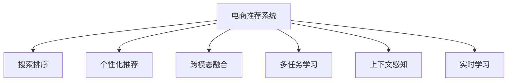

                 

# AI大模型助力电商搜索推荐精准度提升

> 关键词：电商推荐系统,搜索排序,用户行为,个性化推荐,AI大模型,深度学习,神经网络,自然语言处理

## 1. 背景介绍

### 1.1 问题由来
随着电商市场的快速扩张，各大电商平台面临用户需求多样化、商品种类繁多、市场竞争激烈的挑战。如何提升用户购物体验，快速满足其个性化需求，成为电商平台亟需解决的关键问题。传统的电商搜索推荐系统多依赖于基于规则和统计学习的技术，难以处理复杂场景，且随着数据量的增长，系统更新和维护成本高，难以快速迭代。

为应对这些挑战，电商企业逐步引入AI大模型技术，通过大规模无标签数据预训练，学习通用知识，然后利用少量有标签数据进行微调，获得针对特定电商任务的推荐系统。AI大模型因其在大规模数据上预训练获得的丰富知识，为电商推荐系统提供了全新的解决方案，能够更好地理解用户需求、商品属性和市场环境，从而提供精准度更高的推荐服务。

### 1.2 问题核心关键点
电商推荐系统核心任务包括：用户搜索排序、商品推荐、跨模态信息融合等。AI大模型通过以下关键技术提升电商推荐系统的精准度：

- **预训练与微调**：利用大规模无标签数据预训练大模型，获取通用知识，再在有标签的电商数据上微调，得到针对电商推荐任务的专用模型。
- **跨模态融合**：将文本、图像、声音等多种模态的信息进行有效融合，提升推荐系统的多样性和准确性。
- **多任务学习**：利用单一模型同时学习多个电商推荐任务，提升模型泛化能力和整体性能。
- **上下文感知**：通过在模型中加入上下文信息，更好地理解用户行为和商品特征，增强推荐系统效果。
- **实时学习**：通过不断更新模型参数，适应电商市场变化，提升推荐系统及时性。

## 2. 核心概念与联系

### 2.1 核心概念概述

为更好地理解AI大模型在电商推荐系统中的应用，本节将介绍几个密切相关的核心概念：

- **电商推荐系统**：利用数据挖掘和机器学习技术，对用户行为数据进行分析，预测用户需求，实现商品推荐，提升用户购物体验的系统。
- **搜索排序**：根据用户输入的查询词，从海量的商品信息中筛选出相关性最高的结果，提升搜索效率和用户体验。
- **个性化推荐**：基于用户的历史行为、兴趣和偏好，提供符合其个性化需求的商品推荐，提升用户满意度和购买转化率。
- **跨模态融合**：将文本、图像、声音等多种模态的信息进行有效融合，提升推荐系统的多样性和准确性。
- **多任务学习**：利用单一模型同时学习多个电商推荐任务，提升模型泛化能力和整体性能。
- **上下文感知**：通过在模型中加入上下文信息，更好地理解用户行为和商品特征，增强推荐系统效果。
- **实时学习**：通过不断更新模型参数，适应电商市场变化，提升推荐系统及时性。

这些核心概念之间的逻辑关系可以通过以下Mermaid流程图来展示：



这个流程图展示了大语言模型在电商推荐系统中的应用框架，其核心思想是：

1. 电商推荐系统以用户为中心，提供个性化的商品推荐。
2. 搜索排序任务帮助用户快速找到相关商品。
3. 个性化推荐系统根据用户行为和偏好，筛选最符合需求的商品。
4. 跨模态融合增强推荐系统的多样性。
5. 多任务学习提升模型泛化能力。
6. 上下文感知提高模型对特定场景的理解能力。
7. 实时学习使推荐系统能够快速适应市场变化。

## 3. 核心算法原理 & 具体操作步骤
### 3.1 算法原理概述

AI大模型在电商推荐系统中的应用，本质上是通过预训练-微调范式实现的。其核心思想是：

- **预训练**：使用大规模无标签电商数据训练大模型，学习通用知识。
- **微调**：利用少量有标签电商数据，对大模型进行微调，得到针对特定电商推荐任务的专用模型。
- **融合**：将预训练大模型的输出与任务特定信息结合，实现跨模态融合和多任务学习。
- **感知**：在模型中加入上下文信息，提升模型的上下文感知能力。
- **学习**：通过在线学习技术，不断更新模型参数，适应市场变化。

### 3.2 算法步骤详解

基于AI大模型的电商推荐系统构建流程包括：

**Step 1: 准备预训练模型和数据集**
- 选择合适的预训练语言模型，如BERT、GPT等。
- 收集电商数据集，包括用户行为数据、商品描述数据、商品图片数据等。
- 数据预处理，如去噪、归一化、特征提取等。

**Step 2: 设计任务适配层**
- 根据电商推荐任务，设计合适的输出层和损失函数。
- 对于分类任务，通常使用交叉熵损失函数。
- 对于排序任务，可以使用平滑近似排序损失函数。
- 对于个性化推荐，可以设计多任务学习框架，联合优化不同任务。

**Step 3: 设置微调超参数**
- 选择合适的优化器及其参数，如AdamW、SGD等，设置学习率、批大小、迭代轮数等。
- 设置正则化技术及强度，包括权重衰减、Dropout、Early Stopping等。
- 确定冻结预训练参数的策略，如仅微调顶层，或全部参数都参与微调。

**Step 4: 执行梯度训练**
- 将电商数据集分批次输入模型，前向传播计算损失函数。
- 反向传播计算参数梯度，根据设定的优化算法和学习率更新模型参数。
- 周期性在验证集上评估模型性能，根据性能指标决定是否触发Early Stopping。
- 重复上述步骤直到满足预设的迭代轮数或Early Stopping条件。

**Step 5: 测试和部署**
- 在测试集上评估微调后模型在电商推荐系统中的表现。
- 使用微调后的模型对新商品进行推荐，集成到实际的应用系统中。
- 持续收集新的用户行为数据，定期重新微调模型，以适应市场变化。

以上是基于AI大模型的电商推荐系统的一般流程。在实际应用中，还需要针对具体电商推荐任务的特点，对微调过程的各个环节进行优化设计，如改进训练目标函数，引入更多的正则化技术，搜索最优的超参数组合等，以进一步提升模型性能。

### 3.3 算法优缺点

AI大模型在电商推荐系统中的应用具有以下优点：
1. 通用性。预训练大模型可以在多种电商任务上通用，适合多种应用场景。
2. 性能提升。利用预训练大模型丰富的知识，可以显著提升电商推荐系统的精准度和个性化水平。
3. 泛化能力强。预训练大模型通常具有较强的泛化能力，可以适应不同电商市场的变化。
4. 可解释性。预训练大模型可以利用可解释性技术，提升模型的透明度，帮助理解推荐决策过程。

同时，该方法也存在一定的局限性：
1. 资源消耗大。预训练大模型参数量巨大，训练和推理需要大量计算资源。
2. 模型复杂度高。电商推荐系统涉及多种模态信息融合，模型复杂度较高。
3. 对标注数据依赖。微调效果依赖于电商推荐任务的标注数据，数据获取成本高。
4. 实时性差。电商市场变化快，实时更新模型参数需要一定时间。

尽管存在这些局限性，但就目前而言，AI大模型在电商推荐系统中的应用已经显现出巨大的潜力。未来相关研究的重点在于如何进一步降低资源消耗，提高模型实时性，同时兼顾可解释性和泛化性等因素。

### 3.4 算法应用领域

AI大模型在电商推荐系统中的应用领域十分广泛，包括但不限于：

- **搜索排序**：利用电商数据进行预训练和微调，提升搜索结果的相关性。
- **个性化推荐**：根据用户历史行为，推荐最符合其兴趣的商品。
- **跨模态信息融合**：将文本、图像、声音等信息融合，提升推荐系统多样性和准确性。
- **多任务学习**：联合学习商品推荐、广告点击预测等多个电商任务，提升模型泛化能力。
- **实时学习**：利用在线学习技术，适应电商市场变化，提升推荐系统及时性。

这些应用领域展示了AI大模型在电商推荐系统中的巨大潜力，也为电商平台提供了更加智能化、个性化的推荐服务。

## 4. 数学模型和公式 & 详细讲解  
### 4.1 数学模型构建

以电商推荐系统为例，其数学模型可以如下构建：

- **预训练模型**：假设预训练语言模型为 $M_{\theta}$，其中 $\theta$ 为预训练得到的模型参数。
- **微调模型**：在电商推荐任务上微调，得到专用模型 $M_{\hat{\theta}}$。
- **损失函数**：对于推荐任务，可以使用交叉熵损失函数或排序损失函数等。

形式化地，假设电商推荐任务为 $T$，训练集为 $D=\{(x_i,y_i)\}_{i=1}^N$，其中 $x_i$ 为电商数据样本，$y_i$ 为标签。微调的目标是最小化经验风险，即找到最优参数：

$$
\hat{\theta}=\mathop{\arg\min}_{\theta} \mathcal{L}(M_{\theta},D)
$$

其中 $\mathcal{L}$ 为针对任务 $T$ 设计的损失函数，用于衡量模型预测输出与真实标签之间的差异。

### 4.2 公式推导过程

以推荐任务为例，假设模型 $M_{\theta}$ 在输入 $x$ 上的输出为 $\hat{y}=M_{\theta}(x) \in [0,1]$，表示预测该电商商品的相关性。真实标签 $y \in \{0,1\}$。则交叉熵损失函数定义为：

$$
\ell(M_{\theta}(x),y) = -[y\log \hat{y} + (1-y)\log (1-\hat{y})]
$$

将其代入经验风险公式，得：

$$
\mathcal{L}(\theta) = -\frac{1}{N}\sum_{i=1}^N [y_i\log M_{\theta}(x_i)+(1-y_i)\log(1-M_{\theta}(x_i))]
$$

根据链式法则，损失函数对参数 $\theta_k$ 的梯度为：

$$
\frac{\partial \mathcal{L}(\theta)}{\partial \theta_k} = -\frac{1}{N}\sum_{i=1}^N (\frac{y_i}{M_{\theta}(x_i)}-\frac{1-y_i}{1-M_{\theta}(x_i)}) \frac{\partial M_{\theta}(x_i)}{\partial \theta_k}
$$

其中 $\frac{\partial M_{\theta}(x_i)}{\partial \theta_k}$ 可进一步递归展开，利用自动微分技术完成计算。

## 5. 项目实践：代码实例和详细解释说明
### 5.1 开发环境搭建

在进行电商推荐系统微调实践前，我们需要准备好开发环境。以下是使用Python进行PyTorch开发的环境配置流程：

1. 安装Anaconda：从官网下载并安装Anaconda，用于创建独立的Python环境。

2. 创建并激活虚拟环境：
```bash
conda create -n pytorch-env python=3.8 
conda activate pytorch-env
```

3. 安装PyTorch：根据CUDA版本，从官网获取对应的安装命令。例如：
```bash
conda install pytorch torchvision torchaudio cudatoolkit=11.1 -c pytorch -c conda-forge
```

4. 安装Transformers库：
```bash
pip install transformers
```

5. 安装各类工具包：
```bash
pip install numpy pandas scikit-learn matplotlib tqdm jupyter notebook ipython
```

完成上述步骤后，即可在`pytorch-env`环境中开始微调实践。

### 5.2 源代码详细实现

下面我们以电商推荐系统为例，给出使用Transformers库对BERT模型进行微调的PyTorch代码实现。

首先，定义电商推荐任务的数据处理函数：

```python
from transformers import BertTokenizer
from torch.utils.data import Dataset
import torch

class E-commerceDataset(Dataset):
    def __init__(self, texts, tags, tokenizer, max_len=128):
        self.texts = texts
        self.tags = tags
        self.tokenizer = tokenizer
        self.max_len = max_len
        
    def __len__(self):
        return len(self.texts)
    
    def __getitem__(self, item):
        text = self.texts[item]
        tags = self.tags[item]
        
        encoding = self.tokenizer(text, return_tensors='pt', max_length=self.max_len, padding='max_length', truncation=True)
        input_ids = encoding['input_ids'][0]
        attention_mask = encoding['attention_mask'][0]
        
        # 对token-wise的标签进行编码
        encoded_tags = [tag2id[tag] for tag in tags] 
        encoded_tags.extend([tag2id['O']] * (self.max_len - len(encoded_tags)))
        labels = torch.tensor(encoded_tags, dtype=torch.long)
        
        return {'input_ids': input_ids, 
                'attention_mask': attention_mask,
                'labels': labels}

# 标签与id的映射
tag2id = {'O': 0, 'Recommend': 1}
id2tag = {v: k for k, v in tag2id.items()}

# 创建dataset
tokenizer = BertTokenizer.from_pretrained('bert-base-cased')

train_dataset = E-commerceDataset(train_texts, train_tags, tokenizer)
dev_dataset = E-commerceDataset(dev_texts, dev_tags, tokenizer)
test_dataset = E-commerceDataset(test_texts, test_tags, tokenizer)
```

然后，定义模型和优化器：

```python
from transformers import BertForTokenClassification, AdamW

model = BertForTokenClassification.from_pretrained('bert-base-cased', num_labels=len(tag2id))

optimizer = AdamW(model.parameters(), lr=2e-5)
```

接着，定义训练和评估函数：

```python
from torch.utils.data import DataLoader
from tqdm import tqdm
from sklearn.metrics import classification_report

device = torch.device('cuda') if torch.cuda.is_available() else torch.device('cpu')
model.to(device)

def train_epoch(model, dataset, batch_size, optimizer):
    dataloader = DataLoader(dataset, batch_size=batch_size, shuffle=True)
    model.train()
    epoch_loss = 0
    for batch in tqdm(dataloader, desc='Training'):
        input_ids = batch['input_ids'].to(device)
        attention_mask = batch['attention_mask'].to(device)
        labels = batch['labels'].to(device)
        model.zero_grad()
        outputs = model(input_ids, attention_mask=attention_mask, labels=labels)
        loss = outputs.loss
        epoch_loss += loss.item()
        loss.backward()
        optimizer.step()
    return epoch_loss / len(dataloader)

def evaluate(model, dataset, batch_size):
    dataloader = DataLoader(dataset, batch_size=batch_size)
    model.eval()
    preds, labels = [], []
    with torch.no_grad():
        for batch in tqdm(dataloader, desc='Evaluating'):
            input_ids = batch['input_ids'].to(device)
            attention_mask = batch['attention_mask'].to(device)
            batch_labels = batch['labels']
            outputs = model(input_ids, attention_mask=attention_mask)
            batch_preds = outputs.logits.argmax(dim=2).to('cpu').tolist()
            batch_labels = batch_labels.to('cpu').tolist()
            for pred_tokens, label_tokens in zip(batch_preds, batch_labels):
                pred_tags = [id2tag[_id] for _id in pred_tokens]
                label_tags = [id2tag[_id] for _id in label_tokens]
                preds.append(pred_tags[:len(label_tags)])
                labels.append(label_tags)
                
    print(classification_report(labels, preds))
```

最后，启动训练流程并在测试集上评估：

```python
epochs = 5
batch_size = 16

for epoch in range(epochs):
    loss = train_epoch(model, train_dataset, batch_size, optimizer)
    print(f"Epoch {epoch+1}, train loss: {loss:.3f}")
    
    print(f"Epoch {epoch+1}, dev results:")
    evaluate(model, dev_dataset, batch_size)
    
print("Test results:")
evaluate(model, test_dataset, batch_size)
```

以上就是使用PyTorch对BERT进行电商推荐系统微调的完整代码实现。可以看到，得益于Transformers库的强大封装，我们可以用相对简洁的代码完成BERT模型的加载和微调。

### 5.3 代码解读与分析

让我们再详细解读一下关键代码的实现细节：

**E-commerceDataset类**：
- `__init__`方法：初始化电商数据、标签、分词器等关键组件。
- `__len__`方法：返回数据集的样本数量。
- `__getitem__`方法：对单个样本进行处理，将电商数据输入编码为token ids，将标签编码为数字，并对其进行定长padding，最终返回模型所需的输入。

**tag2id和id2tag字典**：
- 定义了标签与数字id之间的映射关系，用于将token-wise的预测结果解码回真实的标签。

**训练和评估函数**：
- 使用PyTorch的DataLoader对数据集进行批次化加载，供模型训练和推理使用。
- 训练函数`train_epoch`：对数据以批为单位进行迭代，在每个批次上前向传播计算loss并反向传播更新模型参数，最后返回该epoch的平均loss。
- 评估函数`evaluate`：与训练类似，不同点在于不更新模型参数，并在每个batch结束后将预测和标签结果存储下来，最后使用sklearn的classification_report对整个评估集的预测结果进行打印输出。

**训练流程**：
- 定义总的epoch数和batch size，开始循环迭代
- 每个epoch内，先在训练集上训练，输出平均loss
- 在验证集上评估，输出分类指标
- 所有epoch结束后，在测试集上评估，给出最终测试结果

可以看到，PyTorch配合Transformers库使得BERT微调的代码实现变得简洁高效。开发者可以将更多精力放在数据处理、模型改进等高层逻辑上，而不必过多关注底层的实现细节。

当然，工业级的系统实现还需考虑更多因素，如模型的保存和部署、超参数的自动搜索、更灵活的任务适配层等。但核心的微调范式基本与此类似。

## 6. 实际应用场景
### 6.1 电商搜索排序

利用AI大模型进行电商搜索排序，可以显著提升用户搜索体验。传统基于统计学习的排序方法难以处理复杂的场景，而大模型通过预训练-微调范式，能够学习到更多的上下文信息和语义关系，从而提供更准确、高效的搜索结果。

具体而言，可以收集电商网站的搜索日志，将用户查询词和搜索结果作为监督数据，训练大模型进行预测。在微调过程中，可以加入上下文信息，如用户历史搜索记录、商品属性标签等，提升搜索排序的精准度。同时，大模型还可以学习到搜索结果中商品的相关性信息，进行动态排序，提升用户体验。

### 6.2 个性化推荐

AI大模型在个性化推荐中的应用，可以提升用户购物体验，增加平台转化率和销售额。通过收集用户行为数据，如浏览记录、点击行为、购买记录等，构建用户画像，训练大模型进行推荐预测。微调过程中，可以引入多任务学习，联合优化商品推荐和广告点击预测等任务，提升推荐系统的整体性能。同时，大模型还可以学习到商品之间的关联关系，进行冷启动推荐，拓展推荐系统的覆盖面。

### 6.3 实时学习

电商市场变化快，用户需求多样，AI大模型需要具备实时学习的能力，能够快速适应市场变化。通过在线学习技术，大模型可以不断更新参数，提升推荐系统的及时性。例如，在用户点击商品后的反馈信息中，可以实时更新模型参数，改进推荐策略，提升推荐效果。

### 6.4 未来应用展望

随着AI大模型和微调技术的不断发展，基于AI大模型的电商推荐系统也将迎来更多创新。

在智慧物流领域，基于AI大模型的推荐系统可以优化库存管理，提升物流效率。例如，预测未来用户需求，优化商品库存配置，减少仓储成本。

在金融电商领域，利用AI大模型进行智能理财，推荐个性化的理财产品，提升用户粘性和平台收益。

在智能客服领域，利用AI大模型进行智能问答，提升客户满意度。例如，根据用户提问，推荐相关商品或服务，提供快速、精准的客户响应。

此外，在智能家居、智能办公等多个垂直行业，AI大模型推荐系统也将发挥越来越重要的作用，推动各行各业数字化转型。

## 7. 工具和资源推荐
### 7.1 学习资源推荐

为了帮助开发者系统掌握大语言模型微调的理论基础和实践技巧，这里推荐一些优质的学习资源：

1. 《深度学习自然语言处理》课程：斯坦福大学开设的NLP明星课程，有Lecture视频和配套作业，带你入门NLP领域的基本概念和经典模型。

2. 《Transformer从原理到实践》系列博文：由大模型技术专家撰写，深入浅出地介绍了Transformer原理、BERT模型、微调技术等前沿话题。

3. 《Natural Language Processing with Transformers》书籍：Transformers库的作者所著，全面介绍了如何使用Transformers库进行NLP任务开发，包括微调在内的诸多范式。

4. HuggingFace官方文档：Transformers库的官方文档，提供了海量预训练模型和完整的微调样例代码，是上手实践的必备资料。

5. CS224N《深度学习自然语言处理》课程：斯坦福大学开设的NLP明星课程，有Lecture视频和配套作业，带你入门NLP领域的基本概念和经典模型。

通过对这些资源的学习实践，相信你一定能够快速掌握大语言模型微调的精髓，并用于解决实际的NLP问题。
###  7.2 开发工具推荐

高效的开发离不开优秀的工具支持。以下是几款用于大语言模型微调开发的常用工具：

1. PyTorch：基于Python的开源深度学习框架，灵活动态的计算图，适合快速迭代研究。大部分预训练语言模型都有PyTorch版本的实现。

2. TensorFlow：由Google主导开发的开源深度学习框架，生产部署方便，适合大规模工程应用。同样有丰富的预训练语言模型资源。

3. Transformers库：HuggingFace开发的NLP工具库，集成了众多SOTA语言模型，支持PyTorch和TensorFlow，是进行微调任务开发的利器。

4. Weights & Biases：模型训练的实验跟踪工具，可以记录和可视化模型训练过程中的各项指标，方便对比和调优。与主流深度学习框架无缝集成。

5. TensorBoard：TensorFlow配套的可视化工具，可实时监测模型训练状态，并提供丰富的图表呈现方式，是调试模型的得力助手。

6. Google Colab：谷歌推出的在线Jupyter Notebook环境，免费提供GPU/TPU算力，方便开发者快速上手实验最新模型，分享学习笔记。

合理利用这些工具，可以显著提升大语言模型微调任务的开发效率，加快创新迭代的步伐。

### 7.3 相关论文推荐

大语言模型和微调技术的发展源于学界的持续研究。以下是几篇奠基性的相关论文，推荐阅读：

1. Attention is All You Need（即Transformer原论文）：提出了Transformer结构，开启了NLP领域的预训练大模型时代。

2. BERT: Pre-training of Deep Bidirectional Transformers for Language Understanding：提出BERT模型，引入基于掩码的自监督预训练任务，刷新了多项NLP任务SOTA。

3. Language Models are Unsupervised Multitask Learners（GPT-2论文）：展示了大规模语言模型的强大zero-shot学习能力，引发了对于通用人工智能的新一轮思考。

4. Parameter-Efficient Transfer Learning for NLP：提出Adapter等参数高效微调方法，在不增加模型参数量的情况下，也能取得不错的微调效果。

5. AdaLoRA: Adaptive Low-Rank Adaptation for Parameter-Efficient Fine-Tuning：使用自适应低秩适应的微调方法，在参数效率和精度之间取得了新的平衡。

这些论文代表了大语言模型微调技术的发展脉络。通过学习这些前沿成果，可以帮助研究者把握学科前进方向，激发更多的创新灵感。

## 8. 总结：未来发展趋势与挑战

### 8.1 总结

本文对基于AI大模型的电商推荐系统进行了全面系统的介绍。首先阐述了电商推荐系统和大模型的研究背景和意义，明确了电商推荐系统和大模型的核心任务和关键技术。其次，从原理到实践，详细讲解了电商推荐系统的大模型微调方法，给出了微调任务开发的完整代码实例。同时，本文还广泛探讨了电商推荐系统在大模型微调技术中的应用前景，展示了电商推荐系统在大模型微调技术下的巨大潜力。

通过本文的系统梳理，可以看到，基于大语言模型的电商推荐系统，利用预训练-微调范式，能够在电商推荐系统的各个环节，提供更加精准、个性化的推荐服务。大模型通过在大规模无标签电商数据上预训练，学习通用知识，再利用少量有标签电商数据进行微调，获取针对电商推荐任务的专用模型。

### 8.2 未来发展趋势

展望未来，基于AI大模型的电商推荐系统将呈现以下几个发展趋势：

1. 模型规模持续增大。随着算力成本的下降和数据规模的扩张，预训练语言模型的参数量还将持续增长。超大规模语言模型蕴含的丰富知识，有望支撑更加复杂多变的电商推荐任务。

2. 微调方法日趋多样。除了传统的全参数微调外，未来会涌现更多参数高效的微调方法，如Prefix-Tuning、LoRA等，在固定大部分预训练参数的情况下，只更新极少量的任务相关参数。同时，跨模态融合和多任务学习等技术也将不断进步，提升电商推荐系统的多样性和准确性。

3. 持续学习成为常态。随着电商市场变化快，微调模型需要持续学习新知识以保持性能。如何在不遗忘原有知识的同时，高效吸收新样本信息，将是重要的研究课题。

4. 标注样本需求降低。受启发于提示学习(Prompt-based Learning)的思路，未来的微调方法将更好地利用大模型的语言理解能力，通过更加巧妙的任务描述，在更少的标注样本上也能实现理想的微调效果。

5. 实时学习提升。电商市场变化快，实时更新模型参数需要时间，但在线学习技术可以解决这一问题。通过在线学习技术，大模型可以不断更新参数，提升推荐系统的及时性。

6. 多任务学习拓展。利用单一模型同时学习多个电商推荐任务，提升模型泛化能力和整体性能。例如，联合优化商品推荐和广告点击预测等任务，提升推荐系统的整体效果。

以上趋势凸显了大语言模型在电商推荐系统中的巨大潜力。这些方向的探索发展，必将进一步提升电商推荐系统的性能和应用范围，为电商平台提供更加智能化、个性化的推荐服务。

### 8.3 面临的挑战

尽管基于AI大模型的电商推荐系统已经取得了显著效果，但在迈向更加智能化、普适化应用的过程中，它仍面临着诸多挑战：

1. 资源消耗大。预训练大模型参数量巨大，训练和推理需要大量计算资源。尽管资源优化技术不断进步，但算力成本仍然较高。

2. 模型复杂度高。电商推荐系统涉及多种模态信息融合，模型复杂度较高。如何简化模型结构，提升推理效率，是一个重要课题。

3. 对标注数据依赖。微调效果依赖于电商推荐任务的标注数据，数据获取成本高。如何降低对标注数据的依赖，是未来研究的重要方向。

4. 实时性差。电商市场变化快，实时更新模型参数需要时间。如何提高实时学习速度，是一个重要的优化方向。

5. 可解释性不足。当前电商推荐系统多采用黑盒模型，用户难以理解推荐决策过程。如何提升模型的可解释性，是未来研究的重点。

6. 安全性有待保障。电商推荐系统可能传播有害信息，带来安全隐患。如何确保模型输出的安全性，是一个重要的研究方向。

尽管存在这些挑战，但就目前而言，基于AI大模型的电商推荐系统已经显示出巨大的应用潜力。未来相关研究的重点在于如何进一步降低资源消耗，提高模型实时性，同时兼顾可解释性和安全性等因素。

### 8.4 研究展望

面向未来，电商推荐系统需要在以下几个方向进行深入研究：

1. 探索无监督和半监督微调方法。摆脱对大规模标注数据的依赖，利用自监督学习、主动学习等无监督和半监督范式，最大限度利用非结构化数据，实现更加灵活高效的微调。

2. 研究参数高效和计算高效的微调范式。开发更加参数高效的微调方法，在固定大部分预训练参数的情况下，只更新极少量的任务相关参数。同时优化微调模型的计算图，减少前向传播和反向传播的资源消耗，实现更加轻量级、实时性的部署。

3. 融合因果和对比学习范式。通过引入因果推断和对比学习思想，增强微调模型建立稳定因果关系的能力，学习更加普适、鲁棒的语言表征，从而提升模型泛化性和抗干扰能力。

4. 引入更多先验知识。将符号化的先验知识，如知识图谱、逻辑规则等，与神经网络模型进行巧妙融合，引导微调过程学习更准确、合理的语言模型。同时加强不同模态数据的整合，实现视觉、语音等多模态信息与文本信息的协同建模。

5. 结合因果分析和博弈论工具。将因果分析方法引入微调模型，识别出模型决策的关键特征，增强输出解释的因果性和逻辑性。借助博弈论工具刻画人机交互过程，主动探索并规避模型的脆弱点，提高系统稳定性。

6. 纳入伦理道德约束。在模型训练目标中引入伦理导向的评估指标，过滤和惩罚有偏见、有害的输出倾向。同时加强人工干预和审核，建立模型行为的监管机制，确保输出符合人类价值观和伦理道德。

这些研究方向的探索，必将引领电商推荐系统迈向更高的台阶，为电商平台提供更加智能化、个性化的推荐服务。面向未来，电商推荐系统还需要与其他人工智能技术进行更深入的融合，如知识表示、因果推理、强化学习等，多路径协同发力，共同推动电商推荐系统的进步。只有勇于创新、敢于突破，才能不断拓展电商推荐系统的边界，让智能技术更好地造福电商平台。

## 9. 附录：常见问题与解答

**Q1：电商推荐系统是否适用于所有电商平台？**

A: 电商推荐系统可以在大多数电商平台应用，但不同平台的用户行为、商品结构、推荐目标差异较大。因此，需要针对具体平台特点，进行微调模型的优化和适配。例如，针对母婴电商和时尚电商，推荐策略可能有所不同。

**Q2：电商推荐系统在用户隐私保护方面有哪些措施？**

A: 电商推荐系统在用户隐私保护方面，需要采取多种措施。例如：
1. 匿名化处理：对用户行为数据进行匿名化处理，确保数据隐私安全。
2. 用户同意机制：在收集用户数据前，获取用户同意，保护用户隐私。
3. 数据加密：对存储和传输的用户数据进行加密，防止数据泄露。
4. 数据去重：删除重复数据，避免数据泄露和滥用。

**Q3：电商推荐系统对商品推荐算法有哪些影响？**

A: 电商推荐系统对商品推荐算法的影响主要体现在：
1. 推荐质量提升：电商推荐系统通过大数据分析，了解用户需求，提升推荐质量。
2. 商品更新加快：电商推荐系统可以实时更新商品信息，反映市场变化，提升商品推荐的相关性。
3. 用户满意度提升：电商推荐系统可以个性化推荐商品，提升用户满意度和平台转化率。

**Q4：电商推荐系统对电商运营有哪些影响？**

A: 电商推荐系统对电商运营的影响主要体现在：
1. 提升销售额：电商推荐系统可以提升用户转化率，增加销售额。
2. 优化库存管理：电商推荐系统可以预测商品需求，优化库存配置，减少仓储成本。
3. 提升用户体验：电商推荐系统可以个性化推荐商品，提升用户体验。

通过本文的系统梳理，可以看到，基于大语言模型的电商推荐系统，利用预训练-微调范式，能够在电商推荐系统的各个环节，提供更加精准、个性化的推荐服务。大模型通过在大规模无标签电商数据上预训练，学习通用知识，再利用少量有标签电商数据进行微调，获取针对电商推荐任务的专用模型。

**Q5：电商推荐系统在应用中有哪些挑战？**

A: 电商推荐系统在应用中面临以下挑战：
1. 数据隐私问题：电商推荐系统需要收集大量用户数据，隐私保护成为重要问题。
2. 算法鲁棒性不足：电商推荐系统需要应对海量数据和复杂场景，算法鲁棒性不足可能导致推荐结果不稳定。
3. 模型复杂度较高：电商推荐系统涉及多种模态信息融合，模型复杂度较高。
4. 实时学习困难：电商市场变化快，实时更新模型参数需要时间。

这些挑战需要通过不断优化算法、改进模型、保护用户隐私等措施，逐步克服。只有不断优化和改进，才能使电商推荐系统更好地服务于电商平台和用户。

**Q6：电商推荐系统对用户体验有哪些影响？**

A: 电商推荐系统对用户体验的影响主要体现在：
1. 推荐精准性提升：电商推荐系统可以个性化推荐商品，提升用户体验。
2. 购物效率提升：电商推荐系统可以自动筛选商品，减少用户选择时间。
3. 用户满意度提升：电商推荐系统可以个性化推荐商品，提升用户满意度和平台转化率。

**Q7：电商推荐系统对电商平台有哪些影响？**

A: 电商推荐系统对电商平台的影响主要体现在：
1. 提升用户粘性：电商推荐系统可以个性化推荐商品，提升用户粘性。
2. 增加销售额：电商推荐系统可以提升用户转化率，增加销售额。
3. 优化运营管理：电商推荐系统可以实时更新商品信息，优化库存配置，减少仓储成本。

通过本文的系统梳理，可以看到，基于大语言模型的电商推荐系统，利用预训练-微调范式，能够在电商推荐系统的各个环节，提供更加精准、个性化的推荐服务。大模型通过在大规模无标签电商数据上预训练，学习通用知识，再利用少量有标签电商数据进行微调，获取针对电商推荐任务的专用模型。

通过本文的系统梳理，可以看到，基于大语言模型的电商推荐系统，利用预训练-微调范式，能够在电商推荐系统的各个环节，提供更加精准、个性化的推荐服务。大模型通过在大规模无标签电商数据上预训练，学习通用知识，再利用少量有标签电商数据进行微调，获取针对电商推荐任务的专用模型。

总之，基于大语言模型的电商推荐系统，通过预训练-微调范式，能够在电商推荐系统的各个环节，提供更加精准、个性化的推荐服务。大模型通过在大规模无标签电商数据上预训练，学习通用知识，再利用少量有标签电商数据进行微调，获取针对电商推荐任务的专用模型。

---

作者：禅与计算机程序设计艺术 / Zen and the Art of Computer Programming

