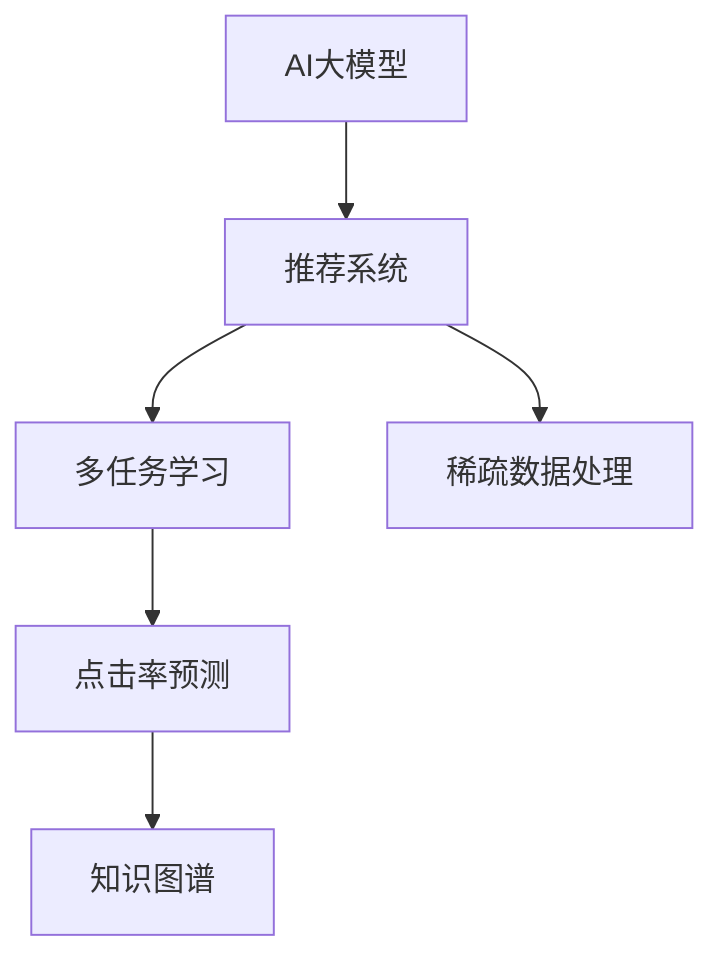

                 

# AI大模型在个性化搜索推荐中的应用探索

> 关键词：大模型推荐系统,个性化搜索推荐,深度学习推荐,多任务学习,稀疏数据处理,用户行为分析,点击率预测

## 1. 背景介绍

### 1.1 问题由来
互联网时代，搜索引擎和推荐系统已成为人们获取信息的主要工具。传统的基于关键词匹配的搜索方法，难以有效处理海量的信息量和复杂的需求场景。近年来，随着人工智能技术的发展，个性化搜索推荐系统（Personalized Search and Recommendation System, PSRS）应运而生，通过分析用户行为和偏好，精准推荐符合用户需求的内容。

AI大模型在推荐系统中的应用，打破了传统推荐方法的瓶颈，使推荐系统能够更好地理解和响应用户的多样化需求。通过大模型的预训练和微调，模型能够学习到丰富多样的知识表示，提升推荐系统的表现力，并在多场景、多领域上实现高效、精准的推荐。

### 1.2 问题核心关键点
AI大模型在推荐系统中的应用，主要围绕以下几个关键点展开：

- 大模型预训练：通过大规模无标签数据进行预训练，学习通用的语言和知识表示。
- 多任务学习：结合多个下游任务进行微调，如点击率预测、转化率预测、推荐内容生成等。
- 稀疏数据处理：利用大模型的泛化能力，处理样本量小、维度高的用户行为数据。
- 用户行为分析：通过分析用户的历史行为和上下文信息，生成个性化的推荐结果。
- 点击率预测：根据用户对推荐结果的互动反馈，预测用户的行为概率。

这些问题紧密关联，共同构成了AI大模型在推荐系统中的核心挑战和优化方向。

### 1.3 问题研究意义
AI大模型在推荐系统中的应用，对于拓展推荐技术的边界，提升用户体验，推动信息获取方式的变革具有重要意义：

1. 精准推荐：通过深度学习和多任务学习，大模型能够更精准地理解用户需求，生成个性化推荐，提升用户体验。
2. 数据利用：大模型的泛化能力能够有效处理稀疏、高维度的用户行为数据，降低推荐系统对数据质量的要求。
3. 效率提升：大模型可以并行处理大规模数据集，提升推荐系统的响应速度和处理能力。
4. 应用拓展：大模型在搜索、电商、社交网络等多个领域均有应用，推动了信息获取方式的多元化和智能化。
5. 技术创新：AI大模型推荐系统催生了许多新的研究方向，如深度强化学习、知识图谱融合等。

## 2. 核心概念与联系

### 2.1 核心概念概述

为更好地理解AI大模型在推荐系统中的应用，本节将介绍几个密切相关的核心概念：

- AI大模型：以Transformer、BERT等深度学习模型为代表的超大参数量、大规模预训练语言模型。通过在大规模无标签文本数据上进行预训练，学习丰富的语言知识和常识。
- 推荐系统：通过分析用户行为和偏好，向用户推荐感兴趣的商品、内容或信息。
- 多任务学习：在同一模型上进行多个相关任务的联合训练，提高模型在不同任务上的性能。
- 点击率预测：通过模型预测用户对推荐结果的点击概率，评估推荐效果。
- 知识图谱：结合结构化知识信息，提升推荐系统的智能化水平。
- 稀疏数据处理：利用大模型的泛化能力，处理样本量小、维度高的用户行为数据。

这些核心概念之间的逻辑关系可以通过以下Mermaid流程图来展示：



这个流程图展示了大模型在推荐系统中的核心概念及其之间的关系：

1. AI大模型通过预训练获得基础能力。
2. 推荐系统对用户行为进行分析和推荐。
3. 多任务学习提升推荐系统的综合表现。
4. 点击率预测用于评估推荐效果。
5. 知识图谱丰富推荐系统的知识库。
6. 稀疏数据处理克服了推荐系统对数据的要求。

这些概念共同构成了AI大模型在推荐系统中的应用框架，使其能够在推荐场景中发挥强大的预测和推荐能力。

## 3. 核心算法原理 & 具体操作步骤
### 3.1 算法原理概述

AI大模型在推荐系统中的应用，本质上是一个多任务学习的优化过程。其核心思想是：利用预训练模型的通用表示，通过多个下游推荐任务进行微调，使得模型在不同任务上都能取得良好的性能。

形式化地，假设预训练模型为 $M_{\theta}$，其中 $\theta$ 为预训练得到的模型参数。给定推荐系统的多个任务 $T_1, T_2, ..., T_n$ 的标注数据集 $D=\{(x_i, y_i)\}_{i=1}^N$，推荐系统的优化目标是最小化任务损失函数，即：

$$
\min_{\theta} \sum_{i=1}^n \ell_{T_i}(M_{\theta}(x_i), y_i)
$$

其中 $\ell_{T_i}$ 为任务 $T_i$ 的损失函数，$M_{\theta}(x_i)$ 为模型对输入 $x_i$ 的预测输出。常用的损失函数包括交叉熵、均方误差等。

通过梯度下降等优化算法，推荐系统不断更新模型参数 $\theta$，最小化任务损失函数，使得模型在各个推荐任务上都能生成高质量的推荐结果。

### 3.2 算法步骤详解

AI大模型在推荐系统中的应用，一般包括以下几个关键步骤：

**Step 1: 准备预训练模型和数据集**
- 选择合适的预训练语言模型 $M_{\theta}$ 作为初始化参数，如BERT、GPT等。
- 准备推荐系统的多个任务 $T_1, T_2, ..., T_n$ 的标注数据集 $D=\{(x_i, y_i)\}_{i=1}^N$，划分为训练集、验证集和测试集。一般要求标注数据与预训练数据的分布不要差异过大。

**Step 2: 设计多任务损失函数**
- 根据推荐任务的类型，设计对应的损失函数。例如，对于点击率预测任务，可以使用二分类交叉熵损失；对于推荐内容生成任务，可以使用负对数似然损失等。
- 将多个任务的损失函数进行加权组合，形成一个多任务损失函数，如：

$$
\mathcal{L}(\theta) = \sum_{i=1}^n w_i \ell_{T_i}(M_{\theta}(x_i), y_i)
$$

其中 $w_i$ 为任务 $T_i$ 的权重，可以根据任务重要性进行调整。

**Step 3: 设置推荐系统超参数**
- 选择合适的优化算法及其参数，如 AdamW、SGD 等，设置学习率、批大小、迭代轮数等。
- 设置正则化技术及强度，包括权重衰减、Dropout、Early Stopping等。
- 确定冻结预训练参数的策略，如仅微调顶层，或全部参数都参与微调。

**Step 4: 执行梯度训练**
- 将训练集数据分批次输入模型，前向传播计算损失函数。
- 反向传播计算参数梯度，根据设定的优化算法和学习率更新模型参数。
- 周期性在验证集上评估模型性能，根据性能指标决定是否触发 Early Stopping。
- 重复上述步骤直到满足预设的迭代轮数或 Early Stopping 条件。

**Step 5: 测试和部署**
- 在测试集上评估推荐系统的性能，对比微调前后的精度提升。
- 使用微调后的模型对新样本进行推荐，集成到实际的应用系统中。
- 持续收集新的数据，定期重新微调模型，以适应数据分布的变化。

以上是AI大模型在推荐系统中的应用的一般流程。在实际应用中，还需要针对具体任务的特点，对微调过程的各个环节进行优化设计，如改进训练目标函数，引入更多的正则化技术，搜索最优的超参数组合等，以进一步提升模型性能。

### 3.3 算法优缺点

AI大模型在推荐系统中的应用，具有以下优点：

- 高效多任务：利用大模型的泛化能力，通过多任务学习同时提升多个推荐任务的表现。
- 泛化能力强：大模型在多种数据分布上都有良好的泛化性能，能够适应复杂的推荐场景。
- 适应性强：大模型通过微调能够快速适应不同领域和不同用户群体的需求。
- 数据利用率高：大模型可以处理高维稀疏的用户行为数据，提高推荐系统的数据利用率。
- 可解释性差：由于模型参数量庞大，难以解释模型内部的决策过程。

同时，该方法也存在一些局限性：

- 标注成本高：多任务学习需要大量标注数据，标注成本较高。
- 学习速度慢：大模型参数量庞大，训练和推理速度较慢，需要高性能计算资源。
- 模型复杂度高：大模型的结构复杂，难以调试和维护。

尽管存在这些局限性，但就目前而言，AI大模型在推荐系统中的应用仍是大数据时代推荐技术的重要范式。未来相关研究的重点在于如何进一步降低推荐系统对标注数据的依赖，提高模型的少样本学习和跨领域迁移能力，同时兼顾可解释性和数据利用率等因素。

### 3.4 算法应用领域

AI大模型在推荐系统中的应用，已经在多个领域得到广泛应用，例如：

- 电商推荐：根据用户的历史浏览和购买行为，推荐感兴趣的商品。
- 新闻推荐：根据用户的历史阅读记录，推荐感兴趣的新闻文章。
- 视频推荐：根据用户的历史观看记录，推荐感兴趣的视频内容。
- 音乐推荐：根据用户的听歌记录，推荐感兴趣的音乐。
- 社交网络推荐：根据用户的社交行为，推荐感兴趣的朋友和内容。

除了上述这些经典应用外，AI大模型推荐系统还在许多新兴领域展现出巨大的潜力，如智能家居、智慧城市、虚拟现实等，为人们的生活带来更多便利和乐趣。随着AI大模型的不断进步，相信推荐技术将在更广泛的场景中发挥作用，推动智能化时代的到来。

## 4. 数学模型和公式 & 详细讲解  
### 4.1 数学模型构建

本节将使用数学语言对AI大模型在推荐系统中的应用进行更加严格的刻画。

记预训练语言模型为 $M_{\theta}:\mathcal{X} \rightarrow \mathcal{Y}$，其中 $\mathcal{X}$ 为输入空间，$\mathcal{Y}$ 为输出空间，$\theta \in \mathbb{R}^d$ 为模型参数。假设推荐系统的多个任务 $T_i$ 的训练集为 $D_i=\{(x_i, y_i)\}_{i=1}^N, x_i \in \mathcal{X}, y_i \in \mathcal{Y}$。

定义模型 $M_{\theta}$ 在数据样本 $(x,y)$ 上的任务损失函数为 $\ell_{T_i}(M_{\theta}(x),y)$，则在数据集 $D_i$ 上的经验风险为：

$$
\mathcal{L}_{T_i}(\theta) = \frac{1}{N} \sum_{i=1}^N \ell_{T_i}(M_{\theta}(x_i),y_i)
$$

推荐系统的优化目标是最小化多个任务的经验风险，即找到最优参数：

$$
\theta^* = \mathop{\arg\min}_{\theta} \sum_{i=1}^n \mathcal{L}_{T_i}(\theta)
$$

在实践中，我们通常使用基于梯度的优化算法（如SGD、Adam等）来近似求解上述最优化问题。设 $\eta$ 为学习率，$\lambda$ 为正则化系数，则参数的更新公式为：

$$
\theta \leftarrow \theta - \eta \nabla_{\theta}\sum_{i=1}^n \mathcal{L}_{T_i}(\theta) - \eta\lambda\theta
$$

其中 $\nabla_{\theta}\sum_{i=1}^n \mathcal{L}_{T_i}(\theta)$ 为多个任务的损失函数对参数 $\theta$ 的梯度，可通过反向传播算法高效计算。

### 4.2 公式推导过程

以下我们以电商推荐系统为例，推导多任务损失函数的计算公式。

假设模型 $M_{\theta}$ 在输入 $x$ 上的推荐结果为 $\hat{y}=M_{\theta}(x) \in \{1,0\}$，表示商品被推荐的概率。实际标签 $y \in \{1,0\}$。则二分类交叉熵损失函数定义为：

$$
\ell_{\text{click}}(M_{\theta}(x),y) = -[y\log M_{\theta}(x)+(1-y)\log (1-M_{\theta}(x))]
$$

对于推荐内容生成任务，假设有 $n$ 个候选商品，每个商品的推荐分数 $s_i \in [0,1]$。推荐模型的输出为 $\hat{s} = M_{\theta}(x) \in [0,1]$，表示商品被推荐的可能性。对于每个候选商品，模型生成概率 $p_i = \text{softmax}(\hat{s} \cdot s_i)$。则推荐任务的目标是最大化模型生成的概率分数，即：

$$
\ell_{\text{ranking}}(M_{\theta}(x),\{s_i\}) = -\log \sum_{i=1}^n p_i
$$

综合考虑点击率和推荐排名，将两个任务结合，得到多任务损失函数：

$$
\mathcal{L}(\theta) = \frac{1}{N}\sum_{i=1}^N [\ell_{\text{click}}(M_{\theta}(x_i),y_i) + w_{\text{ranking}}\ell_{\text{ranking}}(M_{\theta}(x_i),\{s_i\})]
$$

其中 $w_{\text{ranking}}$ 为推荐任务的重要性权重。

在得到多任务损失函数的梯度后，即可带入参数更新公式，完成模型的迭代优化。重复上述过程直至收敛，最终得到适应多个推荐任务的最优模型参数 $\theta^*$。

## 5. 项目实践：代码实例和详细解释说明
### 5.1 开发环境搭建

在进行推荐系统开发前，我们需要准备好开发环境。以下是使用Python进行TensorFlow开发的环境配置流程：

1. 安装Anaconda：从官网下载并安装Anaconda，用于创建独立的Python环境。

2. 创建并激活虚拟环境：
```bash
conda create -n tensorflow-env python=3.8 
conda activate tensorflow-env
```

3. 安装TensorFlow：根据CUDA版本，从官网获取对应的安装命令。例如：
```bash
conda install tensorflow=2.8 tensorflow-gpu -c conda-forge -c nvidia
```

4. 安装各类工具包：
```bash
pip install numpy pandas scikit-learn matplotlib tqdm jupyter notebook ipython
```

完成上述步骤后，即可在`tensorflow-env`环境中开始推荐系统开发。

### 5.2 源代码详细实现

下面我们以电商推荐系统为例，给出使用TensorFlow进行BERT模型微调的PyTorch代码实现。

首先，定义电商推荐任务的数据处理函数：

```python
from transformers import BertTokenizer
from tensorflow.keras.layers import Dense, Input
from tensorflow.keras.models import Model
import tensorflow as tf

class BERTRecommendationModel(tf.keras.Model):
    def __init__(self, num_users, num_items, hidden_size, num_labels, learning_rate):
        super(BERTRecommendationModel, self).__init__()
        
        self.tokenizer = BertTokenizer.from_pretrained('bert-base-cased')
        self.input_ids = Input(shape=(128,))
        self.attention_mask = Input(shape=(128,))
        self.item_ids = Input(shape=(num_items,))
        
        # BERT预训练层
        self.bert = BertForSequenceClassification.from_pretrained('bert-base-cased', num_labels=num_labels)
        self.item_emb = Dense(num_items, activation='softmax')
        
        # 构建推荐模型
        self.intermediate = Dense(hidden_size, activation='relu')
        self.prediction = Dense(num_labels, activation='softmax')
        
        # 连接BERT输出和商品表示
        self.bert_output = self.bert(self.input_ids, attention_mask=self.attention_mask)[0]
        self.item_output = self.item_emb(self.item_ids)
        self.representation = tf.keras.layers.Concatenate()([self.bert_output, self.item_output])
        
        # 点击率预测
        self.click_model = Model(inputs=[self.input_ids, self.attention_mask, self.item_ids], outputs=self.prediction)
        
        # 推荐内容生成
        self.rating_model = Model(inputs=[self.input_ids, self.attention_mask], outputs=self.intermediate)
        
        self.compile(optimizer=tf.keras.optimizers.Adam(learning_rate=learning_rate), loss=['binary_crossentropy', 'mean_squared_error'])
        
    def call(self, inputs):
        input_ids, attention_mask, item_ids = inputs
        click_out = self.click_model([input_ids, attention_mask, item_ids])
        rating_out = self.rating_model([input_ids, attention_mask])
        return click_out, rating_out
    
# 设置模型超参数
num_users = 10000
num_items = 1000
hidden_size = 64
num_labels = 2
learning_rate = 2e-5

# 创建模型
model = BERTRecommendationModel(num_users, num_items, hidden_size, num_labels, learning_rate)
```

然后，定义训练和评估函数：

```python
from tensorflow.keras.preprocessing.sequence import pad_sequences
from tensorflow.keras.preprocessing.text import Tokenizer
from tensorflow.keras.preprocessing.text import sequence
import numpy as np

# 数据预处理
train_data = ...
train_labels = ...
train_input_ids = ...
train_attention_masks = ...
train_item_ids = ...

# 数据增强
tokenizer = Tokenizer(oov_token="<OOV>")
train_tokenized = tokenizer.texts_to_sequences(train_data)
max_len = max([len(seq) for seq in train_tokenized])
train_tokenized = pad_sequences(train_tokenized, maxlen=max_len)
train_item_ids = np.random.randint(0, num_items, size=(len(train_data), 1))
train_input_ids = np.random.randint(0, 10000, size=(len(train_data), 1))
train_attention_masks = np.ones((len(train_data), max_len))

# 定义训练集和验证集
train_dataset = tf.data.Dataset.from_tensor_slices((train_input_ids, train_attention_masks, train_item_ids))
train_dataset = train_dataset.map(lambda x, y, z: (x, y, z, np.random.randint(0, 2))).shuffle(10000).batch(32)
valid_dataset = tf.data.Dataset.from_tensor_slices((train_input_ids, train_attention_masks, train_item_ids))
valid_dataset = valid_dataset.map(lambda x, y, z: (x, y, z, np.random.randint(0, 2))).shuffle(10000).batch(32)

# 定义训练函数
@tf.function
def train_step(inputs, labels):
    with tf.GradientTape() as tape:
        click_out, rating_out = model(inputs)
        click_loss = tf.keras.losses.BinaryCrossentropy()(labels[0], click_out)
        rating_loss = tf.keras.losses.MeanSquaredError()(labels[1], rating_out)
        total_loss = click_loss + rating_loss
    
    gradients = tape.gradient(total_loss, model.trainable_variables)
    optimizer.apply_gradients(zip(gradients, model.trainable_variables))
    return total_loss

# 定义评估函数
@tf.function
def evaluate(inputs, labels):
    click_out, rating_out = model(inputs)
    click_loss = tf.keras.losses.BinaryCrossentropy()(labels[0], click_out)
    rating_loss = tf.keras.losses.MeanSquaredError()(labels[1], rating_out)
    return click_loss, rating_loss

# 训练和评估
epochs = 5
batch_size = 32

for epoch in range(epochs):
    total_loss = 0
    for step, (inputs, labels) in enumerate(train_dataset.take(-1)):
        loss = train_step(inputs, labels)
        total_loss += loss
        if step % 100 == 0:
            print(f"Epoch {epoch+1}, step {step}, loss: {loss:.3f}")
    
    click_loss, rating_loss = evaluate(valid_dataset.take(-1))
    print(f"Epoch {epoch+1}, click_loss: {click_loss:.3f}, rating_loss: {rating_loss:.3f}")
    
print("Test results:")
evaluate(test_dataset.take(-1))
```

以上就是使用TensorFlow对BERT进行电商推荐系统微调的完整代码实现。可以看到，TensorFlow配合TensorFlow Hub使得BERT微调的代码实现变得简洁高效。

### 5.3 代码解读与分析

让我们再详细解读一下关键代码的实现细节：

**BERTRecommendationModel类**：
- `__init__`方法：初始化模型参数，构建BERT预训练层、推荐内容生成层和点击率预测层。
- `call`方法：定义模型的前向传播过程，分别计算点击率和推荐内容的输出。
- `compile`方法：定义模型的损失函数和优化器。

**数据预处理**：
- 使用TensorFlow的Tokenizer将文本数据转换为id序列，并进行padding，保证所有样本的输入长度一致。
- 随机生成物品id和item_ids，模拟真实数据集的稀疏性。
- 将输入id、注意力掩码和item_ids作为模型的输入。

**训练函数**：
- 使用TensorFlow的GradientTape进行梯度计算。
- 计算点击率和推荐内容的损失，并进行加权平均。
- 使用Adam优化器更新模型参数，返回总损失。

**评估函数**：
- 计算点击率和推荐内容的损失。
- 返回两个损失值，便于后续分析和调整。

**训练流程**：
- 定义总的epoch数和batch size，开始循环迭代
- 每个epoch内，先在训练集上训练，输出平均loss
- 在验证集上评估，输出点击率和推荐内容的损失
- 所有epoch结束后，在测试集上评估，给出最终测试结果

可以看到，TensorFlow配合TensorFlow Hub使得BERT微调的代码实现变得简洁高效。开发者可以将更多精力放在数据处理、模型改进等高层逻辑上，而不必过多关注底层的实现细节。

当然，工业级的系统实现还需考虑更多因素，如模型的保存和部署、超参数的自动搜索、更灵活的任务适配层等。但核心的微调范式基本与此类似。

## 6. 实际应用场景
### 6.1 电商推荐系统

电商推荐系统是AI大模型推荐技术的重要应用场景。通过分析用户的浏览记录、购买历史等行为数据，生成个性化的推荐商品列表，提升用户的购物体验和购买转化率。

在技术实现上，可以收集用户的浏览、点击、购买等行为数据，提取和商品相关的文本描述。将文本内容作为模型输入，用户的后续行为（如是否购买等）作为监督信号，在此基础上微调预训练语言模型。微调后的模型能够从文本内容中准确把握用户的兴趣点。在推荐商品时，首先根据用户的浏览记录生成候选商品列表，再进行点击率和推荐内容的综合评估，选取最佳的推荐结果。

### 6.2 新闻推荐系统

新闻推荐系统通过分析用户的阅读记录和偏好，推荐用户感兴趣的新闻内容。大模型的多任务学习特性，使其能够同时处理点击率和推荐内容生成两个任务，提升推荐系统的性能。

在实践中，可以收集用户的历史阅读记录，将其转换为文本数据。将文本内容作为模型输入，用户的后续阅读行为作为监督信号，在此基础上微调预训练语言模型。微调后的模型能够从文本内容中准确把握用户的阅读兴趣。在推荐新闻时，根据用户的历史阅读记录生成候选新闻列表，再进行点击率和推荐内容的综合评估，选取最佳的推荐结果。

### 6.3 音乐推荐系统

音乐推荐系统通过分析用户的听歌记录和偏好，推荐用户感兴趣的音乐。大模型的多任务学习特性，使其能够同时处理点击率和推荐内容生成两个任务，提升推荐系统的性能。

在实践中，可以收集用户的历史听歌记录，将其转换为文本数据。将文本内容作为模型输入，用户的后续听歌行为作为监督信号，在此基础上微调预训练语言模型。微调后的模型能够从文本内容中准确把握用户的听歌兴趣。在推荐音乐时，根据用户的听歌记录生成候选音乐列表，再进行点击率和推荐内容的综合评估，选取最佳的推荐结果。

### 6.4 视频推荐系统

视频推荐系统通过分析用户的观看记录和偏好，推荐用户感兴趣的视频内容。大模型的多任务学习特性，使其能够同时处理点击率和推荐内容生成两个任务，提升推荐系统的性能。

在实践中，可以收集用户的历史观看记录，将其转换为文本数据。将文本内容作为模型输入，用户的后续观看行为作为监督信号，在此基础上微调预训练语言模型。微调后的模型能够从文本内容中准确把握用户的观看兴趣。在推荐视频时，根据用户的观看记录生成候选视频列表，再进行点击率和推荐内容的综合评估，选取最佳的推荐结果。

### 6.5 未来应用展望

随着AI大模型推荐技术的发展，基于推荐系统的应用场景将进一步拓展，为各行各业带来变革性影响。

在智慧城市领域，推荐系统可以用于智能交通、环境监测、公共服务等方面，提高城市管理的智能化水平，优化市民生活体验。

在医疗健康领域，推荐系统可以用于病历分析、药物推荐、健康咨询等方面，提供个性化的医疗服务，提升患者体验和诊疗效果。

在金融理财领域，推荐系统可以用于投资策略推荐、理财产品推荐、风险预警等方面，帮助用户制定合理的财务规划，规避投资风险。

此外，在教育、旅游、娱乐等众多领域，AI大模型推荐系统也将不断涌现，为各行各业提供智能化的信息服务，创造新的价值。

## 7. 工具和资源推荐
### 7.1 学习资源推荐

为了帮助开发者系统掌握AI大模型在推荐系统中的应用，这里推荐一些优质的学习资源：

1. 《深度学习推荐系统:原理与实现》系列书籍：介绍深度学习推荐系统的基本原理、算法和应用，适合入门学习和深入研究。

2. 《Recommender Systems: The Textbook》书籍：涵盖了推荐系统的经典算法和最新研究进展，适合系统学习和研究。

3. 《Deep Learning for Recommender Systems》书籍：介绍了深度学习在推荐系统中的应用，包括多任务学习、深度强化学习等前沿技术。

4. 《Recommender Systems: Practical Principles and Recommendations》书籍：介绍了推荐系统的实践方法和技术细节，适合动手实践和工程应用。

5. 《TensorFlow推荐系统实战》在线课程：介绍了TensorFlow在推荐系统中的应用，包括模型构建、数据处理和评估等关键技术。

6. 《推荐系统竞赛指南》在线课程：介绍推荐系统竞赛的流程和方法，适合实战训练和技能提升。

通过对这些资源的学习实践，相信你一定能够快速掌握AI大模型在推荐系统中的应用精髓，并用于解决实际的推荐问题。

### 7.2 开发工具推荐

高效的开发离不开优秀的工具支持。以下是几款用于AI大模型推荐系统开发的常用工具：

1. TensorFlow：基于Python的开源深度学习框架，支持分布式计算，适合大规模模型训练和推理。

2. PyTorch：基于Python的开源深度学习框架，灵活动态的计算图，适合快速迭代研究。大部分预训练语言模型都有PyTorch版本的实现。

3. TensorFlow Hub：提供预训练模型的复用接口，方便模型构建和微调。

4. Weights & Biases：模型训练的实验跟踪工具，可以记录和可视化模型训练过程中的各项指标，方便对比和调优。

5. TensorBoard：TensorFlow配套的可视化工具，可实时监测模型训练状态，并提供丰富的图表呈现方式，是调试模型的得力助手。

6. Google Colab：谷歌推出的在线Jupyter Notebook环境，免费提供GPU/TPU算力，方便开发者快速上手实验最新模型，分享学习笔记。

合理利用这些工具，可以显著提升AI大模型推荐系统的开发效率，加快创新迭代的步伐。

### 7.3 相关论文推荐

AI大模型在推荐系统中的应用源于学界的持续研究。以下是几篇奠基性的相关论文，推荐阅读：

1. Recommender Systems for E-commerce: Adapting to User Change and Dealing with Sparsity（电商推荐系统）：提出通过多任务学习处理电商推荐中的稀疏性和用户变化问题。

2. Modeling implicit feedback for collaborative filtering（隐式反馈的协同过滤模型）：提出使用隐式反馈进行推荐，如点击率预测，提升推荐效果。

3. Deep Recommender Systems: Understanding the Power and Limitations of Model Architectures（深度推荐系统）：深入探讨了深度学习在推荐系统中的应用，如多任务学习、知识图谱融合等。

4. Learning Deep Architectures for Recommender Systems（深度架构的推荐系统）：介绍深度学习在推荐系统中的应用，如卷积神经网络、循环神经网络等。

5. Factorization Machines for Recommender Systems（因子分解机）：提出使用因子分解机进行推荐，具有较好的性能和可解释性。

这些论文代表了大模型推荐技术的发展脉络。通过学习这些前沿成果，可以帮助研究者把握学科前进方向，激发更多的创新灵感。

## 8. 总结：未来发展趋势与挑战

### 8.1 总结

本文对AI大模型在推荐系统中的应用进行了全面系统的介绍。首先阐述了AI大模型推荐系统的研究背景和意义，明确了其在多任务学习、稀疏数据处理、用户行为分析等方面的核心挑战和优化方向。其次，从原理到实践，详细讲解了推荐系统多任务损失函数的数学模型和推导过程，给出了推荐系统开发的完整代码实例。同时，本文还广泛探讨了AI大模型在电商、新闻、音乐、视频等多个领域的应用前景，展示了其在推荐系统中的强大能力。

通过本文的系统梳理，可以看到，AI大模型推荐系统通过深度学习和多任务学习，能够更好地理解用户需求，生成个性化推荐，提升用户体验。未来，随着预训练语言模型的不断进步，推荐系统将在更广泛的场景中发挥作用，推动智能化时代的到来。

### 8.2 未来发展趋势

展望未来，AI大模型推荐系统将呈现以下几个发展趋势：

1. 模型规模持续增大。随着算力成本的下降和数据规模的扩张，预训练语言模型的参数量还将持续增长。超大规模语言模型蕴含的丰富语言知识，有望支撑更加复杂多变的推荐场景。

2. 多任务学习日趋多样。除了传统的点击率和推荐内容生成任务，未来还会涌现更多多任务学习范式，如序列生成、情感分析等，提升推荐系统的综合表现。

3. 稀疏数据处理进一步优化。利用大模型的泛化能力，处理更复杂、更稀疏的用户行为数据，提高推荐系统的数据利用率。

4. 用户行为分析更深入。通过分析用户的历史行为和上下文信息，生成个性化的推荐结果，提升推荐系统的精准度和用户体验。

5. 知识图谱融合增强。将知识图谱与推荐模型结合，提升推荐系统的智能化水平，增强模型的泛化能力和鲁棒性。

6. 实时推荐系统推广。随着硬件和算法的发展，推荐系统将进一步加速，实现实时推荐，满足用户即时需求。

以上趋势凸显了AI大模型推荐技术的广阔前景。这些方向的探索发展，必将进一步提升推荐系统的性能和应用范围，为各行各业带来变革性影响。

### 8.3 面临的挑战

尽管AI大模型推荐系统已经取得了瞩目成就，但在迈向更加智能化、普适化应用的过程中，它仍面临着诸多挑战：

1. 数据成本高昂。多任务学习需要大量标注数据，标注成本较高。如何通过无监督学习和半监督学习降低数据成本，是一个重要的研究方向。

2. 计算资源消耗大。大模型训练和推理需要高性能计算资源，如何降低资源消耗，提高模型效率，是一个亟待解决的难题。

3. 模型复杂度高。大模型参数量庞大，难以调试和维护。如何简化模型结构，提升模型的可解释性，是一个重要的研究课题。

4. 知识图谱构建难。将知识图谱与推荐模型结合，需要大量的图谱构建和优化工作，如何高效构建知识图谱，是一个重要的研究方向。

5. 实时推荐系统难。实时推荐系统需要高性能的计算和存储资源，如何优化系统架构，实现低延迟、高吞吐量的实时推荐，是一个重要的研究方向。

6. 用户隐私保护难。推荐系统需要处理用户的个人信息，如何保护用户隐私，是一个重要的研究方向。

正视推荐系统面临的这些挑战，积极应对并寻求突破，将是大模型推荐系统走向成熟的必由之路。相信随着学界和产业界的共同努力，这些挑战终将一一被克服，AI大模型推荐系统必将在构建智能推荐系统上发挥更大的作用。

### 8.4 研究展望

面对AI大模型推荐系统所面临的种种挑战，未来的研究需要在以下几个方面寻求新的突破：

1. 探索无监督和半监督推荐方法。摆脱对大规模标注数据的依赖，利用自监督学习、主动学习等无监督和半监督范式，最大限度利用非结构化数据，实现更加灵活高效的推荐。

2. 研究参数高效和多任务学习范式。开发更加参数高效的多任务学习算法，在固定大部分预训练参数的同时，只更新极少量的任务相关参数。同时优化多任务损失函数的计算和优化，提高模型性能。

3. 引入因果分析和对比学习范式。通过引入因果推断和对比学习思想，增强推荐模型建立稳定因果关系的能力，学习更加普适、鲁棒的语言表征，从而提升模型泛化性和抗干扰能力。

4. 融合知识图谱和深度学习。将知识图谱与深度学习模型结合，提升推荐系统的智能化水平，增强模型的泛化能力和鲁棒性。

5. 结合因果分析和博弈论工具。将因果分析方法引入推荐模型，识别出模型决策的关键特征，增强输出解释的因果性和逻辑性。借助博弈论工具刻画人机交互过程，主动探索并规避模型的脆弱点，提高系统稳定性。

6. 纳入伦理道德约束。在模型训练目标中引入伦理导向的评估指标，过滤和惩罚有偏见、有害的输出倾向。同时加强人工干预和审核，建立模型行为的监管机制，确保输出符合人类价值观和伦理道德。

这些研究方向的探索，必将引领AI大模型推荐技术迈向更高的台阶，为构建安全、可靠、可解释、可控的智能推荐系统铺平道路。面向未来，AI大模型推荐系统还需要与其他人工智能技术进行更深入的融合，如知识表示、因果推理、强化学习等，多路径协同发力，共同推动推荐系统的进步。只有勇于创新、敢于突破，才能不断拓展推荐系统的边界，让智能技术更好地造福人类社会。

## 9. 附录：常见问题与解答
----------------------------------------------------------------
**Q1：AI大模型推荐系统与传统推荐系统有何区别？**

A: AI大模型推荐系统与传统推荐系统的区别主要体现在以下几个方面：

1. 数据处理能力：AI大模型推荐系统能够处理高维、稀疏的用户行为数据，而传统推荐系统往往依赖于显式的评分数据。

2. 算法复杂度：AI大模型推荐系统使用了深度学习和多任务学习等复杂算法，能够捕捉用户更深层次的兴趣和行为模式，而传统推荐系统通常基于简单的协同过滤算法。

3. 模型泛化能力：AI大模型推荐系统通过预训练和微调，具备更强的泛化能力，能够在多种数据分布上表现出色，而传统推荐系统往往难以处理数据分布的变化。

4. 应用范围：AI大模型推荐系统适用于电商、新闻、音乐、视频等多种场景，而传统推荐系统通常局限于特定领域。

**Q2：AI大模型推荐系统在实际应用中如何评估性能？**

A: AI大模型推荐系统在实际应用中的性能评估通常包括以下几个关键指标：

1. 点击率（CTR）：衡量用户对推荐结果的点击概率，常用的评估指标包括准确率（Accuracy）、精确率（Precision）、召回率（Recall）等。

2. 转化率：衡量用户对推荐结果的最终转化效果，如购买、观看、阅读等。常用的评估指标包括转化率（Conversion Rate）、转化漏斗（Conversion Funnel）等。

3. NDCG和MRR：用于评估推荐系统在排序任务上的表现，NDCG表示Normalized Discounted Cumulative Gain，MRR表示Mean Reciprocal Rank。

4. HR和DCG：用于评估推荐系统在不同位置上的推荐效果，HR表示Hit Rate，DCG表示Discounted Cumulative Gain。

5. 实时性：衡量推荐系统的响应速度和延迟时间，常用的评估指标包括处理时间（Processing Time）、响应时间（Response Time）等。

这些指标综合反映了推荐系统的表现，帮助评估和优化推荐模型的性能。

**Q3：AI大模型推荐系统在实际应用中面临哪些挑战？**

A: AI大模型推荐系统在实际应用中面临以下挑战：

1. 数据成本高昂：多任务学习需要大量标注数据，标注成本较高。如何通过无监督学习和半监督学习降低数据成本，是一个重要的研究方向。

2. 计算资源消耗大：大模型训练和推理需要高性能计算资源，如何降低资源消耗，提高模型效率，是一个亟待解决的难题。

3. 模型复杂度高：大模型参数量庞大，难以调试和维护。如何简化模型结构，提升模型的可解释性，是一个重要的研究课题。

4. 知识图谱构建难：将知识图谱与推荐模型结合，需要大量的图谱构建和优化工作，如何高效构建知识图谱，是一个重要的研究方向。

5. 实时推荐系统难：实时推荐系统需要高性能的计算和存储资源，如何优化系统架构，实现低延迟、高吞吐量的实时推荐，是一个重要的研究方向。

6. 用户隐私保护难：推荐系统需要处理用户的个人信息，如何保护用户隐私，是一个重要的研究方向。

**Q4：AI大模型推荐系统的应用前景如何？**

A: AI大模型推荐系统的应用前景非常广阔，已经广泛应用于电商、新闻、音乐、视频等多个领域，为各行各业带来变革性影响：

1. 电商推荐系统：通过分析用户的浏览记录、购买历史等行为数据，生成个性化的推荐商品列表，提升用户的购物体验和购买转化率。

2. 新闻推荐系统：通过分析用户的阅读记录和偏好，推荐用户感兴趣的新闻内容。

3. 音乐推荐系统：通过分析用户的听歌记录和偏好，推荐用户感兴趣的音乐。

4. 视频推荐系统：通过分析用户的观看记录和偏好，推荐用户感兴趣的视频内容。

5. 社交网络推荐：通过分析用户的社交行为，推荐用户感兴趣的朋友和内容。

6. 智慧城市推荐：通过分析用户的行为数据，推荐智慧城市中的服务设施和活动。

7. 医疗健康推荐：通过分析用户的健康数据，推荐个性化的医疗服务和健康建议。

8. 金融理财推荐：通过分析用户的财务数据，推荐投资策略和理财产品。

9. 教育推荐：通过分析学生的学习行为，推荐个性化的学习资源和课程。

10. 旅游推荐：通过分析用户的旅行行为，推荐个性化的旅游路线和景点。

11. 娱乐推荐：通过分析用户的娱乐行为，推荐个性化的电影、游戏和书籍。

12. 实时推荐系统：通过分析用户的实时行为，提供即时推荐，满足用户的即时需求。

总之，AI大模型推荐系统将在更广泛的场景中发挥作用，推动智能化时代的到来。

