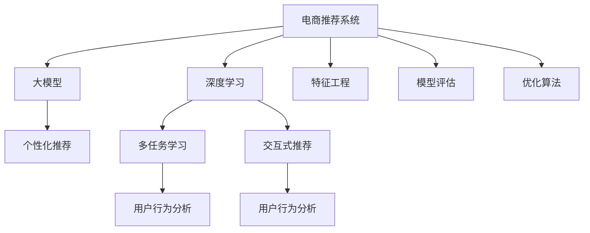

                 

# AI大模型在电商个性化推荐中的深度应用

> 关键词：电商推荐系统, 个性化推荐, 大模型, 深度学习, 多任务学习, 交互式推荐, 用户行为分析, 特征工程, 模型评估, 优化算法

## 1. 背景介绍

### 1.1 问题由来

随着电子商务的兴起，各大电商平台为了提高用户满意度、增加销售转化率，纷纷大力投资于个性化推荐系统。推荐系统通过分析用户的历史行为数据，预测其可能感兴趣的商品，从而在合适的时机推送给用户。

传统的推荐系统大多基于协同过滤、基于内容的推荐等方法，这些方法大多依赖于用户历史行为或商品特征，难以处理新用户或新商品。而基于深度学习的大模型推荐系统，则通过大规模预训练语言模型，学习用户的语义行为特征，结合用户与商品间的交互信息，提供更加精准的个性化推荐。

### 1.2 问题核心关键点

电商个性化推荐的核心在于如何在海量数据中，准确预测用户对商品的兴趣，并及时推送其感兴趣的商品。这需要模型具备强大的特征提取能力、鲁棒性和泛化能力，同时能够实时处理用户的多样化需求和行为动态变化。

当前，大模型在电商推荐中的应用主要集中在：
- 用户行为理解：通过分析用户的文本评论、浏览历史等文本数据，提取用户行为特征。
- 商品描述提取：对商品标题、描述、属性等文本信息进行语义理解和特征提取。
- 用户商品关联建模：将用户行为与商品特征进行协同建模，预测用户对商品感兴趣的概率。
- 实时推荐：在用户点击、购买等即时行为发生时，能够快速生成推荐列表。

这些技术的深度应用，使得电商推荐系统能够更智能地匹配商品与用户需求，提升用户体验和平台转化率，助力电商平台的用户增长和营收增长。

## 2. 核心概念与联系

### 2.1 核心概念概述

为更好地理解AI大模型在电商推荐中的应用，本节将介绍几个核心概念及其相互关系：

- **电商推荐系统(Recommendation System)**：利用用户行为数据和商品特征，推荐用户可能感兴趣的商品。
- **深度学习(Deep Learning)**：通过多层神经网络结构，自动学习数据的分布特征，解决复杂非线性问题。
- **大模型(Large Model)**：指具有亿级参数规模的深度神经网络模型，如BERT、GPT等，能学习到丰富的语言知识和特征。
- **个性化推荐(Personalized Recommendation)**：根据用户个人偏好和行为，推荐可能感兴趣的商品或内容。
- **多任务学习(Multi-task Learning)**：同时进行多个相关任务的模型训练，共享和利用底层特征。
- **交互式推荐(Interactive Recommendation)**：在用户与推荐系统的交互过程中，动态调整推荐策略，提升用户体验。
- **用户行为分析(Online Behavior Analysis)**：通过数据分析挖掘，理解用户行为模式和偏好。
- **特征工程(Feature Engineering)**：提取和组合特征，提升模型的预测能力和泛化能力。
- **模型评估(Model Evaluation)**：使用各类指标和评估方法，衡量推荐系统的性能和效果。
- **优化算法(Optimization Algorithm)**：用于训练模型，优化损失函数，提升模型预测能力。

这些概念之间存在紧密的联系，共同构成了电商推荐系统的大框架。其中，深度学习、大模型和个性化推荐是核心技术，而多任务学习、交互式推荐和用户行为分析则提供了更加高效和精准的推荐方式，特征工程和模型评估则保证了模型训练的质量和效果，优化算法则是模型训练的必要工具。

这些概念之间的逻辑关系可以通过以下Mermaid流程图来展示：



这个流程图展示了电商推荐系统的核心组件及其相互关系：

1. 电商推荐系统通过深度学习和大模型提取和理解用户行为特征和商品特征。
2. 个性化推荐结合多任务学习、交互式推荐和用户行为分析，实时生成精准推荐。
3. 特征工程提升模型的特征提取能力，模型评估衡量模型性能，优化算法优化模型训练。

这些概念共同构成了电商推荐系统的技术框架，使得推荐系统能够更好地理解和匹配用户需求，提供更加个性化和高效的推荐服务。

## 3. 核心算法原理 & 具体操作步骤
### 3.1 算法原理概述

电商推荐系统中的核心算法原理涉及以下几个关键点：

1. **深度学习特征提取**：利用预训练大模型，学习用户和商品的语义特征。
2. **多任务学习**：将用户行为分析、商品描述理解和用户商品关联建模等多个任务融合，共享特征表示。
3. **交互式推荐**：在推荐过程中，根据用户即时反馈调整推荐策略，提升用户体验。
4. **实时推荐系统**：通过优化算法实时处理用户即时行为数据，生成推荐结果。

基于这些算法原理，电商推荐系统能够高效、实时地生成个性化推荐，提升用户体验和销售转化率。

### 3.2 算法步骤详解

基于深度学习的大模型电商推荐系统，主要包括以下几个关键步骤：

**Step 1: 数据预处理**
- 收集用户历史行为数据、商品属性信息、商品描述文本等。
- 进行数据清洗、特征提取，生成用于模型训练的特征向量。

**Step 2: 构建深度学习模型**
- 选择合适的深度学习框架（如TensorFlow、PyTorch等），定义模型结构。
- 利用预训练大模型（如BERT、GPT等），提取用户行为和商品特征。
- 定义损失函数、优化器等训练参数。

**Step 3: 模型训练与评估**
- 在标注数据上训练模型，通过优化算法（如Adam、SGD等）更新模型参数。
- 在验证集上评估模型性能，使用AUC、RMSE等指标进行模型选择。
- 对模型进行调参优化，提升预测能力和泛化能力。

**Step 4: 实时推荐系统部署**
- 将训练好的模型部署到线上服务器，实时接收用户即时行为数据。
- 根据用户行为和商品特征，利用深度学习模型生成推荐结果。
- 根据用户反馈和推荐效果进行动态调整，不断优化推荐策略。

**Step 5: 推荐系统优化与迭代**
- 对推荐系统进行定期评估和优化，提升用户体验和转化率。
- 根据用户反馈和行为数据，进行模型迭代更新，提升模型效果。

### 3.3 算法优缺点

基于深度学习的大模型电商推荐系统有以下优点：
1. 精度高：大模型能够学习到丰富的语言知识，提供更加精准的推荐。
2. 泛化能力强：大模型能够处理多种类型的输入数据，适应不同应用场景。
3. 实时性好：通过优化算法和实时处理，能够快速生成推荐结果。
4. 模型可解释：借助大模型的预训练知识，可以更好地解释推荐结果。

同时，该算法也存在以下缺点：
1. 数据需求量大：需要大量用户行为数据和商品属性数据，数据收集和标注成本较高。
2. 模型复杂度高：深度学习模型结构复杂，训练和优化较为耗时。
3. 模型解释性不足：大模型决策过程复杂，难以进行特征解释。
4. 对抗性鲁棒性不足：对抗样本和噪声数据可能会影响模型预测结果。

尽管存在这些局限性，但基于深度学习的大模型电商推荐系统，仍然是目前最先进、最有效的推荐方式之一，广泛应用于各大电商平台。

### 3.4 算法应用领域

基于深度学习的大模型电商推荐系统在多个领域中得到了广泛的应用，包括但不限于：

- **电商推荐系统**：如淘宝、京东、亚马逊等，通过用户行为和商品特征生成精准推荐。
- **影视推荐系统**：如Netflix、爱奇艺等，通过用户观影历史和评分预测用户可能喜欢的影视作品。
- **音乐推荐系统**：如Spotify、网易云音乐等，通过用户听歌历史和评分推荐音乐。
- **旅游推荐系统**：如携程、马蜂窝等，通过用户旅行历史和评分推荐旅游目的地和行程安排。

此外，大模型电商推荐系统还被应用于智慧城市、健康医疗、金融服务等领域，成为数据驱动决策的重要工具。

## 4. 数学模型和公式 & 详细讲解  
### 4.1 数学模型构建

假设电商推荐系统接收用户即时行为数据 $X$，用户行为特征 $U$ 和商品特征 $I$ 为向量表示，推荐结果 $Y$ 为评分或点击概率。

利用大模型 $M$，用户行为特征 $U$ 和商品特征 $I$ 映射为隐层表示 $Z$：

$$
Z = M(U, I)
$$

定义推荐模型的损失函数为：

$$
\mathcal{L} = \frac{1}{N} \sum_{i=1}^N \ell(Y_i, \hat{Y}_i)
$$

其中 $\ell$ 为交叉熵损失函数，$Y_i$ 为真实评分或点击，$\hat{Y}_i$ 为模型预测结果。

通过梯度下降等优化算法，最小化损失函数 $\mathcal{L}$，更新模型参数。

### 4.2 公式推导过程

假设用户行为特征 $U$ 和商品特征 $I$ 的嵌入表示分别为 $u$ 和 $i$，则隐层表示 $Z$ 可以表示为：

$$
Z = \text{MLP}(u \cdot W_u + i \cdot W_i)
$$

其中 $\text{MLP}$ 为多层感知机，$W_u$ 和 $W_i$ 为可训练的线性映射权重。

模型预测的评分或点击概率 $Y$ 为：

$$
Y = \sigma(\text{MLP}(z))
$$

其中 $\sigma$ 为sigmoid函数，用于将隐层表示映射为0到1之间的概率值。

通过交叉熵损失函数，定义推荐模型的损失：

$$
\ell(Y_i, \hat{Y}_i) = -y_i \log \hat{Y}_i - (1-y_i) \log (1-\hat{Y}_i)
$$

在训练过程中，通过梯度下降算法优化模型参数 $W_u$、$W_i$ 和 $\text{MLP}$ 的权重，最小化损失函数 $\mathcal{L}$。

## 5. 项目实践：代码实例和详细解释说明
### 5.1 开发环境搭建

在进行电商推荐系统开发前，我们需要准备好开发环境。以下是使用Python进行PyTorch开发的环境配置流程：

1. 安装Anaconda：从官网下载并安装Anaconda，用于创建独立的Python环境。

2. 创建并激活虚拟环境：
```bash
conda create -n pytorch-env python=3.8 
conda activate pytorch-env
```

3. 安装PyTorch：根据CUDA版本，从官网获取对应的安装命令。例如：
```bash
conda install pytorch torchvision torchaudio cudatoolkit=11.1 -c pytorch -c conda-forge
```

4. 安装其他相关库：
```bash
pip install numpy pandas scikit-learn torchtext transformers torch
```

5. 安装各类工具包：
```bash
pip install tqdm jupyter notebook ipython
```

完成上述步骤后，即可在`pytorch-env`环境中开始电商推荐系统的开发。

### 5.2 源代码详细实现

下面以电商推荐系统为例，给出使用Transformers库对BERT模型进行电商推荐训练的PyTorch代码实现。

首先，定义推荐数据处理函数：

```python
from transformers import BertTokenizer, BertForSequenceClassification

class RecommendationDataset(Dataset):
    def __init__(self, texts, labels):
        self.texts = texts
        self.labels = labels
        
    def __len__(self):
        return len(self.texts)
    
    def __getitem__(self, item):
        text = self.texts[item]
        label = self.labels[item]
        
        encoding = tokenizer(text, return_tensors='pt')
        input_ids = encoding['input_ids'][0]
        attention_mask = encoding['attention_mask'][0]
        
        return {'input_ids': input_ids, 
                'attention_mask': attention_mask,
                'labels': torch.tensor(label, dtype=torch.long)}
```

然后，定义模型和优化器：

```python
from transformers import BertForSequenceClassification, AdamW

model = BertForSequenceClassification.from_pretrained('bert-base-cased', num_labels=2)
optimizer = AdamW(model.parameters(), lr=2e-5)
```

接着，定义训练和评估函数：

```python
from torch.utils.data import DataLoader
from tqdm import tqdm
from sklearn.metrics import accuracy_score

device = torch.device('cuda') if torch.cuda.is_available() else torch.device('cpu')
model.to(device)

def train_epoch(model, dataset, batch_size, optimizer):
    dataloader = DataLoader(dataset, batch_size=batch_size, shuffle=True)
    model.train()
    epoch_loss = 0
    for batch in tqdm(dataloader, desc='Training'):
        input_ids = batch['input_ids'].to(device)
        attention_mask = batch['attention_mask'].to(device)
        labels = batch['labels'].to(device)
        model.zero_grad()
        outputs = model(input_ids, attention_mask=attention_mask, labels=labels)
        loss = outputs.loss
        epoch_loss += loss.item()
        loss.backward()
        optimizer.step()
    return epoch_loss / len(dataloader)

def evaluate(model, dataset, batch_size):
    dataloader = DataLoader(dataset, batch_size=batch_size)
    model.eval()
    preds, labels = [], []
    with torch.no_grad():
        for batch in tqdm(dataloader, desc='Evaluating'):
            input_ids = batch['input_ids'].to(device)
            attention_mask = batch['attention_mask'].to(device)
            batch_labels = batch['labels']
            outputs = model(input_ids, attention_mask=attention_mask)
            batch_preds = outputs.logits.argmax(dim=2).to('cpu').tolist()
            batch_labels = batch_labels.to('cpu').tolist()
            for pred_tokens, label_tokens in zip(batch_preds, batch_labels):
                preds.append(pred_tokens[:len(label_tokens)])
                labels.append(label_tokens)
                
    print(f"Accuracy: {accuracy_score(labels, preds)}")
```

最后，启动训练流程并在测试集上评估：

```python
epochs = 5
batch_size = 16

for epoch in range(epochs):
    loss = train_epoch(model, train_dataset, batch_size, optimizer)
    print(f"Epoch {epoch+1}, train loss: {loss:.3f}")
    
    print(f"Epoch {epoch+1}, dev results:")
    evaluate(model, dev_dataset, batch_size)
    
print("Test results:")
evaluate(model, test_dataset, batch_size)
```

以上就是使用PyTorch对BERT进行电商推荐任务训练的完整代码实现。可以看到，得益于Transformers库的强大封装，我们可以用相对简洁的代码完成BERT模型的加载和微调。

### 5.3 代码解读与分析

让我们再详细解读一下关键代码的实现细节：

**RecommendationDataset类**：
- `__init__`方法：初始化文本、标签等关键组件。
- `__len__`方法：返回数据集的样本数量。
- `__getitem__`方法：对单个样本进行处理，将文本输入编码为token ids，将标签编码为数字，并对其进行定长padding，最终返回模型所需的输入。

**模型定义**：
- 使用BertForSequenceClassification模型，设置标签数为2，即点击或不点击。
- 初始化AdamW优化器，设置学习率为2e-5。

**训练和评估函数**：
- 使用PyTorch的DataLoader对数据集进行批次化加载，供模型训练和推理使用。
- 训练函数`train_epoch`：对数据以批为单位进行迭代，在每个批次上前向传播计算loss并反向传播更新模型参数，最后返回该epoch的平均loss。
- 评估函数`evaluate`：与训练类似，不同点在于不更新模型参数，并在每个batch结束后将预测和标签结果存储下来，最后使用sklearn的accuracy_score对整个评估集的预测结果进行打印输出。

**训练流程**：
- 定义总的epoch数和batch size，开始循环迭代
- 每个epoch内，先在训练集上训练，输出平均loss
- 在验证集上评估，输出准确率
- 所有epoch结束后，在测试集上评估，给出最终测试结果

可以看到，PyTorch配合Transformers库使得BERT微调的代码实现变得简洁高效。开发者可以将更多精力放在数据处理、模型改进等高层逻辑上，而不必过多关注底层的实现细节。

当然，工业级的系统实现还需考虑更多因素，如模型的保存和部署、超参数的自动搜索、更灵活的任务适配层等。但核心的微调范式基本与此类似。

## 6. 实际应用场景
### 6.1 智能客服系统

基于大模型电商推荐系统的推荐技术，可以广泛应用于智能客服系统的构建。传统客服往往需要配备大量人力，高峰期响应缓慢，且一致性和专业性难以保证。而使用电商推荐系统的推荐技术，可以7x24小时不间断服务，快速响应客户咨询，用自然流畅的语言解答各类常见问题。

在技术实现上，可以收集企业内部的历史客服对话记录，将问题和最佳答复构建成监督数据，在此基础上对电商推荐系统进行微调。微调后的推荐系统能够自动理解用户意图，匹配最合适的答复模板进行回复。对于客户提出的新问题，还可以接入检索系统实时搜索相关内容，动态组织生成回答。如此构建的智能客服系统，能大幅提升客户咨询体验和问题解决效率。

### 6.2 金融舆情监测

金融机构需要实时监测市场舆论动向，以便及时应对负面信息传播，规避金融风险。传统的人工监测方式成本高、效率低，难以应对网络时代海量信息爆发的挑战。基于大模型电商推荐系统的文本分类和情感分析技术，为金融舆情监测提供了新的解决方案。

具体而言，可以收集金融领域相关的新闻、报道、评论等文本数据，并对其进行主题标注和情感标注。在此基础上对电商推荐系统进行微调，使其能够自动判断文本属于何种主题，情感倾向是正面、中性还是负面。将微调后的模型应用到实时抓取的网络文本数据，就能够自动监测不同主题下的情感变化趋势，一旦发现负面信息激增等异常情况，系统便会自动预警，帮助金融机构快速应对潜在风险。

### 6.3 个性化推荐系统

当前的推荐系统往往只依赖用户的历史行为数据进行物品推荐，无法深入理解用户的真实兴趣偏好。基于大模型电商推荐系统的推荐技术，可以更好地挖掘用户行为背后的语义信息，从而提供更加精准的个性化推荐。

在实践中，可以收集用户浏览、点击、评论、分享等行为数据，提取和商品标题、描述、标签等文本内容。将文本内容作为模型输入，用户的后续行为（如是否点击、购买等）作为监督信号，在此基础上微调电商推荐系统。微调后的模型能够从文本内容中准确把握用户的兴趣点。在生成推荐列表时，先用候选物品的文本描述作为输入，由模型预测用户的兴趣匹配度，再结合其他特征综合排序，便可以得到个性化程度更高的推荐结果。

### 6.4 未来应用展望

随着大模型电商推荐技术的发展，其应用场景将不断扩展，为各行各业带来新的变革：

- **智能家居**：通过电商推荐系统分析用户行为数据，推荐合适的家居用品。
- **健康医疗**：利用电商推荐系统推荐药物、健康指导等信息，提升用户健康水平。
- **智慧交通**：分析用户出行习惯，推荐最佳的出行路线和交通工具，提升出行效率。
- **智慧旅游**：推荐旅游目的地和行程安排，提升旅游体验和满意度。
- **智能制造**：分析生产数据，推荐最优的生产流程和设备，提升生产效率。

随着大模型电商推荐技术的不断进步，其应用领域将进一步扩展，为人类生产生活带来深远影响。相信在未来，大模型电商推荐技术将推动各行业的智能化升级，为经济社会发展注入新的动力。

## 7. 工具和资源推荐
### 7.1 学习资源推荐

为了帮助开发者系统掌握大模型电商推荐系统的理论基础和实践技巧，这里推荐一些优质的学习资源：

1. 《深度学习框架TensorFlow实战》系列博文：介绍了TensorFlow的深度学习开发流程，适合初学者入门。

2. 《深度学习模型PyTorch入门》系列博文：介绍了PyTorch的深度学习开发流程，适合有一定基础的开发者。

3. 《自然语言处理与深度学习》课程：斯坦福大学开设的深度学习课程，内容全面，涵盖深度学习、大模型、电商推荐等多个主题。

4. 《电商推荐系统实战》书籍：详细介绍了电商推荐系统的理论基础和实现细节，适合工程开发人员参考。

5. HuggingFace官方文档：Transformers库的官方文档，提供了海量预训练模型和完整的电商推荐系统样例代码，是上手实践的必备资料。

通过对这些资源的学习实践，相信你一定能够快速掌握大模型电商推荐系统的精髓，并用于解决实际的电商推荐问题。

### 7.2 开发工具推荐

高效的开发离不开优秀的工具支持。以下是几款用于电商推荐系统开发的常用工具：

1. PyTorch：基于Python的开源深度学习框架，灵活动态的计算图，适合快速迭代研究。大多数电商推荐系统模型都有PyTorch版本的实现。

2. TensorFlow：由Google主导开发的开源深度学习框架，生产部署方便，适合大规模工程应用。

3. Transformers库：HuggingFace开发的NLP工具库，集成了众多SOTA电商推荐系统模型，支持PyTorch和TensorFlow，是进行电商推荐任务开发的利器。

4. Weights & Biases：模型训练的实验跟踪工具，可以记录和可视化模型训练过程中的各项指标，方便对比和调优。与主流深度学习框架无缝集成。

5. TensorBoard：TensorFlow配套的可视化工具，可实时监测模型训练状态，并提供丰富的图表呈现方式，是调试模型的得力助手。

6. Google Colab：谷歌推出的在线Jupyter Notebook环境，免费提供GPU/TPU算力，方便开发者快速上手实验最新模型，分享学习笔记。

合理利用这些工具，可以显著提升电商推荐系统的开发效率，加快创新迭代的步伐。

### 7.3 相关论文推荐

电商推荐系统和大模型推荐技术的发展源于学界的持续研究。以下是几篇奠基性的相关论文，推荐阅读：

1. Matrix Factorization Techniques for Recommender Systems：介绍了矩阵分解技术，用于推荐系统的用户行为预测。

2. Deep Collaborative Filtering for Recommender Systems：提出深度学习模型用于推荐系统的协同过滤，提升了推荐精度。

3. Attention Is All You Need（即Transformer原论文）：提出了Transformer结构，开启了电商推荐系统的预训练大模型时代。

4. BERT: Pre-training of Deep Bidirectional Transformers for Language Understanding：提出BERT模型，引入基于掩码的自监督预训练任务，刷新了多项电商推荐任务的SOTA。

5. Attention and Transformer Architectures for Recommendation Systems：讨论了Transformer结构在电商推荐系统中的应用。

6. Deep Interest Evolution (DIE) Model for Sequential Recommendation：提出DIE模型，用于电商推荐系统的序列推荐任务。

这些论文代表了大模型电商推荐系统的发展脉络。通过学习这些前沿成果，可以帮助研究者把握学科前进方向，激发更多的创新灵感。

## 8. 总结：未来发展趋势与挑战
### 8.1 总结

本文对基于深度学习的大模型电商推荐系统进行了全面系统的介绍。首先阐述了电商推荐系统的发展背景和重要意义，明确了大模型电商推荐系统的核心技术及其相互关系。其次，从原理到实践，详细讲解了大模型电商推荐系统的数学模型、算法步骤和代码实现。最后，讨论了大模型电商推荐系统在多个领域的实际应用，并展望了未来的发展趋势和面临的挑战。

通过本文的系统梳理，可以看到，基于大模型的电商推荐系统正在成为电商推荐领域的重要范式，极大地提升了推荐的精准性和实时性，推动了电商推荐技术的产业落地。未来，随着大模型电商推荐技术的不断进步，相信其将在更广阔的领域发挥更大作用，为电商推荐行业带来新的突破。

### 8.2 未来发展趋势

展望未来，大模型电商推荐系统将呈现以下几个发展趋势：

1. **模型规模持续增大**：随着算力成本的下降和数据规模的扩张，电商推荐系统的预训练模型和微调模型规模还将持续增长，能够学习到更加丰富的用户和商品特征。

2. **多任务学习推广**：电商推荐系统将越来越多地引入多任务学习，同时进行多个相关任务，共享底层特征，提升推荐效果。

3. **实时性进一步提升**：通过优化算法和硬件部署，电商推荐系统的实时处理能力将不断提升，能够更好地应对用户即时行为变化。

4. **个性化推荐深入**：随着用户行为的动态变化，个性化推荐将越来越深入，能够更好地满足用户的个性化需求。

5. **跨领域知识融合**：电商推荐系统将更多地融合跨领域知识，如符号化的先验知识、外部数据等，提升推荐模型的泛化能力和准确性。

6. **多模态信息整合**：电商推荐系统将更多地融合多模态信息，如图像、视频、语音等，提升推荐模型的全面性和复杂性。

以上趋势凸显了大模型电商推荐系统的广阔前景。这些方向的探索发展，必将进一步提升电商推荐系统的性能和应用范围，为电商推荐行业带来新的突破。

### 8.3 面临的挑战

尽管大模型电商推荐系统已经取得了显著的成果，但在迈向更加智能化、普适化应用的过程中，它仍面临着诸多挑战：

1. **数据质量与多样性**：电商推荐系统需要大量的用户行为和商品属性数据，但数据质量差、多样性不足的问题，将影响推荐模型的效果。

2. **计算资源瓶颈**：大模型电商推荐系统对计算资源的需求较高，如GPU/TPU等高性能设备，且在训练和推理过程中需要大量的内存和存储空间。

3. **对抗性鲁棒性不足**：电商推荐系统面对对抗样本和噪声数据时，容易受到干扰，导致推荐结果不准确。

4. **解释性和透明度不足**：电商推荐系统决策过程复杂，难以进行特征解释，缺乏透明度。

5. **模型部署成本高**：电商推荐系统的模型规模较大，部署和维护成本较高，需要专业的运维团队和资源支持。

6. **隐私和安全问题**：电商推荐系统涉及用户隐私和商品敏感信息，数据隐私和安全问题亟待解决。

这些挑战亟需研究人员和工程人员的共同努力，通过技术创新和协同合作，才能不断提升电商推荐系统的性能和安全性，推动其更好地服务于社会生产生活。

### 8.4 研究展望

面对电商推荐系统面临的诸多挑战，未来的研究需要在以下几个方面寻求新的突破：

1. **数据增强与多样性提升**：引入更多高质量、多样性的数据，提高电商推荐系统的数据质量和泛化能力。

2. **轻量化模型设计**：设计更加轻量化的电商推荐模型，降低计算资源需求，提升实时处理能力。

3. **对抗性鲁棒性增强**：引入对抗性训练、鲁棒性评估等技术，增强电商推荐系统的鲁棒性和稳定性。

4. **可解释性和透明度**：引入可解释性模型，提高电商推荐系统的透明度和可信度。

5. **模型部署与运维优化**：优化电商推荐系统的模型部署和运维流程，降低部署成本，提升系统可靠性。

6. **隐私保护与数据安全**：引入数据加密、隐私保护等技术，确保电商推荐系统的数据安全和隐私保护。

这些研究方向的探索，必将引领电商推荐系统走向新的高度，为电商推荐行业的智能化升级提供新的技术路径。面向未来，大模型电商推荐技术还需要与其他人工智能技术进行更深入的融合，如知识表示、因果推理、强化学习等，多路径协同发力，共同推动电商推荐系统的进步。只有勇于创新、敢于突破，才能不断拓展电商推荐系统的边界，让智能技术更好地造福电商推荐行业。

## 9. 附录：常见问题与解答

**Q1：大模型电商推荐系统是否适用于所有电商业务场景？**

A: 大模型电商推荐系统在大多数电商业务场景中都能取得不错的效果，特别是对于数据量较大的场景，如零售、电商等。但对于一些特定领域或冷门商品，由于数据量不足，模型效果可能不如传统方法。

**Q2：大模型电商推荐系统如何缓解过拟合问题？**

A: 电商推荐系统面临的最大挑战之一是过拟合，特别是在数据量较少的情况下。常见的缓解策略包括：
1. 数据增强：通过回译、近义替换等方式扩充训练集。
2. 正则化：使用L2正则、Dropout、Early Stopping等避免过拟合。
3. 对抗性训练：引入对抗样本，提高模型鲁棒性。
4. 参数高效微调：只调整少量参数(如Adapter、Prefix等)，减小过拟合风险。
5. 多模型集成：训练多个电商推荐系统模型，取平均输出，抑制过拟合。

这些策略往往需要根据具体场景和数据特点进行灵活组合。只有在数据、模型、训练、推理等各环节进行全面优化，才能最大限度地发挥大模型电商推荐系统的威力。

**Q3：电商推荐系统如何处理长尾商品和冷门商品？**

A: 电商推荐系统处理长尾商品和冷门商品的方式主要有：
1. 增加模型参数：通过增加模型参数和深度，提升模型对长尾商品的表示能力。
2. 引入多任务学习：通过多任务学习，同时进行多个相关任务，共享底层特征，提升长尾商品的推荐效果。
3. 数据增强：通过数据增强技术，扩充长尾商品的样本量，提升模型泛化能力。
4. 引入先验知识：通过融合外部知识，如商品分类、属性等信息，提升模型对长尾商品的理解能力。

这些方法可以结合使用，提升电商推荐系统对长尾商品和冷门商品的推荐效果。

**Q4：电商推荐系统如何提升用户体验？**

A: 电商推荐系统提升用户体验的方式主要有：
1. 实时推荐：通过优化算法实时处理用户即时行为数据，生成推荐结果，提升用户满意度。
2. 个性化推荐：通过多任务学习和交互式推荐，根据用户即时反馈调整推荐策略，提升用户体验。
3. 丰富推荐内容：结合商品评分、用户评论等信息，丰富推荐内容，提升推荐效果。
4. 用户教育：通过推荐系统的反馈机制，引导用户更多地与推荐系统互动，提升用户体验。

通过以上方式，电商推荐系统能够更好地匹配用户需求，提升用户体验和销售转化率。

**Q5：电商推荐系统如何应对用户行为变化？**

A: 电商推荐系统应对用户行为变化的方式主要有：
1. 用户行为分析：通过数据分析挖掘，理解用户行为模式和偏好，动态调整推荐策略。
2. 多任务学习：通过多任务学习，同时进行多个相关任务，提升推荐模型的泛化能力。
3. 交互式推荐：在推荐过程中，根据用户即时反馈调整推荐策略，提升用户体验。
4. 动态模型训练：通过动态更新模型参数，适应用户行为变化。

这些方法可以结合使用，提升电商推荐系统对用户行为变化的应对能力，提供更加精准和动态的推荐服务。

---

作者：禅与计算机程序设计艺术 / Zen and the Art of Computer Programming

