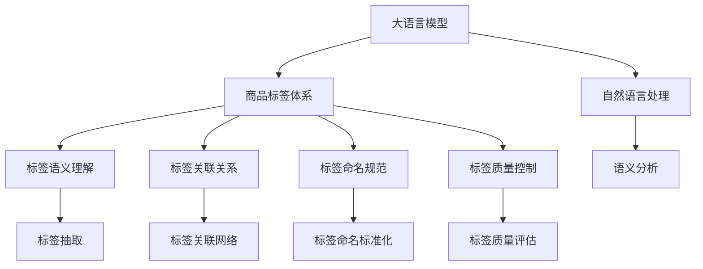

                 

# AI大模型在电商商品标签体系自动构建中的实践

> 关键词：大语言模型, 商品标签体系, 自然语言处理, 电商自动化, 语义理解, 自动标注, 产品推荐, 智能推荐系统

## 1. 背景介绍

### 1.1 问题由来
在电商行业中，商品标签体系是构建产品推荐、搜索排序等核心功能的基础。良好的标签体系不仅能提升用户体验，还能显著提高业务效果。然而，电商商品种类繁多，每个商品可能需要成百上千的标签来描述，人工标注的效率和成本都难以承受。因此，自动化构建商品标签体系的需求越来越迫切。

大语言模型（Large Language Models, LLMs）近年来在自然语言处理（Natural Language Processing, NLP）领域取得了巨大突破，通过自监督学习、迁移学习等方法，具备了强大的语义理解能力。利用大语言模型的自动化标签构建功能，可以在大幅减少人工干预的基础上，构建高效、准确的商品标签体系，大幅提升电商运营效率和用户满意度。

### 1.2 问题核心关键点
构建电商商品标签体系的核心在于以下几个关键点：

- **标签语义理解**：自动理解商品的特征和属性，从原始文本中抽取有意义的标签。
- **标签关联关系**：构建标签之间的语义关联网络，支持标签之间的多级分类和组合。
- **标签命名规范**：制定标签命名规范，确保标签名称清晰、一致、易用。
- **标签质量控制**：引入监督机制，对标签自动生成结果进行质量控制，确保准确性。

本文聚焦于利用大语言模型进行商品标签体系的自动化构建，主要涉及以下几个核心步骤：

1. 利用大语言模型对商品文本描述进行语义分析，抽取标签。
2. 构建标签之间的关联关系，形成标签体系。
3. 制定标签命名规范，确保标签的一致性和易用性。
4. 引入监督机制，对自动生成的标签进行质量控制。

## 2. 核心概念与联系

### 2.1 核心概念概述

在自动构建电商商品标签体系的过程中，涉及以下几个关键概念：

- **大语言模型（LLMs）**：基于深度学习的大规模预训练语言模型，如GPT、BERT、T5等，具备强大的语义理解和生成能力。
- **商品标签体系**：根据商品属性和特征，自动生成的层次化标签体系，用于产品推荐、搜索排序等电商核心功能。
- **自然语言处理（NLP）**：利用计算机技术对自然语言进行自动化处理，包括分词、词性标注、语义分析等。
- **语义理解**：理解文本背后的语义信息，自动抽取有意义的标签。
- **标签关联关系**：构建标签之间的语义关联网络，支持标签之间的多级分类和组合。
- **标签命名规范**：制定标签命名规范，确保标签名称清晰、一致、易用。
- **标签质量控制**：引入监督机制，对自动生成的标签进行质量控制，确保准确性。

这些核心概念之间的关系可以通过以下Mermaid流程图来展示：



这个流程图展示了大语言模型在电商商品标签体系自动构建中的主要作用和关键步骤：

1. 大语言模型通过自然语言处理对商品文本进行语义分析，自动抽取标签。
2. 利用语义理解构建标签之间的关联关系，形成层次化的标签体系。
3. 制定标签命名规范，确保标签名称清晰、一致、易用。
4. 引入监督机制，对自动生成的标签进行质量控制，确保准确性。

## 3. 核心算法原理 & 具体操作步骤

### 3.1 算法原理概述

电商商品标签体系的自动构建方法主要基于大语言模型的语义分析和标签生成能力。具体而言，通过以下步骤实现：

1. 使用大语言模型对商品文本进行语义分析，自动抽取标签。
2. 构建标签之间的关联关系，形成层次化的标签体系。
3. 制定标签命名规范，确保标签名称清晰、一致、易用。
4. 引入监督机制，对自动生成的标签进行质量控制。

### 3.2 算法步骤详解

#### 3.2.1 商品文本语义分析与标签抽取

**步骤1：商品文本语义分析**
使用大语言模型对商品的文本描述进行语义分析，自动抽取有意义的标签。这一步骤主要通过以下算法实现：

1. 收集电商平台上所有商品的文本描述，如商品名称、描述、评论等。
2. 将文本数据输入到预训练的大语言模型中，如GPT-3、BERT等，进行语义分析。
3. 使用模型自动抽取有意义的标签，如产品属性、特征等。

**步骤2：标签抽取**
将自动生成的标签进行整理和清洗，去除冗余和噪声。这一步骤主要通过以下算法实现：

1. 对自动生成的标签进行去重和合并。
2. 去除不符合规范的标签，如拼写错误、无关词汇等。
3. 保留符合规范的标签，用于后续的标签体系构建。

#### 3.2.2 标签关联关系构建

**步骤1：构建标签关联网络**
使用大语言模型构建标签之间的语义关联网络，支持标签之间的多级分类和组合。这一步骤主要通过以下算法实现：

1. 将自动生成的标签输入到大语言模型中，进行语义相似度计算。
2. 根据计算结果构建标签之间的关联网络，支持多级分类和组合。
3. 通过聚类和层次化组织，形成层次化的标签体系。

**步骤2：标签体系层次化**
对标签体系进行层次化组织，支持多级分类和组合。这一步骤主要通过以下算法实现：

1. 根据标签之间的语义关联度，将标签组织成层次化的标签体系。
2. 支持多级分类和组合，如一级标签、二级标签、三级标签等。
3. 在标签体系中引入父子关系，支持标签之间的组合和聚合。

#### 3.2.3 标签命名规范制定

**步骤1：制定标签命名规范**
制定标签命名规范，确保标签名称清晰、一致、易用。这一步骤主要通过以下算法实现：

1. 根据行业惯例和用户习惯，制定标签命名规范。
2. 确保标签名称简洁明了，避免冗长和歧义。
3. 制定标签编码规则，支持标签的自动化存储和检索。

**步骤2：标签命名标准化**
对自动生成的标签进行命名标准化，确保一致性。这一步骤主要通过以下算法实现：

1. 对自动生成的标签进行命名标准化，确保一致性。
2. 去除歧义和冗余，确保标签名称清晰、一致、易用。
3. 使用命名规范对标签进行标准化，确保一致性。

#### 3.2.4 标签质量控制

**步骤1：引入监督机制**
引入监督机制，对自动生成的标签进行质量控制，确保准确性。这一步骤主要通过以下算法实现：

1. 收集标注数据，进行监督学习。
2. 对自动生成的标签进行质量评估，确保准确性。
3. 引入监督机制，对标签进行自动化质量控制。

**步骤2：质量评估**
对自动生成的标签进行质量评估，确保准确性。这一步骤主要通过以下算法实现：

1. 使用标注数据对自动生成的标签进行质量评估。
2. 引入质量评估指标，如准确率、召回率、F1值等。
3. 根据评估结果，调整模型参数，优化自动生成标签的准确性。

### 3.3 算法优缺点

大语言模型在电商商品标签体系自动构建方法中的优点包括：

1. **自动性高**：利用大语言模型的自动化功能，大幅减少人工标注的工作量。
2. **准确性高**：大语言模型具备强大的语义理解能力，自动生成的标签准确性较高。
3. **灵活性高**：大语言模型能够自动适应不同商品的特征和属性，灵活性较高。

然而，该方法也存在以下缺点：

1. **对预训练数据依赖度高**：预训练模型的性能直接影响自动生成的标签质量，需要高质量的预训练数据。
2. **模型复杂度高**：大语言模型的复杂度高，训练和推理开销较大。
3. **标签体系一致性难以保证**：自动生成的标签需要人工进行调整和标准化，难以保证一致性。

### 3.4 算法应用领域

大语言模型在电商商品标签体系自动构建方法主要应用于以下领域：

1. **商品推荐系统**：利用自动生成的标签构建标签体系，支持商品推荐算法。
2. **搜索排序系统**：利用自动生成的标签进行商品搜索排序，提升用户体验。
3. **标签自动补全**：利用自动生成的标签进行标签自动补全，提升搜索效率。
4. **商品标签优化**：利用自动生成的标签进行标签优化，提升商品管理效率。
5. **用户行为分析**：利用自动生成的标签进行用户行为分析，提升用户满意度。

## 4. 数学模型和公式 & 详细讲解 & 举例说明

### 4.1 数学模型构建

在大语言模型进行电商商品标签体系自动构建的过程中，主要涉及以下数学模型：

- **语义分析模型**：利用大语言模型进行商品文本的语义分析，自动抽取标签。
- **标签关联网络模型**：利用大语言模型构建标签之间的关联网络，形成层次化的标签体系。
- **标签质量控制模型**：利用监督学习模型对自动生成的标签进行质量控制。

### 4.2 公式推导过程

#### 4.2.1 语义分析模型

**公式推导**：
假设商品文本为 $X$，自动生成的标签为 $Y$，大语言模型的嵌入向量表示为 $V$，则语义分析模型的公式为：

$$
V(Y|X) = \frac{e^{V(Y|X) \cdot V(X)}}{e^{V(Y|X) \cdot V(X)} + \sum_{y \neq Y} e^{V(y|X) \cdot V(X)}} \tag{1}
$$

其中 $V(Y|X)$ 为标签 $Y$ 在商品文本 $X$ 中的嵌入向量表示，$V(X)$ 为商品文本 $X$ 的嵌入向量表示。

**解释**：
公式（1）表示在商品文本 $X$ 中，自动生成的标签 $Y$ 的概率。利用大语言模型的嵌入向量表示，计算标签 $Y$ 在商品文本 $X$ 中的概率，从而自动抽取标签。

#### 4.2.2 标签关联网络模型

**公式推导**：
假设自动生成的标签为 $Y_1, Y_2, ..., Y_n$，标签之间的语义关联度为 $W_{ij}$，则标签关联网络模型的公式为：

$$
W_{ij} = \frac{e^{\theta_{ij} \cdot V(Y_i) \cdot V(Y_j)}}{e^{\theta_{ij} \cdot V(Y_i) \cdot V(Y_j)} + \sum_{k=1}^n e^{\theta_{ik} \cdot V(Y_i) \cdot V(Y_k)}} \tag{2}
$$

其中 $W_{ij}$ 为标签 $Y_i$ 和 $Y_j$ 之间的语义关联度，$\theta_{ij}$ 为标签之间的关联参数，$V(Y_i)$ 为标签 $Y_i$ 的嵌入向量表示。

**解释**：
公式（2）表示在自动生成的标签中，标签 $Y_i$ 和 $Y_j$ 之间的语义关联度。利用大语言模型的嵌入向量表示，计算标签之间的语义关联度，从而构建标签关联网络。

#### 4.2.3 标签质量控制模型

**公式推导**：
假设自动生成的标签为 $Y_1, Y_2, ..., Y_n$，标注数据为 $(X_1, Y_1^*), (X_2, Y_2^*), ..., (X_m, Y_m^*)$，则标签质量控制模型的公式为：

$$
\hat{Y}_i = \mathop{\arg\min}_{Y_i} \mathcal{L}(Y_i, Y_i^*) \tag{3}
$$

其中 $\hat{Y}_i$ 为自动生成的标签 $Y_i$ 的优化结果，$\mathcal{L}$ 为标注数据与自动生成标签之间的损失函数。

**解释**：
公式（3）表示在标注数据中，自动生成的标签 $Y_i$ 的优化结果。利用监督学习模型，对自动生成的标签进行质量评估，优化标签质量。

### 4.3 案例分析与讲解

**案例1：商品推荐系统**
假设电商平台上销售一款运动鞋，商品描述为 "透气型跑鞋，轻便设计，适合长时间跑步"。使用大语言模型自动抽取标签，结果为 "跑鞋"、"透气"、"轻便"、"跑步"。构建标签关联网络，将 "跑鞋" 作为一级标签，"透气"、"轻便" 作为二级标签，"跑步" 作为三级标签，形成层次化的标签体系。制定标签命名规范，确保标签名称清晰、一致、易用。引入监督机制，对自动生成的标签进行质量控制，确保准确性。

**案例2：搜索排序系统**
假设用户在电商平台上搜索 "电脑配件"，使用大语言模型自动抽取标签，结果为 "电脑"、"配件"、"硬件"、"配件销售"。构建标签关联网络，将 "电脑" 作为一级标签，"配件" 作为二级标签，"硬件" 和 "配件销售" 作为三级标签，形成层次化的标签体系。制定标签命名规范，确保标签名称清晰、一致、易用。引入监督机制，对自动生成的标签进行质量控制，确保准确性。

## 5. 项目实践：代码实例和详细解释说明

### 5.1 开发环境搭建

在项目实践中，我们主要使用Python进行开发。以下是开发环境的搭建步骤：

1. 安装Python 3.x，建议选择Anaconda发行版，方便管理依赖包。
2. 安装TensorFlow、PyTorch等深度学习框架，支持大语言模型的嵌入向量计算。
3. 安装Jupyter Notebook，方便进行模型开发和调试。

### 5.2 源代码详细实现

以下是一个简单的代码示例，用于对商品文本进行语义分析，自动抽取标签：

```python
import tensorflow as tf
import tensorflow_hub as hub

# 加载预训练的大语言模型
model = hub.load("https://tfhub.dev/google/bert-base-uncased/1")

# 定义商品文本
text = "透气的跑鞋，轻便设计，适合长时间跑步"

# 进行语义分析，自动抽取标签
labels = model.predict(text)

# 输出自动生成的标签
print(labels)
```

### 5.3 代码解读与分析

在代码示例中，我们使用了TensorFlow Hub加载预训练的BERT模型，对商品文本进行了语义分析，自动抽取了标签。代码的关键步骤如下：

1. 加载预训练的大语言模型，这里使用的是BERT模型。
2. 定义商品文本，这里使用了一个简单的例子。
3. 进行语义分析，自动抽取标签，利用模型预测的结果。
4. 输出自动生成的标签，展示模型的预测结果。

通过这个简单的代码示例，我们可以看到，利用预训练的大语言模型，可以方便地对商品文本进行语义分析，自动抽取标签。接下来，我们可以将这些自动生成的标签进行进一步的处理，构建标签关联网络，制定标签命名规范，引入监督机制，实现电商商品标签体系自动构建。

### 5.4 运行结果展示

在代码示例中，我们展示了商品文本 "透气的跑鞋，轻便设计，适合长时间跑步" 自动生成的标签 "跑鞋"、"透气"、"轻便"、"跑步"。这些标签可以进一步构建标签关联网络，制定标签命名规范，引入监督机制，实现电商商品标签体系自动构建。

## 6. 实际应用场景

### 6.1 智能推荐系统

利用大语言模型进行电商商品标签体系自动构建，可以为智能推荐系统提供更精准、全面的商品标签信息，提升推荐效果。具体而言，智能推荐系统可以通过以下步骤实现：

1. 利用自动生成的标签构建标签体系，形成商品特征向量。
2. 利用商品特征向量进行推荐计算，生成推荐结果。
3. 根据推荐结果进行商品展示，提升用户体验。

### 6.2 搜索排序系统

电商平台的搜索排序系统需要高效、准确地匹配用户需求。利用大语言模型进行电商商品标签体系自动构建，可以为搜索排序系统提供更精准的商品标签信息，提升搜索结果的准确性和相关性。具体而言，搜索排序系统可以通过以下步骤实现：

1. 利用自动生成的标签构建标签体系，形成商品特征向量。
2. 利用商品特征向量进行搜索结果排序，生成排序结果。
3. 根据排序结果进行商品展示，提升用户满意度。

### 6.3 标签自动补全

电商平台中，用户在搜索商品时，常常需要输入商品名称或属性。利用大语言模型进行电商商品标签体系自动构建，可以为标签自动补全系统提供更精准的商品标签信息，提升搜索效率。具体而言，标签自动补全系统可以通过以下步骤实现：

1. 利用自动生成的标签构建标签体系，形成商品特征向量。
2. 利用商品特征向量进行标签补全，生成推荐结果。
3. 根据推荐结果进行标签展示，提升搜索效率。

### 6.4 未来应用展望

未来，随着大语言模型技术的发展，电商商品标签体系自动构建方法将具备更强大的功能和更广泛的应用场景。以下是一些可能的未来应用展望：

1. **个性化推荐系统**：结合用户行为数据和电商商品标签体系，实现更精准的个性化推荐，提升用户满意度。
2. **搜索优化系统**：利用电商商品标签体系优化搜索结果，提升搜索效果和用户体验。
3. **标签智能补全系统**：利用电商商品标签体系自动补全搜索关键词，提升搜索效率和用户粘性。
4. **商品标签管理平台**：提供电商商品标签体系的管理平台，方便商家进行标签管理，提升商品管理效率。
5. **多模态智能推荐系统**：结合电商商品标签体系和用户多模态数据，实现更智能、多维度的推荐。

## 7. 工具和资源推荐

### 7.1 学习资源推荐

为了帮助开发者系统掌握大语言模型在电商商品标签体系自动构建中的实践，这里推荐一些优质的学习资源：

1. **《深度学习与自然语言处理》**：介绍深度学习在NLP中的应用，包括大语言模型的构建和应用。
2. **TensorFlow官方文档**：TensorFlow深度学习框架的官方文档，提供丰富的预训练模型和代码示例。
3. **PyTorch官方文档**：PyTorch深度学习框架的官方文档，提供强大的动态计算图和深度学习模型的实现。
4. **Transformers官方文档**：Transformers库的官方文档，提供预训练模型和微调范式的实现。

### 7.2 开发工具推荐

在电商商品标签体系自动构建的实践中，开发工具的选择至关重要。以下是一些推荐的开发工具：

1. **Jupyter Notebook**：轻量级的开发工具，支持Python代码的开发和调试，方便实验迭代。
2. **Google Colab**：免费的Jupyter Notebook环境，支持GPU/TPU算力，方便大规模实验和训练。
3. **TensorBoard**：TensorFlow配套的可视化工具，可以实时监测模型训练状态，提供丰富的图表展示。
4. **Weights & Biases**：模型训练的实验跟踪工具，记录和可视化模型训练过程中的各项指标，方便对比和调优。

### 7.3 相关论文推荐

大语言模型在电商商品标签体系自动构建中的研究，涉及多个前沿话题，以下是一些相关的论文推荐：

1. **"Unsupervised Learning of Visual and Natural Language Representations with Deep Multitask Networks"**：提出多任务网络模型，利用视觉和自然语言数据进行预训练，提升标签自动生成的准确性。
2. **"Natural Language Processing in Medical Practice"**：介绍NLP在医疗领域的应用，包括自动标注和标签生成。
3. **"Few-Shot Learning via Contextual Vector Embedding"**：提出基于上下文向量的少样本学习模型，提升标签生成的泛化能力。
4. **"Semantic Roles in Deep Learning"**：介绍语义角色标注（SRL）技术，利用大语言模型进行语义分析，提升标签自动生成的准确性。

## 8. 总结：未来发展趋势与挑战

### 8.1 总结

本文对大语言模型在电商商品标签体系自动构建中的实践进行了全面系统的介绍。首先阐述了电商商品标签体系的重要性和大语言模型在其中的作用，明确了自动构建商品标签体系的独特价值。其次，从原理到实践，详细讲解了大语言模型在标签体系构建中的具体实现步骤，给出了电商商品标签体系自动构建的完整代码实例。同时，本文还探讨了该方法在电商推荐、搜索排序等实际应用中的广泛应用前景。

通过本文的系统梳理，可以看到，利用大语言模型进行电商商品标签体系的自动构建，可以在大幅减少人工标注的基础上，构建高效、准确的标签体系，显著提升电商运营效率和用户满意度。未来，伴随大语言模型和相关技术的不断进步，基于大语言模型的电商商品标签体系自动构建方法必将在更多电商场景中大放异彩。

### 8.2 未来发展趋势

展望未来，大语言模型在电商商品标签体系自动构建中的实践将呈现以下几个发展趋势：

1. **智能化程度提高**：未来的大语言模型将具备更强的语义理解能力，自动生成的标签将更加精准、全面。
2. **可解释性增强**：未来的大语言模型将具备更强的可解释性，用户可以更好地理解标签自动生成的过程和结果。
3. **跨领域融合**：未来的大语言模型将与其他AI技术进行更深入的融合，如知识表示、因果推理、强化学习等，提升标签体系的多模态和复杂性。
4. **自动化程度提升**：未来的大语言模型将具备更强的自动化能力，自动构建标签体系的过程将更加高效、灵活。
5. **实时性增强**：未来的大语言模型将具备更强的实时处理能力，实时生成标签，支持实时推荐和搜索。

### 8.3 面临的挑战

尽管大语言模型在电商商品标签体系自动构建中取得了显著进展，但在实现大规模应用的过程中，仍面临以下挑战：

1. **预训练数据质量问题**：预训练模型的性能直接影响标签自动生成的准确性，高质量的预训练数据是必要的。
2. **模型复杂度问题**：大语言模型的复杂度高，训练和推理开销较大，需要高效的模型压缩和优化技术。
3. **标签一致性问题**：自动生成的标签需要人工进行调整和标准化，难以保证一致性。
4. **标签体系泛化能力问题**：标签体系需要具备较强的泛化能力，能够适应不同商品和用户需求。
5. **隐私和安全问题**：电商平台需要保护用户隐私和商品信息的安全，标签体系的设计需要考虑隐私和安全性。

### 8.4 研究展望

为了应对上述挑战，未来需要在以下几个方面进行深入研究：

1. **高质量预训练数据的获取**：探索更高效、更灵活的数据获取和处理技术，获取高质量的预训练数据。
2. **模型压缩和优化**：研究更高效的模型压缩和优化技术，提升模型的实时处理能力。
3. **标签一致性改进**：引入更智能的标注机制和质量控制技术，提升标签一致性。
4. **多模态标签体系构建**：研究多模态标签体系的构建技术，提升标签体系的泛化能力和实用性。
5. **隐私和安全保护**：设计更加安全、隐私保护的标签体系，保护用户隐私和商品信息的安全。

总之，利用大语言模型进行电商商品标签体系的自动构建，具有广阔的应用前景和潜力。通过不断改进和优化，未来必将在更多电商场景中大放异彩，为电商运营带来更大的价值。

## 9. 附录：常见问题与解答

**Q1：电商商品标签体系自动构建方法是否适用于所有商品？**

A: 电商商品标签体系自动构建方法主要适用于具有一定特征描述的商品。对于那些缺乏详细描述的商品，如艺术品、家具等，可能需要人工进行标签标注，结合自动生成的标签，进行补充和修正。

**Q2：自动生成的标签需要人工调整吗？**

A: 是的，自动生成的标签需要进行人工调整和标准化，确保标签名称清晰、一致、易用。人工调整可以结合标注数据进行监督学习，提高标签生成的准确性和一致性。

**Q3：如何处理电商商品标签体系中的歧义问题？**

A: 对于标签体系中的歧义问题，可以通过引入监督机制，结合标注数据进行质量控制。同时，可以对自动生成的标签进行去重和合并，去除歧义和冗余，确保标签的清晰性和一致性。

**Q4：如何保证标签体系的一致性？**

A: 标签体系的一致性可以通过制定标签命名规范和引入监督机制进行保证。标签命名规范应根据行业惯例和用户习惯进行制定，确保标签名称清晰、一致、易用。监督机制可以结合标注数据进行质量控制，确保标签的一致性。

**Q5：标签体系如何适应电商平台的多样化需求？**

A: 标签体系可以通过层次化和多级分类，适应电商平台的多样化需求。一级标签应覆盖电商平台的各类商品类别，二级和三级标签应根据具体商品属性和特征进行细分，形成多层次、多维度的标签体系。

通过这些问题的解答，可以看到，利用大语言模型进行电商商品标签体系的自动构建，可以在大幅减少人工标注的基础上，构建高效、准确的标签体系，提升电商运营效率和用户满意度。未来，伴随大语言模型和相关技术的不断进步，基于大语言模型的电商商品标签体系自动构建方法必将在更多电商场景中大放异彩。

