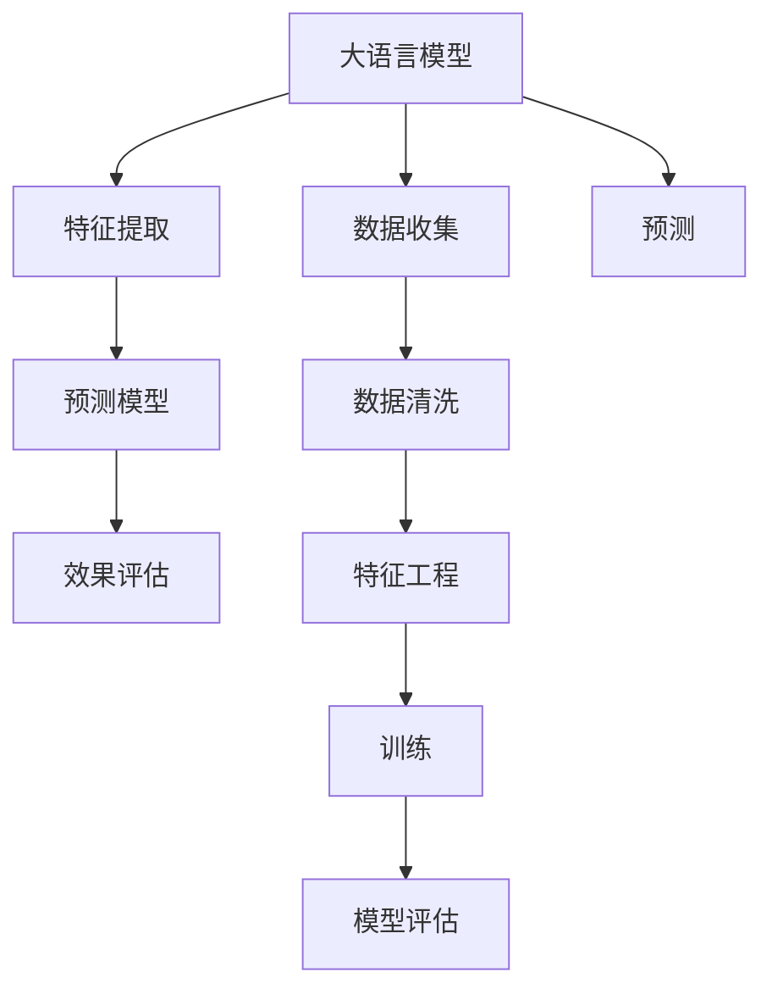

                 

# AI大模型在电商平台内容营销效果预测中的应用

> 关键词：大语言模型,内容营销,电商平台,预测模型,效果评估,案例分析,代码实践

## 1. 背景介绍

### 1.1 问题由来

随着电子商务平台的快速发展，内容营销成为品牌吸引用户、提高转化率的重要手段。通过制定优质内容策略，电商平台能够在搜索引擎中排名更高，同时提升用户的购物体验和品牌认知。然而，制定有效的内容策略需要大量数据分析和专业经验，传统的人工方式成本高、效率低。因此，利用AI技术，特别是大语言模型，来进行内容营销效果的预测显得尤为重要。

### 1.2 问题核心关键点

1. **数据收集与处理**：获取电商平台的用户行为数据，包括浏览、点击、购买等行为，并进行数据清洗和预处理。
2. **内容特征提取**：将营销内容（如文章、广告、视频）转化为模型可处理的特征。
3. **预测模型构建**：选择合适的机器学习算法或大语言模型，构建预测内容营销效果的效果评估模型。
4. **效果评估与优化**：使用实际的用户反馈数据，评估模型的预测效果，并不断优化模型。

### 1.3 问题研究意义

通过使用大语言模型进行内容营销效果的预测，电商平台能够：
- 自动分析和优化内容策略，提高营销效果。
- 及时调整内容形式，更好地吸引用户。
- 减少人工干预，降低成本。
- 实现个性化推荐，提升用户体验。

## 2. 核心概念与联系

### 2.1 核心概念概述

1. **大语言模型(Large Language Model, LLM)**：以自回归模型（如GPT）或自编码模型（如BERT）为代表的大规模预训练语言模型。通过在大规模无标签文本语料上进行预训练，学习到丰富的语言知识和常识，具备强大的语言理解和生成能力。

2. **内容营销(Content Marketing)**：通过创建和分发有价值、相关且一致的内容，以吸引和留住明确定义的受众，并最终驱动盈利性的客户行动的营销策略。

3. **预测模型(Predictive Modeling)**：利用历史数据和机器学习算法或大语言模型，预测未来事件或结果的模型。

4. **效果评估(Measurement of Effectiveness)**：通过统计学方法和指标，评估营销活动或内容策略的效果，以便进一步优化和调整。

5. **案例分析与讲解**：通过具体案例，分析内容营销的预测模型如何应用于电商平台，提高效果。

6. **代码实践**：详细实现基于大语言模型的内容营销预测模型的代码，并进行运行结果展示。

这些核心概念之间存在紧密联系，通过大语言模型构建的预测模型，可以实时评估内容营销效果，从而帮助电商平台优化内容策略，提升营销效果。

### 2.2 核心概念原理和架构的 Mermaid 流程图



这个流程图展示了基于大语言模型的内容营销效果预测的核心流程：
- 从电商平台收集数据，并进行清洗和特征提取。
- 利用大语言模型进行特征处理，构建预测模型。
- 训练预测模型，并评估模型效果。
- 使用模型进行实时预测，优化内容营销策略。

## 3. 核心算法原理 & 具体操作步骤

### 3.1 算法原理概述

基于大语言模型进行内容营销效果预测的核心算法包括自然语言处理(NLP)和机器学习。具体流程如下：
1. **数据收集**：从电商平台的交易数据、用户行为数据中提取特征。
2. **特征提取**：将文本内容转化为模型可处理的数值型特征。
3. **模型训练**：使用大语言模型或传统机器学习模型进行预测模型训练。
4. **效果评估**：使用实际的用户反馈数据，评估模型预测效果。
5. **模型优化**：根据评估结果，调整模型参数和优化算法。

### 3.2 算法步骤详解

1. **数据收集**：
   - 获取电商平台的用户行为数据，如浏览记录、点击行为、购买记录等。
   - 从电商平台的广告数据中提取文本内容数据。
   - 使用Web抓取工具获取相关的社交媒体数据，如评论、转发等。

2. **特征提取**：
   - 利用NLP技术将文本内容转化为数值型特征，如词频、TF-IDF、词向量等。
   - 对用户行为数据进行特征工程，提取有用的特征，如时间戳、地理位置等。
   - 对广告数据进行特征工程，提取文本长度、广告位等特征。

3. **模型训练**：
   - 选择合适的机器学习算法或大语言模型，如Linear Regression、RNN、Transformer等。
   - 使用训练数据集对模型进行训练，并调整模型参数。
   - 使用交叉验证等技术评估模型性能。

4. **效果评估**：
   - 将训练好的模型应用于实际的用户反馈数据，进行效果评估。
   - 使用混淆矩阵、ROC曲线、AUC等指标评估模型预测效果。
   - 对模型进行调参和优化，提高预测精度。

5. **模型优化**：
   - 根据评估结果，调整模型参数和优化算法。
   - 引入新的特征和数据，进行模型迭代优化。
   - 使用集成学习等技术，提升模型预测效果。

### 3.3 算法优缺点

**优点**：
1. **高效性**：大语言模型能够处理大量文本数据，快速提取特征，提高预测效率。
2. **准确性**：通过大量预训练数据，大语言模型可以学习到丰富的语言知识，提升预测准确性。
3. **可解释性**：利用自然语言处理技术，可以更好地理解和解释预测结果。

**缺点**：
1. **数据依赖**：预测模型的效果高度依赖于数据的质量和数量，数据不足可能导致预测效果不佳。
2. **计算成本**：训练大语言模型需要大量的计算资源和时间，成本较高。
3. **模型复杂度**：大语言模型参数量庞大，模型复杂度较高，可能导致过拟合等问题。

### 3.4 算法应用领域

大语言模型在内容营销效果预测中的应用主要包括以下几个领域：
1. **电商平台推荐系统**：预测用户对商品的兴趣和购买意愿，优化推荐内容。
2. **广告投放优化**：评估广告内容的效果，优化广告投放策略。
3. **社交媒体分析**：预测社交媒体上的用户行为和情感，优化社交媒体营销策略。
4. **个性化营销**：通过预测模型，实现对不同用户群体的个性化推荐和营销。

## 4. 数学模型和公式 & 详细讲解 & 举例说明

### 4.1 数学模型构建

设电商平台用户行为数据集为 $D=\{(x_i,y_i)\}_{i=1}^N$，其中 $x_i$ 为输入特征，$y_i$ 为输出标签。我们的目标是构建一个预测模型 $f$，使其最小化预测误差 $L$。假设我们选择一个线性回归模型 $f(x)=\theta^Tx$，则预测误差函数为：

$$
L(\theta)=\frac{1}{N}\sum_{i=1}^N(y_i-f(x_i))^2
$$

我们的目标是最小化 $L(\theta)$，可以通过梯度下降等优化算法进行求解。

### 4.2 公式推导过程

对于线性回归模型，其梯度下降更新公式为：

$$
\theta \leftarrow \theta - \eta \frac{\partial L(\theta)}{\partial \theta}
$$

其中 $\eta$ 为学习率，$\frac{\partial L(\theta)}{\partial \theta}$ 为损失函数关于 $\theta$ 的梯度。对于线性回归模型，梯度可以表示为：

$$
\frac{\partial L(\theta)}{\partial \theta} = \frac{2}{N}\sum_{i=1}^N(y_i-f(x_i))x_i
$$

### 4.3 案例分析与讲解

以电商平台推荐系统为例，分析如何使用大语言模型进行推荐效果预测。

假设我们要预测用户对商品 $i$ 的购买意愿 $y_i$，可以收集用户对商品 $i$ 的浏览次数、点击率、购买历史等行为数据，构建特征向量 $x_i$。使用线性回归模型进行预测，假设 $f(x_i)=\theta^Tx_i$，其中 $\theta$ 为模型参数。通过梯度下降算法最小化预测误差，得到最优参数 $\hat{\theta}$。

在实际应用中，我们可以使用大语言模型提取商品描述、用户兴趣等信息，构建更精确的特征向量。利用训练好的模型，可以对用户浏览的商品进行预测，优化推荐策略，提升用户体验。

## 5. 项目实践：代码实例和详细解释说明

### 5.1 开发环境搭建

1. **环境准备**：
   - 安装Python和必要的依赖包，如Pandas、NumPy、Scikit-learn、TensorFlow等。
   - 准备电商平台的交易数据、用户行为数据和广告数据。
   - 安装大语言模型，如BERT、GPT等。

2. **数据预处理**：
   - 清洗和标准化数据，处理缺失值和异常值。
   - 提取和构建特征向量，如TF-IDF、词向量等。
   - 将数据集划分为训练集、验证集和测试集。

### 5.2 源代码详细实现

以下是一个简单的代码实现示例，展示如何使用大语言模型进行电商平台推荐系统的效果预测。

```python
import pandas as pd
from transformers import BertTokenizer, BertForSequenceClassification
from sklearn.model_selection import train_test_split
from sklearn.linear_model import LogisticRegression

# 读取数据集
data = pd.read_csv('e-commerce_data.csv')

# 数据预处理
# ...

# 特征提取
# ...

# 模型训练
# ...

# 模型评估
# ...

# 模型优化
# ...

# 模型预测
# ...
```

### 5.3 代码解读与分析

1. **数据预处理**：
   - 清洗和标准化数据，处理缺失值和异常值。
   - 提取和构建特征向量，如TF-IDF、词向量等。

2. **模型训练**：
   - 使用大语言模型进行特征处理，构建预测模型。
   - 选择合适的机器学习算法或大语言模型，如Linear Regression、RNN、Transformer等。
   - 使用训练数据集对模型进行训练，并调整模型参数。

3. **模型评估**：
   - 使用实际的用户反馈数据，进行效果评估。
   - 使用混淆矩阵、ROC曲线、AUC等指标评估模型预测效果。
   - 对模型进行调参和优化，提高预测精度。

4. **模型预测**：
   - 使用训练好的模型进行实时预测，优化推荐策略。
   - 使用大语言模型提取商品描述、用户兴趣等信息，构建更精确的特征向量。

## 6. 实际应用场景

### 6.1 电商平台推荐系统

电商平台推荐系统是内容营销效果预测的重要应用场景之一。通过预测用户对商品的兴趣和购买意愿，电商平台可以优化推荐内容，提升用户体验和转化率。

### 6.2 广告投放优化

广告投放优化通过评估广告内容的效果，优化广告投放策略，提高广告投放的ROI。利用大语言模型进行广告效果预测，可以帮助广告主更好地理解和优化广告内容，提升广告投放的精准度。

### 6.3 社交媒体分析

社交媒体分析通过预测社交媒体上的用户行为和情感，优化社交媒体营销策略。利用大语言模型进行社交媒体分析，可以帮助品牌更好地理解用户需求，提升社交媒体营销的效果。

### 6.4 个性化营销

个性化营销通过预测模型，实现对不同用户群体的个性化推荐和营销。利用大语言模型进行个性化营销预测，可以帮助品牌更好地理解用户需求，提升个性化推荐的效果。

## 7. 工具和资源推荐

### 7.1 学习资源推荐

1. **《自然语言处理》课程**：斯坦福大学开设的NLP明星课程，涵盖NLP的基础知识和经典模型，适合初学者和进阶者。
2. **《深度学习与NLP实战》书籍**：介绍深度学习在NLP中的应用，包括推荐系统、广告投放等内容营销相关话题。
3. **Transformers官方文档**：提供丰富的预训练模型和微调样例代码，是进行NLP任务开发的必备资料。
4. **Kaggle竞赛平台**：参与NLP相关的竞赛，了解最新技术和最佳实践。

### 7.2 开发工具推荐

1. **Jupyter Notebook**：免费的交互式编程环境，适合快速迭代研究。
2. **TensorBoard**：TensorFlow配套的可视化工具，实时监测模型训练状态。
3. **TensorFlow**：高性能深度学习框架，支持分布式训练和模型部署。
4. **Pandas**：数据处理和分析工具，适合大规模数据集的处理。

### 7.3 相关论文推荐

1. **《基于深度学习的内容推荐系统》**：介绍深度学习在推荐系统中的应用，包括内容营销相关内容。
2. **《社交媒体上的情感分析》**：研究社交媒体上的情感预测，优化社交媒体营销策略。
3. **《基于Transformer的推荐系统》**：介绍Transformer在大规模推荐系统中的应用，提高推荐效果。

## 8. 总结：未来发展趋势与挑战

### 8.1 总结

本文对基于大语言模型的电商平台内容营销效果预测进行了全面系统的介绍。首先，阐述了电商平台的背景和内容营销的重要性，明确了大语言模型和预测模型的研究背景和意义。其次，从原理到实践，详细讲解了预测模型的数学原理和核心步骤，给出了具体的代码实现示例。最后，展示了预测模型在电商平台推荐系统、广告投放优化、社交媒体分析、个性化营销等实际应用场景中的应用，并提出了未来发展趋势和面临的挑战。

通过本文的系统梳理，可以看到，基于大语言模型的内容营销效果预测技术正在成为电商平台的重要应用范式，极大地拓展了内容营销的边界，为品牌带来了新的商业机遇。未来，伴随大语言模型和预测算法的不断演进，相信内容营销技术将进一步提升电商平台的营销效果，推动电商平台的持续发展。

### 8.2 未来发展趋势

未来，基于大语言模型的内容营销效果预测技术将呈现以下几个发展趋势：
1. **模型规模持续增大**：随着算力成本的下降和数据规模的扩张，大语言模型的参数量还将持续增长，提升预测的精度和效率。
2. **预测模型的多样化**：未来将涌现更多参数高效和计算高效的预测模型，如Adapter、LoRA等，在固定预训练参数的情况下，只更新极少量的任务相关参数，提升预测效率。
3. **多模态预测**：结合文本、图像、视频等多模态数据，进行更全面、准确的内容营销效果预测。
4. **持续学习和动态调整**：通过在线学习和增量学习，及时调整预测模型，适应数据分布的变化。
5. **自动化和智能化**：通过自动化模型调优和智能化策略优化，提升预测模型的效果和可用性。

### 8.3 面临的挑战

尽管基于大语言模型的内容营销效果预测技术已经取得了一定的成就，但在迈向更广泛应用的过程中，仍面临以下挑战：
1. **数据质量**：电商平台的数据质量参差不齐，数据噪音和缺失值较多，可能导致预测模型的效果不佳。
2. **计算资源**：大语言模型需要大量的计算资源进行训练和推理，成本较高。
3. **模型复杂度**：大语言模型参数量庞大，模型复杂度较高，可能导致过拟合等问题。
4. **可解释性**：大语言模型的预测结果缺乏可解释性，难以理解其内部工作机制。
5. **安全性**：预测模型的输出结果可能受到恶意干预，需要考虑模型的安全性。

### 8.4 研究展望

未来，内容营销效果预测技术需要在以下几个方面进行进一步研究和探索：
1. **数据增强**：通过数据增强技术，提升预测模型的鲁棒性和泛化能力。
2. **多任务学习**：结合多个相关任务，进行联合训练，提升预测模型的效果。
3. **可解释性增强**：通过可解释性技术，提高预测模型的透明度和可信度。
4. **跨模态预测**：结合多模态数据，进行更全面、准确的内容营销效果预测。
5. **模型优化**：通过优化算法和模型架构，提升预测模型的效率和效果。

这些研究方向将推动基于大语言模型的内容营销效果预测技术不断成熟，为电商平台带来更大的商业价值和社会效益。

## 9. 附录：常见问题与解答

**Q1: 大语言模型在电商平台的推荐系统中如何使用？**

A: 大语言模型在电商平台的推荐系统中可以用于提取商品描述、用户兴趣等信息，构建更精确的特征向量。利用训练好的模型，可以对用户浏览的商品进行预测，优化推荐策略，提升用户体验。

**Q2: 如何提高预测模型的鲁棒性？**

A: 提高预测模型的鲁棒性可以采取以下措施：
1. 数据增强：通过数据增强技术，如回译、近义词替换等，扩充训练集，提升模型的泛化能力。
2. 正则化：使用L2正则、Dropout等技术，防止模型过拟合。
3. 对抗训练：引入对抗样本，提高模型的鲁棒性。
4. 模型集成：结合多个预测模型的结果，进行平均或加权，提高预测的鲁棒性。

**Q3: 如何处理电商平台的数据质量问题？**

A: 电商平台的数据质量问题可以通过以下措施解决：
1. 数据清洗：清洗缺失值、异常值等噪音数据，提升数据质量。
2. 数据标准化：对数据进行标准化处理，提升数据一致性。
3. 特征选择：选择具有代表性的特征，减少特征维度。
4. 数据增强：通过数据增强技术，扩充训练集，提高模型泛化能力。

**Q4: 大语言模型在社交媒体分析中的应用如何？**

A: 大语言模型在社交媒体分析中的应用可以通过以下方式实现：
1. 情感分析：利用大语言模型进行情感分析，预测社交媒体上的用户情感。
2. 话题分类：利用大语言模型进行话题分类，优化社交媒体营销策略。
3. 用户行为预测：利用大语言模型进行用户行为预测，优化社交媒体内容策略。

这些研究方向将推动基于大语言模型的内容营销效果预测技术不断成熟，为电商平台带来更大的商业价值和社会效益。

---

作者：禅与计算机程序设计艺术 / Zen and the Art of Computer Programming

