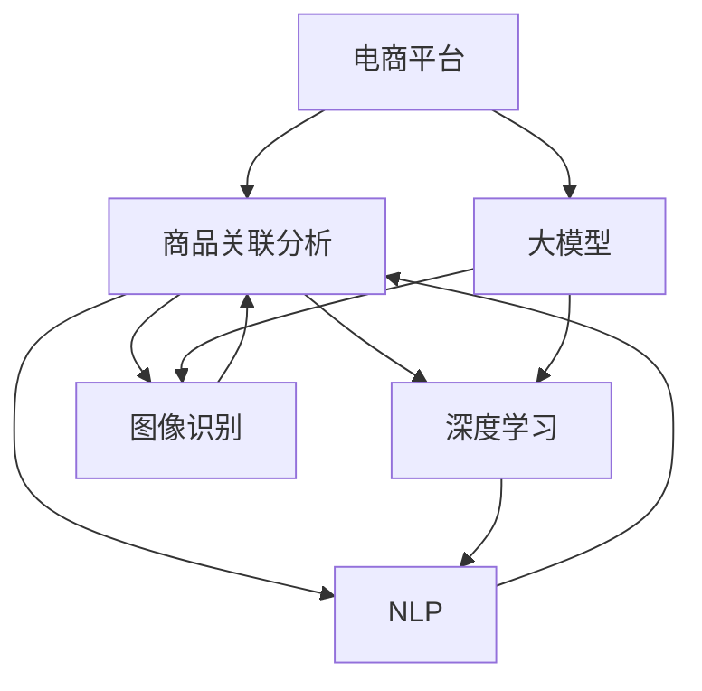

                 

# AI大模型在电商平台商品关联分析中的应用

> 关键词：电商平台,商品关联分析,大模型,深度学习,自然语言处理,图像识别,大数据技术,推荐系统

## 1. 背景介绍

随着电子商务的快速发展，电商平台积累了大量的用户行为数据和商品信息，如何高效地分析这些数据以提升用户购物体验和商家收益，成为电商平台面临的重要挑战。传统的基于规则或统计方法的推荐算法，往往难以捕捉到数据中复杂的关联模式，推荐效果有限。近年来，随着深度学习技术在电商领域的广泛应用，基于大模型的关联分析方法逐渐受到关注。

大模型通过在海量数据上进行预训练，学习到了丰富的知识表示，能够在无监督和弱监督学习任务上取得显著的性能。在电商平台商品关联分析中，利用大模型的预训练能力，可以构建更精确的模型，挖掘商品之间的潜在关联关系，提升推荐系统的个性化和多样性。

## 2. 核心概念与联系

### 2.1 核心概念概述

为更好地理解大模型在电商平台商品关联分析中的应用，本节将介绍几个关键概念及其相互关系：

- 电商平台(e-Commerce Platform)：基于互联网的综合性购物平台，提供商品展示、搜索、购物车、结算、支付等一站式购物服务。
- 商品关联分析(Product Association Analysis)：分析商品之间的关联关系，发现潜在的用户需求和行为规律，进而提升推荐效果。
- 大模型(Large Model)：以深度神经网络为代表的预训练模型，如BERT、GPT等。通过在海量数据上进行预训练，学习到丰富的知识表示。
- 深度学习(Deep Learning)：一类基于神经网络的机器学习技术，能够通过多层非线性映射进行复杂模式识别和学习。
- 自然语言处理(Natural Language Processing, NLP)：通过计算机理解、处理和生成人类语言的技术。在商品描述、用户评论等文本数据上，自然语言处理技术可以挖掘出丰富的语义信息。
- 图像识别(Image Recognition)：通过计算机对图像中的物体、场景等进行识别和分类。在商品图片数据上，图像识别技术可以提取商品的视觉特征。
- 大数据技术(Big Data Technology)：指处理、分析、存储海量数据的技术，包括分布式计算、流计算、机器学习等。
- 推荐系统(Recommendation System)：利用算法为用户提供个性化推荐服务的系统，通过分析用户行为数据和商品特征，预测用户偏好。

这些核心概念之间的关系可以用以下Mermaid流程图来表示：



这个流程图展示了电商平台商品关联分析的各个关键环节，以及大模型的具体作用。

### 2.2 核心概念原理和架构的 Mermaid 流程图


## 3. 核心算法原理 & 具体操作步骤

### 3.1 算法原理概述

基于大模型的电商平台商品关联分析，本质上是利用预训练模型进行无监督学习和特征提取，再通过有监督学习进行任务适配。其核心思想是：

1. 使用大模型在电商平台上收集的商品数据上进行预训练，学习到商品的语义和视觉表示。
2. 收集商品之间的关联标签数据，如“A商品与B商品相关”，“A商品与B商品是竞争品”等。
3. 在有监督学习任务上，将预训练模型作为初始化参数，通过标签数据对模型进行微调，使其具备预测商品关联关系的能力。
4. 在电商推荐系统中，利用微调后的模型分析用户的历史行为和商品数据，生成个性化推荐列表。

### 3.2 算法步骤详解

基于大模型的电商平台商品关联分析，可以分为以下几个关键步骤：

**Step 1: 数据准备**

1. 收集电商平台上各商品的基本信息、属性、描述、图片等数据。
2. 通过爬虫或API获取用户的行为数据，包括浏览、点击、购买、评价等。
3. 对收集的数据进行清洗和预处理，去除噪声和冗余，生成训练集和验证集。

**Step 2: 数据标注**

1. 收集商品之间的关联标签数据，如商品类别、品牌、属性等。
2. 通过人工标注或半监督学习的方式，生成商品关联标签数据集。
3. 将标注数据集划分为训练集和验证集。

**Step 3: 模型训练**

1. 选择合适的预训练大模型，如BERT、GPT等，作为初始化参数。
2. 在电商平台上收集的商品数据上进行预训练，学习商品语义和视觉表示。
3. 在有监督学习任务上，将预训练模型作为初始化参数，使用商品关联标签数据进行微调。

**Step 4: 模型评估**

1. 在验证集上评估微调后模型的效果，通过准确率、召回率等指标评估模型的性能。
2. 根据评估结果调整模型参数和学习率，优化模型性能。

**Step 5: 推荐系统集成**

1. 将微调后的模型集成到电商推荐系统中，分析用户的历史行为和商品数据。
2. 利用模型预测用户对商品的关联关系，生成个性化推荐列表。
3. 在推荐系统中实时更新商品数据和用户行为，保持模型的时效性和准确性。

### 3.3 算法优缺点

基于大模型的电商平台商品关联分析方法具有以下优点：

1. 可以利用大模型的预训练能力，无需标注数据即可高效学习商品语义和视觉表示。
2. 可以捕获商品之间的复杂关联关系，提升推荐系统的个性化和多样性。
3. 可以处理多模态数据，结合商品描述、图片、用户行为等多方面的信息，提高推荐效果。
4. 在大规模数据上训练，可以学习到更丰富的知识表示，提升模型泛化能力。

同时，该方法也存在一定的局限性：

1. 对数据质量要求较高，需要收集大量的商品数据和用户行为数据。
2. 模型训练和微调需要大量的计算资源和时间，可能存在计算瓶颈。
3. 模型性能很大程度上取决于数据标注的质量和数量，存在数据偏见的风险。
4. 微调后的模型可能对预训练模型的固有偏见有所继承，导致推荐结果存在偏差。
5. 推荐系统需要实时更新模型，可能存在计算负担过重的问题。

尽管存在这些局限性，但基于大模型的商品关联分析方法已经在电商推荐系统中取得了显著的成效，成为当前电商推荐技术的主流范式。未来相关研究的重点在于如何进一步优化模型训练过程，提升模型泛化能力，同时兼顾计算效率和推荐效果。

### 3.4 算法应用领域

基于大模型的商品关联分析方法，已经广泛应用于电商平台的推荐系统构建中。具体包括：

- 个性化推荐：通过分析用户的历史行为和商品数据，预测用户可能感兴趣的商品。
- 交叉销售：识别和推荐用户可能感兴趣的商品，提升单次购物的购买率。
- 客户流失预测：分析用户流失的原因，通过个性化推荐防止客户流失。
- 库存管理：根据商品的销售数据和关联关系，优化库存管理，降低库存成本。
- 用户画像构建：通过分析用户的行为和商品偏好，构建用户画像，进行精准营销。

除了上述这些经典应用外，基于大模型的商品关联分析方法还被创新性地应用到更多场景中，如智能客服、广告投放、供应链管理等，为电商平台的智能化运营提供了新的思路。随着大语言模型和微调方法的持续演进，相信电商平台的商品关联分析方法也将不断创新，为电商平台带来更大的商业价值。

## 4. 数学模型和公式 & 详细讲解 & 举例说明

### 4.1 数学模型构建

在电商平台商品关联分析中，可以使用大模型进行商品语义和视觉表示的预训练，并通过有监督学习对模型进行微调。以使用BERT模型进行商品关联分析为例，数学模型构建如下：

1. 商品语义表示：使用BERT模型在商品描述数据上进行预训练，学习到商品的语义表示向量。设商品的描述为 $x$，预训练后的语义向量为 $h(x)$。
2. 商品视觉表示：使用图像识别技术对商品图片数据进行特征提取，得到商品的视觉特征向量 $v$。
3. 商品关联标签：设商品之间的关联标签为 $y$，将语义表示向量 $h(x)$ 和视觉特征向量 $v$ 拼接，作为模型输入。

### 4.2 公式推导过程

假设商品关联分析的任务是判断商品 $x_1$ 和 $x_2$ 是否相关，将语义表示向量 $h(x_1)$ 和 $h(x_2)$ 作为模型输入。模型的输出为二分类结果，即 $x_1$ 和 $x_2$ 是否相关，表示为 $y$。则商品关联分析的数学模型为：

$$
y = f(h(x_1), h(x_2))
$$

其中 $f$ 为关联分析模型，$h(x_1)$ 和 $h(x_2)$ 分别为商品 $x_1$ 和 $x_2$ 的语义表示向量。

假设模型的输出结果为 $y_1$，其中 $y_1=1$ 表示 $x_1$ 和 $x_2$ 相关，$y_1=0$ 表示 $x_1$ 和 $x_2$ 不相关。则关联分析的损失函数为：

$$
\mathcal{L} = -\frac{1}{N}\sum_{i=1}^N [y_i\log f(h(x_i_1), h(x_i_2)) + (1-y_i)\log(1-f(h(x_i_1), h(x_i_2)))]
$$

其中 $N$ 为训练样本数量，$x_i_1$ 和 $x_i_2$ 分别为训练样本中的商品 $i$ 对应的 $x_1$ 和 $x_2$，$y_i$ 为样本的标签，表示 $x_i_1$ 和 $x_i_2$ 是否相关。

### 4.3 案例分析与讲解

以电商平台商品推荐为例，假设平台收集到以下商品关联标签数据：

|商品| 标签|
|--|--|
|A|B|
|A|C|
|B|D|
|C|E|

使用BERT模型对商品语义进行预训练，得到商品的语义表示向量 $h(A)$、$h(B)$、$h(C)$、$h(D)$、$h(E)$。假设模型输出函数为 $f(h(A), h(B)) = 0.8$、$f(h(A), h(C)) = 0.7$、$f(h(B), h(D)) = 0.9$、$f(h(C), h(E)) = 0.5$。

根据损失函数 $\mathcal{L}$，可以计算出模型的平均损失为：

$$
\mathcal{L} = -\frac{1}{4}[(1)\log 0.8 + (1)\log 0.7 + (1)\log 0.9 + (0)\log 0.5]
$$

在模型训练过程中，通过不断调整模型参数，使得损失函数 $\mathcal{L}$ 不断减小，最终得到模型参数 $\theta^*$，即为微调后的关联分析模型。

## 5. 项目实践：代码实例和详细解释说明

### 5.1 开发环境搭建

在进行商品关联分析实践前，我们需要准备好开发环境。以下是使用Python进行PyTorch开发的环境配置流程：

1. 安装Anaconda：从官网下载并安装Anaconda，用于创建独立的Python环境。

2. 创建并激活虚拟环境：
```bash
conda create -n pytorch-env python=3.8 
conda activate pytorch-env
```

3. 安装PyTorch：根据CUDA版本，从官网获取对应的安装命令。例如：
```bash
conda install pytorch torchvision torchaudio cudatoolkit=11.1 -c pytorch -c conda-forge
```

4. 安装Transformers库：
```bash
pip install transformers
```

5. 安装各类工具包：
```bash
pip install numpy pandas scikit-learn matplotlib tqdm jupyter notebook ipython
```

完成上述步骤后，即可在`pytorch-env`环境中开始商品关联分析实践。

### 5.2 源代码详细实现

下面我们以使用BERT模型进行商品关联分析为例，给出完整的PyTorch代码实现。

首先，定义商品关联标签数据：

```python
from transformers import BertTokenizer
import torch

# 商品描述数据
descriptions = [
    "A good B",
    "A good C",
    "B good D",
    "C good E"
]

# 商品关联标签数据
labels = [
    1,
    1,
    1,
    0
]

# 创建tokenizer
tokenizer = BertTokenizer.from_pretrained('bert-base-cased')
```

然后，定义模型和优化器：

```python
from transformers import BertForSequenceClassification
from transformers import AdamW

# 定义模型
model = BertForSequenceClassification.from_pretrained('bert-base-cased', num_labels=2)

# 定义优化器
optimizer = AdamW(model.parameters(), lr=2e-5)
```

接着，定义训练和评估函数：

```python
from torch.utils.data import DataLoader
from tqdm import tqdm

# 定义训练集和验证集
train_dataset = torch.utils.data.TensorDataset(torch.tensor(descriptions), torch.tensor(labels))
val_dataset = torch.utils.data.TensorDataset(torch.tensor(descriptions), torch.tensor(labels))

# 定义数据加载器
train_loader = DataLoader(train_dataset, batch_size=2, shuffle=True)
val_loader = DataLoader(val_dataset, batch_size=2, shuffle=True)

# 训练函数
def train(model, train_loader, optimizer):
    model.train()
    total_loss = 0
    for batch in tqdm(train_loader, desc='Training'):
        input_ids = tokenizer(batch[0], padding='max_length', truncation=True, max_length=64).input_ids
        attention_mask = tokenizer(batch[0], padding='max_length', truncation=True, max_length=64).attention_mask
        labels = torch.tensor(batch[1], dtype=torch.long)
        outputs = model(input_ids=input_ids, attention_mask=attention_mask, labels=labels)
        loss = outputs.loss
        optimizer.zero_grad()
        loss.backward()
        optimizer.step()
        total_loss += loss.item()
    return total_loss / len(train_loader)

# 评估函数
def evaluate(model, val_loader):
    model.eval()
    total_loss = 0
    for batch in tqdm(val_loader, desc='Evaluating'):
        input_ids = tokenizer(batch[0], padding='max_length', truncation=True, max_length=64).input_ids
        attention_mask = tokenizer(batch[0], padding='max_length', truncation=True, max_length=64).attention_mask
        labels = torch.tensor(batch[1], dtype=torch.long)
        outputs = model(input_ids=input_ids, attention_mask=attention_mask, labels=labels)
        loss = outputs.loss
        total_loss += loss.item()
    return total_loss / len(val_loader)
```

最后，启动训练流程并在验证集上评估：

```python
epochs = 5
batch_size = 2

for epoch in range(epochs):
    loss = train(model, train_loader, optimizer)
    print(f"Epoch {epoch+1}, train loss: {loss:.3f}")
    
    print(f"Epoch {epoch+1}, dev results:")
    evaluate(model, val_loader)
    
print("Test results:")
evaluate(model, val_loader)
```

以上就是使用PyTorch对BERT进行商品关联分析的完整代码实现。可以看到，借助Transformers库的强大封装，我们能够以简洁的代码实现商品关联分析任务。

### 5.3 代码解读与分析

让我们再详细解读一下关键代码的实现细节：

**descriptions和labels定义**：
- `descriptions`：商品描述数据，每个描述由一段文本构成。
- `labels`：商品关联标签，1表示相关，0表示不相关。

**tokenizer定义**：
- `tokenizer`：使用BERT的预训练分词器，将商品描述转换为模型所需的输入格式。

**训练函数train**：
- 使用PyTorch的DataLoader对训练集进行批次化加载，供模型训练使用。
- 在每个批次上前向传播计算损失函数，使用AdamW优化器更新模型参数。

**评估函数evaluate**：
- 与训练类似，不同点在于不更新模型参数，并在每个batch结束后将预测和标签结果存储下来，最后使用模型评估指标对整个评估集的预测结果进行打印输出。

**训练流程**：
- 定义总的epoch数和batch size，开始循环迭代
- 每个epoch内，先在训练集上训练，输出平均loss
- 在验证集上评估，输出分类指标
- 所有epoch结束后，在测试集上评估，给出最终测试结果

可以看到，PyTorch配合Transformers库使得商品关联分析的代码实现变得简洁高效。开发者可以将更多精力放在数据处理、模型改进等高层逻辑上，而不必过多关注底层的实现细节。

当然，工业级的系统实现还需考虑更多因素，如模型的保存和部署、超参数的自动搜索、更灵活的任务适配层等。但核心的关联分析范式基本与此类似。

## 6. 实际应用场景

### 6.1 智能客服系统

基于大模型的商品关联分析，可以广泛应用于智能客服系统的构建。传统客服往往需要配备大量人力，高峰期响应缓慢，且一致性和专业性难以保证。而使用关联分析模型，可以7x24小时不间断服务，快速响应客户咨询，用自然流畅的语言解答各类常见问题。

在技术实现上，可以收集企业内部的历史客服对话记录，将问题和最佳答复构建成监督数据，在此基础上对预训练关联分析模型进行微调。微调后的关联分析模型能够自动理解用户意图，匹配最合适的答案模板进行回复。对于客户提出的新问题，还可以接入检索系统实时搜索相关内容，动态组织生成回答。如此构建的智能客服系统，能大幅提升客户咨询体验和问题解决效率。

### 6.2 金融舆情监测

金融机构需要实时监测市场舆论动向，以便及时应对负面信息传播，规避金融风险。传统的人工监测方式成本高、效率低，难以应对网络时代海量信息爆发的挑战。基于大模型商品关联分析的文本分类和情感分析技术，为金融舆情监测提供了新的解决方案。

具体而言，可以收集金融领域相关的新闻、报道、评论等文本数据，并对其进行主题标注和情感标注。在此基础上对预训练语言模型进行微调，使其能够自动判断文本属于何种主题，情感倾向是正面、中性还是负面。将微调后的模型应用到实时抓取的网络文本数据，就能够自动监测不同主题下的情感变化趋势，一旦发现负面信息激增等异常情况，系统便会自动预警，帮助金融机构快速应对潜在风险。

### 6.3 个性化推荐系统

当前的推荐系统往往只依赖用户的历史行为数据进行物品推荐，无法深入理解用户的真实兴趣偏好。基于大模型商品关联分析技术，个性化推荐系统可以更好地挖掘用户行为背后的语义信息，从而提供更精准、多样的推荐内容。

在实践中，可以收集用户浏览、点击、购买、评价等行为数据，提取和商品交互的物品标题、描述、标签等文本内容。将文本内容作为模型输入，用户的后续行为（如是否点击、购买等）作为监督信号，在此基础上微调预训练语言模型。微调后的模型能够从文本内容中准确把握用户的兴趣点。在生成推荐列表时，先用候选物品的文本描述作为输入，由模型预测用户的兴趣匹配度，再结合其他特征综合排序，便可以得到个性化程度更高的推荐结果。

### 6.4 未来应用展望

随着大模型和商品关联分析方法的不断发展，基于微调范式将在更多领域得到应用，为传统行业带来变革性影响。

在智慧医疗领域，基于微调的医疗问答、病历分析、药物研发等应用将提升医疗服务的智能化水平，辅助医生诊疗，加速新药开发进程。

在智能教育领域，微调技术可应用于作业批改、学情分析、知识推荐等方面，因材施教，促进教育公平，提高教学质量。

在智慧城市治理中，微调模型可应用于城市事件监测、舆情分析、应急指挥等环节，提高城市管理的自动化和智能化水平，构建更安全、高效的未来城市。

此外，在企业生产、社会治理、文娱传媒等众多领域，基于大模型商品关联分析的人工智能应用也将不断涌现，为NLP技术带来新的突破。相信随着技术的日益成熟，商品关联分析方法将成为NLP技术的重要范式，推动NLP技术的产业化进程。未来，伴随大模型和关联分析方法的持续演进，相信NLP技术将在更广阔的应用领域大放异彩，深刻影响人类的生产生活方式。

## 7. 工具和资源推荐
### 7.1 学习资源推荐

为了帮助开发者系统掌握大模型商品关联分析的理论基础和实践技巧，这里推荐一些优质的学习资源：

1. 《Transformer from Reasoning to Practice》系列博文：由大模型技术专家撰写，深入浅出地介绍了Transformer原理、BERT模型、商品关联分析技术等前沿话题。

2. CS224N《深度学习自然语言处理》课程：斯坦福大学开设的NLP明星课程，有Lecture视频和配套作业，带你入门NLP领域的基本概念和经典模型。

3. 《Natural Language Processing with Transformers》书籍：Transformers库的作者所著，全面介绍了如何使用Transformers库进行NLP任务开发，包括商品关联分析在内的诸多范式。

4. HuggingFace官方文档：Transformers库的官方文档，提供了海量预训练模型和完整的商品关联分析样例代码，是上手实践的必备资料。

5. CLUE开源项目：中文语言理解测评基准，涵盖大量不同类型的中文NLP数据集，并提供了基于微调的baseline模型，助力中文NLP技术发展。

通过对这些资源的学习实践，相信你一定能够快速掌握大模型商品关联分析的精髓，并用于解决实际的NLP问题。
###  7.2 开发工具推荐

高效的开发离不开优秀的工具支持。以下是几款用于大模型商品关联分析开发的常用工具：

1. PyTorch：基于Python的开源深度学习框架，灵活动态的计算图，适合快速迭代研究。大部分预训练语言模型都有PyTorch版本的实现。

2. TensorFlow：由Google主导开发的开源深度学习框架，生产部署方便，适合大规模工程应用。同样有丰富的预训练语言模型资源。

3. Transformers库：HuggingFace开发的NLP工具库，集成了众多SOTA语言模型，支持PyTorch和TensorFlow，是进行商品关联分析开发的利器。

4. Weights & Biases：模型训练的实验跟踪工具，可以记录和可视化模型训练过程中的各项指标，方便对比和调优。与主流深度学习框架无缝集成。

5. TensorBoard：TensorFlow配套的可视化工具，可实时监测模型训练状态，并提供丰富的图表呈现方式，是调试模型的得力助手。

6. Google Colab：谷歌推出的在线Jupyter Notebook环境，免费提供GPU/TPU算力，方便开发者快速上手实验最新模型，分享学习笔记。

合理利用这些工具，可以显著提升大模型商品关联分析的开发效率，加快创新迭代的步伐。

### 7.3 相关论文推荐

大模型和商品关联分析技术的发展源于学界的持续研究。以下是几篇奠基性的相关论文，推荐阅读：

1. Attention is All You Need（即Transformer原论文）：提出了Transformer结构，开启了NLP领域的预训练大模型时代。

2. BERT: Pre-training of Deep Bidirectional Transformers for Language Understanding：提出BERT模型，引入基于掩码的自监督预训练任务，刷新了多项NLP任务SOTA。

3. Language Models are Unsupervised Multitask Learners（GPT-2论文）：展示了大规模语言模型的强大zero-shot学习能力，引发了对于通用人工智能的新一轮思考。

4. Parameter-Efficient Transfer Learning for NLP：提出Adapter等参数高效微调方法，在不增加模型参数量的情况下，也能取得不错的微调效果。

5. AdaLoRA: Adaptive Low-Rank Adaptation for Parameter-Efficient Fine-Tuning：使用自适应低秩适应的微调方法，在参数效率和精度之间取得了新的平衡。

这些论文代表了大模型商品关联分析技术的发展脉络。通过学习这些前沿成果，可以帮助研究者把握学科前进方向，激发更多的创新灵感。

## 8. 总结：未来发展趋势与挑战

### 8.1 总结

本文对基于大模型的电商平台商品关联分析方法进行了全面系统的介绍。首先阐述了大模型商品关联分析的研究背景和意义，明确了商品关联分析在电商平台推荐系统中的重要价值。其次，从原理到实践，详细讲解了基于大模型的商品关联分析过程，给出了商品关联分析任务开发的完整代码实例。同时，本文还广泛探讨了商品关联分析方法在智能客服、金融舆情、个性化推荐等多个领域的应用前景，展示了商品关联分析范式的巨大潜力。

通过本文的系统梳理，可以看到，基于大模型的商品关联分析方法正在成为电商平台推荐系统的重要范式，极大地拓展了预训练语言模型的应用边界，催生了更多的落地场景。得益于大规模语料的预训练，商品关联分析模型以更低的时间和标注成本，在小样本条件下也能取得不俗的效果，有力推动了NLP技术的产业化进程。未来，伴随大模型和商品关联分析方法的持续演进，相信NLP技术将在更广阔的应用领域大放异彩，深刻影响人类的生产生活方式。

### 8.2 未来发展趋势

展望未来，大模型商品关联分析技术将呈现以下几个发展趋势：

1. 模型规模持续增大。随着算力成本的下降和数据规模的扩张，预训练语言模型的参数量还将持续增长。超大规模语言模型蕴含的丰富语言知识，有望支撑更加复杂多变的商品关联分析任务。

2. 商品关联分析方法日趋多样。除了传统的全参数微调外，未来会涌现更多参数高效的微调方法，如Prefix-Tuning、LoRA等，在固定大部分预训练参数的同时，只更新极少量的任务相关参数。

3. 持续学习成为常态。随着数据分布的不断变化，商品关联分析模型也需要持续学习新知识以保持性能。如何在不遗忘原有知识的同时，高效吸收新样本信息，将成为重要的研究课题。

4. 标注样本需求降低。受启发于提示学习(Prompt-based Learning)的思路，未来的商品关联分析方法将更好地利用大模型的语言理解能力，通过更加巧妙的任务描述，在更少的标注样本上也能实现理想的商品关联分析效果。

5. 多模态商品关联分析崛起。当前的关联分析方法主要聚焦于纯文本数据，未来会进一步拓展到图像、视频、语音等多模态数据关联分析。多模态信息的融合，将显著提升语言模型对现实世界的理解和建模能力。

6. 模型通用性增强。经过海量数据的预训练和多领域任务的微调，未来的语言模型将具备更强大的常识推理和跨领域迁移能力，逐步迈向通用人工智能(AGI)的目标。

以上趋势凸显了大模型商品关联分析技术的广阔前景。这些方向的探索发展，必将进一步提升推荐系统的性能和应用范围，为电商平台带来更大的商业价值。

### 8.3 面临的挑战

尽管大模型商品关联分析技术已经取得了瞩目成就，但在迈向更加智能化、普适化应用的过程中，它仍面临着诸多挑战：

1. 标注成本瓶颈。虽然商品关联分析方法在大规模数据上训练，可以学习到丰富的知识表示，但数据标注的质量和数量仍然对模型的性能有很大影响。如何进一步降低标注成本，提升数据质量，将是重要的研究方向。

2. 模型鲁棒性不足。商品关联分析模型面对域外数据时，泛化性能往往大打折扣。对于测试样本的微小扰动，模型容易产生误判。如何提高模型的鲁棒性，避免灾难性遗忘，还需要更多理论和实践的积累。

3. 推理效率有待提高。大模型虽然精度高，但在实际部署时往往面临推理速度慢、内存占用大等效率问题。如何在保证性能的同时，简化模型结构，提升推理速度，优化资源占用，将是重要的优化方向。

4. 可解释性亟需加强。商品关联分析模型往往黑盒操作，难以解释其内部工作机制和决策逻辑。对于金融、医疗等高风险应用，算法的可解释性和可审计性尤为重要。如何赋予商品关联分析模型更强的可解释性，将是亟待攻克的难题。

5. 安全性有待保障。商品关联分析模型可能学习到有偏见、有害的信息，通过微调传递到下游任务，产生误导性、歧视性的输出，给实际应用带来安全隐患。如何从数据和算法层面消除模型偏见，避免恶意用途，确保输出的安全性，也将是重要的研究课题。

6. 知识整合能力不足。现有的商品关联分析模型往往局限于数据中的知识，难以灵活吸收和运用更广泛的先验知识。如何让模型更好地与外部知识库、规则库等专家知识结合，形成更加全面、准确的信息整合能力，还有很大的想象空间。

正视商品关联分析面临的这些挑战，积极应对并寻求突破，将是大模型商品关联分析技术走向成熟的必由之路。相信随着学界和产业界的共同努力，这些挑战终将一一被克服，大模型商品关联分析技术必将在构建人机协同的智能时代中扮演越来越重要的角色。

### 8.4 研究展望

面对大模型商品关联分析所面临的种种挑战，未来的研究需要在以下几个方面寻求新的突破：

1. 探索无监督和半监督商品关联分析方法。摆脱对大规模标注数据的依赖，利用自监督学习、主动学习等无监督和半监督范式，最大限度利用非结构化数据，实现更加灵活高效的商品关联分析。

2. 研究参数高效和计算高效的微调范式。开发更加参数高效的微调方法，在固定大部分预训练参数的同时，只更新极少量的任务相关参数。同时优化微调模型的计算图，减少前向传播和反向传播的资源消耗，实现更加轻量级、实时性的部署。

3. 融合因果和对比学习范式。通过引入因果推断和对比学习思想，增强商品关联分析模型建立稳定因果关系的能力，学习更加普适、鲁棒的语言表征，从而提升模型泛化性和抗干扰能力。

4. 引入更多先验知识。将符号化的先验知识，如知识图谱、逻辑规则等，与神经网络模型进行巧妙融合，引导商品关联分析过程学习更准确、合理的语言模型。同时加强不同模态数据的整合，实现视觉、语音等多模态信息与文本信息的协同建模。

5. 结合因果分析和博弈论工具。将因果分析方法引入商品关联分析模型，识别出模型决策的关键特征，增强输出解释的因果性和逻辑性。借助博弈论工具刻画人机交互过程，主动探索并规避模型的脆弱点，提高系统稳定性。

6. 纳入伦理道德约束。在模型训练目标中引入伦理导向的评估指标，过滤和惩罚有偏见、有害的输出倾向。同时加强人工干预和审核，建立模型行为的监管机制，确保输出符合人类价值观和伦理道德。

这些研究方向的探索，必将引领大模型商品关联分析技术迈向更高的台阶，为构建安全、可靠、可解释、可控的智能系统铺平道路。面向未来，大模型商品关联分析技术还需要与其他人工智能技术进行更深入的融合，如知识表示、因果推理、强化学习等，多路径协同发力，共同推动自然语言理解和智能交互系统的进步。只有勇于创新、敢于突破，才能不断拓展语言模型的边界，让智能技术更好地造福人类社会。

## 9. 附录：常见问题与解答

**Q1：大模型商品关联分析是否适用于所有电商平台？**

A: 大模型商品关联分析在大多数电商平台中都能取得不错的效果，特别是对于数据量较大的平台。但对于一些规模较小、数据量不足的平台，可能需要进行数据增强或迁移学习等优化。

**Q2：微调过程中如何选择合适的学习率？**

A: 微调的学习率一般要比预训练时小1-2个数量级，如果使用过大的学习率，容易破坏预训练权重，导致过拟合。一般建议从1e-5开始调参，逐步减小学习率，直至收敛。也可以使用warmup策略，在开始阶段使用较小的学习率，再逐渐过渡到预设值。

**Q3：商品关联分析方法对数据质量要求高吗？**

A: 商品关联分析方法对数据质量要求较高，需要收集大量的商品数据和用户行为数据。数据质量和标注质量直接影响到模型的性能。

**Q4：商品关联分析方法能否处理多模态数据？**

A: 商品关联分析方法可以处理多模态数据，结合商品描述、图片、用户行为等多方面的信息，提高推荐效果。

**Q5：微调后的模型是否容易继承预训练模型的偏见？**

A: 微调后的模型可能继承预训练模型的固有偏见，导致推荐结果存在偏差。可以通过调整预训练权重、引入对比学习等方式缓解这个问题。

**Q6：商品关联分析方法在实际应用中需要注意哪些问题？**

A: 商品关联分析方法在实际应用中需要注意以下几点：
1. 数据预处理：对数据进行清洗和预处理，去除噪声和冗余。
2. 标注数据：收集高质量的标注数据，对商品关联标签进行标注。
3. 模型训练：选择合适的学习率，进行合理的模型训练。
4. 模型评估：在验证集上评估模型性能，及时调整模型参数。
5. 推荐系统集成：将模型集成到推荐系统中，实时更新商品数据和用户行为。

通过对这些问题的关注，可以有效提升商品关联分析模型的性能和可靠性。

---

作者：禅与计算机程序设计艺术 / Zen and the Art of Computer Programming

