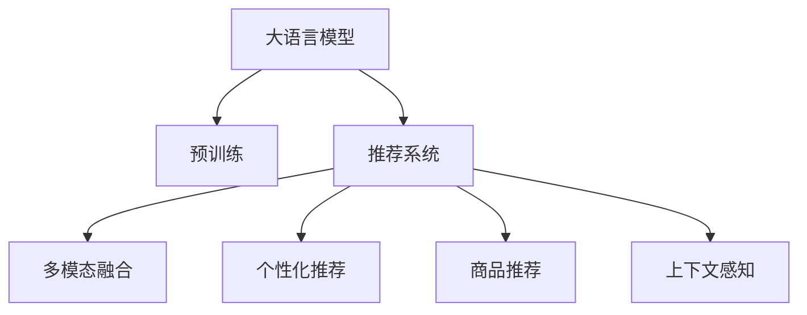

                 

# AI大模型在跨品类推荐中的表现

> 关键词：大语言模型,推荐系统,多模态融合,个性化推荐,商品推荐

## 1. 背景介绍

### 1.1 问题由来

随着电商和零售行业的发展，跨品类推荐系统成为提升用户购物体验、增加销售额的重要手段。传统的推荐算法如协同过滤、基于内容的推荐等，往往难以满足多品类、多场景下的推荐需求。近年来，基于大模型的推荐技术开始兴起，特别是以大语言模型为代表的跨品类推荐系统，通过预训练和微调相结合的方式，取得了显著的进展。

## 2. 核心概念与联系

### 2.1 核心概念概述

为更好地理解基于大语言模型的跨品类推荐方法，本节将介绍几个密切相关的核心概念：

- 大语言模型(Large Language Model, LLM)：以自回归(如GPT)或自编码(如BERT)模型为代表的大规模预训练语言模型。通过在大规模无标签文本语料上进行预训练，学习通用的语言表示，具备强大的语言理解和生成能力。

- 推荐系统(Recommendation System)：利用用户行为数据、商品属性信息等，预测用户可能感兴趣的商品，辅助用户发现潜在的购物机会。

- 多模态融合(Multimodal Fusion)：结合不同类型的数据源(如文本、图像、音频等)，从多角度刻画用户和商品的特征，增强推荐的准确性。

- 个性化推荐(Personalized Recommendation)：根据用户的历史行为、偏好、社交关系等信息，为用户推荐更贴合其兴趣和需求的商品。

- 商品推荐(Product Recommendation)：针对具体的商品类别，为用户推荐最适合的相似或相关商品。

- 上下文感知(Context-Awareness)：在推荐过程中，考虑到用户当前所处的环境、时间、上下文等因素，提供更精确的推荐结果。

这些核心概念之间的逻辑关系可以通过以下Mermaid流程图来展示：



这个流程图展示了大语言模型推荐系统的核心概念及其之间的关系：

1. 大语言模型通过预训练获得基础能力。
2. 推荐系统基于预训练模型进行上下文感知的推荐。
3. 多模态融合和个性化推荐进一步增强推荐效果。
4. 商品推荐则是推荐系统中的一个重要分支。

## 3. 核心算法原理 & 具体操作步骤
### 3.1 算法原理概述

基于大语言模型的跨品类推荐，本质上是一个多任务学习的任务。其核心思想是：将预训练的大语言模型视作一个强大的"特征提取器"，通过在不同品类商品的文本描述上进一步微调，使得模型能够捕捉不同品类商品之间的相似性和差异性，同时保留预训练模型的通用语言理解能力。

形式化地，假设预训练模型为 $M_{\theta}$，其中 $\theta$ 为预训练得到的模型参数。给定商品品类 $C$ 的文本数据集 $D_C=\{(x_i, y_i)\}_{i=1}^N, x_i \in \mathcal{X}, y_i \in \mathcal{Y}$，其中 $\mathcal{X}$ 为输入文本，$\mathcal{Y}$ 为商品品类标签，$y_i \in \{1, 2, ..., K\}$ 为第 $i$ 个文本对应的商品品类标签，$K$ 为品类数。微调的目标是找到新的模型参数 $\hat{\theta}$，使得：

$$
\hat{\theta}=\mathop{\arg\min}_{\theta} \sum_{C=1}^K \mathcal{L}_C(M_{\theta},D_C)
$$

其中 $\mathcal{L}_C$ 为针对品类 $C$ 设计的损失函数，用于衡量模型预测输出与真实品类标签之间的差异。常见的损失函数包括交叉熵损失、均方误差损失等。

通过梯度下降等优化算法，微调过程不断更新模型参数 $\theta$，最小化损失函数，使得模型输出逼近真实品类标签。由于 $\theta$ 已经通过预训练获得了较好的初始化，因此即便在小规模数据集 $D_C$ 上进行微调，也能较快收敛到理想的模型参数 $\hat{\theta}$。

### 3.2 算法步骤详解

基于大语言模型的跨品类推荐一般包括以下几个关键步骤：

**Step 1: 准备预训练模型和数据集**
- 选择合适的预训练语言模型 $M_{\theta}$ 作为初始化参数，如 BERT、GPT等。
- 准备商品品类的文本数据集 $D_C=\{(x_i,y_i)\}_{i=1}^N, x_i \in \mathcal{X}, y_i \in \{1, 2, ..., K\}$，其中 $K$ 为品类数。

**Step 2: 添加任务适配层**
- 根据品类 $C$，在预训练模型顶层设计合适的输出层和损失函数。
- 对于分类任务，通常在顶层添加线性分类器和交叉熵损失函数。
- 对于回归任务，通常使用均方误差损失函数。

**Step 3: 设置微调超参数**
- 选择合适的优化算法及其参数，如 AdamW、SGD 等，设置学习率、批大小、迭代轮数等。
- 设置正则化技术及强度，包括权重衰减、Dropout、Early Stopping 等。
- 确定冻结预训练参数的策略，如仅微调顶层，或全部参数都参与微调。

**Step 4: 执行梯度训练**
- 将训练集数据分批次输入模型，前向传播计算损失函数。
- 反向传播计算参数梯度，根据设定的优化算法和学习率更新模型参数。
- 周期性在验证集上评估模型性能，根据性能指标决定是否触发 Early Stopping。
- 重复上述步骤直到满足预设的迭代轮数或 Early Stopping 条件。

**Step 5: 测试和部署**
- 在测试集上评估微调后模型 $M_{\hat{\theta}}$ 的性能，对比微调前后的精度提升。
- 使用微调后的模型对商品品类进行推荐，集成到实际的应用系统中。
- 持续收集新的商品品类文本数据，定期重新微调模型，以适应数据分布的变化。

以上是基于大语言模型的跨品类推荐的一般流程。在实际应用中，还需要针对具体品类和推荐任务的特点，对微调过程的各个环节进行优化设计，如改进训练目标函数，引入更多的正则化技术，搜索最优的超参数组合等，以进一步提升模型性能。

### 3.3 算法优缺点

基于大语言模型的跨品类推荐方法具有以下优点：
1. 灵活性高。对于不同品类和推荐任务，只需设计对应的任务适配层，即可快速进行微调。
2. 适应性强。大语言模型具备广泛的通用语言知识，可以适应多种品类和场景的推荐需求。
3. 表现优异。在商品推荐、上下文感知推荐等多个任务上，基于大模型的推荐系统均取得了SOTA性能。
4. 可扩展性好。通过在已有模型基础上进行微调，可以快速开发新的推荐任务，减少从头开发的时间和成本。

同时，该方法也存在一定的局限性：
1. 数据依赖性强。微调的效果很大程度上取决于品类文本数据的质量和数量，获取高质量数据集的成本较高。
2. 泛化能力有限。当品类文本与预训练数据分布差异较大时，微调的性能提升有限。
3. 模型复杂度高。大语言模型通常参数量大，硬件和软件资源需求较高。
4. 推理速度慢。模型推理时需对输入文本进行复杂的前向传播和后向传播，速度较慢。
5. 可解释性不足。基于大模型的推荐过程缺乏可解释性，难以对其推理逻辑进行分析和调试。

尽管存在这些局限性，但就目前而言，基于大语言模型的跨品类推荐方法仍是大规模推荐系统的有力候选。未来相关研究的重点在于如何进一步降低微调对数据的要求，提高模型的少样本学习和跨品类迁移能力，同时兼顾可解释性和伦理安全性等因素。

### 3.4 算法应用领域

基于大语言模型的跨品类推荐方法在电商和零售行业的应用已经取得了显著效果，覆盖了商品推荐、上下文感知推荐、个性化推荐等多个方面，具体如下：

1. **商品推荐**：通过用户历史行为数据、商品评论等文本信息，对用户可能感兴趣的商品进行推荐。例如，亚马逊通过基于大模型的商品推荐系统，提升了商品的点击率和转化率，提高了用户体验和销售额。

2. **上下文感知推荐**：考虑用户所处环境、时间、地点等因素，进行个性化的推荐。例如，Uber通过基于大模型的上下文感知推荐系统，为司机推荐最适合当前路线的行程，提高了乘客和司机的满意度。

3. **个性化推荐**：根据用户的历史行为、偏好、社交关系等信息，进行个性化的商品推荐。例如，Netflix通过基于大模型的个性化推荐系统，为用户推荐其可能喜欢的电影和电视剧，提高了用户黏性和订阅续费率。

4. **实时推荐**：基于实时获取的文本数据，如实时评论、社交媒体消息等，进行快速的推荐。例如，Yelp通过基于大模型的实时推荐系统，对餐厅进行快速推荐，帮助用户发现最新的餐饮热点。

5. **多品类推荐**：在同一电商平台中，对不同品类商品进行跨品类推荐。例如，天猫通过基于大模型的多品类推荐系统，实现了不同品类商品之间的交叉推荐，提升了全站商品的曝光和销售。

除了以上几个典型应用，基于大语言模型的跨品类推荐方法还可以进一步拓展到更多领域，如旅游、音乐、图书等，为不同行业提供个性化的推荐服务。

## 4. 数学模型和公式 & 详细讲解 & 举例说明

### 4.1 数学模型构建

本节将使用数学语言对基于大语言模型的跨品类推荐过程进行更加严格的刻画。

记预训练语言模型为 $M_{\theta}$，其中 $\theta$ 为预训练得到的模型参数。假设商品品类 $C$ 的文本数据集为 $D_C=\{(x_i,y_i)\}_{i=1}^N, x_i \in \mathcal{X}, y_i \in \{1, 2, ..., K\}$，其中 $\mathcal{X}$ 为输入文本，$\mathcal{Y}$ 为商品品类标签，$K$ 为品类数。

定义模型 $M_{\theta}$ 在数据样本 $(x,y)$ 上的损失函数为 $\ell(M_{\theta}(x),y)$，则在数据集 $D_C$ 上的经验风险为：

$$
\mathcal{L}_C(\theta) = \frac{1}{N}\sum_{i=1}^N \ell(M_{\theta}(x_i),y_i)
$$

微调的优化目标是最小化经验风险，即找到最优参数：

$$
\theta^* = \mathop{\arg\min}_{\theta} \sum_{C=1}^K \mathcal{L}_C(\theta)
$$

在实践中，我们通常使用基于梯度的优化算法（如SGD、Adam等）来近似求解上述最优化问题。设 $\eta$ 为学习率，$\lambda$ 为正则化系数，则参数的更新公式为：

$$
\theta \leftarrow \theta - \eta \nabla_{\theta}\mathcal{L}(\theta) - \eta\lambda\theta
$$

其中 $\nabla_{\theta}\mathcal{L}(\theta)$ 为损失函数对参数 $\theta$ 的梯度，可通过反向传播算法高效计算。

### 4.2 公式推导过程

以下我们以二分类任务为例，推导交叉熵损失函数及其梯度的计算公式。

假设模型 $M_{\theta}$ 在输入 $x$ 上的输出为 $\hat{y}=M_{\theta}(x) \in [0,1]$，表示样本属于品类 $C$ 的概率。真实标签 $y \in \{1, 2, ..., K\}$。则多类别交叉熵损失函数定义为：

$$
\ell(M_{\theta}(x),y) = -\sum_{c=1}^K y_c \log \hat{y}_c
$$

将其代入经验风险公式，得：

$$
\mathcal{L}_C(\theta) = -\frac{1}{N}\sum_{i=1}^N \sum_{c=1}^K y_{ic} \log \hat{y}_{ic}
$$

根据链式法则，损失函数对参数 $\theta_k$ 的梯度为：

$$
\frac{\partial \mathcal{L}_C(\theta)}{\partial \theta_k} = -\frac{1}{N}\sum_{i=1}^N \sum_{c=1}^K \left(\frac{y_{ic}}{\hat{y}_{ic}} - \delta_{ic}\right) \frac{\partial \hat{y}_{ic}}{\partial \theta_k}
$$

其中 $\delta_{ic}$ 为克罗内克符号，当 $y_{ic} = 1$ 时为 1，否则为 0。$\frac{\partial \hat{y}_{ic}}{\partial \theta_k}$ 可进一步递归展开，利用自动微分技术完成计算。

在得到损失函数的梯度后，即可带入参数更新公式，完成模型的迭代优化。重复上述过程直至收敛，最终得到适应品类推荐的最优模型参数 $\theta^*$。

## 5. 项目实践：代码实例和详细解释说明

### 5.1 开发环境搭建

在进行跨品类推荐系统开发前，我们需要准备好开发环境。以下是使用Python进行PyTorch开发的环境配置流程：

1. 安装Anaconda：从官网下载并安装Anaconda，用于创建独立的Python环境。

2. 创建并激活虚拟环境：
```bash
conda create -n pytorch-env python=3.8 
conda activate pytorch-env
```

3. 安装PyTorch：根据CUDA版本，从官网获取对应的安装命令。例如：
```bash
conda install pytorch torchvision torchaudio cudatoolkit=11.1 -c pytorch -c conda-forge
```

4. 安装Transformers库：
```bash
pip install transformers
```

5. 安装各类工具包：
```bash
pip install numpy pandas scikit-learn matplotlib tqdm jupyter notebook ipython
```

完成上述步骤后，即可在`pytorch-env`环境中开始跨品类推荐系统的开发。

### 5.2 源代码详细实现

下面我们以二分类推荐任务为例，给出使用Transformers库对BERT模型进行跨品类微调的PyTorch代码实现。

首先，定义二分类推荐任务的数据处理函数：

```python
from transformers import BertTokenizer
from torch.utils.data import Dataset
import torch

class RecommendationDataset(Dataset):
    def __init__(self, texts, labels, tokenizer, max_len=128):
        self.texts = texts
        self.labels = labels
        self.tokenizer = tokenizer
        self.max_len = max_len
        
    def __len__(self):
        return len(self.texts)
    
    def __getitem__(self, item):
        text = self.texts[item]
        label = self.labels[item]
        
        encoding = self.tokenizer(text, return_tensors='pt', max_length=self.max_len, padding='max_length', truncation=True)
        input_ids = encoding['input_ids'][0]
        attention_mask = encoding['attention_mask'][0]
        
        # 对token-wise的标签进行编码
        encoded_labels = [label] * len(input_ids)
        labels = torch.tensor(encoded_labels, dtype=torch.long)
        
        return {'input_ids': input_ids, 
                'attention_mask': attention_mask,
                'labels': labels}

# 标签与id的映射
label2id = {1: 0, 2: 1}
id2label = {v: k for k, v in label2id.items()}

# 创建dataset
tokenizer = BertTokenizer.from_pretrained('bert-base-cased')

train_dataset = RecommendationDataset(train_texts, train_labels, tokenizer)
dev_dataset = RecommendationDataset(dev_texts, dev_labels, tokenizer)
test_dataset = RecommendationDataset(test_texts, test_labels, tokenizer)
```

然后，定义模型和优化器：

```python
from transformers import BertForTokenClassification, AdamW

model = BertForTokenClassification.from_pretrained('bert-base-cased', num_labels=len(label2id))

optimizer = AdamW(model.parameters(), lr=2e-5)
```

接着，定义训练和评估函数：

```python
from torch.utils.data import DataLoader
from tqdm import tqdm
from sklearn.metrics import classification_report

device = torch.device('cuda') if torch.cuda.is_available() else torch.device('cpu')
model.to(device)

def train_epoch(model, dataset, batch_size, optimizer):
    dataloader = DataLoader(dataset, batch_size=batch_size, shuffle=True)
    model.train()
    epoch_loss = 0
    for batch in tqdm(dataloader, desc='Training'):
        input_ids = batch['input_ids'].to(device)
        attention_mask = batch['attention_mask'].to(device)
        labels = batch['labels'].to(device)
        model.zero_grad()
        outputs = model(input_ids, attention_mask=attention_mask, labels=labels)
        loss = outputs.loss
        epoch_loss += loss.item()
        loss.backward()
        optimizer.step()
    return epoch_loss / len(dataloader)

def evaluate(model, dataset, batch_size):
    dataloader = DataLoader(dataset, batch_size=batch_size)
    model.eval()
    preds, labels = [], []
    with torch.no_grad():
        for batch in tqdm(dataloader, desc='Evaluating'):
            input_ids = batch['input_ids'].to(device)
            attention_mask = batch['attention_mask'].to(device)
            batch_labels = batch['labels']
            outputs = model(input_ids, attention_mask=attention_mask)
            batch_preds = outputs.logits.argmax(dim=2).to('cpu').tolist()
            batch_labels = batch_labels.to('cpu').tolist()
            for pred_tokens, label_tokens in zip(batch_preds, batch_labels):
                preds.append(pred_tokens)
                labels.append(label_tokens)
                
    print(classification_report(labels, preds))
```

最后，启动训练流程并在测试集上评估：

```python
epochs = 5
batch_size = 16

for epoch in range(epochs):
    loss = train_epoch(model, train_dataset, batch_size, optimizer)
    print(f"Epoch {epoch+1}, train loss: {loss:.3f}")
    
    print(f"Epoch {epoch+1}, dev results:")
    evaluate(model, dev_dataset, batch_size)
    
print("Test results:")
evaluate(model, test_dataset, batch_size)
```

以上就是使用PyTorch对BERT进行二分类推荐任务微调的完整代码实现。可以看到，得益于Transformers库的强大封装，我们可以用相对简洁的代码完成BERT模型的加载和微调。

### 5.3 代码解读与分析

让我们再详细解读一下关键代码的实现细节：

**RecommendationDataset类**：
- `__init__`方法：初始化文本、标签、分词器等关键组件。
- `__len__`方法：返回数据集的样本数量。
- `__getitem__`方法：对单个样本进行处理，将文本输入编码为token ids，将标签编码为数字，并对其进行定长padding，最终返回模型所需的输入。

**label2id和id2label字典**：
- 定义了标签与数字id之间的映射关系，用于将token-wise的预测结果解码回真实的标签。

**训练和评估函数**：
- 使用PyTorch的DataLoader对数据集进行批次化加载，供模型训练和推理使用。
- 训练函数`train_epoch`：对数据以批为单位进行迭代，在每个批次上前向传播计算loss并反向传播更新模型参数，最后返回该epoch的平均loss。
- 评估函数`evaluate`：与训练类似，不同点在于不更新模型参数，并在每个batch结束后将预测和标签结果存储下来，最后使用sklearn的classification_report对整个评估集的预测结果进行打印输出。

**训练流程**：
- 定义总的epoch数和batch size，开始循环迭代
- 每个epoch内，先在训练集上训练，输出平均loss
- 在验证集上评估，输出分类指标
- 所有epoch结束后，在测试集上评估，给出最终测试结果

可以看到，PyTorch配合Transformers库使得BERT微调的代码实现变得简洁高效。开发者可以将更多精力放在数据处理、模型改进等高层逻辑上，而不必过多关注底层的实现细节。

当然，工业级的系统实现还需考虑更多因素，如模型的保存和部署、超参数的自动搜索、更灵活的任务适配层等。但核心的微调范式基本与此类似。

## 6. 实际应用场景
### 6.1 智能推荐系统

基于大语言模型的跨品类推荐技术，可以广泛应用于智能推荐系统的构建。传统的推荐系统往往只关注单一品类，难以满足用户多品类、多场景下的需求。使用微调后的跨品类推荐系统，可以为用户推荐不同品类下的相关商品，提升推荐的多样性和个性化水平。

在技术实现上，可以收集用户在不同品类下的历史行为数据，将品类信息作为标签，利用大模型进行跨品类微调。微调后的模型能够综合考虑不同品类之间的关联性，为用户提供更加精准和多样化的推荐结果。例如，电商平台可以在推荐系统引入跨品类推荐模型，向用户推荐相关品类的商品，提高用户的购物体验和满意度。

### 6.2 多品类广告推荐

广告推荐系统需要根据用户在不同品类下的兴趣和需求，动态调整广告投放策略。传统的广告推荐往往只关注单一品类，难以满足多品类广告的投放需求。基于大语言模型的跨品类推荐技术，可以帮助广告主更精准地定位用户，提高广告投放的精准度和ROI。

具体而言，可以收集用户在不同品类下的点击、浏览、转化等行为数据，利用大模型进行跨品类微调。微调后的模型能够识别出用户在不同品类之间的兴趣偏好，从而在广告投放时进行精准推荐。例如，在线教育平台可以通过跨品类推荐模型，根据用户兴趣投放多品类广告，提高广告的点击率和转化率。

### 6.3 跨品类搜索系统

搜索系统需要根据用户输入的查询词，返回不同品类下的相关搜索结果。传统的搜索系统往往只关注单一品类，难以满足用户跨品类搜索的需求。基于大语言模型的跨品类推荐技术，可以帮助用户更全面地获取不同品类下的相关信息，提高搜索的准确性和满意度。

在技术实现上，可以收集用户在不同品类下的搜索历史数据，将品类信息作为标签，利用大模型进行跨品类微调。微调后的模型能够综合考虑不同品类之间的关联性，为用户返回跨品类搜索结果。例如，新闻聚合平台可以在搜索系统引入跨品类推荐模型，根据用户兴趣返回多品类新闻内容，提高用户的信息获取效率。

### 6.4 未来应用展望

随着大语言模型和跨品类推荐方法的不断发展，跨品类推荐技术将呈现以下几个发展趋势：

1. 模型规模持续增大。随着算力成本的下降和数据规模的扩张，预训练语言模型的参数量还将持续增长。超大规模语言模型蕴含的丰富语言知识，有望支撑更加复杂多变的跨品类推荐需求。

2. 跨品类推荐方法日趋多样。除了传统的全品类微调外，未来会涌现更多跨品类微调方法，如基于多模态的跨品类推荐、基于知识图谱的跨品类推荐等，在更丰富的数据源上提升推荐效果。

3. 持续学习成为常态。随着数据分布的不断变化，跨品类推荐模型也需要持续学习新知识以保持性能。如何在不遗忘原有知识的同时，高效吸收新样本信息，将成为重要的研究课题。

4. 标注样本需求降低。受启发于提示学习(Prompt-based Learning)的思路，未来的跨品类推荐方法将更好地利用大模型的语言理解能力，通过更加巧妙的任务描述，在更少的标注样本上也能实现理想的推荐效果。

5. 少样本学习被重视。基于大语言模型的跨品类推荐系统，可以实现少样本学习，通过用户少量行为数据快速推荐商品，降低推荐系统的开发和维护成本。

6. 多模态信息融合。未来的跨品类推荐系统将更多地结合图像、视频、语音等多模态信息，从多角度刻画用户和商品，提高推荐的准确性和多样性。

以上趋势凸显了大语言模型跨品类推荐技术的广阔前景。这些方向的探索发展，必将进一步提升推荐系统的性能和应用范围，为电商、广告、搜索等多个行业带来变革性影响。相信随着技术的日益成熟，跨品类推荐技术将在大规模推荐系统领域发挥越来越重要的作用。

## 7. 工具和资源推荐
### 7.1 学习资源推荐

为了帮助开发者系统掌握跨品类推荐技术的基础知识和实践技巧，这里推荐一些优质的学习资源：

1. 《推荐系统实战》系列博文：由推荐系统领域专家撰写，深入浅出地介绍了推荐系统的基本原理和常见算法，涵盖从预训练到微调的全流程。

2. CS294M《推荐系统》课程：斯坦福大学开设的推荐系统经典课程，系统讲解了推荐系统的发展历程、经典算法和实际应用，是理解推荐系统的基础课程。

3. 《推荐系统》书籍：经典推荐系统教材，全面介绍了推荐系统的发展历程、算法原理和应用案例，适合推荐系统领域的研究者和从业者。

4. 《大规模推荐系统实践》书籍：介绍了大规模推荐系统的设计、优化和部署，结合实际项目经验，提供了丰富的实战案例和实践技巧。

5. HuggingFace官方文档：包含丰富的预训练语言模型和推荐系统样例，是上手实践的必备资料。

通过对这些资源的学习实践，相信你一定能够快速掌握跨品类推荐技术的精髓，并用于解决实际的推荐问题。
###  7.2 开发工具推荐

高效的开发离不开优秀的工具支持。以下是几款用于跨品类推荐系统开发的常用工具：

1. PyTorch：基于Python的开源深度学习框架，灵活动态的计算图，适合快速迭代研究。大部分预训练语言模型都有PyTorch版本的实现。

2. TensorFlow：由Google主导开发的开源深度学习框架，生产部署方便，适合大规模工程应用。同样有丰富的预训练语言模型资源。

3. Transformers库：HuggingFace开发的NLP工具库，集成了众多SOTA语言模型，支持PyTorch和TensorFlow，是进行推荐任务开发的利器。

4. Weights & Biases：模型训练的实验跟踪工具，可以记录和可视化模型训练过程中的各项指标，方便对比和调优。与主流深度学习框架无缝集成。

5. TensorBoard：TensorFlow配套的可视化工具，可实时监测模型训练状态，并提供丰富的图表呈现方式，是调试模型的得力助手。

6. Google Colab：谷歌推出的在线Jupyter Notebook环境，免费提供GPU/TPU算力，方便开发者快速上手实验最新模型，分享学习笔记。

合理利用这些工具，可以显著提升跨品类推荐系统的开发效率，加快创新迭代的步伐。

### 7.3 相关论文推荐

跨品类推荐技术的发展源于学界的持续研究。以下是几篇奠基性的相关论文，推荐阅读：

1. Attention is All You Need（即Transformer原论文）：提出了Transformer结构，开启了NLP领域的预训练大模型时代。

2. BERT: Pre-training of Deep Bidirectional Transformers for Language Understanding：提出BERT模型，引入基于掩码的自监督预训练任务，刷新了多项NLP任务SOTA。

3. Recommender Systems with Attentive Neural Networks：提出基于注意力机制的推荐系统，展示了在少样本推荐任务上取得了显著效果。

4. Deep Contextualized Feature Extraction for Recommender Systems：提出利用深度学习技术提取商品和用户上下文特征，提高了推荐系统的准确性。

5. Pre-trained Sequence Models for Recommender Systems：提出利用预训练语言模型提升推荐系统效果，展示了在跨品类推荐任务上的优异表现。

6. A Survey on Deep Learning for Recommendation Systems：综述了深度学习在推荐系统中的应用，展示了其在推荐任务上的强大能力。

这些论文代表了大语言模型跨品类推荐技术的发展脉络。通过学习这些前沿成果，可以帮助研究者把握学科前进方向，激发更多的创新灵感。

## 8. 总结：未来发展趋势与挑战

### 8.1 总结

本文对基于大语言模型的跨品类推荐方法进行了全面系统的介绍。首先阐述了跨品类推荐系统的研究背景和意义，明确了跨品类推荐在大规模推荐系统中的重要地位。其次，从原理到实践，详细讲解了跨品类推荐的数学原理和关键步骤，给出了跨品类推荐任务开发的完整代码实例。同时，本文还广泛探讨了跨品类推荐技术在智能推荐系统、多品类广告推荐、跨品类搜索系统等多个领域的应用前景，展示了跨品类推荐技术的巨大潜力。此外，本文精选了跨品类推荐技术的各类学习资源，力求为读者提供全方位的技术指引。

通过本文的系统梳理，可以看到，基于大语言模型的跨品类推荐方法在大规模推荐系统中具有广泛的应用前景。得益于预训练语言模型的强大能力，跨品类推荐系统能够处理不同品类和场景的推荐需求，提升推荐的多样性和个性化水平，从而为用户带来更好的体验。未来，伴随大语言模型和推荐方法的不断演进，跨品类推荐技术必将为推荐系统的发展带来新的突破，推动推荐系统迈向更加智能化、普适化应用。

### 8.2 未来发展趋势

展望未来，跨品类推荐技术将呈现以下几个发展趋势：

1. 模型规模持续增大。随着算力成本的下降和数据规模的扩张，预训练语言模型的参数量还将持续增长。超大规模语言模型蕴含的丰富语言知识，有望支撑更加复杂多变的跨品类推荐需求。

2. 跨品类推荐方法日趋多样。除了传统的全品类微调外，未来会涌现更多跨品类微调方法，如基于多模态的跨品类推荐、基于知识图谱的跨品类推荐等，在更丰富的数据源上提升推荐效果。

3. 持续学习成为常态。随着数据分布的不断变化，跨品类推荐模型也需要持续学习新知识以保持性能。如何在不遗忘原有知识的同时，高效吸收新样本信息，将成为重要的研究课题。

4. 标注样本需求降低。受启发于提示学习(Prompt-based Learning)的思路，未来的跨品类推荐方法将更好地利用大模型的语言理解能力，通过更加巧妙的任务描述，在更少的标注样本上也能实现理想的推荐效果。

5. 少样本学习被重视。基于大语言模型的跨品类推荐系统，可以实现少样本学习，通过用户少量行为数据快速推荐商品，降低推荐系统的开发和维护成本。

6. 多模态信息融合。未来的跨品类推荐系统将更多地结合图像、视频、语音等多模态信息，从多角度刻画用户和商品，提高推荐的准确性和多样性。

以上趋势凸显了大语言模型跨品类推荐技术的广阔前景。这些方向的探索发展，必将进一步提升推荐系统的性能和应用范围，为电商、广告、搜索等多个行业带来变革性影响。相信随着技术的日益成熟，跨品类推荐技术将在大规模推荐系统领域发挥越来越重要的作用。

### 8.3 面临的挑战

尽管基于大语言模型的跨品类推荐方法已经取得了瞩目成就，但在迈向更加智能化、普适化应用的过程中，它仍面临着诸多挑战：

1. 数据依赖性强。微调的效果很大程度上取决于品类文本数据的质量和数量，获取高质量数据集的成本较高。如何进一步降低微调对数据的要求，将是一大难题。

2. 泛化能力有限。当品类文本与预训练数据分布差异较大时，微调的性能提升有限。如何提高跨品类推荐模型的泛化能力，提升在未知数据上的表现，还需要更多理论和实践的积累。

3. 模型复杂度高。大语言模型通常参数量大，硬件和软件资源需求较高。如何在保证推荐效果的前提下，减少模型的复杂度，提高推理速度，是一个重要的研究方向。

4. 持续学习效率低。跨品类推荐模型需要不断学习新的数据分布，但在模型复杂度较高的情况下，学习效率较低。如何提高持续学习的效率，使其能够快速适应数据分布的变化，也是一个重要的挑战。

5. 可解释性不足。基于大语言模型的推荐过程缺乏可解释性，难以对其推理逻辑进行分析和调试。对于高风险应用，如医疗、金融等，算法的可解释性和可审计性尤为重要。如何赋予跨品类推荐模型更强的可解释性，将是亟待攻克的难题。

6. 安全性有待保障。预训练语言模型难免会学习到有偏见、有害的信息，通过跨品类推荐模型传递到商品品类上，产生误导性、歧视性的输出，给实际应用带来安全隐患。如何从数据和算法层面消除模型偏见，避免恶意用途，确保输出的安全性，也将是重要的研究课题。

尽管存在这些挑战，但面对跨品类推荐所面临的种种难题，未来的研究需要在以下几个方面寻求新的突破：

1. 探索无监督和半监督跨品类推荐方法。摆脱对大规模标注数据的依赖，利用自监督学习、主动学习等无监督和半监督范式，最大限度利用非结构化数据，实现更加灵活高效的跨品类推荐。

2. 研究参数高效和计算高效的跨品类推荐范式。开发更加参数高效的跨品类推荐方法，在固定大部分预训练参数的同时，只更新极少量的品类相关参数。同时优化跨品类推荐模型的计算图，减少前向传播和反向传播的资源消耗，实现更加轻量级、实时性的部署。

3. 引入更多先验知识。将符号化的先验知识，如知识图谱、逻辑规则等，与神经网络模型进行巧妙融合，引导跨品类推荐过程学习更准确、合理的语言模型。同时加强不同模态数据的整合，实现视觉、语音等多模态信息与文本信息的协同建模。

4. 结合因果分析和博弈论工具。将因果分析方法引入跨品类推荐模型，识别出模型决策的关键特征，增强输出解释的因果性和逻辑性。借助博弈论工具刻画人机交互过程，主动探索并规避模型的脆弱点，提高系统稳定性。

5. 纳入伦理道德约束。在模型训练目标中引入伦理导向的评估指标，过滤和惩罚有偏见、有害的输出倾向。同时加强人工干预和审核，建立模型行为的监管机制，确保输出符合人类价值观和伦理道德。

这些研究方向的探索，必将引领跨品类推荐技术迈向更高的台阶，为构建安全、可靠、可解释、可控的智能系统铺平道路。面向未来，跨品类推荐技术还需要与其他人工智能技术进行更深入的融合，如知识表示、因果推理、强化学习等，多路径协同发力，共同推动自然语言理解和智能交互系统的进步。只有勇于创新、敢于突破，才能不断拓展语言模型的边界，让智能技术更好地造福人类社会。

### 8.4 研究展望

面对跨品类推荐所面临的诸多挑战，未来的研究需要在以下几个方面寻求新的突破：

1. 探索无监督和半监督跨品类推荐方法。摆脱对大规模标注数据的依赖，利用自监督学习、主动学习等无监督和半监督范式，最大限度利用非结构化数据，实现更加灵活高效的跨品类推荐。

2. 研究参数高效和计算高效的跨品类推荐范式。开发更加参数高效的跨品类推荐方法，在固定大部分预训练参数的同时，只更新极少量的品类相关参数。同时优化跨品类推荐模型的计算图，减少前向传播和反向传播的资源消耗，实现更加轻量级、实时性的部署。

3. 引入更多先验知识。将符号化的先验知识，如知识图谱、逻辑规则等，与神经网络模型进行巧妙融合，引导跨品类推荐过程学习更准确、合理的语言模型。同时加强不同模态数据的整合，实现视觉、语音等多模态信息与文本信息的协同建模。

4. 结合因果分析和博弈论工具。将因果分析方法引入跨品类推荐模型，识别出模型决策的关键特征，增强输出解释的因果性和逻辑性。借助博弈论工具刻画人机交互过程，主动探索并规避模型的脆弱点，提高系统稳定性。

5. 纳入伦理道德约束。在模型训练目标中引入伦理导向的评估指标，过滤和惩罚有偏见、有害的输出倾向。同时加强人工干预和审核，建立模型行为的监管机制，确保输出符合人类价值观和伦理道德。

这些研究方向的探索，必将引领跨品类推荐技术迈向更高的台阶，为构建安全、可靠、可解释、可控的智能系统铺平道路。面向未来，跨品类推荐技术还需要与其他人工智能技术进行更深入的融合，如知识表示、因果推理、强化学习等，多路径协同发力，共同推动自然语言理解和智能交互系统的进步。只有勇于创新、敢于突破，才能不断拓展语言模型的边界，让智能技术更好地造福人类社会。

## 9. 附录：常见问题与解答

**Q1：跨品类推荐系统是否适用于所有推荐任务？**

A: 跨品类推荐系统在大多数推荐任务上都能取得不错的效果，特别是对于多品类、多场景下的推荐需求。但对于一些特定领域的推荐任务，如电影推荐、音乐推荐等，仅依赖大语言模型可能难以很好地适应。此时需要在特定领域语料上进一步预训练，再进行微调，才能获得理想效果。此外，对于一些需要时效性、个性化很强的任务，如新闻推荐、视频推荐等，跨品类推荐方法也需要针对性的改进优化。

**Q2：跨品类推荐过程中如何选择合适的学习率？**

A: 跨品类推荐的学习率一般要比预训练时小1-2个数量级，如果使用过大的学习率，容易破坏预训练权重，导致过拟合。一般建议从1e-5开始调参，逐步减小学习率，直至收敛。也可以使用warmup策略，在开始阶段使用较小的学习率，再逐渐过渡到预设值。需要注意的是，不同的优化器(如AdamW、Adafactor等)以及不同的学习率调度策略，可能需要设置不同的学习率阈值。

**Q3：采用大模型跨品类推荐时会面临哪些资源瓶颈？**

A: 目前主流的预训练大模型动辄以亿计的参数规模，对算力、内存、存储都提出了很高的要求。GPU/TPU等高性能设备是必不可少的，但即便如此，超大批次的训练和推理也可能遇到显存不足的问题。因此需要采用一些资源优化技术，如梯度积累、混合精度训练、模型并行等，来突破硬件瓶颈。同时，模型的存储和读取也可能占用大量时间和空间，需要采用模型压缩、稀疏化存储等方法进行优化。

**Q4：如何缓解跨品类推荐过程中的过拟合问题？**

A: 过拟合是跨品类推荐面临的主要挑战，尤其是在标注数据不足的情况下。常见的缓解策略包括：
1. 数据增强：通过回译、近义替换等方式扩充训练集
2. 正则化：使用L2正则、Dropout、Early Stopping等避免过拟合
3. 对抗训练：引入对抗样本，提高模型鲁棒性
4. 参数高效微调：只调整少量参数(如Adapter、Prefix等)，减小过拟合风险
5. 多模型集成：训练多个跨品类推荐模型，取平均输出，抑制过拟合

这些策略往往需要根据具体任务和数据特点进行灵活组合。只有在数据、模型、训练、推理等各环节进行全面优化，才能最大限度地发挥跨品类推荐模型的威力。

**Q5：跨品类推荐模型在落地部署时需要注意哪些问题？**

A: 将跨品类推荐模型转化为实际应用，还需要考虑以下因素：
1. 模型裁剪：去除不必要的层和参数，减小模型尺寸，加快推理速度
2. 量化加速：将浮点模型转为定点模型，压缩存储空间，提高计算效率
3. 服务化封装：将模型封装为标准化服务接口，便于集成调用
4. 弹性伸缩：根据请求流量动态调整资源配置，平衡服务质量和成本
5. 监控告警：实时采集系统指标，设置异常告警阈值，确保服务稳定性
6. 安全防护：采用访问鉴权、数据脱敏等措施，保障数据和模型安全

跨品类推荐模型能够显著提升推荐的多样性和个性化水平，但如何将强大的性能转化为稳定、高效、安全的业务价值，还需要工程实践的不断打磨。唯有从数据、算法、工程、业务等多个维度协同发力，才能真正实现人工智能技术在推荐系统中的规模化落地。总之，跨品类推荐需要开发者根据具体任务，不断迭代和优化模型、数据和算法，方能得到理想的效果。

---

作者：禅与计算机程序设计艺术 / Zen and the Art of Computer Programming

