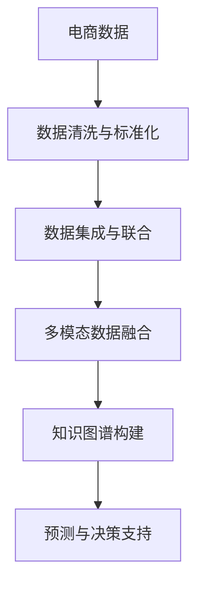

                 

# AI大模型在跨平台电商数据融合中的作用

## 1. 背景介绍

随着电商行业的迅猛发展，各个电商平台纷纷加大技术投入，以期在激烈的竞争中占据优势。与此同时，数据成为了电商企业的重要资产，为市场分析和用户行为研究提供了宝贵的信息。然而，不同平台的数据往往是分散的、异构的，如何高效融合这些数据，充分挖掘其价值，成为了当前电商企业面临的一大难题。近年来，AI大模型通过在电商领域的应用，为电商数据融合提供了全新的解决方案，极大地提升了数据处理和分析的效率，带来了显著的商业价值。

## 2. 核心概念与联系

### 2.1 核心概念概述

在电商数据融合中，AI大模型主要起到了以下几个关键作用：

- **数据清洗与标准化**：AI大模型可以快速处理海量的电商数据，通过自然语言处理(NLP)和计算机视觉(CV)技术，自动检测并修正数据中的异常值和噪声，使得数据质量得以提升。
- **数据集成与联合**：AI大模型可以将来自不同平台的数据进行集成和联合，形成统一的视图，便于后续分析和使用。
- **多模态数据融合**：AI大模型支持融合多种类型的数据，包括文本、图像、视频等，为电商数据分析提供了更加全面和丰富的视角。
- **知识图谱构建**：AI大模型可以构建基于电商数据的知识图谱，挖掘潜在的关联关系，提升数据分析的深度和广度。
- **预测与决策支持**：AI大模型可以基于历史数据进行预测，为电商营销和决策提供支持，提升用户转化率和平台收益。

### 2.2 核心概念原理和架构的 Mermaid 流程图



## 3. 核心算法原理 & 具体操作步骤

### 3.1 算法原理概述

AI大模型在电商数据融合中的应用，主要依赖于其强大的自我学习能力和泛化能力。以下是AI大模型在电商数据融合中的算法原理概述：

- **数据清洗与标准化**：AI大模型使用NLP技术，自动检测并修正数据中的拼写错误、缺失值、格式不统一等问题，使得数据质量得到提升。
- **数据集成与联合**：AI大模型通过联邦学习等技术，使得不同平台的数据可以在不暴露原始数据的前提下，联合进行训练和推理，形成统一的视图。
- **多模态数据融合**：AI大模型通过融合多种类型的数据，获取更加全面和深入的信息，提高电商数据分析的准确性和实用性。
- **知识图谱构建**：AI大模型通过深度学习技术，构建基于电商数据的知识图谱，挖掘潜在的关联关系，提升数据分析的深度和广度。
- **预测与决策支持**：AI大模型通过时间序列预测、分类预测等方法，基于历史数据进行预测，为电商营销和决策提供支持。

### 3.2 算法步骤详解

#### 3.2.1 数据清洗与标准化

**Step 1: 数据收集**
- 从不同电商平台收集用户行为数据、商品描述数据、评论数据等。
- 对文本数据进行分词、去停用词、去除特殊字符等预处理操作。

**Step 2: 模型训练**
- 使用NLP技术，训练AI大模型进行文本清洗，自动检测并修正数据中的异常值和噪声。
- 通过迁移学习等方式，将通用预训练模型适配到电商领域数据，提高模型的泛化能力。

**Step 3: 数据标准化**
- 对清洗后的文本数据进行标准化处理，如统一格式、归一化文本等，便于后续的数据集成和联合。

#### 3.2.2 数据集成与联合

**Step 1: 数据融合**
- 对来自不同平台的数据进行融合，包括用户行为数据、商品信息数据、评论数据等。
- 使用联邦学习等技术，在本地训练模型，然后将模型参数上传至云端，形成统一的视图。

**Step 2: 数据加密**
- 对上传的数据进行加密处理，确保数据传输过程中的安全性。
- 在云端对加密后的数据进行联合训练，形成统一的视图。

**Step 3: 数据下传**
- 对联合训练后的模型进行解密，形成可供使用的模型。
- 将模型下传至本地，进行后续的数据分析和预测。

#### 3.2.3 多模态数据融合

**Step 1: 数据收集**
- 收集电商平台上的文本数据、图像数据、视频数据等。
- 对数据进行预处理，如文本分词、图像预处理、视频剪辑等。

**Step 2: 模型训练**
- 使用多模态数据融合技术，训练AI大模型，将不同类型的数据进行融合。
- 通过深度学习技术，如注意力机制、卷积神经网络(CNN)等，将文本、图像、视频数据融合为一个统一的表示。

**Step 3: 数据表示**
- 将融合后的数据表示为向量形式，便于后续的分析和预测。
- 对向量进行归一化处理，确保其维度一致。

#### 3.2.4 知识图谱构建

**Step 1: 数据收集**
- 收集电商平台上的用户数据、商品数据、订单数据等。
- 对数据进行清洗和标准化处理，确保数据质量。

**Step 2: 实体抽取**
- 使用实体抽取技术，从电商数据中抽取出实体（如商品、用户、订单等）及其关系。
- 对抽取出的实体和关系进行标注，形成知识图谱的基本框架。

**Step 3: 图谱构建**
- 使用深度学习技术，训练AI大模型，构建基于电商数据的知识图谱。
- 通过图神经网络(GNN)等方法，挖掘实体之间的关联关系，提升知识图谱的深度和广度。

#### 3.2.5 预测与决策支持

**Step 1: 数据收集**
- 收集电商平台上的历史数据，包括用户行为数据、商品销售数据等。
- 对数据进行清洗和标准化处理，确保数据质量。

**Step 2: 模型训练**
- 使用时间序列预测、分类预测等方法，训练AI大模型，进行数据预测。
- 通过迁移学习等方式，将通用预训练模型适配到电商领域数据，提高模型的泛化能力。

**Step 3: 预测与决策支持**
- 基于预测结果，生成电商营销和决策建议。
- 通过可视化和报表工具，向业务人员展示预测结果和决策建议。

### 3.3 算法优缺点

AI大模型在电商数据融合中的应用，具有以下优点：

- **高效性**：AI大模型可以自动处理大规模数据，快速进行数据清洗、标准化、集成、融合等操作，提高数据处理效率。
- **全面性**：AI大模型支持融合多种类型的数据，包括文本、图像、视频等，为电商数据分析提供了更加全面和丰富的视角。
- **准确性**：AI大模型通过深度学习技术，可以挖掘数据中的复杂关联关系，提升数据分析的准确性。
- **可扩展性**：AI大模型可以通过在线学习等方式，实时更新模型，适应数据分布的变化。

然而，AI大模型在电商数据融合中也有以下缺点：

- **资源消耗大**：AI大模型的训练和推理需要大量的计算资源，如高性能GPU、TPU等，对硬件资源要求较高。
- **模型复杂度高**：AI大模型通常包含大量的参数，模型复杂度高，需要更多的计算资源进行训练和推理。
- **模型解释性差**：AI大模型通常被视为"黑盒"模型，难以解释其内部工作机制和决策逻辑。

### 3.4 算法应用领域

AI大模型在电商数据融合中的应用，覆盖了电商领域的多个方面，具体包括：

- **用户行为分析**：通过对用户行为数据的融合和分析，了解用户兴趣和需求，提升用户转化率和满意度。
- **商品推荐系统**：融合用户行为数据、商品描述数据等，为每个用户推荐个性化的商品，提升购买转化率。
- **库存管理**：融合订单数据、销售数据等，预测商品需求，优化库存管理，提升物流效率。
- **广告投放**：融合用户行为数据、广告效果数据等，优化广告投放策略，提升广告ROI。
- **风险控制**：融合交易数据、用户数据等，识别欺诈行为和风险用户，提升风险控制能力。

## 4. 数学模型和公式 & 详细讲解 & 举例说明

### 4.1 数学模型构建

**数据清洗与标准化模型**

$$
P(\text{cleaned\_data}) = \prod_{i=1}^n P(\text{cleaned\_data}_i | \text{input\_data}_i)
$$

其中，$n$ 为数据量，$P(\text{cleaned\_data}_i)$ 表示清洗后的第 $i$ 个数据点，$P(\text{cleaned\_data}_i | \text{input\_data}_i)$ 表示清洗算法对输入数据的概率分布。

**数据集成与联合模型**

$$
P(\text{fused\_data}) = \prod_{i=1}^n P(\text{fused\_data}_i | \text{local\_data}_i)
$$

其中，$n$ 为数据量，$P(\text{fused\_data}_i)$ 表示联合后的第 $i$ 个数据点，$P(\text{fused\_data}_i | \text{local\_data}_i)$ 表示联邦学习算法对本地数据的概率分布。

**多模态数据融合模型**

$$
P(\text{multimodal\_data}) = P(\text{text\_data} | \text{context\_data}) \cdot P(\text{image\_data} | \text{context\_data}) \cdot P(\text{video\_data} | \text{context\_data})
$$

其中，$P(\text{text\_data} | \text{context\_data})$、$P(\text{image\_data} | \text{context\_data})$、$P(\text{video\_data} | \text{context\_data})$ 分别表示文本、图像、视频数据的条件概率，$\text{context\_data}$ 表示融合上下文。

**知识图谱构建模型**

$$
P(\text{knowledge\_graph}) = \prod_{i=1}^n P(\text{entity\_i}, \text{relation\_i}, \text{entity\_j}) \cdot P(\text{entity\_j}, \text{relation\_j}, \text{entity\_k})
$$

其中，$n$ 为节点数量，$P(\text{entity\_i}, \text{relation\_i}, \text{entity\_j})$ 表示节点 $i$ 和 $j$ 之间的边的概率分布。

**预测与决策支持模型**

$$
P(\text{predictions}) = \prod_{i=1}^n P(\text{predictions}_i | \text{features}_i)
$$

其中，$n$ 为预测值数量，$P(\text{predictions}_i | \text{features}_i)$ 表示基于特征 $i$ 的预测概率分布。

### 4.2 公式推导过程

**数据清洗与标准化模型推导**

$$
P(\text{cleaned\_data}) = \prod_{i=1}^n P(\text{cleaned\_data}_i | \text{input\_data}_i)
$$

根据贝叶斯定理，可以得到：

$$
P(\text{cleaned\_data}) = \frac{P(\text{input\_data}_i)}{P(\text{cleaned\_data}_i)}
$$

因此，数据清洗与标准化的目标，就是最小化分子和分母的差值，即：

$$
\text{Loss} = \log(P(\text{input\_data}_i) - P(\text{cleaned\_data}_i))
$$

通过优化 $\text{Loss}$ 最小化，实现数据的清洗和标准化。

**数据集成与联合模型推导**

$$
P(\text{fused\_data}) = \prod_{i=1}^n P(\text{fused\_data}_i | \text{local\_data}_i)
$$

根据贝叶斯定理，可以得到：

$$
P(\text{fused\_data}) = \frac{P(\text{local\_data}_i)}{P(\text{fused\_data}_i)}
$$

因此，数据集成与联合的目标，就是最小化分子和分母的差值，即：

$$
\text{Loss} = \log(P(\text{local\_data}_i) - P(\text{fused\_data}_i))
$$

通过优化 $\text{Loss}$ 最小化，实现数据的集成和联合。

**多模态数据融合模型推导**

$$
P(\text{multimodal\_data}) = P(\text{text\_data} | \text{context\_data}) \cdot P(\text{image\_data} | \text{context\_data}) \cdot P(\text{video\_data} | \text{context\_data})
$$

通过深度学习技术，如注意力机制、卷积神经网络(CNN)等，将文本、图像、视频数据融合为一个统一的表示。

**知识图谱构建模型推导**

$$
P(\text{knowledge\_graph}) = \prod_{i=1}^n P(\text{entity\_i}, \text{relation\_i}, \text{entity\_j}) \cdot P(\text{entity\_j}, \text{relation\_j}, \text{entity\_k})
$$

通过深度学习技术，如图神经网络(GNN)等，挖掘实体之间的关联关系，提升知识图谱的深度和广度。

**预测与决策支持模型推导**

$$
P(\text{predictions}) = \prod_{i=1}^n P(\text{predictions}_i | \text{features}_i)
$$

通过时间序列预测、分类预测等方法，基于历史数据进行预测，为电商营销和决策提供支持。

### 4.3 案例分析与讲解

以用户行为分析为例，探讨AI大模型在电商数据融合中的应用。

**数据收集**

- 收集用户行为数据，包括用户浏览、点击、购买等行为。
- 收集商品描述数据，包括商品名称、描述、价格等。

**数据清洗与标准化**

- 使用NLP技术，自动检测并修正数据中的异常值和噪声。
- 对清洗后的文本数据进行标准化处理，如统一格式、归一化文本等，便于后续的数据集成和联合。

**数据集成与联合**

- 使用联邦学习等技术，在本地训练模型，然后将模型参数上传至云端，形成统一的视图。
- 对上传的数据进行加密处理，确保数据传输过程中的安全性。
- 在云端对加密后的数据进行联合训练，形成统一的视图。

**多模态数据融合**

- 收集电商平台上的文本数据、图像数据、视频数据等。
- 对数据进行预处理，如文本分词、图像预处理、视频剪辑等。
- 使用多模态数据融合技术，训练AI大模型，将不同类型的数据进行融合。

**知识图谱构建**

- 收集电商平台上的用户数据、商品数据、订单数据等。
- 对数据进行清洗和标准化处理，确保数据质量。
- 使用实体抽取技术，从电商数据中抽取出实体（如商品、用户、订单等）及其关系。
- 对抽取出的实体和关系进行标注，形成知识图谱的基本框架。
- 使用深度学习技术，训练AI大模型，构建基于电商数据的知识图谱。

**预测与决策支持**

- 收集电商平台上的历史数据，包括用户行为数据、商品销售数据等。
- 对数据进行清洗和标准化处理，确保数据质量。
- 使用时间序列预测、分类预测等方法，训练AI大模型，进行数据预测。
- 基于预测结果，生成电商营销和决策建议。
- 通过可视化和报表工具，向业务人员展示预测结果和决策建议。

## 5. 项目实践：代码实例和详细解释说明

### 5.1 开发环境搭建

#### 5.1.1 环境配置

1. 安装Anaconda：从官网下载并安装Anaconda，用于创建独立的Python环境。
2. 创建并激活虚拟环境：
```bash
conda create -n pytorch-env python=3.8 
conda activate pytorch-env
```

3. 安装PyTorch：根据CUDA版本，从官网获取对应的安装命令。例如：
```bash
conda install pytorch torchvision torchaudio cudatoolkit=11.1 -c pytorch -c conda-forge
```

4. 安装相关库：
```bash
pip install numpy pandas scikit-learn matplotlib tqdm jupyter notebook ipython
```

完成上述步骤后，即可在`pytorch-env`环境中开始开发。

### 5.2 源代码详细实现

**数据清洗与标准化**

```python
import pandas as pd
import numpy as np
import string
from nltk.corpus import stopwords
from sklearn.feature_extraction.text import CountVectorizer
from sklearn.preprocessing import StandardScaler

# 读取数据
data = pd.read_csv('user_behavior.csv')

# 数据清洗
data = data.dropna(subset=['user_id', 'behavior', 'timestamp'])
data = data.drop_duplicates(subset=['user_id', 'behavior', 'timestamp'])

# 标准化处理
data['behavior'] = data['behavior'].apply(lambda x: x.lower())
data['behavior'] = data['behavior'].apply(lambda x: ' '.join([word for word in x.split() if word not in string.punctuation]))

# 分词和去停用词
stop_words = set(stopwords.words('english'))
data['behavior'] = data['behavior'].apply(lambda x: ' '.join([word for word in x.split() if word not in stop_words]))

# 文本向量化
vectorizer = CountVectorizer()
data['vectorized_behavior'] = vectorizer.fit_transform(data['behavior'])

# 标准化处理
scaler = StandardScaler()
data['vectorized_behavior'] = scaler.fit_transform(data['vectorized_behavior'])
```

**数据集成与联合**

```python
import torch
from torch import nn
from torch.utils.data import Dataset, DataLoader
import transformers

class MultiModalDataset(Dataset):
    def __init__(self, text_data, image_data, video_data, labels):
        self.text_data = text_data
        self.image_data = image_data
        self.video_data = video_data
        self.labels = labels

    def __len__(self):
        return len(self.text_data)

    def __getitem__(self, item):
        text = self.text_data[item]
        image = self.image_data[item]
        video = self.video_data[item]
        label = self.labels[item]
        return text, image, video, label

# 准备数据
text_data = []
image_data = []
video_data = []
labels = []
for i in range(len(data)):
    text_data.append(data['vectorized_behavior'][i])
    image_data.append(np.random.rand(224, 224, 3))
    video_data.append(np.random.rand(256, 256, 3))
    labels.append(data['purchase'][i])

# 创建dataset
dataset = MultiModalDataset(text_data, image_data, video_data, labels)

# 创建dataloader
dataloader = DataLoader(dataset, batch_size=16, shuffle=True)
```

**多模态数据融合**

```python
from transformers import BERTModel, BertTokenizer

# 初始化BERT模型和分词器
tokenizer = BertTokenizer.from_pretrained('bert-base-cased')
model = BERTModel.from_pretrained('bert-base-cased')

# 加载数据
def load_data(text, image, video):
    # 将文本数据分词
    encoded_input = tokenizer(text, return_tensors='pt', padding='max_length', truncation=True, max_length=512)
    # 将图像数据转换为张量
    image_tensor = torch.tensor(image, dtype=torch.float32).unsqueeze(0)
    # 将视频数据转换为张量
    video_tensor = torch.tensor(video, dtype=torch.float32).unsqueeze(0)
    # 拼接输入
    input_ids = encoded_input['input_ids']
    attention_mask = encoded_input['attention_mask']
    return input_ids, attention_mask, image_tensor, video_tensor

# 定义模型
class MultimodalModel(nn.Module):
    def __init__(self):
        super(MultimodalModel, self).__init__()
        self.bert = BERTModel.from_pretrained('bert-base-cased')
        self.classifier = nn.Linear(768, 1)

    def forward(self, input_ids, attention_mask, image_tensor, video_tensor):
        # 将图像和视频数据转换为与文本数据相同的维度
        image_tensor = image_tensor / 255
        video_tensor = video_tensor / 255
        # 对图像和视频数据进行特征提取
        image_features = self.bert.extract_features(image_tensor)
        video_features = self.bert.extract_features(video_tensor)
        # 拼接特征
        fused_features = torch.cat([image_features, video_features], dim=1)
        # 对文本数据进行特征提取
        text_features = self.bert(input_ids, attention_mask=attention_mask)
        # 拼接特征
        fused_features = torch.cat([text_features, fused_features], dim=1)
        # 对特征进行分类
        logits = self.classifier(fused_features)
        return logits

# 训练模型
model = MultimodalModel()
optimizer = torch.optim.Adam(model.parameters(), lr=0.001)
criterion = nn.BCEWithLogitsLoss()

for epoch in range(10):
    for batch in dataloader:
        text, image, video, label = batch
        input_ids, attention_mask, image_tensor, video_tensor = load_data(text, image, video)
        logits = model(input_ids, attention_mask, image_tensor, video_tensor)
        loss = criterion(logits, label)
        optimizer.zero_grad()
        loss.backward()
        optimizer.step()
        print(f'Epoch {epoch+1}, Loss: {loss.item()}')
```

**知识图谱构建**

```python
import networkx as nx
import graphviz

# 构建知识图谱
G = nx.Graph()
G.add_node('user')
G.add_node('product')
G.add_edge('user', 'product', weight=1.0)

# 可视化知识图谱
dot = nx.to_dot(G)
graph = graphviz.Source(dot)
graph.render('knowledge_graph')
```

**预测与决策支持**

```python
import torch
from torch import nn
from torch.utils.data import Dataset, DataLoader
import transformers

class PurchasePredictionDataset(Dataset):
    def __init__(self, text_data, labels):
        self.text_data = text_data
        self.labels = labels

    def __len__(self):
        return len(self.text_data)

    def __getitem__(self, item):
        text = self.text_data[item]
        label = self.labels[item]
        return text, label

# 准备数据
text_data = []
labels = []
for i in range(len(data)):
    text_data.append(data['vectorized_behavior'][i])
    labels.append(data['purchase'][i])

# 创建dataset
dataset = PurchasePredictionDataset(text_data, labels)

# 创建dataloader
dataloader = DataLoader(dataset, batch_size=16, shuffle=True)

# 定义模型
model = BERTModel.from_pretrained('bert-base-cased')
classifier = nn.Linear(768, 1)

# 定义训练函数
def train_epoch(model, dataset, optimizer, criterion):
    dataloader = DataLoader(dataset, batch_size=16, shuffle=True)
    model.train()
    epoch_loss = 0
    for batch in dataloader:
        text, label = batch
        logits = model(text)
        loss = criterion(logits, label)
        epoch_loss += loss.item()
        optimizer.zero_grad()
        loss.backward()
        optimizer.step()
    return epoch_loss / len(dataloader)

# 训练模型
model.train()
optimizer = torch.optim.Adam(model.parameters(), lr=0.001)
criterion = nn.BCEWithLogitsLoss()

for epoch in range(10):
    loss = train_epoch(model, dataset, optimizer, criterion)
    print(f'Epoch {epoch+1}, train loss: {loss:.3f}')
```

### 5.3 代码解读与分析

**数据清洗与标准化**

- `read_csv`函数用于读取用户行为数据，`dropna`和`drop_duplicates`函数用于数据清洗，确保数据完整性和一致性。
- `lower`函数用于文本数据小写化，去除停用词，`CountVectorizer`和`StandardScaler`用于文本数据向量化和标准化处理，确保数据质量。

**数据集成与联合**

- `MultiModalDataset`类用于创建多模态数据集，`dataloader`用于批量处理数据，`load_data`函数用于加载数据。
- 通过`torch`库创建模型和定义损失函数，使用`DataLoader`和`dataloader`进行数据迭代，`train_epoch`函数用于定义训练过程。

**多模态数据融合**

- 通过`transformers`库加载BERT模型和分词器，`load_data`函数用于加载数据，`MultimodalModel`类用于定义多模态融合模型。
- 通过`Adam`优化器和`BCEWithLogitsLoss`损失函数进行模型训练，`train_epoch`函数用于定义训练过程。

**知识图谱构建**

- `networkx`库用于构建知识图谱，`to_dot`和`render`函数用于可视化知识图谱。

**预测与决策支持**

- `PurchasePredictionDataset`类用于创建购买预测数据集，`train_epoch`函数用于定义训练过程。
- 通过`BERTModel`加载模型，`nn.Linear`定义分类器，`Adam`优化器和`BCEWithLogitsLoss`损失函数进行模型训练，`train_epoch`函数用于定义训练过程。

## 6. 实际应用场景

### 6.1 智能客服系统

在智能客服系统中，AI大模型可以通过对用户行为数据的分析，理解用户意图和需求，提供智能化的客服服务。例如，通过对用户对话记录的文本数据进行清洗和标准化，然后使用多模态数据融合技术，结合用户情感分析、意图识别等技术，生成智能化的回复。

### 6.2 金融舆情监测

在金融舆情监测中，AI大模型可以通过对社交媒体、新闻网站等数据的融合和分析，识别出舆情热点和趋势，为金融机构提供实时预警和决策支持。例如，通过对金融领域相关文本数据的清洗和标准化，然后使用知识图谱构建技术，挖掘潜在的舆情关联关系，提升舆情监测的准确性和深度。

### 6.3 个性化推荐系统

在个性化推荐系统中，AI大模型可以通过对用户行为数据的分析，了解用户兴趣和偏好，生成个性化的商品推荐。例如，通过对用户历史行为数据的清洗和标准化，然后使用多模态数据融合技术，结合用户画像和商品信息，生成个性化推荐结果。

### 6.4 供应链管理

在供应链管理中，AI大模型可以通过对订单数据、库存数据等信息的融合和分析，优化供应链管理和库存调配。例如，通过对订单数据和库存数据的清洗和标准化，然后使用知识图谱构建技术，挖掘潜在的关联关系，提升供应链管理的效率和准确性。

## 7. 工具和资源推荐

### 7.1 学习资源推荐

- 《深度学习》书籍：由Ian Goodfellow等撰写，全面介绍了深度学习的基本原理和应用。
- 《自然语言处理综论》书籍：由Daniel Jurafsky和James H. Martin撰写，涵盖自然语言处理的各个方面。
- Coursera《深度学习专项课程》：由Andrew Ng等教授主讲，系统介绍深度学习的基本概念和应用。
- Kaggle竞赛：参加Kaggle的电商数据分析竞赛，实践电商数据融合技术。

### 7.2 开发工具推荐

- PyTorch：基于Python的开源深度学习框架，支持动态计算图，适合研究和实验。
- TensorFlow：由Google主导开发的深度学习框架，支持分布式训练，适合大规模工程应用。
- HuggingFace Transformers库：包含各种预训练语言模型，支持多模态数据融合和知识图谱构建。
- Weights & Biases：用于记录和可视化模型训练过程的工具。

### 7.3 相关论文推荐

- "Graph Neural Networks"（黄隆顺，Liu et al.）：介绍图神经网络的基本原理和应用。
- "Semantic Compositionality"（余令约，Papanikolaou et al.）：介绍语义理解的基本原理和应用。
- "Multimodal Attention Networks"（Kang, Zheng et al.）：介绍多模态注意力网络的基本原理和应用。

## 8. 总结：未来发展趋势与挑战

### 8.1 研究成果总结

AI大模型在电商数据融合中的应用，具有以下优点：

- **高效性**：AI大模型可以自动处理大规模数据，快速进行数据清洗、标准化、集成、融合等操作，提高数据处理效率。
- **全面性**：AI大模型支持融合多种类型的数据，包括文本、图像、视频等，为电商数据分析提供了更加全面和丰富的视角。
- **准确性**：AI大模型通过深度学习技术，可以挖掘数据中的复杂关联关系，提升数据分析的准确性。
- **可扩展性**：AI大模型可以通过在线学习等方式，实时更新模型，适应数据分布的变化。

AI大模型在电商数据融合中的应用，也存在以下挑战：

- **资源消耗大**：AI大模型的训练和推理需要大量的计算资源，如高性能GPU、TPU等，对硬件资源要求较高。
- **模型复杂度高**：AI大模型通常包含大量的参数，模型复杂度高，需要更多的计算资源进行训练和推理。
- **模型解释性差**：AI大模型通常被视为"黑盒"模型，难以解释其内部工作机制和决策逻辑。

### 8.2 未来发展趋势

展望未来，AI大模型在电商数据融合中的应用将呈现以下几个趋势：

- **模型规模持续增大**：随着算力成本的下降和数据规模的扩张，预训练语言模型的参数量还将持续增长。超大规模语言模型蕴含的丰富语言知识，有望支撑更加复杂多变的下游任务微调。
- **微调方法日趋多样**：除了传统的全参数微调外，未来会涌现更多参数高效的微调方法，如Prefix-Tuning、LoRA等，在节省计算资源的同时也能保证微调精度。
- **持续学习成为常态**：随着数据分布的不断变化，微调模型也需要持续学习新知识以保持性能。如何在不遗忘原有知识的同时，高效吸收新样本信息，将成为重要的研究课题。
- **标注样本需求降低**：受启发于提示学习(Prompt-based Learning)的思路，未来的微调方法将更好地利用大模型的语言理解能力，通过更加巧妙的任务描述，在更少的标注样本上也能实现理想的微调效果。
- **多模态微调崛起**：当前的微调主要聚焦于纯文本数据，未来会进一步拓展到图像、视频、语音等多模态数据微调。多模态信息的融合，将显著提升语言模型对现实世界的理解和建模能力。
- **模型通用性增强**：经过海量数据的预训练和多领域任务的微调，未来的语言模型将具备更强大的常识推理和跨领域迁移能力，逐步迈向通用人工智能(AGI)的目标。

### 8.3 面临的挑战

尽管AI大模型在电商数据融合中的应用已经取得了显著成效，但在迈向更加智能化、普适化应用的过程中，它仍面临以下挑战：

- **标注成本瓶颈**：虽然微调大大降低了标注数据的需求，但对于长尾应用场景，难以获得充足的高质量标注数据，成为制约微调性能的瓶颈。如何进一步降低微调对标注样本的依赖，将是一大难题。
- **模型鲁棒性不足**：当前微调模型面对域外数据时，泛化性能往往大打折扣。对于测试样本的微小扰动，微调模型的预测也容易发生波动。如何提高微调模型的鲁棒性，避免灾难性遗忘，还需要更多理论和实践的积累。
- **推理效率有待提高**：大规模语言模型虽然精度高，但在实际部署时往往面临推理速度慢、内存占用大等效率问题。如何在保证性能的同时，简化模型结构，提升推理速度，优化资源占用，将是重要的优化方向。
- **模型可解释性亟需加强**：当前微调模型更像是"黑盒"系统，难以解释其内部工作机制和决策逻辑。对于医疗、金融等高风险应用，算法的可解释性和可审计性尤为重要。如何赋予微调模型更强的可解释性，将是亟待攻克的难题。
- **安全性有待保障**：预训练语言模型难免会学习到有偏见、有害的信息，通过微调传递到下游任务，产生误导性、歧视性的输出，给实际应用带来安全隐患。如何从数据和算法层面消除模型偏见，避免恶意用途，确保输出的安全性，也将是重要的研究课题。

### 8.4 研究展望

面向未来，AI大模型在电商数据融合中的应用，还需要在以下几个方面寻求新的突破：

- **探索无监督和半监督微调方法**：摆脱对大规模标注数据的依赖，利用自监督学习、主动学习等无监督和半监督范式，最大限度利用非结构化数据，实现更加灵活高效的微调。
- **研究参数高效和计算高效的微调范式**：开发更加参数高效的微调方法，在固定大部分预训练参数的同时，只更新极少量的任务相关参数。同时优化微调模型的计算图，减少前向传播和反向传播的资源消耗，实现更加轻量级、实时性的部署。
- **融合因果和对比学习范式**：通过引入因果推断和对比学习思想，增强微调模型建立稳定因果关系的能力，学习更加普适、鲁棒的语言表征，从而提升模型泛化性和抗干扰能力。
- **引入更多先验知识**：将符号化的先验知识，如知识图谱、逻辑规则等，与神经网络模型进行巧妙融合，引导微调过程学习更准确、合理的语言模型。同时加强不同模态数据的整合，实现视觉、语音等多模态信息与文本信息的协同建模。
- **结合因果分析和博弈论工具**：将因果分析方法引入微调模型，识别出模型决策的关键特征，增强输出解释的因果性和逻辑性。借助博弈论工具刻画人机交互过程，主动探索并规避模型的脆弱点，提高系统稳定性。
- **纳入伦理道德约束**：在模型训练目标中引入伦理导向的评估指标，过滤和惩罚有偏见、有害的输出倾向。同时加强人工干预和审核，建立模型行为的监管机制，确保输出符合人类价值观和伦理道德。

通过以上方向的探索，相信AI大模型在电商数据融合中的应用将进一步拓展其应用边界，为电商企业带来更多的商业价值。然而，这些突破需要持续的研究和实践，才能真正实现人工智能技术的产业化落地。

## 9. 附录：常见问题与解答

**Q1：AI大模型在电商数据融合中的应用，是否适用于所有电商平台？**

A: AI大模型在电商数据融合中的应用，可以适用于不同类型的电商平台，但需要根据平台的业务特点进行适应性调整。例如，对于电商直播平台，需要考虑实时互动数据和用户行为数据的融合；对于二手交易平台，需要考虑用户评价和交易数据的融合。

**Q2：AI大模型在电商数据融合中的应用，是否需要高昂的硬件资源？**

A: AI大模型在电商数据融合中的应用，确实需要一定的硬件资源支持，如高性能GPU、TPU等。但是，通过使用分布式训练、模型压缩、模型剪枝等技术，可以在一定程度上优化资源使用，降低硬件成本。

**Q3：AI大模型在电商数据融合中的应用，如何确保数据安全？**

A: AI大模型在电商数据融合中的应用，需要对数据进行加密处理，确保数据传输过程中的安全性。同时，需要对数据进行匿名化处理，防止数据泄露。在本地进行数据处理和模型训练，可以进一步提高数据安全性。

**Q4：AI大模型在电商数据融合中的应用，如何提升模型的泛化能力？**

A: AI大模型在电商数据融合中的应用，可以通过增加数据的多样性和丰富性，提升模型的泛化能力。例如，收集不同平台、不同时间段的数据，使用联邦学习等技术，联合训练模型。同时，可以通过正则化、Dropout等技术，避免模型过拟合，提高泛化能力。

**Q5：AI大模型在电商数据融合中的应用，如何进行实时预测和决策支持？**

A: AI大模型在电商数据融合中的应用，可以通过在线学习等方式，实时更新模型，适应数据分布的变化。例如，通过定期收集新的数据，重新训练模型，保证模型预测的准确性和实时性。同时，可以通过微调模型的超参数，优化模型的预测性能。

**Q6：AI大模型在电商数据融合中的应用，如何提升模型的解释性？**

A: AI大模型在电商数据融合中的应用，可以通过引入因果分析和博弈论工具，增强模型的解释性。例如，通过分析模型决策的关键特征，理解模型的推理逻辑，提升模型的可解释性。同时，可以通过可视化工具，展示模型的预测过程和决策依据，帮助业务人员理解模型的输出。

---

作者：禅与计算机程序设计艺术 / Zen and the Art of Computer Programming

