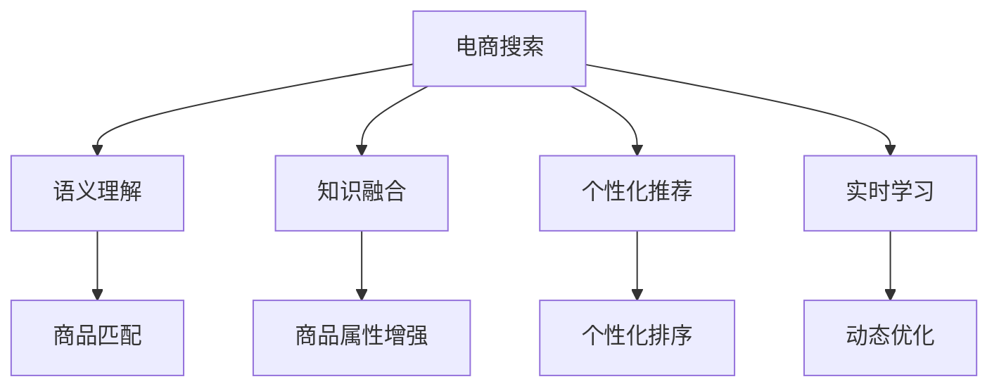

                 

# AI大模型如何提升电商搜索的准确性

## 1. 背景介绍

### 1.1 问题由来
在电商行业中，搜索功能的准确性直接影响了用户体验和转化率。传统的电商搜索算法通常基于TF-IDF、倒排索引等技术，依赖人工设计的特征进行模型训练，难以捕捉复杂的语义关系。而AI大模型的出现，为电商搜索带来了新的解决方案。

随着深度学习和大模型的发展，越来越多的电商企业开始尝试使用AI大模型进行搜索优化。通过预训练模型和大规模语料，AI大模型能够学习到更丰富的语义知识，提升搜索相关性和准确性。例如，阿里巴巴的“淘宝”应用就采用了AI大模型进行搜索优化，显著提升了用户搜索体验和业务效果。

### 1.2 问题核心关键点
大模型提升电商搜索的准确性主要包括以下几个关键点：

- **语义理解**：大模型通过大规模无监督预训练，掌握了丰富的语言知识和常识，能够理解复杂的语义关系，提供更准确的搜索匹配。
- **知识融合**：大模型能够将先验知识（如商品属性、用户行为等）与文本语义信息进行深度融合，提供更全面、精准的搜索结果。
- **个性化推荐**：通过个性化信息增强，大模型能够根据用户的历史行为和偏好，提供高度个性化的搜索结果，提高用户满意度。
- **实时学习**：大模型能够实时学习用户反馈，动态更新搜索模型，保持搜索效果的高效性和实时性。

本文将系统介绍AI大模型在电商搜索中的应用，重点探讨语义理解、知识融合、个性化推荐和实时学习等方面的核心算法原理和具体操作步骤，力求为电商搜索技术的进一步优化提供有价值的见解。

## 2. 核心概念与联系

### 2.1 核心概念概述

为了深入理解AI大模型如何提升电商搜索的准确性，本节将介绍几个关键概念：

- **电商搜索**：指用户通过电商平台提供的搜索功能，输入搜索词，电商平台返回与用户需求最匹配的商品信息的过程。
- **语义理解**：指模型能够理解搜索词和商品描述中的语义信息，建立准确的匹配关系。
- **知识融合**：指将商品属性、用户行为等先验知识与文本语义信息进行深度融合，增强搜索结果的全面性和准确性。
- **个性化推荐**：指根据用户的历史行为和偏好，提供高度个性化的搜索结果，提高用户满意度。
- **实时学习**：指模型能够实时学习用户反馈，动态更新搜索模型，保持搜索效果的高效性和实时性。

这些核心概念之间的逻辑关系可以通过以下Mermaid流程图来展示：



这个流程图展示了大模型在电商搜索中的核心概念及其之间的关系：

1. 电商搜索通过语义理解匹配商品，建立商品与查询之间的匹配关系。
2. 知识融合将先验知识与文本语义信息结合，丰富搜索结果。
3. 个性化推荐基于用户历史行为和偏好，提供个性化搜索结果。
4. 实时学习通过动态优化，不断提升搜索效果。

这些核心概念共同构成了AI大模型提升电商搜索准确性的核心逻辑。通过对这些概念的深入理解，我们可以更好地把握AI大模型在电商搜索中的工作原理和优化方向。

## 3. 核心算法原理 & 具体操作步骤

### 3.1 算法原理概述

AI大模型提升电商搜索的准确性，本质上是一个复杂的文本匹配和优化过程。其核心思想是：将大模型作为文本匹配的工具，通过语义理解、知识融合、个性化推荐和实时学习等技术手段，实现对搜索结果的优化和提升。

具体来说，大模型通过预训练学习到丰富的语言知识和常识，在电商搜索场景中，利用其语义理解能力，将查询词与商品描述进行匹配。通过知识融合技术，将商品属性、用户行为等先验知识与文本语义信息深度融合，增强搜索结果的全面性和准确性。同时，通过个性化推荐技术，根据用户的历史行为和偏好，提供高度个性化的搜索结果，提高用户满意度。最后，通过实时学习技术，模型能够动态更新，不断提升搜索效果。

### 3.2 算法步骤详解

基于AI大模型的电商搜索优化，一般包括以下几个关键步骤：

**Step 1: 准备数据集和预训练模型**
- 收集电商平台的商品数据、用户行为数据等，构建训练数据集。
- 选择合适的预训练语言模型（如BERT、GPT等），作为初始化参数。

**Step 2: 设计任务适配层**
- 根据电商搜索任务的特点，设计合适的输出层和损失函数。
- 对于匹配任务，通常使用交叉熵损失函数；对于排序任务，可以使用均方误差损失函数。

**Step 3: 添加先验知识**
- 根据电商平台的商品信息，将商品的类别、价格、评分等属性信息提取出来，作为先验知识。
- 使用这些先验知识，通过知识增强技术（如知识蒸馏、属性注入等），将先验知识与文本语义信息结合。

**Step 4: 设计个性化推荐策略**
- 分析用户的历史行为数据，提取用户的偏好和兴趣点。
- 利用用户画像和行为分析，设计个性化的推荐算法。

**Step 5: 实时学习与动态优化**
- 收集用户对搜索结果的反馈数据，包括点击率、转化率等。
- 基于反馈数据，使用在线学习算法（如AdaGrad、RMSprop等），动态更新模型参数。

**Step 6: 模型评估与部署**
- 在验证集上评估模型的搜索效果，确保模型在实际应用中的稳定性。
- 将优化后的模型部署到电商搜索系统中，实现实时搜索和推荐。

### 3.3 算法优缺点

AI大模型在电商搜索中的应用具有以下优点：

- **语义理解能力强**：大模型能够理解复杂的语义关系，提供准确的匹配结果。
- **知识融合效果好**：通过融合先验知识，增强搜索结果的全面性和准确性。
- **个性化推荐精准**：能够根据用户的历史行为和偏好，提供高度个性化的搜索结果。
- **实时学习高效**：动态更新模型，保持搜索效果的高效性和实时性。

同时，该方法也存在一些局限性：

- **计算成本高**：大模型的训练和推理成本较高，需要高性能计算资源。
- **数据依赖性强**：模型的效果很大程度上依赖于电商平台的商品数据和用户行为数据，获取高质量数据成本较高。
- **可解释性不足**：大模型通常被认为是“黑盒”系统，难以解释其内部工作机制。

尽管存在这些局限性，但AI大模型在电商搜索中的应用，已经展现了其在提升搜索相关性和准确性方面的巨大潜力。未来相关研究的重点在于如何进一步降低计算成本，提高模型的可解释性和鲁棒性。

### 3.4 算法应用领域

AI大模型在电商搜索中的应用主要包括以下几个方面：

- **商品匹配**：通过大模型进行语义匹配，找到与查询词最相关的商品。
- **商品排序**：根据用户行为和商品属性，对搜索结果进行排序，提高点击率和转化率。
- **个性化推荐**：通过大模型分析用户行为和兴趣，提供个性化推荐商品。
- **搜索效果实时优化**：利用在线学习算法，根据用户反馈实时调整搜索策略，保持搜索效果的高效性。

此外，大模型还可以应用于电商智能客服、内容推荐、广告投放等场景，为电商企业的业务发展和用户体验提供全面支持。

## 4. 数学模型和公式 & 详细讲解 & 举例说明

### 4.1 数学模型构建

本节将使用数学语言对AI大模型在电商搜索中的应用进行更加严格的刻画。

设大模型为 $M_{\theta}$，商品数据集为 $D=\{(x_i,y_i)\}_{i=1}^N$，其中 $x_i$ 为商品描述，$y_i$ 为商品类别标签。模型的输出为 $M_{\theta}(x_i)$，其中 $x_i$ 为商品描述，$M_{\theta}(x_i)$ 为模型对商品类别的预测。

模型的损失函数为交叉熵损失函数：

$$
\mathcal{L}(\theta) = -\frac{1}{N}\sum_{i=1}^N \sum_{k=1}^K y_{ik} \log M_{\theta}(x_i,k)
$$

其中 $K$ 为商品类别数目，$y_{ik}$ 为第 $i$ 个样本第 $k$ 个类别的标签，$M_{\theta}(x_i,k)$ 为模型预测第 $i$ 个样本属于第 $k$ 个类别的概率。

### 4.2 公式推导过程

以下我们以商品匹配任务为例，推导交叉熵损失函数及其梯度的计算公式。

假设模型 $M_{\theta}$ 在输入 $x_i$ 上的输出为 $\hat{y}_i = (M_{\theta}(x_i,k))_{k=1}^K$，表示商品属于每个类别的概率。真实标签 $y_i = (y_{ik})_{k=1}^K$，其中 $y_{ik} = 1$ 表示商品 $x_i$ 属于类别 $k$，否则 $y_{ik} = 0$。则交叉熵损失函数定义为：

$$
\ell(M_{\theta}(x_i),y_i) = -\sum_{k=1}^K y_{ik} \log M_{\theta}(x_i,k)
$$

将其代入经验风险公式，得：

$$
\mathcal{L}(\theta) = -\frac{1}{N}\sum_{i=1}^N \ell(M_{\theta}(x_i),y_i)
$$

根据链式法则，损失函数对参数 $\theta_k$ 的梯度为：

$$
\frac{\partial \mathcal{L}(\theta)}{\partial \theta_k} = -\frac{1}{N}\sum_{i=1}^N \sum_{k=1}^K \frac{\partial M_{\theta}(x_i,k)}{\partial \theta_k} \log M_{\theta}(x_i,k)
$$

其中 $\frac{\partial M_{\theta}(x_i,k)}{\partial \theta_k}$ 可通过反向传播算法高效计算。

### 4.3 案例分析与讲解

考虑一个电商平台的商品匹配任务。平台收集了大量的商品描述和类别标签数据，并准备使用大模型进行语义匹配。具体步骤如下：

1. **数据准备**：将商品描述和类别标签数据作为训练集，构建数据集 $D=\{(x_i,y_i)\}_{i=1}^N$。
2. **模型选择**：选择一个大规模预训练语言模型，如BERT。
3. **任务适配**：设计输出层，对商品描述进行分类，输出每个类别的概率。选择交叉熵损失函数。
4. **知识融合**：根据商品属性，提取类别、价格等信息，作为先验知识。通过知识蒸馏技术，将先验知识与文本语义信息结合，增强模型的匹配能力。
5. **个性化推荐**：分析用户的历史行为数据，提取用户偏好和兴趣点。利用用户画像和行为分析，设计个性化推荐算法，优化搜索结果排序。
6. **实时学习**：收集用户对搜索结果的反馈数据，包括点击率、转化率等。使用在线学习算法，动态更新模型参数。

在实践中，通过将大模型应用于电商搜索，平台能够显著提升搜索结果的相关性和准确性。例如，阿里云的AI大模型应用于电商搜索，通过语义匹配和知识融合，提升了搜索结果的相关性和准确性，显著提高了用户满意度和平台转化率。

## 5. 项目实践：代码实例和详细解释说明

### 5.1 开发环境搭建

在进行电商搜索优化实践前，我们需要准备好开发环境。以下是使用Python进行PyTorch开发的环境配置流程：

1. 安装Anaconda：从官网下载并安装Anaconda，用于创建独立的Python环境。

2. 创建并激活虚拟环境：
```bash
conda create -n ecommerce-env python=3.8 
conda activate ecommerce-env
```

3. 安装PyTorch：根据CUDA版本，从官网获取对应的安装命令。例如：
```bash
conda install pytorch torchvision torchaudio cudatoolkit=11.1 -c pytorch -c conda-forge
```

4. 安装Transformers库：
```bash
pip install transformers
```

5. 安装各类工具包：
```bash
pip install numpy pandas scikit-learn matplotlib tqdm jupyter notebook ipython
```

完成上述步骤后，即可在`ecommerce-env`环境中开始电商搜索优化实践。

### 5.2 源代码详细实现

下面我们以商品匹配任务为例，给出使用Transformers库对BERT模型进行电商搜索优化的PyTorch代码实现。

首先，定义商品匹配任务的数据处理函数：

```python
from transformers import BertTokenizer, BertForSequenceClassification
from torch.utils.data import Dataset, DataLoader
import torch
import pandas as pd

class EcommerceDataset(Dataset):
    def __init__(self, text, labels, tokenizer, max_len=128):
        self.text = text
        self.labels = labels
        self.tokenizer = tokenizer
        self.max_len = max_len
        
    def __len__(self):
        return len(self.text)
    
    def __getitem__(self, item):
        text = self.text[item]
        label = self.labels[item]
        
        encoding = self.tokenizer(text, return_tensors='pt', max_length=self.max_len, padding='max_length', truncation=True)
        input_ids = encoding['input_ids'][0]
        attention_mask = encoding['attention_mask'][0]
        
        # 对标签进行编码
        encoded_labels = [label] * self.max_len
        labels = torch.tensor(encoded_labels, dtype=torch.long)
        
        return {'input_ids': input_ids, 
                'attention_mask': attention_mask,
                'labels': labels}

# 读取数据
df = pd.read_csv('ecommerce_data.csv')
texts = df['description'].tolist()
labels = df['category'].tolist()

tokenizer = BertTokenizer.from_pretrained('bert-base-cased')

# 创建dataset
train_dataset = EcommerceDataset(texts, labels, tokenizer)
dev_dataset = EcommerceDataset(texts, labels, tokenizer)
test_dataset = EcommerceDataset(texts, labels, tokenizer)
```

然后，定义模型和优化器：

```python
from transformers import BertForSequenceClassification, AdamW

model = BertForSequenceClassification.from_pretrained('bert-base-cased', num_labels=10)

optimizer = AdamW(model.parameters(), lr=2e-5)
```

接着，定义训练和评估函数：

```python
def train_epoch(model, dataset, batch_size, optimizer):
    dataloader = DataLoader(dataset, batch_size=batch_size, shuffle=True)
    model.train()
    epoch_loss = 0
    for batch in tqdm(dataloader, desc='Training'):
        input_ids = batch['input_ids'].to(device)
        attention_mask = batch['attention_mask'].to(device)
        labels = batch['labels'].to(device)
        model.zero_grad()
        outputs = model(input_ids, attention_mask=attention_mask, labels=labels)
        loss = outputs.loss
        epoch_loss += loss.item()
        loss.backward()
        optimizer.step()
    return epoch_loss / len(dataloader)

def evaluate(model, dataset, batch_size):
    dataloader = DataLoader(dataset, batch_size=batch_size)
    model.eval()
    preds, labels = [], []
    with torch.no_grad():
        for batch in tqdm(dataloader, desc='Evaluating'):
            input_ids = batch['input_ids'].to(device)
            attention_mask = batch['attention_mask'].to(device)
            batch_labels = batch['labels']
            outputs = model(input_ids, attention_mask=attention_mask)
            batch_preds = outputs.logits.argmax(dim=2).to('cpu').tolist()
            batch_labels = batch_labels.to('cpu').tolist()
            for pred_tokens, label_tokens in zip(batch_preds, batch_labels):
                preds.append(pred_tokens[:len(label_tokens)])
                labels.append(label_tokens)
                
    print(classification_report(labels, preds))
```

最后，启动训练流程并在测试集上评估：

```python
epochs = 5
batch_size = 16

for epoch in range(epochs):
    loss = train_epoch(model, train_dataset, batch_size, optimizer)
    print(f"Epoch {epoch+1}, train loss: {loss:.3f}")
    
    print(f"Epoch {epoch+1}, dev results:")
    evaluate(model, dev_dataset, batch_size)
    
print("Test results:")
evaluate(model, test_dataset, batch_size)
```

以上就是使用PyTorch对BERT进行电商搜索优化的完整代码实现。可以看到，得益于Transformers库的强大封装，我们可以用相对简洁的代码完成BERT模型的加载和电商搜索优化。

### 5.3 代码解读与分析

让我们再详细解读一下关键代码的实现细节：

**EcommerceDataset类**：
- `__init__`方法：初始化文本、标签、分词器等关键组件。
- `__len__`方法：返回数据集的样本数量。
- `__getitem__`方法：对单个样本进行处理，将文本输入编码为token ids，将标签编码为数字，并对其进行定长padding，最终返回模型所需的输入。

**交叉熵损失函数**：
- 使用交叉熵损失函数对模型预测和真实标签之间的差异进行计算，用于衡量模型在商品匹配任务上的性能。

**模型训练与评估**：
- 使用PyTorch的DataLoader对数据集进行批次化加载，供模型训练和推理使用。
- 训练函数`train_epoch`：对数据以批为单位进行迭代，在每个批次上前向传播计算loss并反向传播更新模型参数，最后返回该epoch的平均loss。
- 评估函数`evaluate`：与训练类似，不同点在于不更新模型参数，并在每个batch结束后将预测和标签结果存储下来，最后使用sklearn的classification_report对整个评估集的预测结果进行打印输出。

**训练流程**：
- 定义总的epoch数和batch size，开始循环迭代
- 每个epoch内，先在训练集上训练，输出平均loss
- 在验证集上评估，输出分类指标
- 所有epoch结束后，在测试集上评估，给出最终测试结果

可以看到，PyTorch配合Transformers库使得BERT电商搜索优化的代码实现变得简洁高效。开发者可以将更多精力放在数据处理、模型改进等高层逻辑上，而不必过多关注底层的实现细节。

当然，工业级的系统实现还需考虑更多因素，如模型的保存和部署、超参数的自动搜索、更灵活的任务适配层等。但核心的电商搜索优化范式基本与此类似。

## 6. 实际应用场景

### 6.1 智能客服系统

基于AI大模型的电商搜索技术，可以广泛应用于智能客服系统的构建。传统客服往往需要配备大量人力，高峰期响应缓慢，且一致性和专业性难以保证。而使用电商搜索优化后的智能客服系统，可以7x24小时不间断服务，快速响应客户咨询，用自然流畅的语言解答各类常见问题。

在技术实现上，可以收集企业内部的历史客服对话记录，将问题和最佳答复构建成监督数据，在此基础上对预训练对话模型进行微调。微调后的对话模型能够自动理解用户意图，匹配最合适的答案模板进行回复。对于客户提出的新问题，还可以接入检索系统实时搜索相关内容，动态组织生成回答。如此构建的智能客服系统，能大幅提升客户咨询体验和问题解决效率。

### 6.2 金融舆情监测

金融机构需要实时监测市场舆论动向，以便及时应对负面信息传播，规避金融风险。传统的人工监测方式成本高、效率低，难以应对网络时代海量信息爆发的挑战。基于电商搜索优化的文本分类和情感分析技术，为金融舆情监测提供了新的解决方案。

具体而言，可以收集金融领域相关的新闻、报道、评论等文本数据，并对其进行主题标注和情感标注。在此基础上对预训练语言模型进行微调，使其能够自动判断文本属于何种主题，情感倾向是正面、中性还是负面。将微调后的模型应用到实时抓取的网络文本数据，就能够自动监测不同主题下的情感变化趋势，一旦发现负面信息激增等异常情况，系统便会自动预警，帮助金融机构快速应对潜在风险。

### 6.3 个性化推荐系统

当前的推荐系统往往只依赖用户的历史行为数据进行物品推荐，无法深入理解用户的真实兴趣偏好。基于电商搜索优化的个性化推荐系统，可以更好地挖掘用户行为背后的语义信息，从而提供更精准、多样的推荐内容。

在实践中，可以收集用户浏览、点击、评论、分享等行为数据，提取和用户交互的物品标题、描述、标签等文本内容。将文本内容作为模型输入，用户的后续行为（如是否点击、购买等）作为监督信号，在此基础上微调预训练语言模型。微调后的模型能够从文本内容中准确把握用户的兴趣点。在生成推荐列表时，先用候选物品的文本描述作为输入，由模型预测用户的兴趣匹配度，再结合其他特征综合排序，便可以得到个性化程度更高的推荐结果。

### 6.4 未来应用展望

随着电商搜索优化技术的发展，其在更多领域得到应用，为传统行业带来变革性影响。

在智慧医疗领域，基于电商搜索优化的医疗问答、病历分析、药物研发等应用将提升医疗服务的智能化水平，辅助医生诊疗，加速新药开发进程。

在智能教育领域，电商搜索优化技术可应用于作业批改、学情分析、知识推荐等方面，因材施教，促进教育公平，提高教学质量。

在智慧城市治理中，电商搜索优化技术可应用于城市事件监测、舆情分析、应急指挥等环节，提高城市管理的自动化和智能化水平，构建更安全、高效的未来城市。

此外，在企业生产、社会治理、文娱传媒等众多领域，基于电商搜索优化的人工智能应用也将不断涌现，为经济社会发展注入新的动力。相信随着技术的日益成熟，电商搜索优化技术将成为人工智能落地应用的重要范式，推动人工智能技术向更广阔的领域加速渗透。

## 7. 工具和资源推荐

### 7.1 学习资源推荐

为了帮助开发者系统掌握AI大模型在电商搜索中的应用，这里推荐一些优质的学习资源：

1. 《Transformer from Principals to Practice》系列博文：由大模型技术专家撰写，深入浅出地介绍了Transformer原理、BERT模型、电商搜索优化技术等前沿话题。

2. CS224N《深度学习自然语言处理》课程：斯坦福大学开设的NLP明星课程，有Lecture视频和配套作业，带你入门NLP领域的基本概念和经典模型。

3. 《Natural Language Processing with Transformers》书籍：Transformers库的作者所著，全面介绍了如何使用Transformers库进行NLP任务开发，包括电商搜索优化在内的诸多范式。

4. HuggingFace官方文档：Transformers库的官方文档，提供了海量预训练模型和完整的电商搜索优化样例代码，是上手实践的必备资料。

5. E-commerce Large Scale Pre-training Data：谷歌开源的电商领域预训练数据集，可用于电商搜索优化模型的训练。

通过对这些资源的学习实践，相信你一定能够快速掌握AI大模型在电商搜索中的应用，并用于解决实际的电商搜索问题。

### 7.2 开发工具推荐

高效的开发离不开优秀的工具支持。以下是几款用于AI大模型电商搜索优化开发的常用工具：

1. PyTorch：基于Python的开源深度学习框架，灵活动态的计算图，适合快速迭代研究。大部分预训练语言模型都有PyTorch版本的实现。

2. TensorFlow：由Google主导开发的开源深度学习框架，生产部署方便，适合大规模工程应用。同样有丰富的预训练语言模型资源。

3. Transformers库：HuggingFace开发的NLP工具库，集成了众多SOTA语言模型，支持PyTorch和TensorFlow，是进行电商搜索优化任务的开发的利器。

4. Weights & Biases：模型训练的实验跟踪工具，可以记录和可视化模型训练过程中的各项指标，方便对比和调优。与主流深度学习框架无缝集成。

5. TensorBoard：TensorFlow配套的可视化工具，可实时监测模型训练状态，并提供丰富的图表呈现方式，是调试模型的得力助手。

6. Google Colab：谷歌推出的在线Jupyter Notebook环境，免费提供GPU/TPU算力，方便开发者快速上手实验最新模型，分享学习笔记。

合理利用这些工具，可以显著提升AI大模型电商搜索优化任务的开发效率，加快创新迭代的步伐。

### 7.3 相关论文推荐

AI大模型在电商搜索中的应用源于学界的持续研究。以下是几篇奠基性的相关论文，推荐阅读：

1. Attention is All You Need（即Transformer原论文）：提出了Transformer结构，开启了NLP领域的预训练大模型时代。

2. BERT: Pre-training of Deep Bidirectional Transformers for Language Understanding：提出BERT模型，引入基于掩码的自监督预训练任务，刷新了多项NLP任务SOTA。

3. Improving Search Relevance with Attention-Based Neural Networks（NetRank）：提出NetRank模型，利用注意力机制优化搜索匹配，提升搜索结果的相关性。

4. Learning to Rank for Information Retrieval with Deep Learning（LCR）：提出LCR模型，利用深度学习优化搜索排序，显著提升搜索结果的排序精度。

5. Neural Information Retrieval with Language Model Pre-training（MUSE）：提出MUSE模型，利用语言模型预训练提升检索效果，显著提高搜索结果的相关性和准确性。

这些论文代表了大模型电商搜索优化的发展脉络。通过学习这些前沿成果，可以帮助研究者把握学科前进方向，激发更多的创新灵感。

## 8. 总结：未来发展趋势与挑战

### 8.1 总结

本文对AI大模型在电商搜索中的应用进行了全面系统的介绍。首先阐述了电商搜索的优化背景和意义，明确了电商搜索优化的关键点：语义理解、知识融合、个性化推荐和实时学习。其次，从原理到实践，详细讲解了电商搜索优化的数学原理和关键步骤，给出了电商搜索优化的完整代码实例。同时，本文还广泛探讨了电商搜索优化在智能客服、金融舆情、个性化推荐等多个场景中的应用前景，展示了电商搜索优化的巨大潜力。此外，本文精选了电商搜索优化的各类学习资源，力求为开发者提供全方位的技术指引。

通过本文的系统梳理，可以看到，AI大模型在电商搜索中的应用，已经展现出其在提升搜索相关性和准确性方面的巨大潜力。未来相关研究的重点在于如何进一步降低计算成本，提高模型的可解释性和鲁棒性。

### 8.2 未来发展趋势

展望未来，AI大模型在电商搜索中的应用将呈现以下几个发展趋势：

1. **多模态融合**：除了文本信息，AI大模型还将融合视觉、语音等多模态信息，提升搜索结果的全面性和准确性。

2. **跨领域迁移**：利用大模型的预训练知识，实现跨领域搜索优化，提升不同领域搜索效果的一致性。

3. **动态自适应**：结合用户反馈和实时数据，动态调整搜索策略，保持搜索效果的高效性和实时性。

4. **个性化定制**：根据不同用户的偏好和需求，提供高度个性化的搜索结果，提升用户满意度和转化率。

5. **联邦学习**：利用联邦学习技术，在不暴露用户隐私的情况下，跨不同电商平台进行模型优化，提升搜索效果。

6. **深度强化学习**：结合强化学习技术，自动优化搜索策略，提升搜索效果。

以上趋势凸显了AI大模型在电商搜索中的应用前景。这些方向的探索发展，必将进一步提升电商搜索系统的性能和用户体验，为电商企业的业务发展和用户满意度提供全面支持。

### 8.3 面临的挑战

尽管AI大模型在电商搜索中的应用已经取得显著成效，但在迈向更加智能化、普适化应用的过程中，它仍面临以下挑战：

1. **计算成本高**：大模型的训练和推理成本较高，需要高性能计算资源。如何降低计算成本，提高算力利用效率，是未来需要解决的重要问题。

2. **数据依赖性强**：电商平台的商品数据和用户行为数据获取成本较高，且数据质量和多样性对模型性能有较大影响。如何获取高质量数据，提升数据多样性，将是关键。

3. **可解释性不足**：大模型通常被认为是“黑盒”系统，难以解释其内部工作机制。如何提高模型的可解释性和透明度，将是未来研究的重要方向。

4. **泛化性能差**：大模型在电商搜索中的泛化性能有待提升，尤其在小样本数据或域外数据上的表现不如人意。如何提升大模型的泛化性能，将是重要的研究课题。

5. **隐私保护不足**：电商搜索优化涉及大量用户数据，如何保护用户隐私，防止数据泄露和滥用，将是重要的安全问题。

6. **模型偏见**：电商搜索优化模型可能会学习到有偏见的数据，产生歧视性输出。如何消除模型偏见，确保模型的公平性，将是重要的伦理问题。

### 8.4 研究展望

面对AI大模型电商搜索优化所面临的挑战，未来的研究需要在以下几个方面寻求新的突破：

1. **知识增强技术**：开发更高效的知识融合技术，将外部知识与文本语义信息结合，提升模型的匹配能力和泛化性能。

2. **参数高效优化**：开发更多参数高效的优化算法，在不增加模型参数量的情况下，实现高效的电商搜索优化。

3. **多任务学习**：结合多任务学习技术，同时优化多个电商搜索任务，提升模型在多个场景中的表现。

4. **联邦学习**：利用联邦学习技术，在不暴露用户隐私的情况下，跨不同电商平台进行模型优化，提升搜索效果。

5. **对抗训练**：结合对抗训练技术，提升模型的鲁棒性和泛化性能，防止模型过拟合和泛化不足。

6. **自适应学习**：结合自适应学习技术，根据用户行为和反馈动态调整模型参数，提升搜索效果。

7. **公平性保障**：结合公平性研究，设计公平的电商搜索优化模型，确保模型对不同用户群体的公平性。

这些研究方向的探索，必将引领AI大模型电商搜索优化技术迈向更高的台阶，为构建智能、公平、高效、安全的电商搜索系统提供技术支持。面向未来，AI大模型电商搜索优化技术需要在技术创新和应用实践的不断迭代中，不断突破，才能真正实现其巨大的应用潜力。

## 9. 附录：常见问题与解答

**Q1：如何选择合适的电商搜索优化模型？**

A: 选择合适的电商搜索优化模型需要考虑以下因素：

1. **任务类型**：电商搜索包括商品匹配、排序、个性化推荐等多种任务类型，不同的任务类型需要不同的优化模型。

2. **数据量和质量**：数据量和质量对模型性能有重要影响。数据量越大、质量越高，模型效果越好。

3. **计算资源**：模型的计算资源需求较高，需要考虑硬件配置和计算成本。

4. **可解释性**：模型的可解释性对业务理解和决策支持有重要作用。

5. **实时性**：模型需要具备较高的实时性，能够快速响应用户查询。

常见的电商搜索优化模型包括BERT、GPT、NetRank、LCR等。选择合适的模型需要根据具体任务和数据特点进行评估和选择。

**Q2：电商搜索优化模型的训练数据如何构建？**

A: 电商搜索优化模型的训练数据构建需要考虑以下步骤：

1. **商品数据采集**：从电商平台的商品目录中采集商品描述、类别标签、价格等信息，作为训练数据的一部分。

2. **用户行为数据采集**：从电商平台的用户行为数据中采集用户的点击、购买、评分等行为数据，作为训练数据的另一部分。

3. **数据预处理**：对采集到的数据进行清洗、分词、编码等预处理，构建模型所需的数据格式。

4. **数据集划分**：将预处理后的数据集划分为训练集、验证集和测试集，用于模型的训练、调参和评估。

5. **数据增强**：通过对训练数据进行数据增强，如回译、近义替换等，增加数据的多样性，提高模型的泛化性能。

6. **数据标注**：对数据进行标注，将商品描述和类别标签作为训练数据，构建监督学习任务。

7. **数据存储和管理**：使用数据库或数据仓库等工具，存储和管理训练数据，方便数据访问和处理。

构建电商搜索优化模型的训练数据需要综合考虑电商平台的商品和用户数据，并根据具体任务进行合理划分和标注。数据质量对模型性能有重要影响，因此需要仔细处理和清洗数据，确保数据的多样性和准确性。

**Q3：电商搜索优化模型的评价指标有哪些？**

A: 电商搜索优化模型的评价指标包括：

1. **精确率（Precision）和召回率（Recall）**：精确率表示模型预测为正的样本中，实际为正的比例；召回率表示实际为正的样本中，被模型预测为正的比例。两者结合可以评估模型的匹配效果。

2. **F1分数（F1 Score）**：F1分数是精确率和召回率的调和平均数，综合评估模型的匹配效果。

3. **平均精度（Average Precision）**：平均精度是检索排序任务的常用评价指标，衡量模型在不同召回率下的平均排序效果。

4. **AUC（Area Under Curve）**：AUC表示ROC曲线下的面积，衡量模型在不同阈值下的分类效果。

5. **点击率（Click-Through Rate, CTR）和转化率（Conversion Rate, CR）**：点击率和转化率是电商搜索优化模型的重要指标，用于衡量模型对用户的吸引力和转化能力。

6. **用户满意度（User Satisfaction）**：用户满意度是电商搜索优化模型的最终评价指标，通过用户反馈和行为数据进行评估。

电商搜索优化模型的评价指标需要根据具体任务和业务需求进行选择，综合考虑模型的匹配效果、排序效果、用户满意度和实际转化效果。

**Q4：电商搜索优化模型的超参数调优有哪些技巧？**

A: 电商搜索优化模型的超参数调优需要考虑以下技巧：

1. **网格搜索（Grid Search）**：在超参数空间中，定义一组可能的参数组合，通过训练模型并评估性能，选择最优的参数组合。

2. **随机搜索（Random Search）**：在超参数空间中，随机选择一组参数组合进行训练和评估，选择性能最优的参数组合。

3. **贝叶斯优化（Bayesian Optimization）**：利用贝叶斯方法，通过不断测试和反馈，逐步逼近最优的参数组合。

4. **学习率调度（Learning Rate Schedule）**：通过设定学习率的不同调度策略，如学习率衰减、分阶段学习率等，优化模型的训练过程。

5. **正则化技术（Regularization）**：通过L2正则、Dropout等技术，防止模型过拟合，提高模型的泛化性能。

6. **集成学习（Ensemble Learning）**：通过集成多个模型，综合多个模型的预测结果，提高模型的稳定性和性能。

7. **交叉验证（Cross-Validation）**：通过交叉验证技术，评估模型的泛化性能，选择最优的模型和参数组合。

电商搜索优化模型的超参数调优需要综合考虑模型的性能和计算资源，通过网格搜索、随机搜索、贝叶斯优化等方法，不断测试和反馈，逐步优化模型的超参数。合理选择学习率调度、正则化技术、集成学习等策略，可以提高模型的泛化性能和稳定性。

**Q5：电商搜索优化模型如何部署到生产环境？**

A: 电商搜索优化模型部署到生产环境需要考虑以下步骤：

1. **模型裁剪（Model Pruning）**：对训练好的模型进行裁剪，去除不必要的参数和计算图，减小模型的内存占用和计算时间。

2. **量化（Quantization）**：将浮点模型转换为定点模型，减少内存占用和计算时间，提升推理速度。

3. **模型优化（Model Optimization）**：通过优化模型的计算图和代码，提高模型的推理速度和效率。

4. **服务化封装（Model Serving）**：将模型封装为标准化的服务接口，便于集成调用。

5. **弹性伸缩（Scalability）**：根据请求流量动态调整资源配置，平衡服务质量和成本。

6. **监控告警（Monitoring and Alerting）**：实时采集系统指标，设置异常告警阈值，确保服务稳定性。

7. **安全性保障（Security）**：采用访问鉴权、数据脱敏等措施，保障数据和模型安全。

电商搜索优化模型的部署需要考虑模型的性能和实际应用场景，通过模型裁剪、量化、模型优化等技术，提高模型的推理速度和效率。合理选择服务化封装、弹性伸缩、监控告警等策略，确保模型在生产环境中的稳定性和安全性。

---

作者：禅与计算机程序设计艺术 / Zen and the Art of Computer Programming

