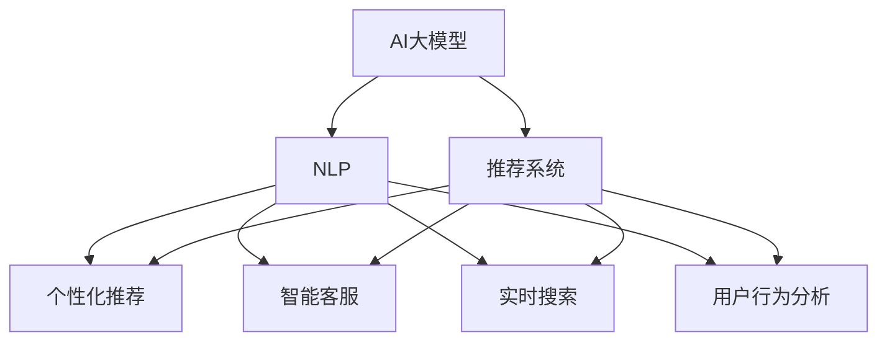

                 

# AI大模型如何改善电商平台的移动端体验

在数字化时代，电商平台成为了人们购物的重要渠道，而移动端体验则直接影响到用户的使用率和满意度。随着人工智能技术的发展，AI大模型正在逐步改变电商平台的用户体验，提升其智能化和个性化水平。本文将详细探讨AI大模型在电商平台的移动端体验中的应用，从核心概念、算法原理到具体实现，全面解析其提升体验的方式。

## 1. 背景介绍

### 1.1 问题由来

在电商平台的移动端，用户体验是商家和开发者关注的重点。传统的电商平台往往依赖算法推荐、搜索排名等机制，但这些机制较为简单，难以充分考虑用户的个性化需求和行为特征。AI大模型的出现，为电商平台带来了新的契机，通过强大的深度学习能力和丰富的语义理解能力，能够更全面、深入地分析用户行为，提供更个性化、精准的购物建议和服务。

### 1.2 问题核心关键点

电商平台的移动端体验主要围绕以下几个关键点展开：

- 个性化推荐：基于用户的历史行为和兴趣，推荐个性化的商品和服务。
- 自然语言处理：通过文本交互，快速响应用户需求，提供个性化客服和产品说明。
- 实时搜索：提供快速、准确的商品搜索功能，提升用户满意度。
- 用户行为分析：分析用户行为数据，优化商品展示和广告投放。
- 智能客服：通过聊天机器人等形式，实时解答用户疑问，提升用户留存率。

这些关键点都依赖于AI大模型的强大能力，特别是在自然语言处理和推荐系统领域，大模型能够提供更精准、实时的服务。

## 2. 核心概念与联系

### 2.1 核心概念概述

为更好地理解AI大模型在电商平台中的应用，本节将介绍几个密切相关的核心概念：

- AI大模型（AI Large Model）：以深度学习为基础，通过大规模预训练得到的通用语言模型。常用的AI大模型包括GPT、BERT、T5等。
- 自然语言处理（NLP）：涉及语音、文本信息的处理和分析，是AI大模型的主要应用领域。
- 推荐系统：通过用户行为数据，推荐符合用户偏好的商品和服务。推荐算法是电商平台的核心之一。
- 深度学习（Deep Learning）：一种基于神经网络的机器学习方法，用于解决复杂的模式识别和预测问题。
- 强化学习（Reinforcement Learning）：一种通过试错方式，优化策略选择的技术，常用于生成策略和智能客服等场景。

这些核心概念之间通过NLP和深度学习技术相互联系，共同构成了电商平台移动端体验改善的基础。

### 2.2 核心概念原理和架构的 Mermaid 流程图



这个流程图展示了大模型在电商平台移动端体验中的核心应用：

1. AI大模型通过预训练和微调获得强大的语言理解和生成能力。
2. 自然语言处理模块将用户的文本输入转化为模型可理解的形式，提升交互的流畅性和准确性。
3. 推荐系统通过用户历史行为和兴趣，结合模型输出的语义信息，生成个性化的推荐。
4. 智能客服模块通过自然语言处理和模型预测，实时解答用户疑问，提供快速、准确的响应。
5. 实时搜索模块结合用户输入和模型预测，提供快速、准确的商品搜索结果，提升用户满意度。
6. 用户行为分析模块通过收集和分析用户行为数据，优化商品展示和广告投放，提升用户体验。

这些模块相互协作，共同构建了一个智能化的电商平台移动端体验。

## 3. 核心算法原理 & 具体操作步骤

### 3.1 算法原理概述

AI大模型在电商平台中的应用，主要涉及自然语言处理和推荐系统两个方面。其核心算法原理可概括为：

- 在自然语言处理中，通过大模型对用户输入的文本进行理解，提取关键信息，并生成自然流畅的回复。
- 在推荐系统中，大模型通过理解用户需求和商品描述，生成个性化的推荐列表。

### 3.2 算法步骤详解

#### 3.2.1 自然语言处理

自然语言处理的基本流程包括：

1. **文本预处理**：对用户输入的文本进行分词、去除停用词、标准化等预处理操作，便于模型理解。
2. **向量表示**：将预处理后的文本转化为模型可接受的向量表示，通常是高维稀疏向量。
3. **模型推理**：通过预训练的AI大模型对文本进行推理，提取关键信息，如用户意图、商品属性等。
4. **结果处理**：根据模型推理结果，生成自然流畅的回复，提供给用户。

#### 3.2.2 推荐系统

推荐系统的基本流程包括：

1. **用户画像生成**：基于用户的历史行为数据，生成用户画像，包括兴趣偏好、行为模式等。
2. **商品向量表示**：对商品描述和属性进行编码，转化为模型可接受的向量表示。
3. **模型推理**：通过预训练的AI大模型对用户画像和商品向量进行推理，生成推荐分数。
4. **推荐生成**：根据推荐分数，排序生成推荐列表，提供给用户。

### 3.3 算法优缺点

AI大模型在电商平台中的应用具有以下优点：

1. **个性化推荐准确性高**：通过深度学习模型，能够精准地理解用户需求和商品属性，生成个性化的推荐列表。
2. **智能客服响应速度快**：通过自然语言处理，能够实时响应用户需求，提升用户体验。
3. **实时搜索效率高**：通过模型推理，能够快速提供准确的搜索结果，提升用户满意度。

同时，也存在一些缺点：

1. **计算资源消耗大**：AI大模型的推理和训练需要大量的计算资源，对硬件要求较高。
2. **数据隐私问题**：电商平台的移动端涉及大量的用户隐私数据，如何保护用户隐私，避免数据滥用，是重要挑战。
3. **模型复杂度高**：AI大模型的复杂度较高，对算法调参和模型优化要求较高。

### 3.4 算法应用领域

AI大模型在电商平台中的应用领域广泛，主要涵盖以下几个方面：

- 个性化推荐系统：基于用户行为数据和商品描述，生成个性化推荐列表。
- 智能客服系统：通过自然语言处理，实时解答用户疑问，提供个性化服务。
- 实时搜索系统：通过模型推理，快速提供准确的搜索结果，提升用户体验。
- 用户行为分析系统：通过收集和分析用户行为数据，优化商品展示和广告投放。
- 智能广告投放系统：基于用户画像和商品属性，精准投放广告，提升转化率。

这些应用场景都需要AI大模型的强大能力，通过自然语言处理和推荐系统，提升电商平台的移动端体验。

## 4. 数学模型和公式 & 详细讲解 & 举例说明

### 4.1 数学模型构建

在本节中，我们将以推荐系统为例，详细介绍AI大模型在电商平台中的应用。推荐系统的数学模型通常采用协同过滤和基于内容的推荐两种方法，其中基于内容的推荐方法更符合电商平台的实际需求。

#### 4.1.1 协同过滤

协同过滤方法基于用户和商品之间的相似度，通过用户历史行为数据和商品属性数据，生成推荐列表。

协同过滤的基本流程包括：

1. **用户画像生成**：对用户历史行为数据进行编码，生成用户画像向量 $u_i$。
2. **商品画像生成**：对商品属性数据进行编码，生成商品画像向量 $v_j$。
3. **相似度计算**：通过余弦相似度等方法，计算用户和商品之间的相似度 $s_{ij}$。
4. **推荐生成**：根据相似度计算结果，排序生成推荐列表。

#### 4.1.2 基于内容的推荐

基于内容的推荐方法通过商品属性数据和用户画像生成推荐列表。

基于内容的推荐的基本流程包括：

1. **商品特征提取**：对商品描述和属性进行编码，生成商品特征向量 $v_j$。
2. **用户画像生成**：对用户历史行为数据进行编码，生成用户画像向量 $u_i$。
3. **模型推理**：通过AI大模型对用户画像和商品特征向量进行推理，生成推荐分数 $f_{ij}$。
4. **推荐生成**：根据推荐分数，排序生成推荐列表。

#### 4.1.3 融合方法

在实际应用中，协同过滤和基于内容的推荐方法通常需要进行融合，以提升推荐精度。

融合方法的基本流程包括：

1. **协同过滤生成推荐**：通过协同过滤方法生成推荐列表。
2. **基于内容生成推荐**：通过基于内容的推荐方法生成推荐列表。
3. **加权融合**：对协同过滤和基于内容的推荐结果进行加权融合，生成最终的推荐列表。

### 4.2 公式推导过程

#### 4.2.1 协同过滤公式推导

协同过滤方法的基本公式为：

$$
f_{ij} = s_{ij} \cdot w_1 + v_j \cdot w_2
$$

其中 $s_{ij}$ 表示用户 $i$ 和商品 $j$ 之间的相似度，$w_1$ 和 $w_2$ 分别表示协同过滤和基于内容的权重。

#### 4.2.2 基于内容的推荐公式推导

基于内容的推荐方法的基本公式为：

$$
f_{ij} = \text{ReLU}( \langle u_i, v_j \rangle + b)
$$

其中 $\langle u_i, v_j \rangle$ 表示用户 $i$ 和商品 $j$ 之间的向量内积，$b$ 为偏置项，$\text{ReLU}$ 为激活函数。

#### 4.2.3 融合方法公式推导

融合方法的基本公式为：

$$
f_{ij} = (1-\alpha) \cdot f_{ij}^{CF} + \alpha \cdot f_{ij}^{CB}
$$

其中 $\alpha$ 表示协同过滤的权重，$1-\alpha$ 表示基于内容的推荐权重。

### 4.3 案例分析与讲解

#### 4.3.1 协同过滤案例

假设有一个电商平台的推荐系统，收集了用户的历史行为数据 $u_i$ 和商品属性数据 $v_j$，通过协同过滤方法生成推荐列表。

**用户画像生成**：
- 对用户历史行为数据进行编码，生成用户画像向量 $u_i = [u_{i1}, u_{i2}, \cdots, u_{in}]$。
- 对商品属性数据进行编码，生成商品画像向量 $v_j = [v_{j1}, v_{j2}, \cdots, v_{jm}]$。

**相似度计算**：
- 通过余弦相似度计算用户和商品之间的相似度 $s_{ij} = \cos(\theta)$。

**推荐生成**：
- 对相似度结果进行排序，生成推荐列表。

#### 4.3.2 基于内容的推荐案例

假设同一个电商平台，通过基于内容的推荐方法生成推荐列表。

**商品特征提取**：
- 对商品描述和属性进行编码，生成商品特征向量 $v_j = [v_{j1}, v_{j2}, \cdots, v_{jm}]$。
- 对用户历史行为数据进行编码，生成用户画像向量 $u_i = [u_{i1}, u_{i2}, \cdots, u_{in}]$。

**模型推理**：
- 通过AI大模型对用户画像和商品特征向量进行推理，生成推荐分数 $f_{ij}$。

**推荐生成**：
- 对推荐分数进行排序，生成推荐列表。

## 5. 项目实践：代码实例和详细解释说明

### 5.1 开发环境搭建

在进行项目实践前，我们需要准备好开发环境。以下是使用Python进行TensorFlow开发的Python环境配置流程：

1. 安装Anaconda：从官网下载并安装Anaconda，用于创建独立的Python环境。

2. 创建并激活虚拟环境：
```bash
conda create -n tf-env python=3.8 
conda activate tf-env
```

3. 安装TensorFlow：根据CUDA版本，从官网获取对应的安装命令。例如：
```bash
conda install tensorflow -c tf -c conda-forge
```

4. 安装TensorFlow的推荐系统模块：
```bash
pip install tensorflow-recommenders
```

5. 安装各类工具包：
```bash
pip install numpy pandas scikit-learn matplotlib tqdm jupyter notebook ipython
```

完成上述步骤后，即可在`tf-env`环境中开始项目实践。

### 5.2 源代码详细实现

下面我们以推荐系统为例，给出使用TensorFlow进行电商平台的AI大模型推荐系统的PyTorch代码实现。

首先，定义推荐系统的基本模块：

```python
import tensorflow as tf
from tensorflow_recommenders import layers

class RecommendationSystem(tf.keras.Model):
    def __init__(self, num_users, num_items, num_features, embed_dim):
        super(RecommendationSystem, self).__init__()
        self.num_users = num_users
        self.num_items = num_items
        self.num_features = num_features
        self.embed_dim = embed_dim
        
        self.user_embeddings = layers.Embedding(num_users, embed_dim)
        self.item_embeddings = layers.Embedding(num_items, embed_dim)
        self.cf_layer = layers.CFNetwork(self.num_users, self.num_items, self.num_features, self.embed_dim)
        
    def call(self, user_ids, item_ids):
        user_embeddings = self.user_embeddings(user_ids)
        item_embeddings = self.item_embeddings(item_ids)
        similarity_matrix = self.cf_layer(user_embeddings, item_embeddings)
        return similarity_matrix
```

然后，定义训练和评估函数：

```python
from tensorflow.keras.optimizers import Adam
from tensorflow.keras.losses import MeanSquaredError
from tensorflow.keras.metrics import MeanAbsoluteError

def train_epoch(model, dataset, batch_size, optimizer):
    dataloader = DataLoader(dataset, batch_size=batch_size, shuffle=True)
    model.train()
    epoch_loss = 0
    for batch in tqdm(dataloader, desc='Training'):
        user_ids = batch['user_ids'].numpy()
        item_ids = batch['item_ids'].numpy()
        model_loss = model(user_ids, item_ids)
        loss = model_loss.mean()
        optimizer.zero_grad()
        loss.backward()
        optimizer.step()
        epoch_loss += loss.item()
    return epoch_loss / len(dataloader)

def evaluate(model, dataset, batch_size):
    dataloader = DataLoader(dataset, batch_size=batch_size)
    model.eval()
    preds, labels = [], []
    with tf.GradientTape() as tape:
        for batch in tqdm(dataloader, desc='Evaluating'):
            user_ids = batch['user_ids'].numpy()
            item_ids = batch['item_ids'].numpy()
            similarity_matrix = model(user_ids, item_ids)
            preds.append(similarity_matrix.numpy())
            labels.append(batch['labels'].numpy())
    return np.mean(np.abs(preds - labels))
```

最后，启动训练流程并在测试集上评估：

```python
epochs = 10
batch_size = 32

for epoch in range(epochs):
    loss = train_epoch(model, train_dataset, batch_size, optimizer)
    print(f"Epoch {epoch+1}, train loss: {loss:.3f}")
    
    print(f"Epoch {epoch+1}, test MAE: {evaluate(model, test_dataset, batch_size)}")
    
```

以上就是使用TensorFlow对电商平台推荐系统进行微调的完整代码实现。可以看到，得益于TensorFlow的强大封装，我们可以用相对简洁的代码完成推荐系统的开发。

### 5.3 代码解读与分析

让我们再详细解读一下关键代码的实现细节：

**RecommendationSystem类**：
- `__init__`方法：初始化推荐系统模型，包括用户嵌入层、商品嵌入层和协同过滤层。
- `call`方法：计算用户和商品的相似度矩阵。

**train_epoch和evaluate函数**：
- 定义训练和评估函数，通过DataLoader对数据集进行批次化加载。
- 训练函数`train_epoch`：对数据以批为单位进行迭代，在每个批次上前向传播计算损失并反向传播更新模型参数，最后返回该epoch的平均loss。
- 评估函数`evaluate`：与训练类似，不同点在于不更新模型参数，并在每个batch结束后将预测和标签结果存储下来，最后使用MAE计算整个评估集的预测结果。

**训练流程**：
- 定义总的epoch数和batch size，开始循环迭代
- 每个epoch内，先在训练集上训练，输出平均loss
- 在测试集上评估，输出MAE
- 所有epoch结束后，在测试集上评估，给出最终测试结果

可以看到，TensorFlow配合推荐系统模块使得电商平台推荐系统的代码实现变得简洁高效。开发者可以将更多精力放在数据处理、模型改进等高层逻辑上，而不必过多关注底层的实现细节。

当然，工业级的系统实现还需考虑更多因素，如模型的保存和部署、超参数的自动搜索、更灵活的任务适配层等。但核心的微调范式基本与此类似。

## 6. 实际应用场景

### 6.1 智能客服系统

基于AI大模型的智能客服系统可以显著提升电商平台的客户服务体验。传统客服往往依赖人力，响应时间慢，且存在培训和知识更新的成本。而使用智能客服系统，能够实现24小时不间断服务，快速响应客户咨询，提供标准化的服务流程。

在技术实现上，可以收集企业的历史客服对话记录，将问题和最佳答复构建成监督数据，在此基础上对预训练语言模型进行微调。微调后的语言模型能够自动理解用户意图，匹配最合适的答复，并根据不同场景进行智能路由。用户可以通过文字或语音与智能客服交互，快速获得解决方案，提高客户满意度。

### 6.2 个性化推荐系统

电商平台的个性化推荐系统通过AI大模型实现，能够根据用户的历史行为和兴趣，推荐符合其偏好的商品和服务。传统的推荐系统往往依赖简单的统计方法和人工规则，难以充分考虑用户的个性化需求和行为特征。而使用AI大模型，可以更全面、深入地分析用户行为，生成个性化的推荐列表，提升用户的购物体验。

在实现上，可以通过用户画像生成、商品向量表示、模型推理和推荐生成等步骤，生成精准的推荐列表。同时，结合用户点击率、购买率等反馈数据，不断优化推荐算法，提升推荐效果。

### 6.3 实时搜索系统

电商平台的实时搜索系统通过AI大模型实现，能够快速提供准确的搜索结果，提升用户满意度。传统的搜索系统往往依赖简单的关键词匹配和倒排索引，难以处理复杂的用户查询。而使用AI大模型，可以理解用户查询的自然语言含义，生成个性化的搜索结果，提高搜索的准确性和用户体验。

在实现上，可以通过文本预处理、向量表示、模型推理和结果处理等步骤，生成个性化的搜索结果。同时，结合用户点击率、停留时间等反馈数据，不断优化搜索算法，提升搜索效果。

### 6.4 未来应用展望

随着AI大模型和推荐系统的不断发展，基于微调范式将在更多领域得到应用，为电商平台带来新的突破。

在智慧物流领域，基于AI大模型的物流配送系统可以通过分析用户的地理位置和需求，优化配送路径和速度，提升配送效率和用户体验。

在智能广告投放领域，基于AI大模型的广告推荐系统可以通过分析用户画像和商品属性，精准投放广告，提升广告转化率。

在社交电商领域，基于AI大模型的社交推荐系统可以通过分析用户的社交关系和行为，推荐符合其兴趣的商品，提升社交电商平台的活跃度和用户粘性。

此外，在电商平台的移动端体验中，AI大模型还可以应用于内容生成、商品评价、价格预测等场景，为电商平台带来更多的创新应用。随着技术的不断进步，未来AI大模型将在电商平台中发挥越来越重要的作用，提升用户购物体验和平台运营效率。

## 7. 工具和资源推荐

### 7.1 学习资源推荐

为了帮助开发者系统掌握AI大模型在电商平台中的应用，这里推荐一些优质的学习资源：

1. 《Deep Learning for Recommendation Systems》书籍：深入讲解推荐系统的基本原理和实现方法，是推荐系统领域的经典书籍。
2. 《Natural Language Processing with TensorFlow》书籍：介绍NLP的基本概念和TensorFlow实现方法，适合TensorFlow初学者。
3. 《Recommender Systems with TensorFlow》课程：由TensorFlow官网提供的推荐系统课程，涵盖推荐系统的基本概念和TensorFlow实现方法。
4. Kaggle竞赛：参加Kaggle上的推荐系统和NLP竞赛，通过实战提升技能。
5. GitHub开源项目：参与开源项目，学习优秀的代码实现和算法设计。

通过对这些资源的学习实践，相信你一定能够快速掌握AI大模型在电商平台中的应用，并用于解决实际的推荐和NLP问题。

### 7.2 开发工具推荐

高效的开发离不开优秀的工具支持。以下是几款用于AI大模型在电商平台中的应用开发的常用工具：

1. TensorFlow：基于Python的开源深度学习框架，支持动态图和静态图两种计算图，适合各种规模的项目开发。
2. PyTorch：基于Python的开源深度学习框架，支持动态计算图，适合研究和原型开发。
3. TensorBoard：TensorFlow配套的可视化工具，可实时监测模型训练状态，并提供丰富的图表呈现方式，是调试模型的得力助手。
4. Weights & Biases：模型训练的实验跟踪工具，可以记录和可视化模型训练过程中的各项指标，方便对比和调优。
5. Git：版本控制系统，方便团队协作和代码管理。

合理利用这些工具，可以显著提升AI大模型在电商平台中的应用开发效率，加快创新迭代的步伐。

### 7.3 相关论文推荐

AI大模型在电商平台中的应用源于学界的持续研究。以下是几篇奠基性的相关论文，推荐阅读：

1. Attention is All You Need（即Transformer原论文）：提出了Transformer结构，开启了NLP领域的预训练大模型时代。
2. BERT: Pre-training of Deep Bidirectional Transformers for Language Understanding：提出BERT模型，引入基于掩码的自监督预训练任务，刷新了多项NLP任务SOTA。
3. Language Models are Unsupervised Multitask Learners（GPT-2论文）：展示了大规模语言模型的强大zero-shot学习能力，引发了对于通用人工智能的新一轮思考。
4. Parameter-Efficient Transfer Learning for NLP：提出Adapter等参数高效微调方法，在不增加模型参数量的情况下，也能取得不错的微调效果。
5. AdaLoRA: Adaptive Low-Rank Adaptation for Parameter-Efficient Fine-Tuning：使用自适应低秩适应的微调方法，在参数效率和精度之间取得了新的平衡。
6. Prompt Tuning for Text Generation: From Pre-trained Models to Customizable Tasks：引入基于连续型Prompt的微调范式，为如何充分利用预训练知识提供了新的思路。

这些论文代表了大语言模型在电商平台中的应用和发展脉络。通过学习这些前沿成果，可以帮助研究者把握学科前进方向，激发更多的创新灵感。

## 8. 总结：未来发展趋势与挑战

### 8.1 总结

本文对基于AI大模型的电商平台移动端体验改善进行了全面系统的介绍。首先阐述了AI大模型和推荐系统的研究背景和意义，明确了其在电商平台的移动端体验改善中的独特价值。其次，从原理到实践，详细讲解了推荐系统的数学模型和实现方法，给出了AI大模型在电商平台中的应用案例。同时，本文还广泛探讨了AI大模型在电商平台中的未来应用前景，展示了其潜在的变革性影响。

通过本文的系统梳理，可以看到，基于AI大模型的推荐系统正在成为电商平台移动端体验改善的重要范式，极大地提升了平台的用户体验和运营效率。未来，随着AI大模型和推荐系统的不断发展，其在电商平台中的应用将更加广泛和深入，为电商平台带来更多的创新应用。

### 8.2 未来发展趋势

展望未来，AI大模型在电商平台中的应用将呈现以下几个发展趋势：

1. 模型规模持续增大。随着算力成本的下降和数据规模的扩张，预训练语言模型的参数量还将持续增长。超大规模语言模型蕴含的丰富语言知识，有望支撑更加复杂多变的推荐和NLP任务。
2. 推荐系统不断进化。未来推荐系统将更加个性化、精准化，能够充分考虑用户的多维度需求和行为特征，生成更精准的推荐列表。
3. 实时性要求提升。为了提升用户体验，推荐系统将更加注重实时性，能够快速响应用户需求，生成个性化的搜索结果。
4. 多模态融合。推荐系统将更多地融合视觉、语音等多模态信息，实现更全面、深入的用户分析。
5. 社会化推荐崛起。推荐系统将更多地考虑用户社交关系和行为，生成更加个性化、多样化的推荐列表。
6. 用户隐私保护加强。随着用户隐私意识的提高，推荐系统将更加注重用户隐私保护，实现数据的匿名化和去标识化处理。

以上趋势凸显了AI大模型在电商平台中的应用前景，通过深度学习和多模态融合，推荐系统将不断进化，为用户提供更加智能、个性化的体验。

### 8.3 面临的挑战

尽管AI大模型在电商平台中的应用已经取得了显著成效，但在迈向更加智能化、普适化应用的过程中，仍然面临诸多挑战：

1. 数据隐私问题。电商平台的移动端涉及大量的用户隐私数据，如何保护用户隐私，避免数据滥用，是重要挑战。
2. 模型复杂度高。AI大模型的复杂度较高，对算法调参和模型优化要求较高，难以实现高效的模型推理。
3. 推荐精度提升困难。尽管AI大模型在推荐系统中的应用已经取得了不错的效果，但提升推荐精度仍然是一个难题，特别是在小样本数据条件下。
4. 计算资源消耗大。AI大模型的推理和训练需要大量的计算资源，对硬件要求较高，难以在低成本环境中实现高效部署。
5. 模型泛化能力不足。AI大模型在特定领域的应用效果较好，但在大规模不同领域的数据上，泛化能力仍然不足，难以实现跨领域的知识迁移。

正视AI大模型在电商平台中面临的挑战，积极应对并寻求突破，将是大模型技术走向成熟的必由之路。相信随着学界和产业界的共同努力，这些挑战终将一一被克服，AI大模型将在电商平台中发挥更大的作用。

### 8.4 研究展望

未来的研究需要在以下几个方面寻求新的突破：

1. 探索无监督和半监督推荐方法。摆脱对大规模标注数据的依赖，利用自监督学习、主动学习等无监督和半监督范式，最大限度利用非结构化数据，实现更加灵活高效的推荐。
2. 研究参数高效和计算高效的微调范式。开发更加参数高效的微调方法，在固定大部分预训练参数的同时，只更新极少量的任务相关参数。同时优化微调模型的计算图，减少前向传播和反向传播的资源消耗，实现更加轻量级、实时性的部署。
3. 融合因果和对比学习范式。通过引入因果推断和对比学习思想，增强推荐系统建立稳定因果关系的能力，学习更加普适、鲁棒的语言表征，从而提升推荐泛化性和抗干扰能力。
4. 引入更多先验知识。将符号化的先验知识，如知识图谱、逻辑规则等，与神经网络模型进行巧妙融合，引导推荐系统学习更准确、合理的语言模型。同时加强不同模态数据的整合，实现视觉、语音等多模态信息与文本信息的协同建模。
5. 结合因果分析和博弈论工具。将因果分析方法引入推荐系统，识别出推荐系统决策的关键特征，增强推荐系统输出解释的因果性和逻辑性。借助博弈论工具刻画人机交互过程，主动探索并规避推荐系统的脆弱点，提高系统稳定性。
6. 纳入伦理道德约束。在推荐系统训练目标中引入伦理导向的评估指标，过滤和惩罚有害的输出倾向。同时加强人工干预和审核，建立推荐系统的监管机制，确保输出的安全性。

这些研究方向的探索，必将引领AI大模型在电商平台中的应用走向更高的台阶，为电商平台带来更多的创新应用。面向未来，AI大模型将在更多领域得到应用，为构建安全、可靠、可解释、可控的智能系统铺平道路。

## 9. 附录：常见问题与解答

**Q1：AI大模型在电商平台中的应用有哪些？**

A: AI大模型在电商平台中的应用主要涵盖以下几个方面：
- 个性化推荐系统：基于用户行为数据和商品描述，生成个性化推荐列表。
- 智能客服系统：通过自然语言处理，实时解答用户疑问，提供个性化服务。
- 实时搜索系统：通过AI大模型，快速提供准确的搜索结果，提升用户体验。
- 用户行为分析系统：通过收集和分析用户行为数据，优化商品展示和广告投放。
- 智能广告投放系统：基于用户画像和商品属性，精准投放广告，提升广告转化率。

这些应用场景都需要AI大模型的强大能力，通过自然语言处理和推荐系统，提升电商平台的移动端体验。

**Q2：AI大模型在推荐系统中的应用原理是什么？**

A: AI大模型在推荐系统中的应用原理主要包括以下几个步骤：
1. 用户画像生成：对用户历史行为数据进行编码，生成用户画像向量。
2. 商品向量表示：对商品描述和属性进行编码，生成商品特征向量。
3. 模型推理：通过AI大模型对用户画像和商品特征向量进行推理，生成推荐分数。
4. 推荐生成：根据推荐分数，排序生成推荐列表。

AI大模型通过理解用户需求和商品描述，生成个性化的推荐列表，提升推荐系统的效果。

**Q3：AI大模型在电商平台的实时搜索系统中如何应用？**

A: AI大模型在电商平台的实时搜索系统中的应用主要包括以下几个步骤：
1. 文本预处理：对用户查询进行分词、去除停用词等预处理操作。
2. 向量表示：将预处理后的查询转化为模型可接受的向量表示。
3. 模型推理：通过AI大模型对查询和商品向量进行推理，生成相似度分数。
4. 结果处理：根据相似度分数，排序生成推荐列表。

AI大模型能够理解用户查询的自然语言含义，生成个性化的搜索结果，提高搜索的准确性和用户体验。

**Q4：AI大模型在电商平台中的应用面临哪些挑战？**

A: AI大模型在电商平台中的应用面临以下挑战：
1. 数据隐私问题：电商平台的移动端涉及大量的用户隐私数据，如何保护用户隐私，避免数据滥用，是重要挑战。
2. 模型复杂度高：AI大模型的复杂度较高，对算法调参和模型优化要求较高，难以实现高效的模型推理。
3. 推荐精度提升困难：尽管AI大模型在推荐系统中的应用已经取得了不错的效果，但提升推荐精度仍然是一个难题，特别是在小样本数据条件下。
4. 计算资源消耗大：AI大模型的推理和训练需要大量的计算资源，对硬件要求较高，难以在低成本环境中实现高效部署。
5. 模型泛化能力不足：AI大模型在特定领域的应用效果较好，但在大规模不同领域的数据上，泛化能力仍然不足，难以实现跨领域的知识迁移。

正视这些挑战，积极应对并寻求突破，将是大模型技术走向成熟的必由之路。

**Q5：如何提升AI大模型在电商平台中的应用效果？**

A: 提升AI大模型在电商平台中的应用效果，可以从以下几个方面入手：
1. 数据质量：收集和处理高质量的用户行为数据和商品数据，提升模型的训练效果。
2. 算法优化：优化推荐系统的算法，引入因果推断、对比学习等方法，提升模型的泛化性和鲁棒性。
3. 参数高效：采用参数高效的微调方法，如Adapter、LoRA等，减少模型推理的资源消耗，提升推理效率。
4. 实时性优化：通过优化模型结构，减少推理时间和内存占用，实现实时响应用户需求。
5. 用户隐私保护：加强用户隐私保护措施，实现数据的匿名化和去标识化处理，避免数据滥用。

通过这些措施，可以有效提升AI大模型在电商平台中的应用效果，提供更加智能、个性化的用户体验。

**Q6：AI大模型在电商平台中的应用未来发展方向是什么？**

A: AI大模型在电商平台中的应用未来发展方向包括以下几个方面：
1. 模型规模持续增大：随着算力成本的下降和数据规模的扩张，预训练语言模型的参数量还将持续增长，超大规模语言模型蕴含的丰富语言知识，有望支撑更加复杂多变的推荐和NLP任务。
2. 推荐系统不断进化：未来推荐系统将更加个性化、精准化，能够充分考虑用户的多维度需求和行为特征，生成更精准的推荐列表。
3. 实时性要求提升：为了提升用户体验，推荐系统将更加注重实时性，能够快速响应用户需求，生成个性化的搜索结果。
4. 多模态融合：推荐系统将更多地融合视觉、语音等多模态信息，实现更全面、深入的用户分析。
5. 社会化推荐崛起：推荐系统将更多地考虑用户社交关系和行为，生成更加个性化、多样化的推荐列表。
6. 用户隐私保护加强：随着用户隐私意识的提高，推荐系统将更加注重用户隐私保护，实现数据的匿名化和去标识化处理。

通过这些发展方向，AI大模型在电商平台中的应用将更加广泛和深入，为电商平台带来更多的创新应用。

---

作者：禅与计算机程序设计艺术 / Zen and the Art of Computer Programming

