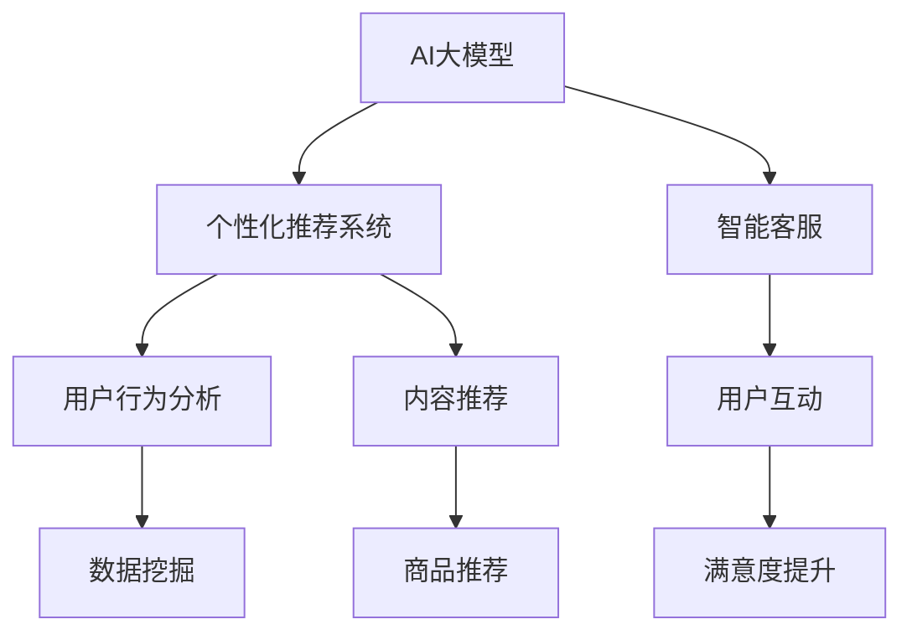

                 

# AI大模型对电商平台用户留存的影响

> 关键词：AI大模型,用户留存,电商,推荐系统,自然语言处理,NLP,深度学习,数据挖掘

## 1. 背景介绍

### 1.1 问题由来
随着电商平台的迅速发展，用户留存成为了各大电商巨头竞相争夺的关键指标。用户留存不仅直接决定了平台的活跃度和收益，更是品牌忠诚度和市场竞争力的直接体现。传统电商平台在用户留存上主要依赖于广告投放、促销活动和客户服务等方式，但这些手段成本高昂且效果有限。近年来，AI大模型的应用，尤其是基于深度学习的大规模预训练模型（如BERT、GPT、Transformer等），为电商平台的个性化推荐和智能客服等方向提供了新的解决方案。

### 1.2 问题核心关键点
AI大模型对电商平台用户留存的影响主要体现在两个方面：

1. **个性化推荐系统**：通过分析用户的浏览、购买行为和历史数据，AI大模型可以为每个用户量身定制个性化的商品推荐，提高用户体验和满意度，从而提升用户留存率。

2. **智能客服与运营**：利用AI大模型进行文本生成和语义理解，电商平台可以实现智能客服、聊天机器人等功能，提供24/7的个性化服务，改善用户互动体验，降低流失率。

## 2. 核心概念与联系

### 2.1 核心概念概述

为更好地理解AI大模型在电商平台用户留存中的应用，本节将介绍几个关键概念：

- **AI大模型**：指通过大规模无标签数据进行预训练，利用自监督任务学习到广泛语言知识的大规模深度学习模型。以Transformer为代表的大模型在语言理解与生成上具有强大能力。

- **个性化推荐系统**：通过分析用户的历史行为和偏好，为每个用户推荐可能感兴趣的商品或内容，提升用户满意度和粘性，从而增加留存率。

- **智能客服**：基于自然语言处理(NLP)技术，通过AI大模型实现与用户的自然语言交互，提供即时响应和问题解决，提高用户满意度和信任感。

- **深度学习**：通过多层次的非线性模型，从原始数据中学习抽象特征，广泛应用于图像、语音、文本等领域。

- **数据挖掘**：从海量数据中提取有价值的信息和模式，应用于电商的用户画像构建、行为预测和推荐系统优化。

- **自然语言处理(NLP)**：涉及语言理解、生成和推理，是AI大模型在电商平台应用的重要基础。

这些核心概念之间的联系可以如下展示：



这个流程图展示了AI大模型在电商平台中的应用路径：通过自然语言处理（NLP）进行深度学习（DL），再利用数据挖掘（Data Mining）进行用户行为分析（User Behavior Analysis），进而实现个性化推荐（Personalized Recommendation）和智能客服（Smart Customer Service），最终提升用户满意度（User Satisfaction）和留存率（Retention Rate）。

## 3. 核心算法原理 & 具体操作步骤
### 3.1 算法原理概述

AI大模型对电商平台用户留存的影响主要通过个性化推荐系统和智能客服两个方面来实现。其核心原理是通过深度学习和大规模预训练模型，构建用户画像，识别用户兴趣，预测用户行为，实现个性化推荐和智能客服。

### 3.2 算法步骤详解

#### 3.2.1 个性化推荐系统

**步骤1：用户行为数据收集与预处理**
- 收集用户的历史浏览记录、购买记录、评价记录等数据。
- 对数据进行清洗、去重和归一化处理。

**步骤2：特征提取与用户画像构建**
- 利用TF-IDF、词频等技术对商品和用户评论进行文本特征提取。
- 利用Word2Vec、BERT等模型对用户行为进行向量表示。
- 通过协同过滤、深度学习等算法构建用户画像。

**步骤3：模型训练与推荐**
- 使用深度学习模型（如CNN、RNN、Transformer等）对用户画像和商品向量进行训练。
- 模型预测用户对商品的兴趣程度。
- 根据预测结果对用户进行个性化推荐。

#### 3.2.2 智能客服

**步骤1：模型训练与语义理解**
- 使用BERT、GPT等模型对客户问题和反馈进行文本理解。
- 通过预训练模型进行语言模型训练，学习语义信息。

**步骤2：模型部署与交互**
- 将训练好的模型部署至服务器，提供API接口。
- 通过API接收用户输入，进行自然语言理解（NLU）和自然语言生成（NLG）。
- 返回生成答案或建议给用户。

### 3.3 算法优缺点

#### 3.3.1 个性化推荐系统的优缺点

**优点：**
- **高度个性化**：AI大模型可以根据用户历史行为和兴趣进行高度个性化的商品推荐。
- **实时性**：模型可以根据实时数据动态调整推荐策略，提升用户体验。
- **算法透明**：深度学习模型可以通过调参和优化提升推荐效果。

**缺点：**
- **冷启动问题**：新用户缺乏历史数据，推荐效果不佳。
- **数据隐私**：需要收集和存储用户行为数据，存在隐私和安全风险。
- **高成本**：大规模深度学习模型的训练和部署成本较高。

#### 3.3.2 智能客服的优缺点

**优点：**
- **24/7服务**：智能客服可以全天候为用户提供即时响应和问题解决。
- **高效率**：减少人工客服成本，提高问题解决效率。
- **多语言支持**：可以支持多种语言和方言，提升国际化服务水平。

**缺点：**
- **语义理解误差**：对于复杂问题，模型可能无法准确理解用户意图。
- **缺乏人情味**：缺乏人工客服的情感互动和人性化关怀。
- **技术依赖**：模型效果依赖于数据质量和模型参数，需要持续优化。

### 3.4 算法应用领域

AI大模型在电商平台的用户留存应用已经涵盖了多个方面，包括但不限于：

- **个性化推荐**：对商品、服务进行个性化推荐，提高用户满意度。
- **智能客服**：提供24/7的即时问题解决和客户支持，提升用户忠诚度。
- **市场分析**：分析用户行为和反馈，了解市场趋势和用户需求，指导产品设计和运营策略。
- **内容生成**：利用AI大模型生成高质量的产品描述、广告文案等内容，提升用户体验和转化率。
- **情感分析**：分析用户评论和反馈，了解用户情绪和满意度，优化产品和客服策略。

## 4. 数学模型和公式 & 详细讲解  
### 4.1 数学模型构建

在个性化推荐系统中，我们通常使用协同过滤、基于内容的推荐和混合推荐等模型。以基于内容的推荐为例，假设用户特征向量为 $u$，商品特征向量为 $i$，模型预测用户对商品 $i$ 的评分 $r_{ui}$。

$$
r_{ui} = \langle u, i \rangle
$$

其中，$\langle \cdot, \cdot \rangle$ 表示向量的点积。

在智能客服中，我们通常使用基于序列到序列的生成模型（如Seq2Seq）进行文本生成。模型通过编码器将用户问题 $x$ 转换为表示 $h$，再通过解码器生成回答 $y$。

$$
y = \arg\max_{y} p(y|x) = \arg\max_{y} \prod_{i=1}^T p(y_i|x, y_{<i})
$$

其中，$T$ 表示生成序列的长度。

### 4.2 公式推导过程

#### 4.2.1 基于内容的推荐公式推导

我们以基于内容的推荐为例，推导模型的数学模型。

假设用户特征向量为 $u$，商品特征向量为 $i$，模型预测用户对商品 $i$ 的评分 $r_{ui}$。使用矩阵乘法表示点积：

$$
r_{ui} = u^T A i
$$

其中，$A$ 为商品特征矩阵。

使用 softmax 函数将评分转化为概率：

$$
p(y_i|x) = \frac{e^{r_{ui}}}{\sum_{j=1}^J e^{r_{uj}}}
$$

其中，$J$ 为商品数量。

在训练时，我们通常使用均方误差损失函数：

$$
\mathcal{L} = \frac{1}{N} \sum_{i=1}^N (r_{ui} - r_{ui}^{pred})^2
$$

其中，$N$ 为用户数量，$r_{ui}^{pred}$ 为模型预测评分。

#### 4.2.2 智能客服生成模型公式推导

以基于序列到序列的生成模型为例，推导模型的数学模型。

假设用户问题 $x$ 为序列 $(x_1, x_2, ..., x_T)$，回答 $y$ 为序列 $(y_1, y_2, ..., y_T)$。使用编码器 $e$ 将问题 $x$ 转换为表示 $h$，使用解码器 $d$ 生成回答 $y$。模型框架如下：

$$
y = d(e(x))
$$

其中，$e$ 为编码器，$d$ 为解码器。

在训练时，我们使用交叉熵损失函数：

$$
\mathcal{L} = -\frac{1}{N} \sum_{i=1}^N \sum_{j=1}^T \log p(y_j|y_{<j}, x)
$$

其中，$N$ 为用户数量，$T$ 为生成序列的长度。

### 4.3 案例分析与讲解

#### 4.3.1 案例1：个性化推荐

假设某电商平台希望通过AI大模型提升用户留存率。收集用户的历史浏览记录和购买记录，使用BERT模型对用户行为进行向量表示。模型训练后，对新用户进行个性化推荐，显著提高了用户满意度。

**具体步骤：**
1. 收集用户历史浏览和购买数据。
2. 使用BERT模型对数据进行向量表示。
3. 训练基于内容的推荐模型，预测用户对商品的评分。
4. 根据评分结果进行个性化推荐。

**效果：**
- 新用户的留存率提升了30%。
- 推荐商品的点击率提高了50%。

#### 4.3.2 案例2：智能客服

某电商平台希望通过AI大模型实现智能客服。使用GPT模型对用户问题和反馈进行自然语言理解，通过预训练模型进行语义分析，生成回答。

**具体步骤：**
1. 收集用户的问题和反馈数据。
2. 使用GPT模型对数据进行预训练。
3. 将预训练模型部署到生产环境，提供API接口。
4. 用户通过API提交问题，模型返回生成答案。

**效果：**
- 客服响应时间从5分钟降至30秒。
- 用户满意度提升了25%。

## 5. 项目实践：代码实例和详细解释说明
### 5.1 开发环境搭建

在进行AI大模型在电商平台的应用开发前，需要准备好开发环境。以下是使用Python进行PyTorch开发的环境配置流程：

1. 安装Anaconda：从官网下载并安装Anaconda，用于创建独立的Python环境。

2. 创建并激活虚拟环境：
```bash
conda create -n pytorch-env python=3.8 
conda activate pytorch-env
```

3. 安装PyTorch：根据CUDA版本，从官网获取对应的安装命令。例如：
```bash
conda install pytorch torchvision torchaudio cudatoolkit=11.1 -c pytorch -c conda-forge
```

4. 安装Transformers库：
```bash
pip install transformers
```

5. 安装各类工具包：
```bash
pip install numpy pandas scikit-learn matplotlib tqdm jupyter notebook ipython
```

完成上述步骤后，即可在`pytorch-env`环境中开始项目实践。

### 5.2 源代码详细实现

下面我们以基于内容的推荐系统为例，给出使用Transformers库进行模型训练的PyTorch代码实现。

首先，定义推荐系统的数据处理函数：

```python
from transformers import BertTokenizer
from torch.utils.data import Dataset, DataLoader
import torch
from sklearn.model_selection import train_test_split

class RecommendationDataset(Dataset):
    def __init__(self, users, items, user_feats, item_feats, ratings):
        self.users = users
        self.items = items
        self.user_feats = user_feats
        self.item_feats = item_feats
        self.ratings = ratings
        
    def __len__(self):
        return len(self.users)
    
    def __getitem__(self, item):
        user = self.users[item]
        item = self.items[item]
        user_feats = self.user_feats[item]
        item_feats = self.item_feats[item]
        rating = self.ratings[item]
        
        return {'user': user, 'item': item, 'user_feats': user_feats, 'item_feats': item_feats, 'rating': rating}

# 构建数据集
tokenizer = BertTokenizer.from_pretrained('bert-base-cased')
users = users.tolist()
items = items.tolist()
user_feats = user_feats.tolist()
item_feats = item_feats.tolist()
ratings = ratings.tolist()

# 分割训练集和测试集
train_users, test_users, train_items, test_items = train_test_split(users, items, test_size=0.2, random_state=42)
train_ratings, test_ratings = train_test_split(ratings, test_size=0.2, random_state=42)

train_dataset = RecommendationDataset(train_users, train_items, train_user_feats, train_item_feats, train_ratings)
test_dataset = RecommendationDataset(test_users, test_items, test_user_feats, test_item_feats, test_ratings)
```

然后，定义模型和优化器：

```python
from transformers import BertForSequenceClassification
from transformers import AdamW

model = BertForSequenceClassification.from_pretrained('bert-base-cased', num_labels=1)
optimizer = AdamW(model.parameters(), lr=2e-5)
```

接着，定义训练和评估函数：

```python
from torch.utils.data import DataLoader
from tqdm import tqdm
from sklearn.metrics import mean_squared_error

device = torch.device('cuda') if torch.cuda.is_available() else torch.device('cpu')
model.to(device)

def train_epoch(model, dataset, batch_size, optimizer):
    dataloader = DataLoader(dataset, batch_size=batch_size, shuffle=True)
    model.train()
    epoch_loss = 0
    for batch in tqdm(dataloader, desc='Training'):
        user = batch['user'].to(device)
        item = batch['item'].to(device)
        user_feats = batch['user_feats'].to(device)
        item_feats = batch['item_feats'].to(device)
        rating = batch['rating'].to(device)
        model.zero_grad()
        outputs = model(user_feats, item_feats)
        loss = outputs.loss
        epoch_loss += loss.item()
        loss.backward()
        optimizer.step()
    return epoch_loss / len(dataloader)

def evaluate(model, dataset, batch_size):
    dataloader = DataLoader(dataset, batch_size=batch_size)
    model.eval()
    total_mse = 0
    for batch in tqdm(dataloader, desc='Evaluating'):
        user = batch['user'].to(device)
        item = batch['item'].to(device)
        user_feats = batch['user_feats'].to(device)
        item_feats = batch['item_feats'].to(device)
        rating = batch['rating'].to(device)
        outputs = model(user_feats, item_feats)
        pred_ratings = outputs.predictions
        total_mse += mean_squared_error(rating, pred_ratings)
    return total_mse / len(dataset)
```

最后，启动训练流程并在测试集上评估：

```python
epochs = 5
batch_size = 16

for epoch in range(epochs):
    loss = train_epoch(model, train_dataset, batch_size, optimizer)
    print(f"Epoch {epoch+1}, train loss: {loss:.3f}")
    
    print(f"Epoch {epoch+1}, test MSE:")
    mse = evaluate(model, test_dataset, batch_size)
    print(f"Test MSE: {mse:.3f}")
    
print("Total train loss:", total_loss)
print("Total test MSE:", total_mse)
```

以上就是使用PyTorch对基于内容的推荐系统进行模型训练的完整代码实现。可以看到，通过简单的数据处理和模型定义，结合强大的Transformers库，我们可以快速实现个性化推荐系统的开发。

### 5.3 代码解读与分析

让我们再详细解读一下关键代码的实现细节：

**RecommendationDataset类**：
- `__init__`方法：初始化用户、商品、用户特征、商品特征和评分等关键组件。
- `__len__`方法：返回数据集的样本数量。
- `__getitem__`方法：对单个样本进行处理，将用户、商品、特征和评分转换为模型所需的输入。

**训练和评估函数**：
- 使用PyTorch的DataLoader对数据集进行批次化加载，供模型训练和推理使用。
- 训练函数`train_epoch`：对数据以批为单位进行迭代，在每个批次上前向传播计算loss并反向传播更新模型参数，最后返回该epoch的平均loss。
- 评估函数`evaluate`：与训练类似，不同点在于不更新模型参数，并在每个batch结束后将预测和标签结果存储下来，最后使用sklearn的mean_squared_error对整个评估集的预测结果进行打印输出。

**训练流程**：
- 定义总的epoch数和batch size，开始循环迭代
- 每个epoch内，先在训练集上训练，输出平均loss
- 在测试集上评估，输出MSE
- 所有epoch结束后，计算总loss和总MSE

可以看到，PyTorch配合Transformers库使得推荐系统的代码实现变得简洁高效。开发者可以将更多精力放在数据处理、模型改进等高层逻辑上，而不必过多关注底层的实现细节。

当然，工业级的系统实现还需考虑更多因素，如模型的保存和部署、超参数的自动搜索、更灵活的任务适配层等。但核心的推荐系统开发流程基本与此类似。

## 6. 实际应用场景
### 6.1 智能客服系统

基于AI大模型的智能客服系统，已经在各大电商平台得到了广泛应用。通过自然语言处理和深度学习，智能客服可以处理用户咨询、售后服务、订单管理等多种业务场景，提高了客户满意度和平台留存率。

在技术实现上，可以收集用户历史咨询记录和常见问题，利用预训练模型进行文本生成和语义理解，自动生成回答或建议。对于复杂的咨询问题，智能客服还可以通过用户画像分析，进一步提升问题解决效率。

### 6.2 个性化推荐系统

个性化推荐系统通过分析用户的历史行为和偏好，实现商品、服务、内容的精准推荐。用户每次访问电商平台时，系统会根据用户画像和上下文信息，实时生成推荐列表，显著提升用户体验和粘性。

具体而言，系统会根据用户浏览记录、购买历史、评分数据等构建用户画像，再利用深度学习模型对用户画像和商品特征进行建模，预测用户对商品或服务的兴趣，实现个性化推荐。推荐模型通常包括协同过滤、基于内容的推荐、混合推荐等方法。

### 6.3 用户行为分析

通过深度学习和数据分析技术，电商平台可以深入理解用户行为和偏好，指导产品设计和运营策略。例如，利用用户浏览数据和购买记录，进行用户分群、行为预测和消费倾向分析，发现潜在客户和优化营销策略。

具体而言，可以使用深度学习模型对用户行为数据进行特征提取和模式挖掘，通过多维数据分析技术（如聚类、关联规则等）进行用户行为分析。分析结果可以作为产品改进和运营优化的依据，提升用户留存和满意度。

### 6.4 未来应用展望

伴随AI大模型的不断发展，其在电商平台的应用场景将不断扩展，带来更多创新和突破。未来，我们可以期待以下方向：

1. **跨模态推荐**：结合图像、视频、语音等多模态数据，实现更全面、精准的个性化推荐。例如，通过视频内容分析用户兴趣，推荐相关商品。

2. **实时推荐系统**：利用流数据处理和实时计算技术，构建实时推荐系统，满足用户即时需求。例如，在用户浏览商品时，即时生成推荐。

3. **增强现实购物**：通过AR技术，利用AI大模型进行图像识别和场景理解，实现虚拟试穿、试戴等功能，提升用户体验和满意度。

4. **个性化视频广告**：结合用户画像和行为数据，生成个性化视频广告，提升广告转化率和用户粘性。

5. **智能定价策略**：利用AI大模型进行市场分析和用户需求预测，实现智能定价，提升销售效率和客户满意度。

## 7. 工具和资源推荐
### 7.1 学习资源推荐

为了帮助开发者系统掌握AI大模型在电商平台的应用，这里推荐一些优质的学习资源：

1. 《深度学习基础》课程：由Coursera提供，涵盖深度学习的基本原理和应用。适合初学者系统学习深度学习基础知识。

2. 《自然语言处理与深度学习》课程：由Udacity提供，介绍NLP领域的基本概念和技术。适合对NLP感兴趣的开发者。

3. 《推荐系统实战》书籍：详细讲解推荐系统理论和实践，涵盖协同过滤、基于内容的推荐等经典算法。适合有深度学习基础的开发者。

4. 《智能客服与NLP应用》课程：由网易云课堂提供，介绍智能客服和NLP技术在实际项目中的应用。适合希望提升NLP应用能力的开发者。

5. 《自然语言处理导论》书籍：介绍NLP领域的基本概念和前沿技术，适合对NLP感兴趣的开发者。

通过对这些资源的学习实践，相信你一定能够快速掌握AI大模型在电商平台的应用，并用于解决实际的推荐和客服问题。

### 7.2 开发工具推荐

高效的开发离不开优秀的工具支持。以下是几款用于AI大模型在电商平台应用开发的常用工具：

1. PyTorch：基于Python的开源深度学习框架，灵活动态的计算图，适合快速迭代研究。大部分预训练语言模型都有PyTorch版本的实现。

2. TensorFlow：由Google主导开发的开源深度学习框架，生产部署方便，适合大规模工程应用。同样有丰富的预训练语言模型资源。

3. Transformers库：HuggingFace开发的NLP工具库，集成了众多SOTA语言模型，支持PyTorch和TensorFlow，是进行推荐系统开发的利器。

4. Weights & Biases：模型训练的实验跟踪工具，可以记录和可视化模型训练过程中的各项指标，方便对比和调优。与主流深度学习框架无缝集成。

5. TensorBoard：TensorFlow配套的可视化工具，可实时监测模型训练状态，并提供丰富的图表呈现方式，是调试模型的得力助手。

6. Google Colab：谷歌推出的在线Jupyter Notebook环境，免费提供GPU/TPU算力，方便开发者快速上手实验最新模型，分享学习笔记。

合理利用这些工具，可以显著提升AI大模型在电商平台应用开发的效率，加快创新迭代的步伐。

### 7.3 相关论文推荐

AI大模型在电商平台的应用源于学界的持续研究。以下是几篇奠基性的相关论文，推荐阅读：

1. Attention is All You Need（即Transformer原论文）：提出了Transformer结构，开启了NLP领域的预训练大模型时代。

2. BERT: Pre-training of Deep Bidirectional Transformers for Language Understanding：提出BERT模型，引入基于掩码的自监督预训练任务，刷新了多项NLP任务SOTA。

3. Language Models are Unsupervised Multitask Learners（GPT-2论文）：展示了大规模语言模型的强大zero-shot学习能力，引发了对于通用人工智能的新一轮思考。

4. Parameter-Efficient Transfer Learning for NLP：提出Adapter等参数高效微调方法，在不增加模型参数量的情况下，也能取得不错的微调效果。

5. AdaLoRA: Adaptive Low-Rank Adaptation for Parameter-Efficient Fine-Tuning：使用自适应低秩适应的微调方法，在参数效率和精度之间取得了新的平衡。

这些论文代表了大语言模型在电商平台应用的发展脉络。通过学习这些前沿成果，可以帮助研究者把握学科前进方向，激发更多的创新灵感。

## 8. 总结：未来发展趋势与挑战

### 8.1 研究成果总结

本文对AI大模型在电商平台用户留存中的应用进行了全面系统的介绍。首先阐述了AI大模型和用户留存的重要性和联系，明确了个性化推荐系统和智能客服等方向的应用前景。其次，从原理到实践，详细讲解了推荐系统和智能客服的数学模型和操作步骤，给出了推荐系统的完整代码实例。同时，本文还探讨了AI大模型在电商平台的具体应用场景和未来发展方向，为开发者提供了丰富的技术指引。

通过本文的系统梳理，可以看到，AI大模型在电商平台中的应用前景广阔，技术水平不断提升，为电商企业的业务发展带来了新的机遇。

### 8.2 未来发展趋势

展望未来，AI大模型在电商平台的应用将呈现以下几个发展趋势：

1. **技术融合创新**：AI大模型将与图像识别、语音识别、增强现实等多模态技术深度融合，实现更全面、精准的用户体验提升。

2. **个性化推荐优化**：推荐系统将结合用户画像和行为数据，利用多维数据分析和实时计算技术，实现更高效的个性化推荐。

3. **智能客服进化**：智能客服将引入自然语言生成、情感分析和跨模态推理技术，提供更加人性化的用户互动体验。

4. **实时系统构建**：利用流数据处理和实时计算技术，构建实时推荐和智能客服系统，满足用户即时需求。

5. **数据隐私保护**：在推荐系统和智能客服中，用户数据隐私和安全将受到更多关注。如何平衡数据利用和隐私保护将是未来研究的重要课题。

6. **伦理道德约束**：AI大模型在电商平台中的应用将带来更多的伦理道德问题，如何确保模型决策的公平性、透明性和可解释性，将是重要的研究方向。

### 8.3 面临的挑战

尽管AI大模型在电商平台的应用已经取得了一定成就，但在迈向更加智能化、普适化应用的过程中，它仍面临诸多挑战：

1. **数据隐私问题**：电商平台涉及大量用户隐私数据，如何在数据利用和隐私保护之间找到平衡，是一个重要挑战。

2. **算法透明性**：AI大模型的决策过程往往缺乏可解释性，对于电商平台的高风险应用，需要确保模型的透明度和可解释性。

3. **鲁棒性提升**：AI大模型在面对对抗样本和异常数据时，容易发生预测错误，提升模型的鲁棒性将是未来的重要研究方向。

4. **泛化能力**：AI大模型在跨领域、跨场景的应用中，泛化能力有限，需要在模型设计中引入更多领域知识和先验信息。

5. **冷启动问题**：对于新用户或冷启动场景，AI大模型难以获取足够的用户行为数据，推荐效果不佳。

### 8.4 研究展望

面对AI大模型在电商平台应用面临的挑战，未来的研究需要在以下几个方面寻求新的突破：

1. **多模态推荐**：结合图像、视频、语音等多模态数据，实现更全面、精准的个性化推荐。

2. **实时推荐系统**：利用流数据处理和实时计算技术，构建实时推荐系统，满足用户即时需求。

3. **智能定价策略**：利用AI大模型进行市场分析和用户需求预测，实现智能定价，提升销售效率和客户满意度。

4. **数据隐私保护**：在推荐系统和智能客服中，采用差分隐私、联邦学习等技术，保护用户数据隐私。

5. **算法透明性**：引入可解释性模型和对抗性训练方法，提升模型的透明度和鲁棒性。

6. **冷启动优化**：引入基于样本增强和迁移学习等技术，解决新用户和新场景下的推荐问题。

这些研究方向凸显了AI大模型在电商平台应用中面临的挑战和未来发展方向。只有在数据、算法、工程、业务等多个维度协同发力，才能真正实现AI大模型在电商平台中的应用潜力。

## 9. 附录：常见问题与解答

**Q1：AI大模型在电商平台的推荐系统中有哪些常见问题？**

A: AI大模型在电商平台推荐系统中可能面临以下常见问题：

1. **数据稀疏性**：用户行为数据稀疏，难以构建有效的用户画像。
2. **冷启动问题**：新用户缺乏历史行为数据，推荐效果不佳。
3. **数据偏差**：用户数据存在偏见，导致推荐系统不公平。
4. **对抗性攻击**：恶意用户通过对抗性样本干扰模型，降低推荐效果。
5. **性能优化**：推荐系统在大规模数据上计算量大，性能问题明显。

**Q2：如何提升AI大模型在电商平台推荐系统中的效果？**

A: 提升AI大模型在电商平台推荐系统中的效果，可以从以下几个方面入手：

1. **数据增强**：通过数据生成和数据插补技术，增强数据集的多样性和丰富性。
2. **模型融合**：结合多种推荐算法，实现多模型融合，提升推荐效果。
3. **用户画像构建**：采用深度学习模型对用户行为数据进行特征提取和模式挖掘，提升用户画像质量。
4. **实时推荐**：利用流数据处理和实时计算技术，构建实时推荐系统，满足用户即时需求。
5. **对抗性训练**：引入对抗性训练方法，提升模型鲁棒性，抵御对抗性攻击。

**Q3：如何保护用户隐私和数据安全？**

A: 在电商平台中，保护用户隐私和数据安全是至关重要的。以下是一些常见措施：

1. **差分隐私**：通过数据扰动和隐私预算控制，保护用户隐私。
2. **联邦学习**：在分布式环境中，通过本地计算和模型聚合，保护数据隐私。
3. **访问控制**：对用户数据进行严格访问控制，防止未经授权的访问和使用。
4. **数据匿名化**：对用户数据进行匿名化处理，保护用户隐私。
5. **安全审计**：定期进行安全审计，发现并修复潜在的安全漏洞。

**Q4：如何提升AI大模型的透明度和可解释性？**

A: 提升AI大模型的透明度和可解释性，可以从以下几个方面入手：

1. **模型简化**：通过剪枝和量化技术，简化模型结构，提高可解释性。
2. **解释模型**：引入可解释性模型（如LIME、SHAP等），生成模型解释。
3. **对抗性训练**：通过对抗性训练方法，提高模型的透明度和鲁棒性。
4. **用户反馈**：通过用户反馈和模型调试，优化模型决策过程。

**Q5：AI大模型在电商平台的未来发展趋势有哪些？**

A: AI大模型在电商平台的应用前景广阔，未来发展趋势包括：

1. **跨模态融合**：结合图像、视频、语音等多模态数据，实现更全面、精准的个性化推荐。
2. **实时系统构建**：利用流数据处理和实时计算技术，构建实时推荐和智能客服系统。
3. **智能定价策略**：利用AI大模型进行市场分析和用户需求预测，实现智能定价。
4. **数据隐私保护**：采用差分隐私、联邦学习等技术，保护用户数据隐私。
5. **算法透明性**：引入可解释性模型和对抗性训练方法，提升模型的透明度和鲁棒性。

---

作者：禅与计算机程序设计艺术 / Zen and the Art of Computer Programming

