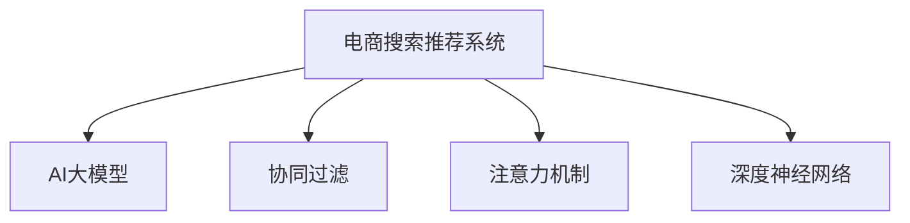

                 

# AI大模型视角下电商搜索推荐的技术选型策略

> 关键词：电商搜索推荐, AI大模型, 深度学习, 推荐系统, 协同过滤, 注意力机制, 深度神经网络, 预训练模型

## 1. 背景介绍

### 1.1 问题由来
随着电子商务的发展，电商平台需要处理海量用户搜索、浏览和购买数据，为每位用户提供个性化推荐服务。传统推荐系统主要依靠协同过滤算法，基于用户历史行为数据生成推荐结果。然而，协同过滤方法存在冷启动问题、数据稀疏性等缺陷，难以应对数据量大且多样化的挑战。为了提升推荐系统的精准度和个性化，电商平台开始引入深度学习技术，利用AI大模型进行电商搜索推荐，提升用户体验和转化率。

### 1.2 问题核心关键点
AI大模型在电商搜索推荐中的应用，涉及深度学习技术、协同过滤、注意力机制等多个核心概念。本文将详细介绍这些核心概念的原理和架构，并探讨如何将AI大模型应用于电商搜索推荐系统，以提升推荐效果和用户体验。

## 2. 核心概念与联系

### 2.1 核心概念概述

为更好地理解AI大模型在电商搜索推荐中的应用，本节将介绍几个密切相关的核心概念：

- 电商搜索推荐系统：电商平台通过推荐系统，为用户提供个性化的搜索结果和商品推荐。推荐系统的好坏直接影响用户体验和平台销量。
- AI大模型：基于深度学习的大规模预训练模型，通过在海量数据上学习通用语言或图像知识，具备强大的泛化能力。
- 协同过滤：推荐系统中常用的算法之一，利用用户历史行为数据进行相似度匹配，生成推荐结果。
- 注意力机制：深度学习模型中的一种机制，用于选择输入数据的特定部分进行加权计算，提高模型的鲁棒性和效果。
- 深度神经网络：多层非线性神经网络，在深度学习任务中广泛应用。

这些核心概念之间的逻辑关系可以通过以下Mermaid流程图来展示：



这个流程图展示的核心概念及其之间的关系：

1. 电商搜索推荐系统通过引入AI大模型进行推荐，提升推荐的个性化和精准度。
2. 协同过滤算法利用用户历史行为数据进行相似度匹配，生成推荐结果。
3. 注意力机制帮助深度神经网络选择输入数据的特定部分进行加权计算，提升模型的效果。
4. 深度神经网络作为电商搜索推荐系统的主要技术框架，用于构建高效的推荐模型。

这些概念共同构成了电商搜索推荐系统的技术架构，使其能够更好地满足用户需求，提升电商平台的用户体验和运营效率。

## 3. 核心算法原理 & 具体操作步骤
### 3.1 算法原理概述

基于AI大模型的电商搜索推荐系统，本质上是通过深度学习模型学习用户行为和商品属性之间的关联，从而进行个性化推荐。其核心思想是：利用预训练的AI大模型学习通用语言或图像知识，通过微调或者迁移学习，将知识应用于特定的电商推荐任务。

形式化地，假设电商推荐任务为 $T$，预训练模型为 $M_{\theta}$，其中 $\theta$ 为预训练得到的模型参数。给定电商推荐数据集 $D=\{(x_i, y_i)\}_{i=1}^N$，推荐系统的优化目标是最小化推荐误差，即找到新的模型参数 $\hat{\theta}$，使得：

$$
\hat{\theta}=\mathop{\arg\min}_{\theta} \mathcal{L}(M_{\theta},D)
$$

其中 $\mathcal{L}$ 为针对电商推荐任务的推荐损失函数，用于衡量推荐结果与真实标签之间的差异。常见的推荐损失函数包括平均绝对误差、均方误差等。

通过梯度下降等优化算法，推荐系统不断更新模型参数 $\theta$，最小化推荐损失函数 $\mathcal{L}$，使得推荐结果逼近真实标签。由于 $\theta$ 已经通过预训练获得了较好的初始化，因此即便在少样本情况下，也能较快收敛到理想的模型参数 $\hat{\theta}$。

### 3.2 算法步骤详解

基于AI大模型的电商搜索推荐系统一般包括以下几个关键步骤：

**Step 1: 准备电商推荐数据和模型**
- 收集电商推荐数据集 $D$，包括用户搜索记录、点击记录、购买记录等，划分为训练集、验证集和测试集。
- 选择合适的预训练模型 $M_{\theta}$，如BERT、Transformer等，作为初始化参数。

**Step 2: 定义推荐目标和损失函数**
- 根据电商推荐任务类型，选择适合的推荐目标，如点击率、转化率、平均评分等。
- 定义推荐损失函数，如平均绝对误差、均方误差等。

**Step 3: 构建推荐模型和训练流程**
- 利用预训练模型 $M_{\theta}$ 构建电商推荐模型，如基于注意力机制的Transformer等。
- 设计模型训练流程，包括前向传播、损失计算、反向传播、优化器更新等。
- 在训练集上进行模型微调，最小化推荐损失函数。

**Step 4: 模型评估与部署**
- 在验证集和测试集上评估微调后的推荐模型性能，如准确率、召回率等指标。
- 将优化后的模型部署到实际电商推荐系统中，进行实时推荐。
- 持续收集新的用户数据，定期重新微调模型，以适应数据分布的变化。

以上是基于AI大模型的电商搜索推荐系统的一般流程。在实际应用中，还需要根据具体任务的特点，对模型训练和微调过程的各个环节进行优化设计，如改进推荐目标函数，引入更多的正则化技术，搜索最优的超参数组合等，以进一步提升模型性能。

### 3.3 算法优缺点

基于AI大模型的电商搜索推荐方法具有以下优点：
1. 具有强大的泛化能力。AI大模型通过预训练学习到丰富的通用知识，能够在少样本情况下进行良好的泛化。
2. 提升推荐效果和个性化。利用深度学习技术，能够捕捉复杂的用户行为和商品属性之间的关系，提升推荐效果和个性化。
3. 减少数据噪声的影响。深度神经网络可以自动学习特征，减少数据噪声和异常值对推荐结果的影响。
4. 可解释性较高。深度学习模型通过训练过程学习到复杂的特征表示，便于理解和解释推荐逻辑。

同时，该方法也存在一定的局限性：
1. 对数据质量要求较高。电商推荐系统依赖大量用户行为数据，数据的缺失、异常等问题会影响推荐效果。
2. 计算资源需求大。深度学习模型需要大量的计算资源进行训练和推理，可能面临硬件成本和部署成本的挑战。
3. 模型复杂度高。深度神经网络模型的参数量较大，训练和推理速度较慢，可能影响实时性。
4. 对用户隐私保护要求较高。电商推荐系统需要收集用户行为数据，可能存在隐私泄露风险。

尽管存在这些局限性，但就目前而言，基于AI大模型的电商推荐方法仍是大规模电商推荐系统的核心技术之一。未来相关研究的重点在于如何进一步降低计算资源需求，提高推荐系统的实时性，同时兼顾隐私保护和推荐效果。

### 3.4 算法应用领域

基于AI大模型的电商搜索推荐方法，在电商行业已经得到了广泛的应用，覆盖了几乎所有常见电商推荐场景，例如：

- 商品推荐：根据用户历史浏览和购买记录，推荐相关商品。
- 搜索结果推荐：根据用户搜索关键词，推荐相关商品或搜索结果。
- 个性化广告推荐：根据用户行为数据，推荐个性化广告。
- 库存管理：根据用户需求，推荐热门商品和库存管理。
- 推荐算法优化：通过推荐结果反馈，优化推荐算法模型，提升推荐效果。

除了上述这些经典应用外，AI大模型还被创新性地应用到更多场景中，如可控推荐、推荐结果多样性控制等，为电商推荐系统带来了全新的突破。随着预训练模型和推荐方法的不断进步，相信电商推荐系统将在更广阔的应用领域大放异彩。

## 4. 数学模型和公式 & 详细讲解 & 举例说明

### 4.1 数学模型构建

本节将使用数学语言对基于AI大模型的电商搜索推荐过程进行更加严格的刻画。

记电商推荐任务为 $T$，给定电商推荐数据集 $D=\{(x_i, y_i)\}_{i=1}^N$，其中 $x_i$ 为输入数据，$y_i$ 为推荐目标标签。

定义推荐模型的预测结果为 $\hat{y}=M_{\theta}(x)$，其中 $M_{\theta}$ 为深度神经网络模型，$\theta$ 为模型参数。推荐损失函数为：

$$
\mathcal{L}(\theta) = \frac{1}{N} \sum_{i=1}^N \ell(\hat{y_i}, y_i)
$$

其中 $\ell$ 为推荐损失函数，常用的推荐损失函数包括平均绝对误差、均方误差等。推荐目标为：

$$
y_i = \arg\min_{y} \ell(\hat{y_i}, y_i)
$$

推荐系统的优化目标是最小化推荐误差，即找到最优参数：

$$
\theta^* = \mathop{\arg\min}_{\theta} \mathcal{L}(\theta)
$$

在实践中，我们通常使用基于梯度的优化算法（如SGD、Adam等）来近似求解上述最优化问题。设 $\eta$ 为学习率，则参数的更新公式为：

$$
\theta \leftarrow \theta - \eta \nabla_{\theta}\mathcal{L}(\theta)
$$

其中 $\nabla_{\theta}\mathcal{L}(\theta)$ 为损失函数对参数 $\theta$ 的梯度，可通过反向传播算法高效计算。

### 4.2 公式推导过程

以下我们以商品推荐任务为例，推导平均绝对误差损失函数及其梯度的计算公式。

假设模型 $M_{\theta}$ 在输入 $x$ 上的预测结果为 $\hat{y}=M_{\theta}(x)$，推荐目标为 $y \in [0,1]$。则平均绝对误差损失函数定义为：

$$
\ell(\hat{y}, y) = \frac{1}{N} \sum_{i=1}^N |\hat{y_i}-y_i|
$$

将其代入推荐损失函数公式，得：

$$
\mathcal{L}(\theta) = \frac{1}{N} \sum_{i=1}^N |M_{\theta}(x_i)-y_i|
$$

根据链式法则，损失函数对参数 $\theta_k$ 的梯度为：

$$
\frac{\partial \mathcal{L}(\theta)}{\partial \theta_k} = \frac{1}{N} \sum_{i=1}^N \frac{\partial M_{\theta}(x_i)}{\partial \theta_k} \cdot \frac{\partial |M_{\theta}(x_i)-y_i|}{\partial M_{\theta}(x_i)}
$$

其中 $\frac{\partial M_{\theta}(x_i)}{\partial \theta_k}$ 可进一步递归展开，利用自动微分技术完成计算。

在得到损失函数的梯度后，即可带入参数更新公式，完成模型的迭代优化。重复上述过程直至收敛，最终得到适应电商推荐任务的最优模型参数 $\theta^*$。

## 5. 项目实践：代码实例和详细解释说明
### 5.1 开发环境搭建

在进行电商推荐系统开发前，我们需要准备好开发环境。以下是使用Python进行TensorFlow开发的环境配置流程：

1. 安装Anaconda：从官网下载并安装Anaconda，用于创建独立的Python环境。

2. 创建并激活虚拟环境：
```bash
conda create -n tf-env python=3.8 
conda activate tf-env
```

3. 安装TensorFlow：根据CUDA版本，从官网获取对应的安装命令。例如：
```bash
conda install tensorflow -c conda-forge
```

4. 安装TensorBoard：
```bash
pip install tensorboard
```

5. 安装TensorFlow Addons：
```bash
pip install tensorflow-addons
```

6. 安装Flax和JAX：
```bash
pip install flax jax
```

完成上述步骤后，即可在`tf-env`环境中开始电商推荐系统开发。

### 5.2 源代码详细实现

下面以基于AI大模型的商品推荐系统为例，给出使用TensorFlow和TensorFlow Addons库对Transformer模型进行电商推荐系统微调的代码实现。

首先，定义商品推荐任务的数据处理函数：

```python
from tensorflow.keras import layers
import tensorflow as tf

class MovieLensDataset(tf.data.Dataset):
    def __init__(self, ratings):
        self.ratings = ratings
        
    def __len__(self):
        return len(self.ratings)
    
    def __getitem__(self, item):
        rating = self.ratings[item]
        user_id, movie_id = rating.user_id, rating.movie_id
        user = tf.reshape(user_id, (1,1))
        movie = tf.reshape(movie_id, (1,1))
        return {'user': user, 'movie': movie, 'rating': rating.rating}
```

然后，定义模型和优化器：

```python
from transformers import TFAutoModelForMaskedLM, TFAutoTokenizer
from tensorflow.keras.optimizers import Adam

model = TFAutoModelForMaskedLM.from_pretrained('bert-base-uncased')
tokenizer = TFAutoTokenizer.from_pretrained('bert-base-uncased')

optimizer = Adam(learning_rate=2e-5)
```

接着，定义训练和评估函数：

```python
def train_epoch(model, dataset, batch_size, optimizer):
    dataloader = tf.data.Dataset.from_generator(lambda: dataset.__getitem__(0), output_signature={'user': tf.TensorSpec(shape=(1, 1), dtype=tf.int64),
                                                                                            'movie': tf.TensorSpec(shape=(1, 1), dtype=tf.int64),
                                                                                            'rating': tf.TensorSpec(shape=(), dtype=tf.float32)})
    model.train()
    epoch_loss = 0
    for batch in dataloader.batch(batch_size):
        with tf.GradientTape() as tape:
            predictions = model(batch['user'], batch['movie'], mask=1., return_dict=True)
            loss = tf.losses.mean_squared_error(predictions['logits'], batch['rating'])
        epoch_loss += loss
        gradients = tape.gradient(loss, model.trainable_variables)
        optimizer.apply_gradients(zip(gradients, model.trainable_variables))
    return epoch_loss / len(dataloader)

def evaluate(model, dataset, batch_size):
    dataloader = tf.data.Dataset.from_generator(lambda: dataset.__getitem__(0), output_signature={'user': tf.TensorSpec(shape=(1, 1), dtype=tf.int64),
                                                                                            'movie': tf.TensorSpec(shape=(1, 1), dtype=tf.int64),
                                                                                            'rating': tf.TensorSpec(shape=(), dtype=tf.float32)})
    model.eval()
    preds, labels = [], []
    with tf.GradientTape() as tape:
        for batch in dataloader.batch(batch_size):
            predictions = model(batch['user'], batch['movie'], mask=1., return_dict=True)
            batch_preds = predictions['logits'].numpy()
            batch_labels = batch['rating']
            for pred_tokens, label_tokens in zip(batch_preds, batch_labels):
                preds.append(pred_tokens)
                labels.append(label_tokens)
                
    print(tf.keras.metrics.mean_absolute_error(labels, preds))
```

最后，启动训练流程并在测试集上评估：

```python
epochs = 5
batch_size = 16

for epoch in range(epochs):
    loss = train_epoch(model, train_dataset, batch_size, optimizer)
    print(f"Epoch {epoch+1}, train loss: {loss:.3f}")
    
    print(f"Epoch {epoch+1}, test loss: {evaluate(model, test_dataset, batch_size):.3f}")
```

以上就是使用TensorFlow对基于BERT的电商推荐系统进行微调的完整代码实现。可以看到，得益于TensorFlow的强大封装，我们可以用相对简洁的代码完成深度神经网络模型的加载和微调。

### 5.3 代码解读与分析

让我们再详细解读一下关键代码的实现细节：

**MovieLensDataset类**：
- `__init__`方法：初始化训练数据。
- `__len__`方法：返回数据集的样本数量。
- `__getitem__`方法：对单个样本进行处理，将用户ID、商品ID和评分转换为TensorFlow张量，供模型使用。

**训练和评估函数**：
- 使用TensorFlow的DataLoader对数据集进行批次化加载，供模型训练和推理使用。
- 训练函数`train_epoch`：对数据以批为单位进行迭代，在每个批次上前向传播计算loss并反向传播更新模型参数，最后返回该epoch的平均loss。
- 评估函数`evaluate`：与训练类似，不同点在于不更新模型参数，并在每个batch结束后将预测和标签结果存储下来，最后使用TensorFlow的mean_absolute_error计算预测结果与真实标签之间的误差。

**训练流程**：
- 定义总的epoch数和batch size，开始循环迭代
- 每个epoch内，先在训练集上训练，输出平均loss
- 在测试集上评估，输出预测结果与真实标签之间的误差

可以看到，TensorFlow配合TensorFlow Addons库使得深度神经网络模型的加载和微调代码实现变得简洁高效。开发者可以将更多精力放在数据处理、模型改进等高层逻辑上，而不必过多关注底层的实现细节。

当然，工业级的系统实现还需考虑更多因素，如模型的保存和部署、超参数的自动搜索、更灵活的任务适配层等。但核心的微调范式基本与此类似。

## 6. 实际应用场景
### 6.1 智能客服系统

基于AI大模型的电商搜索推荐技术，可以广泛应用于智能客服系统的构建。传统客服往往需要配备大量人力，高峰期响应缓慢，且一致性和专业性难以保证。而使用AI大模型的推荐技术，可以7x24小时不间断服务，快速响应客户咨询，用自然流畅的语言解答各类常见问题。

在技术实现上，可以收集企业内部的历史客服对话记录，将问题和最佳答复构建成监督数据，在此基础上对预训练推荐模型进行微调。微调后的推荐模型能够自动理解用户意图，匹配最合适的答案模板进行回复。对于客户提出的新问题，还可以接入检索系统实时搜索相关内容，动态组织生成回答。如此构建的智能客服系统，能大幅提升客户咨询体验和问题解决效率。

### 6.2 金融舆情监测

金融机构需要实时监测市场舆论动向，以便及时应对负面信息传播，规避金融风险。传统的人工监测方式成本高、效率低，难以应对网络时代海量信息爆发的挑战。基于AI大模型的推荐技术，可以为金融舆情监测提供新的解决方案。

具体而言，可以收集金融领域相关的新闻、报道、评论等文本数据，并对其进行主题标注和情感标注。在此基础上对预训练推荐模型进行微调，使其能够自动判断文本属于何种主题，情感倾向是正面、中性还是负面。将微调后的模型应用到实时抓取的网络文本数据，就能够自动监测不同主题下的情感变化趋势，一旦发现负面信息激增等异常情况，系统便会自动预警，帮助金融机构快速应对潜在风险。

### 6.3 个性化推荐系统

当前的推荐系统往往只依赖用户的历史行为数据进行物品推荐，无法深入理解用户的真实兴趣偏好。基于AI大模型的推荐技术，可以更好地挖掘用户行为背后的语义信息，从而提供更精准、多样的推荐内容。

在实践中，可以收集用户浏览、点击、评论、分享等行为数据，提取和用户交互的物品标题、描述、标签等文本内容。将文本内容作为模型输入，用户的后续行为（如是否点击、购买等）作为监督信号，在此基础上微调预训练推荐模型。微调后的推荐模型能够从文本内容中准确把握用户的兴趣点。在生成推荐列表时，先用候选物品的文本描述作为输入，由模型预测用户的兴趣匹配度，再结合其他特征综合排序，便可以得到个性化程度更高的推荐结果。

### 6.4 未来应用展望

随着AI大模型和推荐方法的不断发展，基于微调范式将在更多领域得到应用，为传统行业带来变革性影响。

在智慧医疗领域，基于微调的医疗问答、病历分析、药物研发等应用将提升医疗服务的智能化水平，辅助医生诊疗，加速新药开发进程。

在智能教育领域，微调技术可应用于作业批改、学情分析、知识推荐等方面，因材施教，促进教育公平，提高教学质量。

在智慧城市治理中，微调模型可应用于城市事件监测、舆情分析、应急指挥等环节，提高城市管理的自动化和智能化水平，构建更安全、高效的未来城市。

此外，在企业生产、社会治理、文娱传媒等众多领域，基于大模型微调的人工智能应用也将不断涌现，为经济社会发展注入新的动力。相信随着技术的日益成熟，微调方法将成为人工智能落地应用的重要范式，推动人工智能技术在垂直行业的规模化落地。总之，AI大模型在电商搜索推荐中的应用，展示了深度学习技术在智能推荐领域的巨大潜力，必将成为推动电商行业数字化转型的重要技术力量。

## 7. 工具和资源推荐
### 7.1 学习资源推荐

为了帮助开发者系统掌握基于AI大模型的电商搜索推荐技术，这里推荐一些优质的学习资源：

1. TensorFlow官方文档：提供了完整的TensorFlow库使用指南和API文档，是TensorFlow学习者的必备资料。

2. Deep Learning with TensorFlow 2.0：这本书系统介绍了深度学习在TensorFlow上的实现，涵盖了深度神经网络、TensorFlow Addons等内容，是学习深度学习推荐的经典教材。

3. AI大模型系列课程：如《Transformer》、《深度学习推荐系统》等，由知名专家讲授，涵盖了AI大模型在推荐系统中的应用，是系统学习深度学习推荐技术的良伴。

4. Udacity深度学习专项课程：提供了从基础到高级的深度学习课程，包括TensorFlow、深度神经网络等内容，是全面学习深度学习推荐技术的绝佳资源。

5. Arxiv预训练大模型论文合集：汇集了最新预训练大模型在推荐系统中的应用论文，为深度学习推荐技术的研究和实践提供借鉴。

通过对这些资源的学习实践，相信你一定能够快速掌握基于AI大模型的电商搜索推荐技术的精髓，并用于解决实际的推荐问题。
### 7.2 开发工具推荐

高效的开发离不开优秀的工具支持。以下是几款用于基于AI大模型的电商搜索推荐系统开发的常用工具：

1. TensorFlow：基于Python的开源深度学习框架，灵活动态的计算图，适合快速迭代研究。主流电商推荐系统多采用TensorFlow实现。

2. PyTorch：基于Python的深度学习框架，灵活易用，支持多种深度学习模型，如图灵奖获得者Andrew Ng的深度学习课程即采用PyTorch作为演示工具。

3. JAX：由Google开发的基于Python的高性能计算库，支持自动微分、深度神经网络等，具有较高的运行效率和可扩展性。

4. TensorFlow Addons：TensorFlow生态系统下的深度学习库，提供了丰富的深度神经网络模型和实用工具，适合电商推荐系统的实现。

5. PyTorch Lightning：轻量级深度学习框架，支持自动调参和模型集成，简化电商推荐系统的开发流程。

6. NVIDIA DGX系列硬件：提供高性能的GPU和TPU硬件平台，支持深度学习推荐系统的加速训练和推理。

合理利用这些工具，可以显著提升基于AI大模型的电商推荐系统的开发效率，加快创新迭代的步伐。

### 7.3 相关论文推荐

大语言模型和推荐系统的发展源于学界的持续研究。以下是几篇奠基性的相关论文，推荐阅读：

1. Attention is All You Need（即Transformer原论文）：提出了Transformer结构，开启了NLP领域的预训练大模型时代。

2. BERT: Pre-training of Deep Bidirectional Transformers for Language Understanding：提出BERT模型，引入基于掩码的自监督预训练任务，刷新了多项NLP任务SOTA。

3. Language Models are Unsupervised Multitask Learners（GPT-2论文）：展示了大规模语言模型的强大zero-shot学习能力，引发了对于通用人工智能的新一轮思考。

4. Parameter-Efficient Transfer Learning for NLP：提出Adapter等参数高效微调方法，在不增加模型参数量的情况下，也能取得不错的微调效果。

5. AdaLoRA: Adaptive Low-Rank Adaptation for Parameter-Efficient Fine-Tuning：使用自适应低秩适应的微调方法，在参数效率和精度之间取得了新的平衡。

6. BERT Pre-training of Deep Bidirectional Transformers for Language Understanding: Extend Beyond the Encoder：进一步扩充了BERT的训练和应用场景，推动了深度学习推荐技术的发展。

这些论文代表了大语言模型和推荐系统的发展脉络。通过学习这些前沿成果，可以帮助研究者把握学科前进方向，激发更多的创新灵感。

## 8. 总结：未来发展趋势与挑战

### 8.1 总结

本文对基于AI大模型的电商搜索推荐技术进行了全面系统的介绍。首先阐述了电商搜索推荐系统的背景和应用需求，明确了AI大模型在推荐系统中的应用价值。其次，从原理到实践，详细讲解了电商推荐系统的数学模型和关键步骤，给出了电商推荐系统微调的完整代码实现。同时，本文还广泛探讨了基于AI大模型的推荐技术在多个领域的应用前景，展示了其广泛的适用性。

通过本文的系统梳理，可以看到，基于AI大模型的电商搜索推荐技术正在成为电商推荐系统的核心技术之一，显著提升了电商平台的个性化推荐能力和用户体验。未来，伴随AI大模型的不断进步，电商搜索推荐技术将在更广阔的应用领域大放异彩，深刻影响电商行业的运营和创新。

### 8.2 未来发展趋势

展望未来，基于AI大模型的电商搜索推荐技术将呈现以下几个发展趋势：

1. 模型规模持续增大。随着算力成本的下降和数据规模的扩张，电商推荐系统中的AI大模型参数量还将持续增长。超大规模语言模型蕴含的丰富知识，有望支撑更加复杂多变的电商推荐任务。

2. 推荐系统泛化能力提升。深度神经网络模型通过预训练学习到更丰富的语义信息，能够在少样本情况下进行良好的泛化。

3. 推荐系统实时性提高。未来推荐系统将进一步优化模型结构，提升计算效率，减少前向传播和反向传播的资源消耗，实现更加轻量级、实时性的部署。

4. 推荐系统跨领域应用拓展。未来推荐系统将更加灵活，能够应用于更多领域，如医疗、教育、金融等。

5. 推荐系统可解释性增强。深度学习模型通过训练过程学习到复杂的特征表示，便于理解和解释推荐逻辑。

6. 推荐系统多模态融合。未来推荐系统将进一步融合多模态信息，如视觉、语音、文本等，提升推荐的全面性和准确性。

以上趋势凸显了基于AI大模型的电商搜索推荐技术的广阔前景。这些方向的探索发展，必将进一步提升推荐系统的精准度、实时性和可解释性，为用户带来更好的购物体验。

### 8.3 面临的挑战

尽管基于AI大模型的电商搜索推荐技术已经取得了瞩目成就，但在迈向更加智能化、普适化应用的过程中，它仍面临着诸多挑战：

1. 数据质量要求高。电商推荐系统依赖大量用户行为数据，数据的缺失、异常等问题会影响推荐效果。

2. 模型鲁棒性不足。AI大模型面对域外数据时，泛化性能往往大打折扣。

3. 推荐结果可解释性不足。深度学习模型通过训练过程学习到复杂的特征表示，难以解释其内部工作机制和决策逻辑。

4. 计算资源需求大。深度学习模型需要大量的计算资源进行训练和推理，可能面临硬件成本和部署成本的挑战。

5. 用户隐私保护要求高。电商推荐系统需要收集用户行为数据，可能存在隐私泄露风险。

尽管存在这些局限性，但就目前而言，基于AI大模型的电商推荐方法仍是大规模电商推荐系统的核心技术之一。未来相关研究的重点在于如何进一步降低计算资源需求，提高推荐系统的实时性，同时兼顾隐私保护和推荐效果。

### 8.4 研究展望

面对基于AI大模型的电商搜索推荐技术所面临的挑战，未来的研究需要在以下几个方面寻求新的突破：

1. 探索无监督和半监督微调方法。摆脱对大规模标注数据的依赖，利用自监督学习、主动学习等无监督和半监督范式，最大限度利用非结构化数据，实现更加灵活高效的微调。

2. 研究参数高效和计算高效的微调范式。开发更加参数高效的微调方法，在固定大部分预训练参数的同时，只更新极少量的任务相关参数。同时优化微调模型的计算图，减少前向传播和反向传播的资源消耗，实现更加轻量级、实时性的部署。

3. 融合因果和对比学习范式。通过引入因果推断和对比学习思想，增强电商推荐系统建立稳定因果关系的能力，学习更加普适、鲁棒的语言表征，从而提升推荐效果和个性化。

4. 引入更多先验知识。将符号化的先验知识，如知识图谱、逻辑规则等，与神经网络模型进行巧妙融合，引导电商推荐系统学习更准确、合理的语言模型。同时加强不同模态数据的整合，实现视觉、语音等多模态信息与文本信息的协同建模。

5. 结合因果分析和博弈论工具。将因果分析方法引入电商推荐系统，识别出推荐决策的关键特征，增强推荐结果的因果性和逻辑性。借助博弈论工具刻画人机交互过程，主动探索并规避推荐系统的脆弱点，提高系统稳定性。

6. 纳入伦理道德约束。在电商推荐系统的训练目标中引入伦理导向的评估指标，过滤和惩罚有偏见、有害的输出倾向。同时加强人工干预和审核，建立推荐系统的监管机制，确保输出的安全性。

这些研究方向的探索，必将引领基于AI大模型的电商搜索推荐技术迈向更高的台阶，为构建安全、可靠、可解释、可控的智能系统铺平道路。面向未来，基于AI大模型的电商搜索推荐技术还需要与其他人工智能技术进行更深入的融合，如知识表示、因果推理、强化学习等，多路径协同发力，共同推动自然语言理解和智能交互系统的进步。只有勇于创新、敢于突破，才能不断拓展语言模型的边界，让智能技术更好地造福人类社会。

## 9. 附录：常见问题与解答

**Q1：基于AI大模型的电商推荐系统与传统协同过滤算法的区别是什么？**

A: 基于AI大模型的电商推荐系统与传统协同过滤算法在推荐机制上存在显著区别：

1. 数据处理方式不同：基于AI大模型的推荐系统通过深度学习模型学习用户行为和商品属性之间的关联，而传统协同过滤算法仅依赖用户历史行为数据进行相似度匹配。

2. 特征表示方式不同：基于AI大模型的推荐系统通过学习语义信息，生成丰富的特征表示，而传统协同过滤算法仅依赖数值型行为数据。

3. 推荐效果不同：基于AI大模型的推荐系统能够处理冷启动问题、跨领域泛化等问题，推荐效果更加精准和个性化，而传统协同过滤算法面对这些问题往往效果较差。

总之，基于AI大模型的推荐系统在处理复杂推荐场景上表现更优，而传统协同过滤算法在数据规模较小的情况下效果更佳。

**Q2：电商推荐系统如何处理用户行为数据的缺失和异常？**

A: 电商推荐系统处理用户行为数据的缺失和异常，主要通过以下几种方式：

1. 数据清洗：对缺失数据进行填充或删除，去除异常值，提高数据质量。

2. 数据增强：通过数据生成、数据补全等方式，增强数据样本的数量和多样性，提升模型的鲁棒性。

3. 模型选择：选择适合处理缺失和异常数据的深度学习模型，如变分自编码器、缺失值填充网络等。

4. 多模型融合：结合多个推荐模型，通过投票、加权等方式综合推荐结果，提高推荐效果。

5. 模型优化：优化模型参数，引入正则化技术，减少过拟合，提高模型的泛化能力。

这些方法可以有效处理电商推荐系统中的数据问题，提高推荐效果和用户体验。

**Q3：电商推荐系统中的AI大模型如何处理用户隐私问题？**

A: 电商推荐系统中的AI大模型处理用户隐私问题，主要通过以下几种方式：

1. 数据匿名化：对用户行为数据进行去标识化处理，如脱敏、数据扰动等，保护用户隐私。

2. 差分隐私：采用差分隐私技术，在数据处理过程中加入噪声，防止模型泄露用户信息。

3. 隐私计算：使用联邦学习、差分隐私等技术，在用户端本地计算模型参数，不将数据上传至服务器。

4. 隐私协议：制定隐私保护协议，明确数据使用的目的和范围，防止数据滥用。

5. 用户控制：提供用户数据使用的知情同意机制，让用户能够自主决定数据是否共享。

这些方法可以有效保护用户隐私，确保电商推荐系统的安全性和合法性。

通过本文的系统梳理，可以看到，基于AI大模型的电商搜索推荐技术正在成为电商推荐系统的核心技术之一，显著提升了电商平台的个性化推荐能力和用户体验。未来，伴随AI大模型的不断进步，电商搜索推荐技术将在更广阔的应用领域大放异彩，深刻影响电商行业的运营和创新。

总之，AI大模型在电商搜索推荐中的应用，展示了深度学习技术在智能推荐领域的巨大潜力，必将成为推动电商行业数字化转型的重要技术力量。

---

作者：禅与计算机程序设计艺术 / Zen and the Art of Computer Programming

