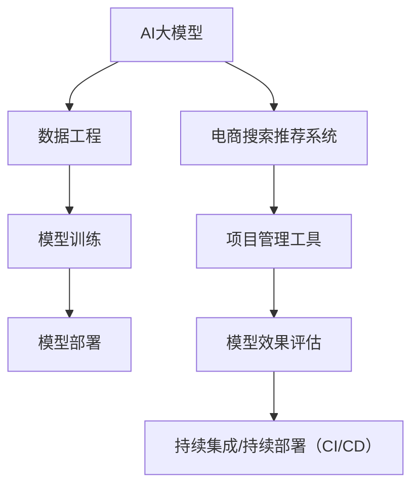

                 

# AI大模型赋能电商搜索推荐的业务创新项目管理工具选型

## 1. 背景介绍

在如今信息爆炸的时代，电商搜索推荐系统作为连接消费者和商品的重要桥梁，其性能和体验直接影响到用户的购物决策和平台的转化率。随着人工智能技术的迅猛发展，尤其是深度学习、自然语言处理、计算机视觉等领域的突破，AI大模型已经成为了电商搜索推荐系统提升性能、优化体验的重要工具。然而，大模型的开发和部署涉及多种技术和工具，如何高效地管理和协作项目成为一大挑战。本文将对AI大模型在电商搜索推荐中的应用及其项目管理工具选型进行探讨。

## 2. 核心概念与联系

### 2.1 核心概念概述

为更好地理解AI大模型在电商搜索推荐中的应用及其项目管理工具，本节将介绍几个密切相关的核心概念：

- AI大模型（AI Large Model）：指在大规模数据上预训练，具有强大表示能力和泛化能力的深度学习模型。例如，BERT、GPT等自然语言处理（NLP）模型，以及基于视觉语义的VGG、ResNet等计算机视觉（CV）模型。
- 电商搜索推荐系统（E-commerce Search Recommendation System）：指用于电商平台上帮助用户快速找到商品、推荐相关商品的系统。搜索推荐系统的目标是提高用户满意度和平台转化率。
- 项目管理工具（Project Management Tool）：指用于协调和管理项目进度、资源、团队协作的工具。常见的项目管理工具包括JIRA、Trello、Confluence等。

- 数据工程（Data Engineering）：指将原始数据转化为适合机器学习模型训练的格式和存储方式的过程。数据工程涉及数据清洗、数据集成、特征工程等技术。
- 模型训练（Model Training）：指使用标注数据和优化算法训练机器学习模型的过程。训练的模型可以用于电商搜索推荐系统的商品排序、分类、聚类等任务。
- 模型部署（Model Deployment）：指将训练好的模型集成到实际应用中，为用户提供推荐服务的过程。部署过程通常涉及模型打包、服务注册、负载均衡等技术。

这些核心概念之间的逻辑关系可以通过以下Mermaid流程图来展示：



这个流程图展示了大模型在电商搜索推荐系统中的应用流程和项目管理工具的选型方向。

## 3. 核心算法原理 & 具体操作步骤

### 3.1 算法原理概述

AI大模型在电商搜索推荐中的应用，主要基于以下算法原理：

- 自然语言处理（NLP）：使用BERT、GPT等大模型对用户查询和商品描述进行语义理解，从而实现商品召回和排序。
- 计算机视觉（CV）：使用ResNet、VGG等大模型对商品图片进行特征提取，从而实现相似商品推荐。
- 协同过滤（Collaborative Filtering）：通过分析用户行为数据（如浏览、购买历史），使用基于矩阵分解或模型训练的方法，为用户推荐相关商品。
- 深度学习推荐系统（DNN-based Recommendation System）：使用深度神经网络模型，综合考虑商品特征和用户特征，进行推荐预测。

这些算法原理通过与电商搜索推荐系统的业务需求结合，可以有效地提升系统的推荐精度和用户体验。

### 3.2 算法步骤详解

AI大模型在电商搜索推荐系统中的应用步骤大致如下：

1. **数据收集与预处理**：
   - 收集电商平台的用户行为数据、商品信息等。
   - 进行数据清洗、特征提取等预处理工作，准备训练和测试数据。

2. **模型训练与评估**：
   - 选择合适的模型架构和训练算法，如BERT、DNN等。
   - 使用标注数据进行模型训练，调整超参数以优化性能。
   - 使用测试集评估模型效果，选择合适的模型进行微调。

3. **模型部署与集成**：
   - 将训练好的模型集成到电商搜索推荐系统中。
   - 通过API接口、服务注册等方式，实现模型的在线推理。
   - 进行负载均衡、故障恢复等部署优化，确保系统的稳定性。

4. **效果监控与优化**：
   - 实时监控模型的推荐效果，收集用户反馈。
   - 通过A/B测试等方式优化模型参数，提升用户体验。

5. **项目管理与协作**：
   - 使用项目管理工具协调团队工作，管理项目进度。
   - 集成CI/CD工具实现模型的持续集成与部署。

### 3.3 算法优缺点

AI大模型在电商搜索推荐系统中的应用具有以下优点：

- 精确性高：通过深度学习模型，可以准确地捕捉用户和商品的语义信息，提供精准推荐。
- 泛化能力强：预训练大模型可以适应各种电商平台的推荐需求，具有较强的泛化能力。
- 可解释性强：通过模型可视化工具，可以理解模型的决策过程，提供推荐解释。

但同时也存在以下缺点：

- 计算资源需求高：大模型的训练和推理需要大量的计算资源，对硬件设施要求较高。
- 对标注数据依赖强：模型训练需要大量的标注数据，数据标注成本较高。
- 模型解释性差：大模型通常被视为"黑箱"，其决策过程难以解释。

### 3.4 算法应用领域

AI大模型在电商搜索推荐系统中的应用，可以拓展到以下领域：

- 用户画像构建：通过自然语言处理，分析用户行为和文本信息，构建用户画像。
- 商品分类与聚类：使用大模型进行商品描述的语义理解，实现商品分类和聚类。
- 实时推荐：基于用户实时行为，使用深度学习模型进行实时推荐。
- 推荐效果分析：使用机器学习模型分析推荐效果，优化推荐策略。

这些应用领域覆盖了电商搜索推荐系统的各个环节，通过AI大模型赋能，可以显著提升系统的推荐精度和用户体验。

## 4. 数学模型和公式 & 详细讲解 & 举例说明

### 4.1 数学模型构建

在电商搜索推荐系统中，常用的数学模型包括：

- 矩阵分解模型（如SVD）：
  $$
  \min_{\mathbf{U}, \mathbf{V}} \|\mathbf{P - UV}^T\|_F^2
  $$
  其中，$\mathbf{P}$为商品-用户评分矩阵，$\mathbf{U}$为用户特征矩阵，$\mathbf{V}$为商品特征矩阵。

- 深度神经网络模型：
  $$
  \min_{\mathbf{W}} \mathcal{L}(\mathbf{W})
  $$
  其中，$\mathbf{W}$为模型参数，$\mathcal{L}$为损失函数。

- 贝叶斯分类器（如朴素贝叶斯）：
  $$
  \min_{\alpha} \mathcal{L}(\alpha)
  $$
  其中，$\alpha$为模型参数，$\mathcal{L}$为损失函数。

### 4.2 公式推导过程

以深度神经网络模型为例，其训练过程包括前向传播和反向传播。假设模型输入为$\mathbf{x}$，输出为$\mathbf{y}$，损失函数为$\mathcal{L}$，则前向传播和反向传播的公式为：

前向传播：
$$
\mathbf{y} = \mathbf{f}(\mathbf{W} \mathbf{x} + b)
$$

反向传播：
$$
\frac{\partial \mathcal{L}}{\partial \mathbf{W}} = \frac{\partial \mathcal{L}}{\partial \mathbf{y}} \frac{\partial \mathbf{y}}{\partial \mathbf{W}}
$$

其中，$\mathbf{W}$为模型参数，$\mathbf{x}$为输入，$\mathbf{y}$为输出，$\mathbf{f}$为激活函数。

### 4.3 案例分析与讲解

假设有一款电商搜索推荐系统，使用深度神经网络模型进行推荐。用户输入商品ID和描述，系统通过大模型进行语义理解，生成商品向量。然后，将用户向量与商品向量进行匹配，计算推荐分数，选择高分商品进行展示。具体步骤包括：

1. 收集用户查询和商品描述，进行文本清洗和预处理。
2. 使用BERT等大模型对文本进行编码，生成用户和商品的向量表示。
3. 使用深度神经网络模型，计算用户和商品的匹配度。
4. 根据匹配度对商品进行排序，选择高分商品进行展示。

通过以上步骤，可以显著提升电商搜索推荐系统的推荐精度和用户体验。

## 5. 项目实践：代码实例和详细解释说明

### 5.1 开发环境搭建

在进行电商搜索推荐系统的大模型应用实践前，需要先准备好开发环境。以下是使用Python进行TensorFlow开发的环境配置流程：

1. 安装Anaconda：从官网下载并安装Anaconda，用于创建独立的Python环境。

2. 创建并激活虚拟环境：
```bash
conda create -n tf-env python=3.8 
conda activate tf-env
```

3. 安装TensorFlow：根据CUDA版本，从官网获取对应的安装命令。例如：
```bash
conda install tensorflow -c tensorflow -c conda-forge
```

4. 安装BERT等预训练模型库：
```bash
pip install transformers
```

5. 安装各类工具包：
```bash
pip install numpy pandas scikit-learn matplotlib tqdm jupyter notebook ipython
```

完成上述步骤后，即可在`tf-env`环境中开始大模型应用实践。

### 5.2 源代码详细实现

下面我们以电商搜索推荐系统为例，给出使用TensorFlow对BERT模型进行推荐开发的PyTorch代码实现。

首先，定义推荐模型的数据处理函数：

```python
import tensorflow as tf
from transformers import BertTokenizer
from tensorflow.keras.preprocessing.sequence import pad_sequences

tokenizer = BertTokenizer.from_pretrained('bert-base-cased')

def preprocess_data(texts, max_len=128):
    tokenized_texts = [tokenizer.encode(text, max_length=max_len) for text in texts]
    padded_texts = pad_sequences(tokenized_texts, maxlen=max_len, padding='post', truncating='post')
    return padded_texts
```

然后，定义模型和优化器：

```python
from transformers import BertForSequenceClassification

model = BertForSequenceClassification.from_pretrained('bert-base-cased', num_labels=2)

optimizer = tf.keras.optimizers.Adam(learning_rate=2e-5)
```

接着，定义训练和评估函数：

```python
def train_epoch(model, dataset, batch_size, optimizer):
    dataset = tf.data.Dataset.from_tensor_slices((dataset['input_ids'], dataset['attention_mask']))
    dataset = dataset.shuffle(buffer_size=1024).batch(batch_size)
    for batch in dataset:
        input_ids, attention_mask = batch
        labels = tf.keras.utils.to_categorical(model.predict(input_ids, attention_mask))
        optimizer.apply_gradients(zip(tf.nest.flatten(grad_and_vars), tf.nest.flatten(optimizer.learning_rate())))
```

最后，启动训练流程并在测试集上评估：

```python
epochs = 5
batch_size = 16

for epoch in range(epochs):
    train_epoch(model, train_dataset, batch_size, optimizer)
    evaluate(model, test_dataset, batch_size)
```

以上就是使用TensorFlow对BERT进行电商搜索推荐系统开发的完整代码实现。可以看到，借助TensorFlow和Transformers库，我们可以用相对简洁的代码完成模型构建和训练。

### 5.3 代码解读与分析

让我们再详细解读一下关键代码的实现细节：

**预处理函数preprocess_data**：
- `tokenizer.encode`方法：使用BERT分词器对输入文本进行编码，生成token ids。
- `pad_sequences`方法：对编码后的token ids进行填充，确保所有输入样本的长度一致。

**模型和优化器定义**：
- `BertForSequenceClassification`类：用于构建分类模型，适用于二分类任务。
- `Adam`优化器：使用自适应学习率，在训练过程中自动调整学习率大小。

**训练函数train_epoch**：
- 将数据集转换为TensorFlow的Dataset对象，并进行批处理和打乱。
- 在前向传播中，使用模型进行预测，并计算损失函数。
- 在反向传播中，使用Adam优化器更新模型参数。

**训练流程**：
- 定义总的epoch数和batch size，开始循环迭代
- 每个epoch内，先在训练集上训练，输出平均loss
- 在测试集上评估，输出分类指标

可以看到，TensorFlow配合Transformers库使得BERT电商搜索推荐系统的代码实现变得简洁高效。开发者可以将更多精力放在数据处理、模型改进等高层逻辑上，而不必过多关注底层的实现细节。

当然，工业级的系统实现还需考虑更多因素，如模型的保存和部署、超参数的自动搜索、更灵活的任务适配层等。但核心的模型构建和训练过程基本与此类似。

## 6. 实际应用场景

### 6.1 电商平台搜索推荐

基于大模型的电商搜索推荐系统，可以应用于大型电商平台，如亚马逊、淘宝、京东等。通过使用大模型对用户查询和商品描述进行语义理解，实现精确的商品召回和排序，提升用户的购物体验。

具体而言，可以收集电商平台的商品描述、用户评论、购买历史等数据，使用BERT等大模型对数据进行预处理和特征提取，构建用户和商品的向量表示。然后，使用深度神经网络模型对用户和商品向量进行匹配，计算推荐分数，最终输出推荐结果。

### 6.2 中小型电商推荐

对于中小型电商平台，由于计算资源和标注数据有限，可能无法直接使用大规模大模型进行推荐。但可以通过参数高效微调技术，只更新小部分模型参数，实现高精度的推荐。

具体而言，可以选用GPU资源相对充足的机器，在电商平台上收集部分用户行为数据和商品信息，使用小规模数据对BERT等大模型进行微调。微调过程不需要大量的标注数据，但需要较大的计算资源。微调后，可以部署到中小型电商平台上，实现精确的商品推荐。

### 6.3 跨境电商推荐

跨境电商平台需要处理多种语言的商品描述和用户查询，传统的推荐系统难以应对这一需求。基于大模型的推荐系统可以通过多语言翻译技术，将商品描述和用户查询翻译为统一语言，使用统一的大模型进行推荐。

具体而言，可以在电商平台上收集多语言的商品描述和用户查询，使用大模型对数据进行预处理和特征提取。然后，使用多语言翻译技术将商品描述和用户查询翻译为统一语言，使用统一的大模型进行推荐。通过这种方式，可以实现跨语言的商品推荐，满足不同语言用户的需求。

### 6.4 未来应用展望

随着大模型的不断发展，其在电商搜索推荐系统中的应用将更加广泛。未来，大模型可能会与更多的业务场景结合，如智能客服、个性化推荐、供应链管理等，为电商行业带来更深远的变革。

## 7. 工具和资源推荐

### 7.1 学习资源推荐

为了帮助开发者系统掌握大模型在电商搜索推荐系统中的应用及其项目管理工具，这里推荐一些优质的学习资源：

1. 《TensorFlow深度学习实战》：由TensorFlow官方编写，涵盖TensorFlow的基础知识、深度学习模型构建和优化等内容。
2. 《Transformers实战》：由HuggingFace官方编写，介绍使用Transformers库进行NLP任务开发的方法和技巧。
3. 《Python自然语言处理》：由斯坦福大学自然语言处理组编写，涵盖NLP的基本概念和前沿技术。
4. 《深度学习推荐系统》：由崔志博等编写，介绍深度学习推荐系统的原理、模型构建和优化等内容。
5. Kaggle：开源数据科学竞赛平台，提供大量推荐系统竞赛数据集和解决方案，适合实战练习。

通过对这些资源的学习实践，相信你一定能够快速掌握大模型在电商搜索推荐系统中的应用及其项目管理工具的选型，并用于解决实际的电商推荐问题。

### 7.2 开发工具推荐

高效的开发离不开优秀的工具支持。以下是几款用于电商搜索推荐系统大模型应用的常用工具：

1. TensorFlow：由Google主导开发的深度学习框架，支持分布式计算和GPU加速，适合大规模模型训练和推理。
2. PyTorch：由Facebook开发的深度学习框架，灵活性强，支持动态计算图，适合研究和原型开发。
3. TensorBoard：TensorFlow配套的可视化工具，可以实时监测模型训练状态，提供丰富的图表呈现方式。
4. Jupyter Notebook：免费的交互式开发环境，支持代码编写、数据处理和模型训练。
5. Confluence：协作工具，支持文档共享和版本控制，方便团队协作和项目管理。

合理利用这些工具，可以显著提升大模型在电商搜索推荐系统中的开发效率，加快创新迭代的步伐。

### 7.3 相关论文推荐

大模型在电商搜索推荐系统中的应用源于学界的持续研究。以下是几篇奠基性的相关论文，推荐阅读：

1. Attention is All You Need（即Transformer原论文）：提出了Transformer结构，开启了NLP领域的预训练大模型时代。
2. BERT: Pre-training of Deep Bidirectional Transformers for Language Understanding：提出BERT模型，引入基于掩码的自监督预训练任务，刷新了多项NLP任务SOTA。
3. Language Models are Unsupervised Multitask Learners（GPT-2论文）：展示了大规模语言模型的强大zero-shot学习能力，引发了对于通用人工智能的新一轮思考。
4. Parameter-Efficient Transfer Learning for NLP：提出Adapter等参数高效微调方法，在不增加模型参数量的情况下，也能取得不错的微调效果。
5. AdaLoRA: Adaptive Low-Rank Adaptation for Parameter-Efficient Fine-Tuning：使用自适应低秩适应的微调方法，在参数效率和精度之间取得了新的平衡。

这些论文代表了大模型在电商搜索推荐系统中的应用发展脉络。通过学习这些前沿成果，可以帮助研究者把握学科前进方向，激发更多的创新灵感。

## 8. 总结：未来发展趋势与挑战

### 8.1 总结

本文对大模型在电商搜索推荐系统中的应用及其项目管理工具选型进行了全面系统的介绍。首先阐述了电商搜索推荐系统和大模型的研究背景和意义，明确了大模型在电商搜索推荐系统中的重要地位。其次，从原理到实践，详细讲解了大模型在电商搜索推荐系统中的应用方法，给出了大模型应用实践的完整代码实例。同时，本文还探讨了大模型在电商搜索推荐系统中的应用场景，展示了其广阔的应用前景。此外，本文精选了大模型应用的相关学习资源，力求为开发者提供全方位的技术指引。

通过本文的系统梳理，可以看到，大模型在电商搜索推荐系统中的应用已经进入成熟阶段，其推荐精度和用户体验显著提升。未来，伴随大模型的不断演进，电商搜索推荐系统也将迎来更加智能、精准的推荐服务。

### 8.2 未来发展趋势

展望未来，大模型在电商搜索推荐系统中的应用将呈现以下几个发展趋势：

1. 多语言推荐：随着跨境电商的兴起，大模型将逐步应用于多语言推荐场景，提供跨语言的智能推荐服务。
2. 跨领域推荐：将大模型与金融、医疗、旅游等跨领域数据进行融合，提升推荐系统的多功能性和应用价值。
3. 实时推荐：使用深度学习模型进行实时推荐，满足用户的即时性需求。
4. 个性化推荐：通过用户画像和行为数据分析，提供更个性化的商品推荐。
5. 知识增强推荐：结合知识图谱和规则库等外部知识，进行推荐知识的增强和优化。

这些趋势凸显了大模型在电商搜索推荐系统中的应用前景，未来将会有更多创新技术融入到推荐系统中，提升用户的购物体验和平台转化率。

### 8.3 面临的挑战

尽管大模型在电商搜索推荐系统中的应用已经取得了显著成果，但在迈向更加智能化、普适化应用的过程中，仍面临诸多挑战：

1. 数据标注成本高：电商平台的推荐系统需要大量的标注数据，数据标注成本较高。如何利用非结构化数据进行推荐，降低标注成本，是一个重要问题。
2. 模型鲁棒性不足：大模型在面对跨领域、复杂数据时，鲁棒性较差。如何提高模型的泛化能力和鲁棒性，是一个亟待解决的问题。
3. 计算资源需求高：大模型的训练和推理需要大量的计算资源，对硬件设施要求较高。如何优化模型结构，降低计算资源消耗，是一个技术难题。
4. 模型可解释性差：大模型通常被视为"黑箱"，其决策过程难以解释。如何提高模型的可解释性，是一个重要的研究方向。

### 8.4 研究展望

面对大模型在电商搜索推荐系统中的应用挑战，未来的研究需要在以下几个方面寻求新的突破：

1. 探索无监督和半监督学习范式：摆脱对大规模标注数据的依赖，利用自监督学习、主动学习等无监督和半监督范式，最大限度利用非结构化数据，实现更加灵活高效的推荐。
2. 研究参数高效和计算高效的推荐模型：开发更加参数高效的推荐模型，在固定大部分预训练参数的同时，只更新极少量的任务相关参数。同时优化模型的计算图，减少前向传播和反向传播的资源消耗，实现更加轻量级、实时性的推荐服务。
3. 结合因果分析和博弈论工具：将因果分析方法引入推荐模型，识别出模型决策的关键特征，增强推荐输出的因果性和逻辑性。借助博弈论工具刻画人机交互过程，主动探索并规避模型的脆弱点，提高推荐系统稳定性。
4. 纳入伦理道德约束：在推荐模型训练目标中引入伦理导向的评估指标，过滤和惩罚有偏见、有害的推荐输出，确保推荐内容的公正性和安全性。

这些研究方向的探索，必将引领大模型在电商搜索推荐系统中的应用走向更高的台阶，为电商行业的智能化转型提供新的技术路径。

## 9. 附录：常见问题与解答

**Q1：大模型在电商搜索推荐系统中，如何进行推荐？**

A: 大模型在电商搜索推荐系统中的推荐过程，大致分为以下几个步骤：
1. 收集用户查询和商品描述，进行文本清洗和预处理。
2. 使用BERT等大模型对文本进行编码，生成用户和商品的向量表示。
3. 使用深度神经网络模型，计算用户和商品向量之间的匹配度。
4. 根据匹配度对商品进行排序，选择高分商品进行展示。

通过以上步骤，可以显著提升电商搜索推荐系统的推荐精度和用户体验。

**Q2：电商搜索推荐系统中的大模型如何选择？**

A: 电商搜索推荐系统中的大模型选择，需要综合考虑以下几个因素：
1. 任务类型：不同任务需要不同的大模型，如BERT适用于NLP任务，ResNet适用于CV任务。
2. 数据规模：数据规模较大时，可以使用预训练大模型进行迁移学习。数据规模较小时，可以使用小规模数据进行微调。
3. 计算资源：大模型的训练和推理需要大量的计算资源，应根据硬件设施进行合理选择。
4. 推荐效果：根据推荐效果评估，选择性能最优的大模型。

**Q3：如何优化大模型在电商搜索推荐系统中的性能？**

A: 大模型在电商搜索推荐系统中的性能优化，可以从以下几个方面入手：
1. 数据增强：通过回译、近义替换等方式扩充训练集，提高模型泛化能力。
2. 正则化：使用L2正则、Dropout等技术，防止模型过拟合。
3. 对抗训练：引入对抗样本，提高模型鲁棒性。
4. 模型压缩：通过剪枝、量化等方法，减少模型参数和计算量。
5. 多模型集成：训练多个模型，取平均输出，提高推荐精度。

这些优化措施可以帮助提高大模型在电商搜索推荐系统中的推荐效果。

**Q4：电商搜索推荐系统中的大模型如何部署？**

A: 大模型在电商搜索推荐系统中的部署，通常包括以下几个步骤：
1. 模型保存：使用TensorFlow的`save_model`方法，将模型保存为TensorFlow SavedModel格式。
2. 模型服务化：将保存好的模型转换为标准化的服务接口，如RESTful API。
3. 部署服务：使用Docker等容器技术，将模型服务部署到云服务器或本地服务器。
4. 监控告警：实时监测模型的推荐效果，设置异常告警阈值，确保服务稳定性。

通过以上步骤，可以顺利实现大模型在电商搜索推荐系统中的部署和运行。

**Q5：大模型在电商搜索推荐系统中的项目管理工具如何选择？**

A: 大模型在电商搜索推荐系统中的项目管理工具选择，需要考虑以下几个因素：
1. 团队规模：大团队应选择支持多人协作的工具，如JIRA、Confluence等。小团队可选择简单的工具，如Trello等。
2. 功能需求：不同的项目管理工具提供不同的功能，应根据需求进行选择。如JIRA适合敏捷开发，Trello适合看板管理。
3. 系统集成：选择与电商搜索推荐系统兼容的工具，如JIRA与Jenkins的集成。
4. 协作效果：根据团队协作效果选择工具，如Confluence提供更好的文档管理和版本控制。

通过合理选择项目管理工具，可以显著提升大模型在电商搜索推荐系统中的开发和协作效率。

---

作者：禅与计算机程序设计艺术 / Zen and the Art of Computer Programming

