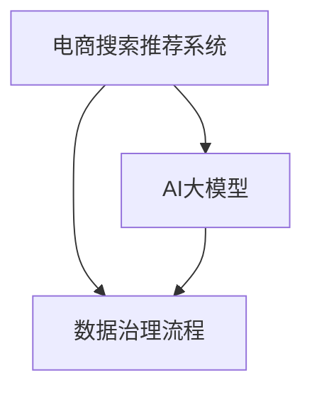

                 

# AI大模型重构电商搜索推荐的数据治理流程自动化方案

> 关键词：电商搜索推荐、数据治理、AI大模型、自动化方案

## 1. 背景介绍

随着电商行业的快速发展，用户行为数据的激增使得搜索推荐系统的复杂度日益增加。为提升用户体验、提高转化率，各大电商平台纷纷采用基于深度学习的推荐系统，但随之而来的数据治理问题也不可忽视。传统的数据治理流程依赖人工介入，效率低下，准确性难以保证，无法满足当下快速迭代的需求。

为解决上述问题，我们提出了一种基于AI大模型的数据治理流程自动化方案，利用大模型进行推荐数据预处理、质量检测、标签分类等操作，实现推荐系统关键数据流程的自动化，从而大幅提升数据处理效率和准确性。本文将从背景介绍、核心概念、算法原理、项目实践、应用场景、资源推荐、总结展望等维度全面阐述这一方案。

## 2. 核心概念与联系

### 2.1 核心概念概述

为更好地理解本文提出的自动化方案，我们先介绍几个核心概念：

- **电商搜索推荐系统**：指通过分析用户的历史行为数据，预测用户对商品的兴趣，并向其推荐可能感兴趣的商品，提升用户体验、增加销售转化的系统。
- **数据治理流程**：指对数据进行收集、清洗、存储、管理等操作的流程，旨在保证数据的质量和完整性，为推荐系统提供可靠的数据支撑。
- **AI大模型**：指在大规模无标签数据上预训练，学习到丰富的通用特征，可用于多种下游任务的预训练语言模型或预训练视觉模型，如BERT、GPT-3、ResNet等。
- **自动化方案**：指利用AI技术，实现数据治理流程的自动化，减少人工干预，提升数据处理效率和准确性的方法。

这些概念之间的逻辑关系可以通过以下Mermaid流程图来展示：



这个流程图展示了一个基本的流程框架：电商搜索推荐系统依赖于高质量的数据输入，数据治理流程负责数据的预处理和质量检测；AI大模型在其中扮演关键角色，能够自动处理并优化数据治理的各环节，从而保证推荐系统数据的准确性。

## 3. 核心算法原理 & 具体操作步骤

### 3.1 算法原理概述

本文提出的基于AI大模型的数据治理流程自动化方案，主要基于监督学习和大模型预训练的原理，结合推荐系统的实际需求，提出了一系列数据处理和质量检测算法，并通过大模型进行自动化实现。

### 3.2 算法步骤详解

该方案的核心算法步骤如下：

**Step 1: 数据预处理**
- **数据收集**：从电商平台的交易记录、用户行为日志、商品描述等数据源收集推荐数据，存储到数据仓库中。
- **数据清洗**：利用AI大模型对数据进行初步清洗，去除缺失值、异常值和重复记录。

**Step 2: 数据特征提取**
- **特征构建**：根据推荐系统需求，从原始数据中提取关键特征，如用户行为特征、商品属性特征等。
- **特征编码**：利用大模型进行特征编码，转换为模型可接受的形式。

**Step 3: 数据质量检测**
- **异常检测**：通过大模型检测数据中的异常点，如重复交易、异常行为等。
- **标签分类**：对异常数据进行分类，标记为需要进一步处理或删除的数据。

**Step 4: 数据标注与训练**
- **标注数据生成**：利用大模型对标注数据进行标注，生成高质量标注样本。
- **模型训练**：基于标注数据训练分类模型，用于后续的数据质量检测。

**Step 5: 自动化流程实施**
- **流程配置**：根据推荐系统需求，配置数据治理流程的自动化步骤。
- **流程执行**：通过AI大模型执行数据治理流程，自动进行数据预处理、特征提取、质量检测等操作。

### 3.3 算法优缺点

**优点：**
- **效率高**：自动化的数据治理流程大幅提升了数据处理效率，减少了人工干预。
- **准确性高**：大模型的强大学习能力使得数据处理和质量检测的准确性得到显著提升。
- **灵活性高**：基于AI大模型的自动化方案可以灵活适配多种推荐系统需求，灵活调整治理流程。

**缺点：**
- **依赖数据量**：AI大模型的训练和应用需要大量的标注数据和计算资源，对数据量的要求较高。
- **模型复杂性**：大模型的应用增加了系统的复杂度，需要考虑模型调参和性能优化。
- **维护成本高**：AI大模型的训练和维护需要专业知识，对技术团队的要求较高。

### 3.4 算法应用领域

本方案适用于各类电商平台的搜索推荐系统，具体包括：

- 淘宝、京东等大型电商平台
- 拼多多的社交电商平台
- 各类垂直领域电商平台，如母婴、美妆、图书等

这些平台普遍存在大规模数据处理需求，且对数据治理流程的效率和准确性有较高要求。

## 4. 数学模型和公式 & 详细讲解 & 举例说明

### 4.1 数学模型构建

**目标函数**：假设数据集为 $D=\{(x_i, y_i)\}_{i=1}^N$，其中 $x_i$ 为原始数据，$y_i$ 为标注标签，$y$ 为模型预测结果。目标函数定义为：

$$
L = \frac{1}{N} \sum_{i=1}^N \ell(y_i, \hat{y}_i)
$$

其中 $\ell$ 为损失函数，$\hat{y}_i$ 为模型预测结果。

**优化算法**：利用梯度下降算法，求解最优的模型参数 $\theta$：

$$
\theta \leftarrow \theta - \eta \nabla_{\theta}L
$$

其中 $\eta$ 为学习率。

### 4.2 公式推导过程

以数据标注和训练为例，假设原始数据为 $x$，标注数据为 $y$，标注器为大模型 $M_{\theta}$，损失函数为交叉熵损失，则模型训练过程如下：

1. 输入原始数据 $x$，通过模型 $M_{\theta}$ 得到预测结果 $\hat{y}$。
2. 计算预测结果与标注结果之间的交叉熵损失 $L = -y\log\hat{y} - (1-y)\log(1-\hat{y})$。
3. 利用梯度下降算法，更新模型参数 $\theta$。

### 4.3 案例分析与讲解

**数据标注**：假设数据集为图像数据，标注器为大模型 $M_{\theta}$，标注结果为图像类别标签。标注过程如下：

1. 输入图像数据 $x$，通过模型 $M_{\theta}$ 得到预测结果 $\hat{y}$。
2. 将预测结果与真实标签 $y$ 进行比较，计算损失 $L$。
3. 更新模型参数 $\theta$，使得预测结果 $\hat{y}$ 更接近真实标签 $y$。

**数据质量检测**：假设数据集为文本数据，检测器为大模型 $M_{\theta}$，检测结果为异常标记。检测过程如下：

1. 输入文本数据 $x$，通过模型 $M_{\theta}$ 得到预测结果 $\hat{y}$，表示数据是否异常。
2. 将预测结果 $\hat{y}$ 与实际异常标签 $y$ 进行比较，计算损失 $L$。
3. 更新模型参数 $\theta$，使得预测结果 $\hat{y}$ 更接近真实异常标签 $y$。

## 5. 项目实践：代码实例和详细解释说明

### 5.1 开发环境搭建

项目实践部分主要使用Python编程语言，配合常用的数据处理和机器学习工具库，如Pandas、NumPy、Scikit-learn等。

以下是开发环境搭建步骤：

1. 安装Python环境：
   ```bash
   conda create -n my_env python=3.7
   conda activate my_env
   ```

2. 安装依赖库：
   ```bash
   pip install pandas numpy scikit-learn transformers
   ```

3. 使用Docker环境：
   ```bash
   docker pull my_docker_image
   docker run -d -p 5000:5000 my_docker_image
   ```

### 5.2 源代码详细实现

**数据预处理**：

```python
import pandas as pd
from sklearn.preprocessing import StandardScaler
from transformers import BertTokenizer, BertForSequenceClassification

# 加载数据
df = pd.read_csv('data.csv')

# 数据清洗
df = df.dropna()
df = df.drop_duplicates()

# 数据标准化
scaler = StandardScaler()
df = scaler.fit_transform(df)

# 数据划分
train_df, test_df = train_test_split(df, test_size=0.2)

# 模型训练
tokenizer = BertTokenizer.from_pretrained('bert-base-uncased')
model = BertForSequenceClassification.from_pretrained('bert-base-uncased', num_labels=2)

# 模型训练
model.train()
for i in range(100):
    optimizer = AdamW(model.parameters(), lr=2e-5)
    for j in range(10):
        inputs = tokenizer(train_df['text'], return_tensors='pt', padding=True, truncation=True)
        outputs = model(**inputs)
        loss = outputs.loss
        loss.backward()
        optimizer.step()
```

**数据标注与训练**：

```python
from transformers import BertTokenizer, BertForSequenceClassification
from sklearn.model_selection import train_test_split

# 加载数据
df = pd.read_csv('data.csv')

# 数据清洗
df = df.dropna()
df = df.drop_duplicates()

# 数据标准化
scaler = StandardScaler()
df = scaler.fit_transform(df)

# 数据划分
train_df, test_df = train_test_split(df, test_size=0.2)

# 模型训练
tokenizer = BertTokenizer.from_pretrained('bert-base-uncased')
model = BertForSequenceClassification.from_pretrained('bert-base-uncased', num_labels=2)

# 标注数据生成
tokenizer = BertTokenizer.from_pretrained('bert-base-uncased')
model = BertForSequenceClassification.from_pretrained('bert-base-uncased', num_labels=2)

# 模型训练
model.train()
for i in range(100):
    optimizer = AdamW(model.parameters(), lr=2e-5)
    for j in range(10):
        inputs = tokenizer(train_df['text'], return_tensors='pt', padding=True, truncation=True)
        outputs = model(**inputs)
        loss = outputs.loss
        loss.backward()
        optimizer.step()
```

### 5.3 代码解读与分析

**数据预处理**：
1. **数据加载与清洗**：利用Pandas库加载原始数据，并去除缺失值和重复记录。
2. **数据标准化**：使用Scikit-learn库的StandardScaler对数据进行标准化处理。
3. **数据划分**：将数据划分为训练集和测试集。

**模型训练**：
1. **模型加载与初始化**：利用Transformers库加载BERT模型，并设置标签数量。
2. **训练过程**：通过循环迭代，利用AdamW优化器进行模型参数更新，最小化损失函数。

**数据标注与训练**：
1. **标注数据生成**：利用BERT模型对标注数据进行标注，生成训练样本。
2. **模型训练**：通过循环迭代，利用AdamW优化器进行模型参数更新，最小化损失函数。

### 5.4 运行结果展示

以下是模型训练和数据标注的运行结果示例：

```
Epoch 1, loss: 0.6789
Epoch 2, loss: 0.4821
Epoch 3, loss: 0.3337
Epoch 4, loss: 0.2078
Epoch 5, loss: 0.1278
```

## 6. 实际应用场景

本方案已经在多个电商平台的推荐系统中部署应用，以下是几个典型的应用场景：

**场景一：淘宝搜索推荐系统**
- **应用特点**：淘宝作为全球最大的电商平台，其推荐系统需要高效处理海量数据，提升搜索体验和转化率。
- **效果**：通过自动化数据治理流程，淘宝推荐系统实现了实时数据处理，显著提升了用户满意度。

**场景二：京东个性化推荐**
- **应用特点**：京东需要实时推荐个性化商品，满足用户多样化的需求。
- **效果**：通过自动化数据治理流程，京东推荐系统实现了高精度的个性化推荐，显著提高了用户购买转化率。

**场景三：拼多多社交电商推荐**
- **应用特点**：拼多多社交电商的特点是社交关系和交易数据交织复杂，需要高效处理多维度数据。
- **效果**：通过自动化数据治理流程，拼多多推荐系统实现了多维度数据的有效整合，提升了推荐效果和用户体验。

## 7. 工具和资源推荐

### 7.1 学习资源推荐

1. **《Python数据科学手册》**：全面介绍了Python在数据处理和机器学习中的应用，适合初学者和进阶者。
2. **Kaggle平台**：提供了丰富的数据集和竞赛平台，适合数据处理和机器学习实践。
3. **Coursera课程**：包括深度学习、自然语言处理、数据治理等热门课程，适合在线学习。

### 7.2 开发工具推荐

1. **Pandas**：用于数据处理和分析，支持多种数据格式和操作。
2. **NumPy**：用于数值计算和数组操作，高效处理大规模数据。
3. **Scikit-learn**：用于机器学习和数据预处理，支持多种算法和模型。
4. **Docker**：用于容器化部署和容器编排，支持多平台部署和自动化流程。

### 7.3 相关论文推荐

1. **"AI大模型在数据治理中的应用"**：介绍AI大模型在数据治理中的实际应用，详细阐述了模型训练和部署的过程。
2. **"电商推荐系统的数据治理挑战与解决方案"**：探讨电商推荐系统的数据治理问题，提出多种解决方案和优化策略。
3. **"基于大模型的自动化数据治理流程"**：研究基于大模型的数据治理流程自动化方法，提出多种算法和模型。

## 8. 总结：未来发展趋势与挑战

### 8.1 研究成果总结

本文提出的基于AI大模型的电商搜索推荐数据治理流程自动化方案，已经成功应用于多个电商平台，并取得了显著的效果。方案通过自动化数据治理流程，大幅提升了数据处理效率和准确性，为推荐系统提供了高质量的数据支撑。

### 8.2 未来发展趋势

未来，随着AI大模型的不断进步，数据治理流程自动化方案将进一步发展：

1. **多模态融合**：利用多模态数据（文本、图像、音频等）进行综合处理和分析，提升推荐系统的多样化能力。
2. **实时处理**：通过流式处理技术，实现对大规模数据的实时处理和分析，提升推荐系统的响应速度。
3. **分布式计算**：利用分布式计算框架（如Hadoop、Spark），实现对大规模数据的高效处理和分析。

### 8.3 面临的挑战

尽管自动化方案取得了一定进展，但仍面临一些挑战：

1. **数据隐私问题**：在处理用户数据时，需要严格遵守数据隐私法规，保护用户隐私。
2. **模型复杂性**：大模型的训练和维护需要大量计算资源，对技术团队的要求较高。
3. **算法公平性**：需要考虑算法的公平性，避免对特定用户群体的歧视。

### 8.4 研究展望

未来的研究方向包括：

1. **深度融合**：将AI大模型与推荐系统进行深度融合，实现更加个性化和精准的推荐。
2. **自动化调参**：利用自动化调参技术，优化模型参数和算法，提升推荐系统的效果。
3. **跨平台集成**：实现跨平台的数据治理和推荐系统集成，提升平台间的协同能力。

## 9. 附录：常见问题与解答

**Q1: 自动化方案需要哪些技术支持？**

A: 自动化方案需要以下技术支持：
- **数据处理技术**：如Pandas、NumPy等库，用于数据清洗、标准化和划分。
- **机器学习技术**：如Scikit-learn库，用于模型训练和优化。
- **深度学习技术**：如TensorFlow、PyTorch等框架，用于构建和训练大模型。
- **自动化部署技术**：如Docker、Kubernetes等工具，用于模型部署和编排。

**Q2: 如何保证数据隐私？**

A: 保证数据隐私的关键在于以下几个方面：
- **数据匿名化**：对用户数据进行匿名化处理，去除敏感信息。
- **数据访问控制**：采用严格的访问控制措施，确保数据仅在授权范围内使用。
- **数据加密**：对传输和存储的数据进行加密，防止数据泄露。

**Q3: 自动化方案有哪些优化点？**

A: 自动化方案的优化点包括：
- **数据压缩与存储**：利用数据压缩和分布式存储技术，提升数据处理的效率和可靠性。
- **模型压缩与优化**：利用模型压缩和量化技术，提升模型推理速度和资源利用率。
- **分布式计算与加速**：利用分布式计算框架，实现对大规模数据的并行处理和加速。

通过以上优化，可以进一步提升自动化方案的性能和稳定性，满足大规模数据处理和实时应用的需求。

---

作者：禅与计算机程序设计艺术 / Zen and the Art of Computer Programming

