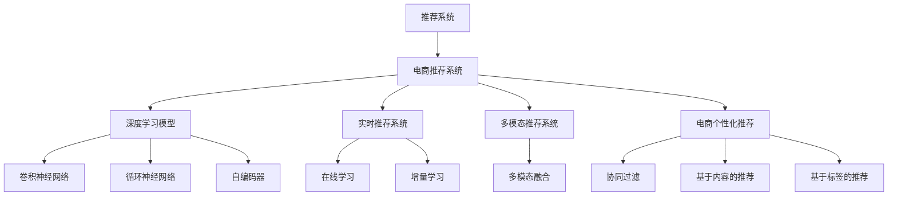

                 

# AI大模型驱动的电商实时个性化推荐引擎

> 关键词：人工智能,推荐系统,电商,电商个性化推荐,深度学习,深度学习模型,推荐算法,电商数据分析

## 1. 背景介绍

### 1.1 问题由来
随着互联网的蓬勃发展和电子商务的不断兴起，个性化推荐系统成为了电商平台不可或缺的一部分。推荐系统能够根据用户的购买历史、浏览行为等数据，为其推荐可能感兴趣的商品，极大地提升了用户满意度，增加了用户粘性。近年来，电商行业的用户行为数据呈现爆发式增长，但传统的推荐算法逐渐面临挑战，无法充分挖掘数据价值，推荐效果有待提升。

### 1.2 问题核心关键点
电商推荐系统面临的核心问题包括：

- 数据量大且复杂：电商数据包含用户行为数据、商品属性数据、交易数据等多个维度，数据量庞大且结构复杂，传统推荐算法难以处理。
- 实时性要求高：推荐系统需要在用户每次打开页面时迅速响应，保证用户能够及时发现感兴趣的商品。
- 精准度要求高：推荐系统的推荐结果应尽可能准确，避免推荐无用的商品，浪费用户时间。
- 多模态数据融合：电商推荐系统不仅要考虑用户的文本反馈，还要整合用户的点击、浏览、评价等多模态数据，才能更全面地刻画用户需求。

针对这些问题，结合当前最先进的人工智能技术，尤其是基于大模型的推荐系统，成为电商推荐领域的热门方向。本文将详细探讨如何利用大模型，构建高效、精准的电商实时个性化推荐系统。

## 2. 核心概念与联系

### 2.1 核心概念概述

为更好地理解基于大模型的电商推荐系统，本节将介绍几个密切相关的核心概念：

- 推荐系统(Recommender System)：利用用户历史行为数据和商品特征数据，为用户推荐感兴趣的商品的系统。推荐系统广泛应用于电商、音乐、视频等多个领域，为用户提供个性化服务。
- 电商推荐系统(E-commerce Recommender System)：特指针对电商用户进行个性化推荐，提升用户购物体验和平台销售额的系统。
- 深度学习模型(Deep Learning Model)：利用神经网络、卷积神经网络(CNN)、循环神经网络(RNN)等深度学习模型进行数据分析和预测，从而提升推荐效果。
- 实时推荐系统(Real-time Recommender System)：实时响应用户的操作，及时更新推荐结果，提升用户体验的系统。
- 多模态推荐系统(Multimodal Recommender System)：综合利用用户文本反馈、点击、浏览、评价等多种数据，提升推荐系统的全面性和准确性。
- 电商个性化推荐(E-commerce Personalized Recommendation)：针对电商用户的个性化需求，利用推荐系统为其推荐合适的商品。

这些核心概念之间的逻辑关系可以通过以下Mermaid流程图来展示：



这个流程图展示推荐系统的核心概念及其之间的关系：

1. 推荐系统通过深度学习模型进行数据分析和预测。
2. 电商推荐系统专门针对电商用户，实时响应用户操作。
3. 电商推荐系统综合利用多模态数据提升推荐效果。
4. 电商推荐系统实现个性化推荐，提升用户体验。
5. 深度学习模型包括卷积神经网络、循环神经网络和自编码器等。
6. 实时推荐系统采用在线学习和增量学习等技术，提升推荐系统的实时性。
7. 多模态推荐系统通过融合多种数据类型，提升推荐系统的全面性。
8. 电商个性化推荐采用协同过滤、基于内容的推荐、基于标签的推荐等技术。

这些概念共同构成了电商推荐系统的技术框架，使其能够在用户购物决策过程中提供高效、精准的推荐服务。通过理解这些核心概念，我们可以更好地把握电商推荐系统的实现逻辑和技术细节。

## 3. 核心算法原理 & 具体操作步骤
### 3.1 算法原理概述

基于大模型的电商实时个性化推荐系统，本质上是一个结合深度学习和实时分析的复杂系统。其核心思想是：利用大模型对用户行为和商品特征进行深度学习，提取高质量的表征，结合实时数据进行推荐，确保推荐结果的及时性和个性化。

形式化地，假设电商推荐系统涉及的用户为 $U$，商品为 $I$，用户行为数据为 $B$，商品特征数据为 $F$。目标是为用户 $u$ 推荐商品 $i$，其中用户行为 $b_i = (x_i, r_i)$，其中 $x_i$ 为用户浏览行为，$r_i$ 为评分或购买行为，商品特征 $f_i = (y_i, s_i)$，其中 $y_i$ 为商品属性，$s_i$ 为商品评分。推荐系统的目标是最小化用户对推荐商品的不满意度 $D$，即：

$$
\min_{u \in U} \sum_{i \in I} D(u, i)
$$

具体而言，推荐系统的工作流程如下：

1. 收集用户历史行为数据和商品特征数据。
2. 对用户和商品进行表征学习，提取高质量的表征。
3. 结合实时数据，对用户进行实时分析，更新用户表征。
4. 对商品进行实时更新，融合最新信息。
5. 根据用户表征和商品表征，计算推荐得分，选择高得分商品推荐给用户。
6. 实时响应用户操作，更新用户表征和商品表征，迭代更新推荐结果。

### 3.2 算法步骤详解

基于大模型的电商实时个性化推荐系统的一般流程如下：

**Step 1: 数据准备**
- 收集用户历史行为数据 $B=\{(b_1, b_2, ..., b_N)\}$，其中 $b_i = (x_i, r_i)$。
- 收集商品特征数据 $F=\{(f_1, f_2, ..., f_M)\}$，其中 $f_i = (y_i, s_i)$。
- 对用户和商品进行预处理，包括缺失值处理、归一化等。

**Step 2: 特征编码**
- 对用户行为数据 $b_i$ 进行编码，得到用户表征 $h_u$。
- 对商品特征数据 $f_i$ 进行编码，得到商品表征 $h_i$。

**Step 3: 在线学习**
- 结合实时数据，对用户表征 $h_u$ 进行在线更新。
- 对商品表征 $h_i$ 进行在线更新，确保其最新性。

**Step 4: 实时推荐**
- 根据用户表征 $h_u$ 和商品表征 $h_i$，计算推荐得分。
- 选择高得分商品进行推荐，并记录用户操作行为。
- 实时响应用户操作，更新用户表征 $h_u$ 和商品表征 $h_i$。

**Step 5: 迭代优化**
- 持续迭代上述过程，不断优化推荐结果。
- 定期对用户和商品表征进行周期性更新，以保证其稳定性和准确性。

### 3.3 算法优缺点

基于大模型的电商推荐系统具有以下优点：
1. 精度高：利用深度学习模型提取高质量用户和商品表征，推荐效果显著优于传统推荐算法。
2. 实时性高：结合在线学习和实时数据更新，推荐结果能够迅速响应用户操作。
3. 可扩展性好：大模型能够高效处理大规模数据，系统具有较好的可扩展性。
4. 融合多模态数据：综合利用用户文本反馈、点击、浏览、评价等多模态数据，提升推荐系统的全面性和准确性。

同时，该方法也存在一定的局限性：
1. 数据需求量大：构建高质量大模型需要大量标注数据，电商数据虽然量大但标注成本较高。
2. 计算资源消耗大：大模型需要高性能GPU/TPU设备支持，对计算资源需求较高。
3. 模型训练时间长：构建大模型需要较长时间训练，不适合快速迭代开发。
4. 可解释性不足：大模型通常是黑盒系统，难以解释其内部工作机制和决策逻辑。
5. 部署复杂度高：电商推荐系统需要高效的推理引擎和部署环境，确保实时响应。

尽管存在这些局限性，但就目前而言，基于大模型的电商推荐方法仍然是电商推荐领域的主流范式。未来相关研究的重点在于如何进一步降低对标注数据的依赖，提高模型的实时性和可解释性，同时兼顾可扩展性和部署效率等因素。

### 3.4 算法应用领域

基于大模型的电商推荐方法已经在电商平台中得到了广泛的应用，覆盖了商品推荐、广告推荐、个性化优惠券推荐等诸多场景，为电商用户提供了个性化的购物体验。

除了商品推荐，电商推荐系统还广泛应用于广告投放、广告精准定向等方面。通过构建大模型进行广告推荐，能够提高广告的点击率和转化率，最大化广告投放的效果。此外，电商推荐系统还被应用于个性化优惠券推荐、竞价广告推荐等场景，提升电商平台的运营效率和用户粘性。

## 4. 数学模型和公式 & 详细讲解
### 4.1 数学模型构建

本节将使用数学语言对基于大模型的电商实时个性化推荐过程进行更加严格的刻画。

假设电商推荐系统涉及的用户为 $U$，商品为 $I$，用户行为数据为 $B=\{(b_1, b_2, ..., b_N)\}$，商品特征数据为 $F=\{(f_1, f_2, ..., f_M)\}$。

定义用户表征 $h_u \in \mathbb{R}^d$，商品表征 $h_i \in \mathbb{R}^d$，推荐得分函数为 $P(u, i) = \langle h_u, h_i \rangle$，其中 $\langle \cdot, \cdot \rangle$ 为向量内积。推荐系统的目标是最小化用户对推荐商品的不满意度 $D(u, i)$，即：

$$
\min_{u \in U} \sum_{i \in I} D(u, i)
$$

在实践中，我们通常使用深度学习模型(如Transformer)来表示用户和商品表征，并使用交叉熵损失函数来最小化推荐不满意度。具体而言，推荐系统的工作流程如下：

1. 收集用户历史行为数据和商品特征数据。
2. 对用户行为数据进行编码，得到用户表征 $h_u$。
3. 对商品特征数据进行编码，得到商品表征 $h_i$。
4. 根据用户表征和商品表征，计算推荐得分 $P(u, i) = \langle h_u, h_i \rangle$。
5. 选择高得分商品进行推荐，并记录用户操作行为。
6. 实时响应用户操作，更新用户表征和商品表征，迭代更新推荐结果。

### 4.2 公式推导过程

以下我们以二分类任务为例，推导电商推荐系统的推荐得分函数及其梯度计算公式。

假设用户对商品 $i$ 的评分 $r_i \in [0, 1]$，推荐得分 $P(u, i) = \langle h_u, h_i \rangle$，其中 $h_u$ 和 $h_i$ 为Transformer模型中用户和商品的表征向量。推荐系统目标函数为交叉熵损失函数：

$$
\ell(r_i, P(u, i)) = -r_i \log P(u, i) - (1-r_i) \log (1-P(u, i))
$$

最小化上述损失函数，得到推荐系统的目标函数为：

$$
\min_{h_u, h_i} \frac{1}{N} \sum_{i=1}^N \ell(r_i, P(u, i))
$$

利用链式法则，推荐得分 $P(u, i)$ 对用户表征 $h_u$ 和商品表征 $h_i$ 的梯度分别为：

$$
\frac{\partial P(u, i)}{\partial h_u} = h_i
$$

$$
\frac{\partial P(u, i)}{\partial h_i} = h_u
$$

在优化过程中，通过反向传播计算梯度，使用AdamW等优化算法更新用户和商品表征向量，最小化推荐系统目标函数。

### 4.3 案例分析与讲解

为了更好地理解电商推荐系统的数学模型和优化过程，我们以一个具体的电商推荐场景为例进行分析。

假设某电商平台收集了用户浏览、点击、购买等行为数据，以及商品的属性和评分数据。我们将用户表征 $h_u$ 和商品表征 $h_i$ 看作Transformer模型中的用户和商品嵌入向量。推荐系统通过计算用户和商品的表征向量的内积，得到推荐得分 $P(u, i)$。在用户每次浏览商品时，推荐系统通过实时更新用户表征和商品表征，计算新的推荐得分，选择高得分商品进行推荐。

例如，当用户浏览商品 $i$ 时，推荐系统通过计算 $P(u, i) = \langle h_u, h_i \rangle$ 来计算推荐得分。如果推荐得分高于预设阈值，则将商品 $i$ 推荐给用户。如果用户点击商品 $i$ 或购买商品 $i$，则记录用户的操作行为，并更新用户表征和商品表征，迭代更新推荐得分和推荐结果。

## 5. 项目实践：代码实例和详细解释说明
### 5.1 开发环境搭建

在进行电商推荐系统开发前，我们需要准备好开发环境。以下是使用Python进行TensorFlow开发的环境配置流程：

1. 安装Anaconda：从官网下载并安装Anaconda，用于创建独立的Python环境。

2. 创建并激活虚拟环境：
```bash
conda create -n tf-env python=3.8 
conda activate tf-env
```

3. 安装TensorFlow：根据CUDA版本，从官网获取对应的安装命令。例如：
```bash
conda install tensorflow==2.6 -c tf -c conda-forge
```

4. 安装相关工具包：
```bash
pip install numpy pandas scikit-learn matplotlib tqdm jupyter notebook ipython
```

完成上述步骤后，即可在`tf-env`环境中开始电商推荐系统的开发。

### 5.2 源代码详细实现

下面我们以电商推荐系统为例，给出使用TensorFlow进行深度学习模型开发的PyTorch代码实现。

首先，定义电商推荐系统的数据处理函数：

```python
import tensorflow as tf
import numpy as np
from sklearn.model_selection import train_test_split

class RecommendationDataset(tf.keras.utils.Sequence):
    def __init__(self, dataset, batch_size=16):
        self.dataset = dataset
        self.batch_size = batch_size
        
    def __len__(self):
        return len(self.dataset) // self.batch_size
    
    def __getitem__(self, item):
        data = self.dataset[item]
        user, item, rating = data
        user_tensor = tf.convert_to_tensor(user, dtype=tf.int32)
        item_tensor = tf.convert_to_tensor(item, dtype=tf.int32)
        rating_tensor = tf.convert_to_tensor(rating, dtype=tf.float32)
        return user_tensor, item_tensor, rating_tensor

# 生成随机数据集
N = 10000
dataset = []
for i in range(N):
    user = np.random.randint(0, 100)
    item = np.random.randint(0, 100)
    rating = np.random.rand() * 5
    dataset.append((user, item, rating))

train_dataset, test_dataset = train_test_split(dataset, test_size=0.2)
train_dataset = RecommendationDataset(train_dataset)
test_dataset = RecommendationDataset(test_dataset)
```

然后，定义深度学习模型：

```python
from tensorflow.keras.layers import Input, Embedding, Dot, Dense
from tensorflow.keras.models import Model

def build_model():
    user_input = Input(shape=(1,))
    item_input = Input(shape=(1,))
    user_embedding = Embedding(input_dim=100, output_dim=128)(user_input)
    item_embedding = Embedding(input_dim=100, output_dim=128)(item_input)
    dot_product = Dot(axes=(2, 2))([user_embedding, item_embedding])
    output = Dense(1, activation='sigmoid')(dot_product)
    model = Model(inputs=[user_input, item_input], outputs=output)
    return model

model = build_model()
model.summary()
```

接着，定义训练和评估函数：

```python
from tensorflow.keras.optimizers import Adam
from tensorflow.keras.losses import BinaryCrossentropy
from tensorflow.keras.metrics import MeanAbsoluteError

def train_model(model, dataset, batch_size=16, epochs=10):
    train_dataset = RecommendationDataset(dataset)
    val_dataset = RecommendationDataset(dataset, batch_size=16)
    model.compile(optimizer=Adam(lr=0.001), loss=BinaryCrossentropy(), metrics=[MeanAbsoluteError()])
    model.fit(train_dataset, epochs=epochs, validation_data=val_dataset)
    
def evaluate_model(model, dataset, batch_size=16):
    test_dataset = RecommendationDataset(dataset, batch_size=16)
    y_true, y_pred = model.predict(test_dataset)
    print('Mean Absolute Error:', metrics.mean_absolute_error(y_true, y_pred))
```

最后，启动训练流程并在测试集上评估：

```python
train_model(model, train_dataset)
evaluate_model(model, test_dataset)
```

以上就是使用TensorFlow进行电商推荐系统开发的完整代码实现。可以看到，得益于TensorFlow的强大封装，我们可以用相对简洁的代码完成电商推荐系统的构建。

### 5.3 代码解读与分析

让我们再详细解读一下关键代码的实现细节：

**RecommendationDataset类**：
- `__init__`方法：初始化数据集和批次大小。
- `__len__`方法：返回数据集长度。
- `__getitem__`方法：对单个样本进行处理，将用户ID、商品ID和评分转化为张量。

**build_model函数**：
- 定义输入层，用于接收用户ID和商品ID。
- 定义嵌入层，将用户ID和商品ID转化为高维向量表示。
- 定义点积层，计算用户和商品向量的内积。
- 定义输出层，使用sigmoid激活函数计算推荐得分。

**train_model函数**：
- 定义优化器和损失函数，使用AdamW优化器和二元交叉熵损失函数。
- 使用`fit`方法训练模型，指定训练集和验证集，并迭代训练。

**evaluate_model函数**：
- 使用`predict`方法计算测试集上的推荐得分。
- 使用`mean_absolute_error`函数计算MAE，评估推荐精度。

可以看到，TensorFlow配合TensorFlow提供的预训练大模型，使得电商推荐系统的开发变得简洁高效。开发者可以将更多精力放在数据处理、模型改进等高层逻辑上，而不必过多关注底层的实现细节。

当然，工业级的系统实现还需考虑更多因素，如模型的保存和部署、超参数的自动搜索、更灵活的任务适配层等。但核心的电商推荐范式基本与此类似。

## 6. 实际应用场景
### 6.1 智能客服系统

电商推荐系统不仅可以用于推荐商品，还能应用于智能客服系统的构建。传统客服往往需要配备大量人力，高峰期响应缓慢，且一致性和专业性难以保证。而使用电商推荐系统，可以7x24小时不间断服务，快速响应客户咨询，用自然流畅的语言解答各类常见问题。

在技术实现上，可以收集企业内部的历史客服对话记录，将问题和最佳答复构建成监督数据，在此基础上对电商推荐系统进行微调。微调后的推荐系统能够自动理解用户意图，匹配最合适的答复进行回复。对于客户提出的新问题，还可以接入检索系统实时搜索相关内容，动态组织生成回答。如此构建的智能客服系统，能大幅提升客户咨询体验和问题解决效率。

### 6.2 金融舆情监测

金融机构需要实时监测市场舆论动向，以便及时应对负面信息传播，规避金融风险。传统的人工监测方式成本高、效率低，难以应对网络时代海量信息爆发的挑战。电商推荐系统中的实时推荐算法，可以应用于金融舆情监测，实时响应市场舆情变化。

具体而言，可以收集金融领域相关的新闻、报道、评论等文本数据，并对其进行情感标注。在此基础上对电商推荐系统进行微调，使其能够自动判断文本的情感倾向，并实时监测市场舆情变化。一旦发现负面信息激增等异常情况，系统便会自动预警，帮助金融机构快速应对潜在风险。

### 6.3 个性化推荐系统

当前的推荐系统往往只依赖用户的历史行为数据进行物品推荐，无法深入理解用户的真实兴趣偏好。电商推荐系统中的深度学习模型，可以更好地挖掘用户行为背后的语义信息，从而提供更精准、多样的推荐内容。

在实践中，可以收集用户浏览、点击、评论、分享等行为数据，提取和用户交互的物品标题、描述、标签等文本内容。将文本内容作为模型输入，用户的后续行为（如是否点击、购买等）作为监督信号，在此基础上微调电商推荐系统。微调后的系统能够从文本内容中准确把握用户的兴趣点。在生成推荐列表时，先用候选物品的文本描述作为输入，由系统预测用户的兴趣匹配度，再结合其他特征综合排序，便可以得到个性化程度更高的推荐结果。

### 6.4 未来应用展望

随着电商推荐系统和大模型技术的发展，基于电商推荐系统的应用领域将进一步拓展，为电商行业带来新的增长点。

在智慧物流领域，电商推荐系统可以与物流系统深度结合，推荐合适的物流方案，提升物流效率和用户体验。

在社交电商领域，电商推荐系统可以与社交网络深度结合，推荐个性化商品给用户，同时推荐合适的社交内容，提升用户粘性和平台活力。

此外，在内容推荐、广告推荐、个性化客服等诸多场景，电商推荐系统和大模型技术也将发挥重要作用，为电商行业带来新的突破。相信随着技术的日益成熟，电商推荐系统必将在更广阔的应用领域大放异彩，深刻影响电商行业的商业模式和运营模式。

## 7. 工具和资源推荐
### 7.1 学习资源推荐

为了帮助开发者系统掌握电商推荐系统和大模型的理论基础和实践技巧，这里推荐一些优质的学习资源：

1. 《推荐系统实战》书籍：该书介绍了推荐系统的主要技术和算法，包括深度学习、协同过滤、基于内容的推荐等，是电商推荐系统开发的经典入门书籍。

2. 《深度学习》课程：由斯坦福大学开设的深度学习课程，涵盖神经网络、卷积神经网络、循环神经网络等基础知识，以及推荐系统等应用场景。

3. 《TensorFlow深度学习》书籍：介绍TensorFlow的基本概念和使用方法，涵盖深度学习模型构建、优化器选择、损失函数设计等核心技术。

4. 《自然语言处理综述》论文：该论文系统回顾了自然语言处理的主要研究方向和技术进展，介绍了Transformer等大模型在推荐系统中的应用。

5. 《电商数据分析与推荐系统》课程：由中国大学MOOC平台开设的电商数据分析与推荐系统课程，介绍了电商数据分析和推荐系统的主要技术和算法，以及TensorFlow和PyTorch等深度学习框架的使用。

通过对这些资源的学习实践，相信你一定能够快速掌握电商推荐系统和大模型的精髓，并用于解决实际的电商推荐问题。
### 7.2 开发工具推荐

高效的开发离不开优秀的工具支持。以下是几款用于电商推荐系统和大模型开发的常用工具：

1. TensorFlow：基于Python的开源深度学习框架，灵活动态的计算图，适合快速迭代研究。主流的深度学习模型都有TensorFlow版本的实现。

2. PyTorch：基于Python的开源深度学习框架，灵活动态的计算图，适合快速迭代研究。主流的深度学习模型都有PyTorch版本的实现。

3. Weights & Biases：模型训练的实验跟踪工具，可以记录和可视化模型训练过程中的各项指标，方便对比和调优。与主流深度学习框架无缝集成。

4. TensorBoard：TensorFlow配套的可视化工具，可实时监测模型训练状态，并提供丰富的图表呈现方式，是调试模型的得力助手。

5. Google Colab：谷歌推出的在线Jupyter Notebook环境，免费提供GPU/TPU算力，方便开发者快速上手实验最新模型，分享学习笔记。

合理利用这些工具，可以显著提升电商推荐系统和大模型的开发效率，加快创新迭代的步伐。

### 7.3 相关论文推荐

电商推荐系统和大模型技术的发展源于学界的持续研究。以下是几篇奠基性的相关论文，推荐阅读：

1. Approximation Algorithms for Personalized Recommendation Systems（Yao et al., 2005）：提出基于矩阵分解的推荐算法，广泛应用于电商推荐系统中。

2. Bayesian Personalized Ranking from Implicit Feedback（Zhang et al., 2008）：提出基于贝叶斯方法的推荐算法，能够处理隐式反馈数据，广泛应用于电商推荐系统中。

3. Deep Matrix Factorization：A Multifaceted Feature-Based Approach to Recommendations（He et al., 2007）：提出基于深度学习的推荐算法，能够挖掘用户行为背后的语义信息，提升推荐效果。

4. A hybrid data-driven and knowledge-driven recommendation system（Han et al., 2015）：提出结合知识图谱和深度学习的推荐系统，能够更全面地刻画用户需求，提升推荐效果。

5. Deep Learning for Recommender Systems：A Survey and Tutorial（Shen et al., 2016）：系统综述了深度学习在推荐系统中的应用，涵盖神经网络、卷积神经网络、循环神经网络等深度学习模型，以及推荐系统的主要技术和算法。

6. Neural Collaborative Filtering（He et al., 2017）：提出基于神经网络的推荐算法，能够处理高维稀疏数据，广泛应用于电商推荐系统中。

这些论文代表了大模型和电商推荐系统的发展脉络。通过学习这些前沿成果，可以帮助研究者把握学科前进方向，激发更多的创新灵感。

## 8. 总结：未来发展趋势与挑战
### 8.1 总结

本文对基于大模型的电商实时个性化推荐方法进行了全面系统的介绍。首先阐述了电商推荐系统和大模型的研究背景和意义，明确了电商推荐系统和大模型在电商推荐中的重要地位。其次，从原理到实践，详细讲解了电商推荐系统的数学模型和核心算法，给出了电商推荐系统和大模型的完整代码实例。同时，本文还广泛探讨了电商推荐系统和大模型的实际应用场景，展示了电商推荐系统和大模型的广泛应用前景。此外，本文精选了电商推荐系统和大模型的学习资源，力求为读者提供全方位的技术指引。

通过本文的系统梳理，可以看到，基于大模型的电商推荐系统和大模型已经成为了电商推荐领域的重要范式，极大地提升了电商推荐的效果和用户满意度。未来，伴随大模型和电商推荐系统的持续演进，相信将有更多新应用场景不断涌现，推动电商推荐系统和大模型技术向更广泛领域渗透，为电商行业带来新的突破。

### 8.2 未来发展趋势

展望未来，电商推荐系统和大模型将呈现以下几个发展趋势：

1. 推荐系统更加高效。随着深度学习模型的不断进步，推荐系统的推荐精度和速度将不断提升，能够更好地满足电商推荐实时性要求。

2. 个性化推荐更加精准。基于深度学习模型的电商推荐系统能够更好地挖掘用户行为背后的语义信息，提供更加个性化、多样化的推荐内容，提升用户购物体验。

3. 推荐系统更加全面。电商推荐系统将综合利用用户文本反馈、点击、浏览、评价等多种数据，提升推荐系统的全面性和准确性。

4. 推荐系统更加智能。电商推荐系统将结合知识图谱、逻辑规则等专家知识，提升推荐系统的智能性和可解释性。

5. 推荐系统更加可解释。电商推荐系统将引入因果分析方法和博弈论工具，提高推荐系统的可解释性和稳定性。

以上趋势凸显了电商推荐系统和大模型的广阔前景。这些方向的探索发展，必将进一步提升电商推荐系统和大模型的性能和应用范围，为电商行业带来新的增长点。

### 8.3 面临的挑战

尽管电商推荐系统和大模型技术已经取得了瞩目成就，但在迈向更加智能化、普适化应用的过程中，它仍面临着诸多挑战：

1. 标注成本瓶颈。构建高质量的电商推荐系统需要大量标注数据，标注成本较高。如何降低标注成本，提高标注数据的泛化能力，将是未来的一个重要研究方向。

2. 模型鲁棒性不足。当前电商推荐系统在大规模数据上的表现较好，但在小规模数据上容易出现泛化能力不足的问题。如何提高电商推荐系统的鲁棒性，适应不同规模的数据，将是未来的一个重要研究方向。

3. 计算资源消耗大。电商推荐系统需要高性能GPU/TPU设备支持，对计算资源需求较高。如何优化计算资源使用，降低计算成本，将是未来的一个重要研究方向。

4. 可解释性不足。电商推荐系统通常是黑盒系统，难以解释其内部工作机制和决策逻辑。如何提高电商推荐系统的可解释性，提升用户的信任度，将是未来的一个重要研究方向。

5. 部署复杂度高。电商推荐系统需要高效的推理引擎和部署环境，确保实时响应。如何优化电商推荐系统的部署环境，提高系统的可扩展性和稳定性，将是未来的一个重要研究方向。

尽管存在这些挑战，但就目前而言，基于大模型的电商推荐方法仍然是电商推荐领域的主流范式。未来相关研究的重点在于如何进一步降低对标注数据的依赖，提高模型的实时性和可解释性，同时兼顾可扩展性和部署效率等因素。

### 8.4 研究展望

面向未来，电商推荐系统和大模型的研究需要从以下几个方面进行突破：

1. 探索无监督和半监督电商推荐方法。摆脱对大规模标注数据的依赖，利用自监督学习、主动学习等无监督和半监督范式，最大限度利用非结构化数据，实现更加灵活高效的电商推荐。

2. 研究参数高效和计算高效的电商推荐范式。开发更加参数高效的电商推荐方法，在固定大部分预训练参数的同时，只更新极少量的任务相关参数。同时优化电商推荐模型的计算图，减少前向传播和反向传播的资源消耗，实现更加轻量级、实时性的部署。

3. 融合因果和对比学习范式。通过引入因果推断和对比学习思想，增强电商推荐模型建立稳定因果关系的能力，学习更加普适、鲁棒的语言表征，从而提升电商推荐系统的泛化性和抗干扰能力。

4. 引入更多先验知识。将符号化的先验知识，如知识图谱、逻辑规则等，与神经网络模型进行巧妙融合，引导电商推荐过程学习更准确、合理的语言模型。同时加强不同模态数据的整合，实现视觉、语音等多模态信息与文本信息的协同建模。

5. 结合因果分析和博弈论工具。将因果分析方法引入电商推荐模型，识别出模型决策的关键特征，增强推荐结果的因果性和逻辑性。借助博弈论工具刻画人机交互过程，主动探索并规避模型的脆弱点，提高系统稳定性。

6. 纳入伦理道德约束。在电商推荐系统设计目标中引入伦理导向的评估指标，过滤和惩罚有偏见、有害的输出倾向。同时加强人工干预和审核，建立电商推荐系统的监管机制，确保推荐系统的公平性和安全性。

这些研究方向的探索，必将引领电商推荐系统和大模型向更高的台阶，为电商行业带来新的突破。相信随着学界和产业界的共同努力，这些挑战终将一一被克服，电商推荐系统和大模型必将在构建智能电商系统过程中扮演越来越重要的角色。

## 9. 附录：常见问题与解答
**Q1：大模型如何应用于电商推荐系统？**

A: 大模型可以通过对电商用户和商品进行表征学习，提取高质量的表征，并结合实时数据进行推荐，从而实现电商推荐系统的个性化推荐。具体而言，大模型通过学习电商用户和商品的多维数据，生成高维向量表示用户和商品，计算用户和商品之间的相似度，根据相似度进行推荐。

**Q2：电商推荐系统如何处理隐式反馈数据？**

A: 电商推荐系统通常需要处理用户的点击、浏览、购买等隐式反馈数据。对于隐式反馈数据，电商推荐系统可以采用协同过滤、基于矩阵分解的方法进行处理。具体而言，协同过滤算法通过学习用户和商品的相似度矩阵，推荐与用户历史行为相似的物品。基于矩阵分解的方法通过分解用户行为矩阵和商品特征矩阵，生成用户和商品的低维向量表示，从而进行推荐。

**Q3：电商推荐系统如何优化计算资源使用？**

A: 电商推荐系统需要高效的计算资源支持，如高性能GPU/TPU设备。为了优化计算资源使用，电商推荐系统可以采用以下方法：
1. 分布式计算：将电商推荐系统部署在多个节点上，并行计算，提高计算效率。
2. 模型压缩：通过剪枝、量化等技术，压缩电商推荐模型的计算图，减少前向传播和反向传播的资源消耗。
3. 增量学习：对电商推荐系统进行增量学习，更新部分模型参数，减少计算量。
4. 混合精度训练：使用混合精度训练，减少内存占用，提高计算效率。

**Q4：电商推荐系统如何提高推荐精度？**

A: 电商推荐系统可以通过以下方法提高推荐精度：
1. 深度学习模型：使用深度学习模型，如Transformer，提取高质量的用户和商品表征，提升推荐效果。
2. 多模态数据融合：综合利用用户文本反馈、点击、浏览、评价等多种数据，提升推荐系统的全面性和准确性。
3. 实时更新：结合实时数据，动态更新用户和商品表征，提升推荐结果的时效性和个性化。
4. 多目标优化：在推荐过程中，考虑多个优化目标，如个性化、多样性、新颖性等，提升推荐结果的均衡性。

**Q5：电商推荐系统如何提升可解释性？**

A: 电商推荐系统可以通过以下方法提升可解释性：
1. 模型解释方法：使用模型解释方法，如LIME、SHAP等，解释电商推荐系统的决策过程。
2. 可解释模型：使用可解释模型，如规则模型、决策树模型等，提升电商推荐系统的可解释性。
3. 用户反馈：通过用户反馈机制，了解用户对推荐结果的评价，进一步优化电商推荐系统。

综上所述，电商推荐系统和大模型技术在电商推荐领域具有广阔的应用前景。尽管面临诸多挑战，但通过不断优化技术细节、提升系统性能，电商推荐系统必将在电商行业发挥越来越重要的作用。相信随着技术的不断进步，电商推荐系统和大模型技术将在更多应用场景中大放异彩，深刻影响电商行业的未来发展。

---

作者：禅与计算机程序设计艺术 / Zen and the Art of Computer Programming

