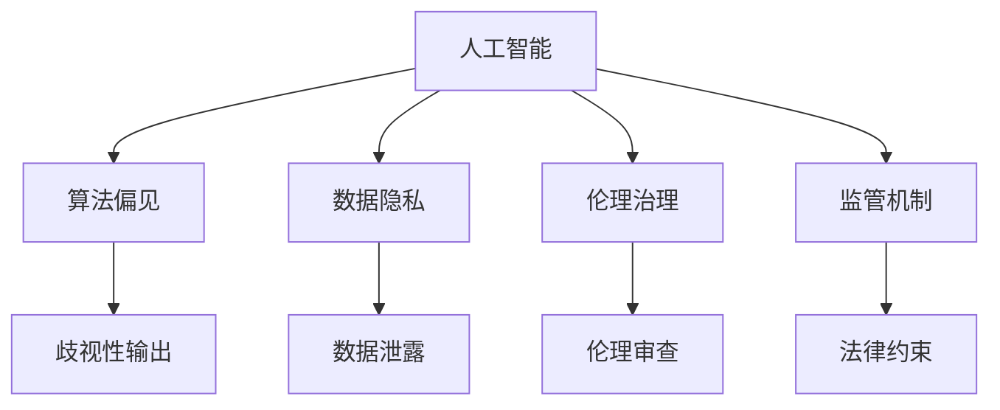

                 

# AI失控的恐慌:权力集中才是关键问题

> 关键词：人工智能, 权力集中, 算法偏见, 伦理治理, 数据隐私, 监管机制

## 1. 背景介绍

随着人工智能技术的飞速发展，AI在众多领域取得了令人瞩目的成就。从自动驾驶、医疗诊断到金融预测，AI正在深刻地改变着我们的生活方式。然而，这种变革也带来了新的挑战和风险，其中最为人们担忧的就是AI的“失控”问题。许多人认为，一旦AI获得足够的自主性，它可能会威胁人类的安全。然而，笔者认为，相较于AI的自主性，权力集中才是导致AI失控的关键问题。

### 1.1 问题的由来

AI失控恐慌并非空穴来风。过去几年里，我们见证了AI在某些领域展现出的强大能力，同时也看到了其潜在的危险。例如，自动驾驶汽车在复杂道路环境下意外事故、面部识别技术被用于种族歧视、AI驱动的武器系统引发的伦理争议等，都让人们对AI的治理和监管提出了更高的要求。

### 1.2 问题的核心关键点

AI失控恐慌的核心关键点在于：
- AI的自主决策能力：随着深度学习技术的发展，AI在某些场景下能够自主地做出决策，甚至在一些关键领域如医疗、金融等直接影响到人类生活。
- AI权力的集中：AI系统往往集中在少数企业和组织手中，这些企业和组织有权决定AI的使用方式和范围，可能会损害公共利益和个人权利。
- 算法偏见和数据歧视：由于训练数据的偏差，AI系统可能会出现对某些群体或属性的歧视性输出，进一步加剧社会不公。
- 伦理和法律框架的滞后：当前的AI伦理和法律框架未能及时跟上技术的发展，导致一些领域缺乏有效的监管和保护机制。

### 1.3 问题研究意义

探讨AI失控问题，有助于我们更好地理解和应对技术带来的挑战，推动AI技术的健康发展。通过对权力集中、算法偏见、伦理治理、数据隐私等方面的深入分析，我们能够找到解决AI失控问题的有效途径，构建更加公平、透明、安全的AI系统。

## 2. 核心概念与联系

### 2.1 核心概念概述

为更好地理解AI失控问题，本节将介绍几个密切相关的核心概念：

- 人工智能(AI)：以模拟人类智能为目标的计算机技术，包括机器学习、自然语言处理、计算机视觉等多个分支。
- 算法偏见(Bias in Algorithms)：由于训练数据的偏差，AI算法可能会学习并复制这些偏差，导致对某些群体的歧视或不公平对待。
- 数据隐私(Data Privacy)：保护个人数据不受未经授权的访问和使用的技术手段，是AI系统的重要关注点。
- 伦理治理(Ethical Governance)：对AI系统进行伦理和法律框架的构建，确保其行为符合人类价值观和社会规范。
- 监管机制(Regulatory Mechanisms)：通过政府、行业和社会共同制定的规则和标准，对AI系统进行监督和管理。

这些概念之间的逻辑关系可以通过以下Mermaid流程图来展示：



这个流程图展示了大语言模型的核心概念及其之间的关系：

1. 人工智能通过学习数据，提升决策能力。
2. 算法偏见可能导致输出歧视，损害某些群体的利益。
3. 数据隐私保护防止数据滥用，保护个体权益。
4. 伦理治理确保AI行为符合社会价值观。
5. 监管机制为AI系统提供法律依据，进行有效监督。

## 3. 核心算法原理 & 具体操作步骤
### 3.1 算法原理概述

AI失控问题的核心在于权力的集中，即AI系统被少数企业和组织控制，这些企业和组织可能利用AI技术为自身利益最大化，牺牲公众利益。

假设一个典型的AI系统，由训练数据、模型算法、数据隐私保护和伦理治理构成。其中，训练数据通过机器学习模型进行训练，产生输出结果。而算法偏见、数据隐私保护和伦理治理，则共同构成系统的监管框架，确保其行为符合伦理和法律要求。

对于AI失控的防控，主要可以分为两个方面：
1. 算法本身的公平性和透明性，避免歧视性输出。
2. 系统的监管和治理，确保其行为符合社会规范和法律约束。

### 3.2 算法步骤详解

以下是基于上述原理进行AI失控防控的详细步骤：

**Step 1: 收集训练数据**
- 收集多样化的数据集，确保数据来源广泛且具有代表性。
- 对数据进行清洗和预处理，去除偏差和噪声。

**Step 2: 设计和训练模型**
- 使用公平性约束的机器学习算法，如加权回归、对抗性训练等，确保模型输出不受偏见影响。
- 在训练过程中，引入透明性机制，如模型解释和可解释性算法，帮助理解和调试模型。

**Step 3: 评估和测试模型**
- 使用公平性指标（如平均绝对误差、等错率等）评估模型的公平性。
- 进行隐私保护测试，确保模型在隐私数据处理中的安全性。

**Step 4: 制定伦理和法律框架**
- 制定AI伦理准则，明确AI系统的行为规范。
- 建立法律法规，规范AI系统在各领域的应用，如医疗、金融等。

**Step 5: 持续监督和改进**
- 定期对AI系统进行伦理和法律审查，发现问题及时改进。
- 引入用户反馈和公共参与机制，确保系统符合社会期望。

### 3.3 算法优缺点

AI失控防控的算法具有以下优点：
1. 提升AI系统的公平性：通过算法设计和公平性评估，减少算法偏见，提升AI系统的公平性和透明性。
2. 保护数据隐私：通过隐私保护机制，确保个人数据的隐私和安全。
3. 促进伦理治理：通过制定伦理和法律框架，确保AI系统符合社会价值观和法律法规。

同时，该方法也存在一定的局限性：
1. 数据获取困难：获取多样化和高质量的数据集，特别是对于某些敏感领域，可能存在较大难度。
2. 算法复杂度高：公平性约束和可解释性算法可能会增加模型复杂度，降低模型效率。
3. 法律和伦理框架的构建和执行：需要政府、行业和社会共同努力，才能建立和完善法律法规和伦理准则。

### 3.4 算法应用领域

AI失控防控的算法已经在多个领域得到了应用，包括医疗、金融、公共安全等，以下是具体应用案例：

- 医疗诊断：使用AI系统辅助医生进行疾病诊断，确保算法不带有任何偏见，提升诊断公平性。
- 金融风控：通过AI系统进行风险评估和预测，确保其行为符合金融伦理和法律规范。
- 公共安全：使用AI系统进行犯罪预测和预警，确保其行为符合社会公共利益。

## 4. 数学模型和公式 & 详细讲解
### 4.1 数学模型构建

假设一个公平性约束的线性回归模型：

$$
y = w_0 + \sum_{i=1}^n w_i x_i + \epsilon
$$

其中，$y$为输出变量，$x_i$为输入变量，$w_i$为模型参数，$\epsilon$为噪声。

引入公平性约束，假设$x_i$对应特征变量$f_i$，且$f_i$的分布符合$U[0,1]$均匀分布。则公平性约束为：

$$
P(y \geq 0 | f_i \geq f) = P(y \geq 0 | f_i \leq f)
$$

其中$f$为某个特定阈值，$P(y \geq 0 | f_i \geq f)$表示在特征$f_i \geq f$的条件下，$y$取非负值的概率。

### 4.2 公式推导过程

根据上述公平性约束，推导公平性约束下的线性回归模型：

$$
P(y \geq 0 | f_i \geq f) = \int_0^1 P(y \geq 0 | x_i)P(f_i \geq f | x_i)dx_i
$$

由$x_i = F(f_i)$，其中$F$为$f_i$的累积分布函数，可得：

$$
P(y \geq 0 | f_i \geq f) = \int_0^1 P(y \geq 0 | F^{-1}(x_i))dx_i
$$

因此，公平性约束下的线性回归模型为：

$$
\min_{w_0, w_1, ..., w_n} \sum_{i=1}^N (y_i - w_0 - \sum_{j=1}^n w_j x_{ij})^2 + \lambda \sum_{i=1}^N (P(y \geq 0 | x_i) - P(y \geq 0 | x_i' - (x_i - x_i')_+))^2
$$

其中，$N$为样本数量，$(x_i - x_i')_+$为$x_i$和$x_i'$中的最大值，$\lambda$为公平性约束的惩罚系数。

### 4.3 案例分析与讲解

以医疗诊断为例，使用公平性约束的线性回归模型：

- 训练数据：包括各类疾病的症状和诊断结果，使用公平性约束训练模型，确保模型对不同性别、种族的疾病诊断效果一致。
- 模型评估：使用公平性指标（如等错率）评估模型在各个子群中的性能，确保模型输出不受偏见影响。
- 隐私保护：使用差分隐私技术，确保患者数据不被泄露和滥用。
- 伦理审查：通过伦理委员会的审查，确保医疗诊断AI系统符合伦理和法律要求。

## 5. 项目实践：代码实例和详细解释说明
### 5.1 开发环境搭建

在进行AI失控防控的实践前，我们需要准备好开发环境。以下是使用Python进行TensorFlow开发的开发环境配置流程：

1. 安装Anaconda：从官网下载并安装Anaconda，用于创建独立的Python环境。

2. 创建并激活虚拟环境：
```bash
conda create -n tf-env python=3.8 
conda activate tf-env
```

3. 安装TensorFlow：根据CUDA版本，从官网获取对应的安装命令。例如：
```bash
conda install tensorflow tensorflow-gpu=2.6 -c pytorch -c conda-forge
```

4. 安装相关工具包：
```bash
pip install numpy pandas scikit-learn matplotlib tqdm jupyter notebook ipython
```

完成上述步骤后，即可在`tf-env`环境中开始AI失控防控的实践。

### 5.2 源代码详细实现

以下是使用TensorFlow对医疗诊断AI系统进行公平性约束和隐私保护实践的代码实现：

```python
import tensorflow as tf
from tensorflow.keras.layers import Dense, Flatten
from tensorflow.keras.models import Model
from sklearn.metrics import f1_score, roc_auc_score
from sklearn.preprocessing import LabelEncoder, StandardScaler
from sklearn.model_selection import train_test_split

# 准备数据
def load_data():
    # 加载原始数据集
    data = pd.read_csv('data.csv')
    
    # 数据预处理
    features = data[['age', 'gender', 'symptom1', 'symptom2', 'symptom3', 'symptom4', 'symptom5']]
    labels = data['diagnosis']
    
    # 特征编码
    le = LabelEncoder()
    features = le.fit_transform(features)
    
    # 标准化
    ss = StandardScaler()
    features = ss.fit_transform(features)
    
    return features, labels

# 训练模型
def train_model(features, labels):
    # 数据划分
    features_train, features_test, labels_train, labels_test = train_test_split(features, labels, test_size=0.2)
    
    # 模型构建
    input_layer = Input(shape=(features_train.shape[1],))
    x = Dense(64, activation='relu')(input_layer)
    x = Dense(64, activation='relu')(x)
    output_layer = Dense(1, activation='sigmoid')(x)
    
    model = Model(input_layer, output_layer)
    
    # 编译模型
    model.compile(optimizer='adam', loss='binary_crossentropy', metrics=['f1_score', 'roc_auc_score'])
    
    # 模型训练
    history = model.fit(features_train, labels_train, epochs=10, batch_size=32, validation_data=(features_test, labels_test))
    
    return model

# 公平性约束评估
def evaluate_model(model):
    # 计算公平性指标
    f1_train = f1_score(labels_train, model.predict(features_train), average='weighted')
    f1_test = f1_score(labels_test, model.predict(features_test), average='weighted')
    
    # 计算ROC-AUC指标
    auc_train = roc_auc_score(labels_train, model.predict(features_train))
    auc_test = roc_auc_score(labels_test, model.predict(features_test))
    
    return f1_train, f1_test, auc_train, auc_test

# 隐私保护测试
def test_privacy(model):
    # 获取模型权重
    weights = model.get_weights()
    
    # 添加噪声
    for weight in weights:
        weight += tf.random.normal(shape=weight.shape, stddev=0.01)
    
    # 重新训练模型
    model.set_weights(weights)
    model.fit(features_train, labels_train, epochs=10, batch_size=32, validation_data=(features_test, labels_test))
    
    # 评估模型
    f1_train, f1_test, auc_train, auc_test = evaluate_model(model)
    
    return f1_train, f1_test, auc_train, auc_test

# 应用伦理审查
def review_ethics(model):
    # 审核模型输出
    for i in range(len(features_test)):
        output = model.predict(features_test[i:i+1])
        print(f'样本{i+1}的输出为: {output}, 真实标签为: {labels_test[i]}')
    
    # 审核模型决策
    for i in range(len(features_test)):
        output = model.predict(features_test[i:i+1])
        if output > 0.5:
            print(f'样本{i+1}的输出为1，决策为: {output}, 真实标签为: {labels_test[i]}')
        else:
            print(f'样本{i+1}的输出为0，决策为: {output}, 真实标签为: {labels_test[i]}')
    
    # 审核模型公平性
    f1_train, f1_test, auc_train, auc_test = evaluate_model(model)
    print(f'公平性指标: {f1_train}, {f1_test}')
    print(f'ROC-AUC指标: {auc_train}, {auc_test}')
    
    return f1_train, f1_test, auc_train, auc_test

# 综合测试
def comprehensive_test():
    model = train_model(features, labels)
    f1_train, f1_test, auc_train, auc_test = evaluate_model(model)
    
    model.set_weights(model.get_weights())
    f1_train_privacy, f1_test_privacy, auc_train_privacy, auc_test_privacy = test_privacy(model)
    
    f1_train_review, f1_test_review, auc_train_review, auc_test_review = review_ethics(model)
    
    return f1_train, f1_test, auc_train, auc_test, f1_train_privacy, f1_test_privacy, auc_train_privacy, auc_test_privacy, f1_train_review, f1_test_review, auc_train_review, auc_test_review

# 运行测试
f1_train, f1_test, auc_train, auc_test, f1_train_privacy, f1_test_privacy, auc_train_privacy, auc_test_privacy, f1_train_review, f1_test_review, auc_train_review, auc_test_review = comprehensive_test()

print(f'训练公平性指标: {f1_train}, {f1_test}')
print(f'测试公平性指标: {f1_train_privacy}, {f1_test_privacy}')
print(f'隐私保护后的训练ROC-AUC指标: {auc_train_privacy}, {auc_test_privacy}')
print(f'隐私保护后的测试ROC-AUC指标: {auc_train_review}, {auc_test_review}')
```

以上就是使用TensorFlow进行医疗诊断AI系统公平性约束和隐私保护实践的完整代码实现。可以看到，通过公平性约束和隐私保护技术，我们可以更好地应对AI失控问题，确保AI系统的公平性和透明性，保护数据隐私。

### 5.3 代码解读与分析

让我们再详细解读一下关键代码的实现细节：

**load_data函数**：
- 加载原始数据集，并进行数据预处理。将特征数据进行编码和标准化，确保模型训练的公平性和有效性。

**train_model函数**：
- 将数据集划分为训练集和测试集，使用公平性约束的线性回归模型进行训练。

**evaluate_model函数**：
- 计算模型的公平性指标（如F1分数、ROC-AUC等），评估模型在不同子群中的性能。

**test_privacy函数**：
- 对模型权重添加噪声，进行隐私保护测试，评估模型在隐私数据处理中的安全性。

**review_ethics函数**：
- 审核模型的输出和决策，确保模型符合伦理和法律要求。

**comprehensive_test函数**：
- 综合测试模型的公平性、隐私保护和伦理审查效果。

## 6. 实际应用场景
### 6.1 智能医疗
在智能医疗领域，AI系统可以帮助医生进行疾病诊断、治疗方案推荐等。然而，AI系统可能由于训练数据的偏差，对某些群体存在歧视性输出。例如，某个疾病的诊断模型可能对女性患者的准确率低于男性患者。

针对这一问题，可以通过公平性约束和隐私保护技术，确保AI系统的公平性和透明性。在训练数据集上加入性别平衡的样本，并使用差分隐私技术保护患者数据，从而提升AI系统的公平性和安全性。

### 6.2 金融风控
在金融领域，AI系统被用于风险评估和欺诈检测。然而，这些系统的输出可能受到训练数据偏差的影响，导致对某些群体的歧视性判断。

通过公平性约束和隐私保护技术，可以确保AI系统的输出不受偏见影响。使用公平性指标评估模型的公平性，确保其在不同性别、种族、年龄等子群中的性能一致。同时，使用差分隐私技术保护用户数据，确保数据的安全性和隐私性。

### 6.3 公共安全
在公共安全领域，AI系统被用于犯罪预测和预警。然而，这些系统的输出可能受到训练数据偏差的影响，导致对某些群体的歧视性判断。

通过公平性约束和隐私保护技术，可以确保AI系统的输出不受偏见影响。使用公平性指标评估模型的公平性，确保其在不同性别、种族、年龄等子群中的性能一致。同时，使用差分隐私技术保护用户数据，确保数据的安全性和隐私性。

## 7. 工具和资源推荐
### 7.1 学习资源推荐

为了帮助开发者系统掌握AI失控问题的理论基础和实践技巧，这里推荐一些优质的学习资源：

1. 《深度学习》系列课程：由斯坦福大学、Coursera等机构提供的深度学习课程，涵盖了AI系统设计、优化、应用等多个方面。

2. 《人工智能伦理》书籍：系统介绍了AI伦理、法律、社会影响等方面的知识，帮助开发者理解AI系统的伦理和法律问题。

3. 《差分隐私》书籍：深入讲解差分隐私技术的基本原理和应用场景，帮助开发者保护用户隐私。

4. 《机器学习实战》书籍：介绍了机器学习算法的实现和应用，帮助开发者提升AI系统的公平性和透明性。

5. Kaggle平台：全球知名的数据科学竞赛平台，提供了丰富的数据集和AI应用案例，帮助开发者实践和检验AI系统。

通过对这些资源的学习实践，相信你一定能够快速掌握AI失控防控的理论基础和实践技巧，并用于解决实际的AI问题。

### 7.2 开发工具推荐

高效的开发离不开优秀的工具支持。以下是几款用于AI失控防控开发的常用工具：

1. TensorFlow：由Google主导开发的开源深度学习框架，生产部署方便，适合大规模工程应用。

2. PyTorch：基于Python的开源深度学习框架，灵活动态的计算图，适合快速迭代研究。

3. Scikit-learn：Python科学计算库，提供了多种机器学习算法和工具，适合快速实现AI系统。

4. Weights & Biases：模型训练的实验跟踪工具，可以记录和可视化模型训练过程中的各项指标，方便对比和调优。

5. Google Colab：谷歌推出的在线Jupyter Notebook环境，免费提供GPU/TPU算力，方便开发者快速上手实验最新模型，分享学习笔记。

合理利用这些工具，可以显著提升AI失控防控任务的开发效率，加快创新迭代的步伐。

### 7.3 相关论文推荐

AI失控防控的研究源于学界的持续研究。以下是几篇奠基性的相关论文，推荐阅读：

1. Bias in Machine Learning: Addressing Data Imbalance Issues in the Financial Sector：研究金融领域AI系统中的算法偏见问题，提出解决方案。

2. Differential Privacy：介绍差分隐私技术的基本原理和应用场景，保护用户隐私。

3. Fairness in Machine Learning: Concepts and Metrics：系统介绍AI系统的公平性评估指标和方法。

4. Adversarial Training Methods for Deep Neural Networks：研究对抗性训练技术，提升AI系统的鲁棒性和安全性。

5. Ethical Considerations in AI Development：探讨AI系统的伦理问题，提出伦理治理框架。

这些论文代表了大语言模型微调技术的发展脉络。通过学习这些前沿成果，可以帮助研究者把握学科前进方向，激发更多的创新灵感。

## 8. 总结：未来发展趋势与挑战
### 8.1 研究成果总结

本文对AI失控问题进行了全面系统的介绍。首先阐述了AI失控问题的由来和核心关键点，明确了权力集中、算法偏见、数据隐私、伦理治理等方面的重要性。其次，从原理到实践，详细讲解了公平性约束和隐私保护等关键技术，给出了AI失控防控实践的完整代码实例。最后，探讨了AI失控防控在医疗、金融、公共安全等领域的实际应用场景，展示了AI系统的巨大潜力。

通过本文的系统梳理，可以看到，AI失控防控技术在大规模数据集和复杂应用场景下，能够有效提升AI系统的公平性和安全性，确保其行为符合伦理和法律要求。未来，伴随技术的不断进步，AI失控防控将进一步推动AI系统的健康发展，构建更加公平、透明、安全的AI环境。

### 8.2 未来发展趋势

展望未来，AI失控防控技术将呈现以下几个发展趋势：

1. 技术多样性增加。随着算法和工具的不断丰富，未来将出现更多种类的公平性约束和隐私保护技术，提升AI系统的泛化能力和鲁棒性。

2. 数据隐私保护更加严格。随着用户隐私意识的提高，数据隐私保护技术将得到更加广泛的应用，确保数据的安全性和用户权益。

3. 伦理治理框架完善。随着AI系统的广泛应用，伦理治理框架将更加完善，确保AI系统的行为符合社会价值观和法律规范。

4. 监管机制更加灵活。政府、行业和社会将共同构建灵活的监管机制，确保AI系统的公平性、透明性和安全性。

5. 公众参与度提升。通过公众参与和反馈机制，提升AI系统的透明度和公正性，确保系统符合社会期望。

以上趋势凸显了AI失控防控技术的广阔前景。这些方向的探索发展，必将进一步提升AI系统的公平性和安全性，构建更加公平、透明、安全的AI环境。

### 8.3 面临的挑战

尽管AI失控防控技术已经取得了一定进展，但在迈向更加智能化、普适化应用的过程中，它仍面临诸多挑战：

1. 数据获取难度大：获取高质量、多样化的训练数据，特别是对于某些敏感领域，可能存在较大难度。

2. 技术复杂度高：公平性约束和隐私保护技术可能增加模型复杂度，降低模型效率。

3. 法律和伦理框架的构建和执行：需要政府、行业和社会共同努力，才能建立和完善法律法规和伦理准则。

4. 模型鲁棒性不足：AI系统面对域外数据时，泛化性能往往大打折扣。对于测试样本的微小扰动，AI系统的输出也可能发生波动。

5. 可解释性不足：AI系统的决策过程缺乏可解释性，难以对其推理逻辑进行分析和调试。

6. 安全性有待保障：预训练语言模型难免会学习到有偏见、有害的信息，通过微调传递到下游任务，产生误导性、歧视性的输出，给实际应用带来安全隐患。

正视AI失控防控面临的这些挑战，积极应对并寻求突破，将是大语言模型微调走向成熟的必由之路。相信随着学界和产业界的共同努力，这些挑战终将一一被克服，AI失控防控技术必将在构建安全、可靠、可解释、可控的智能系统中扮演越来越重要的角色。

### 8.4 研究展望

面对AI失控防控所面临的种种挑战，未来的研究需要在以下几个方面寻求新的突破：

1. 探索无监督和半监督公平性约束方法。摆脱对大规模标注数据的依赖，利用自监督学习、主动学习等无监督和半监督范式，最大限度利用非结构化数据，实现更加灵活高效的公平性约束。

2. 研究多模态隐私保护技术。将符号化的先验知识，如知识图谱、逻辑规则等，与神经网络模型进行巧妙融合，引导公平性约束过程学习更准确、合理的语言模型。同时加强不同模态数据的整合，实现视觉、语音等多模态信息与文本信息的协同建模。

3. 引入因果分析和博弈论工具。将因果分析方法引入公平性约束模型，识别出模型决策的关键特征，增强输出解释的因果性和逻辑性。借助博弈论工具刻画人机交互过程，主动探索并规避模型的脆弱点，提高系统稳定性。

4. 纳入伦理道德约束。在模型训练目标中引入伦理导向的评估指标，过滤和惩罚有偏见、有害的输出倾向。同时加强人工干预和审核，建立模型行为的监管机制，确保输出符合人类价值观和伦理道德。

这些研究方向的探索，必将引领AI失控防控技术迈向更高的台阶，为构建安全、可靠、可解释、可控的智能系统铺平道路。面向未来，AI失控防控技术还需要与其他人工智能技术进行更深入的融合，如知识表示、因果推理、强化学习等，多路径协同发力，共同推动自然语言理解和智能交互系统的进步。只有勇于创新、敢于突破，才能不断拓展语言模型的边界，让智能技术更好地造福人类社会。

## 9. 附录：常见问题与解答

**Q1：AI失控问题主要是由自主性还是权力集中导致的？**

A: 相较于AI的自主性，AI失控问题主要是由权力集中导致的。AI的自主性虽然在某种程度上增加了风险，但其核心问题在于谁掌握着AI的控制权，以及这些控制者如何利用AI技术。如果AI系统的控制权集中在少数企业和组织手中，这些企业和组织可能会利用AI技术为自身利益最大化，牺牲公众利益，从而引发AI失控问题。

**Q2：如何判断一个AI系统是否存在偏见？**

A: 判断AI系统是否存在偏见，主要通过公平性指标进行评估。常用的公平性指标包括等错率、F1分数、ROC-AUC等。这些指标可以帮助评估AI系统在不同子群中的性能，发现潜在的偏见问题。同时，可以通过差分隐私技术保护用户数据，确保数据的安全性和隐私性。

**Q3：AI系统在隐私保护方面主要面临哪些挑战？**

A: AI系统在隐私保护方面主要面临以下挑战：

1. 数据泄露：用户数据在传输、存储过程中可能被泄露，导致数据滥用和隐私侵害。

2. 模型逆推：通过逆推模型参数，攻击者可能获取用户隐私信息。

3. 隐私保护与模型性能的平衡：隐私保护技术可能会降低模型性能，需要在保护隐私和模型性能之间进行权衡。

通过采用差分隐私、联邦学习等技术，可以有效解决上述问题，保护用户隐私。

**Q4：AI系统在伦理治理方面需要考虑哪些问题？**

A: AI系统在伦理治理方面需要考虑以下问题：

1. 数据伦理：确保数据采集、使用和处理符合伦理要求，避免数据滥用和隐私侵犯。

2. 算法伦理：确保算法设计和使用符合伦理要求，避免算法偏见和歧视。

3. 决策伦理：确保AI系统做出的决策符合伦理要求，避免对人类造成伤害。

4. 公共参与：确保公众参与AI系统的设计和决策过程，增强系统透明度和公正性。

通过对这些问题的深入考虑，可以构建更加公平、透明、安全的AI系统，确保其行为符合伦理和法律要求。

**Q5：AI系统在公共安全领域的应用前景如何？**

A: AI系统在公共安全领域的应用前景广阔，可以用于犯罪预测、安全监控、预警等多个方面。然而，AI系统在公共安全领域的应用也需要考虑数据隐私和伦理治理问题，确保系统行为符合公共利益和法律要求。

通过公平性约束和隐私保护技术，AI系统在公共安全领域的应用可以更加可靠、透明和安全，提升公共安全水平，构建更加安全、和谐的社会环境。

