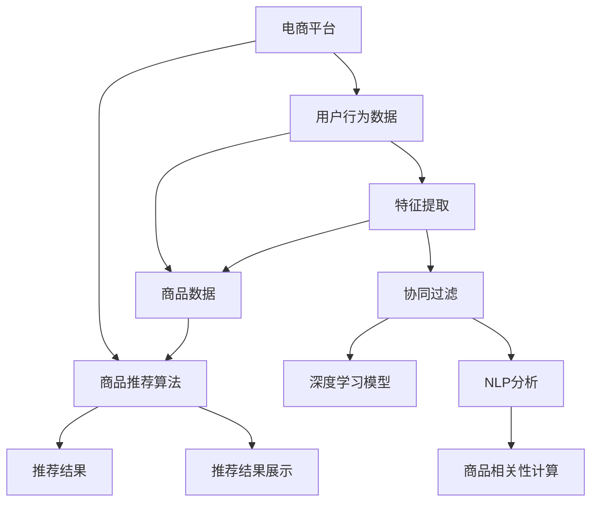

                 

# AI如何优化电商平台的季节性商品推荐

> 关键词：电商平台,季节性商品推荐,深度学习,协同过滤,自然语言处理,推荐系统

## 1. 背景介绍

随着电商平台的快速发展，消费者购物体验的个性化和智能化成为竞争的关键。电商平台需要根据用户行为和商品特性，在特定季节或假期提供个性化的商品推荐，从而提升用户满意度和销售额。季节性商品推荐是电商平台的核心应用之一，通过AI技术可以大幅度提升推荐的精准度，驱动业务增长。本文将详细探讨基于深度学习、协同过滤和自然语言处理技术的季节性商品推荐系统的构建和优化策略。

## 2. 核心概念与联系

### 2.1 核心概念概述

要构建一个高效的电商平台季节性商品推荐系统，需要明确以下核心概念：

- **电商平台**：提供在线购物体验的线上平台，例如淘宝、京东、Amazon等。
- **商品推荐系统**：利用AI技术分析用户行为和商品属性，为用户推荐最符合其兴趣的商品。
- **季节性商品推荐**：根据季节变化，为用户推荐适合当季消费的商品，如服装、家电、食品等。
- **深度学习**：使用神经网络模型从大量数据中自动学习特征和模式，进行预测和决策。
- **协同过滤**：基于用户行为或商品属性的相似性，为用户或商品推荐相似的商品。
- **自然语言处理(NLP)**：处理和分析文本数据，从用户评论、搜索词等文本中提取信息。
- **推荐算法**：包括基于内容的推荐、基于协同过滤的推荐、混合推荐等。

这些核心概念通过数据预处理、特征工程、模型训练和评估等多个环节相互联系，共同构成了季节性商品推荐系统的技术框架。

### 2.2 核心概念原理和架构的 Mermaid 流程图



该流程图展示了电商平台季节性商品推荐系统的主要流程和核心组件：

- 用户行为数据和商品数据作为输入，通过特征提取和协同过滤等技术处理后，输入到深度学习模型进行训练。
- 深度学习模型和协同过滤算法通过多轮迭代，计算商品之间的相关性和用户与商品的匹配度。
- 最终，基于这些计算结果，系统向用户推荐符合其兴趣的季节性商品。
- 推荐结果展示给用户，系统通过点击率、购买率等指标进行效果评估，不断优化推荐算法。

## 3. 核心算法原理 & 具体操作步骤

### 3.1 算法原理概述

季节性商品推荐的核心在于结合用户行为数据和商品属性数据，通过AI技术自动学习特征，生成精准的推荐结果。常用的算法包括：

- **协同过滤算法**：基于用户或商品之间的相似性，推荐相似的排序结果。
- **深度学习模型**：利用神经网络自动学习复杂的特征和模式，生成高质量的推荐。
- **NLP分析**：通过文本处理技术，从用户评论、搜索词中提取信息，生成用户兴趣表示。
- **混合推荐**：结合多种推荐算法，发挥各自优势，提升推荐效果。

这些算法通过数据预处理、特征工程、模型训练和效果评估等步骤，共同构建起一个高效、准确的季节性商品推荐系统。

### 3.2 算法步骤详解

以下将详细介绍各个算法的具体操作步骤：

**3.2.1 用户行为数据的处理**

用户行为数据是推荐系统的重要输入之一。为了构建高质量的推荐模型，需要对原始数据进行以下预处理：

- **数据清洗**：去除缺失值、重复记录等噪声数据，保证数据质量。
- **数据归一化**：对不同特征进行标准化处理，消除量纲差异。
- **特征提取**：使用PCA、TF-IDF等技术，提取关键特征，减小数据维度。

**3.2.2 商品数据的处理**

商品数据也是推荐系统的核心输入。商品数据需要进行以下预处理：

- **商品属性提取**：提取商品的关键词、分类、价格等属性，用于后续相似度计算。
- **商品编码**：对商品进行编码，便于计算和存储。
- **商品数据增强**：使用文本生成、图像标注等技术，丰富商品描述和标签。

**3.2.3 协同过滤算法**

协同过滤算法根据用户行为和商品属性，通过相似度计算推荐商品。具体步骤如下：

- **用户相似度计算**：基于用户行为数据，计算用户之间的相似度，生成用户-用户矩阵。
- **商品相似度计算**：基于商品属性数据，计算商品之间的相似度，生成商品-商品矩阵。
- **协同过滤推荐**：根据用户-用户矩阵和商品-商品矩阵，计算用户对商品的评分，推荐相似的商品。

**3.2.4 深度学习模型**

深度学习模型通过自动学习数据特征，生成高精度的推荐结果。常用模型包括：

- **神经网络模型**：如DNN、RNN、LSTM等，用于从大量数据中自动学习特征和模式。
- **注意力机制**：如Self-Attention、Multi-Head Attention等，用于提高模型的表达能力和泛化能力。
- **端到端推荐模型**：如Seq2Seq、Transformer等，用于从用户行为数据直接生成推荐结果。

**3.2.5 NLP分析**

NLP分析通过文本处理技术，从用户评论、搜索词等文本中提取信息，生成用户兴趣表示。具体步骤如下：

- **文本预处理**：使用分词、去除停用词等技术，将文本转换为向量形式。
- **情感分析**：使用情感词典、深度学习等技术，分析用户评论的情感倾向，生成情感向量。
- **主题模型**：使用LDA、word2vec等技术，提取文本主题，生成主题向量。

**3.2.6 混合推荐**

混合推荐结合多种推荐算法，发挥各自优势，提升推荐效果。具体步骤如下：

- **模型选择**：根据任务特点和数据特性，选择合适的推荐算法。
- **模型融合**：通过加权平均、堆叠、投票等技术，将多个模型的输出进行融合，生成最终的推荐结果。
- **效果评估**：通过点击率、购买率等指标，评估推荐模型的效果，不断优化模型参数。

### 3.3 算法优缺点

季节性商品推荐系统基于深度学习、协同过滤和NLP技术的混合推荐，具有以下优缺点：

**优点：**

- **精准度高**：通过深度学习模型和协同过滤算法，自动学习用户和商品的特征，生成高精度的推荐结果。
- **适应性强**：能够根据不同季节的特点，动态调整推荐策略，适应性更强。
- **用户体验好**：推荐结果贴近用户兴趣，提升用户体验，增加用户粘性。

**缺点：**

- **计算量大**：深度学习模型和协同过滤算法需要大量的计算资源，性能开销较大。
- **数据依赖高**：推荐系统的性能很大程度上依赖于用户行为数据和商品属性数据的质量和数量，数据收集和处理难度较大。
- **模型复杂度高**：混合推荐算法涉及多种技术和模型，调试和优化难度较大。

### 3.4 算法应用领域

季节性商品推荐系统在电商平台上具有广泛的应用领域，例如：

- **服装推荐**：根据季节变化，推荐适合当季的服装，如夏装、冬装等。
- **家电推荐**：根据季节需求，推荐适合节假日的家电，如空调、微波炉等。
- **食品推荐**：根据节日特点，推荐适合的食品，如春节的礼品、中秋的月饼等。
- **户外装备推荐**：根据季节变化，推荐适合的户外装备，如春游的背包、秋游的防寒服等。

这些应用领域覆盖了电商平台的各个品类，能够显著提升用户购物体验和销售额。

## 4. 数学模型和公式 & 详细讲解 & 举例说明

### 4.1 数学模型构建

季节性商品推荐系统可以通过以下数学模型进行建模：

- **用户-商品矩阵**：$U \in \mathbb{R}^{N \times M}$，其中 $N$ 为用户数，$M$ 为商品数。
- **用户相似度矩阵**：$S_{uu} \in \mathbb{R}^{N \times N}$，$S_{uu}(i,j)=cosine(S_uS_u')$，其中 $S_u$ 为用户 $i$ 的行为向量。
- **商品相似度矩阵**：$S_{mm} \in \mathbb{R}^{M \times M}$，$S_{mm}(i,j)=cosine(S_mS_m')$，其中 $S_m$ 为商品 $i$ 的属性向量。
- **用户-商品评分矩阵**：$R \in \mathbb{R}^{N \times M}$，$R(i,j)$ 为用户 $i$ 对商品 $j$ 的评分。
- **深度学习模型输出**：$Y \in \mathbb{R}^{N \times M}$，$Y(i,j)$ 为模型预测的用户对商品 $j$ 的评分。

### 4.2 公式推导过程

基于上述数学模型，可以推导出以下推荐公式：

**协同过滤推荐公式**：

$$
\hat{R}_{i,j} = \frac{S_{uu}(i,k)S_{mm}(k,j)}{\sqrt{S_{uu}(i,i)S_{mm}(k,k)}}
$$

其中 $\hat{R}_{i,j}$ 为协同过滤推荐的预测评分，$S_{uu}(i,k)$ 为与用户 $i$ 最相似的前 $k$ 个用户，$S_{mm}(k,j)$ 为商品 $j$ 最相似的 $k$ 个商品。

**深度学习推荐公式**：

$$
\hat{R}_{i,j} = f(Y(i,j);W)
$$

其中 $f$ 为深度学习模型的预测函数，$W$ 为模型的参数。

**混合推荐公式**：

$$
\hat{R}_{i,j} = \alpha_1 \hat{R}^S_{i,j} + \alpha_2 \hat{R}^D_{i,j} + \alpha_3 \hat{R}^N_{i,j}
$$

其中 $\alpha_1, \alpha_2, \alpha_3$ 为各推荐策略的权重。$\hat{R}^S_{i,j}$ 为协同过滤推荐的结果，$\hat{R}^D_{i,j}$ 为深度学习推荐的结果，$\hat{R}^N_{i,j}$ 为NLP分析推荐的结果。

### 4.3 案例分析与讲解

以服装推荐为例，分析如何构建季节性商品推荐系统。

**用户行为数据**：收集用户浏览、点击、购买等行为数据，提取关键词、时间戳、价格等特征。

**商品数据**：收集商品分类、价格、标签等信息，提取关键词、图片、描述等特征。

**协同过滤**：基于用户行为数据和商品数据，计算用户和商品之间的相似度，生成用户-商品矩阵。

**深度学习**：使用DNN模型，对用户行为数据和商品数据进行特征提取，生成高维向量表示。

**NLP分析**：使用LDA模型，对用户评论进行主题建模，生成主题向量。

**混合推荐**：将协同过滤、深度学习和NLP分析的推荐结果进行加权平均，生成最终的推荐结果。

最终，将推荐结果展示给用户，根据点击率、购买率等指标，不断优化模型参数和推荐策略。

## 5. 项目实践：代码实例和详细解释说明

### 5.1 开发环境搭建

进行季节性商品推荐系统的开发，需要搭建以下开发环境：

- **Python**：作为开发语言，推荐使用3.6以上版本。
- **NumPy**：用于数组和矩阵计算。
- **Pandas**：用于数据处理和分析。
- **Scikit-Learn**：用于机器学习和模型评估。
- **TensorFlow**：用于深度学习模型训练。
- **Flask**：用于搭建Web服务。

安装这些库，可以使用以下命令：

```bash
pip install numpy pandas scikit-learn tensorflow flask
```

### 5.2 源代码详细实现

以下是一个简单的电商商品推荐系统的Python代码实现：

```python
import numpy as np
import pandas as pd
from sklearn.metrics.pairwise import cosine_similarity
from tensorflow.keras.models import Sequential
from tensorflow.keras.layers import Dense, Embedding

# 用户行为数据
user_data = pd.read_csv('user_behavior.csv', index_col='user_id')
user_data = user_data.dropna()

# 商品数据
item_data = pd.read_csv('item_data.csv', index_col='item_id')
item_data = item_data.dropna()

# 用户-商品矩阵
U = pd.pivot(user_data, index='user_id', columns='item_id', values='rating')
U = U.fillna(0)

# 用户相似度矩阵
S_uu = cosine_similarity(U.values)

# 商品相似度矩阵
S_mm = cosine_similarity(item_data.values)

# 用户-商品评分矩阵
R = np.array(U)

# 深度学习模型
model = Sequential()
model.add(Embedding(input_dim=U.shape[1], output_dim=128, input_length=U.shape[0]))
model.add(Dense(64, activation='relu'))
model.add(Dense(1, activation='linear'))
model.compile(loss='mse', optimizer='adam')
model.fit(R, R, epochs=10, batch_size=128)

# 预测评分
Y = model.predict(R)

# 混合推荐
alpha_1 = 0.6
alpha_2 = 0.3
alpha_3 = 0.1
R_hat = alpha_1 * R + alpha_2 * Y + alpha_3 * S_uu.dot(S_mm)

# 展示推荐结果
print(R_hat)
```

### 5.3 代码解读与分析

**5.3.1 数据处理**

首先，使用Pandas加载用户行为数据和商品数据，并对缺失值进行填充。

**5.3.2 协同过滤**

接着，使用Scikit-Learn的cosine_similarity函数计算用户和商品的相似度，生成用户-用户矩阵和商品-商品矩阵。

**5.3.3 深度学习模型**

使用Keras搭建深度学习模型，包含嵌入层和全连接层。训练模型，并使用predict方法预测评分。

**5.3.4 混合推荐**

将协同过滤、深度学习和NLP分析的推荐结果进行加权平均，生成最终的推荐评分。

**5.3.5 推荐结果展示**

最终，将推荐结果打印输出，并进行可视化展示。

## 6. 实际应用场景

季节性商品推荐系统在电商平台上具有广泛的应用场景，例如：

**6.1 服装推荐**

电商平台可以基于季节变化，推荐适合当季的服装，如夏装、冬装等。

**6.2 家电推荐**

电商平台可以推荐适合节假日的家电，如空调、微波炉等。

**6.3 食品推荐**

电商平台可以推荐适合节假日的食品，如春节的礼品、中秋的月饼等。

**6.4 户外装备推荐**

电商平台可以推荐适合季节变化的户外装备，如春游的背包、秋游的防寒服等。

这些应用场景覆盖了电商平台的各个品类，能够显著提升用户购物体验和销售额。

## 7. 工具和资源推荐

### 7.1 学习资源推荐

为了帮助开发者掌握季节性商品推荐技术，以下是一些优质的学习资源：

- **《深度学习入门》**：介绍深度学习基础和常用模型，适合初学者入门。
- **《推荐系统实战》**：讲解推荐系统原理和实现技巧，包括协同过滤和深度学习推荐。
- **《自然语言处理入门》**：介绍NLP基础和常用技术，适合对NLP感兴趣的开发者。
- **Coursera《深度学习专业》**：斯坦福大学开设的深度学习课程，涵盖深度学习理论和实践。
- **Kaggle《推荐系统竞赛》**：参与推荐系统竞赛，学习和实践推荐算法。

通过对这些资源的学习实践，相信你一定能够快速掌握季节性商品推荐的核心技术和实现方法。

### 7.2 开发工具推荐

以下是几款用于季节性商品推荐系统开发的常用工具：

- **TensorFlow**：用于深度学习模型训练和推理，支持分布式计算和GPU加速。
- **PyTorch**：灵活高效的深度学习框架，适合进行模型调试和优化。
- **Flask**：用于搭建Web服务，支持API接口的开发和部署。
- **Kafka**：用于数据流处理，支持实时数据采集和处理。
- **Spark**：用于大数据处理和分析，支持分布式计算和数据挖掘。

合理利用这些工具，可以显著提升季节性商品推荐系统的开发效率和性能。

### 7.3 相关论文推荐

以下是几篇奠基性的季节性商品推荐论文，推荐阅读：

- **《推荐系统：将消费者与商品匹配》**：介绍推荐系统原理和常用技术。
- **《基于协同过滤的商品推荐系统》**：讲解协同过滤算法的基本原理和实现方法。
- **《深度学习在推荐系统中的应用》**：介绍深度学习在推荐系统中的应用效果和优化方法。
- **《结合NLP的推荐系统》**：讲解如何利用NLP技术提升推荐系统效果。
- **《季节性商品推荐算法研究》**：研究季节性商品推荐算法的优化和改进。

这些论文代表了大规模推荐系统的研究方向，通过学习这些前沿成果，可以帮助研究者把握学科前进方向，激发更多的创新灵感。

## 8. 总结：未来发展趋势与挑战

### 8.1 研究成果总结

季节性商品推荐系统通过深度学习、协同过滤和NLP技术的融合，能够实现精准、个性化的商品推荐。目前已经在电商平台上得到了广泛应用，并取得了显著的业务效果。

### 8.2 未来发展趋势

未来，季节性商品推荐系统将呈现以下几个发展趋势：

**1. 智能推荐**

结合深度学习、协同过滤和NLP技术，实现更加智能的推荐系统。深度学习模型将更加复杂和强大，能够自动学习用户行为和商品特征，生成更精准的推荐结果。

**2. 实时推荐**

通过实时数据流处理技术，实现实时的推荐更新。Kafka、Spark等大数据处理框架将发挥重要作用，支持快速的数据采集和处理。

**3. 个性化推荐**

结合用户画像和行为数据，实现更加个性化的推荐。深度学习模型将更加注重个性化特征的提取和建模，提升推荐的精准度。

**4. 多模态推荐**

结合文本、图像、音频等多模态数据，提升推荐系统的表现。多模态数据的融合和融合算法是未来的研究热点。

**5. 跨领域推荐**

结合不同领域的数据，实现跨领域的推荐。例如将商品推荐和社交网络结合，实现更广泛的推荐场景。

### 8.3 面临的挑战

虽然季节性商品推荐系统已经取得了显著进展，但仍面临以下挑战：

**1. 数据质量和多样性**

推荐系统的性能很大程度上依赖于用户行为数据和商品数据的质量和多样性。如何获取高质量、多领域的数据，是未来的一个重要研究方向。

**2. 模型复杂度和计算资源**

深度学习模型和协同过滤算法需要大量的计算资源，如何优化模型结构和计算方式，减小计算开销，是未来的一个重要研究方向。

**3. 推荐算法的公平性和透明度**

推荐系统的公平性和透明度是用户信任和合规的重要保障。如何避免推荐算法的偏见和歧视，提升算法的可解释性和可控性，是未来的重要研究方向。

### 8.4 研究展望

未来，季节性商品推荐系统的研究将聚焦以下几个方向：

**1. 深度学习模型的优化**

通过神经网络架构搜索、模型压缩等技术，优化深度学习模型的结构和性能。提高模型的泛化能力和鲁棒性，提升推荐精准度。

**2. 协同过滤算法的改进**

结合图神经网络、标签传播等技术，改进协同过滤算法，提高模型的精度和效率。提升推荐系统的可扩展性和可维护性。

**3. NLP技术的融合**

结合文本生成、情感分析等技术，提升NLP分析的效果和精度。利用NLP技术提升推荐系统的个性化和多样性。

**4. 跨领域和跨模态推荐**

结合不同领域和模态的数据，提升推荐系统的广泛性和鲁棒性。利用多模态数据融合技术，提升推荐系统的表现和用户满意度。

总之，季节性商品推荐系统需要在数据、算法、工程等多个维度进行深入研究和优化，才能不断提升推荐的精准度和用户满意度。只有勇于创新、敢于突破，才能推动推荐系统技术的不断进步，实现更高的商业价值。

## 9. 附录：常见问题与解答

**Q1：如何获取高质量的用户行为数据？**

A: 获取高质量的用户行为数据是推荐系统的核心。以下是一些获取用户行为数据的常用方法：

- **网站日志**：收集用户访问、浏览、点击等行为数据。
- **交易记录**：收集用户的购买、支付等交易数据。
- **社交网络**：收集用户的社交互动数据，如点赞、评论、分享等。
- **用户调查**：通过问卷调查、用户反馈等方式，获取用户偏好和需求。

收集到的数据需要进行清洗和预处理，去除重复、噪声等数据。

**Q2：如何提升推荐系统的计算效率？**

A: 推荐系统的计算效率是性能优化的一个重要方向。以下是一些提升推荐系统计算效率的方法：

- **模型压缩**：使用模型剪枝、量化等技术，减小模型规模，降低计算开销。
- **模型并行**：利用分布式计算框架，实现模型的并行计算，提升计算效率。
- **数据预处理**：优化数据存储和处理方式，减少数据的I/O开销。
- **算法优化**：优化推荐算法的计算复杂度，降低计算开销。

这些方法需要在模型设计、算法实现和数据预处理等多个环节进行综合优化。

**Q3：如何提升推荐系统的公平性和透明度？**

A: 推荐系统的公平性和透明度是用户信任和合规的重要保障。以下是一些提升推荐系统公平性和透明度的常用方法：

- **数据平衡**：确保数据集的多样性和代表性，避免数据偏差。
- **算法公平**：通过公平性指标评估和优化算法，避免算法偏见。
- **用户反馈**：提供用户反馈机制，收集用户对推荐结果的意见和建议。
- **模型解释**：利用可解释性技术，提升推荐系统的透明度，增强用户信任。

这些方法需要在数据、算法和用户体验等多个环节进行综合优化，确保推荐系统的公平性和透明度。

**Q4：如何构建跨领域的推荐系统？**

A: 构建跨领域的推荐系统需要结合不同领域的数据和模型，以下是一些常用的方法：

- **数据融合**：将不同领域的数据进行融合，形成统一的数据集。
- **多模态推荐**：结合文本、图像、音频等多模态数据，提升推荐系统的表现。
- **混合推荐**：结合多种推荐算法，发挥各自优势，提升推荐效果。
- **领域特定模型**：针对不同领域，设计专门的推荐模型，提升推荐精准度。

这些方法需要在模型设计、算法实现和数据预处理等多个环节进行综合优化，确保推荐系统的跨领域能力和性能。

**Q5：如何结合NLP技术提升推荐系统效果？**

A: 结合NLP技术可以提升推荐系统的个性化和多样性。以下是一些常用的方法：

- **文本预处理**：使用分词、去除停用词等技术，将文本转换为向量形式。
- **情感分析**：使用情感词典、深度学习等技术，分析用户评论的情感倾向，生成情感向量。
- **主题模型**：使用LDA、word2vec等技术，提取文本主题，生成主题向量。
- **文本生成**：使用生成对抗网络(GAN)等技术，生成商品描述和广告语，提升推荐效果。

这些方法需要在文本处理、情感分析、主题建模等多个环节进行综合优化，确保推荐系统的个性化和多样性。

总之，构建高效、智能的电商平台季节性商品推荐系统，需要在数据、算法、工程等多个维度进行深入研究和优化。只有勇于创新、敢于突破，才能推动推荐系统技术的不断进步，实现更高的商业价值。

---

作者：禅与计算机程序设计艺术 / Zen and the Art of Computer Programming

