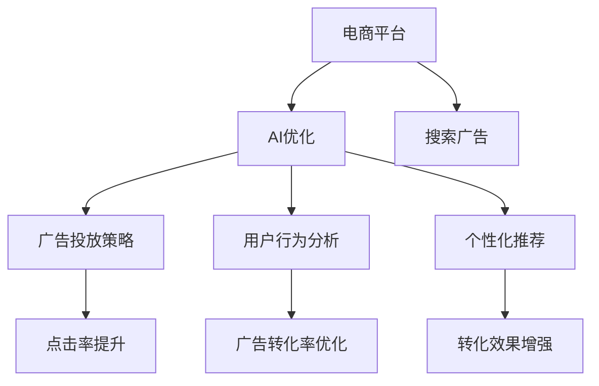

                 

# AI如何优化电商平台的搜索广告投放

> 关键词：AI优化,电商平台,搜索广告,投放策略,用户行为分析,点击率,广告转化率,个性化推荐

## 1. 背景介绍

随着互联网电商平台的蓬勃发展，广告投放成为了商家获取流量和提高转化率的重要手段。然而，传统的广告投放策略往往存在资源浪费和效果不佳的问题，难以精准匹配用户需求和商家需求。近年来，人工智能（AI）技术的迅猛发展为电商平台的广告投放带来了新的契机。本文将探讨AI如何通过优化投放策略，提升搜索广告的点击率和转化率，从而大幅提高电商平台的广告效益。

## 2. 核心概念与联系

### 2.1 核心概念概述

为更好地理解AI如何优化电商平台的搜索广告投放，本节将介绍几个核心概念：

- **人工智能（AI）**：一种利用算法和模型模拟人类智能的技术，包括机器学习、深度学习等。
- **电商平台**：提供在线购物服务的平台，如淘宝、京东、亚马逊等。
- **搜索广告（Search Ads）**：用户通过搜索引擎或电商平台搜索关键词时，展示的广告。
- **广告投放策略（Ad Placement Strategy）**：确定广告展示位置和时间的策略，以最大化广告效益。
- **用户行为分析（User Behavior Analysis）**：分析用户在电商平台上的行为模式，包括搜索、浏览、购买等。
- **点击率（Click-Through Rate, CTR）**：用户在看到广告后点击的频率。
- **广告转化率（Conversion Rate）**：用户在看到广告并完成购买等转化行为的频率。
- **个性化推荐（Personalized Recommendation）**：根据用户历史行为，推荐最符合用户需求的产品或广告。

这些核心概念之间的逻辑关系可以通过以下Mermaid流程图来展示：



这个流程图展示的核心概念及其之间的联系：

1. 电商平台通过AI优化获取广告效益。
2. AI优化生成广告投放策略，以最大化点击率。
3. 用户行为分析揭示用户需求，辅助广告投放。
4. 个性化推荐提升广告相关性和转化率。
5. 点击率和转化率的提升，最终提升广告效益。

## 3. 核心算法原理 & 具体操作步骤

### 3.1 算法原理概述

AI优化电商平台搜索广告投放的核心思想是通过数据分析和机器学习技术，识别用户行为特征和广告展示时机，从而制定更精准的广告投放策略。具体而言，步骤如下：

1. **数据收集**：收集用户搜索行为数据和广告投放数据。
2. **特征提取**：从数据中提取有用的特征，如用户浏览历史、搜索关键词、购买记录等。
3. **模型训练**：利用机器学习模型，训练点击率预测模型和广告转化率预测模型。
4. **广告投放**：根据模型预测结果，优化广告投放策略，提升点击率和转化率。

### 3.2 算法步骤详解

**Step 1: 数据收集与预处理**
- 使用API从电商平台获取用户搜索行为数据，包括搜索关键词、点击位置、停留时间等。
- 收集广告投放数据，如广告展示时间、点击次数、转化次数等。
- 清洗数据，去除异常值和噪声，将数据转换为可用于模型训练的格式。

**Step 2: 特征提取**
- 使用TF-IDF、词嵌入（如Word2Vec、BERT等）等技术，从搜索关键词中提取有意义的特征。
- 收集用户的历史行为数据，提取用户兴趣标签和行为特征。
- 设计特征交叉项，将不同特征组合在一起，增加模型的表达能力。

**Step 3: 模型训练**
- 使用随机森林、XGBoost、深度神经网络等算法，训练点击率预测模型和广告转化率预测模型。
- 使用交叉验证等技术，评估模型的性能，避免过拟合。
- 优化模型的超参数，提高预测准确率。

**Step 4: 广告投放优化**
- 根据模型预测结果，调整广告投放策略。如在用户浏览时展示相关广告，在热门搜索词前后展示热门广告等。
- 使用A/B测试等技术，验证优化策略的效果，逐步优化广告投放策略。

### 3.3 算法优缺点

AI优化电商平台搜索广告投放具有以下优点：

- **精准投放**：通过数据分析，精准匹配用户需求和广告内容，提升广告点击率。
- **高效转化**：利用个性化推荐，提高广告的转化率，降低无效广告的浪费。
- **动态调整**：能够实时调整广告投放策略，快速适应市场变化。
- **数据驱动**：基于用户行为数据和广告效果数据，做出科学决策。

但同时，该方法也存在一定的局限性：

- **数据隐私**：需要大量用户数据，可能引发隐私保护问题。
- **模型复杂**：深度学习模型训练复杂，需要大量计算资源。
- **动态环境**：电商平台环境变化快，模型需要不断更新才能保持准确性。
- **策略博弈**：商家可能通过作弊手段绕过优化策略，降低效果。

### 3.4 算法应用领域

AI优化电商平台搜索广告投放技术，在电商广告投放、智能推荐系统、搜索引擎优化等领域均有广泛应用：

- **电商广告投放**：通过优化广告展示时机和内容，提升广告点击率和转化率。
- **智能推荐系统**：利用用户行为分析，推荐个性化商品，提高购买转化率。
- **搜索引擎优化**：通过分析用户搜索行为，优化搜索引擎关键词，提升搜索效果。

## 4. 数学模型和公式 & 详细讲解

### 4.1 数学模型构建

本节将使用数学语言对AI优化电商平台搜索广告投放过程进行更加严格的刻画。

记用户搜索数据为 $\mathcal{D} = \{(x_i, y_i)\}_{i=1}^N$，其中 $x_i = (x_{i1}, x_{i2}, ..., x_{in})$ 为搜索关键词，$y_i \in \{1, 0\}$ 为点击标记，1表示点击，0表示未点击。

定义点击率预测模型为 $f(x_i; \theta)$，其中 $\theta$ 为模型参数。点击率预测模型可以使用以下逻辑回归公式：

$$
f(x_i; \theta) = \frac{1}{1 + \exp(-\theta^T \phi(x_i))}
$$

其中 $\phi(x_i)$ 为特征映射函数，将原始特征 $x_i$ 映射为特征向量。

定义广告转化率预测模型为 $g(x_i, y_i; \theta)$，其中 $\theta$ 为模型参数。广告转化率预测模型可以使用以下多元逻辑回归公式：

$$
g(x_i, y_i; \theta) = \frac{\exp(\theta^T \phi(x_i) + \beta y_i)}{1 + \exp(\theta^T \phi(x_i) + \beta y_i)}
$$

其中 $\beta$ 为广告转化率因子，用于调整广告转化率的预测。

### 4.2 公式推导过程

以下我们以二分类问题为例，推导点击率预测模型的损失函数及梯度计算公式。

假设模型在训练集 $\mathcal{D}$ 上的损失函数为交叉熵损失函数：

$$
L(\theta) = -\frac{1}{N} \sum_{i=1}^N [y_i \log f(x_i; \theta) + (1-y_i) \log (1 - f(x_i; \theta))]
$$

其中 $f(x_i; \theta)$ 为模型在输入 $x_i$ 上的预测值。

对损失函数求导，得到模型参数 $\theta$ 的梯度：

$$
\nabla_{\theta}L(\theta) = \frac{1}{N} \sum_{i=1}^N [f(x_i; \theta) - y_i] \nabla_{\theta}\phi(x_i)
$$

其中 $\nabla_{\theta}\phi(x_i)$ 为特征映射函数 $\phi(x_i)$ 对参数 $\theta$ 的梯度。

在得到梯度后，即可带入参数更新公式，完成模型的迭代优化。重复上述过程直至收敛，最终得到适应电商平台广告投放的最优模型参数 $\theta^*$。

## 5. 项目实践：代码实例和详细解释说明

### 5.1 开发环境搭建

在进行广告投放优化实践前，我们需要准备好开发环境。以下是使用Python进行TensorFlow开发的环境配置流程：

1. 安装Anaconda：从官网下载并安装Anaconda，用于创建独立的Python环境。

2. 创建并激活虚拟环境：
```bash
conda create -n tf-env python=3.8 
conda activate tf-env
```

3. 安装TensorFlow：从官网获取对应的安装命令。例如：
```bash
conda install tensorflow tensorflow-cpu -c conda-forge
```

4. 安装Pandas、Numpy、Scikit-learn等常用的Python科学计算库。

5. 安装TensorBoard：TensorFlow配套的可视化工具，用于监测模型训练过程。

```bash
pip install tensorboard
```

完成上述步骤后，即可在`tf-env`环境中开始广告投放优化的实践。

### 5.2 源代码详细实现

下面以点击率预测为例，给出使用TensorFlow对搜索广告进行优化的PyTorch代码实现。

首先，定义点击率预测模型：

```python
import tensorflow as tf
from tensorflow.keras.layers import Dense, Input
from tensorflow.keras.models import Model

def create_click_rate_model(input_shape, num_classes):
    input_layer = Input(shape=input_shape)
    x = Dense(64, activation='relu')(input_layer)
    x = Dense(32, activation='relu')(x)
    output_layer = Dense(1, activation='sigmoid')(x)
    model = Model(inputs=input_layer, outputs=output_layer)
    return model
```

然后，定义模型训练函数：

```python
def train_click_rate_model(model, train_dataset, val_dataset, epochs, batch_size, learning_rate):
    model.compile(optimizer=tf.keras.optimizers.Adam(learning_rate=learning_rate), loss='binary_crossentropy', metrics=['accuracy'])
    history = model.fit(train_dataset, validation_data=val_dataset, epochs=epochs, batch_size=batch_size, verbose=1)
    return model, history
```

接着，定义广告投放优化函数：

```python
def optimize_ad_placement(model, test_dataset, batch_size, learning_rate):
    model.compile(optimizer=tf.keras.optimizers.Adam(learning_rate=learning_rate), loss='binary_crossentropy', metrics=['accuracy'])
    history = model.fit(test_dataset, validation_data=test_dataset, epochs=1, batch_size=batch_size, verbose=1)
    return history
```

最后，启动广告投放优化流程：

```python
# 准备数据集
train_dataset = ...
val_dataset = ...
test_dataset = ...

# 定义模型
input_shape = ...
num_classes = ...
model = create_click_rate_model(input_shape, num_classes)

# 训练模型
epochs = ...
batch_size = ...
learning_rate = ...
model, history = train_click_rate_model(model, train_dataset, val_dataset, epochs, batch_size, learning_rate)

# 优化广告投放
test_dataset = ...
history = optimize_ad_placement(model, test_dataset, batch_size, learning_rate)
```

以上就是使用TensorFlow对搜索广告进行优化和广告投放实践的完整代码实现。可以看到，TensorFlow提供了一套完善的机器学习框架，使得广告投放优化过程变得简洁高效。

### 5.3 代码解读与分析

让我们再详细解读一下关键代码的实现细节：

**create_click_rate_model函数**：
- 定义了点击率预测模型，包括输入层、多个隐藏层和输出层。
- 使用ReLU激活函数增加模型非线性能力。
- 输出层使用Sigmoid激活函数，输出预测概率。

**train_click_rate_model函数**：
- 使用交叉熵损失函数和准确率评估指标，编译模型。
- 调用fit函数进行模型训练，并在验证集上评估模型性能。
- 返回训练历史，用于后续分析和优化。

**optimize_ad_placement函数**：
- 使用与训练相同的优化器和损失函数，在测试集上评估模型性能。
- 调用fit函数进行模型优化，返回优化历史。
- 优化历史用于后续的A/B测试和效果评估。

**广告投放优化流程**：
- 准备训练集、验证集和测试集。
- 定义模型结构，设置输入形状和输出类别。
- 使用交叉熵损失函数和Adam优化器训练模型，并在验证集上评估效果。
- 使用优化函数在测试集上进一步优化模型，获得优化历史。

可以看到，TensorFlow提供的高级API和模型训练工具，使得广告投放优化过程变得自动化和可复用。开发者只需关注模型设计和特征提取，其他细节由框架自动处理。

当然，实际应用中还需要考虑更多因素，如模型调参、超参数搜索、模型部署等。但核心的广告投放优化流程基本与此类似。

## 6. 实际应用场景

### 6.1 电商广告投放

基于AI优化，电商平台可以更好地实现搜索广告的精准投放。具体而言，可以在用户搜索关键词时，根据预测的点击率，动态调整广告展示时机和内容。例如，对点击率高的关键词，展示点击率预测模型预判的高效广告；对点击率低的关键词，展示不相关的广告或调整展示时机。

在技术实现上，可以收集用户搜索行为数据，提取关键词、点击位置、停留时间等特征。将特征输入点击率预测模型，得到点击率预测结果。根据预测结果，调整广告投放策略，以提升广告点击率和转化率。

### 6.2 智能推荐系统

智能推荐系统利用用户行为分析，推荐个性化商品，提高购买转化率。AI优化可以通过分析用户搜索历史和点击记录，提取用户兴趣和行为特征。将这些特征输入广告转化率预测模型，得到广告转化率的预测结果。根据预测结果，推荐最相关的商品广告，提升广告效果。

例如，当用户搜索某一商品时，根据广告转化率预测模型的结果，推荐类似商品或相关商品广告。在用户点击某个商品广告时，继续根据模型预测结果，推荐更多相关商品广告，形成用户购物路径的闭环，增加用户粘性和购买转化率。

### 6.3 搜索引擎优化

搜索引擎优化利用用户搜索行为数据，优化关键词排名和广告展示时机。AI优化可以通过分析用户搜索历史和点击记录，提取用户搜索意图和行为特征。将这些特征输入点击率预测模型，得到点击率预测结果。根据预测结果，调整关键词排名和广告展示时机，以提升搜索效果。

例如，当用户搜索某一关键词时，根据点击率预测模型的结果，优化关键词排名和广告展示时机，提升广告点击率和转化率。同时，根据用户行为数据，调整广告投放策略，优化广告展示效果。

### 6.4 未来应用展望

随着AI技术的不断进步，未来广告投放优化将呈现以下几个趋势：

1. **深度学习模型的进步**：随着深度学习模型的不断改进，广告投放优化的效果将不断提升。如使用Transformer模型，提高广告投放的智能化程度。
2. **数据驱动的优化**：基于用户行为数据和广告效果数据，不断优化广告投放策略，提升广告效益。
3. **个性化推荐的增强**：利用用户行为数据，提供更加精准的个性化推荐，提高广告转化率。
4. **多模态数据的融合**：将文本、图像、音频等多种模态数据融合，提高广告的展示效果。
5. **动态调整的优化**：基于实时数据，动态调整广告投放策略，提高广告投放的时效性。
6. **道德与法律的约束**：在广告投放优化过程中，考虑数据隐私和广告伦理，确保广告投放的合法合规。

## 7. 工具和资源推荐

### 7.1 学习资源推荐

为了帮助开发者系统掌握AI优化电商平台搜索广告投放的理论基础和实践技巧，这里推荐一些优质的学习资源：

1. **《深度学习》课程**：斯坦福大学Andrew Ng教授开设的机器学习课程，内容涵盖深度学习基础知识和实践技巧。
2. **《TensorFlow官方文档》**：TensorFlow官方文档，提供了详细的API和使用示例，适合初学者快速上手。
3. **《推荐系统实战》书籍**：介绍推荐系统的理论和实践，涵盖广告投放优化的内容。
4. **《自然语言处理与深度学习》书籍**：介绍自然语言处理的基础知识和深度学习技术，涵盖广告投放优化的应用。
5. **《机器学习实战》书籍**：介绍机器学习的基础知识和实践技巧，涵盖广告投放优化的应用。

通过对这些资源的学习实践，相信你一定能够快速掌握AI优化电商平台搜索广告投放的精髓，并用于解决实际的广告投放问题。

### 7.2 开发工具推荐

高效的开发离不开优秀的工具支持。以下是几款用于广告投放优化开发的常用工具：

1. **Python**：简单易用的编程语言，拥有丰富的科学计算库和机器学习框架。
2. **TensorFlow**：由Google主导开发的深度学习框架，生产部署方便，适合大规模工程应用。
3. **Pandas**：用于数据处理和分析的Python库，支持高效的数据清洗和特征提取。
4. **Scikit-learn**：用于机器学习建模和评估的Python库，支持多种经典算法。
5. **TensorBoard**：TensorFlow配套的可视化工具，可以实时监测模型训练状态，并提供丰富的图表呈现方式。
6. **Jupyter Notebook**：交互式编程环境，支持Python代码的快速迭代和实验验证。

合理利用这些工具，可以显著提升广告投放优化的开发效率，加快创新迭代的步伐。

### 7.3 相关论文推荐

AI优化电商平台搜索广告投放技术的发展，得益于学界的持续研究。以下是几篇奠基性的相关论文，推荐阅读：

1. **Click-Through Rate Prediction Using Deep Learning**：提出使用深度学习模型进行点击率预测，提高广告投放的效果。
2. **Personalized Recommendation with Implicit Feedback**：介绍利用用户行为数据进行个性化推荐，提高广告转化率。
3. **Search Engine Optimization Using Deep Learning**：提出使用深度学习模型进行搜索引擎优化，提升广告效果。
4. **Ad Placement Optimization Using Reinforcement Learning**：提出使用强化学习进行广告投放优化，提高广告效益。
5. **Fairness and Privacy-Preserving Recommendation Systems**：介绍如何在推荐系统中考虑数据隐私和公平性，确保广告投放的合法合规。

这些论文代表了大规模广告投放优化技术的发展脉络。通过学习这些前沿成果，可以帮助研究者把握学科前进方向，激发更多的创新灵感。

## 8. 总结：未来发展趋势与挑战

### 8.1 总结

本文对AI如何优化电商平台的搜索广告投放进行了全面系统的介绍。首先阐述了AI优化在电商平台搜索广告投放中的重要性，明确了优化策略在提升广告点击率和转化率方面的独特价值。其次，从原理到实践，详细讲解了AI优化投放策略的数学模型和操作步骤，给出了广告投放优化的完整代码实例。同时，本文还广泛探讨了AI优化在电商广告投放、智能推荐系统、搜索引擎优化等多个领域的应用前景，展示了AI优化的巨大潜力。此外，本文精选了广告优化技术的各类学习资源，力求为读者提供全方位的技术指引。

通过本文的系统梳理，可以看到，AI优化在电商平台搜索广告投放中起到了至关重要的作用。AI优化通过数据分析和机器学习技术，精准匹配用户需求和广告内容，显著提升了广告投放的点击率和转化率，从而大幅提高了电商平台的广告效益。未来，伴随AI技术的不断进步，广告投放优化必将进一步提升智能化水平，推动电商平台的持续发展。

### 8.2 未来发展趋势

展望未来，AI优化电商平台搜索广告投放技术将呈现以下几个发展趋势：

1. **深度学习模型的应用**：随着深度学习模型的不断改进，广告投放优化的效果将不断提升。如使用Transformer模型，提高广告投放的智能化程度。
2. **多模态数据的融合**：将文本、图像、音频等多种模态数据融合，提高广告的展示效果。
3. **实时数据驱动**：基于实时数据，动态调整广告投放策略，提高广告投放的时效性。
4. **个性化推荐的增强**：利用用户行为数据，提供更加精准的个性化推荐，提高广告转化率。
5. **道德与法律的约束**：在广告投放优化过程中，考虑数据隐私和广告伦理，确保广告投放的合法合规。

以上趋势凸显了AI优化在电商平台广告投放中的广阔前景。这些方向的探索发展，必将进一步提升广告投放的智能化水平，为电商平台带来更多的市场机会和用户粘性。

### 8.3 面临的挑战

尽管AI优化电商平台搜索广告投放技术已经取得了显著成效，但在迈向更加智能化、普适化应用的过程中，它仍面临着诸多挑战：

1. **数据隐私问题**：收集和处理用户行为数据，可能引发隐私保护问题。如何在保证用户隐私的同时，获取高质量的数据，是一个重要难题。
2. **模型复杂度**：深度学习模型训练复杂，需要大量计算资源。如何在保证效果的同时，降低模型复杂度，是一个重要挑战。
3. **动态环境适应**：电商平台环境变化快，模型需要不断更新才能保持准确性。如何在动态环境中保持模型效果，是一个重要问题。
4. **道德与法律合规**：广告投放优化过程中，涉及数据隐私、广告伦理等多个方面，如何确保合规性，是一个重要挑战。

### 8.4 研究展望

面对AI优化电商平台搜索广告投放所面临的挑战，未来的研究需要在以下几个方面寻求新的突破：

1. **隐私保护技术**：探索如何在保证用户隐私的前提下，获取高质量的数据，确保数据使用的合法合规。
2. **高效模型优化**：开发更加高效、轻量级的广告投放优化模型，降低计算资源消耗。
3. **多模态数据融合**：研究如何将文本、图像、音频等多种模态数据融合，提高广告展示效果。
4. **动态环境优化**：研究如何在动态环境中，保持广告投放优化的效果，提高模型的鲁棒性和泛化能力。
5. **道德与法律合规**：探索如何在广告投放优化过程中，考虑数据隐私和广告伦理，确保广告投放的合法合规。

这些研究方向将引领AI优化技术的发展，推动电商平台广告投放的持续优化和创新。

## 9. 附录：常见问题与解答

**Q1: 如何确保广告投放优化的效果？**

A: 确保广告投放优化的效果，需要从多个方面进行综合考虑：

1. **数据质量**：保证广告投放优化所使用的数据质量，避免噪声和异常值。
2. **模型选择**：选择合适的广告投放优化模型，如使用Transformer模型，提高广告投放的智能化程度。
3. **超参数调优**：通过交叉验证等技术，调整模型的超参数，提高模型的泛化能力。
4. **动态优化**：基于实时数据，动态调整广告投放策略，提高广告投放的时效性。
5. **效果评估**：使用A/B测试等技术，验证优化策略的效果，逐步优化广告投放策略。

以上措施可以综合应用，确保广告投放优化的效果，提升广告效益。

**Q2: 如何处理广告投放中的作弊问题？**

A: 广告投放优化过程中，可能遇到商家通过作弊手段绕过优化策略，降低效果。以下是一些常见的作弊问题及处理方式：

1. **点击欺诈**：商家通过虚假点击等手段，提高广告点击率。处理方法包括引入对抗样本，检测和过滤虚假点击。
2. **展示欺诈**：商家通过展示恶意广告，获取点击。处理方法包括实时监控广告展示效果，检测并惩罚恶意广告。
3. **恶意关键词**：商家通过购买点击率高的关键词，进行恶意点击。处理方法包括引入反作弊机制，检测并惩罚恶意关键词。
4. **点击作弊**：商家通过多种手段，提高点击率。处理方法包括引入反作弊机制，检测并惩罚点击作弊行为。

通过以上方法，可以有效地处理广告投放中的作弊问题，保障广告投放的公平性和有效性。

**Q3: 如何平衡广告投放的点击率和转化率？**

A: 平衡广告投放的点击率和转化率，需要从多个方面进行综合考虑：

1. **目标设置**：根据广告目标，合理设置点击率和转化率的平衡点。如对于品牌推广，可以更关注点击率；对于销售转化，可以更关注转化率。
2. **特征工程**：利用特征工程技术，提取有意义的特征，提高广告点击率和转化率的预测准确性。
3. **动态优化**：基于实时数据，动态调整广告投放策略，平衡点击率和转化率。
4. **A/B测试**：通过A/B测试等技术，验证广告投放策略的效果，逐步优化广告投放策略。

以上措施可以综合应用，平衡广告投放的点击率和转化率，提升广告效益。

---

作者：禅与计算机程序设计艺术 / Zen and the Art of Computer Programming

