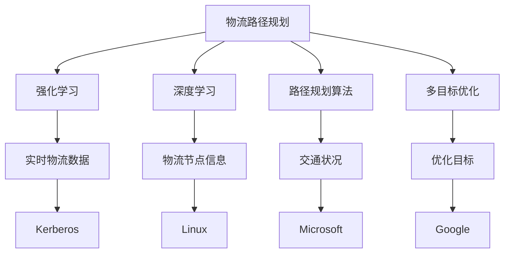

                 

# AI如何优化电商平台的跨境物流路径规划

## 1. 背景介绍

随着全球化贸易的快速发展，跨境电商逐渐成为国际市场上的一种重要交易方式。其特点在于商品跨越国界进行买卖，涉及到不同的国家、地区、海关、物流等复杂环节，如何高效、可靠、经济地完成物流路径规划，是电商平台面临的重要挑战。传统的物流路径规划依赖人工经验，效率低下且容易出错。因此，利用AI技术，特别是强化学习(Reinforcement Learning, RL)和深度学习(Deep Learning, DL)，在电商平台上实施智能路径规划，具有重要的实际意义。

### 1.1 问题由来

当前，电商平台的跨境物流路径规划面临着以下主要问题：

1. **复杂多变的环境**：各国的政策、税收、海关、物流基础设施差异巨大，物流路径规划需考虑多种因素，如运输时间、成本、风险等。
2. **资源受限**：实时物流数据量庞大，需要高效的算法进行处理和规划。
3. **路径规划精确度要求高**：需要快速找到最优路径，避免延迟和成本损失。
4. **多目标优化**：传统路径规划通常只考虑单一目标（如时间或成本），而电商物流路径规划需同时考虑多个目标（如时间、成本、风险等），并权衡其权重。

## 2. 核心概念与联系

### 2.1 核心概念概述

为了更好地理解利用AI进行跨境物流路径规划的原理和流程，本节将介绍一些核心概念及其关系：

- **强化学习(Reinforcement Learning, RL)**：一种通过与环境交互，根据环境反馈不断优化策略的机器学习方法。在物流路径规划中，环境即为实时物流数据，目标是找到成本低、时间短、风险小的路径。
- **深度学习(Deep Learning, DL)**：一种基于神经网络的机器学习方法，通过大量数据训练模型，实现高效、复杂的模式识别和决策。
- **路径规划算法**：包括经典算法如Dijkstra、A*、蚁群算法等，以及基于RL和DL的智能路径规划方法。
- **强化学习环境**：物流路径规划中的环境包括各种物流节点（如港口、机场、仓库）、交通状况、运输工具（如飞机、船只、车辆）等，各环境因素影响路径选择和成本计算。
- **多目标优化**：物流路径规划涉及多个优化目标，需采用多目标优化算法处理。

这些核心概念间的联系可以通过以下Mermaid流程图来展示：



## 3. 核心算法原理 & 具体操作步骤
### 3.1 算法原理概述

在电商平台的跨境物流路径规划中，主要利用RL和DL进行智能路径规划。其核心思想是通过与物流环境的交互，学习最优的路径选择策略，同时利用深度学习模型处理实时数据，提升路径规划的精确度和效率。

强化学习算法在路径规划中的基本流程如下：

1. **环境建模**：将物流路径规划问题抽象为强化学习环境，环境状态为物流路径当前状态，动作为路径上的移动选择，奖励为路径质量（如成本、时间等）。
2. **策略设计**：设计一个策略函数，将当前状态映射到动作。这个策略函数可以是基于深度学习的网络，如深度Q网络(DQN)或策略网络(Actor-Critic)。
3. **学习与优化**：在环境中执行策略，通过与环境的交互获得奖励，并根据奖励调整策略。这一过程是动态的，每次执行都是对策略的一次优化。
4. **路径评估**：利用深度学习模型对路径进行评估，如计算路径成本、时间等。

### 3.2 算法步骤详解

以下详细介绍在电商平台上实施物流路径规划的具体算法步骤：

**Step 1: 构建强化学习环境**
- **环境状态表示**：将物流路径抽象为状态空间，每个状态包含路径当前位置、运输工具类型、时间、距离等信息。
- **动作空间设计**：动作空间设计为在当前位置可选的移动方向，如前、后、左、右等。
- **奖励设计**：根据物流成本、时间等因素设计奖励函数，如成本越低、时间越短，奖励越高。

**Step 2: 选择与训练策略**
- **策略网络选择**：根据任务特性选择合适的策略网络，如DQN、策略网络等。
- **训练与优化**：通过与环境交互，不断调整策略网络参数，以优化路径选择。
- **经验回放**：利用经验回放算法，将历史经验数据用于策略优化。

**Step 3: 实时数据处理**
- **实时数据采集**：通过API等手段实时获取物流路径信息、交通状况、天气情况等。
- **数据预处理**：对实时数据进行清洗、标准化等预处理。
- **深度学习模型构建**：构建深度学习模型，用于路径评估。

**Step 4: 路径规划与执行**
- **路径规划**：根据实时数据和策略网络输出，规划最优路径。
- **路径执行**：通过控制运输工具执行路径规划，实时调整路径。

**Step 5: 评估与反馈**
- **路径评估**：利用深度学习模型对路径进行评估，如计算路径成本、时间等。
- **反馈与优化**：根据路径评估结果调整策略网络参数，进一步优化路径规划。

### 3.3 算法优缺点

利用强化学习和深度学习进行物流路径规划具有以下优点：

1. **动态适应性**：实时数据变化能够迅速反应，动态调整路径规划，提升效率。
2. **优化效果显著**：通过多次交互和优化，能够找到成本低、时间短、风险小的最优路径。
3. **鲁棒性强**：利用多个策略网络进行优化，避免单一策略失效。
4. **可扩展性强**：算法具有较高的可扩展性，适用于多种规模的物流路径规划。

同时，也存在一些局限性：

1. **训练成本高**：需要大量的历史数据和计算资源进行训练。
2. **策略复杂**：路径规划涉及多种因素，策略设计复杂。
3. **实时性要求高**：实时数据处理和路径规划需要高效算法。

### 3.4 算法应用领域

基于强化学习和深度学习的路径规划算法在电商平台的跨境物流路径规划中具有广泛的应用前景，特别是在以下领域：

- **大型电商平台**：具有大量跨境物流需求，需要高效的路径规划算法。
- **跨境物流服务商**：需要快速、高效、安全的路径规划，提升客户满意度。
- **物流仓储中心**：优化物流路径，提高仓储效率。

## 4. 数学模型和公式 & 详细讲解 & 举例说明
### 4.1 数学模型构建

在电商平台的物流路径规划中，数学模型通常涉及以下要素：

- **状态空间**：物流路径上的当前位置、时间、交通状况等。
- **动作空间**：当前位置可选的移动方向，如前后左右。
- **奖励函数**：成本、时间、安全等目标的权重和函数形式。
- **深度学习模型**：用于路径评估和状态预测的深度神经网络。

假设物流路径的初始状态为$s_0$，当前状态为$s_t$，动作为$a_t$，奖励为$r_t$，则强化学习问题的数学模型可以表示为：

$$
\begin{aligned}
&\max_{\pi} \sum_{t=0}^{\infty} \gamma^t r_t \\
&\text{s.t. } s_{t+1} = f(s_t, a_t) \\
&\pi(a_t | s_t) = \text{策略函数}
\end{aligned}
$$

其中$f$表示状态转移函数，$\gamma$为折扣因子，$\pi$为策略函数。

### 4.2 公式推导过程

以DQN算法为例，推导其路径规划的核心公式。

**状态值函数估计**：
- **目标函数**：状态值函数估计目标为最小化预测值与实际值的误差，即$J(\theta) = \mathbb{E}_{s,a} [(r+\gamma V_{\theta}(s_{t+1})) - Q_{\theta}(s_t, a_t)]$。
- **预测值更新**：根据当前状态和动作预测下一步状态值，即$V_{\theta}(s_t) \leftarrow V_{\theta}(s_t) + \alpha (r+\gamma V_{\theta}(s_{t+1}) - V_{\theta}(s_t))$。

**动作值函数估计**：
- **目标函数**：动作值函数估计目标为最小化预测值与实际值的误差，即$J(\theta) = \mathbb{E}_{s,a} [(r+\gamma Q_{\theta}(s_{t+1}, a_{t+1})) - Q_{\theta}(s_t, a_t)]$。
- **预测值更新**：根据当前状态和动作预测下一步状态值，即$Q_{\theta}(s_t, a_t) \leftarrow Q_{\theta}(s_t, a_t) + \alpha (r+\gamma Q_{\theta}(s_{t+1}, a_{t+1}) - Q_{\theta}(s_t, a_t))$。

### 4.3 案例分析与讲解

以电商平台跨境物流路径规划为例，假设物流路径从A城市出发到B城市，中间有多个中转站（如C、D、E），需考虑运输时间、成本、安全等目标，设计如下计算步骤：

1. **状态表示**：$s_t = (x_t, y_t, t, z)$，其中$x_t$、$y_t$表示当前位置坐标，$t$表示当前时间，$z$表示当前状态对应的风险等级。
2. **动作表示**：$a_t = (a_x, a_y)$，其中$a_x$、$a_y$表示可选的移动方向。
3. **奖励函数**：$r_t = r_{cost} + r_{time} - r_{risk}$，其中$r_{cost}$表示运输成本，$r_{time}$表示运输时间，$r_{risk}$表示当前状态的风险。
4. **深度学习模型**：使用深度神经网络对路径成本进行评估，构建模型$V_{\theta}(s_t)$。

根据上述模型，利用DQN算法进行路径规划，步骤如下：

1. **初始化**：随机初始化策略网络参数$\theta$，设置学习率$\alpha$，折扣因子$\gamma$。
2. **迭代**：在每次迭代中，根据当前状态$s_t$选择动作$a_t$，执行到状态$s_{t+1}$，获得奖励$r_t$，利用模型更新策略参数$\theta$。
3. **回放**：将当前状态、动作、奖励、下一状态存储在经验回放缓冲区，定期采样进行策略更新。

通过上述步骤，可以实现基于强化学习和深度学习的路径规划，实时优化物流路径，提升电商平台的物流效率和服务质量。

## 5. 项目实践：代码实例和详细解释说明
### 5.1 开发环境搭建

在进行路径规划的代码实现前，我们需要准备好开发环境。以下是使用Python进行强化学习路径规划的环境配置流程：

1. 安装Anaconda：从官网下载并安装Anaconda，用于创建独立的Python环境。

2. 创建并激活虚拟环境：
```bash
conda create -n path_planning python=3.8 
conda activate path_planning
```

3. 安装必要的库：
```bash
conda install gym numpy scipy matplotlib pyreinforcement
```

4. 安装TensorFlow或PyTorch：
```bash
conda install tensorflow=2.4 
# 或者
conda install torch=1.8
```

5. 安装Reinforcement Learning相关库：
```bash
conda install stable-baselines3
```

完成上述步骤后，即可在`path_planning`环境中开始路径规划的实践。

### 5.2 源代码详细实现

下面我们以电商平台跨境物流路径规划为例，给出使用Stable Baselines3库进行路径规划的PyTorch代码实现。

首先，定义状态空间和动作空间：

```python
import gym
from gym.spaces import Discrete, Box

class PathPlanningEnv(gym.Env):
    def __init__(self, start, end, transit_stops):
        self.start = start
        self.end = end
        self.transit_stops = transit_stops
        self.current_state = start
        self.current_time = 0
        self.risk = 0
        
        self.action_space = Discrete(4)
        self.state_space = Box(low=-1, high=1, shape=(3,), dtype=np.float32)
        
    def step(self, action):
        # 执行动作，更新状态
        # 假设此处已经实现状态转移和奖励计算
        pass
        self.current_state, reward, done, info = None, 0, False, None
        return self.current_state, reward, done, info
        
    def reset(self):
        self.current_state = self.start
        self.current_time = 0
        self.risk = 0
        return self.current_state
```

然后，构建深度学习模型进行路径评估：

```python
import torch.nn as nn
import torch.optim as optim

class PathCostNet(nn.Module):
    def __init__(self, input_dim=3, output_dim=1):
        super(PathCostNet, self).__init__()
        self.fc1 = nn.Linear(input_dim, 64)
        self.fc2 = nn.Linear(64, 64)
        self.fc3 = nn.Linear(64, output_dim)
        
    def forward(self, x):
        x = nn.functional.relu(self.fc1(x))
        x = nn.functional.relu(self.fc2(x))
        x = self.fc3(x)
        return x

cost_net = PathCostNet(input_dim=3, output_dim=1)
optimizer = optim.Adam(cost_net.parameters(), lr=0.001)
```

最后，实现强化学习算法进行路径规划：

```python
from stable_baselines3 import DQN
from stable_baselines3.common.vec_env import DummyVecEnv

# 创建虚拟环境
env = DummyVecEnv([lambda: PathPlanningEnv(start, end, transit_stops)])

# 构建策略网络
model = DQN(cost_net, env)

# 训练策略
for i in range(10000):
    obs = env.reset()
    done = False
    while not done:
        # 从策略网络中采样动作
        action, _ = model.predict(obs)
        # 执行动作，更新状态
        obs, reward, done, info = env.step(action)
        # 计算路径成本
        cost = model.compute_path_cost(obs)
        # 更新策略网络参数
        optimizer.zero_grad()
        loss = model.loss(cost)
        loss.backward()
        optimizer.step()
```

以上就是使用PyTorch和Stable Baselines3库进行路径规划的完整代码实现。可以看到，通过利用现有的库和框架，可以很方便地构建强化学习和深度学习模型，实现物流路径规划。

### 5.3 代码解读与分析

让我们再详细解读一下关键代码的实现细节：

**PathPlanningEnv类**：
- `__init__`方法：初始化状态空间、动作空间、当前状态、当前时间、风险等级等关键组件。
- `step`方法：执行动作，更新状态，并返回奖励。
- `reset`方法：重置环境，返回初始状态。

**PathCostNet类**：
- `__init__`方法：定义深度学习模型的结构，包括两个全连接层和一个输出层。
- `forward`方法：定义前向传播计算路径成本的函数。

**训练流程**：
- 创建虚拟环境`DummyVecEnv`，实例化多个路径规划环境。
- 创建DQN策略网络`DQN`，并连接深度学习模型`PathCostNet`。
- 在10000次迭代中，通过环境交互，不断更新策略网络参数。

这些代码展示了如何使用深度学习和强化学习模型实现路径规划，并通过策略网络的优化，动态调整路径选择，达到最优路径规划的目的。

## 6. 实际应用场景
### 6.1 智能仓储系统

基于AI的路径规划技术，可以应用于智能仓储系统的规划和优化。在仓储系统中，物流路径的规划直接影响着货物的存储和调度效率。通过利用强化学习和深度学习模型，可以实时动态地调整路径，提高仓库的运营效率和响应速度。

在智能仓储系统中，路径规划需考虑货物的种类、数量、位置、仓库容量、人员配备等因素，设计合适的奖励函数和状态空间。通过路径规划，可以自动化管理货物进出库，提升仓储管理的效率和准确性。

### 6.2 物流配送中心

物流配送中心是电商平台的重要组成部分，路径规划直接影响着货物的配送速度和成本。通过AI技术进行路径规划，可以显著提升物流配送的效率和准确性。

在物流配送中心，路径规划需考虑配送区域的道路状况、交通流量、配送时间、配送任务等，设计合适的奖励函数和动作空间。通过路径规划，可以实时动态地调整配送路径，避免交通堵塞，缩短配送时间，降低配送成本。

### 6.3 实时交通管理

AI路径规划技术也可以应用于实时交通管理，提高道路交通的流畅度和安全性。在交通管理系统中，路径规划需考虑路况、车流量、交通信号等因素，设计合适的奖励函数和状态空间。通过路径规划，可以实时动态地调整交通信号灯，优化道路交通流，减少交通事故和交通堵塞。

### 6.4 未来应用展望

随着AI技术的不断进步，未来路径规划技术将具备更强的实时性和智能性，支持更多的应用场景：

1. **无人机配送**：路径规划技术可以应用于无人机配送，实时动态调整飞行路径，避免障碍物，提高配送效率。
2. **自动驾驶**：路径规划技术可以应用于自动驾驶汽车，实时动态地优化行车路线，提升行车安全和效率。
3. **智能城市管理**：路径规划技术可以应用于智能城市管理，优化交通流，提升城市管理效率，减少交通拥堵和环境污染。

## 7. 工具和资源推荐
### 7.1 学习资源推荐

为了帮助开发者系统掌握路径规划的理论基础和实践技巧，这里推荐一些优质的学习资源：

1. **《强化学习》教材**：由David Silver等人编著，是强化学习领域的经典教材，涵盖了强化学习的基本概念、算法和应用。
2. **《深度学习》教材**：由Ian Goodfellow等人编著，是深度学习领域的经典教材，详细介绍了深度学习的基本原理和实践方法。
3. **OpenAI Gym库**：用于强化学习的模拟环境，包含多种标准的强化学习环境，如Pendulum、CartPole等，是学习和实验强化学习的良好平台。
4. **PyTorch和TensorFlow官方文档**：详细的API文档和示例代码，帮助开发者快速上手深度学习模型的构建和训练。
5. **Stable Baselines3库**：由Deepmind开发的强化学习库，支持多种强化学习算法，提供了简单易用的接口，适合快速实现和调试强化学习模型。

通过对这些资源的学习实践，相信你一定能够快速掌握路径规划的精髓，并用于解决实际的物流路径规划问题。

### 7.2 开发工具推荐

高效的开发离不开优秀的工具支持。以下是几款用于路径规划开发的常用工具：

1. **PyTorch**：基于Python的开源深度学习框架，灵活动态的计算图，适合快速迭代研究。
2. **TensorFlow**：由Google主导开发的开源深度学习框架，生产部署方便，适合大规模工程应用。
3. **Reinforcement Learning相关库**：如Gym、Stable Baselines3等，提供了丰富的环境库和算法库，支持快速构建和调试强化学习模型。
4. **WebGym**：一个在线Gym环境，支持在浏览器中运行强化学习算法，便于远程实验和协作。
5. **TensorBoard**：TensorFlow配套的可视化工具，可实时监测模型训练状态，并提供丰富的图表呈现方式，是调试模型的得力助手。

合理利用这些工具，可以显著提升路径规划任务的开发效率，加快创新迭代的步伐。

### 7.3 相关论文推荐

路径规划技术的发展源于学界的持续研究。以下是几篇奠基性的相关论文，推荐阅读：

1. **Deep Q-Learning**：由Deepmind团队提出的深度强化学习算法，基于深度神经网络实现，在多种环境上取得了显著的效果。
2. **Proximal Policy Optimization (PPO)**：由OpenAI提出的强化学习算法，具有高效、稳定的特性，适用于多目标优化问题。
3. **Multi-Agent Path Search**：由MIT团队提出的多智能体路径规划算法，通过协同优化多个智能体的行为，实现路径规划的优化。
4. **DCAE: Deep Cross-Agent Environment**：由Berkeley团队提出的多智能体环境框架，支持复杂的路径规划和多智能体协作。
5. **OMPL: Open Motion Planning Library**：由CMU团队开发的运动规划库，提供了多种路径规划算法和接口，支持多种运动学和动力学模型。

这些论文代表了大语言模型微调技术的发展脉络。通过学习这些前沿成果，可以帮助研究者把握学科前进方向，激发更多的创新灵感。

## 8. 总结：未来发展趋势与挑战
### 8.1 研究成果总结

本文对基于AI的电商平台的跨境物流路径规划方法进行了全面系统的介绍。首先阐述了路径规划问题的复杂性和应用需求，明确了利用AI进行路径规划的必要性和价值。其次，从原理到实践，详细讲解了强化学习和深度学习在路径规划中的核心算法和操作步骤，给出了具体的代码实现。同时，本文还广泛探讨了路径规划方法在智能仓储、物流配送、交通管理等多个领域的应用前景，展示了路径规划技术的广泛适用性。最后，本文精选了路径规划技术的各类学习资源，力求为读者提供全方位的技术指引。

通过本文的系统梳理，可以看到，基于AI的路径规划方法正在成为物流领域的重要技术范式，显著提升了物流路径的规划效率和质量，为电商平台和物流服务商带来了显著的收益。未来，伴随AI技术的进一步发展，路径规划技术将变得更加智能和高效，进一步拓展物流应用场景，推动物流行业的数字化转型。

### 8.2 未来发展趋势

展望未来，路径规划技术将呈现以下几个发展趋势：

1. **实时性增强**：随着计算能力的提升和算法优化，路径规划将具备更强的实时响应能力，能够快速动态地调整路径，应对突发情况。
2. **智能化提升**：利用多智能体协同优化、深度强化学习等技术，路径规划将具备更高的智能化水平，能够更好地适应复杂多变的物流环境。
3. **跨模态融合**：路径规划将突破单一模态的限制，融合视觉、语音、文本等多模态数据，实现更全面、准确的环境感知和路径规划。
4. **人机协同**：路径规划将更加注重人机协同，引入人的反馈和干预，提高路径规划的可靠性和灵活性。
5. **安全与伦理**：路径规划将更加重视安全性与伦理道德，避免路径规划中的安全风险和伦理问题。

以上趋势凸显了路径规划技术的广阔前景。这些方向的探索发展，必将进一步提升路径规划的效率和质量，推动物流行业的智能化和高效化。

### 8.3 面临的挑战

尽管路径规划技术已经取得了显著成就，但在迈向更加智能化、普适化应用的过程中，它仍面临着诸多挑战：

1. **计算资源瓶颈**：大规模数据和复杂模型的训练需要大量的计算资源，计算成本较高。
2. **算法复杂性**：路径规划涉及多种算法和模型，算法设计和优化难度较大。
3. **数据质量要求高**：实时数据质量对路径规划的效果有直接影响，需要保证数据的准确性和实时性。
4. **环境复杂性**：物流路径涉及多种环境因素，环境建模和模拟复杂。
5. **路径鲁棒性不足**：路径规划需要具备较高的鲁棒性，避免单一路径失效导致的问题。

### 8.4 研究展望

面对路径规划面临的挑战，未来的研究需要在以下几个方面寻求新的突破：

1. **多目标优化**：优化路径规划的多目标优化算法，提高路径规划的精度和效率。
2. **自适应算法**：开发自适应路径规划算法，动态调整路径规划策略，适应不同场景需求。
3. **跨模态融合**：融合多种模态数据，实现更全面、准确的环境感知和路径规划。
4. **人机协同**：引入人的反馈和干预，提高路径规划的可靠性和灵活性。
5. **实时性提升**：优化算法和模型，提升路径规划的实时响应能力，应对突发情况。
6. **安全性与伦理**：注重安全性与伦理道德，避免路径规划中的安全风险和伦理问题。

这些研究方向的探索，必将引领路径规划技术迈向更高的台阶，为构建智能、高效、安全的物流系统铺平道路。面向未来，路径规划技术还需要与其他人工智能技术进行更深入的融合，如知识表示、因果推理、强化学习等，多路径协同发力，共同推动智能物流的发展。

## 9. 附录：常见问题与解答

**Q1：路径规划中如何选择合适的奖励函数？**

A: 路径规划中的奖励函数应综合考虑成本、时间、风险等目标，权衡各目标的重要性。通常采用加权和的方式设计奖励函数，如$r_t = r_{cost} \times \alpha + r_{time} \times \beta - r_{risk} \times \gamma$，其中$\alpha$、$\beta$、$\gamma$为各目标的权重系数。

**Q2：路径规划中的状态空间如何设计？**

A: 路径规划中的状态空间应包含路径当前位置、运输工具类型、时间、距离等信息，具体设计可依据实际情况进行调整。例如，在智能仓储系统中，状态空间可包含货物位置、仓库容量、人员配备等；在物流配送中心，状态空间可包含配送区域、交通状况、配送任务等。

**Q3：路径规划中的动作空间如何设计？**

A: 动作空间设计为在当前位置可选的移动方向，如前后左右等。具体设计应考虑实际物流环境，例如，在智能仓储系统中，动作空间可包含取放货物、移动机械等；在物流配送中心，动作空间可包含选择路线、调整速度等。

**Q4：路径规划中如何处理实时数据？**

A: 路径规划需实时采集物流路径信息、交通状况、天气情况等数据，并进行清洗、标准化等预处理。例如，在智能仓储系统中，需实时采集货物位置、仓库容量等数据；在物流配送中心，需实时采集交通状况、配送任务等数据。

**Q5：路径规划中的深度学习模型如何构建？**

A: 路径规划中的深度学习模型应具备对路径成本、时间等进行评估的能力。例如，在智能仓储系统中，可构建深度神经网络模型对货物位置、仓库容量等进行预测；在物流配送中心，可构建深度神经网络模型对交通状况、配送任务等进行预测。

这些常见问题与解答，帮助开发者更好地理解和应用路径规划技术，快速构建高效、智能的物流路径规划系统。

