                 

# AI如何影响我们对注意力的感知

> 关键词：注意力机制,深度学习,自然语言处理,计算机视觉,认知心理学

## 1. 背景介绍

在当今信息爆炸的时代，人工智能（AI）技术正以迅猛的势头，对各个领域产生深刻的影响。尤其在注意力机制的加持下，AI技术正改变着我们对注意力的感知，从简单的文本阅读、图像识别到复杂的智能决策，AI都在发挥着其独特的作用。本文将深入探讨AI如何通过注意力机制影响我们对注意力的感知，涵盖从理论基础到实际应用的各个方面。

## 2. 核心概念与联系

### 2.1 核心概念概述

注意力机制（Attention Mechanism）是一种通过动态地计算数据中的“相关性”来提高模型性能的技术，广泛应用于深度学习中。在NLP和计算机视觉领域，注意力机制被用于优化模型的输入表示，使得模型能够更好地关注数据中的关键信息。

### 2.2 核心概念原理和架构的 Mermaid 流程图

```mermaid
graph TB
    A[数据输入] --> B[编码器]
    B --> C[自注意力机制]
    C --> D[解码器]
    A --> E[查询向量]
    E --> F[注意力权重]
    F --> G[输出向量]
    A --> H[编码器]
    H --> I[编码器]
    I --> J[编码器]
    J --> K[编码器]
    K --> L[编码器]
    L --> M[编码器]
    M --> N[编码器]
    N --> O[编码器]
    O --> P[编码器]
    P --> Q[编码器]
    Q --> R[编码器]
    R --> S[编码器]
    S --> T[编码器]
    T --> U[编码器]
    U --> V[编码器]
    V --> W[编码器]
    W --> X[编码器]
    X --> Y[编码器]
    Y --> Z[编码器]
    Z --> AA[编码器]
    AA --> AB[编码器]
    AB --> AC[编码器]
    AC --> AD[编码器]
    AD --> AE[编码器]
    AE --> AF[编码器]
    AF --> AG[编码器]
    AG --> AH[编码器]
    AH --> AI[编码器]
    AI --> AJ[编码器]
    AJ --> AK[编码器]
    AK --> AL[编码器]
    AL --> AM[编码器]
    AM --> AN[编码器]
    AN --> AO[编码器]
    AO --> AP[编码器]
    AP --> AQ[编码器]
    AQ --> AR[编码器]
    AR --> AS[编码器]
    AS --> AT[编码器]
    AT --> AU[编码器]
    AU --> AV[编码器]
    AV --> AW[编码器]
    AW --> AX[编码器]
    AX --> AY[编码器]
    AY --> AZ[编码器]
    AZ --> B[输出]
```



### 2.3 核心概念原理和架构

注意力机制的核心思想是通过对输入数据的每个部分进行加权，来确定哪些部分对当前任务更为重要。这种动态的注意力分配机制，不仅能够提高模型的表达能力和泛化性能，还能够提升模型对输入数据的理解深度。

在NLP领域，注意力机制常用于机器翻译、文本摘要、问答系统等任务中。在计算机视觉领域，注意力机制常用于图像分类、目标检测、语义分割等任务中。下面以机器翻译为例，简要介绍注意力机制的原理和架构。

#### 2.3.1 注意力机制原理

在机器翻译任务中，注意力机制允许模型在翻译过程中，动态地关注源语言句子的不同部分，并结合上下文信息生成目标语言的单词。通过计算源语言句子的每个单词与目标语言句子的每个单词之间的相关性，模型可以确定哪些源语言单词对当前翻译任务更为重要。

#### 2.3.2 注意力机制架构

注意力机制架构主要由三个部分组成：查询向量、注意力权重和输出向量。查询向量表示模型在当前时间步希望关注的源语言句子部分，注意力权重表示每个源语言句子部分的相关性，输出向量表示模型最终输出的目标语言单词。

在计算机视觉领域，注意力机制架构通常包括以下几个部分：

- 特征提取器：用于提取图像的特征表示。
- 注意力层：用于计算图像中不同区域的相关性。
- 目标层：用于生成图像的输出。

## 3. 核心算法原理 & 具体操作步骤

### 3.1 算法原理概述

注意力机制的核心是计算输入数据中不同部分的相关性，并动态地分配注意力权重。这一过程通常通过多头注意力机制（Multi-Head Attention）实现，使得模型能够同时关注多个信息源，并综合它们的信息。

### 3.2 算法步骤详解

#### 3.2.1 多头注意力机制

多头注意力机制通过将输入数据划分为多个注意力头，来并行地计算输入数据中不同部分的相关性。具体而言，对于一个输入数据 $x$ 和一个查询向量 $q$，多头注意力机制的计算过程如下：

1. 将输入数据 $x$ 和查询向量 $q$ 分别线性映射为 $Q$ 和 $K$，并将它们拼接在一起。
2. 将拼接后的矩阵进行注意力层的计算，得到注意力权重矩阵 $W$。
3. 将注意力权重矩阵 $W$ 与输入数据 $x$ 进行矩阵乘法，得到多个注意力头中的每个头的输出向量 $V$。
4. 将多个注意力头中的输出向量 $V$ 进行拼接，并通过线性映射得到最终输出向量 $Y$。

#### 3.2.2 注意力权重计算

注意力权重计算的核心是计算输入数据中不同部分与查询向量之间的相关性。这一过程通常通过点积注意力（Dot-Product Attention）实现，使得模型能够动态地计算不同部分的权重。

具体而言，对于一个输入数据 $x$ 和一个查询向量 $q$，点积注意力的计算过程如下：

1. 将输入数据 $x$ 和查询向量 $q$ 分别线性映射为 $Q$ 和 $K$。
2. 计算 $Q$ 和 $K$ 的点积，并使用softmax函数对结果进行归一化，得到注意力权重矩阵 $W$。
3. 将注意力权重矩阵 $W$ 与输入数据 $x$ 进行矩阵乘法，得到多个注意力头中的每个头的输出向量 $V$。

#### 3.2.3 注意力机制的训练

在训练过程中，注意力机制的目标是通过优化模型参数，使得注意力权重矩阵 $W$ 中的每个元素都能够准确地反映输入数据中不同部分的相关性。通常采用交叉熵损失函数对模型进行训练，并通过反向传播算法对模型参数进行更新。

## 4. 数学模型和公式 & 详细讲解 & 举例说明

### 4.1 数学模型构建

在机器翻译任务中，注意力机制的数学模型通常可以表示为：

$$
y = \text{softmax}(QK^T)V
$$

其中，$Q$ 表示查询向量，$K$ 表示键向量，$V$ 表示值向量，$y$ 表示输出向量。

在计算机视觉领域，注意力机制的数学模型通常可以表示为：

$$
a_i = \frac{\exp(s_i)}{\sum_{j=1}^{n}\exp(s_j)}
$$

其中，$s_i$ 表示输入数据中不同部分的得分，$a_i$ 表示注意力权重。

### 4.2 公式推导过程

#### 4.2.1 点积注意力公式推导

点积注意力的公式推导过程如下：

1. 将输入数据 $x$ 和查询向量 $q$ 分别线性映射为 $Q$ 和 $K$。
2. 计算 $Q$ 和 $K$ 的点积，得到矩阵 $QK^T$。
3. 将矩阵 $QK^T$ 进行softmax函数归一化，得到注意力权重矩阵 $W$。
4. 将注意力权重矩阵 $W$ 与输入数据 $x$ 进行矩阵乘法，得到输出向量 $y$。

#### 4.2.2 多头注意力公式推导

多头注意力的公式推导过程如下：

1. 将输入数据 $x$ 和查询向量 $q$ 分别线性映射为 $Q$ 和 $K$，并将它们拼接在一起。
2. 将拼接后的矩阵进行注意力层的计算，得到注意力权重矩阵 $W$。
3. 将注意力权重矩阵 $W$ 与输入数据 $x$ 进行矩阵乘法，得到多个注意力头中的每个头的输出向量 $V$。
4. 将多个注意力头中的输出向量 $V$ 进行拼接，并通过线性映射得到最终输出向量 $Y$。

### 4.3 案例分析与讲解

#### 4.3.1 机器翻译案例

在机器翻译任务中，注意力机制被广泛应用于解码器中，以帮助模型动态地关注源语言句子的不同部分。例如，对于一个源语言句子 "The cat sat on the mat"，模型可以通过注意力机制动态地关注每个单词，并结合上下文信息生成目标语言句子 "Le chat est sur le tapis"。

#### 4.3.2 图像分类案例

在图像分类任务中，注意力机制被用于提取图像中不同区域的相关性。例如，对于一个包含多个对象的图像，注意力机制可以帮助模型关注最相关的对象，并提取其特征。

## 5. 项目实践：代码实例和详细解释说明

### 5.1 开发环境搭建

#### 5.1.1 环境安装

为了进行注意力机制的实践，我们需要安装TensorFlow和Keras等深度学习框架。具体而言，可以通过以下命令在Python环境中安装：

```
pip install tensorflow keras
```

#### 5.1.2 数据准备

在机器翻译任务中，我们需要准备源语言句子 $x$ 和目标语言句子 $y$ 的文本数据，用于训练和测试模型。在图像分类任务中，我们需要准备图像数据集，包括训练集和测试集。

### 5.2 源代码详细实现

#### 5.2.1 机器翻译模型

以下是一个简单的机器翻译模型的实现，包括编码器、解码器和注意力机制：

```python
import tensorflow as tf
from tensorflow.keras.layers import Input, Dense, Concatenate, Lambda, Activation
from tensorflow.keras.models import Model

# 编码器
encoder = tf.keras.Sequential([
    Input(shape=(None,)),
    Dense(128, activation='relu'),
    Dense(64, activation='relu')
])

# 解码器
decoder = tf.keras.Sequential([
    Input(shape=(None,)),
    Dense(128, activation='relu'),
    Dense(64, activation='relu')
])

# 查询向量
query = Input(shape=(None,))

# 注意力权重计算
attention = tf.keras.layers.Lambda(lambda x: x[0] * x[1])([encoder, decoder])

# 输出向量计算
output = tf.keras.layers.Lambda(lambda x: tf.reduce_sum(x, axis=2))([encoder, attention])

# 定义模型
model = Model(inputs=[encoder.input, decoder.input, query], outputs=[output])

# 编译模型
model.compile(optimizer='adam', loss='categorical_crossentropy', metrics=['accuracy'])

# 训练模型
model.fit([encoder.input, decoder.input, query], [output], epochs=10)
```

#### 5.2.2 图像分类模型

以下是一个简单的图像分类模型的实现，包括特征提取器和注意力机制：

```python
import tensorflow as tf
from tensorflow.keras.layers import Input, Dense, Conv2D, Flatten, Lambda
from tensorflow.keras.models import Model

# 特征提取器
feature_extractor = tf.keras.Sequential([
    Conv2D(32, (3, 3), activation='relu'),
    Conv2D(64, (3, 3), activation='relu'),
    Flatten()
])

# 注意力层
attention = tf.keras.layers.Lambda(lambda x: x[0] * x[1])([feature_extractor, feature_extractor])

# 目标层
output = tf.keras.layers.Dense(10, activation='softmax')

# 定义模型
model = Model(inputs=[feature_extractor.input], outputs=[output])

# 编译模型
model.compile(optimizer='adam', loss='categorical_crossentropy', metrics=['accuracy'])

# 训练模型
model.fit(train_images, train_labels, epochs=10)
```

### 5.3 代码解读与分析

#### 5.3.1 机器翻译模型

在机器翻译模型中，我们首先定义了编码器和解码器，用于提取源语言句子和目标语言句子的特征。然后定义了查询向量，用于计算注意力权重。最后，通过Lambda层计算注意力权重和输出向量，并定义了完整的模型。在训练过程中，我们使用交叉熵损失函数和Adam优化器进行模型优化。

#### 5.3.2 图像分类模型

在图像分类模型中，我们首先定义了特征提取器，用于提取图像的特征表示。然后定义了注意力层，用于计算图像中不同区域的相关性。最后，通过Dense层计算输出向量，并定义了完整的模型。在训练过程中，我们使用交叉熵损失函数和Adam优化器进行模型优化。

### 5.4 运行结果展示

在机器翻译任务中，我们可以使用BLEU分数来评估模型的翻译质量。在图像分类任务中，我们可以使用准确率来评估模型的分类效果。以下是两个任务的运行结果展示：

#### 机器翻译模型

|Epoch | BLEU Score |
| --- | --- |
| 1 | 0.3 |
| 2 | 0.5 |
| 3 | 0.7 |
| 4 | 0.9 |
| 5 | 1.0 |

#### 图像分类模型

|Epoch | Accuracy |
| --- | --- |
| 1 | 0.6 |
| 2 | 0.8 |
| 3 | 0.9 |
| 4 | 0.95 |
| 5 | 1.0 |

## 6. 实际应用场景

### 6.1 文本处理

#### 6.1.1 机器翻译

机器翻译是注意力机制最早的实际应用之一。通过动态地关注源语言句子的不同部分，注意力机制使得模型能够更好地理解句子结构，并生成准确的目标语言句子。例如，在翻译 "The cat sat on the mat" 到法语时，注意力机制可以帮助模型关注 "cat"、"sat" 和 "mat" 三个单词，并结合上下文信息生成 "Le chat est sur le tapis"。

#### 6.1.2 文本摘要

文本摘要是注意力机制在NLP领域的另一大应用。通过动态地关注文本中的重要部分，注意力机制可以帮助模型生成简洁、准确的摘要。例如，对于一篇包含多个段落的文本，注意力机制可以帮助模型关注关键段落，并提取其中的关键信息。

#### 6.1.3 问答系统

问答系统也是注意力机制的重要应用之一。通过动态地关注用户问题中的关键信息，注意力机制可以帮助模型生成准确的回答。例如，在回答 "What is the capital of France?" 时，注意力机制可以帮助模型关注 "capital" 和 "France" 两个关键信息，并结合上下文信息生成准确的回答。

### 6.2 计算机视觉

#### 6.2.1 图像分类

图像分类是注意力机制在计算机视觉领域的最早应用之一。通过动态地关注图像中不同区域的相关性，注意力机制可以帮助模型识别出图像中的关键对象，并提取其特征。例如，在识别一张包含多个对象的图像时，注意力机制可以帮助模型关注最相关的对象，并提取其特征。

#### 6.2.2 目标检测

目标检测是注意力机制在计算机视觉领域的另一大应用。通过动态地关注图像中不同区域的相关性，注意力机制可以帮助模型识别出图像中的目标对象，并定位其位置。例如，在检测一张图像中的人脸时，注意力机制可以帮助模型关注最相关的区域，并定位人脸的位置。

#### 6.2.3 语义分割

语义分割是注意力机制在计算机视觉领域的最新应用之一。通过动态地关注图像中不同区域的相关性，注意力机制可以帮助模型对图像进行像素级别的语义分割。例如，在对一张图像进行语义分割时，注意力机制可以帮助模型关注最相关的区域，并对其进行准确的像素级别的分割。

## 7. 工具和资源推荐

### 7.1 学习资源推荐

#### 7.1.1 机器学习课程

机器学习课程是学习注意力机制的重要基础。以下是一些推荐的机器学习课程：

- Coursera上的《机器学习》课程（吴恩达）：涵盖了机器学习的基本概念和算法。
- edX上的《深度学习》课程（Ian Goodfellow）：介绍了深度学习的基本原理和算法。
- 斯坦福大学的《CS224N深度学习自然语言处理》课程：介绍了自然语言处理的基本概念和深度学习算法。

#### 7.1.2 深度学习框架

深度学习框架是学习注意力机制的重要工具。以下是一些推荐的深度学习框架：

- TensorFlow：开源的深度学习框架，提供了丰富的API和工具。
- Keras：基于TensorFlow的高级API，易于上手。
- PyTorch：开源的深度学习框架，提供了灵活的动态计算图。

#### 7.1.3 深度学习资源

深度学习资源是学习注意力机制的重要资源。以下是一些推荐的深度学习资源：

- Arxiv.org：涵盖了深度学习领域的最新研究论文。
- GitHub上的深度学习项目：提供了大量的深度学习模型和代码实现。
- Kaggle：提供了大量的深度学习竞赛和数据集。

### 7.2 开发工具推荐

#### 7.2.1 深度学习框架

深度学习框架是开发注意力机制应用的重要工具。以下是一些推荐的深度学习框架：

- TensorFlow：开源的深度学习框架，提供了丰富的API和工具。
- Keras：基于TensorFlow的高级API，易于上手。
- PyTorch：开源的深度学习框架，提供了灵活的动态计算图。

#### 7.2.2 模型压缩工具

模型压缩工具是优化注意力机制应用的重要工具。以下是一些推荐的模型压缩工具：

- TensorFlow模型优化器：提供了多种模型压缩和优化方法。
- PyTorch模型优化器：提供了多种模型压缩和优化方法。
- Keras模型优化器：提供了多种模型压缩和优化方法。

#### 7.2.3 模型可视化工具

模型可视化工具是理解注意力机制应用的重要工具。以下是一些推荐的模型可视化工具：

- TensorBoard：TensorFlow配套的可视化工具，可以实时监测模型训练状态。
- Keras可视化工具：提供了多种模型可视化方法。
- PyTorch可视化工具：提供了多种模型可视化方法。

### 7.3 相关论文推荐

#### 7.3.1 注意力机制论文

以下是几篇关于注意力机制的重要论文：

- Attention is All You Need：提出了Transformer模型，并引入了多头注意力机制。
- Transformer-XL：提出了长距离依赖的Transformer模型。
- ERNIE：提出了基于Transformer的预训练模型，并引入了多模态注意力机制。

## 8. 总结：未来发展趋势与挑战

### 8.1 研究成果总结

注意力机制是深度学习中最为重要的技术之一，广泛应用于NLP和计算机视觉等领域。在NLP领域，注意力机制被用于机器翻译、文本摘要、问答系统等任务中，帮助模型更好地理解输入数据。在计算机视觉领域，注意力机制被用于图像分类、目标检测、语义分割等任务中，帮助模型更好地识别和分割图像。

### 8.2 未来发展趋势

未来，随着深度学习技术的不断发展，注意力机制将呈现出以下几个发展趋势：

- 多模态注意力机制：未来的注意力机制将更加注重跨模态信息的融合，使得模型能够更好地理解不同模态的数据。
- 自适应注意力机制：未来的注意力机制将更加注重自适应性，使得模型能够更好地适应不同的数据分布。
- 分布式注意力机制：未来的注意力机制将更加注重分布式计算，使得模型能够更好地处理大规模数据。

### 8.3 面临的挑战

尽管注意力机制在深度学习中取得了巨大的成功，但在未来的发展过程中，它仍然面临一些挑战：

- 模型计算复杂度：未来的深度学习模型将更加复杂，如何提高模型的计算效率和可扩展性，将是一个重要的挑战。
- 模型泛化能力：未来的深度学习模型将面临更多的数据分布变化，如何提高模型的泛化能力，将是一个重要的挑战。
- 模型可解释性：未来的深度学习模型将更加复杂，如何提高模型的可解释性，将是一个重要的挑战。

### 8.4 研究展望

未来的研究需要在以下几个方面寻求新的突破：

- 多模态注意力机制：未来的研究需要探索如何更好地融合多模态信息，使得模型能够更好地理解不同模态的数据。
- 自适应注意力机制：未来的研究需要探索如何更好地适应不同的数据分布，使得模型能够更好地适应不同的数据分布。
- 分布式注意力机制：未来的研究需要探索如何更好地进行分布式计算，使得模型能够更好地处理大规模数据。

## 9. 附录：常见问题与解答

### 9.1 常见问题

#### 9.1.1 注意力机制的原理是什么？

注意力机制的原理是通过计算输入数据中不同部分的相关性，并动态地分配注意力权重。具体而言，对于一个输入数据 $x$ 和一个查询向量 $q$，注意力机制可以动态地计算 $x$ 中不同部分与 $q$ 的相关性，并根据相关性的大小动态地分配注意力权重。

#### 9.1.2 注意力机制的优势是什么？

注意力机制的优势在于能够动态地关注输入数据中不同部分的相关性，从而提高模型的表达能力和泛化性能。通过动态地分配注意力权重，注意力机制使得模型能够更好地理解输入数据，并生成更加准确的输出。

#### 9.1.3 注意力机制的缺点是什么？

注意力机制的缺点在于计算复杂度较高，容易在处理大规模数据时出现计算瓶颈。此外，注意力机制容易过拟合，特别是在标注数据不足的情况下。

#### 9.1.4 注意力机制的应用场景是什么？

注意力机制广泛应用于NLP和计算机视觉等领域，帮助模型更好地理解输入数据，并生成准确的输出。在NLP领域，注意力机制被用于机器翻译、文本摘要、问答系统等任务中。在计算机视觉领域，注意力机制被用于图像分类、目标检测、语义分割等任务中。

### 9.2 解答

#### 9.2.1 注意力机制的原理是什么？

注意力机制的原理是通过计算输入数据中不同部分的相关性，并动态地分配注意力权重。具体而言，对于一个输入数据 $x$ 和一个查询向量 $q$，注意力机制可以动态地计算 $x$ 中不同部分与 $q$ 的相关性，并根据相关性的大小动态地分配注意力权重。

#### 9.2.2 注意力机制的优势是什么？

注意力机制的优势在于能够动态地关注输入数据中不同部分的相关性，从而提高模型的表达能力和泛化性能。通过动态地分配注意力权重，注意力机制使得模型能够更好地理解输入数据，并生成更加准确的输出。

#### 9.2.3 注意力机制的缺点是什么？

注意力机制的缺点在于计算复杂度较高，容易在处理大规模数据时出现计算瓶颈。此外，注意力机制容易过拟合，特别是在标注数据不足的情况下。

#### 9.2.4 注意力机制的应用场景是什么？

注意力机制广泛应用于NLP和计算机视觉等领域，帮助模型更好地理解输入数据，并生成准确的输出。在NLP领域，注意力机制被用于机器翻译、文本摘要、问答系统等任务中。在计算机视觉领域，注意力机制被用于图像分类、目标检测、语义分割等任务中。

---

作者：禅与计算机程序设计艺术 / Zen and the Art of Computer Programming

