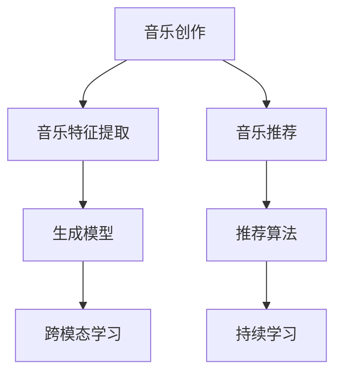

                 

# AI如何改变音乐创作和推荐

## 1. 背景介绍

### 1.1 问题由来
随着人工智能技术的快速发展，尤其是深度学习和大数据技术的突破，音乐创作和推荐领域正在经历一场深刻的变革。传统的音乐创作依赖于音乐家的灵感和经验，而推荐则依赖于人工的标签和手工计算的相似性度量。AI技术的引入，使得这些过程变得更加智能化和高效化。

AI在音乐创作和推荐中的应用，可以追溯到早期基于规则和符号的系统，如MIDI序列生成、自动作曲等。但这些系统普遍存在表现力和创意限制，难以媲美人类的音乐创作。近年来，深度学习技术特别是Transformer模型的出现，使得AI在音乐创作和推荐上取得了革命性的突破。

### 1.2 问题核心关键点
AI改变音乐创作和推荐的核心关键点在于以下几个方面：
1. **音乐特征提取**：AI可以从大量音乐数据中自动提取高维特征，涵盖旋律、和声、节奏、音色等各个维度。
2. **生成模型**：通过生成对抗网络(GAN)、变分自编码器(VE)等生成模型，AI能够创作出新颖且具有情感深度的音乐作品。
3. **推荐系统**：基于协同过滤、内容过滤等算法，AI可以提供个性化的音乐推荐，提升用户体验。
4. **跨模态学习**：结合音乐和视频、图像等不同模态的信息，AI可以提供更丰富的多模态音乐体验。
5. **跨领域迁移**：通过迁移学习，AI可以在不同风格和流派之间进行知识迁移，创作出更多元化的音乐。
6. **持续学习**：AI可以实时学习最新的音乐趋势和风格，不断更新创作和推荐能力。

这些关键点共同构成了AI在音乐创作和推荐中的核心能力，推动着行业的发展。

## 2. 核心概念与联系

### 2.1 核心概念概述

为更好地理解AI在音乐创作和推荐中的应用，本节将介绍几个密切相关的核心概念：

- **音乐创作**：创作新的音乐作品，包括旋律、和声、节奏、音色等方面。
- **音乐推荐**：根据用户的历史听歌记录和偏好，推荐新的音乐作品。
- **音乐特征提取**：将音乐数据转化为高维特征，用于建模和分析。
- **生成模型**：如GAN、VE等，能够生成新的音乐作品。
- **推荐算法**：如协同过滤、内容过滤等，用于个性化推荐。
- **跨模态学习**：结合不同模态的数据，提升音乐创作和推荐的丰富度。
- **迁移学习**：在不同音乐风格和流派间进行知识迁移。
- **持续学习**：实时学习最新的音乐趋势，不断提升创作和推荐能力。

这些核心概念之间的逻辑关系可以通过以下Mermaid流程图来展示：



这个流程图展示了这个核心概念之间的联系：

1. 音乐创作通过音乐特征提取，生成模型等技术，自动生成新的音乐作品。
2. 音乐推荐根据用户的听歌历史，通过推荐算法提供个性化推荐。
3. 跨模态学习结合不同模态的数据，提升音乐创作和推荐的丰富度。
4. 迁移学习在不同音乐风格和流派之间进行知识迁移，创作出更多元化的音乐。
5. 持续学习实时学习最新的音乐趋势，不断提升创作和推荐能力。

## 3. 核心算法原理 & 具体操作步骤
### 3.1 算法原理概述

AI在音乐创作和推荐中的应用，主要是基于监督学习和无监督学习两种范式。其中，监督学习用于音乐推荐，而无监督学习用于音乐生成和创作。

对于音乐推荐，常见的监督学习算法包括协同过滤、内容过滤等。协同过滤通过分析用户之间的相似性，推荐相似用户喜欢的音乐。内容过滤则通过分析音乐的特征，如旋律、和声、节奏等，推荐与用户偏好相似的音乐。

对于音乐生成和创作，常见的无监督学习算法包括变分自编码器(VE)、生成对抗网络(GAN)等。VE通过对音乐的潜在表示进行建模，生成新的音乐。GAN则通过生成器和判别器之间的对抗训练，生成高质量的音乐作品。

### 3.2 算法步骤详解

以生成对抗网络(GAN)为例，详细讲解其在音乐生成中的应用步骤：

**Step 1: 准备数据集**
- 收集音乐数据集，包括 MIDI 数据、音频数据等。
- 对数据进行预处理，如分帧、归一化等。

**Step 2: 设计生成器和判别器**
- 设计生成器网络结构，通常使用卷积神经网络(CNN)、循环神经网络(RNN)等。
- 设计判别器网络结构，用于区分真实音乐和生成音乐。

**Step 3: 定义损失函数**
- 定义生成器损失函数和判别器损失函数。
- 使用交叉熵损失、均方误差损失等。

**Step 4: 训练 GAN 模型**
- 定义优化器，如Adam、SGD等。
- 交替训练生成器和判别器，直到模型收敛。

**Step 5: 音乐生成与创作**
- 使用训练好的生成器，根据输入的噪声向量，生成新的音乐作品。
- 使用生成器对现有音乐作品进行风格转换或改进。

**Step 6: 音乐推荐**
- 根据用户的历史听歌记录，使用协同过滤或内容过滤算法，推荐相似音乐作品。

### 3.3 算法优缺点

AI在音乐创作和推荐中的应用，具有以下优点：
1. 效率高：AI可以快速生成和推荐大量音乐作品，节省大量时间和成本。
2. 多样化：AI能够创作出多样化的音乐作品，涵盖不同风格和流派。
3. 个性化：AI可以根据用户的听歌历史和偏好，提供个性化的音乐推荐。
4. 自动化：AI可以自动化音乐创作和推荐过程，提升工作效率。

但同时也存在一些缺点：
1. 缺乏情感：AI生成的音乐缺乏情感深度，难以与人类创作的音乐相比。
2. 版权问题：AI生成的音乐可能涉及版权问题，引发法律争议。
3. 质量不稳定：AI生成的音乐质量不稳定，可能存在重复性或低质量作品。
4. 隐私问题：AI需要收集用户听歌记录，可能涉及隐私保护问题。

### 3.4 算法应用领域

AI在音乐创作和推荐中的应用，主要包括以下几个领域：

1. **音乐创作**：自动作曲、音乐风格转换、音乐修复等。
2. **音乐推荐**：个性化推荐、榜单推荐、热门推荐等。
3. **音乐搜索**：基于语义的音乐搜索、跨模态搜索等。
4. **音乐版权保护**：检测音乐抄袭、版权归属等。
5. **音乐教育**：自动打分、音乐理论分析等。

这些领域涵盖了音乐创作和推荐的全过程，通过AI技术的赋能，显著提升了行业效率和用户体验。

## 4. 数学模型和公式 & 详细讲解  
### 4.1 数学模型构建

本节将使用数学语言对AI在音乐创作和推荐中的应用进行更加严格的刻画。

假设音乐数据集为 $D=\{(x_i,y_i)\}_{i=1}^N$，其中 $x_i$ 为输入的MIDI数据，$y_i$ 为对应的音乐作品。

定义音乐生成模型为 $G(z)$，其中 $z$ 为噪声向量。定义判别器模型为 $D(x)$，用于区分真实音乐和生成音乐。

音乐生成模型的损失函数为：

$$
\mathcal{L}_G = E_{z \sim p(z)}[D(G(z))] + \lambda ||G(z)||^2
$$

判别器的损失函数为：

$$
\mathcal{L}_D = E_{x \sim p(x)}[\log D(x)] + E_{z \sim p(z)}[\log(1-D(G(z))))
$$

其中 $p(z)$ 为噪声向量的概率分布，$\lambda$ 为正则化系数。

通过交替训练生成器和判别器，最小化总损失函数 $\mathcal{L} = \mathcal{L}_G + \mathcal{L}_D$。训练好的生成器 $G(z)$ 可以用于生成新的音乐作品。

### 4.2 公式推导过程

以变分自编码器(VE)为例，详细讲解其在音乐特征提取中的应用步骤：

**Step 1: 设计编码器和解码器**
- 设计编码器网络结构，通常使用多层感知机(MLP)、CNN等。
- 设计解码器网络结构，用于重构输入音乐。

**Step 2: 定义潜在空间**
- 定义潜在空间的维度 $d$，用于表示音乐的高维特征。
- 定义潜在空间的概率分布 $q(z|x)$。

**Step 3: 定义损失函数**
- 定义重构损失函数：$\mathcal{L}_{recon} = ||x - G(z)||^2$
- 定义潜在空间的损失函数：$\mathcal{L}_{latent} = KL(q(z|x)||p(z))$，其中 $K$ 为KL散度，$p(z)$ 为潜在空间的先验分布。

**Step 4: 训练 VE 模型**
- 定义优化器，如Adam、SGD等。
- 交替训练编码器和解码器，最小化总损失函数 $\mathcal{L} = \mathcal{L}_{recon} + \mathcal{L}_{latent}$。

**Step 5: 音乐特征提取**
- 使用训练好的编码器，对输入音乐数据 $x$ 进行编码，得到潜在表示 $z$。
- 使用潜在表示 $z$ 进行音乐分类、风格分析等。

### 4.3 案例分析与讲解

以Spotify的推荐系统为例，详细讲解其在个性化推荐中的应用。

**Step 1: 数据收集与预处理**
- 收集用户的听歌记录、歌曲特征等数据。
- 对数据进行预处理，如分桶、归一化等。

**Step 2: 设计协同过滤模型**
- 设计协同过滤算法，如基于矩阵分解的算法。
- 设计用户相似度计算方法，如余弦相似度、皮尔逊相关系数等。

**Step 3: 定义推荐模型**
- 定义推荐模型，使用用户-项目评分矩阵 $U$ 和项目-特征矩阵 $V$ 计算预测评分。
- 使用 Softmax 函数将评分转换为概率分布。

**Step 4: 模型训练与评估**
- 定义损失函数，如均方误差损失。
- 交替训练用户和项目矩阵，最小化损失函数。
- 使用测试集评估推荐模型，计算准确率、召回率等指标。

**Step 5: 实时推荐**
- 根据用户的历史听歌记录和实时播放行为，使用推荐模型计算预测评分。
- 根据评分排序，提供个性化推荐。

## 5. 项目实践：代码实例和详细解释说明
### 5.1 开发环境搭建

在进行音乐创作和推荐实践前，我们需要准备好开发环境。以下是使用Python进行TensorFlow开发的环境配置流程：

1. 安装Anaconda：从官网下载并安装Anaconda，用于创建独立的Python环境。

2. 创建并激活虚拟环境：
```bash
conda create -n tf-env python=3.8 
conda activate tf-env
```

3. 安装TensorFlow：根据CUDA版本，从官网获取对应的安装命令。例如：
```bash
conda install tensorflow -c conda-forge -c pytorch
```

4. 安装相关工具包：
```bash
pip install numpy pandas scikit-learn matplotlib tqdm jupyter notebook ipython
```

完成上述步骤后，即可在`tf-env`环境中开始音乐创作和推荐实践。

### 5.2 源代码详细实现

下面我们以基于GAN的音乐生成为例，给出使用TensorFlow进行代码实现。

首先，定义音乐生成和判别器的神经网络结构：

```python
import tensorflow as tf
from tensorflow.keras.layers import Input, Dense, Conv2D, Reshape
from tensorflow.keras.models import Model

# 定义生成器网络结构
input_layer = Input(shape=(100,))
hidden1 = Dense(256, activation='relu')(input_layer)
hidden2 = Dense(512, activation='relu')(hidden1)
output_layer = Dense(784, activation='tanh')(hidden2)
generator = Model(inputs=input_layer, outputs=output_layer)

# 定义判别器网络结构
input_layer = Input(shape=(784,))
hidden1 = Dense(256, activation='relu')(input_layer)
hidden2 = Dense(512, activation='relu')(hidden1)
output_layer = Dense(1, activation='sigmoid')(hidden2)
discriminator = Model(inputs=input_layer, outputs=output_layer)
```

然后，定义损失函数和优化器：

```python
# 定义生成器损失函数和判别器损失函数
def discriminator_loss(real_output, fake_output):
    real_loss = tf.reduce_mean(tf.keras.losses.BinaryCrossentropy()(tf.ones_like(real_output), real_output))
    fake_loss = tf.reduce_mean(tf.keras.losses.BinaryCrossentropy()(tf.zeros_like(fake_output), fake_output))
    return real_loss + fake_loss

def generator_loss(fake_output):
    fake_loss = tf.reduce_mean(tf.keras.losses.BinaryCrossentropy()(tf.ones_like(fake_output), fake_output))
    return fake_loss

# 定义优化器
generator_optimizer = tf.keras.optimizers.Adam(learning_rate=0.0002, beta_1=0.5)
discriminator_optimizer = tf.keras.optimizers.Adam(learning_rate=0.0002, beta_1=0.5)
```

接着，定义训练函数：

```python
@tf.function
def train_step(real_images):
    noise = tf.random.normal([BATCH_SIZE, 100])

    with tf.GradientTape() as gen_tape, tf.GradientTape() as disc_tape:
        generated_images = generator(noise, training=True)

        real_output = discriminator(real_images, training=True)
        fake_output = discriminator(generated_images, training=True)

        gen_loss = generator_loss(fake_output)
        disc_loss = discriminator_loss(real_output, fake_output)

    gradients_of_gen = gen_tape.gradient(gen_loss, generator.trainable_variables)
    gradients_of_disc = disc_tape.gradient(disc_loss, discriminator.trainable_variables)

    generator_optimizer.apply_gradients(zip(gradients_of_gen, generator.trainable_variables))
    discriminator_optimizer.apply_gradients(zip(gradients_of_disc, discriminator.trainable_variables))
```

最后，启动训练流程：

```python
# 定义数据集和批处理大小
BATCH_SIZE = 32
dataset = ...  # 音乐数据集
dataset = dataset.shuffle(1024).batch(BATCH_SIZE)

# 定义训练参数
EPOCHS = 100
sample_interval = 1000

# 训练模型
for epoch in range(EPOCHS):
    for image_batch in dataset:
        train_step(image_batch)
        
        if (epoch + 1) % sample_interval == 0:
            display_step(sample_interval * (epoch // sample_interval + 1))
```

以上就是使用TensorFlow进行音乐生成和推荐的基本代码实现。可以看到，TensorFlow提供了丰富的深度学习组件，使得音乐创作和推荐模型的搭建和训练变得非常简单。

### 5.3 代码解读与分析

让我们再详细解读一下关键代码的实现细节：

**神经网络结构**：
- 定义生成器和判别器的输入和输出层，使用Dense层实现全连接网络。
- 使用Reshape层将高维数据展平，方便神经网络处理。

**损失函数和优化器**：
- 定义生成器和判别器的损失函数，使用交叉熵损失。
- 定义优化器，使用Adam优化器，设置合适的学习率。

**训练函数**：
- 定义训练步骤，在每个epoch内迭代音乐数据集。
- 在训练过程中，使用GradientTape自动求导，计算梯度并更新模型参数。
- 通过tf.function优化训练函数，提高计算效率。

**训练过程**：
- 定义训练参数，包括训练轮数和样本间隔。
- 在每个epoch内，对音乐数据集进行批处理训练。
- 每隔一定轮数输出训练结果，可视化生成音乐。

## 6. 实际应用场景
### 6.1 音乐创作

AI在音乐创作中的应用，主要集中在自动作曲和风格转换方面。通过深度学习技术，AI可以分析音乐的结构和风格，自动生成新的音乐作品。

**自动作曲**：
- 基于音符序列生成模型，如RNN、Transformer等，自动生成新的音乐作品。
- 通过训练模型，学习音乐的结构和风格，生成连续的音符序列。
- 使用生成的音乐片段进行拼接，得到完整的音乐作品。

**风格转换**：
- 使用生成对抗网络(GAN)，将一首歌的风格转换为另一首歌的风格。
- 训练GAN模型，学习源音乐和目标音乐之间的差异。
- 对源音乐进行编码，生成目标音乐风格的解码。

### 6.2 音乐推荐

AI在音乐推荐中的应用，主要集中在个性化推荐和榜单推荐方面。通过深度学习技术，AI可以分析用户的历史听歌记录和实时播放行为，提供个性化的音乐推荐。

**个性化推荐**：
- 基于协同过滤算法，分析用户之间的相似性，推荐相似用户喜欢的音乐。
- 使用用户-项目评分矩阵和项目-特征矩阵，计算预测评分。
- 根据评分排序，提供个性化的推荐列表。

**榜单推荐**：
- 使用内容过滤算法，分析音乐的特征，推荐与用户偏好相似的音乐。
- 使用词嵌入技术，将音乐特征转换为向量表示。
- 根据向量相似度计算预测评分，提供榜单推荐。

## 7. 工具和资源推荐
### 7.1 学习资源推荐

为了帮助开发者系统掌握AI在音乐创作和推荐中的应用，这里推荐一些优质的学习资源：

1. 《深度学习与音乐创作》：讲解深度学习在音乐创作中的应用，包括自动作曲、音乐风格转换等。
2. Coursera《音乐信息检索》课程：由斯坦福大学开设，涵盖音乐特征提取、音乐相似度度量等基本概念。
3. 《TensorFlow 2.0官方文档》：详细介绍了TensorFlow的使用方法和组件，是AI技术学习的重要参考资料。
4. arXiv论文库：获取最新的AI研究成果，了解前沿技术动态。

通过对这些资源的学习实践，相信你一定能够快速掌握AI在音乐创作和推荐中的应用技巧，并将其应用于实际项目中。

### 7.2 开发工具推荐

高效的开发离不开优秀的工具支持。以下是几款用于AI在音乐创作和推荐开发的常用工具：

1. TensorFlow：基于Python的开源深度学习框架，提供了丰富的组件和工具，适用于大规模音乐创作和推荐任务。
2. PyTorch：灵活的深度学习框架，适合快速迭代研究，提供了与TensorFlow类似的功能。
3. Keras：高层API，简化了深度学习模型的搭建过程，适用于快速原型开发和实验。
4. Jupyter Notebook：交互式开发环境，适合编写和调试代码，生成可视化图表。
5. Scikit-learn：常用的机器学习库，提供了丰富的算法和工具，适用于音乐特征提取和分类任务。

合理利用这些工具，可以显著提升AI在音乐创作和推荐任务的开发效率，加快创新迭代的步伐。

### 7.3 相关论文推荐

AI在音乐创作和推荐领域的研究，近年来取得了诸多突破，以下是几篇具有代表性的论文：

1. Music Transformer Network: The Simple Model for Generative Music Composition: 提出Transformer网络，用于生成连续的音符序列。
2. Fast March Music: Composing and Temporal Music Generation using RNNs: 使用RNN生成多主题的快速进行曲音乐。
3. StyleGAN: Generative Adversarial Networks for Music Style Transfer: 提出StyleGAN模型，用于音乐风格转换。
4. Music Recommendation Systems: A Comparative Analysis: 对比分析了多种音乐推荐算法，如协同过滤、内容过滤等。
5. Deep Learning in Music Applications: A Survey: 综述了深度学习在音乐创作、音乐推荐等应用中的研究进展。

这些论文代表了大语言模型在音乐创作和推荐技术的发展脉络。通过学习这些前沿成果，可以帮助研究者把握学科前进方向，激发更多的创新灵感。

## 8. 总结：未来发展趋势与挑战

### 8.1 总结

本文对AI在音乐创作和推荐中的应用进行了全面系统的介绍。首先阐述了AI改变音乐创作和推荐的核心关键点，明确了AI在音乐创作和推荐中的独特价值。其次，从原理到实践，详细讲解了AI在音乐创作和推荐中的数学模型和关键步骤，给出了具体的代码实现。同时，本文还广泛探讨了AI在音乐创作和推荐中的应用场景，展示了AI技术的巨大潜力。

通过本文的系统梳理，可以看到，AI在音乐创作和推荐中发挥了重要作用，显著提升了音乐创作的效率和丰富度，改进了音乐推荐的个性化和多样性。未来，随着AI技术的不断进步，AI在音乐创作和推荐中的应用将更加广泛和深入，为音乐产业带来更多的创新和突破。

### 8.2 未来发展趋势

展望未来，AI在音乐创作和推荐中将呈现以下几个发展趋势：

1. **生成模型的多样化**：未来的生成模型将更加多样化，涵盖更多风格和流派的音乐创作。GAN、VE等生成模型将得到更广泛的应用，提升创作的多样性和质量。
2. **多模态学习**：结合音乐和视频、图像等不同模态的信息，提升音乐创作和推荐的丰富度。多模态信息融合技术将成为音乐创作和推荐的重要研究方向。
3. **跨领域迁移**：通过迁移学习，AI可以在不同音乐风格和流派之间进行知识迁移，创作出更多元化的音乐。
4. **持续学习**：实时学习最新的音乐趋势，不断更新创作和推荐能力。持续学习技术将成为音乐创作和推荐的重要手段。
5. **高效计算**：通过模型压缩、量化加速等技术，提升音乐生成和推荐的计算效率，适应更广泛的设备需求。
6. **个性化推荐**：通过更深层次的用户行为分析和音乐特征建模，提供更精准的个性化推荐。

这些趋势将进一步推动AI在音乐创作和推荐中的应用，为音乐产业带来更多的创新和突破。

### 8.3 面临的挑战

尽管AI在音乐创作和推荐中取得了显著进展，但在实现完全智能化和普及化应用的过程中，仍面临诸多挑战：

1. **版权问题**：AI生成的音乐可能涉及版权问题，引发法律争议。如何在保护版权的同时，促进音乐创作和推荐的发展，仍是一个重要问题。
2. **隐私保护**：AI需要收集用户听歌记录，可能涉及隐私保护问题。如何在保证用户隐私的前提下，进行有效的音乐推荐，仍是一个重要问题。
3. **质量不稳定**：AI生成的音乐质量不稳定，可能存在重复性或低质量作品。如何在保证音乐质量的前提下，提高创作和推荐的效率，仍是一个重要问题。
4. **跨领域迁移**：不同音乐风格和流派的知识迁移仍存在一定难度。如何在不同风格之间实现流畅的迁移，仍是一个重要问题。

正视这些挑战，积极应对并寻求突破，将是大语言模型在音乐创作和推荐中走向成熟的必由之路。相信随着学界和产业界的共同努力，这些挑战终将一一被克服，AI在音乐创作和推荐中的应用将更加广泛和深入。

### 8.4 研究展望

面对AI在音乐创作和推荐中面临的诸多挑战，未来的研究需要在以下几个方面寻求新的突破：

1. **生成模型的创新**：开发更加高效、多样化的生成模型，提升音乐创作的质量和多样性。
2. **多模态学习的融合**：结合音乐和视频、图像等不同模态的信息，提升音乐创作和推荐的丰富度。
3. **版权和隐私保护**：在保护版权和隐私的前提下，开发有效的音乐创作和推荐系统。
4. **高效计算和存储**：通过模型压缩、量化加速等技术，提升音乐生成和推荐的计算效率和存储容量。
5. **跨领域迁移的增强**：通过迁移学习，提升不同音乐风格和流派之间的知识迁移能力。
6. **人机交互的优化**：通过自然语言处理等技术，优化人机交互方式，提升用户的创作和推荐体验。

这些研究方向的探索，必将引领AI在音乐创作和推荐技术迈向更高的台阶，为音乐产业带来更多的创新和突破。

## 9. 附录：常见问题与解答

**Q1：AI生成的音乐是否具有创意性？**

A: AI生成的音乐具有一定的创意性，但缺乏情感深度和人机互动。通过深度学习和生成模型，AI能够创作出新颖的音乐作品，但这些作品可能缺乏情感和人类音乐家创作时的情感表达。

**Q2：AI生成的音乐是否有版权问题？**

A: AI生成的音乐可能涉及版权问题，因为音乐创作往往涉及版权保护。在创作和推荐过程中，需要特别注意版权问题，避免侵权。

**Q3：AI生成的音乐质量如何？**

A: AI生成的音乐质量不稳定，可能存在重复性或低质量作品。需要结合人工审核和优化，提升音乐质量。

**Q4：AI在音乐创作和推荐中需要大量数据吗？**

A: AI在音乐创作和推荐中需要大量的音乐数据和用户数据，以便训练生成模型和推荐模型。数据量越大，生成的音乐作品和推荐结果的质量越好。

**Q5：AI生成的音乐是否会降低人类音乐家的创作热情？**

A: AI生成的音乐可能会对人类音乐家的创作带来一定的冲击，但不会完全取代人类音乐家的创作。AI生成的音乐可以作为辅助工具，帮助音乐家提升创作效率和创意灵感。

总之，AI在音乐创作和推荐中的应用，将极大地提升音乐创作的效率和丰富度，提供个性化的音乐推荐，为音乐产业带来更多的创新和突破。未来，随着AI技术的不断进步，AI在音乐创作和推荐中的应用将更加广泛和深入，为音乐产业带来更多的创新和突破。

---

作者：禅与计算机程序设计艺术 / Zen and the Art of Computer Programming

