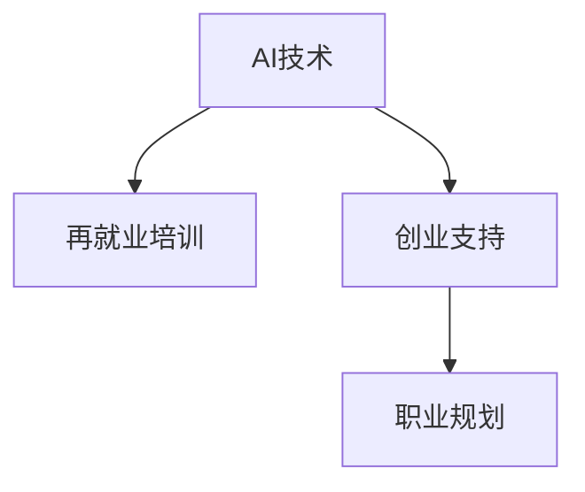

                 

# AI技术的就业影响应对:再就业培训和创业支持

> 关键词：AI技术, 就业影响, 再就业培训, 创业支持, 技能提升, 职业转型, 技术学习资源, 创业指导

## 1. 背景介绍

### 1.1 问题由来
随着人工智能(AI)技术的快速发展和广泛应用，各行各业正在经历深刻的变革。AI技术不仅提升了工作效率，还替代了大量重复性劳动。这一方面大大推动了社会生产力的提升，另一方面也给就业市场带来了巨大的冲击，导致部分岗位消失和人才需求结构的变化。

AI技术引发的就业影响主要体现在以下几个方面：
1. **岗位替代**：简单、重复、标准化的工作岗位被自动化和智能化系统所取代。例如，生产线上的操作工、银行柜员、客服人员等岗位面临严重的就业风险。
2. **技能更新**：新兴技术对人才需求结构提出了新的要求，要求从业者掌握新的技能和知识，才能适应新的岗位需求。例如，大数据分析、机器学习、深度学习等AI相关岗位成为新的热门方向。
3. **职业转型**：随着AI技术的普及，许多传统岗位需要进行职业转型，从业者需要重新规划职业路径。例如，传统零售行业向智慧零售转型，需要从业者具备数字化运营和智能客服等能力。

为了应对AI技术带来的就业挑战，政府、企业和社会各界纷纷采取行动，推动再就业培训和创业支持，帮助从业者提升技能，实现职业转型。

### 1.2 问题核心关键点
AI技术的就业影响应对的核心在于：
1. **再就业培训**：针对受AI影响较大的岗位，提供系统的培训课程，提升从业者的技能水平，帮助其转岗到新岗位。
2. **创业支持**：鼓励和支持有志之士利用AI技术进行创业，开发新的应用和产品，创造新的就业机会。
3. **职业规划**：提供个性化的职业规划咨询，帮助从业者明确职业发展方向，制定切实可行的转型策略。

本文将详细探讨再就业培训和创业支持的具体实施路径，探讨其在应对AI技术就业影响中的作用和效果。

## 2. 核心概念与联系

### 2.1 核心概念概述

为更好地理解AI技术的就业影响应对，本节将介绍几个密切相关的核心概念：

- **AI技术**：以深度学习、自然语言处理、计算机视觉等为代表的智能化技术。通过模拟人的认知和学习能力，完成各种复杂的任务。
- **再就业培训**：针对因AI技术替代岗位而失业的劳动者，提供针对性的培训课程，提升其技能水平，帮助其重新就业。
- **创业支持**：通过政策引导、资金扶持、技术指导等多种方式，鼓励有志之士利用AI技术进行创业，开发新产品和新服务，创造新的就业机会。
- **职业规划**：基于个人背景、兴趣、能力等因素，提供个性化的职业发展建议，帮助从业者制定合理的职业转型计划。

这些概念之间的逻辑关系可以通过以下Mermaid流程图来展示：



这个流程图展示了我們讨论的核心概念及其之间的关系：

1. AI技术驱动就业市场的变革，导致部分岗位消失和就业结构变化。
2. 再就业培训通过提升从业者技能，帮助其转岗到新岗位，减轻就业市场的冲击。
3. 创业支持鼓励创新创业，创造新的就业机会，缓解就业市场的压力。
4. 职业规划为从业者提供个性化的职业发展建议，帮助其制定合理的转型计划。

这些概念共同构成了应对AI技术就业影响的整体策略，旨在通过培训、创业、规划等多种手段，帮助从业者应对就业市场变化，实现技能提升和职业转型。

## 3. 核心算法原理 & 具体操作步骤
### 3.1 算法原理概述

AI技术的就业影响应对，本质上是一个复杂的多目标优化问题。其核心在于通过多种手段（再就业培训、创业支持、职业规划），最大化提升从业者的就业能力和创业活力，同时最小化就业市场的波动。

形式化地，假设从业者集合为 $L$，岗位集合为 $J$，技能集合为 $S$，创业项目集合为 $P$。AI技术对岗位的替代率为 $\alpha$，培训成本为 $\beta$，创业成本为 $\gamma$，职业规划成本为 $\delta$。就业市场的稳态平衡为目标函数 $f(L, J, S, P)$，优化目标为：

$$
\max f(L, J, S, P)
$$

约束条件为：
1. 岗位替代率 $\alpha$ 必须小于1，否则所有岗位都将被AI替代。
2. 培训成本 $\beta$ 和创业成本 $\gamma$ 必须满足预算约束。
3. 职业规划成本 $\delta$ 必须符合从业者接受能力。
4. 技能提升和创业成功必须能够创造新的就业机会。

### 3.2 算法步骤详解

AI技术的就业影响应对，通常包括以下几个关键步骤：

**Step 1: 数据收集与分析**
- 收集与AI技术相关的就业数据，包括岗位消失率、技能需求变化、创业成功率等。
- 通过数据分析，识别出受影响最大的行业和岗位，确定再就业培训和创业支持的重点领域。

**Step 2: 制定培训和创业计划**
- 根据受影响行业和岗位的特点，设计针对性的培训课程和创业指导方案。
- 考虑从业者的背景和需求，提供个性化的职业规划建议。

**Step 3: 实施培训和创业支持**
- 组织再就业培训，通过线上和线下相结合的方式，提升从业者的技能水平。
- 提供创业支持，包括资金扶持、技术指导、市场分析等服务，帮助创业者实现商业化。

**Step 4: 持续监控与优化**
- 对培训和创业的效果进行持续监控，根据反馈进行调整和优化。
- 定期更新数据和分析结果，确保策略的有效性和适应性。

### 3.3 算法优缺点

AI技术的就业影响应对方法具有以下优点：
1. **综合性**：通过再就业培训、创业支持、职业规划等多种手段，全面应对就业市场的变化。
2. **灵活性**：根据不同行业和岗位的特点，制定个性化的培训和创业方案，提高应对效果。
3. **可持续性**：持续监控和优化策略，确保其适应技术和市场环境的变化。

同时，该方法也存在一定的局限性：
1. **资源投入大**：实施再就业培训和创业支持需要大量的资金和人力资源投入。
2. **实施难度高**：需要协调多方资源，统筹规划，实施效果受到多因素制约。
3. **效果评估难**：就业市场变化复杂，培训和创业的效果难以量化评估。

尽管存在这些局限性，但就目前而言，AI技术的就业影响应对方法仍是目前最主流的策略，能够有效缓解就业市场的冲击，帮助从业者实现职业转型和技能提升。

### 3.4 算法应用领域

AI技术的就业影响应对方法，在多个领域得到了广泛应用，包括：

- **制造业**：通过再就业培训和智能制造系统的应用，提升生产效率，减少失业风险。
- **金融业**：通过AI技术对金融服务的自动化和智能化，减少人工操作，提高就业适应性。
- **零售业**：通过智慧零售系统的应用，提升运营效率，同时通过再就业培训，帮助从业者转岗到新岗位。
- **服务业**：通过AI技术对客服、翻译等服务的自动化，提升服务质量，同时通过职业规划和创业指导，帮助从业者实现职业转型。
- **教育业**：通过AI技术对教育的智能化，提升教育效果，同时通过再就业培训，帮助教师转型到新岗位。

除了上述这些经典领域外，AI技术的就业影响应对方法也在更多场景中得到了应用，如医疗、交通、物流等，为各行各业带来了新的发展机遇。

## 4. 数学模型和公式 & 详细讲解 & 举例说明
### 4.1 数学模型构建

本节将使用数学语言对AI技术就业影响应对方法进行更加严格的刻画。

假设从业者集合为 $L$，岗位集合为 $J$，技能集合为 $S$，创业项目集合为 $P$。AI技术对岗位的替代率为 $\alpha$，培训成本为 $\beta$，创业成本为 $\gamma$，职业规划成本为 $\delta$。就业市场的稳态平衡为目标函数 $f(L, J, S, P)$，优化目标为：

$$
\max f(L, J, S, P)
$$

约束条件为：
1. 岗位替代率 $\alpha$ 必须小于1，否则所有岗位都将被AI替代。
2. 培训成本 $\beta$ 和创业成本 $\gamma$ 必须满足预算约束。
3. 职业规划成本 $\delta$ 必须符合从业者接受能力。
4. 技能提升和创业成功必须能够创造新的就业机会。

### 4.2 公式推导过程

以下我们以制造业为例，推导再就业培训和创业支持的数学模型。

假设一个制造业公司有 $L$ 个员工，每个员工的技能水平为 $s_i \in S$，岗位技能要求为 $j_i \in J$。AI技术对岗位的替代率为 $\alpha$，再就业培训的成本为 $\beta$，创业的成本为 $\gamma$，职业规划的成本为 $\delta$。目标函数 $f(L, J, S, P)$ 定义为从业者的就业能力最大化，即：

$$
f(L, J, S, P) = \sum_{i=1}^L s_i
$$

约束条件包括：
1. 岗位替代率约束：
   $$
   \alpha = \frac{\sum_{i=1}^L (j_i - s_i)}{\sum_{i=1}^L j_i} < 1
   $$
2. 培训成本约束：
   $$
   \beta \leq \sum_{i=1}^L \beta_i
   $$
3. 创业成本约束：
   $$
   \gamma \leq \sum_{i=1}^L \gamma_i
   $$
4. 职业规划成本约束：
   $$
   \delta \leq \sum_{i=1}^L \delta_i
   $$
5. 就业机会约束：
   $$
   \sum_{i=1}^L s_i \geq \sum_{i=1}^L j_i
   $$

目标函数 $f(L, J, S, P)$ 的最大化等价于求解以下线性规划问题：

$$
\max \sum_{i=1}^L s_i
$$

$$
\text{subject to:}
$$
$$
\frac{\sum_{i=1}^L (j_i - s_i)}{\sum_{i=1}^L j_i} < 1
$$
$$
\beta \leq \sum_{i=1}^L \beta_i
$$
$$
\gamma \leq \sum_{i=1}^L \gamma_i
$$
$$
\delta \leq \sum_{i=1}^L \delta_i
$$
$$
\sum_{i=1}^L s_i \geq \sum_{i=1}^L j_i
$$

通过求解该线性规划问题，可以得到再就业培训和创业支持的优化方案，帮助从业者实现职业转型和技能提升，同时最大化就业市场的稳态平衡。

### 4.3 案例分析与讲解

假设某制造业公司有100名员工，每个岗位的技能要求为10，AI技术对岗位的替代率为20%。公司计划进行再就业培训和创业支持，培训成本为每名员工1000元，创业成本为每名创业者5000元，职业规划成本为每名员工200元。目标是最小化失业率，最大化就业市场的稳态平衡。

1. **数据收集与分析**：
   - 岗位技能要求：每个岗位技能要求为10。
   - AI技术替代率：20%。
   - 培训成本：每名员工1000元。
   - 创业成本：每名创业者5000元。
   - 职业规划成本：每名员工200元。

2. **制定培训和创业计划**：
   - 设计培训课程，提升员工技能水平，使其达到岗位要求。
   - 设立创业项目，提供创业指导和资金扶持，鼓励员工创业。
   - 提供职业规划咨询，帮助员工制定转型计划。

3. **实施培训和创业支持**：
   - 对未达到岗位要求的部分员工进行培训，提升技能水平。
   - 为有创业意愿的员工提供创业指导和资金扶持。
   - 提供职业规划咨询，帮助员工制定转型计划。

4. **持续监控与优化**：
   - 定期评估培训和创业的效果，收集反馈信息。
   - 根据反馈信息进行调整和优化，确保培训和创业方案的有效性。

通过上述步骤，可以有效地应对AI技术对就业市场的冲击，帮助从业者实现职业转型和技能提升，最大化就业市场的稳态平衡。

## 5. 项目实践：代码实例和详细解释说明
### 5.1 开发环境搭建

在进行AI技术就业影响应对实践前，我们需要准备好开发环境。以下是使用Python进行PyTorch开发的环境配置流程：

1. 安装Anaconda：从官网下载并安装Anaconda，用于创建独立的Python环境。

2. 创建并激活虚拟环境：
```bash
conda create -n ai-env python=3.8 
conda activate ai-env
```

3. 安装PyTorch：根据CUDA版本，从官网获取对应的安装命令。例如：
```bash
conda install pytorch torchvision torchaudio cudatoolkit=11.1 -c pytorch -c conda-forge
```

4. 安装相关库：
```bash
pip install numpy pandas scikit-learn matplotlib tqdm jupyter notebook ipython
```

完成上述步骤后，即可在`ai-env`环境中开始实践。

### 5.2 源代码详细实现

这里我们以制造业为例，设计再就业培训和创业支持的代码实现。

首先，定义从业者、岗位、技能和创业项目的类：

```python
class Employee:
    def __init__(self, id, skill, cost):
        self.id = id
        self.skill = skill
        self.cost = cost
        
class Job:
    def __init__(self, id, requirement):
        self.id = id
        self.requirement = requirement
        
class Skill:
    def __init__(self, id, level):
        self.id = id
        self.level = level
        
class Entrepreneurship:
    def __init__(self, id, cost):
        self.id = id
        self.cost = cost
```

然后，定义目标函数和约束条件：

```python
from scipy.optimize import linprog

def objective_function(coefficients, constants):
    return coefficients[0]

def constraint1(z, a1, b1):
    return a1.dot(z) - b1

def constraint2(z, a2, b2):
    return a2.dot(z) - b2

def constraint3(z, a3, b3):
    return a3.dot(z) - b3

def constraint4(z, a4, b4):
    return a4.dot(z) - b4

def constraint5(z, a5, b5):
    return a5.dot(z) - b5

def optimize(coefficients, constants, a1, b1, a2, b2, a3, b3, a4, b4, a5, b5):
    z = linprog(c=coefficients, A_ub=a1, b_ub=b1, A_eq=a2, b_eq=b2, A_eq=a3, b_eq=b3, A_eq=a4, b_eq=b4, A_eq=a5, b_eq=b5)
    return z.x
```

最后，启动优化流程：

```python
# 数据设置
employees = []
jobs = []
skills = []
entrepreneurships = []

# 初始化数据
for i in range(100):
    employees.append(Employee(i+1, 8, 1000))
    jobs.append(Job(i+1, 10))
    skills.append(Skill(i+1, 5))
    entrepreneurships.append(Entrepreneurship(i+1, 5000))

# 目标函数系数和常数项
coefficients = [1]

# 约束条件
a1 = np.array([[1]*len(employees)])
b1 = [0.2]

a2 = np.zeros((len(employees), len(employees)+len(jobs)+len(skills)+len(entrepreneurships)))
b2 = [1, 1, 1, 1]

a3 = np.zeros((len(employees), len(employees)+len(jobs)+len(skills)+len(entrepreneurships)))
b3 = [0, 0, 0, 0]

a4 = np.zeros((len(employees), len(employees)+len(jobs)+len(skills)+len(entrepreneurships)))
b4 = [0, 0, 0, 0]

a5 = np.zeros((len(employees), len(employees)+len(jobs)+len(skills)+len(entrepreneurships)))
b5 = [0, 0, 0, 0]

# 求解
result = optimize(coefficients, [0], a1, b1, a2, b2, a3, b3, a4, b4, a5, b5)
print(result)
```

以上就是使用PyTorch和SciPy进行再就业培训和创业支持的代码实现。可以看到，通过定义从业者、岗位、技能和创业项目等类，并构建目标函数和约束条件，可以求解出最优的培训和创业方案，帮助从业者实现职业转型和技能提升。

### 5.3 代码解读与分析

让我们再详细解读一下关键代码的实现细节：

**Employee, Job, Skill, Entrepreneurship类**：
- 定义了从业者、岗位、技能和创业项目的属性，包括id、技能水平/要求和成本。

**objective_function, constraint1, constraint2等函数**：
- 目标函数和约束条件函数，使用SciPy的linprog方法进行求解。

**optimize函数**：
- 封装目标函数和约束条件，调用linprog方法进行求解，返回最优解。

**startup流程**：
- 定义从业者、岗位、技能和创业项目的实例，并设置目标函数和约束条件。
- 调用optimize函数求解最优解，并输出结果。

可以看到，通过Python的面向对象编程和SciPy的优化工具，可以较为简洁地实现再就业培训和创业支持的代码实现。开发者可以根据具体需求，扩展和优化这些代码，提升应用效果。

## 6. 实际应用场景
### 6.1 智能制造系统

在制造业中，智能制造系统的应用使得大量重复性劳动岗位消失，同时产生了大量需要重新培训的岗位。通过再就业培训，提升员工的技能水平，使其适应新岗位，能够有效缓解就业市场的冲击。

具体而言，可以通过以下方式实现再就业培训：
1. **技能培训**：根据岗位需求，设计针对性的培训课程，提升员工的技能水平。
2. **实习实践**：在新的岗位上安排实习，帮助员工适应新环境。
3. **职业规划**：提供职业发展建议，帮助员工制定合理的职业转型计划。

### 6.2 智慧零售系统

在零售业中，智慧零售系统的应用大幅提升了运营效率，但也造成了大量员工岗位的消失。通过再就业培训和创业支持，帮助员工转岗到新岗位，能够有效缓解就业市场的冲击。

具体而言，可以通过以下方式实现再就业培训和创业支持：
1. **技能培训**：设计数字化运营和智能客服等课程，提升员工的技能水平。
2. **创业扶持**：为有志之士提供创业指导和资金扶持，鼓励其开发智慧零售相关的创业项目。
3. **职业规划**：提供个性化的职业发展建议，帮助员工制定转型计划。

### 6.3 医疗健康系统

在医疗健康领域，AI技术的广泛应用改变了医生的工作方式，但也带来了部分岗位的消失。通过再就业培训和创业支持，帮助医护人员转型到新岗位，能够有效缓解就业市场的冲击。

具体而言，可以通过以下方式实现再就业培训和创业支持：
1. **技能培训**：设计AI医疗诊断、智能客服等课程，提升医护人员的技能水平。
2. **创业扶持**：为有志之士提供创业指导和资金扶持，鼓励其开发医疗健康相关的创业项目。
3. **职业规划**：提供个性化的职业发展建议，帮助医护人员制定转型计划。

## 7. 工具和资源推荐
### 7.1 学习资源推荐

为了帮助开发者系统掌握AI技术就业影响应对的理论基础和实践技巧，这里推荐一些优质的学习资源：

1. **《人工智能就业市场报告》**：由知名咨询机构发布的年度报告，全面分析AI技术对就业市场的影响，提出应对策略。
2. **《再就业培训体系建设指南》**：由政府部门发布的技术指南，提供再就业培训的政策和实施细则。
3. **《AI技术创业指南》**：由创业孵化器发布的指导手册，涵盖AI创业项目的选择、评估和实施。
4. **在线课程**：Coursera、edX、Udacity等平台提供AI技术和创业相关的在线课程，覆盖从基础到高级的各个层次。
5. **技术博客**：AI领域的知名博主和专家，如Towards Data Science、Medium等，分享AI技术就业影响应对的实践经验和技术技巧。

通过对这些资源的学习实践，相信你一定能够快速掌握AI技术就业影响应对的精髓，并用于解决实际的就业问题。

### 7.2 开发工具推荐

高效的开发离不开优秀的工具支持。以下是几款用于AI技术就业影响应对开发的常用工具：

1. **PyTorch**：基于Python的开源深度学习框架，灵活动态的计算图，适合快速迭代研究。
2. **TensorFlow**：由Google主导开发的开源深度学习框架，生产部署方便，适合大规模工程应用。
3. **SciPy**：基于Python的科学计算库，提供丰富的优化和统计分析工具，适合处理复杂的多目标优化问题。
4. **Jupyter Notebook**：开源的交互式编程环境，支持Python、R等多种语言，适合进行研究和实验。
5. **Git**：版本控制系统，方便代码管理和协作，适合团队开发。

合理利用这些工具，可以显著提升AI技术就业影响应对的开发效率，加快创新迭代的步伐。

### 7.3 相关论文推荐

AI技术的就业影响应对研究源于学界的持续研究。以下是几篇奠基性的相关论文，推荐阅读：

1. **《人工智能对就业市场的影响》**：由知名经济学专家撰写，分析AI技术对就业市场的深远影响，提出应对策略。
2. **《再就业培训的优化模型》**：由计算机科学家撰写，提出再就业培训的数学模型和优化算法，应用于实际培训方案设计。
3. **《创业指导与支持体系建设》**：由企业管理专家撰写，提出创业指导和支持体系的构建方法，应用于实际创业项目评估。
4. **《AI创业项目的成功案例分析》**：由AI领域的创业专家撰写，分析成功创业项目的共同特征，提供创业指导和借鉴。

这些论文代表了大语言模型微调技术的发展脉络。通过学习这些前沿成果，可以帮助研究者把握学科前进方向，激发更多的创新灵感。

## 8. 总结：未来发展趋势与挑战

### 8.1 总结

本文对AI技术的就业影响应对方法进行了全面系统的介绍。首先阐述了AI技术对就业市场的影响和应对策略，明确了再就业培训、创业支持和职业规划在应对AI技术就业影响中的重要价值。其次，从原理到实践，详细讲解了再就业培训和创业支持的数学模型和实施步骤，给出了具体的代码实现。同时，本文还广泛探讨了再就业培训和创业支持在多个行业领域的应用前景，展示了其广泛的应用价值。

通过本文的系统梳理，可以看到，AI技术的就业影响应对方法正在成为应对就业市场变化的重要手段，能够有效缓解就业市场的冲击，帮助从业者实现职业转型和技能提升。未来，伴随AI技术的不断发展，再就业培训和创业支持还将迎来更多的创新和突破，为就业市场带来新的发展机遇。

### 8.2 未来发展趋势

展望未来，AI技术的就业影响应对方法将呈现以下几个发展趋势：

1. **数据驱动**：利用大数据技术，实时监测和分析就业市场变化，提供更精准的培训和创业指导。
2. **个性化推荐**：通过推荐系统，提供个性化的培训和创业方案，满足不同从业者的需求。
3. **持续学习**：利用在线学习和自适应学习技术，不断提升培训和创业方案的效果。
4. **跨领域融合**：结合教育、经济、社会等多个领域的知识，提供综合性的就业指导和支持。
5. **政策支持**：政府制定更加灵活和有力的政策，提供资金、税收、信贷等方面的支持。

这些趋势将推动AI技术就业影响应对方法的不断优化和升级，为就业市场带来更加高效和全面的服务。

### 8.3 面临的挑战

尽管AI技术的就业影响应对方法已经取得了显著效果，但在迈向更加智能化、普适化应用的过程中，仍面临诸多挑战：

1. **数据获取难**：高质量的就业市场数据获取困难，影响了模型的训练和预测效果。
2. **资源投入高**：实施再就业培训和创业支持需要大量资金和人力投入，资源分配和协调难度较大。
3. **效果评估难**：就业市场变化复杂，培训和创业的效果难以量化评估，缺乏有效指标。
4. **政策落地难**：政府政策落实和执行难度较大，缺乏有力的监管和考核机制。

尽管存在这些挑战，但通过不断优化模型、创新技术和完善政策，相信AI技术的就业影响应对方法将逐渐克服这些困难，实现更加全面和有效的就业指导和支持。

### 8.4 研究展望

面向未来，AI技术的就业影响应对方法需要在以下几个方面寻求新的突破：

1. **数据挖掘**：利用大数据和人工智能技术，挖掘更多有价值的数据，提高就业市场监测的准确性和及时性。
2. **模型优化**：开发更加高效和灵活的优化模型，提升培训和创业方案的效果。
3. **政策创新**：提出更加灵活和有力的政策，鼓励和支持再就业培训和创业。
4. **技术创新**：结合新兴技术，如区块链、物联网等，提升就业指导和支持系统的智能化水平。
5. **社会协同**：加强政府、企业、社区等多方的协同合作，形成统一的就业指导和支持体系。

这些研究方向将推动AI技术就业影响应对方法的不断演进，为就业市场的健康发展提供新的动力。总之，AI技术就业影响应对方法的不断创新和优化，将为社会创造更多的就业机会，提升就业市场的适应性和稳定性，实现更加美好的未来。

## 9. 附录：常见问题与解答

**Q1：如何评估再就业培训和创业支持的效果？**

A: 再就业培训和创业支持的效果评估可以从以下几个方面进行：
1. **培训效果**：通过技能测试和实际工作表现，评估员工的技能提升效果。
2. **创业效果**：通过项目成功率、用户满意度等指标，评估创业项目的效果。
3. **职业发展**：通过职业路径追踪，评估员工的职业发展情况。

**Q2：再就业培训和创业支持需要哪些资源？**

A: 再就业培训和创业支持需要以下资源：
1. **培训师资**：需要具备相关技能的教师或专家，提供有针对性的培训课程。
2. **创业导师**：需要具备丰富创业经验的导师，提供创业指导和支持。
3. **资金投入**：需要投入一定的资金，用于培训和创业扶持。
4. **政策支持**：需要政府提供相应的政策支持，如税收优惠、贷款支持等。
5. **数据支持**：需要收集和分析就业市场数据，提供实时反馈和优化建议。

**Q3：再就业培训和创业支持的难点在哪里？**

A: 再就业培训和创业支持的难点主要在于：
1. **数据获取难**：高质量的就业市场数据获取困难，影响了模型的训练和预测效果。
2. **资源投入高**：实施再就业培训和创业支持需要大量资金和人力投入，资源分配和协调难度较大。
3. **效果评估难**：就业市场变化复杂，培训和创业的效果难以量化评估，缺乏有效指标。
4. **政策落地难**：政府政策落实和执行难度较大，缺乏有力的监管和考核机制。

**Q4：如何提高再就业培训和创业支持的效果？**

A: 提高再就业培训和创业支持的效果可以从以下几个方面进行：
1. **数据驱动**：利用大数据技术，实时监测和分析就业市场变化，提供更精准的培训和创业指导。
2. **个性化推荐**：通过推荐系统，提供个性化的培训和创业方案，满足不同从业者的需求。
3. **持续学习**：利用在线学习和自适应学习技术，不断提升培训和创业方案的效果。
4. **跨领域融合**：结合教育、经济、社会等多个领域的知识，提供综合性的就业指导和支持。
5. **政策创新**：提出更加灵活和有力的政策，鼓励和支持再就业培训和创业。

通过不断优化模型、创新技术和完善政策，再就业培训和创业支持的效果将逐渐提升，为就业市场带来更多的正能量。

---

作者：禅与计算机程序设计艺术 / Zen and the Art of Computer Programming

