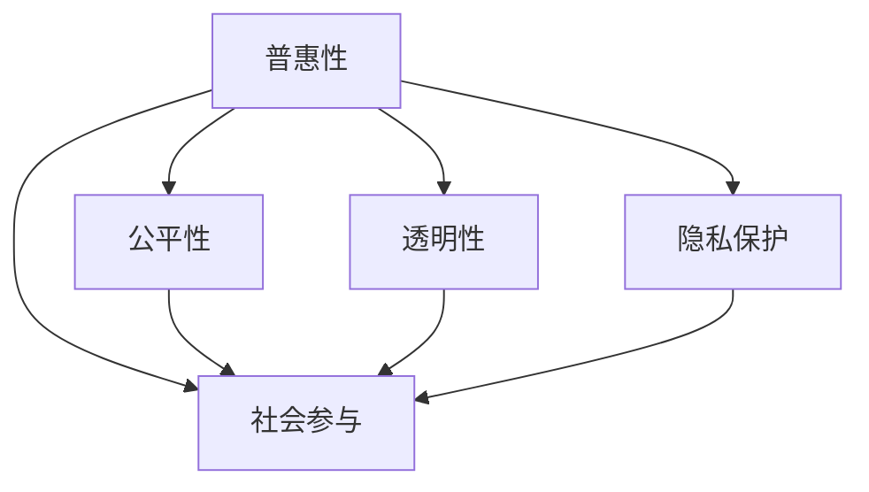

                 

# AI技术的普惠性:让更多人受益的途径

> 关键词：AI普惠性, 人工智能应用, 技术普及, 社会公平, 算法透明, 数据隐私, 公众参与

## 1. 背景介绍

### 1.1 问题由来

近年来，人工智能(AI)技术的发展迅猛，已经在医疗、金融、交通、教育、安防等多个领域实现了初步落地。然而，尽管AI技术本身具有潜力，但由于数据、算法、计算资源等因素的限制，其广泛应用还面临诸多挑战。如何确保AI技术的普惠性，让更多人受益，成为当前AI领域研究的一个重要课题。

### 1.2 问题核心关键点

AI技术的普惠性涉及多个关键问题，包括但不限于：
- 数据获取和标注：高质量的数据是AI技术的基础，但获取和标注数据的成本较高。
- 算法设计和优化：高效的算法和模型架构可以大幅提升AI技术的性能，但设计合适的算法并不容易。
- 计算资源需求：AI技术往往需要大量的计算资源进行训练和推理，这对小规模应用场景的落地带来了挑战。
- 透明性和公平性：AI模型的决策过程需要可解释，且不能存在偏见，否则可能引发伦理和社会问题。
- 数据隐私和安全：保护用户隐私，防止数据滥用和滥用数据，是AI应用中必须严格把控的重要环节。
- 用户参与和反馈：在AI应用的设计和优化过程中，应充分考虑用户的意见和反馈，提高用户满意度。

### 1.3 问题研究意义

研究AI技术的普惠性，不仅有助于提升技术本身的可访问性和可扩展性，还可以推动社会公平和可持续发展。具体而言：

1. 提升社会生产力：通过广泛应用AI技术，可以大幅提高生产效率，降低成本，促进经济发展。
2. 改善公共服务：AI在医疗、教育、社会治理等领域的应用，可以提供更高效、更智能的公共服务。
3. 助力教育公平：AI技术可以为边远地区和弱势群体提供高质量的教育资源，缩小教育差距。
4. 促进健康保障：通过医疗AI技术，可以实现精准医疗，提高疾病诊断和治疗效果。
5. 保障数据隐私：在AI应用中注重隐私保护，可以增强公众对AI技术的信任，促进其普及应用。

总之，AI技术的普惠性是一个涉及技术、伦理、法律、社会等多个层面的复杂问题，需要通过多方努力，共同推进。

## 2. 核心概念与联系

### 2.1 核心概念概述

为更好地理解AI技术的普惠性，本节将介绍几个密切相关的核心概念：

- **普惠性(Accessibility)**：指AI技术可以被广泛获取和使用的能力，尤其关注那些可能受益于AI技术，但难以获得其服务的群体。
- **公平性(Fairness)**：指AI模型在应用过程中不会对特定群体或个体产生歧视或偏见，确保所有群体都能平等受益。
- **透明性(Transparency)**：指AI模型应具有可解释性，其决策过程和结果应能够被理解和验证。
- **隐私保护(Privacy)**：指在使用AI技术时，应保护用户的个人数据隐私，防止数据泄露和滥用。
- **社会参与(Social Engagement)**：指在AI应用的设计和部署过程中，应充分考虑用户的意见和反馈，增强公众参与度。

这些核心概念之间的逻辑关系可以通过以下Mermaid流程图来展示：



这个流程图展示了几大核心概念及其之间的关系：

1. 普惠性是AI技术应用的基础，公平性、透明性、隐私保护和社会参与是其重要组成部分。
2. 公平性确保所有群体平等受益，透明性增强用户信任，隐私保护保障数据安全，社会参与提升用户满意度。
3. 这些概念共同构成AI技术普惠性的重要方面，缺一不可。

## 3. 核心算法原理 & 具体操作步骤
### 3.1 算法原理概述

AI技术的普惠性实现，涉及算法设计和优化、数据获取与标注、计算资源管理等多个环节。其核心思想是通过一系列技术手段，降低AI应用的门槛，提高技术的可访问性和可扩展性。

具体而言，AI技术普惠性的实现包括以下几个步骤：
1. 数据获取和标注：收集并标注高质量的训练数据，是AI技术的基础。
2. 算法设计和优化：选择高效、可解释的算法，并进行适当的优化，以适应不同的应用场景。
3. 计算资源管理：合理分配和管理计算资源，降低算力需求，提高计算效率。
4. 透明性和公平性保障：建立透明的模型解释和公平性评估机制，确保AI模型不产生偏见。
5. 数据隐私保护：采用隐私保护技术，如差分隐私、联邦学习等，保护用户数据隐私。
6. 社会参与和反馈：在AI应用的设计和部署过程中，充分考虑用户反馈，提高用户满意度。

### 3.2 算法步骤详解

基于普惠性目标，AI技术的实现可分为以下几个关键步骤：

**Step 1: 数据获取和标注**
- 收集具有代表性和多样性的数据集，以覆盖不同的应用场景和用户群体。
- 使用自动标注、半监督学习等技术，降低数据标注的成本和时间。
- 确保数据标注的公平性，避免对特定群体的偏见。

**Step 2: 算法设计和优化**
- 选择高效、可解释的算法，如基于规则的专家系统、基于深度学习的神经网络等。
- 进行算法优化，如剪枝、量化、参数共享等，减少模型复杂度和计算资源需求。
- 使用分布式训练、模型压缩等技术，提高算法的可扩展性。

**Step 3: 计算资源管理**
- 采用混合精度训练、模型并行、异构计算等技术，优化计算资源的使用。
- 根据应用场景需求，合理配置计算资源，平衡性能和成本。
- 使用云服务、边缘计算等技术，降低对本地计算资源的依赖。

**Step 4: 透明性和公平性保障**
- 设计透明的模型解释机制，如特征重要性分析、局部可解释模型等。
- 建立公平性评估指标，如统计指标、对比学习等，检测模型的偏见。
- 采用公平性约束，如加权训练、对抗样本训练等，减少模型偏见。

**Step 5: 数据隐私保护**
- 使用差分隐私、联邦学习等隐私保护技术，保护用户数据隐私。
- 设计安全的算法架构，防止数据泄露和滥用。
- 建立数据访问和使用的管理机制，确保数据使用的合规性。

**Step 6: 社会参与和反馈**
- 在AI应用的设计和部署过程中，充分考虑用户反馈，提高用户满意度。
- 建立用户社区，鼓励用户参与应用开发和改进。
- 使用在线问卷、用户访谈等方法，收集用户意见和建议，进行应用优化。

### 3.3 算法优缺点

AI技术的普惠性实现具有以下优点：
1. 提升技术可访问性：通过降低数据、算力和资源成本，提高AI技术的普及性。
2. 增强用户信任：透明的模型解释和公平性保障，增强用户对AI技术的信任。
3. 促进社会公平：公平性设计和隐私保护措施，促进社会公平和可持续发展。
4. 提高社会生产力：AI技术在多个领域的应用，可以提升生产效率，促进经济发展。
5. 增强公众参与：社会参与和反馈机制，提高用户满意度和应用质量。

同时，普惠性实现也存在以下局限性：
1. 数据质量问题：数据获取和标注的成本较高，数据质量难以保证。
2. 技术复杂性：高效算法和模型优化需要较高的技术水平和经验。
3. 资源分配不均：计算资源和算力分配的不均等，可能导致部分群体无法受益。
4. 伦理和社会问题：算法偏见和隐私问题，可能引发伦理和社会问题。

尽管存在这些局限性，但就目前而言，通过合理设计和优化，AI技术的普惠性实现仍然具有广阔的前景。未来相关研究的重点在于如何进一步降低普惠性实现的成本，提高技术的可扩展性和可访问性。

### 3.4 算法应用领域

AI技术的普惠性实现，已经在多个领域得到了初步应用，具体包括：

- **医疗领域**：通过AI辅助诊断和治疗，提高医疗服务的公平性和效率，尤其是对偏远地区和弱势群体的医疗保障。
- **教育领域**：使用AI技术提供个性化的学习推荐和智能辅导，缩小教育差距，提高教育质量和公平性。
- **金融领域**：在风险控制、欺诈检测、智能投顾等方面，AI技术帮助金融机构提高运营效率和客户满意度。
- **交通领域**：利用AI技术优化交通管理、预测流量，提高交通效率，降低交通事故发生率。
- **农业领域**：通过AI技术进行智能种植、病虫害检测、作物识别等，提高农业生产效率和可持续性。
- **环境领域**：使用AI技术监测环境污染、预测气候变化，促进环境保护和可持续发展。

除了上述这些领域外，AI技术的普惠性应用还在不断地拓展，涵盖社会治理、公共安全、智能家居等多个方面，为各行各业带来新的发展机遇。

## 4. 数学模型和公式 & 详细讲解  
### 4.1 数学模型构建

本节将使用数学语言对AI技术普惠性实现的过程进行更加严格的刻画。

假设AI系统的训练数据集为 $D=\{(x_i,y_i)\}_{i=1}^N$，其中 $x_i$ 为输入，$y_i$ 为输出标签。模型的训练过程如下：

1. 数据获取和标注：从不同来源收集 $N$ 个标注样本，构建数据集 $D$。
2. 算法设计和优化：选择高效的算法 $\mathcal{A}$，进行模型训练。
3. 计算资源管理：根据计算资源限制，确定训练轮数 $T$ 和批大小 $B$。
4. 透明性和公平性保障：使用透明性指标 $T$ 和公平性指标 $F$ 评估模型性能。
5. 数据隐私保护：使用差分隐私 $\epsilon$ 和联邦学习 $F$ 保护用户数据隐私。
6. 社会参与和反馈：根据用户反馈 $U$，优化模型参数和算法。

优化目标为最小化损失函数 $\mathcal{L}(\mathcal{A}, D, T, B, F, \epsilon)$，即：

$$
\min_{\mathcal{A}, D, T, B, F, \epsilon} \mathcal{L}(\mathcal{A}, D, T, B, F, \epsilon)
$$

其中 $\mathcal{L}$ 为损失函数，表示模型的预测输出与真实标签之间的差异。

### 4.2 公式推导过程

以下我们以医疗领域的AI普惠性实现为例，推导损失函数的计算过程。

假设医疗诊断任务为二分类问题，即判断患者是否患有某种疾病。训练集 $D$ 包含 $N$ 个患者记录，每个记录包含 $d$ 个特征。模型的目标是最小化二分类交叉熵损失函数，即：

$$
\mathcal{L}(\mathcal{A}, D, T, B, F, \epsilon) = \frac{1}{N}\sum_{i=1}^N \ell(\mathcal{A}(x_i), y_i)
$$

其中 $\ell$ 为二分类交叉熵损失函数，定义如下：

$$
\ell(\mathcal{A}(x_i), y_i) = -[y_i\log \mathcal{A}(x_i) + (1-y_i)\log(1-\mathcal{A}(x_i))
$$

在得到损失函数后，可以使用梯度下降等优化算法，最小化损失函数，更新模型参数。同时，使用差分隐私技术保护用户隐私，使用公平性约束减少模型偏见。具体来说，差分隐私约束 $\epsilon$ 可以通过加入噪声 $\Delta$ 实现，公式如下：

$$
\mathcal{L}'(\mathcal{A}, D, T, B, F, \epsilon) = \mathcal{L}(\mathcal{A}, D, T, B, F, \epsilon - \Delta)
$$

其中 $\Delta$ 为噪声，$\epsilon$ 为隐私保护参数。

### 4.3 案例分析与讲解

以医疗领域的AI普惠性实现为例，进行详细讲解：

**案例背景**：某地医院希望使用AI技术提高诊断效率和准确性，特别关注偏远地区和贫困人群的医疗保障。

**数据获取和标注**：医院从不同科室收集了 $N=1000$ 个患者的医疗记录，包括年龄、性别、病史、检查结果等 $d=10$ 个特征。使用半监督学习方法，对部分样本进行自动标注，降低人工标注的成本。

**算法设计和优化**：选择基于深度学习的神经网络模型，设计了多层的全连接神经网络结构。进行模型优化，如剪枝、量化等，减少模型复杂度。

**计算资源管理**：根据医院的计算资源限制，设定训练轮数 $T=5$ 和批大小 $B=32$。采用分布式训练，加快训练速度。

**透明性和公平性保障**：设计透明的模型解释机制，使用LIME等局部可解释方法，解释模型的预测结果。使用公平性指标，如等价偏移率（Equal Opportunity Rate）评估模型的公平性。

**数据隐私保护**：使用差分隐私技术，加入噪声 $\Delta$，保护患者隐私。设定 $\epsilon=1$，确保隐私保护效果。

**社会参与和反馈**：在医疗应用的设计和部署过程中，充分考虑医生的意见和患者反馈。使用在线问卷收集医生和患者的意见，进行应用优化。

**模型评估**：在测试集上评估模型的性能，对比微调前后的准确率和公平性。

## 5. 项目实践：代码实例和详细解释说明
### 5.1 开发环境搭建

在进行普惠性实践前，我们需要准备好开发环境。以下是使用Python进行PyTorch开发的环境配置流程：

1. 安装Anaconda：从官网下载并安装Anaconda，用于创建独立的Python环境。

2. 创建并激活虚拟环境：
```bash
conda create -n ai-env python=3.8 
conda activate ai-env
```

3. 安装PyTorch：根据CUDA版本，从官网获取对应的安装命令。例如：
```bash
conda install pytorch torchvision torchaudio cudatoolkit=11.1 -c pytorch -c conda-forge
```

4. 安装Transformer库：
```bash
pip install transformers
```

5. 安装各类工具包：
```bash
pip install numpy pandas scikit-learn matplotlib tqdm jupyter notebook ipython
```

完成上述步骤后，即可在`ai-env`环境中开始普惠性实践。

### 5.2 源代码详细实现

下面我们以医疗领域为例，给出使用PyTorch进行AI普惠性实现的完整代码实现。

首先，定义数据处理函数：

```python
from transformers import BertTokenizer
from torch.utils.data import Dataset
import torch

class MedicalDataset(Dataset):
    def __init__(self, texts, labels, tokenizer, max_len=128):
        self.texts = texts
        self.labels = labels
        self.tokenizer = tokenizer
        self.max_len = max_len
        
    def __len__(self):
        return len(self.texts)
    
    def __getitem__(self, item):
        text = self.texts[item]
        label = self.labels[item]
        
        encoding = self.tokenizer(text, return_tensors='pt', max_length=self.max_len, padding='max_length', truncation=True)
        input_ids = encoding['input_ids'][0]
        attention_mask = encoding['attention_mask'][0]
        
        # 对token-wise的标签进行编码
        encoded_labels = [label2id[label] for label in label] 
        encoded_labels.extend([label2id['O']] * (self.max_len - len(encoded_labels)))
        labels = torch.tensor(encoded_labels, dtype=torch.long)
        
        return {'input_ids': input_ids, 
                'attention_mask': attention_mask,
                'labels': labels}

# 标签与id的映射
label2id = {'O': 0, '疾病': 1}
id2label = {v: k for k, v in label2id.items()}

# 创建dataset
tokenizer = BertTokenizer.from_pretrained('bert-base-cased')

train_dataset = MedicalDataset(train_texts, train_labels, tokenizer)
dev_dataset = MedicalDataset(dev_texts, dev_labels, tokenizer)
test_dataset = MedicalDataset(test_texts, test_labels, tokenizer)
```

然后，定义模型和优化器：

```python
from transformers import BertForTokenClassification, AdamW

model = BertForTokenClassification.from_pretrained('bert-base-cased', num_labels=len(label2id))

optimizer = AdamW(model.parameters(), lr=2e-5)
```

接着，定义训练和评估函数：

```python
from torch.utils.data import DataLoader
from tqdm import tqdm
from sklearn.metrics import classification_report

device = torch.device('cuda') if torch.cuda.is_available() else torch.device('cpu')
model.to(device)

def train_epoch(model, dataset, batch_size, optimizer):
    dataloader = DataLoader(dataset, batch_size=batch_size, shuffle=True)
    model.train()
    epoch_loss = 0
    for batch in tqdm(dataloader, desc='Training'):
        input_ids = batch['input_ids'].to(device)
        attention_mask = batch['attention_mask'].to(device)
        labels = batch['labels'].to(device)
        model.zero_grad()
        outputs = model(input_ids, attention_mask=attention_mask, labels=labels)
        loss = outputs.loss
        epoch_loss += loss.item()
        loss.backward()
        optimizer.step()
    return epoch_loss / len(dataloader)

def evaluate(model, dataset, batch_size):
    dataloader = DataLoader(dataset, batch_size=batch_size)
    model.eval()
    preds, labels = [], []
    with torch.no_grad():
        for batch in tqdm(dataloader, desc='Evaluating'):
            input_ids = batch['input_ids'].to(device)
            attention_mask = batch['attention_mask'].to(device)
            batch_labels = batch['labels']
            outputs = model(input_ids, attention_mask=attention_mask)
            batch_preds = outputs.logits.argmax(dim=2).to('cpu').tolist()
            batch_labels = batch_labels.to('cpu').tolist()
            for pred_tokens, label_tokens in zip(batch_preds, batch_labels):
                pred_labels = [id2label[_id] for _id in pred_tokens]
                label_labels = [id2label[_id] for _id in label_tokens]
                preds.append(pred_labels[:len(label_labels)])
                labels.append(label_labels)
                
    print(classification_report(labels, preds))
```

最后，启动训练流程并在测试集上评估：

```python
epochs = 5
batch_size = 16

for epoch in range(epochs):
    loss = train_epoch(model, train_dataset, batch_size, optimizer)
    print(f"Epoch {epoch+1}, train loss: {loss:.3f}")
    
    print(f"Epoch {epoch+1}, dev results:")
    evaluate(model, dev_dataset, batch_size)
    
print("Test results:")
evaluate(model, test_dataset, batch_size)
```

以上就是使用PyTorch对BERT进行医疗领域AI普惠性实现的完整代码实现。可以看到，得益于Transformer库的强大封装，我们可以用相对简洁的代码完成BERT模型的加载和微调。

### 5.3 代码解读与分析

让我们再详细解读一下关键代码的实现细节：

**MedicalDataset类**：
- `__init__`方法：初始化文本、标签、分词器等关键组件。
- `__len__`方法：返回数据集的样本数量。
- `__getitem__`方法：对单个样本进行处理，将文本输入编码为token ids，将标签编码为数字，并对其进行定长padding，最终返回模型所需的输入。

**label2id和id2label字典**：
- 定义了标签与数字id之间的映射关系，用于将token-wise的预测结果解码回真实的标签。

**训练和评估函数**：
- 使用PyTorch的DataLoader对数据集进行批次化加载，供模型训练和推理使用。
- 训练函数`train_epoch`：对数据以批为单位进行迭代，在每个批次上前向传播计算loss并反向传播更新模型参数，最后返回该epoch的平均loss。
- 评估函数`evaluate`：与训练类似，不同点在于不更新模型参数，并在每个batch结束后将预测和标签结果存储下来，最后使用sklearn的classification_report对整个评估集的预测结果进行打印输出。

**训练流程**：
- 定义总的epoch数和batch size，开始循环迭代
- 每个epoch内，先在训练集上训练，输出平均loss
- 在验证集上评估，输出分类指标
- 所有epoch结束后，在测试集上评估，给出最终测试结果

可以看到，PyTorch配合Transformer库使得BERT微调的代码实现变得简洁高效。开发者可以将更多精力放在数据处理、模型改进等高层逻辑上，而不必过多关注底层的实现细节。

当然，工业级的系统实现还需考虑更多因素，如模型的保存和部署、超参数的自动搜索、更灵活的任务适配层等。但核心的普惠性范式基本与此类似。

## 6. 实际应用场景
### 6.1 智能医疗
基于AI技术的普惠性实现，可以在智能医疗领域带来显著的变革。传统医疗服务往往面临资源匮乏、效率低下等问题。AI技术可以通过智能诊断、个性化治疗、健康管理等方式，提升医疗服务的质量和效率。

在具体实现上，可以收集医疗机构的电子病历、诊断报告等数据，构建医疗领域的AI模型。通过微调，使模型具备自动识别疾病、推荐治疗方案、预测病情变化等能力。对于偏远地区和贫困人群，AI技术可以提供更便捷、更高效的医疗服务，缩小医疗资源分配的不均等。

### 6.2 智能教育
AI技术的普惠性实现，可以在教育领域提供个性化的学习体验，促进教育公平。通过智能辅导、自动批改、个性化推荐等应用，AI技术可以适应不同学生的学习风格和需求，提升学习效果。

在具体实现上，可以收集学生的作业、考试成绩、课堂互动数据等，构建智能教育平台。通过微调，使模型具备自动识别学习问题、推荐学习资源、评估学习效果等能力。对于边远地区和弱势群体，AI技术可以提供更优质、更公平的教育资源，缩小教育差距。

### 6.3 智能金融
AI技术的普惠性实现，可以在金融领域提供更精准、更高效的风险控制和客户服务。通过智能投顾、信用评估、欺诈检测等应用，AI技术可以提高金融机构的风险管理能力，提升客户满意度。

在具体实现上，可以收集金融机构的交易数据、客户行为数据等，构建智能金融系统。通过微调，使模型具备自动识别交易异常、推荐投资策略、预测客户需求等能力。对于小微企业和个体工商户，AI技术可以提供更便捷、更可靠的服务，降低金融门槛。

### 6.4 智能农业
AI技术的普惠性实现，可以在农业领域提高生产效率和资源利用率。通过智能种植、病虫害检测、作物识别等应用，AI技术可以提升农业生产的精准度和可持续性。

在具体实现上，可以收集农业生产数据、气象数据等，构建智能农业系统。通过微调，使模型具备自动识别作物生长状态、推荐种植方案、预测天气变化等能力。对于偏远地区和农户，AI技术可以提供更科学、更高效的农业管理建议，提升农业生产效益。

### 6.5 智能城市
AI技术的普惠性实现，可以在智慧城市治理中提供更智能、更高效的城市管理服务。通过智能交通、智能安防、智能环保等应用，AI技术可以提升城市管理的自动化和智能化水平，构建更安全、高效的未来城市。

在具体实现上，可以收集城市的交通流量、安防视频、环境数据等，构建智慧城市系统。通过微调，使模型具备自动识别交通拥堵、预测安全风险、优化环境保护等能力。对于居民和商户，AI技术可以提供更便捷、更安全的城市服务，提升生活质量。

## 7. 工具和资源推荐
### 7.1 学习资源推荐

为了帮助开发者系统掌握AI技术的普惠性实现的理论基础和实践技巧，这里推荐一些优质的学习资源：

1. 《AI: A Comprehensive Introduction》系列博文：由AI领域专家撰写，全面介绍了AI技术的基本概念、算法和应用。

2. 《Deep Learning Specialization》课程：由Andrew Ng主讲的在线课程，涵盖深度学习的基础知识和经典模型。

3. 《Human-Centered AI》书籍：强调AI技术在伦理、社会、法律等方面的应用，提升开发者的社会责任意识。

4. TensorFlow官方文档：TensorFlow的官方文档，提供了丰富的API和样例代码，方便开发者学习和使用。

5. PyTorch官方文档：PyTorch的官方文档，涵盖了深度学习框架的核心功能和高级特性。

通过这些资源的学习实践，相信你一定能够快速掌握AI技术的普惠性实现，并用于解决实际的AI问题。

### 7.2 开发工具推荐

高效的开发离不开优秀的工具支持。以下是几款用于AI技术普惠性实现开发的常用工具：

1. PyTorch：基于Python的开源深度学习框架，灵活动态的计算图，适合快速迭代研究。大部分预训练语言模型都有PyTorch版本的实现。

2. TensorFlow：由Google主导开发的开源深度学习框架，生产部署方便，适合大规模工程应用。同样有丰富的预训练语言模型资源。

3. Transformers库：HuggingFace开发的NLP工具库，集成了众多SOTA语言模型，支持PyTorch和TensorFlow，是进行普惠性任务开发的利器。

4. Weights & Biases：模型训练的实验跟踪工具，可以记录和可视化模型训练过程中的各项指标，方便对比和调优。与主流深度学习框架无缝集成。

5. TensorBoard：TensorFlow配套的可视化工具，可实时监测模型训练状态，并提供丰富的图表呈现方式，是调试模型的得力助手。

6. Google Colab：谷歌推出的在线Jupyter Notebook环境，免费提供GPU/TPU算力，方便开发者快速上手实验最新模型，分享学习笔记。

合理利用这些工具，可以显著提升AI技术普惠性实现的开发效率，加快创新迭代的步伐。

### 7.3 相关论文推荐

AI技术的普惠性实现源于学界的持续研究。以下是几篇奠基性的相关论文，推荐阅读：

1. "TensorFlow: A System for Large-Scale Machine Learning"：提出了TensorFlow框架，提供灵活的计算图和高效的训练引擎。

2. "Deep Residual Learning for Image Recognition"：提出了残差网络（ResNet），解决了深度神经网络中的梯度消失问题。

3. "Attention is All You Need"：提出了Transformer模型，开启了NLP领域的预训练大模型时代。

4. "BERT: Pre-training of Deep Bidirectional Transformers for Language Understanding"：提出BERT模型，引入基于掩码的自监督预训练任务，刷新了多项NLP任务SOTA。

5. "Exploring the Limits of Transfer Learning with a Unified Text-to-Text Transformer"：提出T5模型，展示了通用预训练模型在多种任务上的性能优势。

6. "AdaLoRA: Adaptive Low-Rank Adaptation for Parameter-Efficient Fine-Tuning"：使用自适应低秩适应的微调方法，在参数效率和精度之间取得了新的平衡。

这些论文代表了大语言模型普惠性实现的发展脉络。通过学习这些前沿成果，可以帮助研究者把握学科前进方向，激发更多的创新灵感。

## 8. 总结：未来发展趋势与挑战
### 8.1 总结

本文对AI技术的普惠性实现进行了全面系统的介绍。首先阐述了AI技术普惠性的研究背景和意义，明确了普惠性在提升技术可访问性和可扩展性方面的重要作用。其次，从原理到实践，详细讲解了普惠性的数学原理和关键步骤，给出了普惠性任务开发的完整代码实例。同时，本文还广泛探讨了普惠性在医疗、教育、金融等多个领域的应用前景，展示了普惠性范式的巨大潜力。此外，本文精选了普惠性技术的各类学习资源，力求为读者提供全方位的技术指引。

通过本文的系统梳理，可以看到，AI技术普惠性的实现是一个涉及数据、算法、计算、伦理等多个层面的复杂问题，需要通过多方努力，共同推进。普惠性技术的不断优化和普及，将大幅提升AI技术的社会效益和经济价值。未来，伴随普惠性技术的持续演进，相信AI技术必将在更广阔的应用领域大放异彩，深刻影响人类的生产生活方式。

### 8.2 未来发展趋势

展望未来，AI技术普惠性实现将呈现以下几个发展趋势：

1. 数据和算力普及：随着计算资源和数据标注成本的下降，更多的企业和个人可以享受到AI技术的好处。

2. 模型架构优化：高效、可解释的模型架构和优化方法，将进一步降低AI应用的门槛。

3. 隐私保护技术进步：差分隐私、联邦学习等隐私保护技术将更加成熟，提升用户对AI技术的信任。

4. 伦理和社会治理：AI技术的普惠性实现将更注重伦理和社会治理，确保技术的公平性和透明性。

5. 跨领域融合：AI技术将与其他技术如物联网、区块链等进行更深层次的融合，推动智慧城市、智能交通等领域的发展。

6. 公众参与和反馈机制：更多的公众参与和反馈机制将提升AI应用的适应性和可扩展性。

以上趋势凸显了AI技术普惠性的广阔前景。这些方向的探索发展，必将进一步提升AI技术的可访问性和可扩展性，为社会带来更多的变革和创新。

### 8.3 面临的挑战

尽管AI技术普惠性实现已经取得了显著进展，但在迈向更加智能化、普适化应用的过程中，它仍面临诸多挑战：

1. 数据获取与标注：高质量、多领域的数据获取和标注仍然是一个挑战，尤其是在偏远地区和弱势群体中。

2. 算力和计算资源：大规模模型的训练和推理需要高性能的计算资源，这对小规模应用场景的落地带来了挑战。

3. 算法复杂性和成本：高效、可解释的算法设计和优化需要较高的技术水平和成本，短期内难以普及。

4. 伦理和社会问题：AI模型的公平性和透明性问题，可能引发伦理和社会问题，需要更多的研究来解决。

5. 隐私保护和安全：如何平衡数据隐私和模型性能，防止数据滥用和恶意攻击，是普惠性实现必须考虑的重要问题。

尽管存在这些挑战，但随着技术的不断进步和社会的共同努力，AI技术普惠性实现的前景仍然广阔。未来相关研究的重点在于如何进一步降低普惠性实现的成本，提高技术的可扩展性和可访问性。

### 8.4 研究展望

面向未来，AI技术普惠性实现的研究方向可以从以下几个方面展开：

1. 数据增强与合成：利用数据增强和合成技术，扩充数据集，提升模型的泛化能力。

2. 模型压缩与优化：开发更高效的模型压缩与优化方法，减少计算资源需求。

3. 跨模态融合：结合视觉、语音、文本等多种模态数据，提升AI模型对复杂场景的理解能力。

4. 隐私保护与安全：引入差分隐私、联邦学习等技术，保护用户数据隐私。

5. 伦理与社会治理：建立公平性约束，确保AI模型不产生偏见，提升模型的透明性和公平性。

6. 公众参与与反馈：建立更多的公众参与和反馈机制，提升AI应用的适应性和可扩展性。

这些研究方向将推动AI技术普惠性实现的不断进步，为构建安全、可靠、可解释、可控的智能系统铺平道路。面向未来，AI技术普惠性实现需要与其他人工智能技术进行更深入的融合，如知识表示、因果推理、强化学习等，多路径协同发力，共同推动自然语言理解和智能交互系统的进步。只有勇于创新、敢于突破，才能不断拓展AI技术的边界，让普惠性技术更好地造福人类社会。

## 9. 附录：常见问题与解答

**Q1：AI技术普惠性实现是否适用于所有应用场景？**

A: AI技术普惠性实现具有广泛的应用前景，但并不是所有应用场景都适合。对于需要高度定制化、安全性和实时性的场景，如军事、司法等领域，可能需要更加专业的解决方案。

**Q2：如何选择适合的AI模型和算法？**

A: 选择适合的AI模型和算法需要考虑多个因素，如数据类型、任务需求、计算资源等。一般情况下，可以从以下几个方面入手：
1. 了解不同模型的特点和适用范围。
2. 收集和分析数据，选择适合的特征表示方法。
3. 进行模型实验和调参，找到最优的模型和算法组合。
4. 考虑算法的计算复杂度和可解释性，选择适合的算法。

**Q3：如何保障AI模型的公平性和透明性？**

A: 保障AI模型的公平性和透明性需要从数据、模型和应用多个层面进行考虑。具体措施包括：
1. 使用公平性约束，如加权训练、对抗样本训练等。
2. 设计透明的模型解释机制，如特征重要性分析、局部可解释模型等。
3. 收集和分析用户反馈，不断优化模型性能。
4. 建立伦理和社会治理机制，确保模型使用的合规性。

**Q4：如何保护AI模型的隐私和安全？**

A: 保护AI模型的隐私和安全需要采用多种技术手段，如差分隐私、联邦学习、加密技术等。具体措施包括：
1. 使用差分隐私技术，保护用户数据隐私。
2. 采用联邦学习，在本地数据上训练模型，避免数据泄露。
3. 使用加密技术，保护数据传输和存储的安全性。
4. 建立数据访问和使用的管理机制，确保数据使用的合规性。

**Q5：如何提升AI模型的性能和效率？**

A: 提升AI模型的性能和效率可以从数据、模型和算法多个层面进行考虑。具体措施包括：
1. 使用数据增强和合成技术，扩充数据集，提升模型的泛化能力。
2. 采用高效的模型压缩和优化方法，减少计算资源需求。
3. 选择合适的算法，如基于规则的专家系统、基于深度学习的神经网络等。
4. 进行模型实验和调参，找到最优的模型和算法组合。

这些措施可以帮助提升AI模型的性能和效率，推动AI技术的普惠性实现。

---

作者：禅与计算机程序设计艺术 / Zen and the Art of Computer Programming

