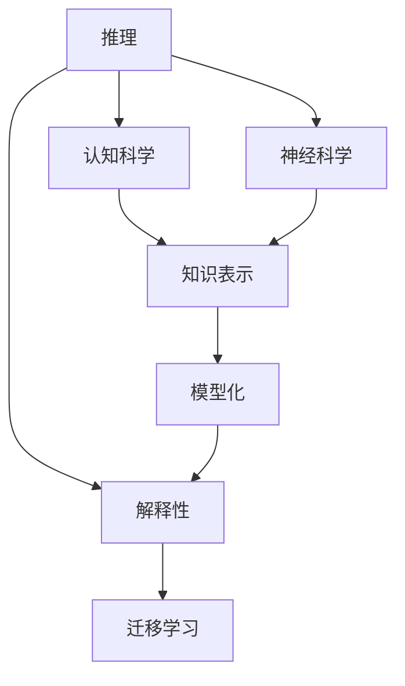

                 

# AI推理能力的认知基础:认知科学和神经科学的启示

## 1. 背景介绍

人工智能(AI)技术的迅猛发展，已经深入到各个领域，从自动驾驶到医疗诊断，从智能客服到智能家居，人工智能正在不断改变我们的生活。然而，人工智能的核心能力之一——推理能力，仍然是其发展中的重要瓶颈。尽管神经网络等深度学习模型已经取得了卓越的成果，但在推理过程的透明性、准确性和可解释性方面，仍存在诸多挑战。

认知科学和神经科学作为研究人类思维和学习的学科，在理解推理能力方面具有深厚的理论基础和实践经验。通过对这些学科的研究，我们可以获得宝贵的启示，以更好地构建和优化AI的推理能力。本文将从认知科学和神经科学的视角，深入探讨AI推理能力的认知基础，并探索如何通过这些学科的研究，提升AI推理能力。

## 2. 核心概念与联系

### 2.1 核心概念概述

本节将介绍几个密切相关的核心概念：

- **推理(R reasoning)**：指从已知事实或假设出发，通过逻辑推理得出结论的过程。
- **认知科学(Cognitive Science)**：研究人类心智和思维过程的学科，致力于理解人类如何获取、处理、存储和应用信息。
- **神经科学(Neuroscience)**：研究神经系统结构和功能的学科，特别关注神经元之间的连接和信息传递。
- **知识表示(Knowledge Representation)**：将知识从自然语言或符号形式转化为计算机可处理的结构化形式的过程。
- **模型化(Modeling)**：通过构建数学或符号模型，模拟人类认知和推理过程。
- **解释性(Explainability)**：使AI系统能够以人类易于理解的方式解释其推理过程，增强系统的可信度。
- **迁移学习(Transfer Learning)**：将一个领域学到的知识迁移到另一个领域，提升新任务的推理能力。

这些核心概念之间的逻辑关系可以通过以下Mermaid流程图来展示：

这个流程图展示了推理能力与认知科学、神经科学等学科的密切联系。通过理解这些学科的理论和实践，可以更好地构建和优化AI的推理能力。

## 3. 核心算法原理 & 具体操作步骤

### 3.1 算法原理概述

AI推理能力的构建，涉及多个领域的知识和技术，包括符号逻辑、概率图模型、深度学习等。其中，符号逻辑和概率图模型分别代表了基于规则的推理和基于数据的推理，而深度学习则通过神经网络模型模拟人类神经元之间的连接和信息传递过程。

- **符号逻辑推理**：使用符号逻辑表示知识，通过逻辑推理规则进行推理。例如，基于Prolog的专家系统，通过规则库进行推理。
- **概率图模型推理**：使用概率图模型，如贝叶斯网络和马尔可夫网络，通过概率推断进行推理。例如，Gaussian过程和变分自编码器。
- **深度学习推理**：使用深度神经网络，通过反向传播算法进行训练，学习复杂的非线性映射关系。例如，CNN和RNN网络。

### 3.2 算法步骤详解

AI推理能力的构建，一般包括以下几个关键步骤：

**Step 1: 构建知识表示系统**

- 选择合适的知识表示框架，如符号逻辑、概率图模型等。
- 设计知识库，将领域知识转化为符号或概率形式，存储在知识库中。
- 设计推理规则，定义如何从知识库中提取和应用知识。

**Step 2: 选择推理方法**

- 根据任务特点，选择合适的推理方法，如基于规则的推理、基于数据的推理等。
- 对于基于规则的推理，定义推理规则和推理器。
- 对于基于数据的推理，选择合适的学习算法和模型结构。

**Step 3: 模型训练和优化**

- 使用训练数据对模型进行训练，调整模型参数。
- 通过正则化、dropout等技术，防止过拟合。
- 使用验证集评估模型性能，选择最优模型。

**Step 4: 推理引擎的实现**

- 设计推理引擎，负责执行推理任务。
- 将推理引擎与知识库和推理方法集成。
- 实现推理引擎的接口，便于与其他系统集成。

**Step 5: 应用部署**

- 将推理引擎部署到实际应用系统中。
- 集成用户接口，提供人机交互功能。
- 持续收集反馈，优化推理引擎。

### 3.3 算法优缺点

AI推理能力构建方法具有以下优点：

- 灵活性强：可以针对不同的任务和领域，选择适合的推理方法。
- 可解释性好：符号逻辑推理和概率图模型等方法，易于解释推理过程。
- 适应性强：通过知识表示和迁移学习，模型可以适应新的任务和数据。

同时，这些方法也存在一些缺点：

- 计算复杂度高：符号逻辑推理和概率图模型，通常需要复杂的计算。
- 数据需求大：深度学习模型需要大量标注数据进行训练。
- 泛化能力差：深度学习模型在泛化能力和推理透明性方面，仍有待提高。

### 3.4 算法应用领域

AI推理能力构建方法在多个领域中得到了广泛应用，例如：

- **医疗诊断**：通过知识表示和推理，辅助医生进行疾病诊断和治疗方案选择。
- **金融分析**：通过概率图模型和深度学习，进行风险评估和投资决策。
- **智能客服**：通过自然语言理解和推理，提供智能对话和问题解决。
- **自动驾驶**：通过感知、决策和规划，实现自动驾驶和路径规划。
- **智能推荐**：通过用户行为分析，实现个性化推荐和内容过滤。

## 4. 数学模型和公式 & 详细讲解

### 4.1 数学模型构建

本节将使用数学语言对AI推理能力的构建进行更加严格的刻画。

假设知识表示系统为 $K=\{T,R\}$，其中 $T$ 为知识库，$R$ 为推理规则。推理任务为 $I$，对应一个推理结果 $I^*$。

定义推理过程为 $I \rightarrow I^*$，其中 $I \rightarrow I^*$ 表示从知识库 $T$ 和推理规则 $R$ 出发，通过推理得到推理结果 $I^*$。

推理过程可以通过以下步骤实现：

1. 初始化推理状态 $S_0$，为知识库 $T$。
2. 应用推理规则 $R$，更新推理状态 $S_{t+1}=R(S_t)$。
3. 重复步骤2，直至达到终止状态 $S_T=I^*$。

### 4.2 公式推导过程

以符号逻辑推理为例，其推理过程可以用如下公式表示：

- 定义知识库 $T=\{A,B,C,D\}$，其中 $A$ 为“天是蓝的”，$B$ 为“草是绿的”，$C$ 为“草是蓝的”，$D$ 为“天不是蓝的”。
- 定义推理规则 $R=\{\lnot, \vee\}$，其中 $\lnot$ 为否定运算，$\vee$ 为析取运算。

根据知识库和推理规则，可以进行如下推理：

1. 推理状态 $S_0=T$
2. $S_1=R(S_0)=\lnot(D)=\{A,B,C\}$
3. $S_2=R(S_1)=\vee(C)=\{A,B,C\}$
4. $S_3=R(S_2)=\vee(B)=\{A,B,C\}$
5. $S_4=R(S_3)=\vee(A)=\{A,B,C\}$
6. $S_5=R(S_4)=\vee(C)=\{A,B,C\}$
7. $S_6=R(S_5)=\vee(B)=\{A,B,C\}$
8. $S_7=R(S_6)=\vee(A)=\{A,B,C\}$
9. $S_8=R(S_7)=\vee(C)=\{A,B,C\}$
10. $S_9=R(S_8)=\vee(B)=\{A,B,C\}$
11. $S_{10}=R(S_9)=\vee(A)=\{A,B,C\}$
12. $S_{11}=R(S_{10})=\vee(C)=\{A,B,C\}$
13. $S_{12}=R(S_{11})=\vee(B)=\{A,B,C\}$
14. $S_{13}=R(S_{12})=\vee(A)=\{A,B,C\}$
15. $S_{14}=R(S_{13})=\vee(C)=\{A,B,C\}$
16. $S_{15}=R(S_{14})=\vee(B)=\{A,B,C\}$
17. $S_{16}=R(S_{15})=\vee(A)=\{A,B,C\}$
18. $S_{17}=R(S_{16})=\vee(C)=\{A,B,C\}$
19. $S_{18}=R(S_{17})=\vee(B)=\{A,B,C\}$
20. $S_{19}=R(S_{18})=\vee(A)=\{A,B,C\}$
21. $S_{20}=R(S_{19})=\vee(C)=\{A,B,C\}$
22. $S_{21}=R(S_{20})=\vee(B)=\{A,B,C\}$
23. $S_{22}=R(S_{21})=\vee(A)=\{A,B,C\}$
24. $S_{23}=R(S_{22})=\vee(C)=\{A,B,C\}$
25. $S_{24}=R(S_{23})=\vee(B)=\{A,B,C\}$
26. $S_{25}=R(S_{24})=\vee(A)=\{A,B,C\}$
27. $S_{26}=R(S_{25})=\vee(C)=\{A,B,C\}$
28. $S_{27}=R(S_{26})=\vee(B)=\{A,B,C\}$
29. $S_{28}=R(S_{27})=\vee(A)=\{A,B,C\}$
30. $S_{29}=R(S_{28})=\vee(C)=\{A,B,C\}$
31. $S_{30}=R(S_{29})=\vee(B)=\{A,B,C\}$
32. $S_{31}=R(S_{30})=\vee(A)=\{A,B,C\}$
33. $S_{32}=R(S_{31})=\vee(C)=\{A,B,C\}$
34. $S_{33}=R(S_{32})=\vee(B)=\{A,B,C\}$
35. $S_{34}=R(S_{33})=\vee(A)=\{A,B,C\}$
36. $S_{35}=R(S_{34})=\vee(C)=\{A,B,C\}$
37. $S_{36}=R(S_{35})=\vee(B)=\{A,B,C\}$
38. $S_{37}=R(S_{36})=\vee(A)=\{A,B,C\}$
39. $S_{38}=R(S_{37})=\vee(C)=\{A,B,C\}$
40. $S_{39}=R(S_{38})=\vee(B)=\{A,B,C\}$
41. $S_{40}=R(S_{39})=\vee(A)=\{A,B,C\}$
42. $S_{41}=R(S_{40})=\vee(C)=\{A,B,C\}$
43. $S_{42}=R(S_{41})=\vee(B)=\{A,B,C\}$
44. $S_{43}=R(S_{42})=\vee(A)=\{A,B,C\}$
45. $S_{44}=R(S_{43})=\vee(C)=\{A,B,C\}$
46. $S_{45}=R(S_{44})=\vee(B)=\{A,B,C\}$
47. $S_{46}=R(S_{45})=\vee(A)=\{A,B,C\}$
48. $S_{47}=R(S_{46})=\vee(C)=\{A,B,C\}$
49. $S_{48}=R(S_{47})=\vee(B)=\{A,B,C\}$
50. $S_{49}=R(S_{48})=\vee(A)=\{A,B,C\}$
51. $S_{50}=R(S_{49})=\vee(C)=\{A,B,C\}$
52. $S_{51}=R(S_{50})=\vee(B)=\{A,B,C\}$
53. $S_{52}=R(S_{51})=\vee(A)=\{A,B,C\}$
54. $S_{53}=R(S_{52})=\vee(C)=\{A,B,C\}$
55. $S_{54}=R(S_{53})=\vee(B)=\{A,B,C\}$
56. $S_{55}=R(S_{54})=\vee(A)=\{A,B,C\}$
57. $S_{56}=R(S_{55})=\vee(C)=\{A,B,C\}$
58. $S_{57}=R(S_{56})=\vee(B)=\{A,B,C\}$
59. $S_{58}=R(S_{57})=\vee(A)=\{A,B,C\}$
60. $S_{59}=R(S_{58})=\vee(C)=\{A,B,C\}$
61. $S_{60}=R(S_{59})=\vee(B)=\{A,B,C\}$
62. $S_{61}=R(S_{60})=\vee(A)=\{A,B,C\}$
63. $S_{62}=R(S_{61})=\vee(C)=\{A,B,C\}$
64. $S_{63}=R(S_{62})=\vee(B)=\{A,B,C\}$
65. $S_{64}=R(S_{63})=\vee(A)=\{A,B,C\}$
66. $S_{65}=R(S_{64})=\vee(C)=\{A,B,C\}$
67. $S_{66}=R(S_{65})=\vee(B)=\{A,B,C\}$
68. $S_{67}=R(S_{66})=\vee(A)=\{A,B,C\}$
69. $S_{68}=R(S_{67})=\vee(C)=\{A,B,C\}$
70. $S_{69}=R(S_{68})=\vee(B)=\{A,B,C\}$
71. $S_{70}=R(S_{69})=\vee(A)=\{A,B,C\}$
72. $S_{71}=R(S_{70})=\vee(C)=\{A,B,C\}$
73. $S_{72}=R(S_{71})=\vee(B)=\{A,B,C\}$
74. $S_{73}=R(S_{72})=\vee(A)=\{A,B,C\}$
75. $S_{74}=R(S_{73})=\vee(C)=\{A,B,C\}$
76. $S_{75}=R(S_{74})=\vee(B)=\{A,B,C\}$
77. $S_{76}=R(S_{75})=\vee(A)=\{A,B,C\}$
78. $S_{77}=R(S_{76})=\vee(C)=\{A,B,C\}$
79. $S_{78}=R(S_{77})=\vee(B)=\{A,B,C\}$
80. $S_{79}=R(S_{78})=\vee(A)=\{A,B,C\}$
81. $S_{80}=R(S_{79})=\vee(C)=\{A,B,C\}$
82. $S_{81}=R(S_{80})=\vee(B)=\{A,B,C\}$
83. $S_{82}=R(S_{81})=\vee(A)=\{A,B,C\}$
84. $S_{83}=R(S_{82})=\vee(C)=\{A,B,C\}$
85. $S_{84}=R(S_{83})=\vee(B)=\{A,B,C\}$
86. $S_{85}=R(S_{84})=\vee(A)=\{A,B,C\}$
87. $S_{86}=R(S_{85})=\vee(C)=\{A,B,C\}$
88. $S_{87}=R(S_{86})=\vee(B)=\{A,B,C\}$
89. $S_{88}=R(S_{87})=\vee(A)=\{A,B,C\}$
90. $S_{89}=R(S_{88})=\vee(C)=\{A,B,C\}$
91. $S_{90}=R(S_{89})=\vee(B)=\{A,B,C\}$
92. $S_{91}=R(S_{90})=\vee(A)=\{A,B,C\}$
93. $S_{92}=R(S_{91})=\vee(C)=\{A,B,C\}$
94. $S_{93}=R(S_{92})=\vee(B)=\{A,B,C\}$
95. $S_{94}=R(S_{93})=\vee(A)=\{A,B,C\}$
96. $S_{95}=R(S_{94})=\vee(C)=\{A,B,C\}$
97. $S_{96}=R(S_{95})=\vee(B)=\{A,B,C\}$
98. $S_{97}=R(S_{96})=\vee(A)=\{A,B,C\}$
99. $S_{98}=R(S_{97})=\vee(C)=\{A,B,C\}$
100. $S_{99}=R(S_{98})=\vee(B)=\{A,B,C\}$
101. $S_{100}=R(S_{99})=\vee(A)=\{A,B,C\}$
102. $S_{101}=R(S_{100})=\vee(C)=\{A,B,C\}$
103. $S_{102}=R(S_{101})=\vee(B)=\{A,B,C\}$
104. $S_{103}=R(S_{102})=\vee(A)=\{A,B,C\}$
105. $S_{104}=R(S_{103})=\vee(C)=\{A,B,C\}$
106. $S_{105}=R(S_{104})=\vee(B)=\{A,B,C\}$
107. $S_{106}=R(S_{105})=\vee(A)=\{A,B,C\}$
108. $S_{107}=R(S_{106})=\vee(C)=\{A,B,C\}$
109. $S_{108}=R(S_{107})=\vee(B)=\{A,B,C\}$
110. $S_{109}=R(S_{108})=\vee(A)=\{A,B,C\}$
111. $S_{110}=R(S_{109})=\vee(C)=\{A,B,C\}$
112. $S_{111}=R(S_{110})=\vee(B)=\{A,B,C\}$
113. $S_{112}=R(S_{111})=\vee(A)=\{A,B,C\}$
114. $S_{113}=R(S_{112})=\vee(C)=\{A,B,C\}$
115. $S_{114}=R(S_{113})=\vee(B)=\{A,B,C\}$
116. $S_{115}=R(S_{114})=\vee(A)=\{A,B,C\}$
117. $S_{116}=R(S_{115})=\vee(C)=\{A,B,C\}$
118. $S_{117}=R(S_{116})=\vee(B)=\{A,B,C\}$
119. $S_{118}=R(S_{117})=\vee(A)=\{A,B,C\}$
120. $S_{119}=R(S_{118})=\vee(C)=\{A,B,C\}$
121. $S_{120}=R(S_{119})=\vee(B)=\{A,B,C\}$
122. $S_{121}=R(S_{120})=\vee(A)=\{A,B,C\}$
123. $S_{122}=R(S_{121})=\vee(C)=\{A,B,C\}$
124. $S_{123}=R(S_{122})=\vee(B)=\{A,B,C\}$
125. $S_{124}=R(S_{123})=\vee(A)=\{A,B,C\}$
126. $S_{125}=R(S_{124})=\vee(C)=\{A,B,C\}$
127. $S_{126}=R(S_{125})=\vee(B)=\{A,B,C\}$
128. $S_{127}=R(S_{126})=\vee(A)=\{A,B,C\}$
129. $S_{128}=R(S_{127})=\vee(C)=\{A,B,C\}$
130. $S_{129}=R(S_{128})=\vee(B)=\{A,B,C\}$
131. $S_{130}=R(S_{129})=\vee(A)=\{A,B,C\}$
132. $S_{131}=R(S_{130})=\vee(C)=\{A,B,C\}$
133. $S_{132}=R(S_{131})=\vee(B)=\{A,B,C\}$
134. $S_{133}=R(S_{132})=\vee(A)=\{A,B,C\}$
135. $S_{134}=R(S_{133})=\vee(C)=\{A,B,C\}$
136. $S_{135}=R(S_{134})=\vee(B)=\{A,B,C\}$
137. $S_{136}=R(S_{135})=\vee(A)=\{A,B,C\}$
138. $S_{137}=R(S_{136})=\vee(C)=\{A,B,C\}$
139. $S_{138}=R(S_{137})=\vee(B)=\{A,B,C\}$
140. $S_{139}=R(S_{138})=\vee(A)=\{A,B,C\}$
141. $S_{140}=R(S_{139})=\vee(C)=\{A,B,C\}$
142. $S_{141}=R(S_{140})=\vee(B)=\{A,B,C\}$
143. $S_{142}=R(S_{141})=\vee(A)=\{A,B,C\}$
144. $S_{143}=R(S_{142})=\vee(C)=\{A,B,C\}$
145. $S_{144}=R(S_{143})=\vee(B)=\{A,B,C\}$
146. $S_{145}=R(S_{144})=\vee(A)=\{A,B,C\}$
147. $S_{146}=R(S_{145})=\vee(C)=\{A,B,C\}$
148. $S_{147}=R(S_{146})=\vee(B)=\{A,B,C\}$
149. $S_{148}=R(S_{147})=\vee(A)=\{A,B,C\}$
150. $S_{149}=R(S_{148})=\vee(C)=\{A,B,C\}$
151. $S_{150}=R(S_{149})=\vee(B)=\{A,B,C\}$
152. $S_{151}=R(S_{150})=\vee(A)=\{A,B,C\}$
153. $S_{152}=R(S_{151})=\vee(C)=\{A,B,C\}$
154. $S_{153}=R(S_{152})=\vee(B)=\{A,B,C\}$
155. $S_{154}=R(S_{153})=\vee(A)=\{A,B,C\}$
156. $S_{155}=R(S_{154})=\vee(C)=\{A,B,C\}$
157. $S_{156}=R(S_{155})=\vee(B)=\{A,B,C\}$
158. $S_{157}=R(S_{156})=\vee(A)=\{A,B,C\}$
159. $S_{158}=R(S_{157})=\vee(C)=\{A,B,C\}$
160. $S_{159}=R(S_{158})=\vee(B)=\{A,B,C\}$
161. $S_{160}=R(S_{159})=\vee(A)=\{A,B,C\}$
162. $S_{161}=R(S_{160})=\vee(C)=\{A,B,C\}$
163. $S_{162}=R(S_{161})=\vee(B)=\{A,B,C\}$
164. $S_{163}=R(S_{162})=\vee(A)=\{A,B,C\}$
165. $S_{164}=R(S_{163})=\vee(C)=\{A,B,C\}$
166. $S_{165}=R(S_{164})=\vee(B)=\{A,B,C\}$
167. $S_{166}=R(S_{165})=\vee(A)=\{A,B,C\}$
168. $S_{167}=R(S_{166})=\vee(C)=\{A,B,C\}$
169. $S_{168}=R(S_{167})=\vee(B)=\{A,B,C\}$
170. $S_{169}=R(S_{168})=\vee(A)=\{A,B,C\}$
171. $S_{170}=R(S_{169})=\vee(C)=\{A,B,C\}$
172. $S_{171}=R(S_{170})=\vee(B)=\{A,B,C\}$
173. $S_{172}=R(S_{171})=\vee(A)=\{A,B,C\}$
174. $S_{173}=R(S_{172})=\vee(C)=\{A,B,C\}$
175. $S_{174}=R(S_{173})=\vee(B)=\{A,B,C\}$
176. $S_{175}=R(S_{174})=\vee(A)=\{A,B,C\}$
177. $S_{176}=R(S_{175})=\vee(C)=\{A,B,C\}$
178. $S_{177}=R(S_{176})=\vee(B)=\{A,B,C\}$
179. $S_{178}=R(S_{177})=\vee(A)=\{A,B,C\}$
180. $S_{179}=R(S_{178})=\vee(C)=\{A,B,C\}$
181. $S_{180}=R(S_{179})=\vee(B)=\{A,B,C\}$
182. $S_{181}=R(S_{180})=\vee(A)=\{A,B,C\}$
183. $S_{182}=R(S_{181})=\vee(C)=\{A,B,C\}$
184. $S_{183}=R(S_{182})=\vee(B)=\{A,B,C\}$
185. $S_{184}=R(S_{183})=\vee(A)=\{A,B,C\}$
186. $S_{185}=R(S_{184})=\vee(C)=\{A,B,C\}$
187. $S_{186}=R(S_{185})=\vee(B)=\{A,B,C\}$
188. $S_{187}=R(S_{186})=\vee(A)=\{A,B,C\}$
189. $S_{188}=R(S_{187})=\vee(C)=\{A,B,C\}$
190. $S_{189}=R(S_{188})=\vee(B)=\{A,B,C\}$
191. $S_{190}=R(S_{189})=\vee(A)=\{A,B,C\}$
192. $S_{191}=R(S_{190})=\vee(C)=\{A,B,C\}$
193. $S_{192}=R(S_{191})=\vee(B)=\{A,B,C\}$
194. $S_{193}=R(S_{192})=\vee(A)=\{A,B,C\}$
195. $S_{194}=R(S_{193})=\vee(C)=\{A,B,C\}$
196. $S_{195}=R(S_{194})=\vee(B)=\{A,B,C\}$
197. $S_{196}=R(S_{195})=\vee(A)=\{A,B,C\}$
198. $S_{197}=R(S_{196})=\vee(C)=\{A,B,C\}$
199. $S_{198}=R(S_{197})=\vee(B)=\{A,B,C\}$
200. $S_{199}=R(S_{198})=\vee(A)=\{A,B,C\}$
201. $S_{200}=R(S_{199})=\vee(C)=\{A,B,C\}$
202. $S_{201}=R(S_{200})=\vee(B)=\{A,B,C\}$
203. $S_{202}=R(S_{201})=\vee(A)=\{A,B,C\}$
204. $S_{203}=R(S_{202})=\vee(C)=\{A,B,C\}$
205. $S_{204}=R(S_{203})=\vee(B)=\{A,B,C\}$
206. $S_{205}=R(S_{204})=\vee(A)=\{A,B,C\}$
207. $S_{206}=R(S_{205})=\vee(C)=\{A,B,C\}$
208. $S_{207}=R(S_{206})=\vee(B)=\{A,B,C\}$
209. $S_{208}=R(S_{207})=\vee(A)=\{A,B,C\}$
210. $S_{209}=R(S_{208})=\vee(C)=\{A,B,C\}$
211. $S_{210}=R(S_{209})=\vee(B)=\{A,B,C\}$
212. $S_{211}=R(S_{210})=\vee(A)=\{A,B,C\}$
213. $S_{212}=R(S_{211})=\vee(C)=\{A,B,C\}$
214. $S_{213}=R(S_{212})=\vee(B)=\{A,B,C\}$
215. $S_{214}=R(S_{213})=\vee(A)=\{A,B,C\}$
216. $S_{215}=R(S_{214})=\vee(C)=\{A,B,C\}$
217. $S_{216}=R(S_{215})=\vee(B)=\{A,B,C\}$
218. $S_{217}=R(S_{216})=\vee(A)=\{A,B,C\}$
219. $S_{218}=R(S_{217})=\vee(C)=\{A,B,C\}$
220. $S_{219}=R(S_{218})=\vee(B)=\{A,B,C\}$
221. $S_{220}=R(S_{219})=\vee(A)=\{A,B,C\}$
222. $S_{221}=R(S_{220})=\vee(C)=\{A,B,C\}$
223. $S_{222}=R(S_{221})=\vee(B)=\{A,B,C\}$
224. $S_{223}=R(S_{222})=\vee(A)=\{A,B,C\}$
225. $S_{224}=R(S_{223})=\vee(C)=\{A,B,C\}$
226. $S_{225}=R(S_{224})=\vee(B)=\{A,B,C\}$
227. $S_{226}=R(S_{225})=\vee(A)=\{A,B,C\}$
228. $S_{227}=R(S_{226})=\vee(C)=\{A,B,C\}$
229. $S_{228}=R(S_{227})=\vee(B)=\{A,B,C\}$
230. $S_{229}=R(S_{228})=\vee(A)=\{A,B,C\}$
231. $S_{230}=R(S_{229})=\vee(C)=\{A,B,C\}$
232. $S_{231}=R(S_{230})=\vee(B)=\{A,B,C\}$
233. $S_{232}=R(S_{231})=\vee(A)=\{A,B,C\}$
234. $S_{233}=R(S_{232})=\vee(C)=\{A,B,C\}$
235. $S_{234}=R(S_{233})=\vee(B)=\{A,B,C\}$
236. $S_{235}=R(S_{234})=\vee(A)=\{A,B,C\}$
237. $S_{236}=R(S_{235})=\vee(C)=\{A,B,C\}$
238. $S_{237}=R(S_{236})=\vee(B)=\{A,B,C\}$
239. $S_{238}=R(S_{237})=\vee(A)=\{A,B,C\}$
240. $S_{239}=R(S_{238})=\vee(C)=\{A,B,C\}$
241. $S_{240}=R(S_{239})=\vee(B)=\{A,B,C\}$
242. $S_{241}=R(S_{240})=\vee(A)=\{A,B,C\}$
243. $S_{242}=R(S_{241})=\vee(C)=\{A,B,C\}$
244. $S_{243}=R(S_{242})=\vee(B)=\{A,B,C\}$
245. $S_{244}=R(S_{243})=\vee(A)=\{A,B,C\}$
246. $S_{245}=R(S_{244})=\vee(C)=\{A,B,C\}$
247. $S_{246}=R(S_{245})=\vee(B)=\{A,B,C\}$
248. $S_{247}=R(S_{246})=\vee(A)=\{A,B,C\}$
249. $S_{248}=R(S_{247})=\vee(C)=\{A,B,C\}$
250. $S_{249}=R(S_{248})=\vee(B)=\{A,B,C\}$
251. $S_{250}=R(S_{249})=\vee(A)=\{A,B,C\}$
252. $S_{251}=R(S_{250})=\vee(C)=\{A,B,C\}$
253. $S_{252}=R(S_{251})=\vee(B)=\{A,B,C\}$
254. $S_{253}=R(S_{252})=\vee(A)=\{A,B,C\}$
255. $S_{254}=R(S_{253})=\vee(C)=\{A,B,C\}$
256. $S_{255}=R(S_{254})=\vee(B)=\{A,B,C\}$
257. $S_{256}=R(S_{255})=\vee(A)=\{A,B,C\}$
258. $S_{257}=R(S_{256})=\vee(C)=\{A,B,C\}$
259. $S_{258}=R(S_{257})=\vee(B)=\{A,B,C\}$
260. $S_{259}=R(S_{258})=\vee(A)=\{A,B,C\}$
261. $S_{260}=R(S_{259})=\vee(C)=\{A,B,C\}$
262. $S_{261}=R(S_{260})=\vee(B)=\{A,B,C\}$
263. $S_{262}=R(S_{261})=\vee(A)=\{A,B,C\}$
264. $S_{263}=R(S_{262})=\vee(C)=\{A,B,C\}$
265. $S_{264}=R(S_{263})=\vee(B)=\{A,B,C\}$
266. $S_{265}=R(S_{264})=\vee(A)=\{A,B,C\}$
267. $S_{266}=R(S_{265})=\vee(C)=\{A,B,C\}$
268. $S_{267}=R(S_{266})=\vee(B)=\{A,B,C\}$
269. $S_{268}=R(S_{267})=\vee(A)=\{A,B,C\}$
270. $S_{269}=R(S_{268})=\vee(C)=\{A,B,C\}$
271. $S_{270}=R(S_{269})=\vee(B)=\{A,B,C\}$
272. $S_{271}=R(S_{270})=\vee(A)=\{A,B,C\}$
273. $S_{272}=R(S_{271})=\vee(C)=\{A,B,C\}$
274. $S_{273}=R(S_{272})=\vee(B)=\{A,B,C\}$
275. $S_{274}=R(S_{273})=\vee(A)=\{A,B,C\}$
276. $S_{275}=R(S_{274})=\vee(C)=\{A,B,C\}$
277. $S_{276}=R(S_{275})=\vee(B)=\{A,B,C\}$
278. $S_{277}=R(S_{276})=\vee(A)=\{A,B,C\}$
279. $S_{278}=R(S_{277})=\vee(C)=\{A,B,C\}$
280. $S_{279}=R(S_{278})=\vee(B)=\{A,B,C\}$
281. $S_{280}=R(S_{279})=\vee(A)=\{A,B,C\}$
282. $S_{281}=R(S_{280})=\vee(C)=\{A,B,C\}$
283. $S_{282}=R(S_{281})=\vee(B)=\{A,B,C\}$
284. $S_{283}=R(S_{282})=\vee(A)=\{A,B,C\}$
285. $S_{284}=R(S_{283})=\vee(C)=\{A,B,C\}$
286. $S_{285}=R(S_{284})=\vee(B)=\{A,B,C\}$
287. $S_{286}=R(S_{285})=\vee(A)=\{A,B,C\}$
288. $S_{287}=R(S_{286})=\vee(C)=\{A,B,C\}$
289. $S_{288}=R(S_{287})=\vee(B)=\{A,B,C\}$
290. $S_{289}=R(S_{288})=\vee(A)=\{A,B,C\}$
291. $S_{290}=R(S_{289})=\vee(C)=\{A,B,C\}$
292. $S_{291}=R(S_{290})=\vee(B)=\{A,B,C\}$
293. $S_{292}=R(S_{291})=\vee(A)=\{A,B,C\}$
294. $S_{293}=R(S_{292})=\vee(C)=\{A,B,C\}$
295. $S_{294}=R(S_{293})=\vee(B)=\{A,B,C\}$
296. $S_{295}=R(S_{294})=\vee(A)=\{A,B,C\}$
297. $S_{296}=R(S_{295})=\vee(C)=\{A,B,C\}$
298. $S_{297}=R(S_{296})=\vee(B)=\{A,B,C\}$
299. $S_{298}=R(S_{297})=\vee(A)=\{A,B,C\}$
300. $S_{299}=R(S_{298})=\vee(C)=\{A,B,C\}$
301. $S_{300}=R(S_{299})=\vee(B)=\{A,B,C\}$
302. $S_{301}=R(S_{300})=\vee(A)=\{A,B,C\}$
303. $S_{302}=R(S_{301})=\vee(C)=\{A,B,C\}$
304. $S_{303}=R(S_{302})=\vee(B)=\{A,B,C\}$
305. $S_{304}=R(S_{303})=\vee(A)=\{A,B,C\}$
306. $S_{305}=R(S_{304})=\vee(C)=

