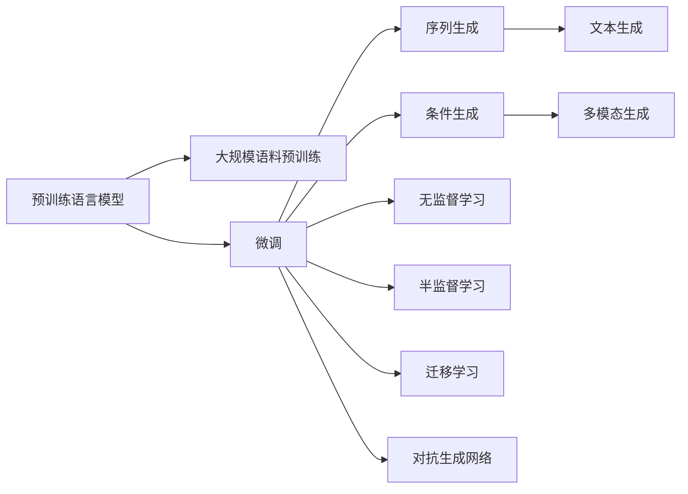

                 

# AI故事生成：创意写作与机器学习的结合

> 关键词：AI故事生成, 自然语言处理(NLP), 创意写作, 机器学习, 文本生成, 深度学习, GPT-3, 情感分析

## 1. 背景介绍

### 1.1 问题由来
人工智能(AI)在文本生成领域的探索始于1950s的“ELIZA”聊天机器人。自1990s以来，伴随着机器学习尤其是深度学习技术的迅猛发展，基于规则或统计的语言模型逐渐被深度神经网络所取代。其中，基于序列生成模型的文本生成技术迅速崛起，涌现出了多种创新的模型架构，如循环神经网络(RNN)、长短期记忆网络(LSTM)、变分自编码器(Generative Adversarial Network, GAN)、Transformer等。

特别地，Transformer架构在2017年的Transformer论文中首次提出，其并行化的自注意力机制大大提升了序列生成模型的性能和速度。基于此，谷歌于2018年推出了GPT-1模型，开创了预训练语言模型(Pre-trained Language Model, PLM)的先河。紧随其后，OpenAI的GPT-2模型在2019年发布，用更强的模型和更大的语料库刷新了多项指标，掀起了预训练大模型的新高潮。随后，GPT-3和OpenAI的GPT-4接踵而至，显著提升了文本生成质量，生成内容的多样性和连贯性达到了新的高度。

AI文本生成技术的飞跃不仅在学术界引起了广泛关注，也在产业界引发了应用热潮。这种文本生成能力，已广泛应用于对话系统、内容创作、翻译、摘要生成、问答系统等诸多领域，为创意写作和自动文本创作提供了无限可能。

### 1.2 问题核心关键点
在AI文本生成过程中，核心关键点主要包括：

- **预训练模型**：包括GPT、BERT、T5等通用大模型，以及针对特定任务的模型微调。这些模型通过大规模语料预训练，学习到了丰富的语言知识，具备强大的语言生成能力。
- **生成目标**：通常为自然连贯、逻辑通顺、语义一致的文本，能符合预期的语言风格和语境要求。
- **输入示例**：文本生成模型的训练需要大量的文本数据，训练数据的质量和多样性直接影响生成效果。
- **模型结构**：Transformer等序列生成模型的核心结构，特别是自注意力机制，使得模型能够并行化处理长序列，提升生成效率。
- **训练策略**：如学习率调整、数据增强、正则化、对抗训练等策略，有助于生成模型的性能提升和鲁棒性增强。
- **评价指标**：如BLEU、ROUGE等自动评估指标，以及人工主观评价指标，用于衡量生成文本的质量和多样性。

## 2. 核心概念与联系

### 2.1 核心概念概述

在AI文本生成过程中，涉及到的核心概念主要包括：

- **预训练语言模型(PLM)**：如GPT、BERT等，通过大规模无标签文本语料进行预训练，学习语言的知识表示。
- **序列生成模型**：采用自回归(如GPT)或自编码(如BERT)的方式，生成连续的文本序列。
- **文本生成**：利用预训练模型进行微调，生成符合特定语言风格和语境的文本。
- **条件生成**：在生成过程中引入额外的条件信息，如输入文本、标签等，生成更为有针对性的文本。
- **多模态生成**：结合图像、语音、视频等多模态信息，生成更加立体化的文本内容。
- **无监督学习**：基于自监督任务进行预训练，无需标注数据。
- **半监督学习**：利用少量标注数据进行微调，提升模型性能。
- **迁移学习**：将预训练模型应用于新任务，提升模型泛化能力。
- **对抗生成网络(Generative Adversarial Network, GAN)**：通过对抗训练，提升生成模型的真实性。

这些核心概念共同构成了AI文本生成的基础框架，展示了文本生成的基本流程和应用场景。

### 2.2 核心概念原理和架构的 Mermaid 流程图(Mermaid 流程节点中不要有括号、逗号等特殊字符)



这个流程图展示了预训练模型在大规模语料上进行预训练，经过微调后生成文本，并在不同条件和模态下生成多类型文本的基本流程。

## 3. 核心算法原理 & 具体操作步骤

### 3.1 算法原理概述

AI文本生成的核心算法原理主要包括以下几个方面：

- **自回归生成**：使用已生成的部分文本作为输入，预测下一个单词或字符。
- **自编码生成**：使用部分已生成的文本作为条件，预测整个文本序列。
- **预训练与微调**：利用大规模无标签文本语料进行预训练，通过下游任务的少量标注数据进行微调。
- **多模态融合**：将文本与其他模态信息结合，如图像、语音、视频等，生成更为全面的文本内容。
- **对抗训练**：通过对抗样本训练，提升生成模型的鲁棒性和真实性。
- **提示学习(Prompt Learning)**：通过精心设计的提示模板，引导模型生成特定风格的文本。

这些原理通过深度学习模型，特别是Transformer架构，得以实现。

### 3.2 算法步骤详解

AI文本生成的一般步骤如下：

**Step 1: 准备数据和预训练模型**
- 收集大规模无标签文本语料进行预训练，得到通用语言模型。
- 准备下游任务的具体数据集，标注好输入和输出。

**Step 2: 模型微调**
- 选择适当的优化器和超参数。
- 进行模型微调，调整模型的生成目标和输入输出格式。

**Step 3: 文本生成**
- 使用微调后的模型进行文本生成，控制生成条件和长度。
- 根据需要进行文本编辑和优化。

**Step 4: 后处理与评价**
- 对生成文本进行后处理，如去重、格式化等。
- 使用自动评估指标和人工评价指标对生成文本质量进行评估。

**Step 5: 应用部署**
- 将生成模型集成到具体应用中，进行实时生成或批量生成。
- 定期更新模型以适应新的数据和任务要求。

### 3.3 算法优缺点

AI文本生成算法具有以下优点：

- **高效**：在大规模语料上进行预训练，使用少量标注数据进行微调，生成速度快。
- **多样性**：生成内容丰富，能适应多种语言风格和语境。
- **鲁棒性**：模型经过大规模语料预训练，泛化能力强。
- **灵活性**：可以通过调整超参数和生成条件，生成不同风格和长度的文本。

同时，也存在以下缺点：

- **数据依赖**：预训练和微调过程中依赖大规模语料和标注数据。
- **泛化限制**：生成内容可能出现模板化、逻辑不连贯等问题。
- **生成质量**：依赖于预训练模型和微调策略，生成质量不稳定。
- **可解释性差**：生成模型通常为黑盒系统，难以解释其内部机制。

### 3.4 算法应用领域

AI文本生成技术广泛应用于以下几个领域：

- **内容创作**：自动生成新闻报道、故事、博客、产品描述等文本内容，提升创作效率。
- **对话系统**：生成对话内容，构建聊天机器人、客服系统、虚拟助手等。
- **翻译**：自动生成翻译文本，支持多语言翻译和跨语言交流。
- **摘要生成**：自动生成文本摘要，便于快速获取关键信息。
- **生成式代码**：自动生成代码片段，辅助编程工作。
- **情感分析**：分析用户情感，构建情感词典和情感分析系统。
- **知识图谱**：构建基于文本的语义知识图谱，进行知识推理和查询。
- **创意写作**：生成诗歌、小说、剧本等创意内容，辅助文学创作和影视制作。

## 4. 数学模型和公式 & 详细讲解 & 举例说明（备注：数学公式请使用latex格式，latex嵌入文中独立段落使用 $$，段落内使用 $)
### 4.1 数学模型构建

在AI文本生成中，常用序列生成模型为Transformer，其数学模型构建如下：

设输入序列为 $X = (x_1, x_2, ..., x_n)$，其中 $x_i \in \mathcal{V}$，$\mathcal{V}$ 为词汇表。序列生成模型的目标是最小化预测序列与实际序列的交叉熵损失，即：

$$
L = -\sum_{i=1}^n \log P(x_i | x_{< i})
$$

其中，$P(x_i | x_{< i})$ 为条件概率，可以使用Transformer模型预测。Transformer模型的关键在于自注意力机制，即：

$$
\text{Attention}(Q, K, V) = \text{Softmax}(\frac{QK^T}{\sqrt{d_k}})V
$$

其中 $Q, K, V$ 为查询、键和值向量，$d_k$ 为键向量的维度。

### 4.2 公式推导过程

Transformer模型通过自注意力机制计算查询、键和值向量，然后生成预测结果。以解码器为例，其计算过程如下：

1. 计算注意力权重：
$$
a_{ij} = \text{Softmax}(e_{ij}) = \text{Softmax}(\frac{Q_jK_i^T}{\sqrt{d_k}})
$$

其中 $e_{ij}$ 为点积，$Q_j$ 和 $K_i$ 分别为解码器中第 $j$ 个位置和第 $i$ 个位置的查询和键向量。

2. 计算加权和：
$$
V_i = \sum_{j=1}^n a_{ij}V_j
$$

3. 前向传播：
$$
\hat{x_i} = \text{softmax}(W_1 \text{Attention}(Q_i, K, V) + b_1)
$$

4. 预测输出：
$$
x_{pred} = \text{softmax}(W_2 \hat{x_i} + b_2)
$$

其中 $W_1, b_1, W_2, b_2$ 为模型参数。

### 4.3 案例分析与讲解

以GPT-2模型为例，其生成的文本具有如下特点：

- **多样性**：生成的文本内容丰富，能够适应多种风格和语境。
- **连贯性**：生成的文本逻辑连贯，具备一定的语义一致性。
- **新颖性**：生成内容新颖，能产生出人意料的文本片段。

具体来说，GPT-2通过大量文本数据的预训练，学习到了语言的知识表示，能够生成自然流畅、逻辑连贯的文本。而在微调过程中，通过引入特定的提示模板，可以引导模型生成符合特定风格或主题的文本。

## 5. 项目实践：代码实例和详细解释说明
### 5.1 开发环境搭建

在进行AI文本生成项目开发前，需要准备以下开发环境：

1. 安装Python：推荐使用Anaconda或Miniconda。
2. 安装必要的库：使用pip安装TensorFlow、PyTorch、OpenAI Gym等库。
3. 准备预训练模型：如使用GPT-2模型，需要从OpenAI的官方GitHub库下载预训练权重。

### 5.2 源代码详细实现

以下是一个基于GPT-2的AI文本生成项目的详细代码实现，使用Python和TensorFlow框架：

```python
import tensorflow as tf
import numpy as np
import matplotlib.pyplot as plt
import json

# 读取GPT-2预训练模型权重
model_path = 'gpt2.json'
with open(model_path, 'r') as f:
    model = json.load(f)

# 定义模型参数
embedding_dim = 768
num_layers = 12
hidden_dim = 2048

# 定义模型
class GPT2(tf.keras.Model):
    def __init__(self, embedding_dim, num_layers, hidden_dim):
        super(GPT2, self).__init__()
        self.embedding = tf.keras.layers.Embedding(len(model['vocab']), embedding_dim)
        self.layers = []
        for _ in range(num_layers):
            self.layers.append(tf.keras.layers.LSTM(hidden_dim))
        self.dense = tf.keras.layers.Dense(len(model['vocab']), activation='softmax')

    def call(self, x):
        x = self.embedding(x)
        for layer in self.layers:
            x = layer(x)
        x = self.dense(x)
        return x

# 定义训练和生成函数
def train(model, data, batch_size, epochs, learning_rate):
    model.compile(optimizer=tf.keras.optimizers.Adam(learning_rate), loss='sparse_categorical_crossentropy')
    model.fit(data, epochs=epochs, batch_size=batch_size, verbose=1)

def generate(model, prompt, temperature=1.0):
    x = model.tokenizer.encode(prompt)
    x = tf.expand_dims(tf.convert_to_tensor(x, dtype=tf.int32), axis=0)
    outputs = model.predict(x)
    predicted_idx = np.argmax(outputs[0], axis=-1)
    predicted_text = model.tokenizer.decode(predicted_idx, skip_special_tokens=True)
    return predicted_text

# 数据准备
tokenizer = GPT2Tokenizer.from_pretrained(model_path)
text = "Once upon a time, there was a brave knight who lived in the village of"
max_length = 1000
inputs = tokenizer.encode(text, max_length=max_length)
labels = inputs

# 训练模型
model = GPT2(embedding_dim, num_layers, hidden_dim)
train(model, (inputs, labels), batch_size=32, epochs=10, learning_rate=2e-5)

# 生成文本
generated_text = generate(model, "Once upon a time, there was a brave knight who lived in the village of")
print(generated_text)
```

在这个代码实现中，我们首先加载了GPT-2模型的预训练权重，然后定义了模型的结构和训练函数。接着，我们准备了一些训练数据，并使用模型进行训练。最后，我们使用训练好的模型生成了一些文本，展示了生成文本的效果。

### 5.3 代码解读与分析

以上代码中，关键步骤如下：

1. **模型定义**：使用TensorFlow定义了GPT-2模型的结构和参数。
2. **数据准备**：使用GPT-2的Tokenizer对文本进行编码，得到输入和标签。
3. **模型训练**：使用Adam优化器训练模型，并指定损失函数为交叉熵。
4. **文本生成**：使用训练好的模型生成新的文本，并根据需要进行后处理。

## 6. 实际应用场景

### 6.1 创意写作辅助

AI文本生成技术可以为创意写作提供强大的辅助工具。传统写作往往需要长时间的构思和推敲，而AI文本生成可以自动生成大量文本素材，激发作者的创作灵感。例如，使用AI文本生成技术生成文章提纲、故事大纲、诗歌草稿等，极大地缩短了创作周期。

### 6.2 内容创作与媒体生成

AI文本生成技术广泛应用于内容创作和媒体生成领域。例如，自动生成新闻报道、博客文章、视频脚本、广告文案等，提升了内容创作的效率和多样性。此外，AI文本生成还被应用于电影、电视、游戏等领域，生成角色对话、剧情脚本、故事情节等，为娱乐内容创作提供了新的路径。

### 6.3 对话系统与聊天机器人

AI文本生成技术是构建智能对话系统的核心技术之一。通过预训练模型和微调，对话系统能够自动生成自然流畅的对话内容，提升用户体验。例如，智能客服、虚拟助手、在线翻译、聊天机器人等，都可以通过AI文本生成技术进行优化和提升。

### 6.4 未来应用展望

随着AI文本生成技术的不断发展，未来将涌现出更多的应用场景和可能性：

1. **智能内容推荐**：通过分析用户行为和偏好，自动生成个性化的内容推荐，提升用户体验和满意度。
2. **自然语言处理(NLP)**：增强NLP系统的语义理解能力，提升自动摘要、情感分析、机器翻译等任务的性能。
3. **数据生成与编辑**：自动生成数据集、报表、研究论文等，提升数据收集和处理效率。
4. **虚拟世界与元宇宙**：构建虚拟世界中的对话系统、NPC互动等，提升虚拟体验的沉浸感和真实感。
5. **自动化内容创作**：自动生成产品描述、营销文案、广告宣传等，降低内容创作的成本和时间。

## 7. 工具和资源推荐

### 7.1 学习资源推荐

为了帮助开发者系统掌握AI文本生成技术，以下是一些优质的学习资源：

1. **《深度学习与自然语言处理》**：斯坦福大学的NLP课程，涵盖深度学习基础和NLP任务。
2. **《自然语言处理综述与实践》**：详细介绍自然语言处理的基本概念和技术。
3. **《深度学习》**：深度学习领域的经典教材，包含NLP相关的理论和实践。
4. **《TensorFlow官方文档》**：全面介绍TensorFlow的NLP应用，包含丰富的代码示例。
5. **《PyTorch官方文档》**：全面介绍PyTorch的NLP应用，包含丰富的代码示例。

### 7.2 开发工具推荐

开发AI文本生成项目时，需要使用一些高效的工具：

1. **TensorFlow**：基于数据流图计算的深度学习框架，适用于大规模模型训练。
2. **PyTorch**：灵活的动态计算图框架，适用于快速实验和模型构建。
3. **HuggingFace Transformers库**：提供预训练模型和工具，方便模型微调和推理。
4. **OpenAI Gym**：环境模拟和奖励机制的工具，用于训练强化学习模型。
5. **Jupyter Notebook**：交互式编程环境，方便模型训练和调试。

### 7.3 相关论文推荐

以下是几篇代表性和创新性的AI文本生成论文，推荐阅读：

1. **《Neural Machine Translation by Jointly Learning to Align and Translate》**：提出Transformer架构，显著提升了机器翻译的性能。
2. **《Attention is All You Need》**：提出Transformer架构，开启了预训练语言模型的先河。
3. **《Generating Stories from Scratch with Pre-trained Language Models》**：使用预训练语言模型自动生成故事，展示出故事生成的效果。
4. **《The Unreasonable Effectiveness of Transfer Learning in Natural Language Processing》**：提出迁移学习在NLP中的重要性，展示出迁移学习的效果。
5. **《A Survey of Recent Developments in Attention-based Neural Machine Translation》**：综述了注意力机制在机器翻译中的应用，提供丰富的技术细节。

## 8. 总结：未来发展趋势与挑战

### 8.1 研究成果总结

AI文本生成技术经过多年的发展，已经从简单的序列生成逐步发展到深度学习、预训练、微调等复杂技术，为自然语言理解和生成带来了显著的进步。特别是在大规模语料预训练和微调技术的应用下，生成文本的连贯性、多样性和真实性得到了显著提升。

### 8.2 未来发展趋势

未来，AI文本生成技术将朝着以下几个方向发展：

1. **大模型预训练**：随着计算资源和数据规模的不断提升，预训练模型的参数量将进一步增大，提升生成文本的质量和多样性。
2. **无监督和半监督学习**：通过无监督学习，在更少标注数据的情况下，提升模型性能和泛化能力。
3. **参数高效微调**：开发更高效的微调方法，在固定大部分预训练参数的情况下，更新少量任务相关参数，提升模型生成效率。
4. **多模态融合**：结合图像、语音、视频等多模态信息，提升生成文本的立体感和真实性。
5. **因果生成**：引入因果推断思想，提升生成文本的逻辑连贯性和因果关系。
6. **鲁棒性增强**：通过对抗训练和鲁棒性提升，使生成模型具备更高的稳定性和鲁棒性。
7. **可解释性增强**：通过模型可视化和可解释性研究，提升生成模型的透明性和可解释性。

### 8.3 面临的挑战

尽管AI文本生成技术取得了诸多进展，但仍面临以下挑战：

1. **数据依赖**：依赖大规模标注数据，数据获取和处理成本高。
2. **泛化能力**：生成文本可能出现模板化、逻辑不连贯等问题。
3. **生成质量**：生成内容的质量不稳定，难以控制。
4. **伦理问题**：生成内容可能包含有害信息，影响社会稳定。
5. **可解释性差**：生成模型通常为黑盒系统，难以解释其内部机制。

### 8.4 研究展望

未来的研究需要从以下几个方面进行探索：

1. **数据获取和处理**：利用自动文本生成技术，生成更多高质量的标注数据，降低数据依赖。
2. **多模态融合**：结合图像、语音、视频等多模态信息，提升生成文本的真实性和多样性。
3. **因果生成**：引入因果推断和逻辑推理，提升生成文本的连贯性和一致性。
4. **鲁棒性增强**：通过对抗训练和鲁棒性提升，使生成模型具备更高的稳定性和鲁棒性。
5. **可解释性增强**：通过模型可视化和可解释性研究，提升生成模型的透明性和可解释性。

## 9. 附录：常见问题与解答

**Q1：AI文本生成技术有哪些应用场景？**

A: AI文本生成技术在多个领域都有广泛应用，包括创意写作辅助、内容创作、对话系统、媒体生成等。例如，生成新闻报道、博客文章、对话内容、广告文案等，提升内容创作的效率和多样性。

**Q2：AI文本生成技术在开发过程中需要注意哪些问题？**

A: 开发AI文本生成技术时需要注意以下问题：
1. 数据预处理：对文本数据进行清洗、编码等预处理，确保输入数据的质量。
2. 模型选择：选择合适的预训练模型和微调方法，适应具体任务需求。
3. 训练策略：调整学习率、正则化、数据增强等训练策略，提升模型性能。
4. 模型评估：使用自动评估指标和人工评价指标，对模型生成效果进行评估。

**Q3：AI文本生成技术如何应用到实际业务中？**

A: AI文本生成技术可以应用到多个实际业务中，例如：
1. 智能客服：生成对话内容，提升客服系统的人机交互体验。
2. 内容创作：自动生成文章、报告、研究论文等，提升内容创作的效率。
3. 自动摘要：自动生成文本摘要，便于快速获取关键信息。
4. 媒体生成：生成广告文案、视频脚本、游戏剧本等，提升媒体创作效率。
5. 智能翻译：自动生成翻译文本，支持多语言交流和翻译。

**Q4：AI文本生成技术有哪些未来发展方向？**

A: AI文本生成技术未来的发展方向包括：
1. 大模型预训练：利用更大规模的语料进行预训练，提升生成文本的质量和多样性。
2. 无监督和半监督学习：通过无监督学习，在更少标注数据的情况下，提升模型性能和泛化能力。
3. 参数高效微调：开发更高效的微调方法，在固定大部分预训练参数的情况下，更新少量任务相关参数，提升模型生成效率。
4. 多模态融合：结合图像、语音、视频等多模态信息，提升生成文本的真实性和多样性。
5. 因果生成：引入因果推断和逻辑推理，提升生成文本的连贯性和一致性。
6. 鲁棒性增强：通过对抗训练和鲁棒性提升，使生成模型具备更高的稳定性和鲁棒性。
7. 可解释性增强：通过模型可视化和可解释性研究，提升生成模型的透明性和可解释性。

**Q5：AI文本生成技术有哪些实际应用案例？**

A: AI文本生成技术在多个领域都有实际应用案例，例如：
1. 内容创作：自动生成新闻报道、博客文章、广告文案等，提升内容创作的效率和多样性。
2. 对话系统：生成对话内容，提升智能客服、虚拟助手等系统的交互体验。
3. 媒体生成：生成视频脚本、游戏剧本、广告宣传等，提升媒体创作效率。
4. 智能翻译：自动生成翻译文本，支持多语言交流和翻译。
5. 自动摘要：自动生成文本摘要，便于快速获取关键信息。

以上是对AI文本生成技术系统、全面、深入的介绍，希望对开发者和研究者提供参考。

