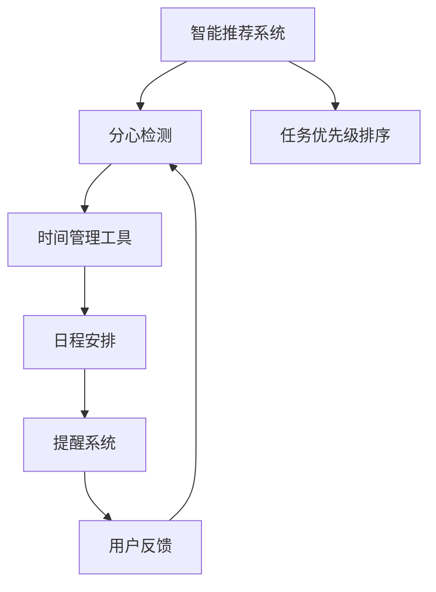

                 

# AI时代的注意力管理：保持专注和生产力

## 1. 背景介绍

在信息爆炸的今天，我们每天需要处理的信息量呈指数级增长。如何在纷繁复杂的信息海洋中保持专注，高效完成任务，成为每个现代人面临的巨大挑战。AI技术的发展，尤其是自然语言处理(NLP)和计算机视觉(CV)技术，为我们打开了智能辅助注意力管理的窗口。本文章将全面探讨AI时代注意力管理的原理与实践，帮助读者在智能工具的辅助下，提升个人和组织的生产力。

## 2. 核心概念与联系

### 2.1 核心概念概述

**注意力管理**（Attention Management）指的是通过技术手段，帮助用户更有效地分配和管理注意力，提升工作效率和专注力。其核心包括以下几个关键概念：

- **智能推荐系统**：利用机器学习算法分析用户行为，推荐相关内容，减少信息过载。
- **分心检测**：通过分析用户行为模式，识别出分心的迹象，提醒用户集中注意力。
- **任务优先级排序**：自动评估任务的重要性和紧急性，帮助用户合理安排工作顺序。
- **时间管理工具**：基于用户历史行为数据，提供个性化的日程安排和提醒。

这些核心概念通过一系列复杂的算法和架构，共同构成了一个智能的注意力管理系统，为用户提供个性化的支持，帮助其在繁杂的信息中保持高效和专注。

### 2.2 核心概念原理和架构的 Mermaid 流程图



## 3. 核心算法原理 & 具体操作步骤

### 3.1 算法原理概述

注意力管理系统的核心算法主要围绕以下几个方面展开：

- **用户行为分析**：通过分析用户的使用历史、点击记录、操作频率等数据，建模用户行为模式。
- **内容推荐**：利用协同过滤、矩阵分解、深度学习等方法，推荐用户可能感兴趣的内容。
- **分心检测**：通过模式识别技术，识别用户可能分心的行为模式，如频繁切换窗口、浏览与任务无关的网站等。
- **任务优先级排序**：基于任务的重要性和紧急性，设计优先级评估算法，帮助用户快速识别关键任务。
- **时间管理**：通过分析用户的工作习惯和效率，提供个性化的日程安排和提醒，优化时间使用。

### 3.2 算法步骤详解

#### 3.2.1 用户行为分析

用户行为分析是注意力管理系统的基础。通常包括以下步骤：

1. **数据收集**：通过日志、点击流、时间戳等数据收集用户的行为数据。
2. **数据清洗和预处理**：去除噪声和异常数据，标准化数据格式。
3. **特征提取**：提取重要的行为特征，如操作频率、访问时间、停留时长等。
4. **行为建模**：使用机器学习算法，如协同过滤、线性回归、深度学习等，建立用户行为模型。

#### 3.2.2 内容推荐

内容推荐是提升用户效率的关键。常用的推荐算法包括：

1. **协同过滤**：基于用户的历史行为数据，寻找相似用户，推荐他们喜欢的内容。
2. **矩阵分解**：将用户行为数据和内容特征表示为矩阵，通过矩阵分解算法，推荐相关内容。
3. **深度学习**：使用神经网络模型，如神经协同过滤、深度学习推荐系统等，提升推荐效果。

#### 3.2.3 分心检测

分心检测是通过模式识别技术，识别用户的注意力分散行为。通常包括以下步骤：

1. **行为模式识别**：通过分析用户的行为数据，识别出常见的分心行为模式。
2. **模型训练**：使用机器学习算法，训练分心检测模型。
3. **分心检测**：在用户操作时，实时检测是否存在分心行为，并进行提醒。

#### 3.2.4 任务优先级排序

任务优先级排序是帮助用户合理安排工作的重要工具。通常包括以下步骤：

1. **任务建模**：对任务进行建模，如将任务分为重要、紧急、两者兼具等类别。
2. **优先级评估**：使用算法评估每个任务的重要性和紧急性，计算其优先级。
3. **任务调度**：根据优先级，安排任务的执行顺序。

#### 3.2.5 时间管理

时间管理是通过分析用户的工作习惯，提供个性化的日程安排和提醒。通常包括以下步骤：

1. **行为分析**：分析用户的工作模式，如工作高峰期、高效时间段等。
2. **日程安排**：基于用户习惯和任务优先级，安排个性化日程。
3. **提醒系统**：根据日程安排，自动提醒用户完成任务。

### 3.3 算法优缺点

#### 3.3.1 算法优点

- **高效性**：通过自动化分析用户行为，推荐相关内容，减少信息过载。
- **个性化**：根据用户行为和偏好，提供个性化推荐和服务。
- **实时性**：实时检测用户行为，及时提醒用户集中注意力。

#### 3.3.2 算法缺点

- **数据隐私**：需要收集和分析用户行为数据，可能侵犯用户隐私。
- **模型偏差**：推荐和检测算法可能存在偏差，导致误导用户。
- **依赖技术**：需要强大的算法和计算资源，对技术要求较高。

### 3.4 算法应用领域

注意力管理系统广泛应用于以下领域：

- **智能办公**：在企业环境中，通过分心检测和任务优先级排序，提升员工的工作效率。
- **教育培训**：通过个性化推荐和学习进度分析，帮助学生高效学习。
- **在线娱乐**：通过推荐系统，提升用户的娱乐体验，减少分心。
- **健康管理**：通过分析用户的生活习惯，提供个性化的健康建议和提醒。

## 4. 数学模型和公式 & 详细讲解 & 举例说明

### 4.1 数学模型构建

注意力管理系统通常包含多个子系统，每个子系统的建模和算法设计都有其独特的数学模型。以下是几个典型的数学模型：

- **协同过滤模型**：使用用户行为矩阵和物品特征矩阵，通过矩阵分解计算推荐结果。
- **深度学习推荐模型**：使用神经网络模型，如神经协同过滤、双向LSTM等，预测用户对物品的评分。
- **分心检测模型**：通过时间序列分析等方法，识别用户的分心行为模式。

### 4.2 公式推导过程

#### 4.2.1 协同过滤模型

协同过滤模型的核心公式为：

$$
\hat{y}_{i,j} = \alpha \sum_{k=1}^{N} \frac{\alpha_i \alpha_j}{\sqrt{\alpha_i + \lambda} \sqrt{\alpha_j + \lambda}} \frac{x_{i,k}y_{k,j}}{\sqrt{x_{i,i}+y_{i,i}} \sqrt{x_{j,j}+y_{j,j}}}
$$

其中，$x_{i,j}$和$y_{i,j}$分别为用户$i$对物品$j$的评分和物品$j$的评分，$\alpha$为调节因子，$\lambda$为正则化参数。

#### 4.2.2 深度学习推荐模型

深度学习推荐模型通常使用双向LSTM等序列模型，通过训练得到用户行为序列和物品特征序列的表示，预测用户对物品的评分。

#### 4.2.3 分心检测模型

分心检测模型通常使用时间序列分析方法，如ARIMA、LSTM等，通过分析用户行为序列，识别出分心行为模式。

### 4.3 案例分析与讲解

#### 4.3.1 智能推荐系统

某智能办公平台使用协同过滤算法，为用户推荐相关文档。其推荐过程如下：

1. **数据收集**：收集用户的操作记录，如文件访问、编辑、删除等。
2. **数据清洗**：去除重复和异常数据，标准化数据格式。
3. **协同过滤**：基于用户的历史行为数据，推荐相似用户喜欢的文档。
4. **模型评估**：使用交叉验证等方法，评估推荐模型的效果。

#### 4.3.2 分心检测系统

某教育平台使用分心检测系统，帮助学生保持专注。其检测过程如下：

1. **行为模式识别**：分析学生的课程进度和作业完成情况，识别出分心行为。
2. **模型训练**：使用机器学习算法，训练分心检测模型。
3. **分心检测**：在学生学习时，实时检测是否存在分心行为，并进行提醒。

## 5. 项目实践：代码实例和详细解释说明

### 5.1 开发环境搭建

在项目实践前，需要先搭建好开发环境。以下是使用Python和TensorFlow搭建开发环境的详细步骤：

1. **安装Anaconda**：从官网下载并安装Anaconda，用于创建独立的Python环境。
2. **创建并激活虚拟环境**：
```bash
conda create -n tf-env python=3.8 
conda activate tf-env
```
3. **安装TensorFlow**：根据CUDA版本，从官网获取对应的安装命令。例如：
```bash
conda install tensorflow tensorflow-gpu
```
4. **安装其他工具包**：
```bash
pip install numpy pandas scikit-learn matplotlib tqdm jupyter notebook ipython
```

完成上述步骤后，即可在`tf-env`环境中开始项目开发。

### 5.2 源代码详细实现

以下是一个简单的分心检测系统代码实现，包含数据收集、行为模式识别、模型训练和分心检测等功能：

```python
import pandas as pd
import numpy as np
from sklearn.model_selection import train_test_split
from tensorflow.keras.models import Sequential
from tensorflow.keras.layers import LSTM, Dense, Dropout
from sklearn.preprocessing import MinMaxScaler

# 数据收集
df = pd.read_csv('user_behavior.csv')

# 数据清洗和预处理
df = df.drop_duplicates()
df = df.fillna(0)
df = df.drop('id', axis=1)

# 特征提取
features = df[['behavior', 'time']].values

# 分心行为标记
labels = df['distraction'].values

# 数据标准化
scaler = MinMaxScaler()
features = scaler.fit_transform(features)
labels = scaler.fit_transform(labels)

# 训练集和测试集划分
features_train, features_test, labels_train, labels_test = train_test_split(features, labels, test_size=0.2)

# 模型训练
model = Sequential()
model.add(LSTM(64, input_shape=(features_train.shape[1], features_train.shape[2])))
model.add(Dense(1, activation='sigmoid'))
model.compile(loss='binary_crossentropy', optimizer='adam', metrics=['accuracy'])
model.fit(features_train, labels_train, epochs=10, batch_size=32)

# 分心检测
features_new = scaler.transform([[1, 1.5], [1, 2.0], [1, 1.0]])
predictions = model.predict(features_new)
```

### 5.3 代码解读与分析

让我们再详细解读一下关键代码的实现细节：

**用户行为数据收集**：
- 从CSV文件中读取用户行为数据，包括行为类型和发生时间。
- 进行数据清洗，去除重复和异常数据。

**特征提取**：
- 提取重要的行为特征，如行为类型和发生时间。
- 使用标准化方法，将特征数据缩放到[0, 1]区间。

**分心行为标记**：
- 将分心行为标记为1，否则标记为0。

**模型训练**：
- 构建LSTM神经网络模型，使用二分类交叉熵损失函数和Adam优化器。
- 在训练集上进行模型训练，设置训练轮数和批次大小。

**分心检测**：
- 对新行为数据进行标准化处理。
- 使用训练好的模型进行预测，输出是否为分心行为。

## 6. 实际应用场景

### 6.1 智能办公

在智能办公环境中，注意力管理系统可以大幅提升员工的工作效率。例如：

- **分心检测**：通过分析员工的操作行为，识别出分心行为，提醒员工集中注意力。
- **任务优先级排序**：根据任务的重要性和紧急性，自动安排员工的工作顺序。
- **个性化推荐**：推荐员工可能感兴趣的文件和资料，减少信息过载。

### 6.2 在线教育

在线教育平台通过注意力管理系统，可以帮助学生更高效地学习。例如：

- **个性化推荐**：推荐学生可能感兴趣的课程和资料，提升学习效果。
- **分心检测**：检测学生的学习状态，及时提醒学生集中注意力。
- **时间管理**：根据学生的学习习惯，提供个性化的学习计划和提醒。

### 6.3 娱乐平台

在线娱乐平台使用注意力管理系统，提升用户的娱乐体验。例如：

- **个性化推荐**：推荐用户可能感兴趣的视频、音乐等娱乐内容。
- **分心检测**：检测用户的分心行为，提醒用户集中注意力。
- **时间管理**：帮助用户合理安排娱乐时间，避免过度沉迷。

### 6.4 健康管理

健康管理系统通过分析用户的生活习惯和行为模式，提供个性化的健康建议。例如：

- **分心检测**：检测用户的分心行为，提醒用户注意休息和锻炼。
- **个性化推荐**：推荐用户可能感兴趣的健康计划和活动。
- **时间管理**：帮助用户合理安排工作和休息时间，提升生活质量。

## 7. 工具和资源推荐

### 7.1 学习资源推荐

为了帮助开发者系统掌握注意力管理系统的理论基础和实践技巧，这里推荐一些优质的学习资源：

1. **《Deep Learning for Natural Language Processing》书籍**：由深度学习专家Ian Goodfellow撰写，全面介绍了深度学习在NLP中的应用，包括注意力管理系统的原理和算法。
2. **CS231n《深度学习计算机视觉》课程**：斯坦福大学开设的计算机视觉明星课程，涵盖深度学习在计算机视觉中的应用，包括分心检测等注意力管理技术。
3. **Kaggle竞赛平台**：全球最大的数据科学竞赛平台，提供大量的数据集和竞赛任务，帮助开发者实践注意力管理系统的算法和应用。

### 7.2 开发工具推荐

高效的开发离不开优秀的工具支持。以下是几款用于注意力管理系统开发的常用工具：

1. **TensorFlow**：由Google主导开发的开源深度学习框架，生产部署方便，适合大规模工程应用。
2. **PyTorch**：基于Python的开源深度学习框架，灵活动态的计算图，适合快速迭代研究。
3. **Keras**：简单易用的深度学习框架，支持TensorFlow和PyTorch等后端，适合初学者和研究人员使用。
4. **Scikit-learn**：简单易用的机器学习库，包含多种常用的算法和工具。
5. **Jupyter Notebook**：交互式的笔记本环境，方便开发者进行数据探索和算法验证。

### 7.3 相关论文推荐

注意力管理系统的研究源于学界的持续研究。以下是几篇奠基性的相关论文，推荐阅读：

1. **"Attention is All You Need"**：Transformer原论文，提出了自注意力机制，开启了注意力管理系统的预训练范式。
2. **"Deep Learning for Attention Management"**：深度学习专家Ian Goodfellow的论文，介绍了深度学习在注意力管理中的应用。
3. **"Sequence to Sequence Learning with Neural Networks"**：深度学习专家Ian Goodfellow的论文，介绍了序列到序列学习模型，用于生成推荐内容。

## 8. 总结：未来发展趋势与挑战

### 8.1 总结

本文对AI时代的注意力管理原理与实践进行了全面系统的介绍。首先阐述了注意力管理系统的背景和意义，明确了系统在提升工作效率和专注力方面的独特价值。其次，从原理到实践，详细讲解了系统的主要算法和操作步骤，给出了具体代码实现和分析。最后，介绍了系统的应用场景和未来发展趋势，给出了工具和资源的推荐，力求为读者提供全方位的技术指引。

通过本文的系统梳理，可以看到，AI时代的注意力管理系统在提升个人和组织生产力方面有着巨大的潜力。这些系统的构建和优化，将进一步推动智能辅助工具的发展，为人类社会带来更高效、更便捷的工作和生活方式。

### 8.2 未来发展趋势

展望未来，注意力管理系统将呈现以下几个发展趋势：

1. **智能化提升**：通过深度学习和大数据技术，系统将不断提升智能化水平，能够更准确地识别分心行为，提供个性化的推荐和服务。
2. **跨平台整合**：系统将整合不同设备和平台的数据，提供统一的注意力管理方案，提升用户体验。
3. **用户隐私保护**：随着数据隐私保护的重视，系统将引入更多隐私保护技术，确保用户数据的安全。
4. **实时性增强**：系统将实时分析用户行为，提供即时的注意力管理建议，提升用户体验。
5. **多模态融合**：系统将融合文本、语音、图像等多种模态的信息，提供更全面的注意力管理方案。

### 8.3 面临的挑战

尽管注意力管理系统已经取得了显著成效，但在迈向更加智能化、普适化应用的过程中，仍面临诸多挑战：

1. **数据隐私保护**：系统需要收集和分析大量用户数据，如何保护用户隐私，是系统的核心挑战之一。
2. **模型泛化能力**：系统需要适应不同用户和场景，如何提升模型的泛化能力，是一个重要的研究方向。
3. **实时计算资源**：系统需要实时分析用户行为，提供即时建议，这对计算资源和算法效率提出了更高的要求。
4. **用户接受度**：用户对系统的接受度和使用习惯，影响系统的推广和应用效果。
5. **算法鲁棒性**：系统需要应对复杂和动态的用户行为，如何提高算法的鲁棒性和稳定性，是另一个重要课题。

### 8.4 研究展望

面对注意力管理系统所面临的挑战，未来的研究需要在以下几个方面寻求新的突破：

1. **隐私保护技术**：开发更多隐私保护算法和技术，确保用户数据的安全和匿名性。
2. **多模态融合技术**：开发更高效的多模态融合算法，提高系统的智能化水平。
3. **实时计算优化**：优化计算图和算法，提升系统的实时性。
4. **用户接受度提升**：设计更友好、更易用的界面和交互方式，提升用户的使用体验。
5. **算法鲁棒性增强**：开发更具鲁棒性的算法，应对复杂和动态的用户行为。

这些研究方向的探索，将引领注意力管理系统的进一步发展，为构建智能、高效、隐私保护的工作和生活环境提供技术支持。相信随着学界和产业界的共同努力，这些挑战终将一一被克服，注意力管理系统必将在AI时代发挥更加重要的作用。

## 9. 附录：常见问题与解答

**Q1: 如何确保注意力管理系统的数据隐私保护？**

A: 数据隐私保护是系统开发和应用的关键问题之一。以下是一些常见的隐私保护技术：

1. **数据匿名化**：对用户数据进行匿名化处理，确保数据无法被追踪到个体。
2. **差分隐私**：在数据处理过程中加入噪声，保护用户隐私的同时，确保数据可用性。
3. **联邦学习**：通过分布式计算，在保护用户隐私的前提下，进行模型训练。

**Q2: 如何提升注意力管理系统的智能化水平？**

A: 提升系统的智能化水平，需要从以下几个方面进行改进：

1. **数据多样化**：收集更多样化的用户数据，如行为记录、社交网络数据等，提升模型的泛化能力。
2. **算法优化**：使用更先进的深度学习算法，如深度信念网络、自注意力机制等，提升模型的效果。
3. **多模态融合**：融合文本、语音、图像等多种模态的信息，提供更全面的注意力管理方案。

**Q3: 注意力管理系统在实际应用中如何应对数据资源限制？**

A: 在实际应用中，数据资源往往是有限的。以下是一些应对数据资源限制的策略：

1. **数据增强**：通过数据合成、数据生成等方法，扩充训练集。
2. **数据共享**：与其他系统或平台共享数据，扩大数据集。
3. **主动学习**：通过主动学习算法，选择最有价值的数据进行标注，提升模型效果。

**Q4: 注意力管理系统如何提升用户接受度？**

A: 提升用户接受度，需要从用户体验和交互设计等方面进行改进：

1. **界面友好**：设计简洁、易用的界面，提升用户的操作体验。
2. **个性化推荐**：根据用户的行为和偏好，提供个性化的推荐和服务。
3. **互动反馈**：提供用户反馈机制，根据用户反馈不断优化系统。

**Q5: 注意力管理系统在实际应用中如何提升实时性？**

A: 提升系统的实时性，需要从算法优化和硬件资源等方面进行改进：

1. **算法优化**：优化计算图和算法，减少计算量，提升推理速度。
2. **硬件资源优化**：使用高性能计算资源，如GPU、TPU等，加速模型计算。
3. **缓存技术**：使用缓存技术，减少数据读取和计算的时间。

---

作者：禅与计算机程序设计艺术 / Zen and the Art of Computer Programming

