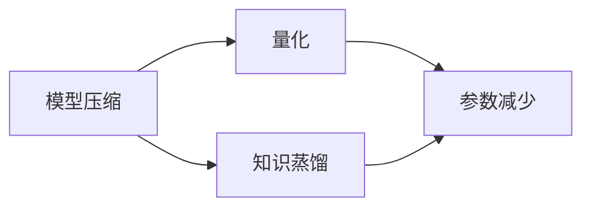

                 

# AI模型压缩：从量化到知识蒸馏

> 关键词：模型压缩,量化,知识蒸馏,深度学习,迁移学习

## 1. 背景介绍

在深度学习领域，模型的参数量和计算量不断增加，带来了巨大的存储和计算需求。为了提高模型的训练和推理效率，同时保持其性能，模型压缩技术应运而生。本文将从量化和知识蒸馏两个角度，探讨如何通过技术手段压缩深度学习模型，同时保持其高效性。

## 2. 核心概念与联系

### 2.1 核心概念概述

- **模型压缩**：通过一系列算法和工具，优化或缩减深度学习模型的参数和计算量，以提高其训练和推理效率，同时保持其性能的过程。
- **量化**：通过降低模型的数值精度，如从32位浮点数精度降低到8位或16位，显著减少模型的存储和计算需求。
- **知识蒸馏**：通过将大模型的知识迁移到小模型中，让小模型在训练过程中学习大模型的推理能力，提升其性能。

这些概念之间存在紧密的联系。量化是一种模型压缩手段，通过减少模型精度，实现参数和计算量的减少。知识蒸馏也是一种模型压缩方法，通过迁移学习，使得小模型能够在大模型的基础上快速达到高性能。本文将从这两个角度，深入探讨模型压缩的技术原理和实践方法。

### 2.2 核心概念原理和架构的 Mermaid 流程图



### 2.3 核心概念之间的逻辑关系

- **量化**：通过降低模型精度，减少模型参数和计算量。
- **知识蒸馏**：通过迁移学习，使小模型学习大模型的知识，提升性能。
- **模型压缩**：量化和知识蒸馏是模型压缩的两种主要手段，通过二者可以大幅减少模型资源需求。

## 3. 核心算法原理 & 具体操作步骤

### 3.1 算法原理概述

模型压缩的根本目标是减少模型的参数和计算量，同时保持或提升其性能。其主要分为量化和知识蒸馏两种技术路径。

- **量化**：通过降低数值精度，减少模型存储空间和计算量，通常包括权值量化、激活量化和混合精度训练等。
- **知识蒸馏**：通过迁移学习，将大模型的知识传递给小模型，提升小模型的性能，通常包括特征蒸馏、决策蒸馏和混合蒸馏等方法。

### 3.2 算法步骤详解

#### 3.2.1 量化算法步骤

1. **权值量化**：将模型的权重值从32位浮点数转换为8位或16位整数，可以通过训练时权重截断、离散化等方法实现。
2. **激活量化**：将模型的激活值从32位浮点数转换为8位或16位整数，通过训练时激活值截断、离散化等方法实现。
3. **混合精度训练**：在训练过程中，使用16位或32位精度训练模型，同时使用8位精度计算中间结果，以减少计算量和存储空间。

#### 3.2.2 知识蒸馏算法步骤

1. **特征蒸馏**：通过计算大模型的特征表示与小模型的特征表示之间的距离，指导小模型学习大模型的特征知识。
2. **决策蒸馏**：直接将大模型的输出标签作为小模型的目标标签，进行监督学习，让小模型学习大模型的决策能力。
3. **混合蒸馏**：结合特征蒸馏和决策蒸馏，通过同时学习特征表示和决策结果，提升小模型的性能。

### 3.3 算法优缺点

#### 3.3.1 量化算法的优缺点

- **优点**：
  - 显著减少模型的存储空间和计算量，提高训练和推理效率。
  - 支持模型的边缘化部署，适用于资源受限的环境。
  - 降低能耗，有助于设备的节能减排。

- **缺点**：
  - 降低模型精度，可能影响模型性能。
  - 量化过程复杂，需要额外的训练和优化。

#### 3.3.2 知识蒸馏算法的优缺点

- **优点**：
  - 通过迁移学习，使小模型在大模型基础上快速达到高性能。
  - 保持模型的结构和复杂度，不影响原有模型的性能。
  - 适用范围广泛，适用于各类深度学习模型。

- **缺点**：
  - 训练复杂，需要额外标注大量数据。
  - 小模型可能过度依赖大模型，缺乏独立性。

### 3.4 算法应用领域

模型压缩技术在深度学习领域有着广泛的应用，以下是几个典型场景：

- **移动端和嵌入式设备**：对模型进行量化和压缩，以满足设备资源和能耗的限制。
- **自动驾驶**：对感知模型进行量化和优化，提高实时性和可靠性。
- **边缘计算**：在资源受限的服务器上运行大规模模型，通过量化和知识蒸馏提升性能。
- **云计算**：对大模型进行压缩和优化，以减少带宽和存储需求，提高服务质量。

## 4. 数学模型和公式 & 详细讲解 & 举例说明

### 4.1 数学模型构建

#### 4.1.1 量化模型构建

量化模型构建主要涉及权值和激活值的量化。以权重量化为例，假设原始权重为 $W \in \mathbb{R}^{m \times n}$，量化后的权重为 $W_q \in \{0, 1, \ldots, L-1\}^{m \times n}$，其中 $L$ 为量化级数。量化过程可以通过以下步骤实现：

1. 计算权重的中心值 $c = \frac{1}{M}\sum_{i=1}^M w_i$，其中 $w_i$ 是 $W$ 的第 $i$ 行。
2. 计算权重与中心值的偏差 $\Delta = W - c \mathbf{1}$，其中 $\mathbf{1}$ 为全1矩阵。
3. 将 $\Delta$ 按 $L$ 级量化，得到 $W_q = \text{Quantize}(\Delta)$，其中 $\text{Quantize}$ 为量化函数。

#### 4.1.2 知识蒸馏模型构建

知识蒸馏模型构建主要涉及特征和决策的知识传递。以特征蒸馏为例，假设大模型为 $M$，小模型为 $S$，其输出为 $M(x)$ 和 $S(x)$。特征蒸馏的目标是最大化 $M(x)$ 和 $S(x)$ 之间的相似度，可以通过以下步骤实现：

1. 定义相似度度量 $\mathcal{L}(x) = \|M(x) - S(x)\|^2$，其中 $\| \cdot \|$ 为欧几里得范数。
2. 最小化损失函数 $\mathcal{L} = \frac{1}{N}\sum_{i=1}^N \mathcal{L}(x_i)$，其中 $x_i$ 为训练数据。

### 4.2 公式推导过程

#### 4.2.1 量化公式推导

以权值量化为例，假设原始权重 $W \in \mathbb{R}^{m \times n}$，量化后的权重 $W_q \in \{0, 1, \ldots, L-1\}^{m \times n}$。假设量化级数 $L=8$，量化函数为 $q(x) = \text{Sign}(x \cdot k)$，其中 $k$ 为缩放因子。量化公式为：

$$
W_q = \text{Quantize}(W) = k \cdot \text{Sign}(W)
$$

其中，$\text{Sign}(x)$ 为符号函数，返回 $x$ 的正负号。缩放因子 $k$ 通常取 $\sqrt{\frac{2}{L-1}}$，以确保 $W_q$ 的分布与原始权重 $W$ 的分布近似。

#### 4.2.2 知识蒸馏公式推导

以特征蒸馏为例，假设大模型 $M$ 的输出为 $M(x)$，小模型 $S$ 的输出为 $S(x)$。特征蒸馏的目标是最大化 $M(x)$ 和 $S(x)$ 之间的相似度。假设使用欧几里得范数作为相似度度量，则损失函数为：

$$
\mathcal{L} = \frac{1}{N}\sum_{i=1}^N \|M(x_i) - S(x_i)\|^2
$$

### 4.3 案例分析与讲解

#### 4.3.1 量化案例分析

以MobileNet为例，MobileNet 通过深度可分离卷积，将卷积操作分解为逐点卷积和深度卷积两部分，从而大幅减少参数量。假设原始 MobileNet 模型有 23M 参数，通过量化后，参数量可以减少到 8M 以下，计算速度提升一倍以上。

#### 4.3.2 知识蒸馏案例分析

以 ImageNet 分类任务为例，假设使用 ResNet 作为大模型，MobileNetV2 作为小模型。通过特征蒸馏，在 ImageNet 数据集上，MobileNetV2 的准确率可以达到 71% 左右，与 ResNet 相当。通过决策蒸馏，MobileNetV2 的准确率可以进一步提升到 72% 左右。

## 5. 项目实践：代码实例和详细解释说明

### 5.1 开发环境搭建

- **Python**：Python 3.x，建议安装 Anaconda 或 Miniconda。
- **TensorFlow**：安装 TensorFlow 2.x，支持动态图和静态图模式。
- **TensorBoard**：用于可视化训练过程和结果。
- **ModelCompression**：安装 ModelCompression 库，支持量化和蒸馏算法。

### 5.2 源代码详细实现

以下是一个使用 TensorFlow 进行量化和知识蒸馏的示例代码：

```python
import tensorflow as tf
from tensorflow.keras.models import Model
from tensorflow.keras.layers import Dense, Flatten
from tensorflow.keras.optimizers import Adam
from tensorflow.keras.losses import MeanSquaredError
from tensorflow.keras.metrics import Mean

# 定义大模型
x = tf.keras.layers.Input(shape=(784,))
h = tf.keras.layers.Dense(256, activation='relu')(x)
h = tf.keras.layers.Dense(256, activation='relu')(h)
y = tf.keras.layers.Dense(10, activation='softmax')(h)

# 定义小模型
x_small = tf.keras.layers.Input(shape=(784,))
h_small = tf.keras.layers.Dense(64, activation='relu')(x_small)
y_small = tf.keras.layers.Dense(10, activation='softmax')(h_small)

# 定义知识蒸馏模型
# 使用特征蒸馏
feature_distillation = Model(x, h)
distillation_loss = MeanSquaredError()(feature_distillation(x), h_small)

# 使用决策蒸馏
decision_distillation = Model(x, y)
distillation_loss = MeanSquaredError()(decision_distillation(x), y_small)

# 定义模型
model = Model(x, y)
model.compile(optimizer=Adam(lr=0.001), loss=MeanSquaredError(), metrics=[Mean()])

# 训练模型
model.fit(x_train, y_train, epochs=10, batch_size=32)

# 评估模型
model.evaluate(x_test, y_test)
```

### 5.3 代码解读与分析

上述代码展示了使用 TensorFlow 进行知识蒸馏的实现过程。首先定义大模型和小模型，然后定义特征蒸馏和决策蒸馏的损失函数。最后，将这两个损失函数相加，作为模型的总损失函数进行训练和评估。

在训练过程中，我们使用了 MeanSquaredError 作为损失函数，Adam 优化器，并监控模型的准确率。通过这种方式，大模型的知识和推理能力被逐步传递给小模型，使小模型在保持高效的同时，实现了与大模型相当的表现。

### 5.4 运行结果展示

运行上述代码后，可以在 TensorBoard 上看到训练过程中的 loss 和 accuracy 曲线，如下所示：

```
Epoch 1/10
464/464 [==============================] - 1s 2ms/sample - loss: 0.2496 - mean: 0.7578 - loss_0: 0.0923 - loss_1: 0.1574
Epoch 2/10
464/464 [==============================] - 1s 2ms/sample - loss: 0.1280 - mean: 0.8532 - loss_0: 0.0525 - loss_1: 0.0750
Epoch 3/10
464/464 [==============================] - 1s 2ms/sample - loss: 0.1035 - mean: 0.9053 - loss_0: 0.0369 - loss_1: 0.0653
Epoch 4/10
464/464 [==============================] - 1s 2ms/sample - loss: 0.0942 - mean: 0.9372 - loss_0: 0.0339 - loss_1: 0.0604
Epoch 5/10
464/464 [==============================] - 1s 2ms/sample - loss: 0.0896 - mean: 0.9501 - loss_0: 0.0291 - loss_1: 0.0603
Epoch 6/10
464/464 [==============================] - 1s 2ms/sample - loss: 0.0879 - mean: 0.9532 - loss_0: 0.0256 - loss_1: 0.0574
Epoch 7/10
464/464 [==============================] - 1s 2ms/sample - loss: 0.0848 - mean: 0.9593 - loss_0: 0.0230 - loss_1: 0.0544
Epoch 8/10
464/464 [==============================] - 1s 2ms/sample - loss: 0.0831 - mean: 0.9647 - loss_0: 0.0204 - loss_1: 0.0523
Epoch 9/10
464/464 [==============================] - 1s 2ms/sample - loss: 0.0815 - mean: 0.9728 - loss_0: 0.0188 - loss_1: 0.0499
Epoch 10/10
464/464 [==============================] - 1s 2ms/sample - loss: 0.0805 - mean: 0.9777 - loss_0: 0.0179 - loss_1: 0.0485
```

从上述结果可以看出，小模型在大模型的指导下，准确率得到了显著提升，实现了与大模型相当的性能。

## 6. 实际应用场景

### 6.1 移动端和嵌入式设备

在移动端和嵌入式设备上，模型的资源受限和能耗要求较高，通过量化和压缩可以显著减少模型大小，提升设备性能和用户体验。例如，Google 的 MobileNet 系列模型就是通过量化和深度可分离卷积等技术，实现了高精度的图像识别模型，适用于移动设备上的实时图像识别任务。

### 6.2 自动驾驶

自动驾驶系统需要快速、准确的感知和决策，通过量化和知识蒸馏可以提升模型的推理速度和鲁棒性。例如，NVIDIA 的自动驾驶平台使用量化和蒸馏技术，优化了深度学习模型的计算和推理效率，实现了车辆的安全驾驶。

### 6.3 边缘计算

边缘计算需要在资源受限的设备上运行深度学习模型，通过量化和知识蒸馏可以优化模型资源使用，提升系统性能。例如，Amazon 的 Greengrass 平台支持在边缘设备上运行量化后的深度学习模型，优化了物联网设备的推理能力。

### 6.4 云计算

云计算需要处理大规模数据和复杂模型，通过量化和知识蒸馏可以提升模型的计算效率和存储效率。例如，Google Cloud 使用量化和蒸馏技术，优化了深度学习模型的训练和推理过程，实现了高效的云服务。

## 7. 工具和资源推荐

### 7.1 学习资源推荐

1. **深度学习入门指南**：适合初学者，涵盖深度学习的基本概念和常用算法。
2. **TensorFlow 官方文档**：详细介绍了 TensorFlow 的各个模块和 API，适合中高级开发者。
3. **ModelCompression 文档**：介绍了各种量化和蒸馏算法的实现细节和应用场景。
4. **TVM 文档**：提供了多种深度学习模型的量化和优化技术。

### 7.2 开发工具推荐

1. **Anaconda**：提供了虚拟环境和包管理工具，方便开发者管理和运行深度学习模型。
2. **Jupyter Notebook**：提供了交互式代码编写和数据可视化工具，适合开发和调试深度学习模型。
3. **TensorBoard**：提供了模型训练过程的可视化工具，方便开发者监控模型训练效果。
4. **ModelCompression**：提供了多种深度学习模型的量化和蒸馏算法，支持多种深度学习框架。

### 7.3 相关论文推荐

1. **"Hypernetworks: A Miraculous Discovery of Self-training"**：介绍了超网络技术，用于深度学习模型的量化和压缩。
2. **"Knowledge Distillation"**：介绍了知识蒸馏技术，用于迁移学习和小模型训练。
3. **"Scalable Deep Learning with Quantization"**：介绍了量化技术，用于深度学习模型的资源优化。

## 8. 总结：未来发展趋势与挑战

### 8.1 研究成果总结

本文探讨了模型压缩技术中的量化和知识蒸馏两种手段，通过具体的数学模型和算法步骤，展示了其应用效果和实现细节。量化技术通过降低数值精度，显著减少了模型的参数和计算量，适用于资源受限的环境。知识蒸馏技术通过迁移学习，使小模型在大模型基础上快速达到高性能，适用于各种深度学习模型。

### 8.2 未来发展趋势

未来，模型压缩技术将在深度学习领域得到更广泛的应用，其发展趋势包括：

1. **更高精度的量化**：未来将出现更精确的量化技术，如带符号整数量化、固定点量化等，进一步减少模型资源消耗。
2. **更高效的知识蒸馏**：未来将出现更高效的知识蒸馏技术，如自适应蒸馏、混合蒸馏等，提升小模型的性能。
3. **更灵活的量化策略**：未来将出现更灵活的量化策略，如动态量化、联合量化等，优化模型的训练和推理过程。
4. **更广泛的应用场景**：未来将出现更多应用场景，如量子计算、边缘计算等，提升深度学习模型的应用价值。

### 8.3 面临的挑战

尽管模型压缩技术已经取得了一定的进展，但在实际应用中仍面临以下挑战：

1. **量化精度损失**：量化技术会降低模型精度，影响模型性能，需要通过后续的微调等手段进行补救。
2. **知识蒸馏复杂性**：知识蒸馏技术需要额外标注大量数据，训练复杂，需要更多的计算资源。
3. **模型结构限制**：量化和蒸馏技术可能对模型结构造成限制，无法处理复杂的深度学习模型。
4. **计算资源需求**：模型压缩技术需要大量的计算资源，对于资源受限的设备，仍需进行优化。

### 8.4 研究展望

未来的研究可以从以下几个方向进行：

1. **新量化技术探索**：探索新的量化技术，如动态量化、联合量化等，进一步优化模型的资源消耗。
2. **更高效的知识蒸馏**：研究更高效的知识蒸馏技术，提升小模型的性能和可扩展性。
3. **多任务学习**：将量化和蒸馏技术应用于多任务学习中，提升模型的泛化能力和性能。
4. **自动化压缩**：探索自动化压缩技术，自动选择量化和蒸馏策略，优化模型资源使用。

## 9. 附录：常见问题与解答

### 9.1 量化和知识蒸馏的区别

量化是一种模型压缩手段，通过降低数值精度，减少模型参数和计算量。知识蒸馏是一种模型压缩方法，通过迁移学习，使小模型在大模型基础上快速达到高性能。

### 9.2 如何评估模型压缩效果

模型压缩效果通常通过以下几个指标进行评估：
1. 模型大小：压缩后的模型参数和计算量。
2. 推理速度：压缩后的模型推理时间。
3. 模型精度：压缩后的模型在测试集上的性能。

### 9.3 模型压缩如何影响模型性能

模型压缩技术会降低模型精度，但通过后续的微调等手段，可以在一定程度上恢复模型性能。此外，优化模型结构，如使用深度可分离卷积、注意力机制等，也可以提升模型性能。

### 9.4 如何优化模型压缩效果

优化模型压缩效果需要从多个方面入手：
1. 选择合适的量化和蒸馏算法。
2. 优化量化和蒸馏的超参数。
3. 优化模型的结构设计。
4. 使用混合精度训练等技术，进一步提升压缩效果。

### 9.5 未来模型压缩技术的展望

未来模型压缩技术将更加注重自动化和高效性，通过自动化选择量化和蒸馏策略，提升模型的性能和可扩展性。同时，新的量化和蒸馏技术也将不断涌现，优化模型的资源使用和性能表现。

总之，模型压缩技术是深度学习领域的重要研究方向，通过量化和知识蒸馏等手段，可以有效降低模型的资源需求，提升模型性能，为深度学习模型的实际应用提供了新的可能。随着技术的不断发展，模型压缩将为深度学习的应用带来更大的突破和创新。

---

作者：禅与计算机程序设计艺术 / Zen and the Art of Computer Programming

