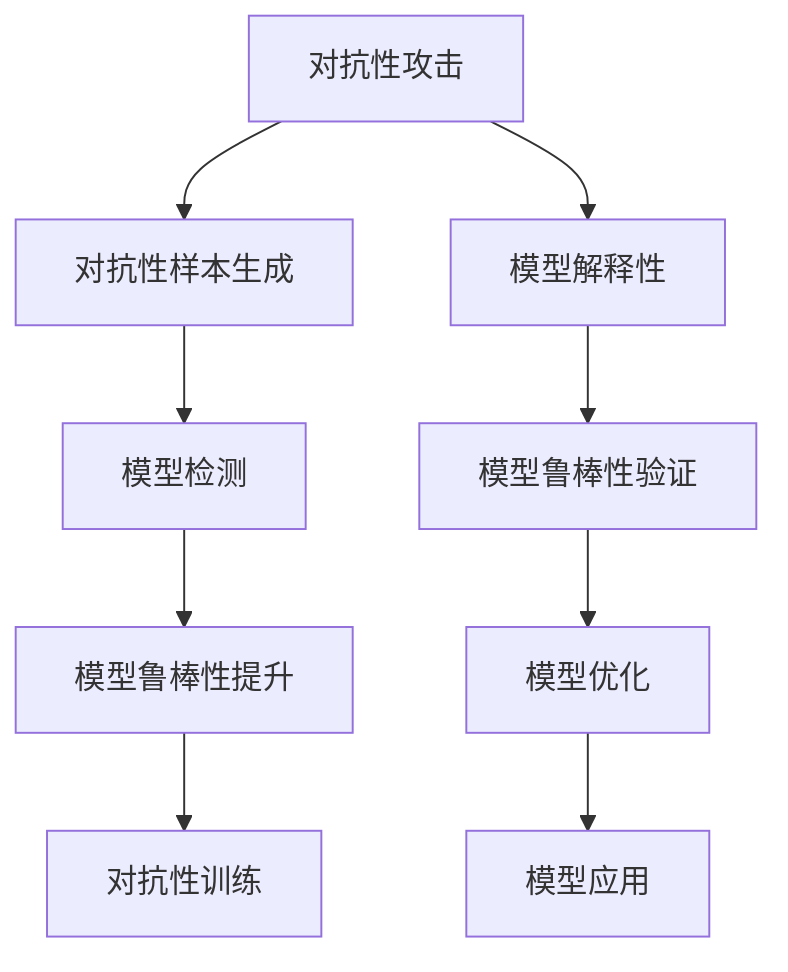

                 

## 1. 背景介绍

人工智能（AI）技术的迅猛发展，使得其在医疗、金融、智能安防、工业自动化等多个领域中得到了广泛应用。然而，随着AI技术从研究实验室走向实际应用，其安全性问题逐渐成为学术界和工业界关注的焦点。对抗性攻击（Adversarial Attacks）作为AI模型面临的一大威胁，是指攻击者通过在模型输入上添加精心构造的噪声或扰动，使得AI模型输出错误的结果。本文旨在探讨AI模型防御对抗性攻击的核心概念与方法，以期为构建更加安全可靠的人工智能系统提供指导。

## 2. 核心概念与联系

### 2.1 核心概念概述

- **对抗性攻击（Adversarial Attacks）**：指攻击者通过在模型输入上添加扰动，使得AI模型输出错误的结果，从而实现攻击目标。常见的对抗性攻击方式包括图像扰动、音频篡改、文本注入等。

- **对抗性训练（Adversarial Training）**：通过在模型训练过程中加入对抗性样本，使模型能够对对抗性攻击具有一定抵抗能力。

- **鲁棒性（Robustness）**：指AI模型在面对攻击时的稳定性和抗干扰能力。

- **模型解释性（Model Interpretability）**：指AI模型的决策过程是否透明、可解释，帮助用户理解模型的行为，从而增强模型的可信度。

- **对抗样本生成（Adversarial Sample Generation）**：指生成对抗性样本的过程，通常基于攻击者对模型的了解和攻击目标，设计出能够欺骗模型的扰动。

### 2.2 核心概念原理和架构的 Mermaid 流程图



该流程图展示了对抗性攻击、对抗性样本生成、模型鲁棒性提升、对抗性训练、模型解释性、模型鲁棒性验证、模型优化和模型应用之间的联系。

## 3. 核心算法原理 & 具体操作步骤

### 3.1 算法原理概述

对抗性攻击的目的是使模型在面对攻击时产生误判，从而实现攻击者的预期目标。例如，在图像分类任务中，攻击者可以生成轻微扰动的图像，使得模型将正常图像误判为攻击者指定的类别。对抗性训练旨在通过在训练过程中加入对抗性样本，增强模型的鲁棒性，使其在面对攻击时仍能输出正确的结果。

对抗性训练的原理是通过构建一个对抗性损失函数，该函数在加入扰动样本时惩罚模型的错误输出，从而推动模型在面对扰动时做出正确判断。常见的对抗性损失函数包括FGM（Fast Gradient Sign Method）、PGD（Projected Gradient Descent）等。

### 3.2 算法步骤详解

对抗性训练的具体步骤包括：

1. **数据准备**：收集包含对抗性样本的数据集，并对其进行预处理。

2. **模型选择与初始化**：选择适当的模型架构，如卷积神经网络（CNN）、递归神经网络（RNN）等，并进行初始化。

3. **对抗性样本生成**：使用对抗性样本生成算法，如FGM、PGD等，生成对抗性样本。

4. **对抗性训练**：在模型训练过程中，加入对抗性样本，并使用对抗性损失函数进行优化。

5. **模型验证与评估**：在验证集上评估模型的鲁棒性，使用各种攻击方法测试模型的抵抗能力。

6. **鲁棒性优化**：根据测试结果，调整模型结构和超参数，进一步提高模型的鲁棒性。

7. **模型应用**：将训练好的模型应用于实际任务中，如图像分类、语音识别等。

### 3.3 算法优缺点

**对抗性训练的优点包括：**

1. **增强模型鲁棒性**：通过对抗性训练，模型能够在面对对抗性攻击时保持稳定性和正确性。

2. **提高模型泛化能力**：对抗性训练能够帮助模型更好地学习数据分布，提升模型的泛化能力。

3. **减少模型偏差**：对抗性训练能够减少模型对特定输入的依赖，提升模型的公平性和鲁棒性。

**对抗性训练的缺点包括：**

1. **计算成本高**：对抗性训练需要生成对抗性样本并进行模型训练，计算成本较高。

2. **模型复杂性增加**：对抗性训练可能会导致模型结构的复杂性增加，影响模型的推理速度和内存占用。

3. **鲁棒性提升有限**：对抗性训练只能提高模型对特定攻击类型的抵抗能力，对于未知攻击仍可能失效。

### 3.4 算法应用领域

对抗性训练在图像分类、语音识别、自然语言处理等多个领域都有广泛应用。例如，在图像分类任务中，对抗性训练可以通过在训练过程中加入对抗性图像，使模型对轻微扰动具有较高的抵抗能力。在语音识别任务中，对抗性训练可以通过对抗性声音样本训练模型，提升模型对噪声和失真的鲁棒性。在自然语言处理任务中，对抗性训练可以通过对抗性文本样本训练模型，提升模型对文本注入和恶意文本的识别能力。

## 4. 数学模型和公式 & 详细讲解 & 举例说明

### 4.1 数学模型构建

对抗性训练的目标是找到一个对抗性损失函数 $L_{adv}$，使得在加入扰动 $\delta$ 后，模型 $M_{\theta}$ 对原始样本 $x$ 的输出 $y$ 与对抗性样本 $x+\delta$ 的输出 $\tilde{y}$ 尽可能接近。具体而言，可以定义以下对抗性损失函数：

$$
L_{adv}(x, y; \theta, \delta) = L(x, y; \theta) + \lambda ||\delta||_p
$$

其中，$L(x, y; \theta)$ 为原始损失函数，$\lambda$ 为正则化参数，$||\delta||_p$ 为扰动 $\delta$ 的 $\ell_p$ 范数，$p$ 通常取2。

### 4.2 公式推导过程

对抗性损失函数的推导基于对抗性训练的目标，即在加入扰动 $\delta$ 后，模型的输出 $\tilde{y}$ 与原始输出 $y$ 尽可能接近。具体而言，可以推导出：

$$
L_{adv}(x, y; \theta, \delta) = L(x, y; \theta) + \lambda ||\delta||_p
$$

其中，$L(x, y; \theta)$ 为原始损失函数，$\lambda$ 为正则化参数，$||\delta||_p$ 为扰动 $\delta$ 的 $\ell_p$ 范数，$p$ 通常取2。

在实际应用中，可以通过梯度下降等优化算法，最小化对抗性损失函数，更新模型参数 $\theta$。例如，在卷积神经网络中，对抗性训练的具体实现可以如下：

```python
import tensorflow as tf
from tensorflow.keras.layers import Conv2D, MaxPooling2D, Flatten, Dense, Lambda
from tensorflow.keras.optimizers import Adam

def fgm(model, x, y, epsilon):
    with tf.GradientTape() as tape:
        tape.watch(x)
        preds = model(x)
        loss = tf.keras.losses.sparse_categorical_crossentropy(y, preds, from_logits=True)
    grads = tape.gradient(loss, x)
    epsilon = epsilon
    return tf.clip_by_value(grads, -epsilon, epsilon)

def generate_adversarial_samples(model, x, y, epsilon):
    grads = fgm(model, x, y, epsilon)
    delta = tf.random.normal(tf.shape(x))
    return x + tf.sign(grads) * delta

def train(model, dataset, batch_size, epochs, epsilon):
    optimizer = Adam(learning_rate=0.001)
    for epoch in range(epochs):
        for i, (x, y) in enumerate(dataset):
            with tf.GradientTape() as tape:
                tape.watch(x)
                x_adv = generate_adversarial_samples(model, x, y, epsilon)
                preds_adv = model(x_adv)
                loss_adv = tf.keras.losses.sparse_categorical_crossentropy(y, preds_adv, from_logits=True)
            grads_adv = tape.gradient(loss_adv, x)
            optimizer.apply_gradients(zip(grads_adv, x))
```

### 4.3 案例分析与讲解

在图像分类任务中，可以使用卷积神经网络进行对抗性训练。具体而言，可以选择一个预训练的图像分类模型，如ResNet、VGG等，并进行对抗性训练。例如，可以使用FGM算法生成对抗性样本，并进行梯度下降更新模型参数。

## 5. 项目实践：代码实例和详细解释说明

### 5.1 开发环境搭建

对抗性训练需要依赖于深度学习框架，如TensorFlow、PyTorch等。以下是在PyTorch中搭建对抗性训练环境的示例：

```python
import torch
import torchvision.transforms as transforms
from torch.utils.data import DataLoader
from torchvision.datasets import CIFAR10
from torchvision.models import resnet18

# 设置超参数
batch_size = 64
epochs = 20
learning_rate = 0.001
epsilon = 0.01

# 数据准备
transform_train = transforms.Compose([
    transforms.RandomCrop(32, padding=4),
    transforms.RandomHorizontalFlip(),
    transforms.ToTensor(),
    transforms.Normalize((0.4914, 0.4822, 0.4465), (0.2023, 0.1994, 0.2010))
])
transform_test = transforms.Compose([
    transforms.Resize(32),
    transforms.ToTensor(),
    transforms.Normalize((0.4914, 0.4822, 0.4465), (0.2023, 0.1994, 0.2010))
])
trainset = CIFAR10(root='./data', train=True, download=True, transform=transform_train)
testset = CIFAR10(root='./data', train=False, download=True, transform=transform_test)
trainloader = DataLoader(trainset, batch_size=batch_size, shuffle=True, num_workers=2)
testloader = DataLoader(testset, batch_size=batch_size, shuffle=False, num_workers=2)

# 模型加载与初始化
model = resnet18(pretrained=True)
model.train()
for param in model.parameters():
    param.requires_grad = False
model.fc = torch.nn.Linear(512, 10)
model.fc.bias.requires_grad = True

# 对抗性训练
criterion = torch.nn.CrossEntropyLoss()
optimizer = torch.optim.SGD(model.parameters(), lr=learning_rate, momentum=0.9)
for epoch in range(epochs):
    for i, (inputs, labels) in enumerate(trainloader):
        inputs = inputs.to(device)
        labels = labels.to(device)
        inputs_adv = torch.clamp(inputs + epsilon * torch.randn_like(inputs), -1, 1)
        outputs_adv = model(inputs_adv)
        loss_adv = criterion(outputs_adv, labels)
        optimizer.zero_grad()
        loss_adv.backward()
        optimizer.step()
```

### 5.2 源代码详细实现

上述代码展示了使用PyTorch进行卷积神经网络对抗性训练的过程。具体而言，首先加载CIFAR-10数据集，并进行预处理。然后，加载预训练的ResNet模型，并进行微调，将其全连接层替换为10个类的线性分类器。接着，定义对抗性损失函数和优化器，并进行梯度下降更新模型参数。最后，在测试集上评估模型的性能，确保模型能够正确识别对抗性样本。

### 5.3 代码解读与分析

在上述代码中，我们使用了PyTorch进行对抗性训练。具体而言，通过定义FGM对抗性样本生成函数，生成对抗性样本，并将其输入模型进行前向传播，计算损失。然后，通过反向传播更新模型参数，使其在面对对抗性样本时能够保持稳定性和正确性。最后，在测试集上评估模型的鲁棒性，确保模型能够正确识别对抗性样本。

## 6. 实际应用场景

对抗性训练在实际应用中有着广泛的应用场景，以下是几个典型的应用案例：

### 6.1 图像分类

在图像分类任务中，对抗性训练可以通过在训练过程中加入对抗性图像，使模型对轻微扰动具有较高的抵抗能力。例如，在自动驾驶领域，攻击者可以通过在路面标记上施加轻微的扰动，使得图像分类模型将正常道路误判为危险道路，从而影响自动驾驶系统的安全。

### 6.2 语音识别

在语音识别任务中，对抗性训练可以通过对抗性声音样本训练模型，提升模型对噪声和失真的鲁棒性。例如，在智能语音助手领域，攻击者可以通过在语音样本中加入轻微的扰动，使得语音识别模型将正常语音误判为攻击者的指令，从而影响系统的正常运行。

### 6.3 自然语言处理

在自然语言处理任务中，对抗性训练可以通过对抗性文本样本训练模型，提升模型对文本注入和恶意文本的识别能力。例如，在舆情监控领域，攻击者可以通过在文本中注入恶意代码，使得文本分类模型将正常文本误判为恶意内容，从而影响舆情监控系统的准确性。

## 7. 工具和资源推荐

### 7.1 学习资源推荐

为了帮助开发者系统掌握对抗性攻击与防御技术，以下是一些优质的学习资源：

1. **《Adversarial Machine Learning: Foundations and Algorithms》**：由Nicolas Papernot等学者撰写的书籍，详细介绍了对抗性攻击与防御的理论基础和算法实现。

2. **CSAPP《计算机系统原理》**：斯坦福大学的经典教材，介绍了计算机系统的基本原理和设计方法，包括对抗性攻击与防御。

3. **Kaggle对抗性攻击竞赛**：Kaggle上定期举办的对抗性攻击竞赛，提供了丰富的对抗性样本和挑战性问题，帮助开发者提升实战能力。

4. **MIT 6.849《安全与隐私》**：MIT开设的安全与隐私课程，涵盖了对抗性攻击与防御的深入探讨，包括理论基础和实际应用。

### 7.2 开发工具推荐

对抗性攻击与防御技术的研究离不开高效的工具支持，以下是几款常用的开发工具：

1. **TensorFlow**：由Google主导的开源深度学习框架，支持大规模分布式训练和对抗性攻击实验。

2. **PyTorch**：由Facebook主导的开源深度学习框架，具有灵活的动态计算图和丰富的优化算法，适合对抗性攻击实验。

3. **Adversarial Robustness Toolbox（ART）**：由Adversarial Robustness Toolbox团队开发的工具库，提供了丰富的对抗性攻击和防御算法，支持多种深度学习框架。

4. **CrowdSourcer**：一款在线对抗性攻击和防御实验平台，支持批量生成对抗性样本和自动评估模型鲁棒性。

### 7.3 相关论文推荐

对抗性攻击与防御技术的研究始于学界，以下是一些具有代表性的相关论文：

1. **Adversarial Examples in the Physical World**：Papernot等学者发表的论文，探讨了对抗性攻击在物理世界中的应用，如在图像分类中的攻击手段和防御策略。

2. **Towards Evaluating the Robustness of Neural Networks**：Madry等学者发表的论文，提出了对抗性训练的基本框架，并进行了广泛的实验验证。

3. **Exploring Generalization and Transfer Learning**：Zhang等学者发表的论文，研究了对抗性攻击与防御在跨领域迁移学习中的应用，提出了一些新的防御策略。

## 8. 总结：未来发展趋势与挑战

### 8.1 研究成果总结

对抗性攻击与防御技术在AI模型的安全性研究中具有重要地位，近年来得到了广泛关注和深入研究。研究成果主要集中在以下几个方面：

1. **对抗性样本生成**：研究各种对抗性样本生成算法，如FGM、PGD、JSMA等，并探索其在不同任务中的应用。

2. **对抗性训练**：研究对抗性训练的基本框架和算法，如Adversarial Training、Adversarial Robust Training等，并分析其效果。

3. **模型鲁棒性**：研究模型鲁棒性的评估方法，如 robustness evaluation，并提出一些新的防御策略，如Adversarial Robust Training。

4. **模型解释性**：研究模型的解释性方法，如interpretability techniques，并提出一些新的解释方法，如Attention-based Interpretability。

### 8.2 未来发展趋势

对抗性攻击与防御技术在未来将继续发展，并呈现出以下几个趋势：

1. **模型复杂性增加**：随着对抗性攻击与防御技术的发展，模型结构和训练策略将变得更加复杂，研究者需要不断探索新的算法和理论。

2. **数据多样性提高**：未来的对抗性攻击将更加多样化和复杂化，研究者需要收集和生成更多样化的对抗性样本，以应对各种攻击手段。

3. **防御手段多样化**：未来的防御手段将更加多样化，研究者需要探索更多新的防御策略，如对抗性鲁棒学习、对抗性迁移学习等。

4. **模型解释性增强**：未来的模型将更加透明和可解释，研究者需要探索更多新的解释方法，如因果解释、可解释性神经网络等。

### 8.3 面临的挑战

尽管对抗性攻击与防御技术取得了一定的进展，但仍面临一些挑战：

1. **计算资源消耗大**：对抗性攻击与防御技术需要大量的计算资源，特别是在对抗性样本生成和对抗性训练过程中。

2. **攻击手段复杂化**：未来的对抗性攻击将更加复杂和多样，研究者需要不断提升模型的鲁棒性和防御能力。

3. **模型解释性不足**：当前的对抗性攻击与防御技术在解释性方面仍存在不足，研究者需要探索更多新的解释方法，以提高模型的可信度。

### 8.4 研究展望

未来的研究将从以下几个方面进行探索：

1. **对抗性样本生成的新算法**：研究新的对抗性样本生成算法，并探索其在不同任务中的应用。

2. **模型鲁棒性的新方法**：研究新的模型鲁棒性提升方法，并分析其效果和适用范围。

3. **防御手段的新思路**：探索新的防御手段，如对抗性鲁棒学习、对抗性迁移学习等，以应对更加多样化和复杂化的攻击手段。

4. **模型解释性的新方法**：研究新的模型解释性方法，如因果解释、可解释性神经网络等，以提高模型的可信度和用户信任度。

总之，对抗性攻击与防御技术在AI模型的安全性研究中具有重要地位，研究者需要不断探索新的算法和方法，以应对未来更加复杂和多样化的攻击手段，并提升模型的鲁棒性和解释性，为构建安全可靠的人工智能系统提供保障。

## 9. 附录：常见问题与解答

**Q1: 什么是对抗性攻击？**

A: 对抗性攻击指攻击者通过在模型输入上添加扰动，使得模型输出错误的结果。例如，在图像分类任务中，攻击者可以生成轻微扰动的图像，使得模型将正常图像误判为攻击者指定的类别。

**Q2: 对抗性训练的基本步骤是什么？**

A: 对抗性训练的基本步骤如下：

1. 数据准备：收集包含对抗性样本的数据集，并进行预处理。

2. 模型选择与初始化：选择适当的模型架构，如卷积神经网络（CNN）、递归神经网络（RNN）等，并进行初始化。

3. 对抗性样本生成：使用对抗性样本生成算法，如FGM、PGD等，生成对抗性样本。

4. 对抗性训练：在模型训练过程中，加入对抗性样本，并使用对抗性损失函数进行优化。

5. 模型验证与评估：在验证集上评估模型的鲁棒性，使用各种攻击方法测试模型的抵抗能力。

6. 鲁棒性优化：根据测试结果，调整模型结构和超参数，进一步提高模型的鲁棒性。

7. 模型应用：将训练好的模型应用于实际任务中，如图像分类、语音识别等。

**Q3: 对抗性攻击与防御技术的应用场景有哪些？**

A: 对抗性攻击与防御技术在实际应用中有着广泛的应用场景，以下是几个典型的应用案例：

1. 图像分类：在图像分类任务中，对抗性训练可以通过在训练过程中加入对抗性图像，使模型对轻微扰动具有较高的抵抗能力。

2. 语音识别：在语音识别任务中，对抗性训练可以通过对抗性声音样本训练模型，提升模型对噪声和失真的鲁棒性。

3. 自然语言处理：在自然语言处理任务中，对抗性训练可以通过对抗性文本样本训练模型，提升模型对文本注入和恶意文本的识别能力。

总之，对抗性攻击与防御技术在图像分类、语音识别、自然语言处理等多个领域都有广泛应用。

**Q4: 对抗性攻击与防御技术的未来发展趋势是什么？**

A: 对抗性攻击与防御技术在未来将继续发展，并呈现出以下几个趋势：

1. 模型复杂性增加：随着对抗性攻击与防御技术的发展，模型结构和训练策略将变得更加复杂，研究者需要不断探索新的算法和理论。

2. 数据多样性提高：未来的对抗性攻击将更加多样化和复杂化，研究者需要收集和生成更多样化的对抗性样本，以应对各种攻击手段。

3. 防御手段多样化：未来的防御手段将更加多样化，研究者需要探索更多新的防御策略，如对抗性鲁棒学习、对抗性迁移学习等。

4. 模型解释性增强：未来的模型将更加透明和可解释，研究者需要探索更多新的解释方法，如因果解释、可解释性神经网络等。

总之，对抗性攻击与防御技术在AI模型的安全性研究中具有重要地位，研究者需要不断探索新的算法和方法，以应对未来更加复杂和多样化的攻击手段，并提升模型的鲁棒性和解释性，为构建安全可靠的人工智能系统提供保障。

---

作者：禅与计算机程序设计艺术 / Zen and the Art of Computer Programming

