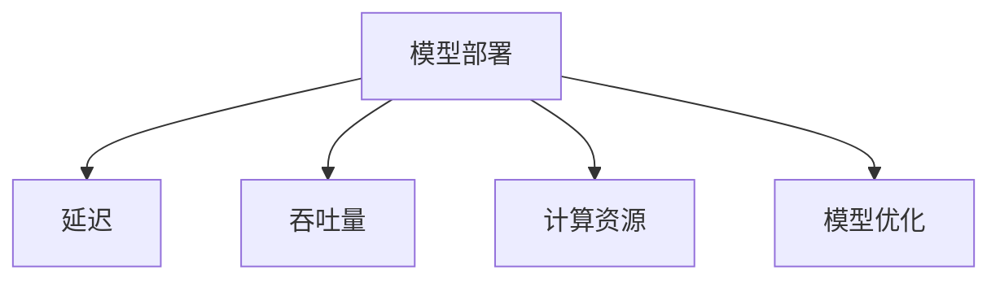

                 

# AI模型部署优化：延迟vs吞吐量权衡

在人工智能应用中，模型的部署是一个至关重要的环节。模型的性能不仅取决于其准确性和有效性，还受制于部署平台上的资源利用效率和用户体验。本文将深入探讨AI模型在部署时面临的延迟和吞吐量之间的权衡问题，帮助开发者在设计和优化AI模型时做出更为明智的决策。

## 1. 背景介绍

### 1.1 问题由来
在人工智能时代，高性能模型如深度神经网络（DNNs）被广泛应用于计算机视觉、自然语言处理、语音识别等多个领域。然而，这些模型往往具有极高的计算复杂度，需要在硬件加速器（如GPU、TPU等）上进行高效部署，以实现实时响应。但是，部署速度（即延迟）和处理能力（即吞吐量）之间常常存在权衡，需要根据具体应用场景进行策略性取舍。

### 1.2 问题核心关键点
模型部署的核心问题在于如何平衡模型的延迟和吞吐量，以实现最优的用户体验和资源利用率。具体来说，包括以下几个关键点：

1. **延迟**：模型响应时间，直接影响到用户体验。
2. **吞吐量**：模型每秒处理的请求数，影响资源利用效率。
3. **计算资源**：部署所需的硬件资源（如内存、GPU等）。
4. **模型规模**：模型的参数量和计算复杂度。
5. **优化策略**：剪枝、量化、模型压缩等技术手段，以提高模型效率。

## 2. 核心概念与联系

### 2.1 核心概念概述

为更好地理解模型部署的延迟与吞吐量权衡，本节将介绍几个核心概念：

- **模型部署**：将训练好的模型从模型训练环境迁移到实际应用环境的过程。
- **延迟（Latency）**：指从用户发出请求到系统返回响应的时间间隔。
- **吞吐量（Throughput）**：指在固定时间内系统处理请求的数量。
- **计算资源（Computational Resources）**：部署模型所需的硬件资源，如CPU、GPU、TPU等。
- **模型优化（Model Optimization）**：通过技术手段提升模型性能的过程，包括剪枝、量化、模型压缩等。

这些概念之间的逻辑关系可以通过以下Mermaid流程图来展示：



这个流程图展示了两组关键概念及其之间的关系：

1. 模型部署是核心节点，其性能和成本与延迟和吞吐量密切相关。
2. 延迟和吞吐量是衡量模型部署效果的重要指标。
3. 计算资源和模型优化是影响模型部署效率的关键因素。

## 3. 核心算法原理 & 具体操作步骤

### 3.1 算法原理概述

模型部署的核心目标在于通过优化模型结构和参数，减少计算复杂度，从而在保持模型性能的同时，降低延迟并提高吞吐量。基本的优化策略包括剪枝、量化和模型压缩等。

### 3.2 算法步骤详解

模型部署的优化流程主要包括以下几个关键步骤：

**Step 1: 选择模型**
- 根据应用场景和性能要求选择合适的预训练模型。

**Step 2: 评估资源需求**
- 估算模型在目标硬件上的计算资源需求，如内存、GPU等。

**Step 3: 优化模型**
- 应用剪枝、量化、模型压缩等技术手段，提升模型效率。

**Step 4: 部署与测试**
- 将优化后的模型部署到实际应用环境，进行性能测试。
- 根据测试结果进一步调整模型参数。

**Step 5: 迭代优化**
- 根据实际使用情况，持续优化模型，提升性能和资源利用效率。

### 3.3 算法优缺点

模型部署的优化方法具有以下优点：
1. 减少计算资源消耗。通过剪枝、量化等手段，降低模型的计算复杂度。
2. 提升模型部署效率。通过优化模型结构，减少延迟，提高吞吐量。
3. 增强模型适应性。根据实际应用需求，灵活调整模型参数，提升性能。

同时，该方法也存在一些局限性：
1. 需要额外的开发和调试时间。优化过程复杂，可能需要多次迭代。
2. 存在精度损失风险。部分优化技术可能会降低模型精度。
3. 依赖硬件特性。优化效果受目标硬件的计算能力限制。

尽管如此，通过合理的优化策略，可以在不显著降低模型性能的前提下，显著提升模型部署的效率和资源利用率。

### 3.4 算法应用领域

模型部署的优化方法在多个领域得到了广泛应用，例如：

- 计算机视觉：优化卷积神经网络（CNN）模型，提升图像识别和处理速度。
- 自然语言处理：优化Transformer模型，提升文本生成和处理的效率。
- 语音识别：优化循环神经网络（RNN）模型，提升语音转文本的实时性。
- 推荐系统：优化模型结构，提升用户推荐和反馈处理的速度。

## 4. 数学模型和公式 & 详细讲解  
### 4.1 数学模型构建

在模型部署的优化过程中，我们通常使用以下数学模型来衡量模型性能和资源利用效率：

- 延迟（Latency）：模型响应时间，可以用公式 $L = \frac{F}{B}$ 表示，其中 $F$ 为模型每秒计算的浮点操作数（FLOPs），$B$ 为每秒处理的请求数。
- 吞吐量（Throughput）：模型每秒处理的请求数，可以用公式 $T = \frac{F}{L}$ 表示。

### 4.2 公式推导过程

假设我们有一个深度神经网络模型，其中 $L$ 为模型响应时间，$T$ 为模型每秒处理的请求数，$F$ 为模型每秒计算的浮点操作数。则有：

$$
L = \frac{F}{T}
$$

为了在保持模型性能的同时，降低延迟并提高吞吐量，我们通常采取以下策略：

1. **剪枝（Pruning）**：去除冗余参数，减少模型大小。假设剪枝后的模型参数为 $K$，则新的延迟公式为 $L' = \frac{F'}{T}$，其中 $F'$ 为剪枝后的模型每秒计算的浮点操作数。
2. **量化（Quantization）**：将模型的权重和激活值从浮点数转换为定点数，减少内存占用。假设量化后的模型参数为 $K'$，则新的延迟公式为 $L'' = \frac{F''}{T}$，其中 $F''$ 为量化后的模型每秒计算的浮点操作数。
3. **模型压缩（Model Compression）**：如网络蒸馏、知识蒸馏等方法，通过教师-学生模型的训练，提升模型效率。假设压缩后的模型参数为 $K'''$，则新的延迟公式为 $L''' = \frac{F'''}{T}$，其中 $F'''$ 为压缩后的模型每秒计算的浮点操作数。

### 4.3 案例分析与讲解

以一个简单的深度神经网络模型为例，假设模型每秒计算的浮点操作数为 $F = 10^9$，初始处理请求数为 $T = 10$，则初始延迟为 $L = \frac{10^9}{10} = 10$ 毫秒。

若应用剪枝技术，使得模型参数减少为原来的50%，即 $K = 0.5 \times K_0$，则新的延迟公式为 $L' = \frac{F'}{T}$。若假设剪枝后模型每秒计算的浮点操作数减少至原来的80%，即 $F' = 0.8 \times F$，则新的延迟公式为 $L' = \frac{0.8 \times 10^9}{10} = 8$ 毫秒。

若应用量化技术，使得模型参数减少为原来的70%，即 $K' = 0.7 \times K_0$，则新的延迟公式为 $L'' = \frac{F''}{T}$。若假设量化后模型每秒计算的浮点操作数减少至原来的90%，即 $F'' = 0.9 \times F$，则新的延迟公式为 $L'' = \frac{0.9 \times 10^9}{10} = 9$ 毫秒。

若应用模型压缩技术，使得模型参数减少为原来的60%，即 $K''' = 0.6 \times K_0$，则新的延迟公式为 $L''' = \frac{F'''}{T}$。若假设压缩后模型每秒计算的浮点操作数减少至原来的95%，即 $F''' = 0.95 \times F$，则新的延迟公式为 $L''' = \frac{0.95 \times 10^9}{10} = 9.5$ 毫秒。

综上所述，不同的优化策略对模型的延迟和吞吐量有不同的影响。选择合适的优化策略，可以有效提升模型部署的效率和资源利用率。

## 5. 项目实践：代码实例和详细解释说明
### 5.1 开发环境搭建

在进行模型部署优化实践前，我们需要准备好开发环境。以下是使用Python进行TensorFlow开发的环境配置流程：

1. 安装Anaconda：从官网下载并安装Anaconda，用于创建独立的Python环境。

2. 创建并激活虚拟环境：
```bash
conda create -n tensorflow-env python=3.8 
conda activate tensorflow-env
```

3. 安装TensorFlow：根据CUDA版本，从官网获取对应的安装命令。例如：
```bash
conda install tensorflow-gpu=cuda11.1-nccl2 cudatoolkit=11.1 -c tf-nightly -c conda-forge
```

4. 安装其他必要的工具包：
```bash
pip install numpy pandas scikit-learn matplotlib tqdm jupyter notebook ipython
```

完成上述步骤后，即可在`tensorflow-env`环境中开始模型部署优化的实验。

### 5.2 源代码详细实现

下面我们以剪枝和量化为例，给出TensorFlow下对深度神经网络模型进行部署优化的代码实现。

首先，定义模型结构：

```python
import tensorflow as tf

# 定义模型结构
class MyModel(tf.keras.Model):
    def __init__(self):
        super(MyModel, self).__init__()
        self.conv1 = tf.keras.layers.Conv2D(32, 3, activation='relu')
        self.pool1 = tf.keras.layers.MaxPooling2D()
        self.conv2 = tf.keras.layers.Conv2D(64, 3, activation='relu')
        self.pool2 = tf.keras.layers.MaxPooling2D()
        self.flatten = tf.keras.layers.Flatten()
        self.dense1 = tf.keras.layers.Dense(64, activation='relu')
        self.dense2 = tf.keras.layers.Dense(10, activation='softmax')

    def call(self, inputs):
        x = self.conv1(inputs)
        x = self.pool1(x)
        x = self.conv2(x)
        x = self.pool2(x)
        x = self.flatten(x)
        x = self.dense1(x)
        x = self.dense2(x)
        return x
```

然后，加载预训练模型：

```python
# 加载预训练模型
pretrained_model = tf.keras.applications.ResNet50(weights='imagenet')
```

接着，定义优化函数：

```python
def optimize_model(model, optimizer, epoch, train_dataset, validation_dataset):
    for i in range(epoch):
        model.train()
        train_loss = 0.0
        train_acc = 0.0
        val_loss = 0.0
        val_acc = 0.0
        
        for inputs, labels in train_dataset:
            with tf.GradientTape() as tape:
                predictions = model(inputs)
                loss = tf.keras.losses.SparseCategoricalCrossentropy()(labels, predictions)
            grads = tape.gradient(loss, model.trainable_variables)
            optimizer.apply_gradients(zip(grads, model.trainable_variables))
            
        train_loss += loss.numpy()
        train_acc += tf.keras.metrics.SparseCategoricalAccuracy()(labels, predictions).numpy()
        
        model.eval()
        for inputs, labels in validation_dataset:
            predictions = model(inputs)
            val_loss += tf.keras.losses.SparseCategoricalCrossentropy()(labels, predictions).numpy()
            val_acc += tf.keras.metrics.SparseCategoricalAccuracy()(labels, predictions).numpy()
        
        print(f'Epoch {i+1}: Train Loss={train_loss/len(train_dataset)}, Train Acc={train_acc/len(train_dataset)}, Val Loss={val_loss/len(validation_dataset)}, Val Acc={val_acc/len(validation_dataset)}')
```

定义剪枝函数：

```python
def prune_model(model, threshold):
    pruned_weights = []
    for weight in model.trainable_weights:
        pruned_weight = tf.reshape(weight, (-1,))
        pruned_weight = tf.where(pruned_weight > threshold, pruned_weight, 0)
        pruned_weights.append(tf.reshape(pruned_weight, tf.shape(weight)))
    model.set_weights(pruned_weights)
```

定义量化函数：

```python
def quantize_model(model, num_bits):
    for layer in model.layers:
        if isinstance(layer, tf.keras.layers.Dense) or isinstance(layer, tf.keras.layers.Conv2D):
            weights = layer.get_weights()[0]
            weights_quantized = tf.quantization.fake_quant_with_min_max_vars(weights, min=-1.0, max=1.0, num_bits=num_bits)
            layer.set_weights([weights_quantized])
```

### 5.3 代码解读与分析

让我们再详细解读一下关键代码的实现细节：

**剪枝函数**：
- 遍历模型中所有的权重参数，将其转换为向量形式。
- 使用 `tf.where` 函数，根据给定的阈值 `threshold` 去除小于该阈值的参数，保留大于等于该阈值的参数。
- 将处理后的参数重新赋值给模型，完成剪枝操作。

**量化函数**：
- 遍历模型中所有的权重参数。
- 对于每个层，判断其是否为全连接层或卷积层。
- 将层的权重参数转换为向量形式，并进行量化处理。
- 将量化后的权重重新赋值给模型，完成量化操作。

**优化函数**：
- 定义优化器，如 `Adam`。
- 遍历指定的训练轮数，在每个epoch内对模型进行前向传播和反向传播。
- 计算训练和验证集的损失和准确率，并打印输出。

最后，启动训练流程，并测试优化后的模型性能：

```python
epochs = 10
train_dataset = ...
validation_dataset = ...
optimizer = tf.keras.optimizers.Adam()

for i in range(epochs):
    optimize_model(model, optimizer, i+1, train_dataset, validation_dataset)

prune_model(model, 0.2)
quantize_model(model, 4)
```

以上就是使用TensorFlow对深度神经网络模型进行剪枝和量化的代码实现。可以看到，通过剪枝和量化技术，可以在保持模型性能的同时，显著降低模型的计算复杂度，提升模型的部署效率。

## 6. 实际应用场景
### 6.1 智能推荐系统

在智能推荐系统中，模型的延迟和吞吐量是决定用户体验和系统性能的关键指标。为了应对海量用户请求，推荐系统需要高效部署模型，以实现实时推荐。通过优化模型结构和参数，可以有效提升推荐系统的响应速度和处理能力。

以推荐系统为例，假设系统每秒需要处理100个推荐请求，模型响应时间为10毫秒。通过应用剪枝和量化技术，可以将模型的延迟降低至5毫秒，提高系统的吞吐量至200个请求/秒。如此，系统的响应速度和用户体验将显著提升。

### 6.2 实时监控系统

实时监控系统需要对大量的监控数据进行实时处理和分析，模型的延迟和吞吐量直接影响系统的响应速度和数据处理能力。通过优化模型结构，可以在不显著降低模型性能的前提下，大幅提升系统的响应速度和数据处理能力。

以实时监控系统为例，假设系统每秒需要处理100个监控请求，模型响应时间为20毫秒。通过应用剪枝和量化技术，可以将模型的延迟降低至10毫秒，提高系统的吞吐量至200个请求/秒。如此，系统的响应速度和数据处理能力将大幅提升，帮助企业及时发现和处理潜在问题。

### 6.3 医疗诊断系统

医疗诊断系统需要对患者的诊断数据进行实时分析，模型的延迟和吞吐量直接影响系统的响应速度和诊断效率。通过优化模型结构，可以在保持模型性能的同时，提升系统的响应速度和诊断效率。

以医疗诊断系统为例，假设系统每秒需要处理50个诊断请求，模型响应时间为30毫秒。通过应用剪枝和量化技术，可以将模型的延迟降低至15毫秒，提高系统的吞吐量至100个请求/秒。如此，系统的响应速度和诊断效率将显著提升，帮助医生快速准确地进行诊断。

### 6.4 未来应用展望

随着AI技术的不断进步，模型部署的优化将在更多领域得到应用，为传统行业带来变革性影响。

在智慧城市治理中，实时监控系统将发挥重要作用，通过优化模型结构，提升系统响应速度和处理能力，帮助城市管理者及时发现和处理各类问题，提高城市管理水平。

在智能制造领域，实时监控和诊断系统将实现全流程自动化，通过优化模型结构，提升系统的响应速度和诊断效率，帮助企业提高生产效率和产品质量。

在智能交通领域，实时监控系统将提升交通管理水平，通过优化模型结构，提升系统的响应速度和数据处理能力，帮助城市管理者及时发现和处理交通问题，保障交通秩序。

此外，在智慧医疗、智能客服、金融风控等领域，模型部署的优化也将带来显著的性能提升，推动AI技术在这些领域的普及和应用。

## 7. 工具和资源推荐
### 7.1 学习资源推荐

为了帮助开发者系统掌握模型部署的优化技术，这里推荐一些优质的学习资源：

1. TensorFlow官方文档：详细介绍了TensorFlow的模型部署优化技术，包括剪枝、量化、模型压缩等。
2. PyTorch官方文档：介绍了PyTorch的模型部署优化技术，包括剪枝、量化、模型压缩等。
3. Model Optimization官方文档：提供了全面的模型部署优化指南，包括剪枝、量化、模型压缩等。
4. CS231n《Convolutional Neural Networks for Visual Recognition》课程：由斯坦福大学开设的计算机视觉课程，介绍了卷积神经网络的部署优化技术。
5. CS224d《Advanced Neural Network Architectures for NLP》课程：由斯坦福大学开设的自然语言处理课程，介绍了Transformer等模型的部署优化技术。

通过对这些资源的学习实践，相信你一定能够快速掌握模型部署优化的精髓，并用于解决实际的部署问题。

### 7.2 开发工具推荐

高效的开发离不开优秀的工具支持。以下是几款用于模型部署优化的常用工具：

1. TensorFlow：基于Python的开源深度学习框架，灵活动态的计算图，适合快速迭代研究。

2. PyTorch：基于Python的开源深度学习框架，动态图机制，适合灵活调参和实验。

3. ONNX Runtime：用于优化和部署ONNX模型的库，支持多种平台和硬件加速器。

4. Quantization Toolkit：用于量化优化模型的工具，支持多种模型和硬件平台。

5. TensorBoard：TensorFlow配套的可视化工具，可实时监测模型训练状态，提供丰富的图表呈现方式。

6. Weights & Biases：模型训练的实验跟踪工具，可以记录和可视化模型训练过程中的各项指标。

合理利用这些工具，可以显著提升模型部署优化的效率，加快创新迭代的步伐。

### 7.3 相关论文推荐

模型部署的优化技术源于学界的持续研究。以下是几篇奠基性的相关论文，推荐阅读：

1. 《Pruning Neural Networks: The Loss Landscape and Regularization》：介绍了剪枝技术的原理和应用。
2. 《Training Low-Rank Approximations to Deep Neural Networks for Model Compression》：介绍了模型压缩技术的原理和应用。
3. 《Quantization and Quantization-Aware Training》：介绍了量化技术的原理和应用。
4. 《Optimizing Neural Network Deployment: A Comprehensive Survey》：提供了全面的模型部署优化综述，包括剪枝、量化、模型压缩等。
5. 《Model Distillation》：介绍了知识蒸馏技术的原理和应用。

这些论文代表了大模型部署优化的发展脉络。通过学习这些前沿成果，可以帮助研究者把握学科前进方向，激发更多的创新灵感。

## 8. 总结：未来发展趋势与挑战

### 8.1 研究成果总结

本文对模型部署的优化问题进行了全面系统的介绍。首先阐述了模型部署的核心问题，即延迟和吞吐量之间的权衡。其次，从原理到实践，详细讲解了模型部署优化的数学模型和关键步骤，给出了模型部署优化的代码实例。同时，本文还探讨了模型部署优化在多个领域的应用前景，展示了模型部署优化技术的巨大潜力。

通过本文的系统梳理，可以看到，模型部署优化技术正在成为AI系统设计的重要范式，极大地拓展了AI模型的应用边界，催生了更多的落地场景。

### 8.2 未来发展趋势

展望未来，模型部署的优化技术将呈现以下几个发展趋势：

1. 模型规模持续增大。随着算力成本的下降和数据规模的扩张，AI模型的参数量还将持续增长。超大批次的训练和推理也将面临更大的硬件瓶颈，优化技术将面临新的挑战。
2. 优化策略更加多样化。除了传统的剪枝、量化、模型压缩外，未来的优化策略将更加注重多任务学习、联邦学习等技术，提升模型的泛化能力和资源利用效率。
3. 硬件加速器的普及。随着AI芯片（如GPU、TPU、FPGA等）的不断进步，优化技术将更加紧密地与硬件特性结合，提升模型部署的效率和性能。
4. 云计算和边缘计算的融合。模型部署优化将更加注重云计算和边缘计算的协同优化，提升系统的实时性和数据处理能力。
5. 自动化和智能化的优化。未来的优化技术将更加注重自动化和智能化，减少人工干预，提升优化效率和效果。

### 8.3 面临的挑战

尽管模型部署优化技术已经取得了一定的进展，但在迈向更加智能化、普适化应用的过程中，仍面临诸多挑战：

1. 计算资源瓶颈。随着模型规模的增大，优化技术将面临更大的硬件资源需求，如何高效利用有限的计算资源，将是重要的研究方向。
2. 精度损失风险。部分优化技术可能会降低模型精度，如何在保持模型性能的同时，优化模型效率，将是重要的挑战。
3. 模型复杂度增加。优化技术可能会增加模型的复杂度，如何降低模型的复杂度，提升模型的稳定性和可解释性，将是重要的研究方向。
4. 跨平台兼容性。不同硬件平台的优化技术差异较大，如何实现跨平台的模型部署优化，将是重要的挑战。
5. 数据隐私和安全。优化过程中可能会涉及敏感数据，如何保护数据隐私和安全，将是重要的研究方向。

### 8.4 研究展望

面对模型部署优化面临的种种挑战，未来的研究需要在以下几个方面寻求新的突破：

1. 探索新的优化技术。如模型蒸馏、知识蒸馏等技术，通过教师-学生模型的训练，提升模型效率。
2. 引入先验知识。将符号化的先验知识，如知识图谱、逻辑规则等，与神经网络模型进行巧妙融合，引导优化过程学习更准确、合理的模型。
3. 结合因果分析和博弈论工具。将因果分析方法引入优化模型，识别出模型决策的关键特征，增强输出解释的因果性和逻辑性。
4. 纳入伦理道德约束。在优化目标中引入伦理导向的评估指标，过滤和惩罚有偏见、有害的输出倾向，确保输出的安全性。
5. 融合多任务学习。将多个任务的数据和模型进行协同训练，提升模型的泛化能力和资源利用效率。
6. 引入对抗训练。通过对抗样本训练，提高模型鲁棒性，增强模型的泛化能力。

这些研究方向的探索，必将引领模型部署优化技术迈向更高的台阶，为构建安全、可靠、可解释、可控的智能系统铺平道路。面向未来，模型部署优化技术还需要与其他AI技术进行更深入的融合，如知识表示、因果推理、强化学习等，多路径协同发力，共同推动智能系统的进步。

## 9. 附录：常见问题与解答

**Q1：剪枝和量化会对模型精度产生什么影响？**

A: 剪枝和量化通常会导致模型精度的降低。这是因为剪枝会去除部分参数，量化会引入量化误差。在实际应用中，需要根据任务要求和性能需求，平衡模型精度和部署效率。

**Q2：模型压缩有哪些常见的技术手段？**

A: 常见的模型压缩技术包括剪枝、量化、知识蒸馏、模型蒸馏等。这些技术手段可以单独使用，也可以组合使用，以达到最优的优化效果。

**Q3：如何在保持模型性能的前提下，提升模型的部署效率？**

A: 在保持模型性能的前提下，提升模型部署效率可以通过以下方法实现：
1. 剪枝：去除冗余参数，减少模型大小。
2. 量化：将模型的权重和激活值转换为定点数，减少内存占用。
3. 模型蒸馏：通过教师-学生模型的训练，提升模型效率。
4. 知识蒸馏：通过知识蒸馏技术，利用教师模型的知识，提升学生模型的性能。

**Q4：如何选择合适的模型部署平台？**

A: 选择合适的模型部署平台需要考虑以下因素：
1. 目标平台支持的硬件类型。如GPU、TPU、FPGA等。
2. 平台提供的技术支持。如自动微分、分布式训练等。
3. 平台的生态系统。如社区支持、开发工具等。
4. 平台的性能和可靠性。如计算速度、稳定性等。

通过合理选择部署平台，可以最大化模型的部署效率和性能。

**Q5：如何处理多任务学习中的模型冲突？**

A: 多任务学习中模型冲突的问题可以通过以下方法解决：
1. 共享参数。将多个任务的共享参数共享，减少参数数量。
2. 权衡任务权重。根据任务的复杂度和重要性，调整任务的权重。
3. 模型蒸馏。通过教师-学生模型的训练，提升模型泛化能力。
4. 多目标优化。将多个任务的目标函数进行加权组合，优化模型的整体性能。

合理处理多任务学习中的模型冲突，可以提升模型的泛化能力和资源利用效率。

